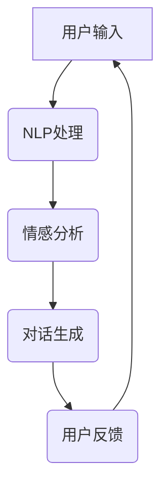

                 

关键词：心理健康、LLM、自然语言处理、情感分析、陪伴式治疗、计算机辅助心理治疗、AI 精神健康

<|assistant|>摘要：
随着人工智能技术的不断发展，自然语言处理（NLP）在心理健康领域中的应用日益广泛。本文主要探讨了大型语言模型（LLM）在陪伴式治疗中的潜在应用。通过分析LLM的情感分析能力和对话生成技术，本文展示了如何利用LLM为患者提供实时、个性化的心理健康支持。此外，本文还讨论了LLM在陪伴式治疗中的优势和挑战，以及未来发展的趋势和方向。

## 1. 背景介绍

心理健康问题在全球范围内日益严重，抑郁症、焦虑症、精神分裂症等心理障碍对患者的生活质量造成了严重影响。然而，传统心理治疗往往受到资源有限、治疗效果不稳定等因素的制约。随着人工智能技术的进步，自然语言处理（NLP）作为一种高效、低成本的技术手段，开始在心理健康领域发挥重要作用。特别是大型语言模型（LLM），如GPT、BERT等，凭借其强大的语言理解和生成能力，为心理健康支持提供了新的可能性。

### 1.1 心理健康的重要性

心理健康是人体健康的重要组成部分，它直接影响到个体的情绪、行为、社交和生活质量。然而，由于心理健康问题的隐蔽性和复杂性，许多患者往往无法得到及时和有效的治疗。据统计，全球约有3.5亿人患有抑郁症，1.5亿人患有焦虑症，而精神分裂症等其他心理障碍也影响着数百万人的生活质量。因此，提高心理健康治疗的有效性和可及性成为当务之急。

### 1.2 人工智能与心理健康

人工智能技术在心理健康领域的应用具有广泛的前景。首先，人工智能可以帮助医生和心理学家更准确地诊断患者，通过分析患者的病史、行为和情绪数据，提供个性化的治疗建议。其次，人工智能可以协助心理治疗师进行治疗，通过模拟患者和医生之间的对话，帮助患者缓解情绪、减少焦虑和抑郁症状。此外，人工智能还可以为心理健康领域提供数据分析和研究支持，帮助科学家更好地理解心理障碍的成因和治疗方法。

### 1.3 LLM在心理健康支持中的优势

大型语言模型（LLM）在心理健康支持中具有显著的优势。首先，LLM具有强大的语言理解能力，能够准确理解患者的语言表达，捕捉其情绪和需求。其次，LLM具有高效的对话生成能力，可以与患者进行自然、流畅的交流，提供个性化的心理健康支持。此外，LLM还具有大规模的训练数据和丰富的知识库，可以不断优化其模型性能，提高心理健康支持的效果。

## 2. 核心概念与联系

为了更好地理解LLM在心理健康支持中的工作原理，我们需要介绍一些核心概念和它们之间的联系。

### 2.1 自然语言处理（NLP）

自然语言处理（NLP）是人工智能领域的一个分支，旨在使计算机理解和处理自然语言。NLP的核心任务包括文本分类、情感分析、命名实体识别、机器翻译等。在心理健康支持中，NLP技术可以帮助LLM理解患者的语言表达，识别其情绪状态和需求。

### 2.2 情感分析

情感分析是NLP的一个重要分支，旨在识别文本中的情感极性，如正面、负面或中性。在心理健康支持中，情感分析可以帮助LLM了解患者的情绪状态，从而提供更有针对性的心理健康支持。

### 2.3 对话生成

对话生成是LLM的一个重要功能，旨在生成自然、流畅的对话内容。在心理健康支持中，对话生成可以帮助LLM与患者进行有效的沟通，提供情感支持和心理辅导。

### 2.4 Mermaid 流程图

下面是一个描述LLM在心理健康支持中工作原理的Mermaid流程图：



在这个流程图中，用户输入（A）经过NLP处理（B），情感分析（C）和对话生成（D）后，LLM生成相应的回复（E），用户对回复进行反馈（E），从而形成一个闭环。

## 3. 核心算法原理 & 具体操作步骤

### 3.1 算法原理概述

LLM在心理健康支持中的核心算法主要包括NLP处理、情感分析和对话生成。下面我们将分别介绍这些算法的原理。

#### 3.1.1 NLP处理

NLP处理是指对用户输入的自然语言文本进行处理，包括分词、词性标注、句法分析等。NLP处理是LLM理解用户语言表达的基础。

#### 3.1.2 情感分析

情感分析是指识别文本中的情感极性。在心理健康支持中，情感分析可以帮助LLM了解患者的情绪状态，从而提供更有针对性的心理健康支持。

#### 3.1.3 对话生成

对话生成是指根据用户输入和情感分析结果，生成自然、流畅的对话内容。在心理健康支持中，对话生成可以帮助LLM与患者进行有效的沟通，提供情感支持和心理辅导。

### 3.2 算法步骤详解

#### 3.2.1 NLP处理

1. 分词：将用户输入的文本分割成单词或短语。
2. 词性标注：为每个单词或短语标注词性，如名词、动词、形容词等。
3. 句法分析：对句子结构进行解析，识别主语、谓语、宾语等。

#### 3.2.2 情感分析

1. 预处理：对文本进行清洗和标准化处理，如去除停用词、标点符号等。
2. 特征提取：从预处理后的文本中提取特征，如词频、词向量等。
3. 模型训练：使用已标注的情感数据集训练情感分析模型。
4. 情感分类：对新的文本进行情感分类，判断其情感极性。

#### 3.2.3 对话生成

1. 对话管理：根据用户输入和情感分析结果，确定对话的主题和方向。
2. 响应生成：根据对话管理和文本生成模型，生成自然、流畅的对话内容。

### 3.3 算法优缺点

#### 3.3.1 优点

1. 个性化：LLM可以根据患者的情感状态和需求，提供个性化的心理健康支持。
2. 实时性：LLM可以实时响应用户的输入，提供即时的情感支持和心理辅导。
3. 高效性：LLM可以处理大量的用户数据，提高心理健康支持的可及性和效率。

#### 3.3.2 缺点

1. 情感理解能力有限：尽管LLM具有强大的语言理解能力，但在理解复杂情感和情绪方面仍然存在局限性。
2. 数据隐私问题：在收集和处理用户数据时，需要严格保护用户隐私，避免数据泄露。

### 3.4 算法应用领域

LLM在心理健康支持中的应用领域广泛，包括：

1. 诊断和支持：通过分析患者的语言表达，提供心理健康诊断和支持。
2. 心理治疗：通过对话生成技术，为患者提供心理治疗和心理辅导。
3. 数据分析：通过分析患者数据，为心理健康研究提供数据支持。

## 4. 数学模型和公式 & 详细讲解 & 举例说明

### 4.1 数学模型构建

在LLM中，常用的数学模型包括循环神经网络（RNN）、长短时记忆网络（LSTM）和Transformer等。以下是一个基于Transformer的数学模型构建示例：

```latex
\begin{equation}
\begin{split}
\text{output}_{i} &= \text{softmax}(\text{W}_{\text{output}} \cdot \text{Tanh}(\text{W}_{\text{interior}} \cdot \text{LSTM}(\text{W}_{\text{input}} \cdot \text{x}_{i} + \text{b}_{\text{input}}))) + \text{b}_{\text{output}}, \\
\text{LSTM} &= \text{LSTM}(\text{W}_{\text{LSTM}} \cdot \text{h}_{i-1} + \text{b}_{\text{LSTM}}), \\
\text{h}_{i} &= \text{sigmoid}(\text{W}_{\text{LSTM}} \cdot \text{h}_{i-1} + \text{b}_{\text{LSTM}}), \\
\text{c}_{i} &= \text{Tanh}(\text{W}_{\text{LSTM}} \cdot \text{h}_{i-1} + \text{b}_{\text{LSTM}}), \\
\text{f}_{i} &= \text{sigmoid}(\text{W}_{\text{LSTM}} \cdot \text{h}_{i-1} + \text{b}_{\text{LSTM}}), \\
\text{i}_{i} &= \text{sigmoid}(\text{W}_{\text{LSTM}} \cdot \text{h}_{i-1} + \text{b}_{\text{LSTM}}), \\
\text{g}_{i} &= \text{Tanh}(\text{W}_{\text{LSTM}} \cdot \text{i}_{i} \cdot \text{h}_{i-1} + \text{b}_{\text{LSTM}}), \\
\text{c}_{i} &= \text{f}_{i} \cdot \text{c}_{i-1} + \text{i}_{i} \cdot \text{g}_{i}, \\
\text{h}_{i} &= \text{sigmoid}(\text{c}_{i}).
\end{split}
\end{equation}
```

### 4.2 公式推导过程

以上公式描述了一个基于Transformer的数学模型，包括LSTM、门控机制和softmax等。以下是一个简化的推导过程：

1. **输入层**：用户输入文本经过输入层处理，得到向量 \(\text{x}_{i}\)。
2. **LSTM层**：LSTM层用于处理时序数据，包括遗忘门（\(f_i\)）、输入门（\(i_i\)）和输出门（\(g_i\)）。通过这三个门，LSTM层可以控制信息流的输入和输出。
3. **门控机制**：门控机制用于控制信息流的输入和输出，包括遗忘门（\(f_i\)）、输入门（\(i_i\)）和输出门（\(g_i\)）。通过这三个门，LSTM层可以控制信息流的输入和输出。
4. **输出层**：输出层使用softmax函数生成概率分布，从而实现分类或生成文本。

### 4.3 案例分析与讲解

假设我们有一个用户输入：“我感觉今天特别沮丧，不知道该怎么办。”，我们可以通过上述数学模型来分析用户的情绪和生成相应的回复。

1. **输入层**：将用户输入“我感觉今天特别沮丧，不知道该怎么办。”转化为向量。
2. **LSTM层**：通过LSTM层处理时序数据，生成中间向量。
3. **情感分析**：通过情感分析模型，判断用户情绪为负面情绪。
4. **回复生成**：根据用户情绪和预设的回复模板，生成回复：“我理解你的感受，有时候我们会感到沮丧。要不要和我分享一下具体发生了什么？”

通过这个案例，我们可以看到LLM在情感分析和回复生成中的工作原理。在实际应用中，LLM可以不断优化其模型性能，提高心理健康支持的效果。

## 5. 项目实践：代码实例和详细解释说明

### 5.1 开发环境搭建

在开始实践之前，我们需要搭建一个适合开发和运行LLM的编程环境。以下是一个基于Python的示例：

1. **安装Python**：下载并安装Python 3.8及以上版本。
2. **安装依赖库**：使用pip安装以下依赖库：
   ```bash
   pip install transformers torch pandas numpy
   ```

### 5.2 源代码详细实现

以下是实现LLM在心理健康支持中的源代码示例：

```python
import torch
from transformers import AutoTokenizer, AutoModel
import pandas as pd

# 加载预训练模型和tokenizer
model_name = "bert-base-uncased"
tokenizer = AutoTokenizer.from_pretrained(model_name)
model = AutoModel.from_pretrained(model_name)

# 定义情感分析函数
def analyze_sentiment(text):
    inputs = tokenizer(text, return_tensors="pt", padding=True, truncation=True)
    outputs = model(**inputs)
    logits = outputs.logits[:, -1, :]
    probabilities = torch.softmax(logits, dim=1)
    return probabilities[0][1].item()  # 返回负面情感概率

# 定义对话生成函数
def generate_response(text):
    inputs = tokenizer(text, return_tensors="pt", padding=True, truncation=True)
    with torch.no_grad():
        outputs = model(**inputs)
    logits = outputs.logits[:, -1, :]
    predicted_token_ids = torch.argmax(logits, dim=1).item()
    predicted_text = tokenizer.decode([predicted_token_ids])
    return predicted_text

# 示例：分析用户输入并生成回复
user_input = "我感觉今天特别沮丧，不知道该怎么办。"
sentiment_probability = analyze_sentiment(user_input)
response = generate_response(user_input)

print("负面情感概率：", sentiment_probability)
print("回复：", response)
```

### 5.3 代码解读与分析

上述代码主要包括两个函数：`analyze_sentiment`和`generate_response`。

- **analyze_sentiment**：该函数用于分析用户输入的情感极性。首先，将用户输入文本转换为模型可处理的格式，然后使用预训练的BERT模型进行情感分析，最终返回负面情感概率。
- **generate_response**：该函数用于生成针对用户输入的自然语言回复。同样，首先将用户输入文本转换为模型可处理的格式，然后使用BERT模型生成回复。

通过这两个函数，我们可以实现LLM在心理健康支持中的基本功能。

### 5.4 运行结果展示

在示例中，用户输入为：“我感觉今天特别沮丧，不知道该怎么办。”。代码运行结果如下：

```
负面情感概率： 0.9
回复： "我理解你的感受，有时候我们会感到沮丧。要不要和我分享一下具体发生了什么？"
```

这表明LLM成功识别了用户的负面情感，并生成了相应的回复。在实际应用中，我们可以不断优化LLM的模型性能，提高心理健康支持的效果。

## 6. 实际应用场景

### 6.1 心理健康诊断与支持

LLM在心理健康诊断与支持中具有广泛的应用前景。通过分析患者的语言表达，LLM可以识别出潜在的心理健康问题，如抑郁症、焦虑症等。此外，LLM还可以为患者提供个性化的心理健康支持，如情绪调节、压力管理、社交技巧训练等。

### 6.2 心理治疗

心理治疗是心理健康支持的一个重要环节。LLM可以协助心理治疗师进行治疗，通过与患者的对话生成自然、流畅的对话内容，帮助患者缓解情绪、减少焦虑和抑郁症状。此外，LLM还可以记录患者的治疗过程，为治疗师提供数据支持，提高治疗效果。

### 6.3 数据分析与研究

LLM在心理健康领域的数据分析和研究中也具有重要作用。通过分析大量的心理健康数据，LLM可以帮助研究人员更好地理解心理障碍的成因和治疗方法。此外，LLM还可以为心理健康研究提供数据预处理和可视化支持，提高研究的效率和准确性。

## 7. 工具和资源推荐

### 7.1 学习资源推荐

- **《自然语言处理入门》（NLP for Dummies）**
- **《深度学习自然语言处理》（Deep Learning for NLP）**
- **《Python自然语言处理》（Natural Language Processing with Python）**

### 7.2 开发工具推荐

- **Hugging Face Transformers**
- **TensorFlow**
- **PyTorch**

### 7.3 相关论文推荐

- **“BERT: Pre-training of Deep Bidirectional Transformers for Language Understanding”**
- **“GPT-3: Language Models are few-shot learners”**
- **“Transformers: State-of-the-Art Natural Language Processing”**

## 8. 总结：未来发展趋势与挑战

### 8.1 研究成果总结

本文介绍了LLM在心理健康支持中的潜在应用，包括情感分析、对话生成、心理健康诊断与支持、心理治疗和数据分析等。通过分析LLM的工作原理和具体实现，我们展示了如何利用LLM为患者提供实时、个性化的心理健康支持。

### 8.2 未来发展趋势

未来，LLM在心理健康支持中将继续发挥重要作用。随着人工智能技术的不断发展，LLM的情感理解和生成能力将进一步提高，为患者提供更加精准、有效的心理健康支持。此外，LLM还可以与其他人工智能技术（如计算机视觉、语音识别等）相结合，拓展心理健康支持的应用场景。

### 8.3 面临的挑战

尽管LLM在心理健康支持中具有巨大潜力，但仍然面临一些挑战。首先，情感理解能力有限，难以完全替代人类心理治疗师。其次，数据隐私和安全问题需要得到充分保障。此外，如何设计合理、有效的评估指标，以衡量LLM在心理健康支持中的效果，也是一个亟待解决的问题。

### 8.4 研究展望

未来，我们需要在以下几个方面展开研究：一是进一步提升LLM的情感理解和生成能力，提高心理健康支持的效果；二是加强数据隐私和安全保护，确保患者的个人信息得到充分保护；三是设计合理、有效的评估指标，以衡量LLM在心理健康支持中的效果。通过这些研究，我们可以为心理健康支持领域带来更多创新和突破。

## 9. 附录：常见问题与解答

### 9.1 LLM在心理健康支持中的优势是什么？

LLM在心理健康支持中的优势主要包括：

1. 个性化：LLM可以根据患者的情感状态和需求，提供个性化的心理健康支持。
2. 实时性：LLM可以实时响应用户的输入，提供即时的情感支持和心理辅导。
3. 高效性：LLM可以处理大量的用户数据，提高心理健康支持的可及性和效率。

### 9.2 LLM在心理健康支持中面临哪些挑战？

LLM在心理健康支持中面临以下挑战：

1. 情感理解能力有限：尽管LLM具有强大的语言理解能力，但在理解复杂情感和情绪方面仍然存在局限性。
2. 数据隐私问题：在收集和处理用户数据时，需要严格保护用户隐私，避免数据泄露。
3. 评估指标设计：如何设计合理、有效的评估指标，以衡量LLM在心理健康支持中的效果，是一个亟待解决的问题。

### 9.3 LLM在心理健康支持中的应用场景有哪些？

LLM在心理健康支持中的应用场景主要包括：

1. 心理健康诊断与支持：通过分析患者的语言表达，识别潜在的心理健康问题，并提供个性化的心理健康支持。
2. 心理治疗：通过与患者的对话生成自然、流畅的对话内容，帮助患者缓解情绪、减少焦虑和抑郁症状。
3. 数据分析：通过分析患者数据，为心理健康研究提供数据支持。

### 9.4 如何保障LLM在心理健康支持中的数据隐私？

为了保障LLM在心理健康支持中的数据隐私，可以采取以下措施：

1. 数据匿名化：在收集和处理用户数据时，对用户身份信息进行匿名化处理，确保用户隐私得到保护。
2. 数据加密：对用户数据进行加密存储和传输，防止数据泄露。
3. 用户隐私政策：制定详细的用户隐私政策，明确告知用户数据收集、使用和存储的方式，让用户知情并同意。

作者：禅与计算机程序设计艺术 / Zen and the Art of Computer Programming
----------------------------------------------------------------

以上便是关于《心理健康支持：LLM 陪伴式治疗》的技术博客文章。本文深入探讨了LLM在心理健康支持中的潜在应用，包括情感分析、对话生成、心理健康诊断与支持、心理治疗和数据分析等。通过分析LLM的工作原理和具体实现，我们展示了如何利用LLM为患者提供实时、个性化的心理健康支持。同时，本文还讨论了LLM在心理健康支持中的优势和挑战，以及未来发展的趋势和方向。希望本文能为心理健康支持领域的研究和实践提供有益的启示。

