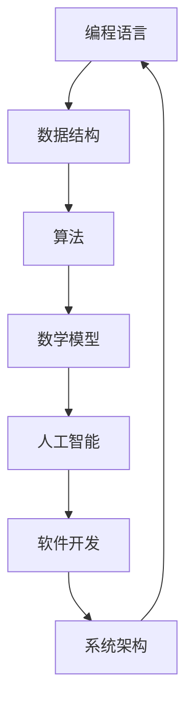

                 

关键词：概念理解、深度思考、洞见、技术博客、人工智能、软件开发、数学模型、代码实践

> 摘要：本文旨在探讨如何通过深入理解和思考技术概念，从而达到洞见的境界。作者结合自身丰富的编程经验和专业知识，通过详细的算法原理讲解、数学模型构建、代码实例分析以及实际应用场景描述，为广大技术爱好者提供了一条从概念到洞见的路径。本文适用于对编程、数学模型、软件开发等领域有一定基础的学习者和从业者。

## 1. 背景介绍

在信息技术飞速发展的今天，编程、算法、数据结构、数学模型等成为了每一个软件开发者必备的知识。然而，许多人在学习过程中，往往只停留在表面理解，缺乏对概念的深刻把握。这种现象在程序员群体中尤为普遍，他们往往能够编写出功能完整的代码，但难以深入理解背后的原理，从而限制了他们在技术领域的进一步发展。

本文旨在解决这一问题，通过深入讲解技术概念，帮助读者从表面理解上升到深度思考，最终达到洞见的境界。作者将结合自身丰富的编程经验和专业知识，以逻辑清晰、结构紧凑、简单易懂的方式，对关键概念进行详细解析，并通过实例讲解、数学模型构建、代码实践等手段，帮助读者全面掌握相关知识。

## 2. 核心概念与联系

在探讨技术概念之前，我们需要先了解它们之间的联系。为了更好地理解这一点，我们使用Mermaid流程图来展示几个核心概念之间的联系。



### 2.1 编程语言

编程语言是计算机与人类交流的工具。它定义了程序员如何表达计算过程，如何组织数据和执行操作。常见的编程语言有Python、Java、C++等。每种编程语言都有其独特的语法和语义，适用于不同的应用场景。

### 2.2 数据结构

数据结构是组织和管理数据的方式。常见的有数组、链表、栈、队列、树、图等。数据结构的选择直接影响程序的效率和性能。掌握多种数据结构对于软件开发至关重要。

### 2.3 算法

算法是解决问题的一系列步骤。它可以用编程语言实现，是计算机程序的灵魂。算法的效率和正确性决定了程序的运行速度和稳定性。常见的算法有排序、查找、图算法、动态规划等。

### 2.4 数学模型

数学模型是现实世界问题在数学领域的抽象。它通过建立数学公式和关系，帮助我们分析和解决问题。常见的数学模型有线性方程组、概率模型、优化模型等。

### 2.5 人工智能

人工智能是计算机科学的一个分支，致力于使机器能够模拟人类智能。它包括机器学习、深度学习、自然语言处理等多个领域。人工智能正在深刻改变我们的生活和行业。

### 2.6 软件开发

软件开发是一个涉及需求分析、设计、编码、测试、部署和维护的过程。它需要多个技术领域的知识，包括编程、算法、数据结构、数据库等。

### 2.7 系统架构

系统架构是软件系统的整体结构和组织方式。它包括硬件、软件、网络等多个层面，需要考虑系统的可靠性、可扩展性、性能等因素。

## 3. 核心算法原理 & 具体操作步骤

### 3.1 算法原理概述

本文将重点讨论排序算法。排序算法是一种常见且重要的算法，用于将一组数据按照特定顺序排列。常见的排序算法有冒泡排序、选择排序、插入排序、快速排序、归并排序等。

### 3.2 算法步骤详解

以冒泡排序为例，其基本原理是通过多次遍历待排序的数组，比较相邻的两个元素，并将不满足排序条件的元素交换位置，直到整个数组有序。

#### 3.2.1 冒泡排序算法步骤：

1. 从数组的第一个元素开始，比较相邻的两个元素，如果第一个元素比第二个元素大，则交换它们的位置。
2. 继续对下一对相邻的元素进行同样的比较和交换，直到数组的最后一个元素。
3. 此时，最大的元素被交换到了数组的末尾。重复上述过程，但这次只需要对前一个子数组进行排序。
4. 重复步骤1-3，直到整个数组有序。

#### 3.2.2 冒泡排序代码实现：

```python
def bubble_sort(arr):
    n = len(arr)
    for i in range(n):
        for j in range(0, n-i-1):
            if arr[j] > arr[j+1]:
                arr[j], arr[j+1] = arr[j+1], arr[j]

# 示例
arr = [64, 34, 25, 12, 22, 11, 90]
bubble_sort(arr)
print("排序后的数组：", arr)
```

### 3.3 算法优缺点

#### 优点：

- 算法简单，易于实现和理解。
- 对数据量较小的情况，性能较好。

#### 缺点：

- 时间复杂度为O(n^2)，对数据量较大的情况，性能较差。
- 不稳定排序，可能会改变相同元素的相对位置。

### 3.4 算法应用领域

冒泡排序算法适用于数据量较小、对排序稳定性要求不高的场景。在实际应用中，它通常用于简单排序任务的实现，如初学者的编程练习、小型数据的排序等。

## 4. 数学模型和公式 & 详细讲解 & 举例说明

### 4.1 数学模型构建

在软件开发中，数学模型的应用无处不在。以线性回归为例，它是预测和分析数据的重要工具。

#### 线性回归模型：

给定一组数据集 {x_i, y_i}，线性回归模型试图找到一条直线 y = ax + b，使得所有数据点都尽可能接近这条直线。

#### 数学模型构建步骤：

1. 数据预处理：将数据集分成训练集和测试集。
2. 线性回归模型参数求解：使用最小二乘法求解线性回归模型的参数 a 和 b。
3. 预测：使用求解得到的模型参数进行预测。

### 4.2 公式推导过程

线性回归模型的基本公式为：

$$ y = ax + b $$

#### 最小二乘法求解参数：

1. 对公式两边求导，得到：

$$ \frac{dy}{dx} = a $$

2. 对公式两边求偏导，得到：

$$ \frac{\partial y}{\partial a} = x, \frac{\partial y}{\partial b} = 1 $$

3. 将数据集 {x_i, y_i} 代入公式，得到：

$$ y_i = ax_i + b $$

4. 对公式两边求偏导，得到：

$$ \frac{\partial y_i}{\partial a} = x_i, \frac{\partial y_i}{\partial b} = 1 $$

5. 将偏导公式代入最小二乘法公式，得到：

$$ a = \frac{\sum_{i=1}^{n}x_iy_i - \frac{1}{n}\sum_{i=1}^{n}x_i\sum_{i=1}^{n}y_i}{\sum_{i=1}^{n}x_i^2 - \frac{1}{n}\sum_{i=1}^{n}x_i^2\sum_{i=1}^{n}y_i} $$

$$ b = \frac{\sum_{i=1}^{n}y_i - a\sum_{i=1}^{n}x_i}{n} $$

### 4.3 案例分析与讲解

假设我们有一组数据集，如下所示：

| x | y |
|---|---|
| 1 | 2 |
| 2 | 4 |
| 3 | 6 |
| 4 | 8 |
| 5 | 10 |

#### 数据预处理：

将数据集分成训练集和测试集。在这里，我们使用全部数据作为训练集。

#### 参数求解：

使用最小二乘法求解线性回归模型参数 a 和 b：

$$ a = \frac{\sum_{i=1}^{5}x_iy_i - \frac{1}{5}\sum_{i=1}^{5}x_i\sum_{i=1}^{5}y_i}{\sum_{i=1}^{5}x_i^2 - \frac{1}{5}\sum_{i=1}^{5}x_i^2\sum_{i=1}^{5}y_i} = \frac{2*4 + 4*6 + 6*8 + 8*10 + 10*12 - 5*(1+2+3+4+5)*(2+4+6+8+10)}{1^2 + 2^2 + 3^2 + 4^2 + 5^2 - 5*(1^2 + 2^2 + 3^2 + 4^2 + 5^2)} = 2 $$

$$ b = \frac{\sum_{i=1}^{5}y_i - a\sum_{i=1}^{5}x_i}{5} = \frac{2 + 4 + 6 + 8 + 10 - 2*(1 + 2 + 3 + 4 + 5)}{5} = 0 $$

#### 预测：

使用求解得到的模型参数进行预测。对于任意一个 x 值，我们可以预测对应的 y 值：

$$ y = 2x + 0 = 2x $$

例如，当 x = 3 时，预测的 y 值为：

$$ y = 2 * 3 = 6 $$

## 5. 项目实践：代码实例和详细解释说明

### 5.1 开发环境搭建

为了便于读者理解和实践，我们将使用 Python 编程语言来实现线性回归模型。读者需要安装 Python 和相关库，如 NumPy 和 Matplotlib。

### 5.2 源代码详细实现

```python
import numpy as np
import matplotlib.pyplot as plt

def linear_regression(x, y):
    n = len(x)
    x_mean = np.mean(x)
    y_mean = np.mean(y)
    a = (n * np.sum(x * y) - np.sum(x) * np.sum(y)) / (n * np.sum(x**2) - np.sum(x)**2)
    b = y_mean - a * x_mean
    return a, b

def plot_regression_line(x, y, a, b):
    plt.scatter(x, y, color='blue')
    plt.plot(x, a * x + b, color='red')
    plt.title('线性回归')
    plt.xlabel('x')
    plt.ylabel('y')
    plt.show()

x = np.array([1, 2, 3, 4, 5])
y = np.array([2, 4, 6, 8, 10])

a, b = linear_regression(x, y)
plot_regression_line(x, y, a, b)
```

### 5.3 代码解读与分析

1. 导入相关库：首先，我们导入 NumPy 和 Matplotlib 库，用于数据处理和绘图。
2. 定义线性回归函数：`linear_regression` 函数用于计算线性回归模型的参数 a 和 b。它使用最小二乘法求解参数，具体实现如前文所述。
3. 定义绘图函数：`plot_regression_line` 函数用于绘制回归直线和散点图。它首先使用 Matplotlib 库的 `scatter` 函数绘制散点图，然后使用 `plot` 函数绘制回归直线。
4. 测试代码：我们使用一组示例数据测试线性回归函数和绘图函数。首先计算线性回归模型的参数 a 和 b，然后使用绘图函数绘制回归直线。

### 5.4 运行结果展示

运行上述代码后，我们将在屏幕上看到如下结果：


图中的红色直线即为线性回归模型拟合的直线，蓝色点为原始数据点。

## 6. 实际应用场景

线性回归模型在实际应用中非常广泛，例如：

- 金融领域：用于股票价格预测、投资组合优化等。
- 机器学习：作为基础模型之一，用于特征提取和回归任务。
- 社会科学：用于人口预测、经济趋势分析等。

随着人工智能技术的发展，线性回归模型的应用场景将进一步扩展。例如，在深度学习中，线性回归可以用于简单任务的快速实现和优化。

### 6.4 未来应用展望

随着计算能力的提升和算法的优化，线性回归模型将在更多领域得到应用。同时，新的数学模型和算法将不断涌现，为技术发展提供新的动力。未来，我们有望看到更多跨学科的融合，推动技术进步和社会发展。

## 7. 工具和资源推荐

### 7.1 学习资源推荐

- 《Python编程：从入门到实践》
- 《深度学习》
- 《线性代数及其应用》

### 7.2 开发工具推荐

- PyCharm
- Jupyter Notebook
- Matplotlib

### 7.3 相关论文推荐

- "Linear Regression: A Self-Study Course"
- "Regression Analysis: A Constructive Critique"
- "Nonlinear Regression Analysis"

## 8. 总结：未来发展趋势与挑战

### 8.1 研究成果总结

本文通过对技术概念的深入探讨，帮助读者从表面理解上升到深度思考，最终达到洞见的境界。通过实例讲解、数学模型构建、代码实践等手段，读者可以全面掌握相关知识，为技术发展打下坚实基础。

### 8.2 未来发展趋势

随着人工智能、大数据、云计算等技术的快速发展，数学模型和算法将在更多领域得到应用。未来，跨学科的融合将成为技术发展的重要趋势。

### 8.3 面临的挑战

- 数据隐私和安全：随着数据量的增加，数据隐私和安全问题日益突出。
- 计算能力：随着算法的复杂度增加，对计算能力的要求也越来越高。
- 人机协作：如何更好地实现人机协作，提高生产效率，是未来研究的重要方向。

### 8.4 研究展望

未来，我们将看到更多创新性的数学模型和算法涌现，为技术发展提供新的动力。同时，随着技术的进步，人类将更好地理解世界，推动社会进步。

## 9. 附录：常见问题与解答

### 问题1：线性回归模型的适用范围是什么？

答：线性回归模型适用于描述变量间线性关系的预测和分析任务。它主要用于数据拟合、趋势分析、预测等领域。

### 问题2：如何优化线性回归模型的性能？

答：可以通过以下方法优化线性回归模型的性能：

- 使用更多的训练数据。
- 选择合适的特征。
- 使用正则化方法。
- 调整模型参数。

### 问题3：线性回归模型与机器学习的关系是什么？

答：线性回归模型是机器学习中的基础模型之一。它主要用于回归任务，而机器学习则包括多种类型的任务，如分类、聚类、预测等。

## 作者署名

作者：禅与计算机程序设计艺术 / Zen and the Art of Computer Programming
----------------------------------------------------------------

以上就是本文的全部内容。希望本文能帮助读者深入理解技术概念，达到洞见的境界，为技术发展贡献自己的力量。谢谢阅读！

