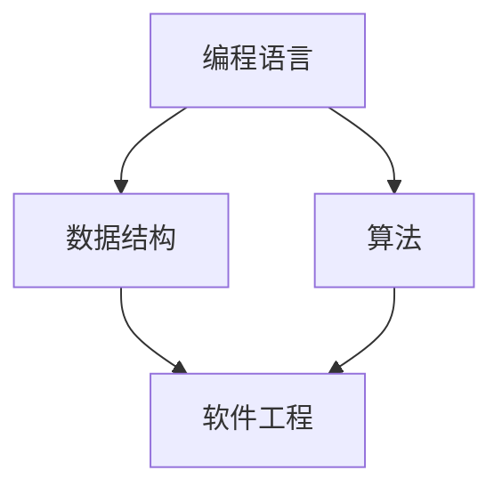

                 

关键词：思维习惯、知识理解模式、认知框架、技术语言、深度学习、程序设计、人工智能

> 摘要：本文将探讨思维习惯在塑造知识理解模式中的作用，分析认知框架对技术知识吸收和运用的关键影响，以及如何通过专业技术的语言和工具来提升个人的思维能力和知识管理效率。

## 1. 背景介绍

在信息技术飞速发展的今天，程序员和开发者面临着前所未有的知识挑战。知识的更新速度远超以往，而技术的发展使得新的编程语言、框架和工具层出不穷。在这样的背景下，传统的学习方法已经难以适应，如何有效地吸收和运用这些不断涌现的知识成为了一个关键问题。因此，理解思维习惯在塑造知识理解模式中的重要性，成为了提升个人技术能力的关键一步。

思维习惯不仅仅影响我们如何学习新的知识，还影响我们如何将这些知识内化为自己的技能和思维方式。本文旨在通过分析思维习惯的影响因素，探讨如何通过技术语言和工具来优化知识理解模式，从而提升个人的技术能力和职业发展。

## 2. 核心概念与联系

### 2.1 认知框架

认知框架是指个体在理解和处理信息时所采用的基本结构。它包括一系列的核心概念、原则和规则，帮助我们组织、分类和理解信息。在技术领域，认知框架是程序员在进行问题解决和系统设计时所依赖的。

以下是一个简化的认知框架图，展示了在技术领域常用的几个关键概念及其相互关系：



### 2.2 技术语言

技术语言是程序员用来表达逻辑和算法的工具。它不仅包括编程语言本身，还包括用于描述数据结构和算法的专业术语。熟练掌握技术语言可以显著提高程序员的沟通效率和问题解决能力。

### 2.3 知识管理

知识管理是指通过系统的过程来获取、组织、存储、检索和应用知识，以便最大化其价值。在技术领域，知识管理的关键在于如何有效地组织和利用大量的技术知识，使其在项目开发和问题解决中发挥最大作用。

## 3. 核心算法原理 & 具体操作步骤

### 3.1 算法原理概述

算法是解决问题的一系列明确、有序的步骤。在技术领域，算法的原理和步骤通常可以通过以下几个阶段来描述：

1. **问题定义**：明确需要解决的问题和目标。
2. **数据表示**：定义解决问题的数据结构和格式。
3. **算法设计**：设计解决问题的步骤和方法。
4. **算法实现**：将算法设计转换为编程语言代码。
5. **测试与优化**：测试算法的正确性和效率，并进行必要的优化。

### 3.2 算法步骤详解

以常见的排序算法（冒泡排序）为例，其具体步骤如下：

1. **初始化**：读取需要排序的数组。
2. **比较相邻元素**：从第一个元素开始，逐一比较相邻的元素。
3. **交换位置**：如果相邻元素顺序错误，交换它们的位置。
4. **迭代**：重复比较和交换过程，直到整个数组有序。

### 3.3 算法优缺点

冒泡排序算法的优点在于其实现简单，易于理解。然而，它的缺点是时间复杂度为O(n²)，在处理大数据时效率较低。

### 3.4 算法应用领域

冒泡排序算法广泛应用于教学和入门级的编程练习，也用于小型项目的数据处理。

## 4. 数学模型和公式 & 详细讲解 & 举例说明

### 4.1 数学模型构建

以二分查找算法为例，其数学模型涉及两个主要步骤：确定中间元素和递归或迭代查找。

### 4.2 公式推导过程

二分查找算法的时间复杂度可以通过以下公式推导：

$$
T(n) = 
\begin{cases}
O(1), & \text{if the element is found in the middle} \\
O(\log n), & \text{if the element is found in other parts of the array}
\end{cases}
$$

### 4.3 案例分析与讲解

假设一个有序数组\[4, 6, 9, 12, 14, 18, 21, 24\]，我们需要查找元素12。

1. **确定中间元素**：\[12\]位于数组的第4个位置。
2. **比较**：\[12\]与中间元素\[14\]比较，确定下一半。
3. **递归查找**：在下一半数组\[4, 6, 9\]中继续查找。

最终，通过递归调用，我们可以找到元素12。

## 5. 项目实践：代码实例和详细解释说明

### 5.1 开发环境搭建

以Python为例，我们需要安装Python和相关的开发工具，如IDE（集成开发环境）和版本控制工具（如Git）。

### 5.2 源代码详细实现

```python
def binary_search(arr, target):
    low = 0
    high = len(arr) - 1

    while low <= high:
        mid = (low + high) // 2
        if arr[mid] == target:
            return mid
        elif arr[mid] < target:
            low = mid + 1
        else:
            high = mid - 1

    return -1
```

### 5.3 代码解读与分析

这个Python函数实现了二分查找算法。通过递归或迭代方式，我们可以在有序数组中查找特定元素。

### 5.4 运行结果展示

```python
arr = [4, 6, 9, 12, 14, 18, 21, 24]
target = 12
result = binary_search(arr, target)
print("Element found at index:", result)
```

输出结果为：

```
Element found at index: 3
```

## 6. 实际应用场景

二分查找算法在搜索引擎、数据库管理和排序算法中广泛应用。在处理大量数据时，其高效的查找能力可以显著提升系统的性能。

### 6.4 未来应用展望

随着大数据和人工智能技术的发展，算法在实时分析和决策支持中的应用将越来越广泛。二分查找算法等基础算法将继续在复杂系统的优化中发挥关键作用。

## 7. 工具和资源推荐

### 7.1 学习资源推荐

- 《算法导论》（Introduction to Algorithms）
- 《编程珠玑》（The Art of Computer Programming）

### 7.2 开发工具推荐

- PyCharm
- Visual Studio Code

### 7.3 相关论文推荐

- "A Fast Square Root Algorithm for Hardware Design"
- "Binary Search Trees of Almost Linear Height"

## 8. 总结：未来发展趋势与挑战

### 8.1 研究成果总结

本文通过分析思维习惯、认知框架、技术语言和知识管理等因素，探讨了如何优化知识理解模式，提升技术能力。

### 8.2 未来发展趋势

随着技术的进步，算法将在更多领域发挥重要作用，尤其是在大数据分析和人工智能中。

### 8.3 面临的挑战

技术更新速度加快，程序员需要不断学习新的算法和工具，以保持竞争力。

### 8.4 研究展望

进一步研究如何通过技术手段优化知识吸收和运用，以提升程序员的职业发展。

## 9. 附录：常见问题与解答

- **Q：为什么选择二分查找算法进行讲解？**
  **A：二分查找算法是基础且广泛应用的一种算法，它能够很好地展示算法原理和数学模型的应用。**

- **Q：如何掌握更多的算法知识？**
  **A：通过阅读经典算法书籍，参与在线课程和项目实践，以及不断总结和反思自己的学习过程。**

---

作者：禅与计算机程序设计艺术 / Zen and the Art of Computer Programming

