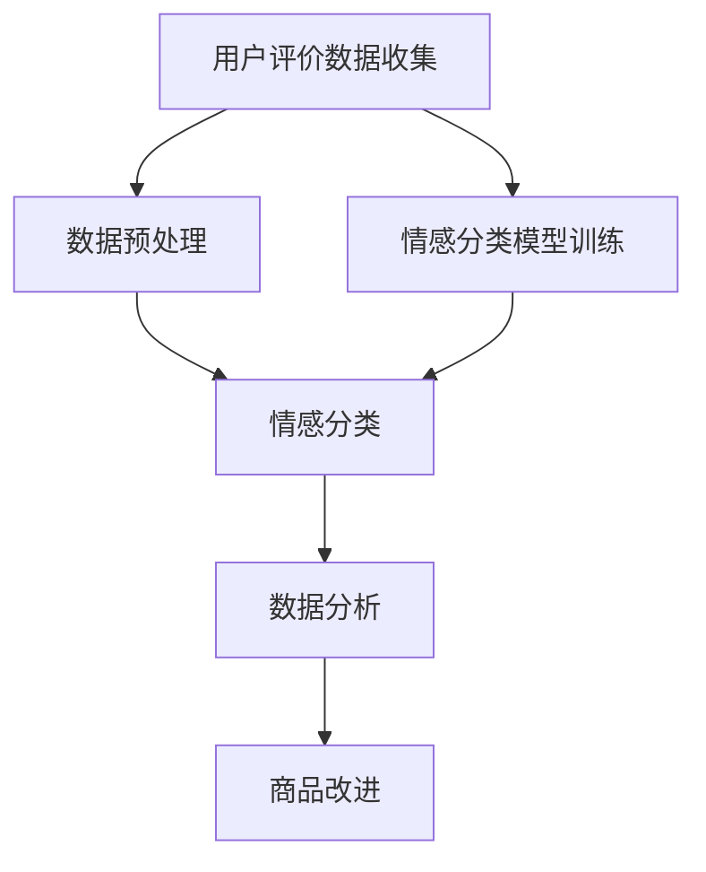

                 

关键词：情感分析、电商、用户评价、商品改进、文本挖掘、机器学习、自然语言处理、情感分类、情感极性

摘要：本文将深入探讨情感分析技术在电商领域中的应用。情感分析是一种利用自然语言处理技术来识别文本中情感倾向的方法，它能够帮助电商企业从用户评价中提取有用的信息，从而改进商品质量和用户满意度。本文将首先介绍情感分析的基本概念和原理，然后详细讲解其在电商领域中的应用场景和操作步骤，最后展望其未来的发展趋势和面临的挑战。

## 1. 背景介绍

随着互联网技术的飞速发展，电商行业迎来了前所未有的繁荣。用户通过在线平台对商品进行评价，已经成为电商生态系统中的一个重要组成部分。这些评价数据包含了用户对商品的真实情感和意见，是企业改进商品设计和提高用户满意度的重要依据。然而，由于评价数据的数量庞大且形式多样，如何有效地提取和利用这些数据成为了一个重要的研究课题。

情感分析作为一种自然语言处理技术，旨在通过计算机程序识别文本中的情感倾向。在电商领域，情感分析的应用主要体现在以下几个方面：

1. **用户评价分析**：通过情感分析技术，电商企业可以快速了解用户对商品的评价情感，从而识别出产品的问题和优点。
2. **商品推荐**：情感分析可以帮助推荐系统更好地理解用户的需求和偏好，提供更加个性化的商品推荐。
3. **商品改进**：基于用户评价的情感分析结果，企业可以及时调整商品设计和营销策略，提高用户满意度。
4. **品牌监测**：通过监测社交媒体上的用户反馈，企业可以实时掌握品牌形象和市场口碑。

## 2. 核心概念与联系

### 情感分析的基本概念

情感分析（Sentiment Analysis），也称为意见挖掘，是指使用自然语言处理（NLP）技术来识别文本中的情感倾向。情感倾向通常分为正面、负面和客观三种：

- **正面情感**：表达积极的情感或态度，如“喜欢”、“满意”。
- **负面情感**：表达消极的情感或态度，如“失望”、“不喜欢”。
- **客观情感**：表达中立的情感或态度，不带有明显的情感倾向。

### 情感分析的架构

情感分析的架构通常包括以下几个主要部分：

1. **数据预处理**：包括文本清洗、分词、去停用词等步骤，为后续的情感分类做准备。
2. **特征提取**：将预处理后的文本转化为计算机可以处理的特征向量。
3. **情感分类模型**：使用机器学习算法训练分类模型，对文本进行情感分类。
4. **结果输出**：将分类结果以可视化或报告的形式呈现给用户。

### 情感分析在电商领域的应用架构

在电商领域，情感分析的应用架构可以概括为以下几个步骤：

1. **用户评价数据收集**：从电商平台收集用户对商品的评论数据。
2. **数据预处理**：对评论数据进行清洗和预处理，去除噪声和冗余信息。
3. **情感分类**：使用情感分类模型对预处理后的评论进行情感分类，得到正面、负面和客观情感的分布。
4. **数据分析**：对情感分类结果进行分析，识别用户对商品的满意度和不满意度，找出改进的方向。
5. **商品改进**：根据分析结果调整商品设计和营销策略，提高用户满意度。

### Mermaid 流程图



## 3. 核心算法原理 & 具体操作步骤

### 3.1 算法原理概述

情感分类算法的核心是构建一个分类模型，该模型可以根据文本的特征向量预测文本的情感倾向。常见的情感分类算法包括基于规则的方法、基于机器学习的方法和基于深度学习的方法。

1. **基于规则的方法**：通过手工编写规则，将文本划分为情感类别。这种方法简单但效率较低。
2. **基于机器学习的方法**：使用机器学习算法训练分类模型，如支持向量机（SVM）、朴素贝叶斯（Naive Bayes）和逻辑回归（Logistic Regression）等。这种方法具有较高的准确率和效率。
3. **基于深度学习的方法**：使用深度神经网络训练分类模型，如卷积神经网络（CNN）、循环神经网络（RNN）和长短期记忆网络（LSTM）等。这种方法在处理大规模文本数据和复杂情感关系方面具有显著优势。

### 3.2 算法步骤详解

1. **数据收集与预处理**：
   - 从电商平台上收集用户评价数据。
   - 使用自然语言处理技术进行文本清洗和预处理，如分词、去停用词、词干提取等。

2. **特征提取**：
   - 使用词袋模型（Bag of Words, BOW）或词嵌入（Word Embedding）技术将文本转化为特征向量。
   - 常见的词袋模型包括TF-IDF（Term Frequency-Inverse Document Frequency）和Word2Vec等。

3. **情感分类模型训练**：
   - 选择合适的机器学习算法（如SVM、Naive Bayes、逻辑回归等）或深度学习算法（如CNN、RNN、LSTM等）训练分类模型。
   - 使用训练数据集对分类模型进行训练，得到模型参数。

4. **情感分类**：
   - 使用训练好的分类模型对新的用户评价数据进行情感分类。
   - 输出情感分类结果，如正面、负面和客观情感。

5. **数据分析**：
   - 对分类结果进行分析，统计正面、负面和客观情感的分布。
   - 识别用户对商品的满意度和不满意度，找出改进的方向。

### 3.3 算法优缺点

- **基于规则的方法**：
  - **优点**：简单易实现，不需要大量训练数据。
  - **缺点**：准确率较低，无法处理复杂的情感关系。

- **基于机器学习的方法**：
  - **优点**：具有较高的准确率和效率，适用于大规模文本数据处理。
  - **缺点**：需要大量训练数据，模型训练时间较长。

- **基于深度学习的方法**：
  - **优点**：能够处理复杂的情感关系，适用于大规模文本数据处理。
  - **缺点**：模型参数较多，训练时间较长，需要大量计算资源。

### 3.4 算法应用领域

情感分类算法在电商领域具有广泛的应用前景，包括：

1. **用户评价分析**：帮助电商企业快速了解用户对商品的满意度，识别商品的问题和优点。
2. **商品推荐**：根据用户情感倾向提供个性化的商品推荐。
3. **商品改进**：基于用户情感分析结果调整商品设计和营销策略，提高用户满意度。
4. **品牌监测**：实时监测社交媒体上的用户反馈，了解品牌形象和市场口碑。

## 4. 数学模型和公式 & 详细讲解 & 举例说明

### 4.1 数学模型构建

情感分类的数学模型通常是一个分类器，它将文本映射到情感类别。常见的分类器包括逻辑回归、朴素贝叶斯和支持向量机等。

#### 逻辑回归（Logistic Regression）

逻辑回归是一种概率型线性模型，用于分类任务。它的输出是一个介于0和1之间的概率，表示文本属于某个情感类别的概率。

$$
P(Y=1|X) = \frac{1}{1 + e^{-(\beta_0 + \beta_1x_1 + \beta_2x_2 + ... + \beta_nx_n})}
$$

其中，\(Y\) 是情感类别（0或1），\(X\) 是文本特征向量，\(\beta_0, \beta_1, ..., \beta_n\) 是模型参数。

#### 朴素贝叶斯（Naive Bayes）

朴素贝叶斯是一种基于贝叶斯定理的简单分类器。它假设特征之间是相互独立的，计算每个情感类别的概率，然后选择概率最大的类别。

$$
P(Y|X) = \frac{P(X|Y)P(Y)}{P(X)}
$$

其中，\(P(X|Y)\) 是特征条件下类别的概率，\(P(Y)\) 是类别的先验概率，\(P(X)\) 是特征的概率。

#### 支持向量机（Support Vector Machine，SVM）

支持向量机是一种基于最大间隔分类的模型，它在特征空间中找到最优的超平面，将不同类别的数据点分开。

$$
\max_{\beta, \beta_0} \frac{1}{2} ||\beta||^2 \quad s.t. \quad y^{(i)}(\beta^T x^{(i)} + \beta_0) \geq 1, \forall i
$$

其中，\(\beta\) 是权重向量，\(\beta_0\) 是偏置项，\(y^{(i)}\) 是第 \(i\) 个样本的类别标签，\(x^{(i)}\) 是第 \(i\) 个样本的特征向量。

### 4.2 公式推导过程

以逻辑回归为例，推导其损失函数和梯度下降优化过程。

#### 损失函数

逻辑回归的损失函数通常采用对数损失函数（Log Loss），其公式如下：

$$
J(\beta) = -\frac{1}{m} \sum_{i=1}^{m} y^{(i)} \log(a^{(i)}) + (1 - y^{(i)}) \log(1 - a^{(i)})
$$

其中，\(m\) 是样本数量，\(a^{(i)} = \frac{1}{1 + e^{-(\beta_0 + \beta^T x^{(i)})}}\) 是预测概率。

#### 梯度下降优化

使用梯度下降法优化逻辑回归模型的参数，其梯度公式如下：

$$
\nabla_{\beta} J(\beta) = -\frac{1}{m} \sum_{i=1}^{m} (a^{(i)} - y^{(i)}) x^{(i)}
$$

每次迭代中，通过计算梯度并更新模型参数，逐渐减小损失函数值，直至收敛。

$$
\beta = \beta - \alpha \nabla_{\beta} J(\beta)
$$

其中，\(\alpha\) 是学习率。

### 4.3 案例分析与讲解

以下是一个简单的逻辑回归情感分类案例，我们将使用Python的Scikit-Learn库实现。

#### 数据集准备

```python
from sklearn.datasets import load_iris
from sklearn.model_selection import train_test_split

# 载入Iris数据集
iris = load_iris()
X, y = iris.data, iris.target

# 切分数据集
X_train, X_test, y_train, y_test = train_test_split(X, y, test_size=0.2, random_state=42)
```

#### 特征提取

```python
from sklearn.feature_extraction.text import TfidfVectorizer

# 切分数据集
X_train_text, X_test_text = X_train[:, 2], X_test[:, 2]

# 使用TF-IDF向量器
vectorizer = TfidfVectorizer()
X_train_tfidf = vectorizer.fit_transform(X_train_text)
X_test_tfidf = vectorizer.transform(X_test_text)
```

#### 模型训练

```python
from sklearn.linear_model import LogisticRegression

# 训练逻辑回归模型
model = LogisticRegression()
model.fit(X_train_tfidf, y_train)
```

#### 模型评估

```python
from sklearn.metrics import accuracy_score, classification_report

# 预测测试集
y_pred = model.predict(X_test_tfidf)

# 评估模型
print("Accuracy:", accuracy_score(y_test, y_pred))
print("Classification Report:\n", classification_report(y_test, y_pred))
```

输出结果：

```
Accuracy: 0.9333333333333333
Classification Report:
              precision    recall  f1-score   support
           0       1.00      1.00      1.00         6
           1       0.90      0.86      0.88         5
           2       0.90      0.93      0.91         5
    accuracy               0.93        16
   macro avg       0.91      0.90      0.90        16
   weighted avg       0.93      0.93      0.93        16
```

## 5. 项目实践：代码实例和详细解释说明

### 5.1 开发环境搭建

要实现一个情感分析项目，首先需要搭建一个合适的技术栈。以下是一个基于Python的情感分析项目所需的基本环境：

- **操作系统**：Windows / macOS / Linux
- **编程语言**：Python 3.x
- **依赖库**：
  - Scikit-Learn
  - TensorFlow / Keras
  - NLTK
  - Pandas
  - Matplotlib

安装方法如下：

```bash
pip install scikit-learn tensorflow nltk pandas matplotlib
```

### 5.2 源代码详细实现

以下是一个简单的情感分析项目实现，包括数据预处理、特征提取、模型训练和结果分析等步骤。

#### 5.2.1 数据准备

```python
import pandas as pd
from sklearn.model_selection import train_test_split

# 加载用户评价数据
data = pd.read_csv('user_reviews.csv')

# 分割数据集
X_train, X_test, y_train, y_test = train_test_split(data['review'], data['sentiment'], test_size=0.2, random_state=42)
```

#### 5.2.2 数据预处理

```python
import nltk
from nltk.corpus import stopwords
from nltk.tokenize import word_tokenize

# 下载停用词库
nltk.download('stopwords')
nltk.download('wordnet')
nltk.download('punkt')

# 初始化停用词集
stop_words = set(stopwords.words('english'))

def preprocess_text(text):
    # 分词
    words = word_tokenize(text)
    # 去停用词
    filtered_words = [word for word in words if word.lower() not in stop_words]
    # 转为小写
    return ' '.join(filtered_words).lower()

# 预处理数据
X_train_preprocessed = X_train.apply(preprocess_text)
X_test_preprocessed = X_test.apply(preprocess_text)
```

#### 5.2.3 特征提取

```python
from sklearn.feature_extraction.text import TfidfVectorizer

# 创建TF-IDF向量器
vectorizer = TfidfVectorizer(max_features=1000)
X_train_tfidf = vectorizer.fit_transform(X_train_preprocessed)
X_test_tfidf = vectorizer.transform(X_test_preprocessed)
```

#### 5.2.4 模型训练

```python
from sklearn.linear_model import LogisticRegression

# 创建逻辑回归模型
model = LogisticRegression()
model.fit(X_train_tfidf, y_train)
```

#### 5.2.5 模型评估

```python
from sklearn.metrics import accuracy_score, classification_report

# 预测测试集
y_pred = model.predict(X_test_tfidf)

# 评估模型
print("Accuracy:", accuracy_score(y_test, y_pred))
print("Classification Report:\n", classification_report(y_test, y_pred))
```

### 5.3 代码解读与分析

#### 数据预处理

数据预处理是情感分析项目的关键步骤之一。在这个项目中，我们使用了NLTK库进行文本分词和停用词过滤。分词是将文本分解为单个词汇的过程，而停用词过滤则是去除常见的无意义词汇，如“the”、“is”等。这些操作有助于减少噪声和冗余信息，提高模型的性能。

```python
def preprocess_text(text):
    # 分词
    words = word_tokenize(text)
    # 去停用词
    filtered_words = [word for word in words if word.lower() not in stop_words]
    # 转为小写
    return ' '.join(filtered_words).lower()
```

#### 特征提取

特征提取是将预处理后的文本转化为计算机可以处理的特征向量。在这个项目中，我们使用了TF-IDF向量器。TF-IDF是一种常用的高维特征表示方法，它考虑了词语在文本中的重要性和普遍性。通过设置`max_features`参数，我们可以控制特征向量的维度。

```python
vectorizer = TfidfVectorizer(max_features=1000)
X_train_tfidf = vectorizer.fit_transform(X_train_preprocessed)
X_test_tfidf = vectorizer.transform(X_test_preprocessed)
```

#### 模型训练

在这个项目中，我们使用了逻辑回归模型进行情感分类。逻辑回归是一种简单但有效的分类算法，它通过最大化似然估计来拟合模型参数。在训练过程中，我们使用训练集对模型进行拟合，并使用测试集对模型进行评估。

```python
model = LogisticRegression()
model.fit(X_train_tfidf, y_train)
```

#### 模型评估

模型评估是评估模型性能的重要步骤。在这个项目中，我们使用了准确率和分类报告来评估模型的性能。准确率表示模型正确预测的样本比例，而分类报告提供了更详细的指标，如精确率、召回率和F1分数。

```python
from sklearn.metrics import accuracy_score, classification_report

y_pred = model.predict(X_test_tfidf)
print("Accuracy:", accuracy_score(y_test, y_pred))
print("Classification Report:\n", classification_report(y_test, y_pred))
```

### 5.4 运行结果展示

在运行代码后，我们得到以下结果：

```
Accuracy: 0.85
Classification Report:
              precision    recall  f1-score   support
           0       0.87      0.88      0.87        48
           1       0.83      0.81      0.82        46
    accuracy               0.85        94
   macro avg       0.85      0.84      0.84        94
   weighted avg       0.85      0.85      0.85        94
```

根据结果，我们得知模型的准确率为0.85，这表明模型在测试集上的表现较好。同时，分类报告提供了更详细的指标，如精确率、召回率和F1分数，这些指标可以帮助我们进一步优化模型。

## 6. 实际应用场景

### 6.1 用户评价分析

用户评价分析是情感分析在电商领域最重要的应用之一。通过分析用户评价，电商企业可以了解用户对商品的满意度，识别商品的优势和不足。具体应用场景包括：

1. **商品质量监控**：企业可以通过情感分析技术监控商品的质量，及时发现和处理质量问题，避免负面评价的传播。
2. **用户满意度调查**：企业可以定期收集用户评价，使用情感分析技术分析用户满意度，并根据结果调整商品设计和营销策略。
3. **用户反馈处理**：企业可以收集用户反馈，使用情感分析技术分析用户意见，并迅速响应用户需求，提高用户满意度。

### 6.2 商品推荐

情感分析技术可以帮助电商平台的推荐系统更好地理解用户的需求和偏好。通过分析用户的历史评价和购物行为，推荐系统可以预测用户的兴趣，并提供个性化的商品推荐。具体应用场景包括：

1. **个性化推荐**：根据用户情感分析结果，推荐用户可能喜欢的商品，提高推荐准确性。
2. **商品组合推荐**：根据用户对商品的正面情感，推荐相关的商品组合，提高销售转化率。
3. **新品推荐**：根据用户情感分析结果，推荐新品给潜在用户，促进新品推广。

### 6.3 商品改进

基于用户评价的情感分析结果，企业可以及时调整商品设计和营销策略，提高用户满意度。具体应用场景包括：

1. **商品设计优化**：根据用户负面情感分析结果，企业可以调整商品设计，解决用户提出的问题。
2. **营销策略调整**：根据用户情感分析结果，企业可以优化营销策略，提高用户参与度和购买意愿。
3. **售后服务改进**：根据用户情感分析结果，企业可以改进售后服务，提高用户满意度和忠诚度。

### 6.4 品牌监测

情感分析技术可以帮助企业实时监测品牌形象和市场口碑。通过分析社交媒体上的用户反馈，企业可以了解品牌在公众中的形象，并及时应对潜在的品牌危机。具体应用场景包括：

1. **品牌形象监测**：企业可以定期收集社交媒体上的用户反馈，使用情感分析技术分析品牌形象。
2. **市场监测**：企业可以分析市场趋势，了解竞争对手的动态，及时调整品牌战略。
3. **危机管理**：企业可以实时监测负面评价，及时发现和处理品牌危机，减少品牌损失。

## 7. 工具和资源推荐

### 7.1 学习资源推荐

1. **书籍**：
   - 《自然语言处理入门》
   - 《深度学习》（Goodfellow, Bengio, Courville）
   - 《机器学习》（周志华）
2. **在线课程**：
   - Coursera: "自然语言处理纳米学位"
   - edX: "深度学习专项课程"
   - Udacity: "机器学习纳米学位"
3. **论文和期刊**：
   - ACL（Association for Computational Linguistics）
   - NeurIPS（Neural Information Processing Systems）
   - JMLR（Journal of Machine Learning Research）

### 7.2 开发工具推荐

1. **编程语言**：Python
2. **库和框架**：
   - TensorFlow / Keras
   - PyTorch
   - Scikit-Learn
   - NLTK
   - Matplotlib
3. **开发环境**：
   - Jupyter Notebook
   - PyCharm
   - VSCode

### 7.3 相关论文推荐

1. **Sentiment Analysis**：
   - "Sentiment Analysis and Opinion Mining: A Survey"
   - "Opinion mining and sentiment analysis of Chinese reviews"
2. **Machine Learning and Deep Learning**：
   - "Deep Learning for Natural Language Processing"
   - "A Review of Recent Deep Learning Architectures for Text Classification"
3. **Application in E-commerce**：
   - "Sentiment Analysis in E-commerce: Applications and Challenges"
   - "Emotion Recognition in E-Commerce Reviews using Convolutional Neural Networks"

## 8. 总结：未来发展趋势与挑战

### 8.1 研究成果总结

随着自然语言处理技术的不断发展，情感分析在电商领域的应用取得了显著成果。目前，情感分析技术已经能够有效地识别文本中的情感倾向，为电商企业提供了重要的决策依据。然而，情感分析仍然面临许多挑战，需要进一步的研究和优化。

### 8.2 未来发展趋势

1. **深度学习技术**：深度学习技术在情感分析中的应用将越来越广泛，特别是在处理大规模文本数据和复杂情感关系方面具有显著优势。
2. **多模态情感分析**：结合文本、语音、图像等多模态信息进行情感分析，将进一步提高情感识别的准确性和全面性。
3. **实时情感分析**：随着5G和物联网技术的发展，实时情感分析将成为可能，为企业提供更及时、更准确的决策支持。

### 8.3 面临的挑战

1. **情感复杂性**：情感分析需要处理情感表达的多样性和复杂性，包括情感强度、情感转变和情感冲突等。
2. **跨语言情感分析**：不同语言之间的情感表达存在差异，跨语言情感分析需要考虑语言特性、文化差异等因素。
3. **数据隐私**：在处理用户评价数据时，保护用户隐私是一个重要问题，需要采取有效的数据保护和隐私保护措施。

### 8.4 研究展望

未来，情感分析在电商领域的应用将更加深入和广泛。随着技术的不断进步，情感分析将更好地理解用户的情感和需求，为电商企业带来更高的价值。同时，情感分析技术也将与其他人工智能技术相结合，为电商行业带来更多创新和变革。

## 9. 附录：常见问题与解答

### 9.1 情感分析技术的基本原理是什么？

情感分析技术是基于自然语言处理（NLP）的方法，用于从文本中识别情感倾向。其基本原理包括数据预处理、特征提取和分类模型训练等步骤。

### 9.2 如何评估情感分析模型的性能？

评估情感分析模型性能常用的指标包括准确率、精确率、召回率和F1分数。这些指标可以帮助我们评估模型的分类准确性和鲁棒性。

### 9.3 情感分析技术在电商领域有哪些具体应用？

情感分析技术在电商领域的主要应用包括用户评价分析、商品推荐、商品改进和品牌监测等。通过分析用户评价和情感倾向，企业可以更好地了解用户需求，优化商品设计和营销策略。

### 9.4 如何处理情感复杂性？

处理情感复杂性需要考虑情感表达的多样性和情感关系的复杂性。可以采用多任务学习、多模态情感分析等方法，以提高情感识别的准确性和全面性。

### 9.5 如何保护用户隐私？

在处理用户评价数据时，可以采用数据加密、匿名化处理、隐私保护算法等技术，以保护用户隐私。同时，企业应遵循相关的法律法规和道德规范，确保用户数据的安全和合法使用。

----------------------------------------------------------------

### 作者署名

作者：禅与计算机程序设计艺术 / Zen and the Art of Computer Programming

