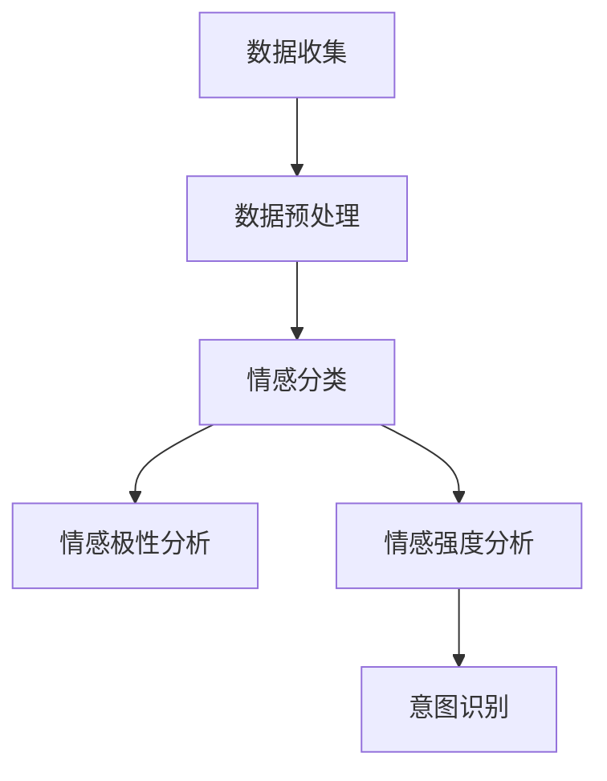

                 

关键词：情感分析，AI，用户意图，自然语言处理，机器学习，深度学习

> 摘要：情感分析作为自然语言处理领域的重要分支，已经成为人工智能技术理解用户情感和意图的关键。本文将深入探讨情感分析的核心概念、算法原理、数学模型、应用场景，并通过实际项目实践，展示如何利用AI技术实现对用户意图的深入理解。同时，本文还将展望情感分析技术的未来发展趋势，以及面临的挑战和解决思路。

## 1. 背景介绍

随着互联网的快速发展，人们产生了大量的文本数据。这些数据中包含了丰富的情感信息，例如用户评论、社交媒体帖子、新闻报道等。如何从这些文本数据中提取出情感信息，对于企业和个人都有着重要的意义。企业可以利用情感分析技术来了解用户对产品或服务的态度，从而做出更明智的商业决策。而个人则可以通过情感分析来更好地理解和表达自己的情感状态。

情感分析，又称意见挖掘，是指使用自然语言处理（NLP）和机器学习技术，对文本中的情感倾向、情感极性、情感强度等进行自动分析和识别。情感分析是人工智能技术理解人类情感和意图的重要手段，其在情感识别、市场分析、舆情监控、智能客服等领域有着广泛的应用。

## 2. 核心概念与联系

### 2.1 情感分类

情感分类是指将文本中的情感倾向分为积极、消极或中性。这通常是一个多类分类问题。例如，对于一个评论“这款产品非常棒”，我们可以将其分类为积极情感。

### 2.2 情感极性

情感极性是指文本中的情感倾向程度。例如，文本“这个电影很好”和“这个电影非常好”都表达了积极情感，但后者情感极性更强。

### 2.3 情感强度

情感强度是指情感表达的强烈程度。例如，“喜欢”和“非常喜欢”表达了相同的情感，但后者情感强度更高。

### 2.4 情感与意图

情感和意图紧密相关。情感通常反映了用户对某事物的主观感受，而意图则是指用户在情感驱动下的行为目的。例如，一个用户可能因为喜欢某部电影而想要观看它，这就是情感和意图的关系。

### 2.5 Mermaid 流程图

下面是一个描述情感分析流程的 Mermaid 流程图：

## 3. 核心算法原理 & 具体操作步骤

### 3.1 算法原理概述

情感分析的核心算法主要包括基于规则的方法、基于统计的方法和基于机器学习的方法。基于规则的方法依赖于专家的知识和经验，通过定义一系列规则来识别文本中的情感。基于统计的方法依赖于文本特征，如词频、词序列等，通过统计方法来识别情感。基于机器学习的方法则通过训练大量标记数据，学习到情感分类的规律，并在新的文本上实现情感分析。

### 3.2 算法步骤详解

#### 3.2.1 数据收集

首先，我们需要收集大量的文本数据，这些数据可以是用户评论、社交媒体帖子、新闻报道等。数据的质量和多样性对于情感分析的性能至关重要。

#### 3.2.2 数据预处理

数据预处理是情感分析的关键步骤，主要包括文本清洗、词干提取、词性标注等。文本清洗旨在去除无意义的符号和停用词，词干提取旨在将单词还原到其基本形式，词性标注旨在为每个单词赋予一个词性标签，如名词、动词等。

#### 3.2.3 特征提取

在数据预处理之后，我们需要提取文本的特征，这些特征可以是词频、词序列、词嵌入等。词频和词序列特征反映了文本的局部信息，而词嵌入则反映了文本的语义信息。

#### 3.2.4 模型训练

接下来，我们可以使用机器学习算法（如支持向量机、随机森林、神经网络等）来训练情感分析模型。训练数据集由已标注的文本组成，模型通过学习这些文本的情感标签，来预测新文本的情感。

#### 3.2.5 模型评估

在模型训练之后，我们需要对模型进行评估，常用的评估指标包括准确率、召回率、F1值等。这些指标可以帮助我们了解模型的性能，并指导我们进行模型调优。

#### 3.2.6 情感分析

最后，我们可以使用训练好的模型对新的文本进行情感分析，预测其情感标签。

### 3.3 算法优缺点

#### 3.3.1 基于规则的方法

优点：简单、易于理解。

缺点：规则难以覆盖所有情况，且需要大量专家知识。

#### 3.3.2 基于统计的方法

优点：计算简单、效果较好。

缺点：对噪声敏感，难以处理长文本。

#### 3.3.3 基于机器学习的方法

优点：能够处理复

