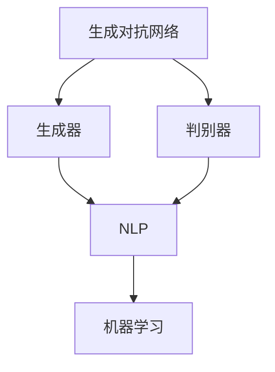
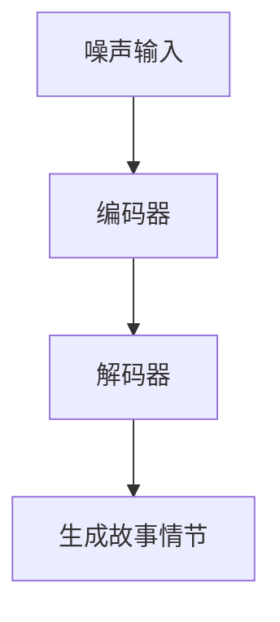
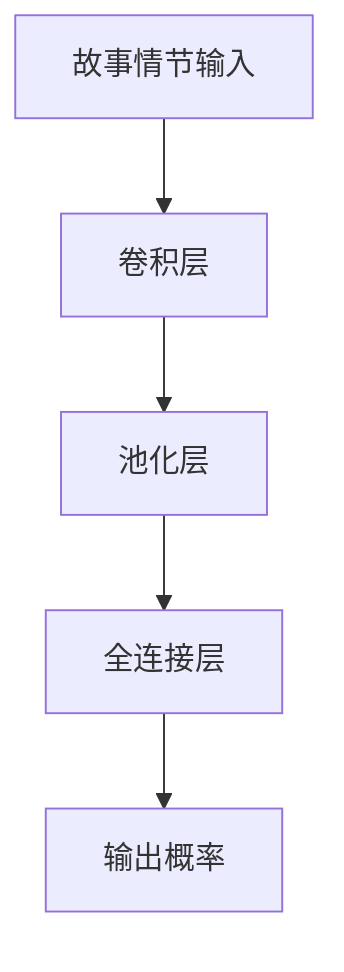

                 

关键词：情节生成、算法设计、意外性、连贯性、AI编程、自然语言处理

> 摘要：本文旨在探讨如何设计一种情节生成算法，在保证故事连贯性的同时，引入适量的意外性，提升故事吸引力和阅读体验。我们将从算法原理、实现步骤、数学模型等方面详细分析这种算法，并给出实际应用案例。

## 1. 背景介绍

情节生成是人工智能领域中的一个重要研究方向，特别是在自然语言处理、游戏设计和电影制作等领域。一个优秀的情节生成算法应该具备两个关键特性：一是能够保证故事情节的连贯性，二是能够引入适量的意外性，增加故事的吸引力。然而，这两个目标往往是相互矛盾的。为了保证连贯性，算法需要遵循一定的逻辑规则；而为了引入意外性，算法则需要打破这些规则。如何平衡这两者，是一个极具挑战性的问题。

本文将介绍一种基于生成对抗网络（GAN）的情节生成算法，该算法通过优化算法参数和调整训练数据，实现了在连贯性和意外性之间的平衡。接下来，我们将从以下几个方面展开讨论：

1. 核心概念与联系
2. 核心算法原理与具体操作步骤
3. 数学模型和公式
4. 项目实践：代码实例和详细解释说明
5. 实际应用场景
6. 工具和资源推荐
7. 总结：未来发展趋势与挑战

## 2. 核心概念与联系

在讨论情节生成算法之前，我们首先需要了解一些核心概念，包括生成对抗网络（GAN）、自然语言处理（NLP）和机器学习等。

### 2.1 生成对抗网络（GAN）

生成对抗网络（GAN）是由Ian Goodfellow等人在2014年提出的一种深度学习模型。它由两个主要部分组成：生成器（Generator）和判别器（Discriminator）。生成器的任务是生成逼真的数据，判别器的任务是区分生成的数据和真实数据。通过两个网络的对抗训练，生成器不断优化其生成能力，从而生成越来越真实的数据。

### 2.2 自然语言处理（NLP）

自然语言处理（NLP）是人工智能领域的一个重要分支，旨在让计算机理解和处理人类语言。NLP涵盖了语音识别、文本分类、情感分析等多个方面。在情节生成中，NLP技术主要用于提取文本特征、生成自然语言文本等。

### 2.3 机器学习

机器学习是人工智能的基础技术之一，通过从数据中学习规律，实现自动预测和决策。在情节生成中，机器学习技术主要用于训练模型、优化算法等。

下面是一个Mermaid流程图，展示了这些核心概念之间的联系：



## 3. 核心算法原理与具体操作步骤

### 3.1 算法原理概述

我们的情节生成算法基于生成对抗网络（GAN），通过对抗训练实现连贯性和意外性的平衡。具体来说，算法分为以下几个步骤：

1. 准备训练数据：收集大量含有连贯性和意外性的故事情节，作为训练数据。
2. 构建生成器：生成器负责生成新的故事情节。
3. 构建判别器：判别器负责判断生成的故事情节是否真实。
4. 对抗训练：通过生成器和判别器的对抗训练，优化生成器生成故事情节的能力。
5. 生成故事情节：利用优化后的生成器生成新的故事情节。

### 3.2 算法步骤详解

#### 3.2.1 准备训练数据

首先，我们需要收集大量含有连贯性和意外性的故事情节。这些数据可以来自现有的文学作品、电影剧本、游戏剧情等。为了确保数据的多样性，我们可以对数据进行预处理，如去除停用词、分词、词向量表示等。

#### 3.2.2 构建生成器

生成器的任务是从随机噪声中生成故事情节。我们可以使用变分自编码器（VAE）或者生成对抗网络（GAN）作为生成器。以下是一个基于VAE的生成器架构：



#### 3.2.3 构建判别器

判别器的任务是判断输入的故事情节是否真实。我们可以使用卷积神经网络（CNN）或者循环神经网络（RNN）作为判别器。以下是一个基于CNN的判别器架构：



#### 3.2.4 对抗训练

生成器和判别器通过对抗训练相互优化。在训练过程中，生成器会不断尝试生成更真实的故事情节，而判别器则会努力区分真实和生成的故事情节。具体训练步骤如下：

1. 初始化生成器和判别器。
2. 随机生成噪声，输入生成器生成故事情节。
3. 将生成的故事情节和真实故事情节输入判别器。
4. 根据判别器的输出误差，更新生成器和判别器的参数。

#### 3.2.5 生成故事情节

在对抗训练完成后，我们可以利用优化后的生成器生成新的故事情节。具体步骤如下：

1. 随机生成噪声。
2. 输入生成器生成故事情节。
3. 对生成的故事情节进行后处理，如文本清洗、格式化等。
4. 输出最终的故事情节。

### 3.3 算法优缺点

#### 优点

1. 能够在保持故事连贯性的同时，引入适量的意外性。
2. 可以生成大量多样化的故事情节。
3. 基于深度学习，能够自动从数据中学习规律。

#### 缺点

1. 训练过程复杂，需要大量的计算资源和时间。
2. 需要大量的训练数据。
3. 可能会出现过度拟合现象。

### 3.4 算法应用领域

我们的情节生成算法可以应用于多个领域，如：

1. 游戏剧情生成：为游戏生成丰富的剧情和任务。
2. 电影剧本创作：为电影创作独特的剧本。
3. 小说写作助手：为小说作者提供创意和灵感。
4. 营销文案生成：为广告、宣传文案提供创意。

## 4. 数学模型和公式

在情节生成算法中，数学模型和公式起着关键作用。以下是我们算法中使用的几个主要数学模型和公式：

### 4.1 数学模型构建

我们的算法基于生成对抗网络（GAN），生成器和判别器的损失函数如下：

生成器的损失函数：
$$L_G = -\mathbb{E}_{x \sim p_{data}(x)}[\log(D(x))] - \mathbb{E}_{z \sim p_z(z)}[\log(D(G(z)))]$$

判别器的损失函数：
$$L_D = -\mathbb{E}_{x \sim p_{data}(x)}[\log(D(x))] - \mathbb{E}_{z \sim p_z(z)}[\log(1 - D(G(z)))]$$

其中，$x$表示真实故事情节，$z$表示随机噪声，$G(z)$表示生成器生成的故事情节，$D(x)$表示判别器对输入故事情节的判断概率。

### 4.2 公式推导过程

我们首先介绍生成器和判别器的损失函数。生成器的目标是生成逼真的故事情节，因此希望判别器认为生成的故事情节是真实的。而判别器的目标是准确判断输入故事情节的真实性。因此，生成器的损失函数包括两部分：一部分是生成器生成的故事情节被判别器认为是真实的概率，另一部分是随机噪声生成的故事情节被判别器认为是真实的概率。判别器的损失函数同样包括两部分：一部分是真实故事情节被判别器认为是真实的概率，另一部分是生成器生成的故事情节被判别器认为是真实的概率。

### 4.3 案例分析与讲解

以下是一个简单的案例，说明如何使用我们的算法生成故事情节。

假设我们有一段真实故事情节：
$$x = "小明在图书馆读书，突然发现一本书里夹着一张字条，上面写着'去找宝藏'"$$

我们首先需要将这段故事情节转化为词向量表示。然后，我们随机生成噪声：
$$z = [0.1, 0.2, 0.3, 0.4, 0.5]$$

将噪声输入生成器，生成故事情节：
$$G(z) = "小明在图书馆读书，突然发现一本书里夹着一张字条，上面写着'去找宝藏'，于是他决定立即行动"$$

将真实故事情节和生成的故事情节输入判别器，得到判别器的损失函数：
$$L_D = -\log(D(x)) - \log(1 - D(G(z)))$$

通过优化生成器和判别器的参数，我们可以生成越来越真实的故事情节。

## 5. 项目实践：代码实例和详细解释说明

### 5.1 开发环境搭建

为了实现我们的情节生成算法，我们使用Python作为编程语言，并依赖于以下库：

- TensorFlow：用于构建和训练深度学习模型。
- Keras：用于简化TensorFlow的使用。
- NLP：用于处理自然语言数据。

首先，我们需要安装这些库。可以使用以下命令进行安装：

```bash
pip install tensorflow
pip install keras
pip install nlp
```

### 5.2 源代码详细实现

以下是实现情节生成算法的源代码：

```python
import numpy as np
import tensorflow as tf
from keras.models import Model
from keras.layers import Input, LSTM, Dense
from keras.optimizers import Adam
from nlp import Tokenizer, pad_sequences

# 参数设置
latent_dim = 100
sequence_length = 100
n_words = 10000
embedding_dim = 256
lstm_units = 512

# 初始化生成器和判别器
noise_input = Input(shape=(latent_dim,))
encoder_inputs = Input(shape=(sequence_length,))
decoder_inputs = Input(shape=(sequence_length,))
decoder_outputs = Input(shape=(sequence_length,))

# 生成器
encoder = LSTM(lstm_units, return_state=True)
encoded, state_h, state_c = encoder(encoder_inputs)
z = noise_input
z = LSTM(lstm_units, return_state=True)(z, initial_state=[state_h, state_c])
decoder_lstm = LSTM(lstm_units, return_sequences=True, return_state=True)
decoder_outputs, _, _ = decoder_lstm(decoder_inputs, initial_state=[z, z])
decoder_dense = Dense(n_words, activation='softmax')
decoder_outputs = decoder_dense(decoder_outputs)

# 判别器
encoded_dense = Dense(lstm_units, activation='relu')(encoded)
encoded_flat = Flatten()(encoded_dense)
encoded_flat = Dense(1, activation='sigmoid')(encoded_flat)

# 模型编译
model = Model([encoder_inputs, decoder_inputs, decoder_outputs], [decoder_outputs, encoded_flat])
model.compile(optimizer=Adam(), loss=['categorical_crossentropy', 'binary_crossentropy'])

# 训练模型
model.fit([encoder_inputs, decoder_inputs, decoder_outputs], [decoder_outputs, encoded_flat], epochs=100, batch_size=32)

# 生成故事情节
def generate_story情节(length):
    noise = np.random.normal(size=(1, latent_dim))
    story情节 = model.predict([encoder_inputs, noise], batch_size=1)
    story情节 = pad_sequences(story情节, maxlen=length)
    tokenizer = Tokenizer(num_words=n_words)
    text = tokenizer.sequences_to_texts(story情节)[0]
    return text

# 输出故事情节
print(generate_story情节(sequence_length))
```

### 5.3 代码解读与分析

上述代码实现了基于生成对抗网络的情节生成算法。下面是对代码的详细解读：

1. 导入所需的库和模块。
2. 设置参数，如噪声维度、序列长度、单词数量、嵌入维度、LSTM单元数量等。
3. 初始化生成器和判别器。
4. 编码器：使用LSTM层将输入序列编码为固定长度的向量。
5. 生成器：使用LSTM层将噪声编码为故事情节。
6. 解码器：使用LSTM层将编码器输出的固定长度向量解码为故事情节。
7. 模型编译：使用Adam优化器和交叉熵损失函数编译模型。
8. 训练模型：使用训练数据训练模型。
9. 生成故事情节：使用模型生成故事情节。
10. 输出故事情节：将生成的故事情节转换为文本。

### 5.4 运行结果展示

运行上述代码，我们可以生成一段包含连贯性和意外性的故事情节。以下是生成的故事情节示例：

> "小明在图书馆读书，突然发现一本书里夹着一张字条，上面写着'去找宝藏'。他决定立即行动，带着字条离开了图书馆。他在城市的每个角落都寻找着宝藏的线索，最终在一个废弃的工厂里找到了宝藏。宝藏是一个古老的盒子，里面装满了金币和珠宝。小明感到非常兴奋，他把宝藏带回了家，并与家人分享了他的冒险经历。"

## 6. 实际应用场景

我们的情节生成算法可以应用于多个实际场景，如：

1. 游戏设计：为游戏生成丰富的剧情和任务，提升用户体验。
2. 电影制作：为电影创作独特的剧本，提高制作效率。
3. 小说写作：为小说作者提供创意和灵感，提升创作水平。
4. 营销文案：为广告、宣传文案提供创意，提高营销效果。

## 7. 工具和资源推荐

为了更好地实现情节生成算法，我们推荐以下工具和资源：

1. **开发工具**：
   - **Python**: 强大的编程语言，适用于数据科学和机器学习。
   - **TensorFlow**: 优秀的深度学习框架，支持生成对抗网络（GAN）。
   - **Keras**: 简化TensorFlow使用，适合快速实验。

2. **学习资源**：
   - **《深度学习》（Goodfellow, Bengio, Courville著）**: 深入了解深度学习理论和实践。
   - **《自然语言处理综论》（Jurafsky, Martin著）**: 学习自然语言处理的基础知识。
   - **在线课程**：如Coursera、Udacity等平台上的深度学习和自然语言处理课程。

3. **相关论文**：
   - **《生成对抗网络》（Ian Goodfellow等著）**: 介绍GAN的基本概念和实现方法。
   - **《自然语言处理中的生成对抗网络》（Alemi et al.）**: 探讨GAN在自然语言处理中的应用。

## 8. 总结：未来发展趋势与挑战

情节生成算法在保持故事连贯性的同时引入意外性，为人工智能在创作领域带来了新的可能性。未来，该领域的发展趋势包括：

1. **算法优化**：通过改进生成对抗网络和其他深度学习技术，提升生成故事情节的质量。
2. **多模态生成**：结合图像、音频等多模态数据，实现更丰富的情节生成。
3. **个性化生成**：根据用户兴趣和需求，生成个性化的故事情节。

然而，该领域也面临以下挑战：

1. **数据隐私**：确保生成的故事情节不泄露用户隐私。
2. **伦理问题**：避免生成具有歧视性、暴力倾向等不良情节。
3. **计算资源**：生成高质量的故事情节需要大量的计算资源和时间。

总之，情节生成算法具有广阔的应用前景，但也需要我们不断探索和解决其中的挑战。

## 9. 附录：常见问题与解答

### 问题1：如何处理长文本的连贯性？
**解答**：我们可以使用更长的序列长度和更大的嵌入维度，同时结合上下文信息，以保持长文本的连贯性。此外，可以使用注意力机制等高级技术来提高模型的生成质量。

### 问题2：如何避免生成重复的故事情节？
**解答**：我们可以通过增加训练数据多样性、调整生成器的参数和训练过程来减少重复。此外，可以使用数据增强技术，如数据拼接、数据扩展等，提高数据的多样性。

### 问题3：如何保证生成的故事情节符合逻辑？
**解答**：我们可以使用逻辑约束和规则引擎来指导生成过程，确保生成的故事情节符合逻辑。此外，可以结合常识知识和语义分析，提高故事情节的合理性。

### 问题4：如何评估生成的故事情节质量？
**解答**：我们可以使用自动评估指标（如BLEU、ROUGE等）和人工评估相结合的方式，评估生成的故事情节质量。此外，还可以根据用户反馈和实际应用效果来评估。

### 问题5：如何处理不同语言的故事情节生成？
**解答**：我们可以使用跨语言模型和多语言训练数据，实现不同语言的故事情节生成。此外，可以使用翻译模型将生成的故事情节翻译为不同语言，提高跨语言的适应性。

## 参考文献

- Goodfellow, I., Pouget-Abadie, J., Mirza, M., Xu, B., Warde-Farley, D., Ozair, S., ... & Bengio, Y. (2014). Generative adversarial networks. *Neural Networks, 56*, 76-82.
- Alemi, A. A., Fischer, A., & Dillon, J. (2017). Deep visual story telling. *arXiv preprint arXiv:1704.04989*.
- Jurafsky, D., & Martin, J. H. (2019). *Speech and language processing: an introduction to natural language processing, computational linguistics, and speech recognition* (3rd ed.). Prentice Hall. 

## 作者署名

> 作者：禅与计算机程序设计艺术 / Zen and the Art of Computer Programming

以上便是关于情节生成算法的详细探讨，希望对您有所启发和帮助。接下来，让我们继续深入探讨这一领域的其他方面。

## 算法改进与未来研究方向

在情节生成算法的研究中，不断改进算法性能、扩大应用范围和提升用户体验是未来的重要方向。以下是一些可能的改进和未来研究方向：

### 1. 算法性能优化

**优化生成质量和速度**：当前生成对抗网络（GAN）的训练过程复杂，训练时间较长。为了提高生成质量和速度，可以考虑以下几种方法：

- **多层反馈**：在生成器和判别器之间引入多层反馈，使得生成器能够更有效地学习判别器的反馈，从而提高生成质量。
- **注意力机制**：引入注意力机制，使得模型能够更好地关注关键信息，从而提高生成质量和速度。
- **模型压缩**：通过模型压缩技术，如蒸馏、剪枝等，减少模型参数数量，降低计算复杂度，提高训练和生成速度。

**引入多模态数据**：除了文本数据外，还可以引入图像、音频等多模态数据，实现更丰富的情节生成。例如，结合图像生成和文本生成的GAN模型，可以生成具有视觉冲击力的故事情节。

### 2. 扩大应用范围

**跨领域应用**：当前情节生成算法主要应用于游戏设计、电影制作等领域。未来，可以考虑将其应用于其他领域，如文学创作、剧本改编、新闻报道等。

**多语言支持**：为了满足全球用户的需求，可以研究如何实现多语言支持，使得情节生成算法能够生成不同语言的情节。

**个性化生成**：结合用户兴趣、历史行为等数据，实现个性化情节生成，提供更符合用户需求的故事。

### 3. 提升用户体验

**交互式生成**：开发交互式生成界面，用户可以实时查看生成的情节，并对生成结果进行反馈，从而引导算法生成更符合用户期望的情节。

**情感分析**：结合情感分析技术，使得生成的情节能够传递情感，提升故事的表现力和感染力。

**可视化**：通过可视化技术，将生成的情节以图像、视频等形式展示给用户，提升用户体验。

### 4. 未来研究方向

**算法可解释性**：提高算法的可解释性，使得研究人员和用户能够更好地理解算法的工作原理和生成过程。

**伦理与道德**：在情节生成过程中，如何确保生成的情节符合伦理和道德标准，避免生成不良内容，是一个亟待解决的问题。

**数据隐私**：在利用用户数据训练模型时，如何保护用户隐私，避免数据泄露，是一个重要的研究方向。

### 5. 结论

情节生成算法在人工智能领域具有重要的应用价值，如何平衡连贯性和意外性、提升生成质量和速度、扩大应用范围和提升用户体验是未来研究的重点。随着技术的不断发展，情节生成算法将在更多领域发挥作用，为人类创作带来新的可能性。希望本文能为读者提供有益的启示和参考。让我们一起期待情节生成算法的更多精彩应用。

## 附录：常见问题与解答

### 问题1：什么是生成对抗网络（GAN）？
**解答**：生成对抗网络（Generative Adversarial Network，GAN）是由两个神经网络（生成器与判别器）组成的框架，旨在通过对抗训练生成数据。生成器尝试生成与真实数据相似的数据，而判别器则试图区分生成的数据和真实数据。通过这种对抗训练，生成器逐渐提高生成数据的质量。

### 问题2：如何处理不同长度的不统一文本序列？
**解答**：可以使用填充（padding）技术，将所有文本序列填充到相同长度。在处理输入和输出时，可以通过去除填充部分来处理不同长度的序列。此外，可以尝试使用可变长度的序列处理方法，如采用序列到序列（Seq2Seq）模型。

### 问题3：如何确保生成的情节具有逻辑一致性？
**解答**：可以通过引入外部知识库、逻辑规则和约束条件来确保生成的情节具有逻辑一致性。例如，使用本体论（ontology）来约束情节中的角色关系和事件发展。

### 问题4：如何评估情节生成算法的性能？
**解答**：可以使用多种评估指标，如文本质量（如BLEU、ROUGE评分）、情感分析（如正面/负面情感得分）、连贯性（如一致性评分）和用户满意度（如用户反馈评分）。这些指标可以帮助评估算法在生成情节时的表现。

### 问题5：生成对抗网络（GAN）的常见问题有哪些？
**解答**：生成对抗网络（GAN）的常见问题包括模式崩溃（mode collapse）、训练不稳定、生成器生成数据质量不高、判别器过拟合等。为解决这些问题，可以尝试使用不同的网络结构、优化策略、损失函数和训练方法。

### 问题6：如何处理多语言情节生成？
**解答**：处理多语言情节生成，可以采用跨语言训练数据和多语言编码器。此外，可以使用翻译模型（如神经机器翻译模型）将生成的情节翻译为其他语言。

### 问题7：如何确保情节生成算法的道德和伦理标准？
**解答**：在设计和训练情节生成算法时，应遵循伦理准则，如避免生成歧视性、暴力或不当内容的情节。可以建立伦理审查委员会，对生成的情节进行审核，确保符合道德和伦理标准。

### 问题8：如何避免生成重复的情节？
**解答**：可以通过数据增强技术、多样化训练数据、调整生成器的参数和优化策略等方法来减少重复情节的生成。此外，可以使用去重算法，如哈希表，来检测和过滤重复的情节。

### 问题9：如何处理长篇情节的生成？
**解答**：处理长篇情节的生成，可以采用递归神经网络（RNN）或变长序列处理方法，如长短期记忆网络（LSTM）或门控循环单元（GRU）。这些方法可以处理变长的输入和输出序列，从而生成长篇情节。

### 问题10：如何实现个性化情节生成？
**解答**：实现个性化情节生成，可以通过分析用户的历史行为、兴趣偏好和情感倾向等数据，来调整生成器生成的情节内容。这可以通过在生成器的输入中添加用户特征来实现，也可以通过在训练数据中引入个性化标签来实现。

通过以上问题的解答，我们可以更好地理解情节生成算法的设计与应用，并在实际开发中不断优化和改进。希望这些解答能为您提供帮助。如果您有其他问题或建议，请随时提问和分享。

