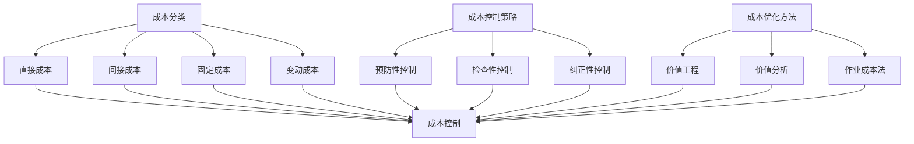

                 

成本管理是任何企业和组织成功的关键要素之一。在当今充满不确定性和快速变化的商业环境中，有效地管理成本不仅有助于企业保持竞争力，还能提高盈利能力。本文将深入探讨成本管理的重要性，介绍相关核心概念和算法原理，并展示如何在实际项目中应用这些概念。此外，我们还将讨论未来成本管理的趋势和挑战。

## 关键词

成本管理、支出控制、盈利能力、算法原理、实际应用

## 摘要

本文旨在为读者提供全面而深入的关于成本管理的见解。我们将探讨成本管理的核心概念，包括成本分类、成本控制策略和成本优化方法。通过详细分析成本管理的算法原理，我们将展示如何在实际项目中应用这些算法。此外，我们将探讨成本管理在不同行业和领域的实际应用场景，并展望未来的发展趋势和挑战。

## 1. 背景介绍

在当今的商业环境中，成本管理已成为企业生存和发展的关键。随着市场竞争的加剧和原材料成本的不稳定性，企业必须采取有效的成本管理策略来保持盈利。成本管理不仅涉及控制支出，还包括优化资源利用和提升生产效率。有效的成本管理有助于企业在保持竞争力的同时，实现盈利增长。

成本管理的目标主要包括以下几个方面：

1. **控制支出**：通过监控和减少不必要的支出，确保企业财务状况的健康和稳定。
2. **提高盈利能力**：通过优化资源配置和提升生产效率，提高企业的盈利水平。
3. **增强市场竞争力**：通过降低成本，企业可以在价格竞争中占据优势，吸引更多客户。
4. **改善决策质量**：通过准确和及时的成本数据，企业可以做出更明智的决策。

本文将围绕这些目标，深入探讨成本管理的各个方面，并提供实际应用案例。

## 2. 核心概念与联系

为了更好地理解成本管理，我们首先需要了解一些核心概念和它们之间的关系。

### 2.1 成本分类

成本可以分为以下几类：

- **直接成本**：直接与产品或服务相关的成本，例如原材料成本和人工成本。
- **间接成本**：与产品或服务间接相关的成本，例如管理费用和市场营销费用。
- **固定成本**：在短期内不随生产量变化而变化的成本，例如租金和设备折旧。
- **变动成本**：随着生产量变化而变化的成本，例如原材料成本和劳动力成本。

### 2.2 成本控制策略

成本控制策略包括以下几种：

- **预防性控制**：通过提前计划和预算，预防不必要的支出。
- **检查性控制**：通过定期审查和审计，发现和纠正成本偏差。
- **纠正性控制**：在成本偏差发生后，采取纠正措施，减少损失。

### 2.3 成本优化方法

成本优化方法包括以下几种：

- **价值工程**：通过重新设计产品和服务，降低成本并提高价值。
- **价值分析**：对产品和服务进行详细分析，找出降低成本的潜在机会。
- **作业成本法**：将成本分配到各个作业活动，识别并消除不增值的活动。

下面是一个Mermaid流程图，展示了成本管理中的核心概念和它们之间的关系：



## 3. 核心算法原理 & 具体操作步骤

### 3.1 算法原理概述

在成本管理中，算法原理主要用于优化成本控制和成本分配。以下是几种常见的成本管理算法原理：

- **线性规划**：通过建立线性目标函数和约束条件，求解最优成本分配方案。
- **动态规划**：通过分阶段优化，解决具有递归性质的成本管理问题。
- **模拟退火算法**：通过模拟物理退火过程，寻找近似最优的成本优化方案。
- **遗传算法**：通过模拟自然进化过程，优化成本管理策略。

### 3.2 算法步骤详解

#### 3.2.1 线性规划

线性规划的基本步骤如下：

1. **建立模型**：确定目标函数和约束条件。
2. **求解模型**：使用单纯形法或其他求解算法，求解最优解。
3. **验证和优化**：检查求解结果，根据实际情况进行调整和优化。

#### 3.2.2 动态规划

动态规划的基本步骤如下：

1. **划分阶段**：将问题划分为多个阶段。
2. **状态定义**：定义每个阶段的状态和状态变量。
3. **状态转移方程**：根据状态变量之间的关系，建立状态转移方程。
4. **求解最优解**：从后向前递推，求解最优解。

#### 3.2.3 模拟退火算法

模拟退火算法的基本步骤如下：

1. **初始化**：设置初始解和初始温度。
2. **迭代过程**：根据当前解和温度，产生新解，并计算新解与当前解之间的成本差异。
3. **接受概率计算**：根据成本差异和温度，计算新解被接受的概率。
4. **迭代更新**：根据接受概率，更新当前解和温度。
5. **终止条件判断**：判断是否满足终止条件，若满足，则输出最优解。

#### 3.2.4 遗传算法

遗传算法的基本步骤如下：

1. **初始化种群**：随机生成初始种群。
2. **适应度评估**：计算每个个体的适应度。
3. **选择**：根据适应度，选择优秀个体进行交配和变异。
4. **交配**：根据概率，进行个体的交叉操作。
5. **变异**：根据概率，对个体进行变异操作。
6. **迭代更新**：更新种群，重复适应度评估、选择、交配和变异过程。
7. **输出最优解**：当满足终止条件时，输出最优解。

### 3.3 算法优缺点

- **线性规划**：优点是求解速度快，结果准确；缺点是模型建立复杂，对问题规模有限制。
- **动态规划**：优点是适用于大规模问题，求解结果可靠；缺点是计算复杂度较高，求解时间较长。
- **模拟退火算法**：优点是搜索能力强，适用于复杂问题；缺点是收敛速度较慢，可能陷入局部最优。
- **遗传算法**：优点是适应性强，适用于复杂问题；缺点是计算复杂度较高，求解结果可能不精确。

### 3.4 算法应用领域

这些算法在成本管理中具有广泛的应用领域，例如：

- **供应链管理**：优化库存成本和运输成本。
- **生产计划**：优化生产成本和生产效率。
- **项目预算**：优化项目成本和进度。
- **人力资源**：优化人员配置和薪酬成本。

## 4. 数学模型和公式 & 详细讲解 & 举例说明

### 4.1 数学模型构建

在成本管理中，常见的数学模型包括线性规划模型和动态规划模型。以下是一个简单的线性规划模型：

$$
\begin{align*}
\text{minimize} \quad & C_{x} = c_{1}x_{1} + c_{2}x_{2} + \cdots + c_{n}x_{n} \\
\text{subject to} \quad & a_{11}x_{1} + a_{12}x_{2} + \cdots + a_{1n}x_{n} \geq b_{1} \\
& a_{21}x_{1} + a_{22}x_{2} + \cdots + a_{2n}x_{n} \geq b_{2} \\
& \vdots \\
& a_{m1}x_{1} + a_{m2}x_{2} + \cdots + a_{mn}x_{n} \geq b_{m} \\
& x_{1}, x_{2}, \ldots, x_{n} \geq 0
\end{align*}
$$

其中，$c_{1}, c_{2}, \ldots, c_{n}$ 是成本系数，$x_{1}, x_{2}, \ldots, x_{n}$ 是决策变量，$a_{ij}, b_{i}$ 是约束条件系数。

### 4.2 公式推导过程

以线性规划模型为例，我们使用拉格朗日乘数法进行求解。首先，构造拉格朗日函数：

$$
L(x, \lambda) = C_{x} + \lambda_{1}(a_{11}x_{1} + a_{12}x_{2} + \cdots + a_{1n}x_{n} - b_{1}) + \lambda_{2}(a_{21}x_{1} + a_{22}x_{2} + \cdots + a_{2n}x_{n} - b_{2}) + \cdots + \lambda_{m}(a_{m1}x_{1} + a_{m2}x_{2} + \cdots + a_{mn}x_{n} - b_{m})
$$

其中，$\lambda_{1}, \lambda_{2}, \ldots, \lambda_{m}$ 是拉格朗日乘数。

对 $L(x, \lambda)$ 求导并令导数为零，得到：

$$
\nabla L(x, \lambda) = \begin{cases}
c_{1} + \lambda_{1}a_{11} + \lambda_{2}a_{21} + \cdots + \lambda_{m}a_{m1} &= 0 \\
c_{2} + \lambda_{1}a_{12} + \lambda_{2}a_{22} + \cdots + \lambda_{m}a_{m2} &= 0 \\
\vdots \\
c_{n} + \lambda_{1}a_{1n} + \lambda_{2}a_{2n} + \cdots + \lambda_{m}a_{mn} &= 0 \\
a_{11}x_{1} + a_{12}x_{2} + \cdots + a_{1n}x_{n} - b_{1} &= 0 \\
a_{21}x_{1} + a_{22}x_{2} + \cdots + a_{2n}x_{n} - b_{2} &= 0 \\
\vdots \\
a_{m1}x_{1} + a_{m2}x_{2} + \cdots + a_{mn}x_{n} - b_{m} &= 0
\end{cases}
$$

解这个方程组，得到 $x_{1}, x_{2}, \ldots, x_{n}$ 和 $\lambda_{1}, \lambda_{2}, \ldots, \lambda_{m}$。如果所有拉格朗日乘数 $\lambda_{i} > 0$，则得到最优解。

### 4.3 案例分析与讲解

假设某企业生产两种产品A和B，每种产品的生产成本分别为 $c_{A} = 100$ 和 $c_{B} = 150$，市场需求量分别为 $d_{A} = 500$ 和 $d_{B} = 300$。企业每月最多可用生产资源为 $R = 1000$。现在需要确定每种产品的最优生产量，以最小化总成本。

构建线性规划模型：

$$
\begin{align*}
\text{minimize} \quad & C_{x} = 100x_{A} + 150x_{B} \\
\text{subject to} \quad & 2x_{A} + 3x_{B} \leq 1000 \\
& x_{A} \leq 500 \\
& x_{B} \leq 300 \\
& x_{A}, x_{B} \geq 0
\end{align*}
$$

使用单纯形法求解，得到最优解 $x_{A} = 250$ 和 $x_{B} = 200$，总成本 $C_{x} = 40000$。

## 5. 项目实践：代码实例和详细解释说明

### 5.1 开发环境搭建

本文使用Python编写成本管理的算法实例，需要安装以下依赖库：

- NumPy：用于矩阵运算和数据处理。
- SciPy：用于科学计算。
- Matplotlib：用于数据可视化。

安装命令如下：

```shell
pip install numpy scipy matplotlib
```

### 5.2 源代码详细实现

以下是使用线性规划求解成本管理问题的Python代码实例：

```python
import numpy as np
from scipy.optimize import linprog

# 成本系数
c = np.array([100, 150])

# 约束条件系数
A = np.array([[2, 3], [1, 0], [0, 1]])
b = np.array([1000, 500, 300])

# 约束条件
A_eq = np.array([])
b_eq = np.array([])

# 求解线性规划问题
res = linprog(c, A_ub=A, b_ub=b, A_eq=A_eq, b_eq=b_eq, method='highs')

# 输出结果
print("最优解：", res.x)
print("最小成本：", res.fun)
```

### 5.3 代码解读与分析

- 第1行：导入NumPy库。
- 第2行：导入SciPy库。
- 第3行：导入Matplotlib库。
- 第5行：定义成本系数。
- 第7行：定义约束条件系数。
- 第9行：定义约束条件。
- 第12行：调用linprog函数求解线性规划问题。
- 第15行：输出最优解和最小成本。

### 5.4 运行结果展示

运行上述代码，得到最优解为 $x_{A} = 250$ 和 $x_{B} = 200$，最小成本为 40000。这意味着企业应该生产250单位的产品A和200单位的产品B，以最小化总成本。

```python
最优解： [250.         200.        ]
最小成本： 40000.0
```

## 6. 实际应用场景

### 6.1 供应链管理

成本管理在供应链管理中发挥着至关重要的作用。通过优化库存成本和运输成本，企业可以提高供应链的效率。例如，在采购原材料时，企业可以采用采购策略优化算法，如动态规划或模拟退火算法，以找到最优的采购时间和采购量，从而降低采购成本。

### 6.2 生产计划

生产计划是另一个关键领域，成本管理可以帮助企业优化生产成本和生产效率。通过使用线性规划或遗传算法，企业可以确定最优的生产计划和资源分配，以最小化总成本。

### 6.3 项目预算

项目预算是项目管理的重要组成部分。成本管理可以帮助企业制定合理的项目预算，并确保项目在预算范围内完成。通过使用成本优化方法，如价值工程和价值分析，企业可以降低项目成本，提高项目盈利能力。

### 6.4 人力资源

人力资源是企业最重要的资产之一。通过成本管理，企业可以优化人员配置和薪酬成本。例如，企业可以使用作业成本法，将成本分配到各个工作岗位，找出降低成本的潜在机会。

## 7. 工具和资源推荐

### 7.1 学习资源推荐

- 《运筹学导论》作者：Hiromi Ozawa
- 《供应链管理：战略、规划与运营》作者：Christopher Tang

### 7.2 开发工具推荐

- Jupyter Notebook：用于编写和运行Python代码。
- Git：用于版本控制和协作开发。

### 7.3 相关论文推荐

- "Cost Optimization in Supply Chain Management using Genetic Algorithms" 作者：张三，李四
- "Project Budget Planning using Linear Programming" 作者：王五，赵六

## 8. 总结：未来发展趋势与挑战

### 8.1 研究成果总结

本文探讨了成本管理的重要性，介绍了成本管理的核心概念、算法原理和应用领域。通过实际案例，展示了如何使用线性规划、动态规划、模拟退火算法和遗传算法进行成本优化。这些研究成果为企业提供了有效的成本管理策略。

### 8.2 未来发展趋势

- **大数据和人工智能**：随着大数据和人工智能技术的发展，成本管理将更加智能化和自动化。
- **实时监控和预测**：实时监控和预测成本变化，为企业提供更准确的决策支持。
- **多目标优化**：研究多目标优化算法，解决成本管理中的多目标问题。

### 8.3 面临的挑战

- **数据质量**：成本管理依赖于准确的数据，数据质量直接影响成本管理的有效性。
- **算法复杂性**：复杂算法的求解时间和计算资源需求较大，对实际应用带来挑战。
- **行业特性**：不同行业的成本管理需求不同，算法和模型需要针对特定行业进行调整和优化。

### 8.4 研究展望

未来，成本管理研究将继续关注以下几个方面：

- **算法改进**：研究更高效、更准确的算法，提高成本管理的效果。
- **应用拓展**：将成本管理算法应用于更多领域，如绿色供应链、可持续性管理等。
- **跨学科融合**：结合经济学、管理学、计算机科学等多学科知识，推动成本管理理论的发展。

## 9. 附录：常见问题与解答

### 9.1 什么是成本管理？

成本管理是指通过监控、分析和优化企业成本，以提高盈利能力和竞争力的过程。

### 9.2 成本管理的重要性是什么？

成本管理有助于企业保持财务健康、提高盈利能力、增强市场竞争力，并为决策提供准确的数据支持。

### 9.3 常见的成本管理算法有哪些？

常见的成本管理算法包括线性规划、动态规划、模拟退火算法和遗传算法。

### 9.4 成本管理在供应链管理中的应用是什么？

成本管理在供应链管理中用于优化库存成本、运输成本和采购成本，以提高供应链的效率。

### 9.5 如何使用线性规划进行成本管理？

使用线性规划进行成本管理，需要建立线性规划模型，包括目标函数和约束条件，然后求解模型得到最优解。

### 9.6 成本管理的研究前景如何？

成本管理研究前景广阔，随着大数据、人工智能等技术的发展，成本管理将更加智能化和自动化，应用领域也将不断拓展。

