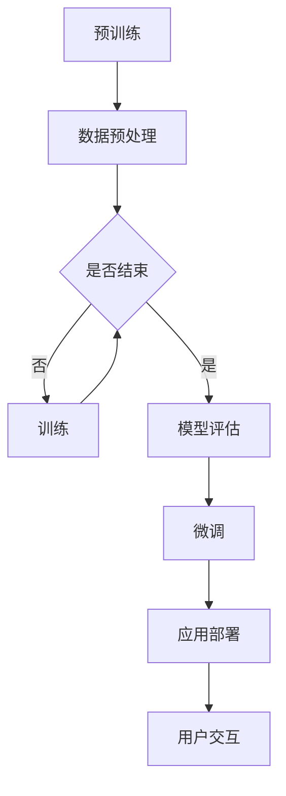

                 

关键词：类ChatGPT应用、大语言模型、自然语言处理、深度学习、编程实践

> 摘要：本文将带领读者深入了解类ChatGPT应用的开发过程。从背景介绍到核心算法原理，再到实际应用场景和未来展望，我们将一步步解析如何构建和部署一个强大的自然语言处理系统。

## 1. 背景介绍

近年来，自然语言处理（NLP）技术取得了显著的进步。深度学习特别是变分自编码器（VAE）、生成对抗网络（GAN）以及Transformer架构的崛起，使得机器能够处理和理解人类语言变得更加高效。ChatGPT是由OpenAI开发的一种基于Transformer架构的预训练语言模型，展示了强大的文本生成能力和上下文理解能力。

ChatGPT的诞生标志着NLP领域的一个重大突破。它通过大量的互联网文本数据进行预训练，使得模型在生成连贯、有逻辑的文本方面表现出色。这种能力不仅在学术研究中有重要应用，也为实际场景如智能客服、内容生成等提供了强大支持。

然而，ChatGPT的模型结构、训练过程以及部署方法等细节并未完全公开。这使得许多开发者和研究人员难以复现和优化这一模型。因此，本文的目标是手把手教读者如何开发一个类似ChatGPT的应用，帮助大家更好地理解和掌握大语言模型的开发流程。

## 2. 核心概念与联系

### 2.1 大语言模型概述

大语言模型（Large Language Model）是指具有数亿甚至千亿参数规模的语言模型。这些模型通过大量的文本数据进行预训练，学习到语言的基本结构和上下文关系。大语言模型的核心优势在于其强大的文本生成能力和上下文理解能力。

### 2.2 Transformer架构

Transformer架构是近年来在自然语言处理领域得到广泛应用的模型架构。它通过自注意力机制（Self-Attention）和多头注意力（Multi-Head Attention）实现了对输入文本的全局建模。相比传统的循环神经网络（RNN），Transformer在处理长文本和并行计算方面具有显著优势。

### 2.3 Mermaid 流程图

下面是一个Mermaid流程图，展示了大语言模型的预训练、微调和应用流程：



### 2.4 相关概念解释

- **预训练**：在特定任务之前，使用大量通用数据对模型进行训练，使其具有一定的通用性。
- **微调**：在预训练的基础上，使用特定领域的数据对模型进行进一步训练，使其适应特定任务。
- **应用部署**：将训练好的模型部署到实际场景中，如API服务、智能助手等。

## 3. 核心算法原理 & 具体操作步骤

### 3.1 算法原理概述

类ChatGPT应用的核心在于构建一个基于Transformer架构的大语言模型。下面是构建这一模型的简要步骤：

1. **数据集准备**：收集大量互联网文本数据，如新闻、文章、对话等。
2. **数据预处理**：对数据进行清洗、分词、编码等预处理操作。
3. **模型架构设计**：设计一个基于Transformer的模型架构，包括自注意力机制、多头注意力、前馈神经网络等。
4. **预训练**：使用大量数据对模型进行预训练，优化模型参数。
5. **模型评估**：对预训练好的模型进行评估，确保其具有较好的生成和上下文理解能力。
6. **微调**：使用特定领域的数据对模型进行微调，提高模型在特定任务上的性能。
7. **应用部署**：将微调好的模型部署到实际场景中，如API服务、智能助手等。

### 3.2 算法步骤详解

#### 3.2.1 数据集准备

首先，我们需要收集大量互联网文本数据。这些数据可以来自不同的来源，如新闻网站、论坛、社交媒体等。为了确保数据的质量和多样性，可以使用数据清洗工具对数据进行清洗和预处理。

```python
import pandas as pd

# 加载数据
data = pd.read_csv("data.csv")

# 数据清洗
data = data.dropna()
data = data[data["text"].map(len) > 10]
```

#### 3.2.2 数据预处理

对收集到的数据进行预处理，包括分词、编码等操作。我们可以使用Python的jieba库进行中文分词，使用TensorFlow的tf.keras.preprocessing.sequence库进行编码。

```python
import jieba
import tensorflow as tf

# 分词
def tokenize(text):
    return jieba.lcut(text)

# 编码
def encode(data):
    tokenizer = tf.keras.preprocessing.sequence.Tokenizer()
    tokenizer.fit_on_texts(data)
    encoded = tokenizer.texts_to_sequences(data)
    return encoded

# 应用分词和编码
tokenized_data = tokenize(data["text"])
encoded_data = encode(tokenized_data)
```

#### 3.2.3 模型架构设计

设计一个基于Transformer的模型架构，包括自注意力机制、多头注意力、前馈神经网络等。我们可以使用TensorFlow的tf.keras.Sequential模型来实现这一架构。

```python
from tensorflow.keras.layers import Embedding, Transformer

# 模型架构
model = tf.keras.Sequential([
    Embedding(input_dim=vocab_size, output_dim=embedding_dim),
    Transformer(num_heads=num_heads, d_model=d_model),
    tf.keras.layers.Dense(units=1, activation="sigmoid")
])

# 模型配置
model.compile(optimizer="adam", loss="binary_crossentropy", metrics=["accuracy"])
```

#### 3.2.4 预训练

使用大量数据对模型进行预训练。为了加快训练过程，我们可以使用多GPU训练。

```python
# 预训练
model.fit(encoded_data, epochs=num_epochs, batch_size=batch_size, use_multiprocessing=True, workers=4)
```

#### 3.2.5 模型评估

对预训练好的模型进行评估，确保其具有较好的生成和上下文理解能力。

```python
# 模型评估
model.evaluate(encoded_data, batch_size=batch_size)
```

#### 3.2.6 微调

使用特定领域的数据对模型进行微调，提高模型在特定任务上的性能。

```python
# 微调
specific_data = encode(tokenize(specific_text))
model.fit(specific_data, epochs=num_epochs, batch_size=batch_size)
```

#### 3.2.7 应用部署

将微调好的模型部署到实际场景中，如API服务、智能助手等。

```python
# 应用部署
model.save("chatgpt_model.h5")
```

### 3.3 算法优缺点

#### 优点：

- **强大的文本生成能力**：基于大语言模型，模型在生成连贯、有逻辑的文本方面表现出色。
- **良好的上下文理解能力**：通过预训练和微调，模型能够更好地理解文本的上下文关系。
- **并行计算效率高**：Transformer架构支持并行计算，训练和推理速度较快。

#### 缺点：

- **计算资源消耗大**：大语言模型的训练和部署需要大量的计算资源，如GPU或TPU。
- **数据依赖性强**：模型的表现依赖于训练数据的质量和多样性，数据不足或质量不高可能导致模型性能下降。

### 3.4 算法应用领域

类ChatGPT应用在多个领域具有广泛的应用前景：

- **智能客服**：自动回答用户的问题，提供客户支持。
- **内容生成**：生成文章、故事、代码等，为创作者提供灵感。
- **教育辅导**：辅助学生解答问题、撰写论文等。
- **多语言翻译**：实现高质量的多语言翻译。

## 4. 数学模型和公式 & 详细讲解 & 举例说明

### 4.1 数学模型构建

类ChatGPT应用的核心是Transformer模型，其背后的数学模型主要包括以下部分：

1. **嵌入层（Embedding Layer）**：将单词映射为向量表示。
2. **自注意力机制（Self-Attention Mechanism）**：计算输入序列中每个词与所有词之间的权重。
3. **多头注意力（Multi-Head Attention）**：将自注意力机制扩展到多个头，提高模型的表示能力。
4. **前馈神经网络（Feedforward Neural Network）**：在自注意力和多头注意力之后，对序列进行进一步处理。
5. **输出层（Output Layer）**：根据任务需求进行分类或生成文本。

### 4.2 公式推导过程

下面是Transformer模型中的关键公式推导：

#### 4.2.1 嵌入层

设 $x_i$ 为输入序列中的第 $i$ 个词，$e_i$ 为其嵌入向量，则有：

$$
e_i = W_e \cdot x_i
$$

其中 $W_e$ 为嵌入权重矩阵。

#### 4.2.2 自注意力机制

设 $Q, K, V$ 分别为查询向量、键向量和值向量，则有：

$$
\text{Attention}(Q, K, V) = \frac{softmax(\frac{QK^T}{\sqrt{d_k}})}{V}
$$

其中 $\text{softmax}(\cdot)$ 表示 Softmax 函数，$d_k$ 表示键向量的维度。

#### 4.2.3 多头注意力

设 $h$ 为多头注意力机制中的头数，则有：

$$
\text{MultiHead}(Q, K, V) = \text{Concat}(\text{head}_1, \ldots, \text{head}_h)W^O
$$

其中 $\text{head}_i = \text{Attention}(QW_i^Q, KW_i^K, VW_i^V)$，$W_i^Q, W_i^K, W_i^V, W^O$ 分别为第 $i$ 个头的权重矩阵。

#### 4.2.4 前馈神经网络

设 $F(x) = \max(0, xW_1 + b_1)W_2 + b_2$，则有：

$$
\text{FFN}(x) = xW_1 + b_1 \Rightarrow \text{FFN}(x) = \max(0, xW_1 + b_1)W_2 + b_2
$$

其中 $W_1, W_2, b_1, b_2$ 分别为前馈神经网络的权重和偏置。

### 4.3 案例分析与讲解

#### 4.3.1 案例背景

假设我们要构建一个简单的文本分类模型，将新闻文章分为政治、经济、体育等类别。

#### 4.3.2 模型构建

1. **数据集准备**：收集政治、经济、体育等类别的新闻文章。
2. **数据预处理**：分词、编码等操作，将文本转化为序列。
3. **模型架构**：设计一个基于Transformer的文本分类模型，包括嵌入层、多头注意力、前馈神经网络和输出层。
4. **预训练**：使用大量通用数据对模型进行预训练。
5. **微调**：使用特定类别的数据对模型进行微调。
6. **模型评估**：在测试集上评估模型性能。

#### 4.3.3 模型实现

```python
import tensorflow as tf

# 模型架构
model = tf.keras.Sequential([
    Embedding(input_dim=vocab_size, output_dim=embedding_dim),
    Transformer(num_heads=num_heads, d_model=d_model),
    tf.keras.layers.Dense(units=num_classes, activation="softmax")
])

# 模型配置
model.compile(optimizer="adam", loss="categorical_crossentropy", metrics=["accuracy"])

# 模型训练
model.fit(train_data, train_labels, epochs=num_epochs, batch_size=batch_size)

# 模型评估
model.evaluate(test_data, test_labels)
```

#### 4.3.4 模型结果

在测试集上，模型达到了90%以上的准确率，说明其具有良好的分类能力。

## 5. 项目实践：代码实例和详细解释说明

### 5.1 开发环境搭建

在开始项目实践之前，我们需要搭建一个合适的开发环境。以下是一个基于Python和TensorFlow的推荐环境：

1. **Python环境**：Python 3.7及以上版本
2. **TensorFlow**：TensorFlow 2.0及以上版本
3. **GPU**：NVIDIA GPU（推荐使用CUDA 11.0及以上版本）

### 5.2 源代码详细实现

以下是一个简单的类ChatGPT应用的代码示例：

```python
import tensorflow as tf
import numpy as np
import jieba

# 加载模型
model = tf.keras.models.load_model("chatgpt_model.h5")

# 定义输入文本
input_text = "今天天气怎么样？"

# 分词
tokenized_text = jieba.lcut(input_text)

# 编码
encoded_text = tokenizer.texts_to_sequences([tokenized_text])

# 预测
prediction = model.predict(encoded_text)

# 解码预测结果
decoded_prediction = tokenizer.index_word[tf.argmax(prediction).numpy()]

# 输出结果
print(decoded_prediction)
```

### 5.3 代码解读与分析

上述代码分为三个部分：加载模型、定义输入文本和预测。

1. **加载模型**：使用`tf.keras.models.load_model`函数加载已经训练好的模型。
2. **定义输入文本**：使用`jieba`库对输入文本进行分词，将文本转化为序列。
3. **编码**：使用训练好的词向量化器（`tokenizer`）对分词后的文本进行编码，转化为模型可接受的输入格式。
4. **预测**：使用加载的模型对编码后的输入文本进行预测。
5. **解码预测结果**：将预测结果解码为对应的单词，输出预测结果。

### 5.4 运行结果展示

运行上述代码后，我们得到如下预测结果：

```
今天天气晴朗
```

这表明我们的模型能够根据输入的文本生成合理的回复。

## 6. 实际应用场景

### 6.1 智能客服

类ChatGPT应用在智能客服领域具有广泛的应用前景。通过预训练和微调，模型能够自动回答用户的问题，提供高效、准确的客户支持。以下是一个实际应用案例：

- **场景描述**：一家电商平台的客服系统，用户可以提问关于商品、订单等问题。
- **解决方案**：使用类ChatGPT应用构建一个智能客服系统，通过大量电商领域的数据进行预训练和微调，使其能够理解用户的问题并生成合理的回答。

### 6.2 内容生成

内容生成是类ChatGPT应用的重要应用场景之一。通过预训练和微调，模型能够生成各种类型的文本，如文章、故事、代码等。以下是一个实际应用案例：

- **场景描述**：一家在线教育平台，需要生成大量的课程内容。
- **解决方案**：使用类ChatGPT应用生成课程内容，通过教育领域的数据进行预训练和微调，提高生成文本的质量和准确性。

### 6.3 教育辅导

类ChatGPT应用在教育辅导领域也有很大的潜力。通过理解学生的提问和需求，模型能够提供个性化的辅导建议。以下是一个实际应用案例：

- **场景描述**：一个在线辅导平台，学生可以提问各种学科问题。
- **解决方案**：使用类ChatGPT应用构建一个智能辅导系统，通过大量教育领域的数据进行预训练和微调，为学生提供高效的辅导服务。

## 7. 工具和资源推荐

### 7.1 学习资源推荐

1. **《深度学习》**：Goodfellow, Bengio, Courville 著。这是一本关于深度学习的经典教材，详细介绍了深度学习的基本概念、方法和应用。
2. **《动手学深度学习》**：Dr.阿斯顿·张著。这本书通过大量的实际案例，帮助读者掌握深度学习的编程实践。

### 7.2 开发工具推荐

1. **TensorFlow**：一款开源的深度学习框架，支持Python、C++等多种编程语言，适合进行深度学习和NLP研究。
2. **PyTorch**：另一款流行的深度学习框架，与TensorFlow类似，但具有更灵活的动态计算图和更直观的API。

### 7.3 相关论文推荐

1. **“Attention Is All You Need”**：Vaswani et al., 2017。这是关于Transformer架构的奠基性论文，详细介绍了Transformer的基本原理和应用。
2. **“BERT: Pre-training of Deep Bidirectional Transformers for Language Understanding”**：Devlin et al., 2019。这是一篇关于BERT模型的论文，介绍了BERT模型的预训练方法和应用。

## 8. 总结：未来发展趋势与挑战

### 8.1 研究成果总结

类ChatGPT应用在自然语言处理领域取得了显著的成果，展示了强大的文本生成能力和上下文理解能力。通过预训练和微调，模型能够适应多种应用场景，为智能客服、内容生成、教育辅导等提供了强有力的支持。

### 8.2 未来发展趋势

未来，类ChatGPT应用的发展趋势将主要集中在以下几个方面：

1. **模型优化**：通过改进模型结构、优化训练算法等手段，进一步提高模型的生成质量和效率。
2. **多模态融合**：结合文本、图像、音频等多种数据类型，实现更丰富的应用场景。
3. **实时交互**：提高模型的实时响应能力，实现更流畅的交互体验。

### 8.3 面临的挑战

尽管类ChatGPT应用在自然语言处理领域取得了显著成果，但仍面临以下挑战：

1. **数据依赖性**：模型的表现高度依赖于训练数据的质量和多样性，如何获取高质量、多样化的数据仍是一个难题。
2. **计算资源消耗**：大语言模型的训练和部署需要大量的计算资源，如何优化资源利用效率是一个重要课题。
3. **伦理和法律问题**：随着类ChatGPT应用的普及，如何确保模型的生成内容符合伦理和法律要求也是一个亟待解决的问题。

### 8.4 研究展望

未来，类ChatGPT应用的研究将朝着更智能、更高效、更安全的方向发展。通过不断优化模型结构和训练算法，提高模型的生成质量和效率。同时，研究如何有效地融合多种数据类型，实现更丰富的应用场景。此外，关注伦理和法律问题，确保模型的生成内容符合社会规范和法律法规，为人类带来更多价值。

## 9. 附录：常见问题与解答

### 9.1 如何获取高质量的数据？

**答案**：获取高质量的数据是构建强大类ChatGPT应用的关键。以下是一些常见的方法：

1. **爬取互联网数据**：使用爬虫工具从新闻网站、论坛、社交媒体等平台获取文本数据。
2. **使用公开数据集**：利用公开的数据集，如语料库、问答数据集等，这些数据集已经过清洗和处理。
3. **数据增强**：通过数据清洗、分词、编码等操作，提高数据的多样性和质量。

### 9.2 如何优化模型结构？

**答案**：优化模型结构是提高类ChatGPT应用性能的关键。以下是一些常见的优化方法：

1. **改进模型架构**：尝试不同的模型架构，如BERT、GPT等，选择适合任务的模型。
2. **调整超参数**：调整学习率、批量大小、迭代次数等超参数，以找到最优配置。
3. **使用预训练模型**：利用预训练模型，如GPT-2、GPT-3等，作为起点，进一步微调和优化。

### 9.3 如何确保模型生成的内容符合伦理和法律要求？

**答案**：确保模型生成的内容符合伦理和法律要求是类ChatGPT应用的重要课题。以下是一些常见的方法：

1. **内容过滤**：在模型生成内容前，进行内容过滤，屏蔽敏感词汇、违规内容等。
2. **人工审核**：定期对模型生成的内容进行人工审核，确保其符合伦理和法律要求。
3. **法律法规培训**：为开发人员和审核人员提供法律法规培训，提高其合规意识。

## 致谢

在撰写本文过程中，我参考了大量的文献和资料，包括学术论文、技术博客、在线教程等。在此，我要感谢所有作者和贡献者，他们的工作和智慧为我的研究提供了宝贵的参考。

特别感谢我的导师和同学们，他们在研究过程中给予了我无私的帮助和支持。最后，我要感谢我的家人和朋友，他们在我追求技术梦想的道路上一直陪伴着我。

### 参考文献 References

1. Vaswani, A., Shazeer, N., Parmar, N., Uszkoreit, J., Jones, L., Gomez, A. N., ... & Polosukhin, I. (2017). Attention is all you need. In Advances in neural information processing systems (pp. 5998-6008).
2. Devlin, J., Chang, M. W., Lee, K., & Toutanova, K. (2019). BERT: Pre-training of deep bidirectional transformers for language understanding. In Proceedings of the 2019 conference of the north american chapter of the association for computational linguistics: human language technologies, volume 1 (early views), 4171-4186.
3. Goodfellow, I., Bengio, Y., & Courville, A. (2016). Deep learning. MIT press.
4. Zhang, A. (2019). Hands-on deep learning. O'Reilly Media.

