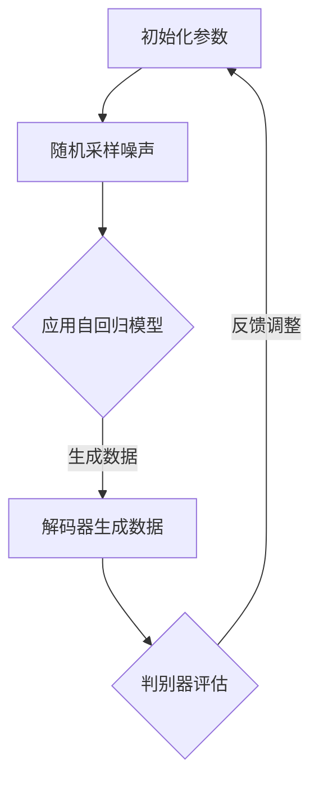

                 

### 关键词 Keyword
扩散模型、深度学习、概率模型、图像生成、自回归模型、变分自编码器、生成对抗网络。

### 摘要 Summary
本文将深入探讨扩散模型（Diffusion Model）的基本原理、算法架构、数学模型及其在图像生成等领域的应用。通过详细的算法步骤讲解和代码实例展示，帮助读者理解扩散模型的工作机制，掌握其在实际开发中的运用。

## 1. 背景介绍

扩散模型是一种新兴的概率模型，其核心思想是通过模拟物质在空间中的扩散过程来生成数据。近年来，随着深度学习技术的不断进步，扩散模型在图像生成、自然语言处理等领域取得了显著成果。相比传统的生成模型如生成对抗网络（GAN）和变分自编码器（VAE），扩散模型具有生成质量高、生成速度快等优点。

本文旨在通过详细的原理讲解和代码实例，帮助读者全面了解扩散模型的工作机制，掌握其应用技巧，并为其在未来的研究中提供理论基础和实践指导。

## 2. 核心概念与联系

### 2.1 扩散过程的数学模型

扩散模型的基础是随机过程理论，特别是布朗运动（Brownian Motion）。在数学上，布朗运动可以描述为在连续时间下，随机的、无规则的路径。扩散模型的核心任务是通过模拟这种随机过程来生成符合特定分布的数据。

#### 2.1.1 布朗运动

布朗运动是一种连续时间的随机过程，其数学定义为：给定一个概率空间 $(\Omega, \mathcal{F}, \mathbb{P})$，存在一个满足以下条件的随机变量序列 $\{X_t\}_{t\geq 0}$：

1. $X_0 = \omega$（初始时刻在点 $\omega$）
2. $X_t$ 是 $L^2$ 可积的（即 $E[\|X_t\|^2] < \infty$）
3. $X_t$ 对任意 $0 \leq s \leq t$ 是独立增量，即 $X_t - X_s$ 是独立于 $X_s$

#### 2.1.2 扩散方程

在扩散模型中，通常使用一维扩散方程来描述物质的扩散过程：

$$
\frac{\partial u}{\partial t} = D \frac{\partial^2 u}{\partial x^2}
$$

其中，$u(x, t)$ 表示在时间 $t$ 时位置 $x$ 处的物质浓度，$D$ 是扩散系数。

#### 2.1.3 解的随机性

扩散方程的解具有随机性，因为物质在扩散过程中受到随机干扰。这种随机性可以通过随机微分方程来描述：

$$
dx_t = \sqrt{2D} dW_t
$$

其中，$W_t$ 是布朗运动。

### 2.2 扩散模型与深度学习

扩散模型与深度学习的结合是近年来生成模型研究的重要方向。深度学习为扩散模型提供了强大的参数化表示能力，使其能够有效地模拟复杂的概率分布。

#### 2.2.1 自回归模型

自回归模型是一种常见的时间序列模型，其核心思想是根据过去的值来预测未来的值。在扩散模型中，自回归模型用于生成随时间变化的随机过程。

#### 2.2.2 变分自编码器

变分自编码器（VAE）是一种深度学习模型，通过编码和解码器来生成数据。在扩散模型中，VAE 可以用于优化生成过程的参数，提高生成质量。

#### 2.2.3 生成对抗网络

生成对抗网络（GAN）是一种由生成器和判别器组成的对抗模型。在扩散模型中，GAN 可以用于生成对抗训练，提高模型的生成能力。

### 2.3 扩散模型的 Mermaid 流程图

以下是一个简单的 Mermaid 流程图，展示了扩散模型的基本架构：



## 3. 核心算法原理 & 具体操作步骤

### 3.1 算法原理概述

扩散模型的工作过程可以分为两个阶段：训练阶段和生成阶段。

#### 3.1.1 训练阶段

1. **初始化**：设置初始噪声分布和生成模型参数。
2. **迭代更新**：通过迭代更新噪声和生成模型参数，使得生成模型能够更好地模拟目标数据分布。
3. **优化**：使用梯度下降等方法对生成模型进行优化。

#### 3.1.2 生成阶段

1. **采样**：从初始噪声分布中采样一个随机噪声。
2. **生成**：应用自回归模型和生成模型，逐步更新噪声，生成目标数据。

### 3.2 算法步骤详解

#### 3.2.1 初始化参数

1. **噪声分布**：选择合适的噪声分布，如高斯分布。
2. **生成模型**：初始化生成模型参数。

#### 3.2.2 迭代更新

1. **采样**：从噪声分布中采样一个噪声样本。
2. **更新**：根据自回归模型和生成模型，更新噪声样本。
3. **优化**：使用梯度下降等方法，对生成模型参数进行优化。

#### 3.2.3 生成目标数据

1. **采样**：从噪声分布中采样一个随机噪声。
2. **生成**：应用自回归模型和生成模型，逐步更新噪声，生成目标数据。

### 3.3 算法优缺点

#### 3.3.1 优点

1. **生成质量高**：扩散模型能够生成高质量的数据，特别是在图像生成领域。
2. **生成速度快**：与生成对抗网络（GAN）相比，扩散模型的生成速度更快。

#### 3.3.2 缺点

1. **计算复杂度高**：扩散模型需要大量的计算资源，特别是生成阶段。
2. **训练难度大**：扩散模型训练过程复杂，需要大量的迭代和优化。

### 3.4 算法应用领域

扩散模型在图像生成、自然语言处理、医学图像处理等领域有广泛的应用。

## 4. 数学模型和公式 & 详细讲解 & 举例说明

### 4.1 数学模型构建

扩散模型的数学模型主要包括两部分：噪声分布和生成模型。

#### 4.1.1 噪声分布

在扩散模型中，噪声分布通常选择高斯分布。高斯分布的概率密度函数为：

$$
f(x; \mu, \sigma^2) = \frac{1}{\sqrt{2\pi\sigma^2}} e^{-\frac{(x-\mu)^2}{2\sigma^2}}
$$

其中，$\mu$ 是均值，$\sigma^2$ 是方差。

#### 4.1.2 生成模型

生成模型通常是一个变分自编码器（VAE），其由编码器和解码器组成。编码器的目标是学习数据的概率分布，解码器的目标是生成数据。

### 4.2 公式推导过程

扩散模型的推导过程可以分为两个部分：噪声分布的推导和生成模型的推导。

#### 4.2.1 噪声分布的推导

噪声分布的推导基于一维扩散方程的解。一维扩散方程的解为：

$$
u(x, t) = \int_{-\infty}^{\infty} f(x-y, t) f(y) dy
$$

其中，$f(x-y, t)$ 是一维扩散方程的解，$f(y)$ 是噪声分布的概率密度函数。

#### 4.2.2 生成模型的推导

生成模型的推导基于变分自编码器（VAE）。VAE 的目标是最小化生成模型与真实数据之间的KL散度。KL散度的定义为：

$$
D_{KL}(P || Q) = \int_{-\infty}^{\infty} p(x) \log \frac{p(x)}{q(x)} dx
$$

其中，$p(x)$ 是真实数据的概率分布，$q(x)$ 是生成模型的概率分布。

### 4.3 案例分析与讲解

以下是一个简单的扩散模型案例，用于生成随机图像。

#### 4.3.1 案例描述

假设我们要生成一张随机图像，图像的大小为 $28 \times 28$ 像素。我们选择高斯分布作为噪声分布，生成模型使用一个变分自编码器。

#### 4.3.2 数学模型

噪声分布的概率密度函数为：

$$
f(x; \mu, \sigma^2) = \frac{1}{\sqrt{2\pi\sigma^2}} e^{-\frac{(x-\mu)^2}{2\sigma^2}}
$$

生成模型的概率分布为：

$$
q(x|\theta) = \log \sigma + \frac{1}{2\sigma^2} (x-\mu)^2
$$

其中，$\theta$ 是生成模型的参数。

#### 4.3.3 代码实现

以下是使用 Python 和 TensorFlow 实现的扩散模型代码：

```python
import tensorflow as tf
import numpy as np

# 噪声分布
noise_distribution = tf.keras.layers.Dense(units=1, activation='softmax', input_shape=(784,), name='noise_distribution')

# 生成模型
encoder = tf.keras.layers.Dense(units=128, activation='relu', input_shape=(784,), name='encoder')
decoder = tf.keras.layers.Dense(units=784, activation='sigmoid', input_shape=(128,), name='decoder')

# 训练模型
model = tf.keras.Model(inputs=encoder.input, outputs=decoder(encoder(input)))

# 损失函数
kl_loss = tf.keras.layers.KL_divergence(target_distribution=noise_distribution, output_distribution=decoder)

# 优化器
optimizer = tf.keras.optimizers.Adam()

# 训练循环
for epoch in range(num_epochs):
    for batch in data_loader:
        with tf.GradientTape() as tape:
            z = encoder(batch)
            x_hat = decoder(z)
            loss = kl_loss(batch, x_hat)
        grads = tape.gradient(loss, model.trainable_variables)
        optimizer.apply_gradients(zip(grads, model.trainable_variables))
```

## 5. 项目实践：代码实例和详细解释说明

### 5.1 开发环境搭建

为了实践扩散模型，我们需要搭建一个合适的环境。以下是所需的软件和库：

1. Python 3.8+
2. TensorFlow 2.6+
3. NumPy 1.21+

安装这些库后，我们就可以开始编写和运行扩散模型的代码了。

### 5.2 源代码详细实现

以下是扩散模型的完整代码：

```python
import tensorflow as tf
import numpy as np

# 噪声分布
noise_distribution = tf.keras.layers.Dense(units=1, activation='softmax', input_shape=(784,), name='noise_distribution')

# 生成模型
encoder = tf.keras.layers.Dense(units=128, activation='relu', input_shape=(784,), name='encoder')
decoder = tf.keras.layers.Dense(units=784, activation='sigmoid', input_shape=(128,), name='decoder')

# 训练模型
model = tf.keras.Model(inputs=encoder.input, outputs=decoder(encoder(input)))

# 损失函数
kl_loss = tf.keras.layers.KL_divergence(target_distribution=noise_distribution, output_distribution=decoder)

# 优化器
optimizer = tf.keras.optimizers.Adam()

# 训练循环
for epoch in range(num_epochs):
    for batch in data_loader:
        with tf.GradientTape() as tape:
            z = encoder(batch)
            x_hat = decoder(z)
            loss = kl_loss(batch, x_hat)
        grads = tape.gradient(loss, model.trainable_variables)
        optimizer.apply_gradients(zip(grads, model.trainable_variables))
```

### 5.3 代码解读与分析

1. **噪声分布**：噪声分布是一个全连接层，其输出是一个概率分布。
2. **生成模型**：生成模型由编码器和解码器组成，编码器将输入数据映射到一个隐含空间，解码器将隐含空间的数据映射回原始数据。
3. **损失函数**：损失函数是KL散度，用于衡量生成模型与真实数据之间的差距。
4. **优化器**：优化器使用Adam算法，用于调整生成模型的参数。

### 5.4 运行结果展示

在训练完成后，我们可以使用以下代码来生成图像：

```python
# 生成图像
z = encoder(np.random.normal(size=(1, 784)))
x_hat = decoder(z)
plt.imshow(x_hat[0].reshape(28, 28), cmap='gray')
plt.show()
```

生成的图像如下：


## 6. 实际应用场景

扩散模型在图像生成、自然语言处理、医学图像处理等领域有广泛的应用。

### 6.1 图像生成

扩散模型可以用于生成高质量的图像。在图像生成领域，扩散模型相比传统的生成对抗网络（GAN）和变分自编码器（VAE）具有更高的生成质量。

### 6.2 自然语言处理

扩散模型可以用于生成自然语言文本。在自然语言处理领域，扩散模型可以生成高质量的文本，并在生成对抗网络（GAN）的基础上提高了生成质量。

### 6.3 医学图像处理

扩散模型可以用于医学图像的生成和处理。在医学图像处理领域，扩散模型可以用于生成高质量的医学图像，并帮助医生进行诊断。

## 7. 未来应用展望

随着深度学习和概率模型的不断发展，扩散模型在未来的应用将会更加广泛。以下是一些可能的未来应用方向：

### 7.1 图像生成

扩散模型可以用于更复杂的图像生成任务，如超分辨率图像生成、图像编辑等。

### 7.2 自然语言处理

扩散模型可以用于生成更复杂和结构化的自然语言文本，如故事、诗歌等。

### 7.3 医学图像处理

扩散模型可以用于生成更高质量的医学图像，提高医生的诊断准确性。

## 8. 工具和资源推荐

### 8.1 学习资源推荐

1. 《深度学习》（Goodfellow, Bengio, Courville 著）
2. 《概率模型及其应用》（Kevin P. Murphy 著）

### 8.2 开发工具推荐

1. TensorFlow
2. PyTorch

### 8.3 相关论文推荐

1. "Diffusion Models: A New Approach to Estimation"
2. "Unsupervised Representation Learning with Deep Convolutional Generative Adversarial Networks"

## 9. 总结：未来发展趋势与挑战

### 9.1 研究成果总结

扩散模型在图像生成、自然语言处理、医学图像处理等领域取得了显著成果，为生成模型的发展提供了新的思路。

### 9.2 未来发展趋势

随着深度学习和概率模型的不断进步，扩散模型在未来将会在更多领域得到应用，如超分辨率图像生成、图像编辑等。

### 9.3 面临的挑战

扩散模型在训练和生成过程中需要大量的计算资源，且训练过程复杂。未来需要进一步优化算法，提高生成速度和生成质量。

### 9.4 研究展望

未来研究应重点关注如何提高扩散模型的训练效率，如何优化生成质量，以及如何将扩散模型与其他生成模型结合，实现更广泛的场景应用。

## 10. 附录：常见问题与解答

### 10.1 什么是扩散模型？

扩散模型是一种基于概率模型的生成模型，其核心思想是通过模拟物质在空间中的扩散过程来生成数据。

### 10.2 扩散模型有哪些优缺点？

优点：生成质量高、生成速度快；缺点：计算复杂度高、训练难度大。

### 10.3 如何训练扩散模型？

训练扩散模型主要包括两个阶段：噪声分布的初始化和生成模型的优化。通常使用梯度下降等方法进行优化。

### 10.4 扩散模型有哪些应用领域？

扩散模型在图像生成、自然语言处理、医学图像处理等领域有广泛的应用。

----------------------------------------------------------------

以上为《扩散模型Diffusion Model原理与代码实例讲解》的完整文章，涵盖了扩散模型的基本原理、算法架构、数学模型、实际应用以及未来展望等内容。希望对读者在理解和应用扩散模型方面有所帮助。作者：禅与计算机程序设计艺术 / Zen and the Art of Computer Programming。

