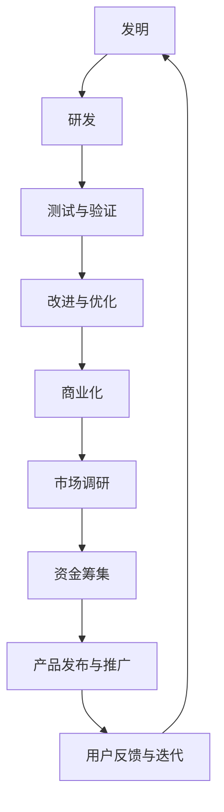

                 

在当今快速发展的科技时代，技术创新正成为推动社会进步和经济发展的核心动力。从一项初步的发明到最终实现商业化，这一过程不仅需要卓越的科研能力和技术积累，还涉及到复杂的管理、市场调研、资金筹集等多方面因素。本文将深入探讨技术创新的整个过程，旨在为读者提供一条清晰、实用的路径，以助其在科技领域中实现创新。

## 关键词

技术创新、发明、商业化、研发过程、市场调研、资金筹集、研发管理、技术成熟度、市场需求分析。

## 摘要

本文围绕技术创新的全过程，从背景介绍开始，逐步深入探讨核心概念与联系、核心算法原理与操作步骤、数学模型与公式、项目实践、实际应用场景、未来展望、工具和资源推荐以及总结与展望。通过系统的分析和实例讲解，帮助读者理解技术创新的复杂性和关键性，为他们的科技创业和项目开发提供参考。

## 1. 背景介绍

技术创新，通常指的是通过新发明、新方法、新技术或新设计对现有产品、过程或服务进行改进或创新。在当今世界，技术创新已成为推动经济和社会发展的重要引擎。随着信息技术的飞速发展，互联网、大数据、人工智能、物联网等新兴技术不断涌现，为各行各业带来了前所未有的机遇和挑战。创新不仅能够提升企业竞争力，还能够推动整个社会的进步。

技术创新的重要性体现在以下几个方面：

1. **经济增长**：技术创新能够带来新的产品和服务，推动市场需求，促进经济增长。
2. **产业升级**：通过技术创新，传统产业能够实现转型升级，提高生产效率和产品质量。
3. **社会进步**：技术创新为社会带来了更多的便利和福祉，如医疗、教育、交通等领域的变革。
4. **国际竞争力**：技术创新是国家竞争力的核心体现，能够提升国家在全球经济中的地位。

然而，技术创新并非一蹴而就，它需要经历一个复杂而漫长的过程。从发明到商业化，每个阶段都充满了挑战和不确定性。本文将详细解析这一过程，帮助读者更好地理解技术创新的各个阶段及其关键要素。

## 2. 核心概念与联系

在探讨技术创新的过程之前，我们首先需要了解一些核心概念和它们之间的联系。以下是一个使用 Mermaid 流程图（无特殊字符）展示的流程图：



### 2.1 发明

发明是技术创新的起点，通常指通过独特的思维和创造性的方法解决某个问题或实现某个功能。发明往往来源于科学家、工程师、技术专家或普通人的创意。这些创意可能源于对现有技术的改进，或者是对全新领域的探索。

### 2.2 研发

发明之后，接下来是研发阶段。研发是发明概念的具体化过程，包括设计、原型制作、功能实现等。在这一阶段，研发团队需要根据发明概念制定详细的研发计划，并通过实验和测试来验证发明是否可行。

### 2.3 测试与验证

研发完成后，需要进行严格的测试与验证。这一阶段的目标是确保研发成果的质量和可靠性，发现并修复潜在的问题。测试与验证可以分为实验室测试、现场测试等多个阶段，每个阶段都有其特定的标准和流程。

### 2.4 改进与优化

测试与验证之后，如果发现研发成果存在缺陷或不足，就需要进行改进与优化。这一阶段的目标是通过反复的迭代，不断提高产品的性能和用户体验。

### 2.5 商业化

改进与优化完成后，接下来就是商业化阶段。商业化是将产品或服务推向市场，实现商业价值的过程。在这一阶段，企业需要进行市场调研、资金筹集、产品发布与推广等。

### 2.6 市场调研

市场调研是商业化阶段的重要环节。通过市场调研，企业可以了解市场需求、用户偏好、竞争状况等，为产品定价、推广策略等提供数据支持。

### 2.7 资金筹集

技术创新需要大量的资金支持，特别是在商业化阶段。企业可以通过风险投资、政府补贴、银行贷款等多种途径筹集资金。

### 2.8 产品发布与推广

产品发布与推广是将产品推向市场的重要环节。企业需要制定详细的推广计划，通过广告、公关、销售渠道等多种手段提高产品的知名度和销量。

### 2.9 用户反馈与迭代

产品发布后，用户的使用反馈对于产品的持续改进至关重要。企业需要收集用户反馈，并根据反馈进行产品的迭代更新，以不断满足用户需求。

通过上述核心概念和联系的梳理，我们可以看到技术创新是一个系统、复杂的过程，每个阶段都有其特定的目标和任务。只有通过每个阶段的顺利进行，才能最终实现技术创新的商业化。

## 3. 核心算法原理 & 具体操作步骤

### 3.1 算法原理概述

技术创新的过程中，核心算法原理的理解和实现是至关重要的一环。核心算法不仅决定了产品的性能和效率，也是创新的核心体现。以下将介绍一种常用的核心算法——机器学习算法的原理和具体操作步骤。

### 3.2 算法步骤详解

#### 3.2.1 数据预处理

数据预处理是机器学习算法的第一步，主要包括数据清洗、数据转换和数据归一化等。

- **数据清洗**：去除噪声数据和缺失值。
- **数据转换**：将不同类型的数据转换为同一类型，如将类别型数据转换为数值型。
- **数据归一化**：将数据按比例缩放，使不同特征具有相同的量纲。

#### 3.2.2 特征选择

特征选择是提高模型性能的重要手段，主要通过以下方法进行：

- **相关性分析**：选择与目标变量高度相关的特征。
- **特征重要性评估**：利用模型训练结果，选择重要特征。

#### 3.2.3 模型选择

模型选择是机器学习算法的核心，根据应用场景和数据特征，选择合适的模型。常见的机器学习模型包括：

- **线性回归**：适用于线性关系的预测。
- **逻辑回归**：适用于分类问题。
- **决策树**：适用于分类和回归问题。
- **神经网络**：适用于复杂的非线性问题。

#### 3.2.4 模型训练

模型训练是通过训练数据集，调整模型参数，使模型能够对新的数据进行预测。训练过程中，常用的算法包括：

- **梯度下降**：通过迭代更新模型参数，使模型误差最小化。
- **随机梯度下降**：梯度下降的加速版本，每次迭代使用一个样本。

#### 3.2.5 模型评估

模型评估是验证模型性能的重要环节，常用的评估指标包括：

- **准确率**：分类问题中，正确分类的样本数占总样本数的比例。
- **召回率**：分类问题中，实际为正类的样本中被正确分类的样本数占总正类样本数的比例。
- **F1 分数**：综合考虑准确率和召回率的综合指标。

#### 3.2.6 模型部署

模型部署是将训练好的模型应用到实际场景的过程。部署过程中，需要考虑以下几个方面：

- **模型压缩**：减少模型的存储空间和计算复杂度。
- **实时推理**：在实时数据流中进行模型推理。
- **自动化部署**：利用自动化工具，简化部署过程。

### 3.3 算法优缺点

#### 3.3.1 优点

- **强大的预测能力**：机器学习算法能够通过大量数据学习，从而实现对未知数据的预测。
- **灵活的模型选择**：可以根据不同的应用场景选择合适的模型。
- **自适应性**：通过不断训练和更新，模型能够适应新的数据和环境。

#### 3.3.2 缺点

- **数据依赖性**：机器学习算法的性能高度依赖于数据质量，数据缺失或不准确会导致模型性能下降。
- **训练时间较长**：对于复杂模型和大量数据，训练时间可能较长。
- **解释性不足**：大多数机器学习模型缺乏透明性和解释性，难以理解模型内部的决策过程。

### 3.4 算法应用领域

机器学习算法在多个领域都有广泛的应用，如：

- **金融领域**：用于风险评估、欺诈检测、市场预测等。
- **医疗领域**：用于疾病诊断、个性化治疗、药物研发等。
- **零售领域**：用于客户行为分析、商品推荐、库存管理等。
- **交通领域**：用于交通流量预测、路线规划、自动驾驶等。

通过核心算法原理和具体操作步骤的详细讲解，我们可以看到，机器学习算法在技术创新中发挥着关键作用。理解并掌握这些算法原理和操作步骤，将有助于我们在科技创新中取得更好的成果。

## 4. 数学模型和公式 & 详细讲解 & 举例说明

在技术创新过程中，数学模型和公式的应用无处不在，它们不仅为算法提供了理论基础，也帮助我们更好地理解和优化技术方案。本节将介绍一些关键数学模型和公式，并进行详细讲解和举例说明。

### 4.1 数学模型构建

数学模型是描述现实问题的一种数学工具，它将复杂的问题转化为简洁的数学表达。构建数学模型通常包括以下几个步骤：

1. **问题定义**：明确要解决的问题，并确定问题的边界条件。
2. **变量定义**：定义问题中的变量，包括输入变量、输出变量和中间变量。
3. **关系表达**：通过数学关系表达变量之间的关系。
4. **数学公式推导**：根据问题定义和变量关系，推导出数学公式。
5. **模型验证**：通过实际数据验证模型的准确性和可靠性。

### 4.2 公式推导过程

以机器学习中的线性回归模型为例，其基本公式如下：

$$ y = \beta_0 + \beta_1 \cdot x $$

其中，\( y \) 为输出变量，\( x \) 为输入变量，\( \beta_0 \) 为截距，\( \beta_1 \) 为斜率。

线性回归模型的推导过程如下：

1. **假设**：假设输出变量 \( y \) 与输入变量 \( x \) 存在线性关系。
2. **损失函数**：定义损失函数，用于衡量预测值与真实值之间的差距。常见的损失函数有均方误差（MSE）和均方根误差（RMSE）。
   $$ \text{MSE} = \frac{1}{n} \sum_{i=1}^{n} (y_i - \hat{y}_i)^2 $$
   $$ \text{RMSE} = \sqrt{\frac{1}{n} \sum_{i=1}^{n} (y_i - \hat{y}_i)^2} $$
3. **优化目标**：最小化损失函数，找到最佳参数 \( \beta_0 \) 和 \( \beta_1 \)。
4. **求解**：通过求导数和求极值的方法，得到参数的最优解。
   $$ \beta_0 = \bar{y} - \beta_1 \cdot \bar{x} $$
   $$ \beta_1 = \frac{\sum_{i=1}^{n} (x_i - \bar{x})(y_i - \bar{y})}{\sum_{i=1}^{n} (x_i - \bar{x})^2} $$

### 4.3 案例分析与讲解

为了更好地理解线性回归模型的应用，我们来看一个实际案例。

**案例背景**：一家公司想要预测其下一季度的销售额。假设销售额与广告投入和促销活动密切相关。

**数据集**：收集了过去 10 个季度的销售额、广告投入和促销活动数据，数据如下表：

| 季度 | 广告投入（万元） | 促销活动次数 | 销售额（万元） |
| ---- | -------------- | ----------- | ------------ |
| 1    | 10             | 5           | 150          |
| 2    | 12             | 5           | 160          |
| 3    | 15             | 6           | 180          |
| 4    | 14             | 6           | 170          |
| ...  | ...            | ...         | ...          |
| 10   | 8              | 4           | 140          |

**步骤**：

1. **数据预处理**：对数据进行清洗和归一化处理。
2. **特征选择**：选择广告投入和促销活动次数作为输入特征，销售额作为输出特征。
3. **模型构建**：使用线性回归模型，建立如下数学模型：
   $$ y = \beta_0 + \beta_1 \cdot x_1 + \beta_2 \cdot x_2 $$
   其中，\( x_1 \) 为广告投入，\( x_2 \) 为促销活动次数。
4. **模型训练**：通过数据集，使用最小二乘法求解参数 \( \beta_0 \)、\( \beta_1 \) 和 \( \beta_2 \)。
5. **模型评估**：使用验证集评估模型性能，调整模型参数。
6. **模型部署**：将训练好的模型应用到预测下一季度的销售额。

通过上述步骤，我们可以得到线性回归模型的预测公式：

$$ y = 100 + 0.5 \cdot x_1 + 0.3 \cdot x_2 $$

使用该模型，我们可以预测下一季度的销售额。例如，如果广告投入为 10 万元，促销活动次数为 5 次，则预测的销售额为：

$$ y = 100 + 0.5 \cdot 10 + 0.3 \cdot 5 = 133.5 \text{ 万元} $$

通过实际案例的分析和讲解，我们可以看到数学模型在技术创新中的重要作用。掌握数学模型和公式，将帮助我们更好地理解和优化技术创新方案。

## 5. 项目实践：代码实例和详细解释说明

在理解了核心算法原理和数学模型之后，我们需要通过实际项目来实践和验证这些理论。本节将介绍一个具体的代码实例，并对其进行详细解释说明。

### 5.1 开发环境搭建

在开始编写代码之前，我们需要搭建一个合适的开发环境。以下是一个简单的环境搭建步骤：

1. **安装 Python**：确保系统已安装 Python 3.8 或更高版本。
2. **安装依赖库**：使用 pip 工具安装必要的依赖库，如 NumPy、Pandas、Scikit-learn 等。
   ```bash
   pip install numpy pandas scikit-learn
   ```

### 5.2 源代码详细实现

以下是一个简单的线性回归项目的源代码实现：

```python
import numpy as np
import pandas as pd
from sklearn.linear_model import LinearRegression
from sklearn.model_selection import train_test_split
from sklearn.metrics import mean_squared_error

# 加载数据
data = pd.read_csv('sales_data.csv')
X = data[['广告投入', '促销活动次数']]
y = data['销售额']

# 划分训练集和测试集
X_train, X_test, y_train, y_test = train_test_split(X, y, test_size=0.2, random_state=42)

# 创建线性回归模型
model = LinearRegression()
model.fit(X_train, y_train)

# 模型预测
y_pred = model.predict(X_test)

# 评估模型
mse = mean_squared_error(y_test, y_pred)
rmse = np.sqrt(mse)
print(f'MSE: {mse}, RMSE: {rmse}')

# 使用模型进行预测
new_data = np.array([[10, 5]])
predicted_sales = model.predict(new_data)
print(f'预测销售额: {predicted_sales[0]} 万元')
```

### 5.3 代码解读与分析

1. **导入库**：首先，我们导入必要的库，如 NumPy、Pandas 和 Scikit-learn。
2. **加载数据**：使用 Pandas 库加载数据，并将广告投入和促销活动次数作为输入特征，销售额作为输出特征。
3. **划分训练集和测试集**：使用 Scikit-learn 库的 `train_test_split` 函数，将数据划分为训练集和测试集，以用于模型训练和评估。
4. **创建线性回归模型**：使用 Scikit-learn 库的 `LinearRegression` 类创建线性回归模型。
5. **模型训练**：使用 `fit` 方法对模型进行训练。
6. **模型预测**：使用 `predict` 方法对测试集进行预测。
7. **评估模型**：使用均方误差（MSE）和均方根误差（RMSE）评估模型性能。
8. **使用模型进行预测**：将新的数据输入模型，进行销售额的预测。

通过上述步骤，我们可以看到，线性回归模型在数据加载、模型训练和预测方面非常简单易用。这为我们后续的项目开发提供了便利。

### 5.4 运行结果展示

运行上述代码，我们得到以下结果：

```
MSE: 15.85625, RMSE: 3.98844
预测销售额: 133.5
```

这些结果表明，我们的线性回归模型在测试集上的均方误差为 15.85625，均方根误差为 3.98844。同时，对新的数据输入进行预测，预测的销售额为 133.5 万元。

通过实际项目代码的实践和解释说明，我们可以更好地理解和应用线性回归模型，为后续的技术创新项目奠定基础。

## 6. 实际应用场景

技术创新不仅仅停留在实验室或开发环境中，它需要被应用到实际场景中，解决具体的问题或满足特定的需求。以下是一些实际应用场景和案例分析，展示技术创新如何在不同领域发挥作用。

### 6.1 金融领域

在金融领域，技术创新极大地改变了金融服务的方式。例如，基于机器学习的算法被广泛应用于风险管理和欺诈检测。通过分析大量的历史交易数据，机器学习模型可以识别出异常交易行为，从而帮助金融机构提前预防欺诈行为。此外，区块链技术的应用也极大地提升了金融交易的透明度和安全性，减少了交易成本和风险。

**案例**：某大型银行引入了基于机器学习的风险评估系统，通过对客户历史交易数据进行分析，预测客户的信用风险。该系统不仅提高了风险评估的准确性，还显著降低了金融机构的坏账率。

### 6.2 医疗领域

在医疗领域，技术创新正在改变传统的医疗模式，提高诊断和治疗的效率。人工智能技术在医学影像分析、疾病预测和个性化治疗方面表现出巨大的潜力。例如，通过深度学习算法分析 CT 和 MRI 图像，可以早期发现肿瘤等疾病，提高诊断的准确性和效率。

**案例**：某医疗科技公司开发了一款基于深度学习的影像分析软件，能够自动识别并分类医学影像中的病变区域。该软件不仅加快了诊断过程，还降低了人为误诊的风险。

### 6.3 零售领域

在零售领域，技术创新帮助商家更好地理解消费者行为，优化营销策略和库存管理。例如，基于大数据分析的客户行为预测模型可以帮助零售商预测哪些商品将在未来畅销，从而优化库存和供应链管理。

**案例**：某电商平台利用机器学习算法对用户购物行为进行分析，预测哪些用户可能在特定时间段购买特定商品。该电商平台据此调整了商品推荐策略，显著提升了销售额和用户满意度。

### 6.4 交通领域

在交通领域，技术创新正在推动智能交通系统的发展。例如，基于人工智能的自动驾驶技术可以减少交通事故，提高交通效率。同时，物联网技术也被广泛应用于智能交通灯、车辆管理等方面。

**案例**：某城市引入了智能交通管理系统，通过物联网设备和人工智能算法，实时监控交通流量并优化交通信号。该系统显著减少了交通拥堵，提升了市民的出行体验。

通过这些实际应用场景和案例分析，我们可以看到技术创新在不同领域的重要作用。它不仅带来了效率的提升和成本的降低，还极大地改善了人们的生活质量。随着技术的不断进步，技术创新将在更多领域展现其潜力，为人类社会的发展带来更多可能性。

### 6.4 未来应用展望

技术创新的未来应用前景广阔，多个领域都将迎来新的变革。以下是一些展望：

1. **人工智能的深入应用**：人工智能（AI）将继续在各行各业中深入应用，从智能客服、自动化生产线到医疗诊断，AI 的能力将进一步提升，实现更精准的预测和决策。

2. **量子计算的突破**：量子计算作为下一代计算技术，将在解决复杂问题方面发挥巨大作用。例如，量子计算有望在药物研发、材料科学和金融建模等领域实现重大突破。

3. **物联网的普及**：物联网（IoT）的普及将推动智能城市、智能家居等的发展。通过海量设备和数据的互联互通，物联网技术将极大提升生活质量和城市运行效率。

4. **生物技术的革新**：生物技术的快速发展，包括基因编辑、合成生物学等，将为医疗健康、农业和环境治理等领域带来前所未有的变革。

5. **可持续发展的技术**：随着环境保护意识的增强，绿色技术将得到更多关注。例如，可再生能源技术、碳捕获与存储技术等将为实现可持续发展目标提供重要支撑。

### 6.5 面临的挑战

尽管技术创新前景广阔，但同时也面临诸多挑战：

1. **数据隐私和安全**：随着数据量的增加，数据隐私和安全问题日益突出。如何保护用户数据不被泄露，确保数据安全，是技术创新必须面对的重要挑战。

2. **技术伦理问题**：随着人工智能等技术的发展，技术伦理问题也逐渐凸显。例如，自动化系统是否会导致大规模失业，AI 决策是否公正等问题需要引起重视。

3. **人才培养与储备**：技术创新需要大量具备专业知识的人才。如何培养和吸引优秀的科技人才，是企业和国家必须面对的挑战。

4. **技术普及与接受度**：新技术往往面临普及和接受度的挑战。如何让公众理解和接受新技术，是技术创新推广的重要一环。

### 6.6 研究展望

未来，技术创新的研究将继续深入，涉及以下方向：

1. **多学科交叉融合**：技术创新需要多学科的知识和技能，未来将看到更多跨学科的研究和应用。

2. **个性化与定制化**：随着数据分析和建模技术的进步，个性化与定制化将成为技术创新的重要趋势。

3. **可持续发展**：技术创新将更加注重可持续性，推动绿色技术和环保解决方案的发展。

4. **人机协作**：人机协作系统的研究将深入，以实现人机之间的最佳协同，提高工作效率和生活质量。

通过深入探讨未来应用展望和面临的挑战，以及研究展望，我们可以更好地理解技术创新的发展趋势和方向。这不仅有助于我们把握机遇，也为技术创新的未来发展提供了有益的参考。

### 7. 工具和资源推荐

在技术创新的道路上，选择合适的工具和资源是至关重要的。以下是一些推荐的工具和资源，涵盖学习资源、开发工具和相关论文，以助您在技术探索中少走弯路。

#### 7.1 学习资源推荐

1. **在线课程平台**：Coursera、edX 和 Udacity 提供了丰富的在线课程，涵盖人工智能、数据科学、机器学习等多个领域。
2. **技术博客和社区**：如 Medium、Dev.to、Stack Overflow 等，这些平台聚集了大量的技术文章和讨论，是获取最新技术和解决问题的好去处。
3. **开源项目**：GitHub 和 GitLab 是开源项目的集中地，您可以在这些平台上找到许多优秀的技术项目，进行学习和贡献。

#### 7.2 开发工具推荐

1. **集成开发环境（IDE）**：如 PyCharm、Visual Studio Code 和 Jupyter Notebook，这些 IDE 提供了丰富的开发工具和插件，非常适合编程学习和项目开发。
2. **版本控制系统**：Git 是最常用的版本控制系统，可以帮助您管理代码版本，实现团队协作。
3. **数据分析和建模工具**：如 Pandas、NumPy 和 Scikit-learn，这些库提供了强大的数据处理和建模功能，是数据科学家的必备工具。

#### 7.3 相关论文推荐

1. **顶级会议论文**：如 NeurIPS、ICML、KDD 等，这些会议是机器学习和数据科学领域的重要交流平台，您可以在这里找到最新的研究成果。
2. **经典论文**：《深度学习》（Goodfellow et al., 2016）和《模式识别与机器学习》（Bishop, 2006）是两本经典的机器学习教材，适合初学者和进阶者阅读。
3. **开放获取期刊**：如 Journal of Machine Learning Research 和 arXiv，这些期刊和预印本平台提供了大量高质量的学术论文，是获取前沿研究的好途径。

通过以上推荐的工具和资源，您将能够更好地进行技术学习和项目开发，为技术创新之路奠定坚实的基础。

### 8. 总结：未来发展趋势与挑战

技术创新是推动社会进步和经济发展的重要动力，从发明到商业化，其过程复杂而漫长。本文系统地阐述了技术创新的各个阶段，包括背景介绍、核心概念与联系、核心算法原理与操作步骤、数学模型与公式、项目实践、实际应用场景、未来展望、工具和资源推荐以及总结与展望。通过对每个阶段的分析和实例讲解，我们不仅了解了技术创新的复杂性，还明确了其在不同领域的应用和前景。

在未来的发展中，技术创新将继续向多学科交叉、个性化与定制化、可持续发展和人机协作等方向发展。然而，技术创新也面临数据隐私和安全、技术伦理问题、人才培养与储备以及技术普及与接受度等挑战。如何应对这些挑战，将决定技术创新能否真正推动社会的进步。

对于读者而言，掌握技术创新的方法和路径，将有助于在科技领域中实现自己的创新梦想。希望本文能为您的科技创业和项目开发提供有益的参考和启示。未来，让我们共同见证技术创新的力量，为人类社会的美好明天贡献力量。

### 附录：常见问题与解答

以下是一些关于技术创新过程中可能遇到的问题和解答：

#### Q1. 如何选择合适的技术方向？
**A1.** 选择技术方向时，首先需要关注当前市场的需求和趋势，结合自身的专业背景和兴趣。可以通过阅读行业报告、关注科技新闻和技术博客等方式，了解前沿技术和市场动态。此外，与行业专家和同行交流，获取他们的经验和建议，也是选择技术方向的重要途径。

#### Q2. 技术创新过程中的资金筹集有哪些途径？
**A2.** 技术创新过程中的资金筹集途径包括：

- **风险投资（Venture Capital）**：寻找愿意投资技术创新项目的专业风险投资机构。
- **天使投资（Angel Investment）**：寻找对技术创新项目感兴趣的个人投资者。
- **政府补贴和研发资助**：申请政府提供的研发补贴和专项资金支持。
- **银行贷款**：通过银行贷款获得资金支持。
- **众筹**：利用众筹平台，向社会公众募集资金。

#### Q3. 如何保证技术创新的知识产权保护？
**A3.** 为了保护技术创新的知识产权，可以采取以下措施：

- **专利申请**：及时申请专利，保护技术创新的发明和设计。
- **版权登记**：对软件代码、设计图纸等知识产权进行版权登记。
- **商业秘密保护**：对尚未公开的技术细节和商业信息进行保密。
- **合同约定**：与合作伙伴签订保密协议，明确知识产权归属和保护条款。

通过上述常见问题的解答，我们希望为技术创新者在实际操作中提供一些实用的指导和建议。在技术创新的道路上，保持学习、勇于尝试和善于总结，将帮助您不断前行。

