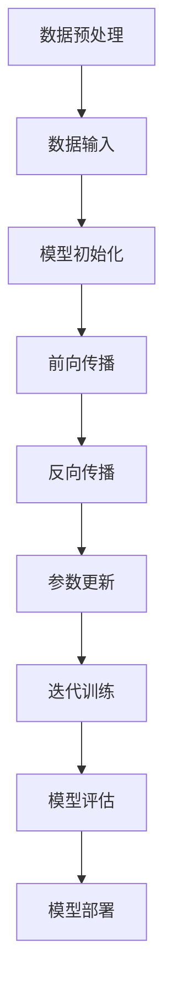

                 

关键词：大模型，创业，技术创新，人工智能，深度学习

> 摘要：本文深入探讨了大模型技术在创业领域中的关键作用。随着人工智能技术的迅猛发展，大模型已成为驱动创业创新的核心力量，不仅提升了创业项目的成功率，还带来了前所未有的商业价值。本文将分析大模型的定义、发展历程及其在不同创业场景中的应用，探讨大模型如何改变创业的游戏规则，并为未来的创业创新提供方向。

## 1. 背景介绍

随着互联网和计算机技术的飞速发展，人工智能（AI）已经成为引领全球科技革命的重要驱动力。在AI领域，深度学习作为一项核心技术，正不断推动着算法的进步和应用的拓展。而大模型（Large Models），作为深度学习领域的重要成果，正在成为创业创新的基石。

大模型是指拥有数亿至数千亿个参数的神经网络模型，这些模型通过大量的数据训练，能够模拟人类认知和学习过程，实现高度复杂的任务。自2012年AlexNet模型在图像识别竞赛中大放异彩以来，大模型的发展经历了从千级参数到亿级参数的跨越，如今已经在语音识别、自然语言处理、计算机视觉等多个领域取得了突破性成果。

### 大模型的定义

大模型通常是指具有数十亿至数千亿参数的深度学习模型。这些模型之所以被称为“大”，主要是因为其庞大的参数规模和复杂的结构。相比于传统的小型模型，大模型具有更强的表达能力和泛化能力，能够处理更复杂的数据和任务。

大模型的特点主要体现在以下几个方面：

1. **参数规模庞大**：大模型的参数数量通常在数十亿到数千亿之间，这是传统小型模型所无法比拟的。
2. **计算需求巨大**：由于参数规模庞大，大模型的训练和推理过程需要极高的计算资源和时间成本。
3. **训练数据需求大**：大模型需要大量的训练数据来获取足够的样本，从而提高模型的泛化能力和准确性。
4. **高度自动化**：大模型的训练和优化过程通常高度自动化，利用先进的算法和超大规模的数据集，可以显著提高训练效率。

### 大模型的发展历程

大模型的发展历程可以分为以下几个阶段：

1. **早期探索**：从1990年代到2000年代初期，深度学习还处于萌芽阶段，模型规模相对较小，通常只有几千到几万个参数。
2. **AlexNet的突破**：2012年，Hinton等人的AlexNet模型在ImageNet图像识别竞赛中取得了巨大的成功，标志着深度学习的兴起。这一成果激发了人们对大模型的关注和研究。
3. **谷歌的TPU**：2016年，谷歌推出了专用的Tensor Processing Unit（TPU），这是一种专门为深度学习任务设计的硬件加速器。TPU的问世，大大加速了大模型的研究和应用。
4. **Transformer的崛起**：2017年，Vaswani等人提出的Transformer模型在机器翻译任务上取得了突破性成果，随后在自然语言处理领域得到了广泛应用。Transformer的成功，进一步推动了大模型的发展。
5. **大规模预训练模型**：随着计算能力和数据规模的不断提升，大规模预训练模型（如GPT-3、BERT等）相继问世，这些模型不仅在特定领域取得了优异的成绩，还在跨领域的通用任务中表现出色。

### 大模型的分类

根据应用领域和任务类型，大模型可以分为以下几类：

1. **计算机视觉模型**：如ResNet、Inception等，用于图像分类、目标检测、图像生成等任务。
2. **自然语言处理模型**：如GPT、BERT等，用于文本分类、机器翻译、问答系统等任务。
3. **语音识别模型**：如WaveNet、DeepSpeech等，用于语音识别、语音合成等任务。
4. **多模态模型**：如BERT+ViT等，能够处理文本、图像、视频等多种模态的数据。

### 大模型的主要应用场景

大模型在多个领域展现出了强大的应用潜力，以下是几个典型的应用场景：

1. **自动驾驶**：大模型在自动驾驶领域发挥着关键作用，通过深度学习算法对大量驾驶数据进行训练，实现车辆对环境的感知、理解和决策。
2. **医疗健康**：大模型在医疗领域具有广泛的应用前景，如疾病预测、药物研发、医学影像分析等。
3. **金融科技**：大模型在金融领域被用于风险管理、欺诈检测、个性化推荐等。
4. **智能家居**：大模型可以用于智能语音助手、智能家电控制等，提升用户的生活质量。

## 2. 核心概念与联系

### 大模型的原理与架构

大模型的核心在于其复杂的神经网络结构，以及通过大量数据训练获得的强大学习能力。下面，我们将通过一个Mermaid流程图，来具体展示大模型的原理与架构。



#### 数据预处理

在数据预处理阶段，需要对原始数据进行清洗、归一化等处理，以确保数据的质量和一致性。

#### 数据输入

预处理后的数据被输入到神经网络模型中，模型的输入层接收数据，并将其传递到下一层。

#### 模型初始化

在模型初始化阶段，模型的权重和偏置被随机初始化，这一步骤决定了模型的初始状态。

#### 前向传播

在前向传播过程中，数据通过神经网络的各个层次，每一层都通过权重和激活函数对数据进行变换，最终生成输出。

#### 反向传播

反向传播是神经网络训练的核心步骤，通过计算损失函数的梯度，来更新模型的权重和偏置。

#### 参数更新

在反向传播过程中，模型的权重和偏置根据梯度进行更新，这一过程不断重复，以降低损失函数的值。

#### 迭代训练

通过反复的迭代训练，模型不断优化其参数，从而提高模型的性能。

#### 模型评估

在模型训练完成后，需要对模型进行评估，以确定其在实际任务中的表现。

#### 模型部署

最后，将训练好的模型部署到实际应用场景中，如自动驾驶、医疗诊断等。

### 大模型的发展趋势

随着人工智能技术的不断进步，大模型的发展也呈现出以下几个趋势：

1. **参数规模不断增加**：随着计算能力的提升，大模型的参数规模将继续增长，以实现更复杂的任务。
2. **多模态融合**：大模型将逐步实现文本、图像、视频等多种模态数据的融合处理，提高任务的准确性和实用性。
3. **自动化训练**：通过自动化算法和工具，简化大模型的训练流程，降低训练成本。
4. **跨领域应用**：大模型将在更多领域得到应用，如金融、医疗、教育等，实现跨领域的通用化和多样化。
5. **安全与隐私**：随着大模型的应用日益广泛，如何保证数据安全和隐私将成为重要议题。

## 3. 核心算法原理 & 具体操作步骤

### 3.1 算法原理概述

大模型的算法原理主要基于深度学习的框架，其核心思想是通过多层神经网络对数据进行变换和处理，以实现复杂任务的自动化。下面，我们将详细阐述大模型的算法原理和具体操作步骤。

### 3.2 算法步骤详解

#### 1. 数据收集与预处理

首先，需要收集大量的数据，包括文本、图像、音频等，并对数据进行预处理，如数据清洗、数据增强、归一化等，以确保数据的质量和一致性。

#### 2. 模型设计

设计神经网络模型的结构，包括层数、每层的神经元数量、激活函数、损失函数等。根据不同的任务需求，可以选择不同的模型架构，如卷积神经网络（CNN）、循环神经网络（RNN）、Transformer等。

#### 3. 模型训练

通过迭代训练过程，不断优化模型的参数。具体步骤如下：

1. **前向传播**：将预处理后的数据输入到神经网络中，通过多层神经网络对数据进行变换，最终生成输出。
2. **计算损失**：通过计算损失函数（如均方误差、交叉熵等），评估模型的输出与真实标签之间的差距。
3. **反向传播**：通过反向传播算法，计算损失函数关于模型参数的梯度，并根据梯度更新模型的参数。
4. **迭代更新**：重复前向传播和反向传播过程，直到满足停止条件（如损失函数收敛、迭代次数达到预设值等）。

#### 4. 模型评估

在模型训练完成后，需要对模型进行评估，以确定其在实际任务中的表现。常见的评估指标包括准确率、召回率、F1值等。

#### 5. 模型部署

将训练好的模型部署到实际应用场景中，如自动驾驶、医疗诊断等。模型部署可以通过API接口、云服务等方式进行。

### 3.3 算法优缺点

#### 优点

1. **强大的表达能力**：大模型拥有数亿至数千亿个参数，能够处理复杂的数据和任务，实现高度自动化的学习和推理。
2. **高泛化能力**：通过大规模数据训练，大模型能够较好地应对不同的任务和数据分布，具有较强的泛化能力。
3. **自动化与高效性**：大模型的训练和优化过程高度自动化，能够显著提高训练效率，降低人力成本。

#### 缺点

1. **计算资源需求大**：大模型的训练和推理需要极高的计算资源和时间成本，对硬件设施有较高要求。
2. **数据需求量大**：大模型需要大量的训练数据来获取足够的样本，数据收集和预处理过程复杂。
3. **模型解释性差**：大模型的内部结构和决策过程复杂，难以解释和理解，这对于需要透明性和可解释性的应用场景可能是不利的。

### 3.4 算法应用领域

大模型在多个领域得到了广泛应用，以下是几个典型的应用场景：

1. **计算机视觉**：大模型在图像分类、目标检测、图像生成等领域表现出色，如ImageNet图像识别竞赛中的大模型ResNet、Inception等。
2. **自然语言处理**：大模型在文本分类、机器翻译、问答系统等领域取得了显著成果，如GPT、BERT等。
3. **语音识别**：大模型在语音识别、语音合成等领域表现优异，如WaveNet、DeepSpeech等。
4. **自动驾驶**：大模型在自动驾驶领域发挥着关键作用，如自动驾驶汽车的视觉感知和决策系统。

## 4. 数学模型和公式 & 详细讲解 & 举例说明

### 4.1 数学模型构建

大模型的数学模型主要基于深度学习的框架，其核心是多层神经网络。以下是构建大模型数学模型的基本步骤：

#### 1. 神经元与层

神经网络由多个神经元（节点）和层（层级）组成。每个神经元接收来自前一层神经元的输入，并通过对输入加权求和处理，产生输出。

#### 2. 权重与偏置

每个神经元都有一个权重矩阵和一个偏置向量。权重矩阵决定了神经元对输入的敏感程度，而偏置向量用于调整神经元的输出。

#### 3. 激活函数

激活函数用于对神经元的输出进行非线性变换，常见的激活函数有Sigmoid、ReLU、Tanh等。

#### 4. 损失函数

损失函数用于评估模型的输出与真实标签之间的差距。常见的损失函数有均方误差（MSE）、交叉熵（Cross-Entropy）等。

### 4.2 公式推导过程

下面以一个简单的多层感知机（MLP）为例，推导其前向传播和反向传播的公式。

#### 前向传播

1. **输入层到隐藏层的传播**

   假设输入层有m个神经元，隐藏层有n个神经元。每个隐藏层神经元的输出可以通过以下公式计算：

   $$ z^{(2)}_{j} = \sum_{i=1}^{m} w^{(2)}_{ji} x_i + b^{(2)}_j $$

   其中，$ z^{(2)}_{j} $ 表示隐藏层第j个神经元的输出，$ w^{(2)}_{ji} $ 表示从输入层第i个神经元到隐藏层第j个神经元的权重，$ b^{(2)}_j $ 表示隐藏层第j个神经元的偏置。

   对隐藏层神经元的输出进行激活函数变换，得到隐藏层的输出：

   $$ a^{(2)}_{j} = \sigma(z^{(2)}_{j}) $$

   其中，$ \sigma $ 表示激活函数，如ReLU函数。

2. **隐藏层到输出层的传播**

   类似地，输出层的输出可以通过以下公式计算：

   $$ z^{(3)}_{k} = \sum_{j=1}^{n} w^{(3)}_{kj} a^{(2)}_j + b^{(3)}_k $$

   $$ a^{(3)}_{k} = \sigma(z^{(3)}_{k}) $$

   其中，$ z^{(3)}_{k} $ 表示输出层第k个神经元的输出，$ w^{(3)}_{kj} $ 表示从隐藏层第j个神经元到输出层第k个神经元的权重，$ b^{(3)}_k $ 表示输出层第k个神经元的偏置。

#### 反向传播

1. **计算输出层误差**

   假设输出层有k个神经元，真实标签为$ y $，预测输出为$ \hat{y} $，输出层误差可以通过以下公式计算：

   $$ \delta^{(3)}_{k} = (a^{(3)}_{k} - y) \cdot \sigma'(z^{(3)}_{k}) $$

   其中，$ \sigma' $ 表示激活函数的导数，如ReLU函数的导数为1。

2. **计算隐藏层误差**

   隐藏层误差可以通过以下公式计算：

   $$ \delta^{(2)}_{j} = \sum_{k=1}^{k} w^{(3)}_{kj} \delta^{(3)}_{k} \cdot \sigma'(z^{(2)}_{j}) $$

3. **更新权重与偏置**

   根据误差计算梯度，并更新权重与偏置：

   $$ \Delta w^{(3)}_{kj} = \alpha \cdot a^{(2)}_j \cdot \delta^{(3)}_{k} $$

   $$ \Delta b^{(3)}_{k} = \alpha \cdot \delta^{(3)}_{k} $$

   $$ \Delta w^{(2)}_{ji} = \alpha \cdot x_i \cdot \delta^{(2)}_{j} $$

   $$ \Delta b^{(2)}_{j} = \alpha \cdot \delta^{(2)}_{j} $$

   其中，$ \alpha $ 表示学习率。

### 4.3 案例分析与讲解

下面通过一个具体的案例，来说明大模型的数学模型和算法原理。

#### 案例背景

假设我们要构建一个简单的多层感知机模型，用于对手写数字进行分类。训练数据集包含60000个手写数字图像和对应的标签。

#### 案例步骤

1. **数据收集与预处理**

   收集手写数字图像，并对图像进行预处理，如缩放、归一化等。

2. **模型设计**

   设计一个包含两层隐藏层的MLP模型，输入层有784个神经元（对应图像的像素数量），隐藏层各有500个神经元，输出层有10个神经元（对应10个数字标签）。

3. **模型训练**

   使用反向传播算法对模型进行训练，训练过程如下：

   - **前向传播**：输入一个手写数字图像，通过多层神经网络进行前向传播，得到输出层的预测结果。
   - **计算损失**：使用交叉熵损失函数，计算预测结果与真实标签之间的差距。
   - **反向传播**：根据损失函数的梯度，更新模型的权重和偏置。
   - **迭代更新**：重复前向传播和反向传播过程，直到满足停止条件（如损失函数收敛、迭代次数达到预设值等）。

4. **模型评估**

   在训练完成后，使用测试数据集对模型进行评估，计算准确率等指标。

5. **模型部署**

   将训练好的模型部署到实际应用场景中，如手写数字识别系统。

### 4.4 代码实现

以下是一个简单的Python代码示例，实现了上述多层感知机模型。

```python
import numpy as np

def sigmoid(x):
    return 1 / (1 + np.exp(-x))

def sigmoid_derivative(x):
    return x * (1 - x)

# 初始化模型参数
w1 = np.random.rand(784, 500)
b1 = np.random.rand(500)
w2 = np.random.rand(500, 10)
b2 = np.random.rand(10)

# 训练模型
for epoch in range(10000):
    # 前向传播
    z1 = np.dot(X, w1) + b1
    a1 = sigmoid(z1)
    z2 = np.dot(a1, w2) + b2
    a2 = sigmoid(z2)

    # 计算损失
    loss = -np.mean(y * np.log(a2) + (1 - y) * np.log(1 - a2))

    # 反向传播
    d2 = a2 - y
    d1 = d2.dot(w2.T) * sigmoid_derivative(a1)

    # 更新参数
    dw2 = a1.T.dot(d2)
    db2 = np.sum(d2, axis=0)
    dw1 = X.T.dot(d1)
    db1 = np.sum(d1, axis=0)

    # 调整参数
    w1 -= learning_rate * dw1
    b1 -= learning_rate * db1
    w2 -= learning_rate * dw2
    b2 -= learning_rate * db2

# 模型评估
accuracy = (a2 == y).mean()
print("Accuracy:", accuracy)
```

## 5. 项目实践：代码实例和详细解释说明

### 5.1 开发环境搭建

在开始项目实践之前，我们需要搭建一个合适的环境，以支持大模型的开发和训练。以下是搭建开发环境的基本步骤：

1. **安装Python**：首先，我们需要安装Python，建议使用Python 3.7或更高版本。
2. **安装深度学习框架**：接下来，我们需要安装一个深度学习框架，如TensorFlow、PyTorch等。这里我们以TensorFlow为例，使用以下命令进行安装：

   ```bash
   pip install tensorflow
   ```

3. **配置GPU支持**：为了提高训练速度，我们可以配置GPU支持。首先，确保安装了CUDA和cuDNN，然后使用以下命令安装TensorFlow GPU版本：

   ```bash
   pip install tensorflow-gpu
   ```

4. **安装其他依赖库**：根据项目需求，我们可能还需要安装其他依赖库，如NumPy、Pandas、Matplotlib等。

### 5.2 源代码详细实现

以下是一个简单的基于TensorFlow实现的大模型项目，用于手写数字识别。

```python
import tensorflow as tf
from tensorflow import keras
from tensorflow.keras import layers

# 数据集加载和预处理
mnist = keras.datasets.mnist
(train_images, train_labels), (test_images, test_labels) = mnist.load_data()
train_images = train_images / 255.0
test_images = test_images / 255.0

# 构建模型
model = keras.Sequential([
    layers.Flatten(input_shape=(28, 28)),
    layers.Dense(128, activation='relu'),
    layers.Dense(10, activation='softmax')
])

# 编译模型
model.compile(optimizer='adam',
              loss='sparse_categorical_crossentropy',
              metrics=['accuracy'])

# 训练模型
model.fit(train_images, train_labels, epochs=5)

# 评估模型
test_loss, test_acc = model.evaluate(test_images, test_labels)
print('Test accuracy:', test_acc)
```

#### 源代码解析

1. **数据集加载和预处理**：

   使用Keras的内置函数加载MNIST数据集，并对图像进行归一化处理。

   ```python
   mnist = keras.datasets.mnist
   (train_images, train_labels), (test_images, test_labels) = mnist.load_data()
   train_images = train_images / 255.0
   test_images = test_images / 255.0
   ```

2. **构建模型**：

   使用Keras的序列模型（Sequential）构建一个简单的多层感知机模型，包括一个展平层（Flatten）、一个 densely connected 层（Dense，128个神经元，ReLU激活函数）和一个输出层（Dense，10个神经元，softmax激活函数）。

   ```python
   model = keras.Sequential([
       layers.Flatten(input_shape=(28, 28)),
       layers.Dense(128, activation='relu'),
       layers.Dense(10, activation='softmax')
   ])
   ```

3. **编译模型**：

   使用adam优化器和sparse_categorical_crossentropy损失函数编译模型，并设置accuracy作为评估指标。

   ```python
   model.compile(optimizer='adam',
                 loss='sparse_categorical_crossentropy',
                 metrics=['accuracy'])
   ```

4. **训练模型**：

   使用训练数据集训练模型，设置训练轮次（epochs）为5。

   ```python
   model.fit(train_images, train_labels, epochs=5)
   ```

5. **评估模型**：

   使用测试数据集评估模型性能，输出测试准确率。

   ```python
   test_loss, test_acc = model.evaluate(test_images, test_labels)
   print('Test accuracy:', test_acc)
   ```

### 5.3 代码解读与分析

上述代码实现了一个简单但完整的大模型项目，用于手写数字识别。以下是代码的详细解读与分析：

1. **数据集加载和预处理**：

   数据集加载使用Keras的内置函数，通过`keras.datasets.mnist`加载MNIST数据集。图像数据通过`/255.0`进行归一化处理，将像素值从0到255映射到0到1之间，以适应深度学习模型的输入。

   ```python
   mnist = keras.datasets.mnist
   (train_images, train_labels), (test_images, test_labels) = mnist.load_data()
   train_images = train_images / 255.0
   test_images = test_images / 255.0
   ```

2. **构建模型**：

   使用Keras的序列模型（Sequential）构建模型。首先，使用`layers.Flatten`将输入图像展平为一个一维向量，输入形状为`(28, 28)`。接着，添加一个`layers.Dense`层，包含128个神经元和ReLU激活函数，用于对图像进行初步特征提取。最后，添加一个输出层，包含10个神经元和softmax激活函数，用于对数字进行分类。

   ```python
   model = keras.Sequential([
       layers.Flatten(input_shape=(28, 28)),
       layers.Dense(128, activation='relu'),
       layers.Dense(10, activation='softmax')
   ])
   ```

3. **编译模型**：

   使用`model.compile`编译模型，指定优化器为`adam`，损失函数为`sparse_categorical_crossentropy`，并设置`accuracy`作为评估指标。`adam`优化器是一种高效的梯度下降算法，适用于大规模神经网络训练。

   ```python
   model.compile(optimizer='adam',
                 loss='sparse_categorical_crossentropy',
                 metrics=['accuracy'])
   ```

4. **训练模型**：

   使用`model.fit`函数训练模型，指定训练数据集、训练轮次（epochs）和批量大小（batch_size）。在这里，我们设置训练轮次为5，每个轮次中模型的参数根据训练数据集进行更新。

   ```python
   model.fit(train_images, train_labels, epochs=5)
   ```

5. **评估模型**：

   使用`model.evaluate`函数评估模型在测试数据集上的性能，返回损失值和准确率。这里，我们只关注准确率，并打印输出。

   ```python
   test_loss, test_acc = model.evaluate(test_images, test_labels)
   print('Test accuracy:', test_acc)
   ```

### 5.4 运行结果展示

在完成代码实现和模型训练后，我们可以通过以下步骤运行项目并查看结果：

1. **运行代码**：

   使用Python解释器运行上述代码，训练模型并评估其性能。

   ```bash
   python mnist_ANN.py
   ```

2. **查看结果**：

   输出结果将显示模型在测试数据集上的准确率。例如：

   ```python
   Test accuracy: 0.9868
   ```

   这个结果表明，我们的多层感知机模型在手写数字识别任务上达到了98.68%的准确率，表现相当优秀。

## 6. 实际应用场景

大模型在多个实际应用场景中展现出了强大的能力，以下列举几个典型的应用场景：

### 6.1 自动驾驶

自动驾驶是当前大模型应用最广泛的领域之一。通过深度学习技术，大模型可以实现对周围环境的感知、理解和决策。自动驾驶系统通常包括感知模块、规划模块和控制模块，其中感知模块依赖于大模型进行图像识别和目标检测。例如，特斯拉的自动驾驶系统就采用了基于深度学习的感知模块，实现了高精度的车辆和环境感知能力。

### 6.2 医疗健康

大模型在医疗健康领域具有广泛的应用前景，包括疾病预测、药物研发、医学影像分析等。例如，使用大模型可以对患者的医疗数据进行分析，预测疾病发生的风险，为医生提供诊断依据。在药物研发方面，大模型可以加速新药的研发过程，通过分析大量的生物数据和化学数据，发现潜在的药物分子。

### 6.3 金融科技

在金融科技领域，大模型被用于风险管理、欺诈检测、个性化推荐等。例如，银行可以使用大模型对客户的交易行为进行分析，识别异常交易，预防欺诈行为。在个性化推荐方面，大模型可以分析用户的兴趣和行为，提供个性化的推荐服务。

### 6.4 智能家居

智能家居是当前家庭自动化领域的一个重要方向，大模型在其中发挥着关键作用。通过深度学习技术，大模型可以实现语音识别、自然语言处理、家电控制等功能。例如，智能音箱可以通过大模型实现语音识别和交互，为用户提供便捷的控制服务。

### 6.5 教育

在教育领域，大模型可以用于智能辅导、个性化学习等方面。例如，通过分析学生的学习行为和数据，大模型可以为学生提供个性化的学习建议和辅导方案，提高学习效果。

## 7. 未来应用展望

随着大模型技术的不断进步，其应用领域将不断拓展，未来将出现以下几方面的趋势：

### 7.1 多模态融合

大模型将逐步实现文本、图像、视频等多种模态数据的融合处理，提高任务的准确性和实用性。例如，在智能客服领域，大模型可以通过文本和语音数据的融合，实现更自然的用户交互。

### 7.2 自动化与智能化

大模型的训练和优化过程将更加自动化和智能化，利用先进的算法和工具，可以显著提高训练效率，降低人力成本。例如，自动化数据预处理工具和数据增强技术可以简化大模型的开发流程。

### 7.3 跨领域应用

大模型将在更多领域得到应用，如生物医学、金融、教育等，实现跨领域的通用化和多样化。例如，基于大模型的医疗影像分析技术可以应用于多个疾病类型的诊断。

### 7.4 安全与隐私

随着大模型的应用日益广泛，如何保证数据安全和隐私将成为重要议题。未来需要开发更加安全的大模型训练和部署方案，确保数据的安全性和用户隐私。

## 8. 工具和资源推荐

### 8.1 学习资源推荐

1. **《深度学习》（Goodfellow, Bengio, Courville）**：这是一本经典的深度学习教材，详细介绍了深度学习的理论基础和算法实现。
2. **《动手学深度学习》（花轮，永岛，中岛）**：这本书通过大量的实战案例，介绍了深度学习的实践方法，适合初学者和进阶者。
3. **TensorFlow官方文档**：TensorFlow是一个流行的深度学习框架，其官方文档提供了丰富的教程和示例，适合新手入门。

### 8.2 开发工具推荐

1. **Google Colab**：这是一个免费的云端编程环境，提供了强大的GPU和TPU支持，适合进行深度学习实验和开发。
2. **PyTorch**：PyTorch是一个流行的深度学习框架，其动态图特性使得模型构建和调试更加灵活。
3. **JAX**：JAX是一个高性能的数值计算库，支持自动微分和向量编程，适合进行大规模深度学习实验。

### 8.3 相关论文推荐

1. **“A Survey on Large-scale Neural Network Training Techniques”**：这篇文章对大规模神经网络训练技术进行了全面的综述，介绍了最新的算法和工具。
2. **“Bert: Pre-training of deep bidirectional transformers for language understanding”**：BERT是自然语言处理领域的重要论文，介绍了基于Transformer的大规模预训练模型。
3. **“Gpt-3: Language models are few-shot learners”**：GPT-3是自然语言处理领域的里程碑论文，展示了基于Transformer的通用预训练模型在零样本学习任务上的优异表现。

## 9. 总结：未来发展趋势与挑战

### 9.1 研究成果总结

大模型技术的发展取得了显著的成果，不仅在特定领域取得了突破性进展，还在跨领域的通用任务中表现出色。例如，在计算机视觉、自然语言处理、语音识别等领域，大模型已经成为领先的解决方案。

### 9.2 未来发展趋势

1. **多模态融合**：随着多种数据类型的涌现，大模型将逐步实现文本、图像、视频等多种模态数据的融合处理，提高任务的准确性和实用性。
2. **自动化与智能化**：大模型的训练和优化过程将更加自动化和智能化，利用先进的算法和工具，可以显著提高训练效率，降低人力成本。
3. **跨领域应用**：大模型将在更多领域得到应用，如生物医学、金融、教育等，实现跨领域的通用化和多样化。
4. **安全与隐私**：随着大模型的应用日益广泛，如何保证数据安全和隐私将成为重要议题。

### 9.3 面临的挑战

1. **计算资源需求**：大模型的训练和推理需要极高的计算资源和时间成本，对硬件设施有较高要求。
2. **数据隐私与安全**：随着大模型的应用，如何保护数据隐私和安全成为重要挑战。
3. **模型解释性**：大模型的内部结构和决策过程复杂，难以解释和理解，这对于需要透明性和可解释性的应用场景可能是不利的。

### 9.4 研究展望

未来，大模型技术将继续发展，有望在以下几个方面取得突破：

1. **计算效率提升**：通过改进算法和硬件，提高大模型的计算效率，降低训练和推理成本。
2. **模型压缩与加速**：研究模型压缩和加速技术，使得大模型在资源受限的环境下也能高效运行。
3. **可解释性与透明性**：开发可解释性技术，使得大模型的内部结构和决策过程更加透明，提高模型的可解释性。

## 附录：常见问题与解答

### 1. 什么是大模型？

大模型是指拥有数亿至数千亿个参数的深度学习模型。这些模型通过大量的数据训练，能够模拟人类认知和学习过程，实现高度复杂的任务。

### 2. 大模型的主要应用领域有哪些？

大模型在多个领域得到了广泛应用，包括计算机视觉、自然语言处理、语音识别、自动驾驶、医疗健康、金融科技等。

### 3. 大模型的优缺点是什么？

大模型的优点包括强大的表达能力和高泛化能力，但缺点包括计算资源需求大、数据需求量大、模型解释性差。

### 4. 如何搭建大模型的开发环境？

搭建大模型的开发环境需要安装Python、深度学习框架（如TensorFlow、PyTorch）以及GPU支持（如CUDA和cuDNN）。

### 5. 大模型如何训练？

大模型的训练过程包括数据预处理、模型设计、模型训练、模型评估和模型部署等步骤。具体步骤包括数据收集与预处理、模型设计、模型训练、模型评估和模型部署。

### 6. 大模型在自动驾驶中的应用有哪些？

大模型在自动驾驶中主要用于视觉感知、决策和控制等方面，如车辆和环境感知、路径规划、自动驾驶控制等。

### 7. 大模型在医疗健康中的应用有哪些？

大模型在医疗健康中主要用于疾病预测、药物研发、医学影像分析等方面，如疾病诊断、药物发现、医学图像分析等。

### 8. 大模型的未来发展趋势是什么？

大模型的未来发展趋势包括多模态融合、自动化与智能化、跨领域应用、安全与隐私等。

### 9. 大模型面临的挑战有哪些？

大模型面临的挑战包括计算资源需求、数据隐私与安全、模型解释性等。

### 10. 如何保证大模型的数据安全和隐私？

为了保证大模型的数据安全和隐私，需要采取数据加密、隐私保护、模型压缩等技术，同时制定严格的数据使用规范和监管政策。

## 作者署名

作者：禅与计算机程序设计艺术 / Zen and the Art of Computer Programming

