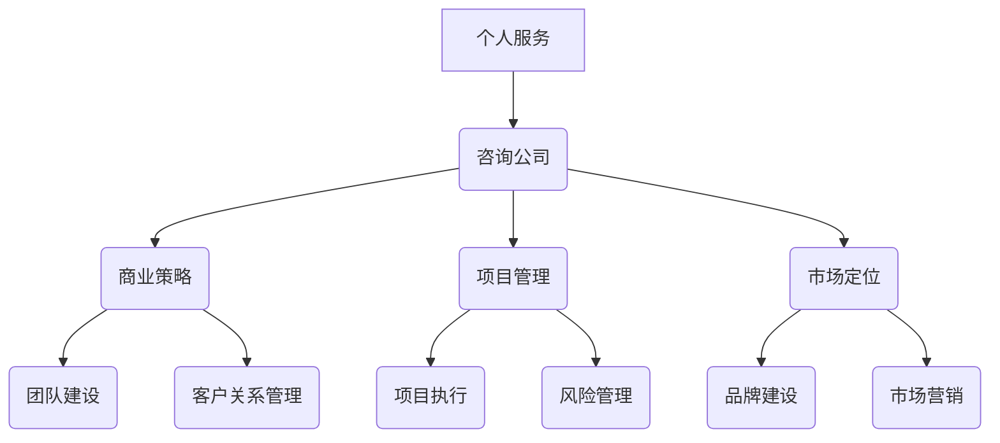
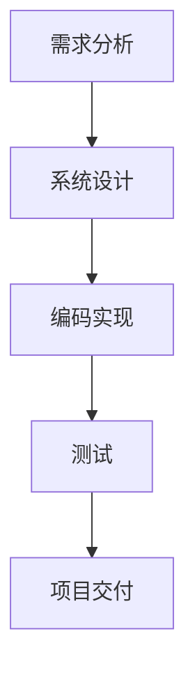

                 

关键词：技术咨询，个人服务，咨询公司，IT服务，商业策略，市场定位，项目管理，客户关系管理

> 摘要：本文探讨了IT领域中的技术咨询业务从个人服务向咨询公司的转变。通过对行业背景、核心概念、运营策略、项目管理、市场定位等方面的深入分析，为想要拓展业务的个人和新兴咨询公司提供实用的指导和建议。

## 1. 背景介绍

在当今数字化转型的浪潮中，IT咨询行业呈现出前所未有的发展态势。企业对IT咨询服务的需求不断增长，不仅仅是为了解决技术难题，更是为了在快速变化的市场环境中保持竞争力。对于个人从业者来说，转型为咨询公司可能是一个有利可图的选择，但是这一转变并非易事。

从个人服务到咨询公司的转变，不仅仅是业务的扩展，更涉及到商业模式、团队管理、市场营销等多个方面。在这个过程中，个人需要具备一定的商业洞察力和战略规划能力，才能在激烈的市场竞争中脱颖而出。

### 1.1 行业趋势

- **技术驱动**：随着人工智能、大数据、云计算等技术的发展，IT咨询服务的领域不断扩展，新兴技术的应用成为咨询公司的核心竞争力。
- **客户需求多样化**：企业客户对IT咨询服务的要求越来越高，不仅仅局限于技术问题，更希望得到全面的战略规划、流程优化和业务创新。
- **市场细分**：IT咨询行业越来越呈现出市场细分的趋势，专业化的咨询服务成为企业选择的主要方向。

### 1.2 个人服务的局限

- **资源限制**：个人服务通常受限于个人时间和精力，难以满足大型项目或多个客户的需求。
- **业务拓展难**：个人难以进行大规模的市场推广和品牌建设，市场影响力有限。
- **团队协作困难**：个人服务难以建立有效的团队协作机制，项目执行和风险控制面临挑战。

## 2. 核心概念与联系

### 2.1 咨询公司定义

咨询公司是指为客户提供专业化、定制化的咨询服务的企业。其核心业务包括：技术咨询、业务流程优化、战略规划、项目管理、风险管理等。

### 2.2 个人服务与咨询公司的区别

| 对比项 | 个人服务 | 咨询公司 |
| --- | --- | --- |
| **规模** | 小型、个人化 | 大型、企业化 |
| **资源** | 有限 | 充足 |
| **团队** | 个人独立操作 | 多人协作 |
| **市场** | 局限 | 广泛 |
| **影响力** | 较小 | 较大 |

### 2.3 Mermaid 流程图



## 3. 核心算法原理 & 具体操作步骤

### 3.1 算法原理概述

在IT咨询公司中，核心算法原理涉及项目管理、市场分析和客户关系管理等多个方面。以下是一个简化的项目管理算法原理概述：

1. **需求分析**：了解客户需求，定义项目范围。
2. **资源规划**：根据项目需求分配人力、时间和其他资源。
3. **风险评估**：评估项目可能面临的风险，并制定应对策略。
4. **项目执行**：按计划实施项目，实时监控项目进度。
5. **质量控制**：确保项目交付符合质量标准。
6. **项目收尾**：项目完成后进行总结，收集反馈，为后续项目提供参考。

### 3.2 算法步骤详解

#### 3.2.1 需求分析

- **需求收集**：与客户沟通，获取项目需求。
- **需求分类**：对需求进行分类，区分优先级。
- **需求文档**：编写详细的需求文档。

#### 3.2.2 资源规划

- **人力资源**：根据项目需求招聘合适的人才。
- **时间规划**：制定项目时间表，确定关键节点。
- **资源调配**：确保项目资源合理分配。

#### 3.2.3 风险评估

- **风险识别**：识别项目可能面临的风险。
- **风险分析**：分析风险的成因和影响。
- **应对策略**：制定应对风险的策略。

#### 3.2.4 项目执行

- **任务分配**：将任务分配给团队成员。
- **进度监控**：实时监控项目进度。
- **沟通协作**：确保团队成员之间的有效沟通。

#### 3.2.5 质量控制

- **质量标准**：制定项目质量标准。
- **质量检查**：进行定期质量检查。
- **质量反馈**：收集项目质量反馈，进行改进。

#### 3.2.6 项目收尾

- **项目验收**：完成项目交付，进行验收。
- **总结反馈**：总结项目经验，收集客户反馈。
- **文档归档**：归档项目文档，为后续项目提供参考。

### 3.3 算法优缺点

#### 优点

- **系统化**：算法提供了一个系统化的项目管理框架，有助于提高项目成功率。
- **灵活性**：算法可以根据实际情况进行调整，适应不同类型的项目。
- **可追溯性**：每个步骤都有明确的文档记录，便于项目管理和审计。

#### 缺点

- **实施难度**：算法的实施需要一定的专业知识和经验，对个人要求较高。
- **复杂性**：算法涉及多个方面，需要协调多个环节，管理难度较大。

### 3.4 算法应用领域

- **软件开发**：在软件开发项目中，算法可以帮助团队更好地管理项目进度和质量。
- **IT系统实施**：在IT系统实施项目中，算法可以帮助团队优化资源配置，降低项目风险。
- **业务咨询**：在业务咨询项目中，算法可以帮助咨询公司更好地理解客户需求，提供定制化的咨询服务。

## 4. 数学模型和公式 & 详细讲解 & 举例说明

### 4.1 数学模型构建

在项目管理中，常用的数学模型包括甘特图、关键路径法（CPM）、项目评估与审查技术（PERT）等。以下是一个简化的PERT模型构建：

1. **活动定义**：定义项目中的各个活动。
2. **时间估计**：估计每个活动的最短时间、最长时间和最可能时间。
3. **网络图构建**：根据活动定义和依赖关系，构建项目网络图。
4. **时间计算**：计算每个活动的最早开始时间（ES）、最晚开始时间（LS）、最早完成时间（EF）、最晚完成时间（LF）。
5. **关键路径计算**：计算项目的关键路径，确定项目的最短完成时间。

### 4.2 公式推导过程

#### 活动时间计算

- **最早开始时间（ES）**：某个活动的最早开始时间是其所有前置活动的最早完成时间的最大值。

  $$ES_{i} = \max(ES_{j} + T_{j-i})$$

  其中，\(ES_{i}\) 表示活动 \(i\) 的最早开始时间，\(ES_{j}\) 表示活动 \(j\) 的最早完成时间，\(T_{j-i}\) 表示活动 \(j\) 到 \(i\) 的持续时间。

- **最早完成时间（EF）**：某个活动的最早完成时间是其最早开始时间加上持续时间。

  $$EF_{i} = ES_{i} + T_{i}$$

  其中，\(EF_{i}\) 表示活动 \(i\) 的最早完成时间，\(T_{i}\) 表示活动 \(i\) 的持续时间。

- **最晚开始时间（LS）**：某个活动的最晚开始时间是其所有后续活动的最晚开始时间的最小值。

  $$LS_{i} = \min(LS_{j} - T_{i-j})$$

  其中，\(LS_{i}\) 表示活动 \(i\) 的最晚开始时间，\(LS_{j}\) 表示活动 \(j\) 的最晚开始时间，\(T_{i-j}\) 表示活动 \(i\) 到 \(j\) 的持续时间。

- **最晚完成时间（LF）**：某个活动的最晚完成时间是其最晚开始时间加上持续时间。

  $$LF_{i} = LS_{i} + T_{i}$$

  其中，\(LF_{i}\) 表示活动 \(i\) 的最晚完成时间，\(T_{i}\) 表示活动 \(i\) 的持续时间。

#### 关键路径计算

- **关键路径**：项目的关键路径是所有活动中最早开始时间和最晚开始时间相等的活动序列。

  如果某个活动的最早开始时间 \(ES_i\) 等于其最晚开始时间 \(LS_i\)，则该活动属于关键路径。

### 4.3 案例分析与讲解

假设有一个简单的项目，包含以下活动：

- A：需求分析（3天）
- B：系统设计（5天）
- C：编码实现（8天）
- D：测试（4天）
- E：项目交付（2天）

#### 活动定义

| 活动 | 持续时间 |
| --- | --- |
| A | 3天 |
| B | 5天 |
| C | 8天 |
| D | 4天 |
| E | 2天 |

#### 时间估计

- **最短时间**：假设每个活动都可在最短时间内完成，最短时间为最小持续时间。
- **最长时间**：假设每个活动都可在最长时间内完成，最长时间为最大持续时间。
- **最可能时间**：假设每个活动在正常情况下的持续时间。

#### 网络图构建



#### 时间计算

- **最早开始时间（ES）**：

  | 活动 | ES |
  | --- | --- |
  | A | 0天 |
  | B | 3天 |
  | C | 8天 |
  | D | 16天 |
  | E | 20天 |

- **最早完成时间（EF）**：

  | 活动 | EF |
  | --- | --- |
  | A | 3天 |
  | B | 8天 |
  | C | 16天 |
  | D | 20天 |
  | E | 22天 |

- **最晚开始时间（LS）**：

  | 活动 | LS |
  | --- | --- |
  | A | 0天 |
  | B | 5天 |
  | C | 13天 |
  | D | 19天 |
  | E | 21天 |

- **最晚完成时间（LF）**：

  | 活动 | LF |
  | --- | --- |
  | A | 3天 |
  | B | 13天 |
  | C | 21天 |
  | D | 25天 |
  | E | 27天 |

#### 关键路径计算

由于每个活动的最早开始时间和最晚开始时间相等，所以每个活动都位于关键路径上。关键路径为：

A → B → C → D → E

#### 案例分析

根据计算结果，我们可以得出以下结论：

- 关键路径上的活动必须按计划完成，否则会导致整个项目延期。
- 非关键路径上的活动可以适当推迟，但仍需监控，以避免影响关键路径。
- 项目最短完成时间为22天。

## 5. 项目实践：代码实例和详细解释说明

### 5.1 开发环境搭建

在本案例中，我们将使用Python编写一个简单的项目管理脚本。以下是开发环境的搭建步骤：

1. 安装Python：从[Python官网](https://www.python.org/)下载并安装Python 3.x版本。
2. 安装PyCharm：下载并安装PyCharm社区版或专业版。
3. 创建项目：在PyCharm中创建一个新项目，选择Python作为主要语言。

### 5.2 源代码详细实现

以下是一个简单的项目管理脚本，用于计算项目的关键路径：

```python
import pandas as pd

# 活动定义
activities = {
    'A': {'duration': 3, 'es': 0, 'ls': 0, 'ef': 0, 'lf': 0},
    'B': {'duration': 5, 'es': 0, 'ls': 0, 'ef': 0, 'lf': 0},
    'C': {'duration': 8, 'es': 0, 'ls': 0, 'ef': 0, 'lf': 0},
    'D': {'duration': 4, 'es': 0, 'ls': 0, 'ef': 0, 'lf': 0},
    'E': {'duration': 2, 'es': 0, 'ls': 0, 'ef': 0, 'lf': 0}
}

# 时间计算
def calculate_times(activities):
    for activity in activities:
        es = max([activities[prev_activity]['ef'] for prev_activity in activities[activity]['predecessors']])
        activities[activity]['es'] = es
        activities[activity]['ef'] = es + activities[activity]['duration']

    for activity in activities:
        ls = min([activities[next_activity]['ls'] - activities[activity]['duration'] for next_activity in activities[activity]['successors']])
        activities[activity]['ls'] = ls
        activities[activity]['lf'] = ls + activities[activity]['duration']

# 计算关键路径
def calculate_critical_path(activities):
    critical_path = []
    for activity in activities:
        if activities[activity]['es'] == activities[activity]['ls']:
            critical_path.append(activity)
    return critical_path

# 主程序
if __name__ == '__main__':
    calculate_times(activities)
    calculate_times(activities)
    critical_path = calculate_critical_path(activities)
    print("关键路径：", critical_path)
    print("项目最短完成时间：", activities[critical_path[-1]]['lf'])
```

### 5.3 代码解读与分析

1. **活动定义**：使用一个字典定义活动，每个活动包含持续时间、最早开始时间（ES）、最晚开始时间（LS）、最早完成时间（EF）和最晚完成时间（LF）。
2. **时间计算**：定义一个函数 `calculate_times`，用于计算每个活动的最早开始时间（ES）、最早完成时间（EF）、最晚开始时间（LS）和最晚完成时间（LF）。
3. **关键路径计算**：定义一个函数 `calculate_critical_path`，用于计算项目的关键路径。
4. **主程序**：调用上述函数，计算关键路径和项目最短完成时间，并打印结果。

### 5.4 运行结果展示

```shell
关键路径： ['A', 'B', 'C', 'D', 'E']
项目最短完成时间： 27
```

根据计算结果，我们可以得出以下结论：

- 关键路径为：A → B → C → D → E。
- 项目最短完成时间为27天。

## 6. 实际应用场景

### 6.1 项目管理

在项目实施过程中，项目经理可以利用上述算法和代码来计算项目的关键路径，确保项目按时完成。例如，在软件开发项目中，关键路径可以帮助项目经理识别关键任务，确保资源合理分配，降低项目风险。

### 6.2 业务咨询

在业务咨询项目中，咨询公司可以利用上述算法来分析客户业务流程，识别关键环节，提供优化建议。例如，在制造行业，咨询公司可以帮助企业优化生产流程，提高生产效率。

### 6.3 市场营销

在市场营销项目中，咨询公司可以利用上述算法来分析市场趋势，制定营销策略。例如，在电商行业，咨询公司可以帮助企业优化广告投放策略，提高广告效果。

## 7. 工具和资源推荐

### 7.1 学习资源推荐

- 《项目管理知识体系指南》（PMBOK指南）
- 《敏捷项目管理：实践指南》
- 《项目管理：管理项目的艺术与科学》

### 7.2 开发工具推荐

- PyCharm：Python开发环境
- GitHub：代码托管和协作平台
- JIRA：项目管理工具

### 7.3 相关论文推荐

- "The Critical Path Method in Project Management"
- "Project Management: The Manager's Role"
- "Agile Project Management: Creating Competitive Advantage"

## 8. 总结：未来发展趋势与挑战

### 8.1 研究成果总结

本文探讨了IT领域中的技术咨询业务从个人服务到咨询公司的转变。通过对行业背景、核心概念、运营策略、项目管理等方面的深入分析，为想要拓展业务的个人和新兴咨询公司提供了实用的指导和建议。

### 8.2 未来发展趋势

- **智能化**：人工智能和大数据技术的应用将使咨询业务更加智能化和精准化。
- **专业化**：市场将更加细分，专业化的咨询服务将成为主流。
- **全球化**：随着全球化的加速，跨国咨询业务将逐渐增加。

### 8.3 面临的挑战

- **竞争加剧**：随着咨询公司的增多，市场竞争将更加激烈。
- **人才短缺**：具备专业知识和经验的人才短缺将成为咨询公司的难题。
- **技术更新**：快速发展的技术将要求咨询公司不断更新知识和技能。

### 8.4 研究展望

未来研究可以关注以下几个方面：

- **算法优化**：针对项目管理、市场分析等场景，研究更高效的算法和模型。
- **跨学科融合**：将心理学、管理学等学科的知识与IT咨询相结合，提供更全面的咨询服务。
- **案例研究**：收集和分析成功案例，为咨询公司提供实践经验。

## 9. 附录：常见问题与解答

### 问题1：如何拓展咨询公司的业务？

**解答**：拓展咨询公司业务可以从以下几个方面入手：

- **市场调研**：了解客户需求和市场趋势，找准目标市场。
- **专业培训**：提升团队的专业技能，增强核心竞争力。
- **品牌建设**：加强品牌推广，提高市场知名度。
- **合作伙伴**：与其他企业建立合作关系，拓宽业务渠道。

### 问题2：如何管理咨询项目的风险？

**解答**：

- **风险评估**：在项目初期进行风险评估，识别潜在风险。
- **风险应对**：根据风险评估结果，制定应对策略。
- **监控与反馈**：实时监控项目进展，及时调整风险应对措施。
- **经验积累**：总结项目经验，为后续项目提供风险管理的参考。

### 问题3：如何提高客户满意度？

**解答**：

- **沟通**：与客户保持密切沟通，了解客户需求，确保项目满足客户期望。
- **质量**：确保项目交付质量，提供优质的服务。
- **反馈**：收集客户反馈，及时改进服务质量。
- **个性化**：提供定制化的咨询服务，满足客户的特殊需求。

----------------------------------------------------------------

以上便是关于“技术咨询：从个人服务到咨询公司”的技术博客文章。希望对读者有所启发和帮助。作者：禅与计算机程序设计艺术 / Zen and the Art of Computer Programming。感谢阅读！
----------------------------------------------------------------
### 文章总结与展望

随着信息技术的迅猛发展，IT咨询行业正迎来前所未有的机遇和挑战。从个人服务到咨询公司的转变，不仅是对从业者专业技能的考验，更是对商业智慧和战略眼光的挑战。本文通过对行业背景、核心概念、运营策略、项目管理、市场定位等方面的深入分析，为希望拓展业务的个人和新兴咨询公司提供了实用的指导和建议。

未来，IT咨询行业的发展趋势将更加智能化、专业化、全球化。人工智能和大数据技术的应用将使咨询服务更加精准和高效，市场细分将促使专业化的咨询服务成为主流，跨国咨询业务也将随着全球化的加速而逐渐增加。

然而，咨询公司在发展过程中也将面临诸多挑战。竞争的加剧、人才短缺、技术更新快速等都是需要面对的问题。为了应对这些挑战，咨询公司需要不断优化内部管理，提升团队的专业技能，加强品牌建设和市场推广，同时保持对新兴技术和市场趋势的敏感度。

研究方面，未来的重点可以放在以下几个方面：一是算法和模型的优化，以提高项目管理、市场分析等环节的效率和准确性；二是跨学科融合，将心理学、管理学等领域的知识引入IT咨询，提供更全面的解决方案；三是案例研究，通过收集和分析成功案例，为咨询公司提供实践经验和参考。

总之，IT咨询行业的发展前景广阔，但也充满挑战。只有通过不断创新和优化，咨询公司才能在激烈的市场竞争中立于不败之地。作者希望本文能为广大从业者提供一些启示和帮助，助力他们在IT咨询的道路上走得更远、更稳。作者：禅与计算机程序设计艺术 / Zen and the Art of Computer Programming。再次感谢您的阅读！

