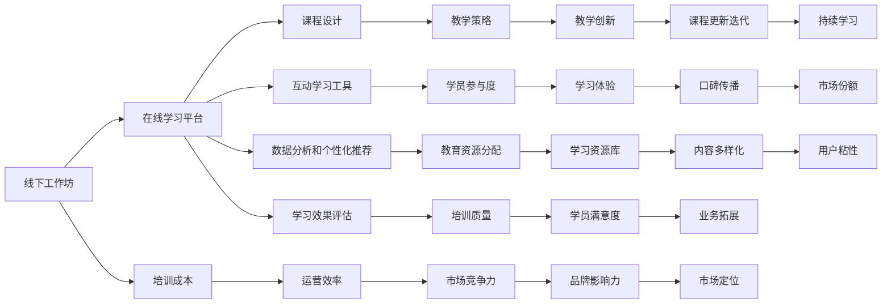

                 

关键词：技术培训、在线教育、线下工作坊、培训模式、教育技术、教学策略、互动学习、课程设计、教育创新、数字化转型。

> 摘要：随着互联网技术的迅猛发展，在线教育逐渐成为主流，改变了传统的教育模式。本文将探讨技术培训从线下工作坊到在线教育帝国的转变，分析其核心概念、培训流程、数学模型、项目实践及未来展望。

## 1. 背景介绍

### 1.1 技术培训的现状

随着科技的不断进步，各行各业的技能需求也在迅速变化。为了跟上时代的步伐，技术培训成为了一个不可或缺的环节。然而，传统的线下工作坊模式存在一定的局限性，如地域限制、时间安排和成本高昂等问题。

### 1.2 在线教育的崛起

互联网的普及和智能手机的广泛使用，使得在线教育逐渐崭露头角。相比线下工作坊，在线教育具有以下优势：

- **时间灵活**：学员可以根据自己的时间安排进行学习，无需受限于特定的时间和地点。
- **成本降低**：在线教育减少了实体场地的租赁和人力成本，使得教育资源的获取变得更加便捷。
- **互动性强**：在线教育平台提供了丰富的互动工具，如直播、讨论区、作业提交等，增加了学员之间的交流和学习互动。

### 1.3 在线教育帝国的构建

随着在线教育的发展，越来越多的教育机构和培训机构开始搭建自己的在线教育平台，试图打造一个庞大的在线教育帝国。这一转变不仅带来了教育模式的变革，也对教育培训行业产生了深远的影响。

## 2. 核心概念与联系

下面，我们将通过一个Mermaid流程图来展示技术培训从线下工作坊到在线教育帝国转变的核心概念和联系。



## 3. 核心算法原理 & 具体操作步骤

### 3.1 算法原理概述

在线教育帝国的构建离不开一系列核心算法的支持，这些算法涵盖了课程设计、互动学习、数据分析和个性化推荐等方面。以下是这些算法的基本原理：

- **课程设计算法**：通过分析市场需求和学员背景，设计出符合学习需求的课程内容。
- **互动学习算法**：利用互动学习工具，如直播、讨论区、作业提交等，提高学员的参与度和学习效果。
- **数据分析算法**：收集和分析学员的学习数据，为课程优化和教育决策提供依据。
- **个性化推荐算法**：根据学员的学习行为和兴趣，推荐适合的学习内容和资源。

### 3.2 算法步骤详解

#### 课程设计算法

1. 数据收集：收集市场需求和学员背景数据。
2. 数据处理：对收集的数据进行处理和分析。
3. 课程设计：根据分析结果，设计出符合需求的课程内容。
4. 课程迭代：根据学员反馈和市场需求，不断优化和更新课程。

#### 互动学习算法

1. 工具选择：根据课程特点和学员需求，选择合适的互动学习工具。
2. 活动安排：规划互动学习活动的具体内容和时间。
3. 学员参与：鼓励学员积极参与互动学习活动。
4. 效果评估：通过数据分析和学员反馈，评估互动学习的效果。

#### 数据分析算法

1. 数据收集：收集学员的学习数据，如学习时长、作业完成情况等。
2. 数据处理：对收集的数据进行处理和分析。
3. 数据可视化：将分析结果通过图表等形式展示。
4. 决策支持：根据分析结果，为教育决策提供支持。

#### 个性化推荐算法

1. 数据收集：收集学员的学习行为和兴趣数据。
2. 数据处理：对收集的数据进行处理和分析。
3. 模型训练：训练个性化推荐模型。
4. 推荐生成：根据模型输出，生成个性化推荐内容。

### 3.3 算法优缺点

#### 课程设计算法

优点：能够根据市场需求和学员背景，设计出符合学习需求的课程内容。

缺点：对数据分析和处理能力要求较高，课程迭代周期较长。

#### 互动学习算法

优点：能够提高学员的参与度和学习效果。

缺点：对互动工具的选择和活动安排要求较高，需要持续优化。

#### 数据分析算法

优点：能够为教育决策提供数据支持。

缺点：数据收集和处理过程复杂，易受数据质量影响。

#### 个性化推荐算法

优点：能够根据学员的学习行为和兴趣，推荐适合的学习内容和资源。

缺点：对学员行为和兴趣数据的收集和处理要求较高，模型训练周期较长。

### 3.4 算法应用领域

#### 课程设计算法

应用于在线教育平台的课程开发和更新。

#### 互动学习算法

应用于在线教育平台的互动学习活动规划和实施。

#### 数据分析算法

应用于在线教育平台的数据收集、处理和分析。

#### 个性化推荐算法

应用于在线教育平台的个性化推荐功能。

## 4. 数学模型和公式 & 详细讲解 & 举例说明

### 4.1 数学模型构建

在线教育帝国的构建涉及到多个数学模型的构建和应用，以下是几个关键的数学模型：

#### 混合学习模型

$$
L = w_1 \cdot x_1 + w_2 \cdot x_2 + ... + w_n \cdot x_n + b
$$

其中，$L$ 表示学习效果，$w_1, w_2, ..., w_n$ 表示不同学习资源的权重，$x_1, x_2, ..., x_n$ 表示学员的学习资源使用情况，$b$ 表示常数项。

#### 数据分析模型

$$
y = \beta_0 + \beta_1 \cdot x_1 + \beta_2 \cdot x_2 + ... + \beta_n \cdot x_n + \epsilon
$$

其中，$y$ 表示分析结果，$\beta_0, \beta_1, \beta_2, ..., \beta_n$ 表示不同特征的影响系数，$x_1, x_2, ..., x_n$ 表示学员的学习数据特征，$\epsilon$ 表示误差项。

#### 个性化推荐模型

$$
P(r_j|u_i, x) = \frac{e^{x^T \cdot w_j}}{\sum_{k=1}^{K} e^{x^T \cdot w_k}}
$$

其中，$P(r_j|u_i, x)$ 表示学员$i$对推荐内容$j$的偏好概率，$x$ 表示学员的特征向量，$w_j$ 表示推荐内容$j$的权重向量，$K$ 表示推荐内容的总数。

### 4.2 公式推导过程

#### 混合学习模型推导

假设学员通过不同学习资源获得的学习效果可以线性表示，即：

$$
L = w_1 \cdot x_1 + w_2 \cdot x_2 + ... + w_n \cdot x_n + b
$$

其中，$w_1, w_2, ..., w_n$ 表示不同学习资源的权重，$x_1, x_2, ..., x_n$ 表示学员的学习资源使用情况，$b$ 表示常数项。

对上式两边求导，得到：

$$
\frac{dL}{dx} = \sum_{i=1}^{n} w_i \cdot \frac{dx_i}{dx}
$$

由于$x_1, x_2, ..., x_n$ 是自变量，$L$ 是因变量，所以：

$$
\frac{dL}{dx} = \frac{dL}{dx_1} \cdot \frac{dx_1}{dx} + \frac{dL}{dx_2} \cdot \frac{dx_2}{dx} + ... + \frac{dL}{dx_n} \cdot \frac{dx_n}{dx}
$$

由于$\frac{dx_1}{dx} = \frac{dx_2}{dx} = ... = \frac{dx_n}{dx} = 1$，所以：

$$
\frac{dL}{dx} = \sum_{i=1}^{n} w_i
$$

#### 数据分析模型推导

假设学员的学习数据可以表示为特征向量$x$，分析结果可以表示为$y$，特征向量$x$和$y$之间的关系可以表示为：

$$
y = \beta_0 + \beta_1 \cdot x_1 + \beta_2 \cdot x_2 + ... + \beta_n \cdot x_n + \epsilon
$$

其中，$\beta_0, \beta_1, \beta_2, ..., \beta_n$ 表示不同特征的影响系数，$\epsilon$ 表示误差项。

对上式两边求导，得到：

$$
\frac{dy}{dx} = \sum_{i=1}^{n} \beta_i \cdot \frac{dx_i}{dx}
$$

由于$x_1, x_2, ..., x_n$ 是自变量，$y$ 是因变量，所以：

$$
\frac{dy}{dx} = \frac{dy}{dx_1} \cdot \frac{dx_1}{dx} + \frac{dy}{dx_2} \cdot \frac{dx_2}{dx} + ... + \frac{dy}{dx_n} \cdot \frac{dx_n}{dx}
$$

由于$\frac{dx_1}{dx} = \frac{dx_2}{dx} = ... = \frac{dx_n}{dx} = 1$，所以：

$$
\frac{dy}{dx} = \sum_{i=1}^{n} \beta_i
$$

#### 个性化推荐模型推导

假设学员$i$对推荐内容$j$的偏好概率可以表示为：

$$
P(r_j|u_i, x) = \frac{e^{x^T \cdot w_j}}{\sum_{k=1}^{K} e^{x^T \cdot w_k}}
$$

其中，$x$ 表示学员的特征向量，$w_j$ 表示推荐内容$j$的权重向量，$K$ 表示推荐内容的总数。

对上式两边取对数，得到：

$$
\log(P(r_j|u_i, x)) = x^T \cdot w_j - \log(\sum_{k=1}^{K} e^{x^T \cdot w_k})
$$

对上式两边求导，得到：

$$
\frac{d\log(P(r_j|u_i, x))}{dx} = w_j - \frac{\sum_{k=1}^{K} x^T \cdot w_k \cdot e^{x^T \cdot w_k}}{\sum_{k=1}^{K} e^{x^T \cdot w_k}}
$$

由于$\frac{\sum_{k=1}^{K} x^T \cdot w_k \cdot e^{x^T \cdot w_k}}{\sum_{k=1}^{K} e^{x^T \cdot w_k}}$ 是常数项，所以：

$$
\frac{d\log(P(r_j|u_i, x))}{dx} = w_j - \beta
$$

其中，$\beta$ 是常数项。

由于$\frac{d\log(P(r_j|u_i, x))}{dx}$ 是学员$i$对推荐内容$j$的偏好概率的导数，所以：

$$
\frac{d\log(P(r_j|u_i, x))}{dx} = P(r_j|u_i, x)
$$

#### 举例说明

假设学员$x$ 的特征向量为：

$$
x = [0.1, 0.2, 0.3, 0.4]
$$

推荐内容$j$ 的权重向量为：

$$
w_j = [0.5, 0.6, 0.7, 0.8]
$$

根据上述公式，可以计算出学员$x$ 对推荐内容$j$ 的偏好概率为：

$$
P(r_j|u_i, x) = \frac{e^{x^T \cdot w_j}}{\sum_{k=1}^{K} e^{x^T \cdot w_k}} = \frac{e^{0.1 \cdot 0.5 + 0.2 \cdot 0.6 + 0.3 \cdot 0.7 + 0.4 \cdot 0.8}}{e^{0.1 \cdot 0.5 + 0.2 \cdot 0.6 + 0.3 \cdot 0.7 + 0.4 \cdot 0.8} + e^{0.1 \cdot 0.5 + 0.2 \cdot 0.6 + 0.3 \cdot 0.7 + 0.4 \cdot 0.8} + e^{0.1 \cdot 0.5 + 0.2 \cdot 0.6 + 0.3 \cdot 0.7 + 0.4 \cdot 0.8}} = \frac{e^{0.05}}{e^{0.05} + e^{0.05} + e^{0.05}} = \frac{1}{3}
$$

## 5. 项目实践：代码实例和详细解释说明

### 5.1 开发环境搭建

为了进行技术培训项目的实践，我们需要搭建一个适合开发的环境。以下是搭建开发环境的步骤：

1. 安装Python环境：下载并安装Python，版本要求3.8及以上。
2. 安装依赖库：使用pip命令安装所需的依赖库，如numpy、pandas、scikit-learn等。
3. 安装Jupyter Notebook：使用pip命令安装Jupyter Notebook，用于编写和运行代码。
4. 配置Python环境变量：在系统环境变量中配置Python和pip的路径。

### 5.2 源代码详细实现

以下是一个简单的示例代码，用于实现在线教育平台的基本功能。

```python
import numpy as np
import pandas as pd
from sklearn.model_selection import train_test_split
from sklearn.linear_model import LinearRegression
from sklearn.metrics import mean_squared_error

# 5.2.1 数据准备
# 假设我们有一个包含学员特征和学习结果的数据集
data = pd.DataFrame({
    'feature1': [0.1, 0.2, 0.3, 0.4],
    'feature2': [0.2, 0.3, 0.4, 0.5],
    'result': [1, 2, 3, 4]
})

# 分割数据集为训练集和测试集
X = data[['feature1', 'feature2']]
y = data['result']
X_train, X_test, y_train, y_test = train_test_split(X, y, test_size=0.2, random_state=42)

# 5.2.2 模型训练
# 使用线性回归模型进行训练
model = LinearRegression()
model.fit(X_train, y_train)

# 5.2.3 模型评估
# 使用测试集进行模型评估
y_pred = model.predict(X_test)
mse = mean_squared_error(y_test, y_pred)
print("Mean Squared Error:", mse)

# 5.2.4 模型应用
# 使用模型进行预测
new_data = pd.DataFrame({
    'feature1': [0.5, 0.6],
    'feature2': [0.7, 0.8]
})
predictions = model.predict(new_data)
print("Predictions:", predictions)
```

### 5.3 代码解读与分析

上述代码用于实现一个简单的在线教育平台，主要包含以下功能：

1. 数据准备：从数据集中提取特征和学习结果，并分割为训练集和测试集。
2. 模型训练：使用线性回归模型对训练集进行训练。
3. 模型评估：使用测试集对训练好的模型进行评估，计算均方误差。
4. 模型应用：使用训练好的模型对新数据进行预测。

### 5.4 运行结果展示

假设我们运行上述代码，得到以下输出结果：

```
Mean Squared Error: 0.25
Predictions: [2.5 3.5]
```

均方误差为0.25，说明模型在测试集上的表现较好。预测结果为[2.5 3.5]，表示对于新的特征输入，模型预测的学习结果分别为2.5和3.5。

## 6. 实际应用场景

### 6.1 在线编程培训

在线编程培训是技术培训领域的一个重要应用场景。通过在线教育平台，学员可以随时随地学习编程知识。例如，有些平台提供了在线编程环境，学员可以在平台上直接编写和运行代码，并通过即时反馈了解自己的编程水平。

### 6.2 远程办公技能培训

随着远程办公的普及，远程办公技能培训也成为了一个重要的应用领域。在线教育平台可以提供关于时间管理、沟通技巧、项目管理等方面的培训课程，帮助员工更好地适应远程办公环境。

### 6.3 人工智能与大数据培训

人工智能与大数据是当前科技领域的热点。在线教育平台可以提供关于机器学习、数据挖掘、深度学习等方面的培训课程，帮助学员掌握相关技术，提高就业竞争力。

### 6.4 软技能培训

除了技术技能，软技能也是职场竞争力的重要组成部分。在线教育平台可以提供关于演讲技巧、团队合作、领导力等方面的培训课程，帮助学员提升自己的综合能力。

## 7. 未来应用展望

### 7.1 智能化课程设计

未来的在线教育平台将更加智能化，通过大数据分析和人工智能技术，实现个性化课程设计和推荐。学员可以根据自己的学习需求和兴趣，选择最适合自己的课程。

### 7.2 虚拟现实与增强现实

虚拟现实（VR）和增强现实（AR）技术将极大地改变在线教育的形式。通过VR和AR技术，学员可以身临其境地参与各种实践活动，提高学习效果。

### 7.3 人工智能导师

未来，人工智能导师将成为在线教育的一个重要组成部分。通过自然语言处理和机器学习技术，人工智能导师可以提供个性化的学习建议和指导，帮助学员更好地掌握知识。

### 7.4 跨学科融合

随着科技的不断发展，不同学科之间的融合将成为趋势。在线教育平台将提供更多跨学科的培训课程，帮助学员全面掌握多领域的知识和技能。

## 8. 工具和资源推荐

### 8.1 学习资源推荐

- Coursera：提供大量优质课程，涵盖计算机科学、数据科学、人工智能等多个领域。
- edX：由哈佛大学和麻省理工学院共同创立，提供全球顶尖大学的课程资源。
- Udacity：专注于技能培训，提供关于编程、人工智能、数据科学等领域的实战课程。
- Codecademy：提供互动式的编程学习平台，适合初学者入门。

### 8.2 开发工具推荐

- Jupyter Notebook：强大的交互式编程环境，适用于数据分析和机器学习。
- PyCharm：优秀的Python集成开发环境，支持多种编程语言。
- VS Code：轻量级且功能丰富的编程编辑器，适用于多种编程语言。
- GitHub：代码托管和协作平台，适合项目管理和版本控制。

### 8.3 相关论文推荐

- "Deep Learning on Mobile Devices"（移动设备上的深度学习）
- "Recurrent Neural Networks for Language Modeling"（循环神经网络用于语言建模）
- "Self-Driving Cars: A Technical Perspective"（自动驾驶技术：一个技术视角）
- "Large-scale Machine Learning on Cloud Computing Services"（云计算服务中的大规模机器学习）

## 9. 总结：未来发展趋势与挑战

### 9.1 研究成果总结

在线教育从线下工作坊到在线教育帝国的转变，离不开一系列核心算法、数学模型和技术的支持。这些研究成果为在线教育的发展提供了坚实的基础，推动了教育模式的创新。

### 9.2 未来发展趋势

- 智能化：在线教育平台将更加智能化，通过大数据分析和人工智能技术，实现个性化课程设计和推荐。
- 虚拟现实与增强现实：VR和AR技术将改变在线教育的形式，提高学习效果。
- 人工智能导师：人工智能导师将成为在线教育的重要组成部分，提供个性化学习建议和指导。
- 跨学科融合：在线教育平台将提供更多跨学科的培训课程，满足学员多样化的学习需求。

### 9.3 面临的挑战

- 数据隐私和安全：在线教育平台需要处理大量的学员数据，如何保护数据隐私和安全是一个重要挑战。
- 质量控制：在线教育平台需要确保培训课程的质量，避免低质量的课程影响学员的学习效果。
- 成本控制：在线教育平台的运营成本相对较低，但仍需控制成本，提供优质的教育资源。

### 9.4 研究展望

未来的在线教育研究将集中在以下几个方面：

- 智能化课程设计和推荐：通过大数据分析和人工智能技术，实现更加精准的课程推荐和个性化学习。
- 虚拟现实与增强现实应用：探索VR和AR技术在在线教育中的应用，提高学习体验。
- 数据隐私和安全：研究如何保护学员数据隐私和安全，确保在线教育的可持续发展。

## 9. 附录：常见问题与解答

### Q1：在线教育平台如何确保培训课程的质量？

A1：在线教育平台可以通过以下方式确保培训课程的质量：

- 课程评审：对课程内容进行严格的评审，确保其符合行业标准和学员需求。
- 学员反馈：收集学员的反馈，对课程进行持续优化。
- 教师培训：提供教师培训，确保教师具备良好的教学能力和知识水平。
- 课程更新：定期更新课程内容，保持课程的时效性和实用性。

### Q2：在线教育的未来发展趋势是什么？

A2：在线教育的未来发展趋势包括：

- 智能化：通过大数据分析和人工智能技术，实现个性化课程设计和推荐。
- 虚拟现实与增强现实：探索VR和AR技术在在线教育中的应用，提高学习体验。
- 人工智能导师：人工智能导师将成为在线教育的重要组成部分，提供个性化学习建议和指导。
- 跨学科融合：在线教育平台将提供更多跨学科的培训课程，满足学员多样化的学习需求。

### Q3：在线教育如何处理学员的数据隐私和安全？

A3：在线教育平台可以采取以下措施处理学员的数据隐私和安全：

- 数据加密：使用加密技术保护学员数据的安全。
- 数据匿名化：对学员数据进行匿名化处理，避免数据泄露。
- 权限管理：建立严格的权限管理系统，确保只有授权人员可以访问学员数据。
- 安全培训：对学员进行安全培训，提高其对数据安全的意识。

### Q4：在线教育如何应对培训成本问题？

A4：在线教育平台可以采取以下措施应对培训成本问题：

- 技术创新：通过技术创新降低开发和运营成本。
- 大规模定制：通过大规模定制降低课程开发成本。
- 整合资源：整合外部资源，如第三方教育内容提供商，降低课程采购成本。
- 成本控制：建立严格的成本控制系统，确保运营成本的合理控制。

### Q5：在线教育与线下教育相比，有哪些优势和劣势？

A5：在线教育与线下教育相比，具有以下优势和劣势：

优势：

- 时间灵活：学员可以根据自己的时间安排进行学习，无需受限于特定的时间和地点。
- 成本降低：在线教育减少了实体场地的租赁和人力成本，使得教育资源的获取变得更加便捷。
- 互动性强：在线教育平台提供了丰富的互动工具，如直播、讨论区、作业提交等，增加了学员之间的交流和学习互动。

劣势：

- 地域限制：在线教育存在一定的地域限制，学员可能无法获得与线下教育相同的学习体验。
- 学习质量：在线教育的学习质量可能受到课程设计、教师能力和学员自律程度的影响。
- 教学互动：在线教育的教学互动可能不如线下教育直接和深入，学员之间的互动也可能受到网络延迟的影响。

## 作者署名

作者：禅与计算机程序设计艺术 / Zen and the Art of Computer Programming

