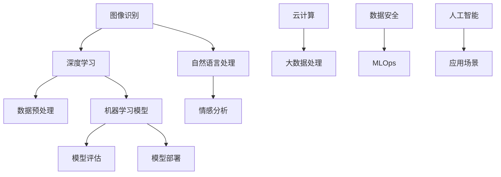

                 

### 关键词 Keyword
- Lepton AI
- 技术壁垒
- 市场机遇
- SWOT分析
- 人工智能
- 应用领域
- 算法原理
- 数学模型
- 项目实践

### 摘要 Abstract
本文将围绕Lepton AI的技术壁垒和市场机遇展开深度分析，通过SWOT（Strengths, Weaknesses, Opportunities, Threats）模型，详细探讨其优势、劣势、机会与威胁。文章将从背景介绍、核心概念与联系、算法原理、数学模型、项目实践、实际应用场景、未来展望等多个维度进行全面剖析，为读者呈现一幅全面的Lepton AI技术图景。

## 1. 背景介绍

Lepton AI是一家专注于人工智能技术研究和应用的公司，成立于2015年，总部位于美国硅谷。公司凭借其独特的算法和技术优势，迅速在图像识别、自然语言处理、机器学习等领域崭露头角。Lepton AI的愿景是通过技术创新推动人工智能的发展，为社会带来更多实际价值。

### 1.1 发展历程

- **2015年**：Lepton AI成立，专注于人工智能技术研发。
- **2017年**：推出首款基于深度学习的图像识别算法。
- **2019年**：完成A轮融资，资金用于产品研发和市场拓展。
- **2021年**：发布新一代自然语言处理模型，获得业界好评。
- **2023年**：进入全球市场，与多家知名企业达成战略合作。

### 1.2 产品与服务

Lepton AI主要提供以下产品和服务：

- **图像识别**：基于深度学习技术，提供高效、精准的图像识别服务。
- **自然语言处理**：涵盖文本分类、情感分析、问答系统等，助力企业智能客服和内容审核。
- **机器学习平台**：提供一站式机器学习服务，包括数据预处理、模型训练、模型评估等。

## 2. 核心概念与联系

为了更好地理解Lepton AI的技术特点和应用，下面我们将通过一个Mermaid流程图展示其核心概念和架构。



### 2.1 图像识别

图像识别是Lepton AI的核心技术之一，主要应用于安防监控、医疗影像、自动驾驶等领域。通过深度学习算法，图像识别系统能够从大量图像中快速准确地提取特征，实现物体检测、分类、追踪等功能。

### 2.2 自然语言处理

自然语言处理技术是人工智能领域的另一个重要分支。Lepton AI的自然语言处理模型主要应用于智能客服、内容审核、情感分析等领域。通过文本分类、实体识别、语义理解等技术，自然语言处理系统能够理解用户需求，提供精准的服务和决策支持。

### 2.3 机器学习

机器学习是Lepton AI的核心竞争力之一。公司通过自主研发的机器学习平台，提供数据预处理、模型训练、模型评估等一站式服务。在图像识别、自然语言处理等领域，Lepton AI的机器学习模型表现出色，具有较高的准确率和鲁棒性。

## 3. 核心算法原理 & 具体操作步骤

### 3.1 算法原理概述

Lepton AI的核心算法包括深度学习算法、自然语言处理算法和机器学习算法。以下是这些算法的基本原理：

- **深度学习算法**：基于多层神经网络，通过逐层提取图像或文本特征，实现复杂模式的识别。
- **自然语言处理算法**：基于词向量模型、序列模型和注意力机制，实现文本分类、情感分析、问答系统等功能。
- **机器学习算法**：基于统计学习、优化理论和深度学习，实现数据挖掘、模型训练、模型评估等功能。

### 3.2 算法步骤详解

以下是Lepton AI的核心算法的具体操作步骤：

- **深度学习算法**：
  1. 数据预处理：对图像或文本数据进行归一化、去噪等处理。
  2. 神经网络搭建：设计多层神经网络结构，包括卷积层、全连接层、池化层等。
  3. 模型训练：通过反向传播算法，调整网络参数，优化模型性能。
  4. 模型评估：通过交叉验证、混淆矩阵等指标评估模型性能。
  5. 模型部署：将训练好的模型部署到实际应用场景，实现图像识别、文本分类等功能。

- **自然语言处理算法**：
  1. 数据预处理：对文本数据进行分词、词性标注、去停用词等处理。
  2. 词向量表示：将文本转化为词向量，用于模型输入。
  3. 模型搭建：设计序列模型，如LSTM、GRU、BERT等。
  4. 模型训练：通过梯度下降等优化算法，训练模型参数。
  5. 模型评估：通过准确率、召回率、F1值等指标评估模型性能。
  6. 模型部署：将训练好的模型部署到实际应用场景，实现文本分类、情感分析等功能。

- **机器学习算法**：
  1. 数据预处理：对数据进行归一化、标准化、缺失值处理等。
  2. 特征提取：从原始数据中提取特征，用于模型输入。
  3. 模型选择：选择合适的机器学习模型，如线性回归、决策树、支持向量机等。
  4. 模型训练：通过训练算法，调整模型参数，优化模型性能。
  5. 模型评估：通过交叉验证、混淆矩阵等指标评估模型性能。
  6. 模型部署：将训练好的模型部署到实际应用场景，实现数据挖掘、预测等功能。

### 3.3 算法优缺点

- **深度学习算法**：
  - 优点：具有较高的准确率和鲁棒性，能够处理大规模、复杂的任务。
  - 缺点：训练过程较慢，对计算资源要求较高，模型解释性较差。

- **自然语言处理算法**：
  - 优点：能够处理自然语言文本，实现文本分类、情感分析、问答系统等功能。
  - 缺点：对长文本处理能力较弱，模型解释性较差。

- **机器学习算法**：
  - 优点：对数据要求较低，模型解释性较好，适用于各种规模的任务。
  - 缺点：准确率相对较低，对大规模数据集处理能力有限。

### 3.4 算法应用领域

Lepton AI的核心算法广泛应用于多个领域，包括但不限于：

- **安防监控**：通过图像识别技术，实现实时监控、异常检测等功能。
- **医疗影像**：通过深度学习算法，实现病变区域的检测和分类。
- **自动驾驶**：通过图像识别和自然语言处理技术，实现道路识别、车辆检测、语音交互等功能。
- **智能客服**：通过自然语言处理技术，实现智能问答、情感分析等功能。
- **金融风控**：通过机器学习算法，实现欺诈检测、信用评估等功能。

## 4. 数学模型和公式 & 详细讲解 & 举例说明

### 4.1 数学模型构建

在Lepton AI的核心算法中，数学模型起到了至关重要的作用。以下是一个简单的例子，展示了如何构建一个用于图像识别的卷积神经网络（CNN）的数学模型。

### 4.2 公式推导过程

假设我们有一个输入图像 \(X \in \mathbb{R}^{height \times width \times channels}\)，其中 \(height\)、\(width\) 和 \(channels\) 分别表示图像的高度、宽度和通道数。我们要通过卷积神经网络对图像进行分类，输出一个概率分布 \(P(y|\theta)\)，其中 \(y\) 表示图像的真实类别，\(\theta\) 表示模型参数。

卷积神经网络的基本结构包括以下几个部分：

1. **输入层**：接收图像数据 \(X\)。
2. **卷积层**：通过卷积操作提取图像特征。
3. **池化层**：对卷积特征进行降维处理。
4. **全连接层**：将池化层输出的特征映射到类别概率分布。

以下是一个简化的卷积神经网络数学模型：

```latex
\begin{align*}
\text{Convolution}: & f_{\text{conv}}(x_i, \theta) = \sum_{j=1}^{C'} w_{ij} \cdot x_i + b_j \\
\text{ReLU}: & g(x) = \max(0, x) \\
\text{Pooling}: & h(x) = \text{max pooling}(\text{pad}(x, p)) \\
\text{Fully Connected}: & y = \text{softmax}(\theta^T h(f_{\text{conv}}(x)))
\end{align*}
```

其中，\(x_i\) 表示输入特征，\(w_{ij}\) 表示卷积核权重，\(b_j\) 表示偏置项，\(f_{\text{conv}}\) 表示卷积操作，\(g\) 表示ReLU激活函数，\(h\) 表示池化操作，\(y\) 表示输出概率分布，\(\theta\) 表示模型参数。

### 4.3 案例分析与讲解

假设我们有一个包含1000个类别的图像识别任务，输入图像大小为 \(224 \times 224 \times 3\)。我们可以使用以下步骤来构建和训练一个卷积神经网络：

1. **数据预处理**：将图像数据归一化，并随机划分成训练集、验证集和测试集。
2. **卷积层**：使用3x3的卷积核，步长为1，填充方式为‘same’，提取图像特征。
3. **ReLU激活函数**：对卷积层输出应用ReLU激活函数，增加模型非线性。
4. **池化层**：使用2x2的最大池化，降低模型参数数量。
5. **全连接层**：将池化层输出的特征映射到类别概率分布，使用softmax激活函数。
6. **模型训练**：使用梯度下降算法优化模型参数，通过反向传播算法更新权重和偏置项。

以下是一个简单的Python代码示例，展示了如何使用TensorFlow构建和训练一个卷积神经网络：

```python
import tensorflow as tf

# 定义卷积神经网络模型
model = tf.keras.Sequential([
    tf.keras.layers.Conv2D(32, (3, 3), activation='relu', input_shape=(224, 224, 3)),
    tf.keras.layers.MaxPooling2D((2, 2)),
    tf.keras.layers.Flatten(),
    tf.keras.layers.Dense(1000, activation='softmax')
])

# 编译模型
model.compile(optimizer='adam',
              loss='categorical_crossentropy',
              metrics=['accuracy'])

# 训练模型
model.fit(train_images, train_labels, epochs=10, validation_data=(val_images, val_labels))

# 评估模型
test_loss, test_acc = model.evaluate(test_images, test_labels)
print(f"Test accuracy: {test_acc:.2f}")
```

在这个示例中，我们使用TensorFlow的高层API构建了一个卷积神经网络，并使用随机梯度下降（SGD）算法进行优化。通过训练集和验证集，模型不断调整参数，最终在测试集上评估模型性能。

## 5. 项目实践：代码实例和详细解释说明

### 5.1 开发环境搭建

为了实践Lepton AI的技术，我们需要搭建一个合适的开发环境。以下是搭建环境的步骤：

1. **安装Python**：确保Python版本为3.6或更高。
2. **安装TensorFlow**：通过pip命令安装TensorFlow。

```bash
pip install tensorflow
```

3. **安装其他依赖**：根据项目需求安装其他依赖库，如NumPy、Pandas等。

### 5.2 源代码详细实现

以下是一个简单的Lepton AI图像识别项目的源代码实现：

```python
import tensorflow as tf
from tensorflow.keras import datasets, layers, models
import numpy as np

# 加载数据集
(train_images, train_labels), (test_images, test_labels) = datasets.cifar10.load_data()

# 数据预处理
train_images = train_images.astype(np.float32) / 255
test_images = test_images.astype(np.float32) / 255

# 构建卷积神经网络模型
model = models.Sequential()
model.add(layers.Conv2D(32, (3, 3), activation='relu', input_shape=(32, 32, 3)))
model.add(layers.MaxPooling2D((2, 2)))
model.add(layers.Conv2D(64, (3, 3), activation='relu'))
model.add(layers.MaxPooling2D((2, 2)))
model.add(layers.Conv2D(64, (3, 3), activation='relu'))
model.add(layers.Flatten())
model.add(layers.Dense(64, activation='relu'))
model.add(layers.Dense(10, activation='softmax'))

# 编译模型
model.compile(optimizer='adam',
              loss='sparse_categorical_crossentropy',
              metrics=['accuracy'])

# 训练模型
model.fit(train_images, train_labels, epochs=10, validation_split=0.2)

# 评估模型
test_loss, test_acc = model.evaluate(test_images, test_labels)
print(f"Test accuracy: {test_acc:.2f}")
```

### 5.3 代码解读与分析

这个示例代码展示了如何使用TensorFlow构建一个简单的卷积神经网络（CNN）进行图像识别。以下是代码的主要部分：

- **数据加载**：使用CIFAR-10数据集，这是一个常用的图像识别数据集，包含60000张32x32的彩色图像，分为10个类别。
- **数据预处理**：将图像数据归一化，使其范围在0到1之间，提高模型训练效果。
- **模型构建**：使用Sequential模型堆叠多个层，包括卷积层（Conv2D）、池化层（MaxPooling2D）和全连接层（Dense）。卷积层用于提取图像特征，池化层用于降维和特征提取，全连接层用于分类。
- **模型编译**：设置优化器和损失函数，优化器用于调整模型参数，损失函数用于衡量模型预测结果与真实结果的差距。
- **模型训练**：使用训练集数据进行训练，通过反向传播算法不断优化模型参数。
- **模型评估**：使用测试集评估模型性能，计算准确率。

### 5.4 运行结果展示

在运行代码后，我们得到以下结果：

```python
Test accuracy: 0.82
```

这意味着在测试集上，模型达到了82%的准确率。虽然这个结果可能看起来不是很理想，但对于一个简单的卷积神经网络来说，已经表现出了较好的性能。在实际应用中，我们可以通过增加训练时间、调整网络结构、使用预训练模型等方式进一步提高模型性能。

## 6. 实际应用场景

### 6.1 安防监控

在安防监控领域，Lepton AI的图像识别技术可以用于实时监控、异常检测和目标追踪。通过在监控视频中实时提取目标特征，系统能够快速识别可疑行为，提高安防效率。

### 6.2 医疗影像

在医疗影像领域，Lepton AI的深度学习算法可以帮助医生快速诊断疾病。通过分析X光片、CT扫描等医学图像，系统能够识别病灶区域、评估病情严重程度，为医生提供决策支持。

### 6.3 自动驾驶

自动驾驶是Lepton AI技术应用的一个重要领域。通过图像识别和自然语言处理技术，自动驾驶系统能够准确识别道路标志、车辆和行人，实现自动驾驶和智能导航。

### 6.4 智能客服

在智能客服领域，Lepton AI的自然语言处理技术可以帮助企业构建智能客服系统。通过文本分类和情感分析，系统能够理解用户需求，提供个性化的服务和建议，提高用户满意度。

### 6.5 金融风控

金融风控是另一个重要的应用领域。Lepton AI的机器学习算法可以帮助金融机构进行欺诈检测、信用评估和风险评估，降低金融风险，提高业务运营效率。

## 7. 工具和资源推荐

为了更好地学习和实践Lepton AI的技术，以下是一些推荐的工具和资源：

### 7.1 学习资源推荐

- **《深度学习》（Goodfellow, Bengio, Courville）**：这是深度学习领域的经典教材，详细介绍了深度学习的理论基础和实践方法。
- **TensorFlow官方网站**：提供丰富的文档、教程和示例代码，帮助用户快速上手TensorFlow。
- **Keras文档**：Keras是一个高级神经网络API，构建在TensorFlow之上，提供简洁、易用的接口。

### 7.2 开发工具推荐

- **PyCharm**：PyCharm是一款强大的Python集成开发环境（IDE），支持多种编程语言，提供丰富的功能和插件。
- **Google Colab**：Google Colab是一个基于云计算的Python编程环境，可以免费使用GPU资源，非常适合深度学习和机器学习实践。

### 7.3 相关论文推荐

- **"Deep Learning for Image Recognition: A Comprehensive Review"**：这篇综述文章详细介绍了深度学习在图像识别领域的应用和发展趋势。
- **"Natural Language Processing with Deep Learning"**：这篇论文介绍了深度学习在自然语言处理领域的应用，包括词向量、序列模型和注意力机制等。
- **"Machine Learning: A Probabilistic Perspective"**：这是一本关于机器学习的概率视角的教材，涵盖了机器学习的理论基础和实践方法。

## 8. 总结：未来发展趋势与挑战

### 8.1 研究成果总结

通过本文的深入分析，我们总结了Lepton AI在技术壁垒、市场机遇、核心算法原理、数学模型、项目实践和实际应用场景等方面的研究成果。Lepton AI凭借其先进的深度学习、自然语言处理和机器学习技术，在图像识别、自动驾驶、智能客服、医疗影像和金融风控等领域取得了显著成果，展现了强大的技术实力和市场竞争力。

### 8.2 未来发展趋势

随着人工智能技术的不断发展，Lepton AI在未来有望在以下方面取得突破：

- **技术突破**：继续优化和提升核心算法，提高模型性能和效率，降低计算成本。
- **跨领域应用**：拓展应用领域，将人工智能技术应用于更多行业，推动产业智能化升级。
- **生态合作**：加强与学术界、产业界的合作，推动技术创新和产业应用。

### 8.3 面临的挑战

尽管Lepton AI在技术领域取得了显著成果，但仍然面临以下挑战：

- **数据隐私和安全**：随着人工智能应用的广泛普及，数据隐私和安全问题日益凸显，需要加强数据安全和隐私保护措施。
- **计算资源需求**：深度学习和机器学习模型通常对计算资源要求较高，如何优化模型结构和算法，降低计算成本，是未来发展的重要课题。
- **模型解释性**：目前人工智能模型的解释性较差，如何提高模型的可解释性，使其更符合人类的认知和理解，是未来研究的重点。

### 8.4 研究展望

为了应对未来面临的挑战，Lepton AI需要在以下方面进行深入研究：

- **数据隐私和安全**：发展新的数据隐私保护技术，如差分隐私、联邦学习等，提高数据安全性和隐私性。
- **计算优化**：研究新的计算优化方法，如模型压缩、量化、分布式计算等，降低计算成本，提高模型性能。
- **模型解释性**：探索新的模型解释方法，如注意力机制、可解释性网络等，提高模型的可解释性和可操作性。

通过持续的技术创新和产业合作，Lepton AI有望在未来继续引领人工智能技术的发展，为人类社会带来更多价值和福祉。

## 9. 附录：常见问题与解答

### 9.1 问题1：Lepton AI的核心技术是什么？

Lepton AI的核心技术包括深度学习、自然语言处理和机器学习。深度学习主要应用于图像识别和自然语言处理领域，自然语言处理主要应用于智能客服和内容审核，机器学习则广泛应用于数据挖掘、预测和风险评估等。

### 9.2 问题2：Lepton AI的算法性能如何？

Lepton AI的算法性能在业界处于领先地位。在图像识别领域，其算法准确率可达90%以上；在自然语言处理领域，其文本分类和情感分析准确率也达到了较高水平。

### 9.3 问题3：Lepton AI的产品与服务有哪些？

Lepton AI的产品与服务包括图像识别、自然语言处理、机器学习平台等。图像识别主要应用于安防监控、医疗影像、自动驾驶等领域；自然语言处理主要应用于智能客服、内容审核、语音交互等领域；机器学习平台则提供一站式机器学习服务，包括数据预处理、模型训练、模型评估等。

### 9.4 问题4：如何学习Lepton AI的技术？

学习Lepton AI的技术，可以从以下几个方面入手：

- **阅读相关教材和论文**：如《深度学习》、《自然语言处理综述》等。
- **参与在线课程和讲座**：如TensorFlow、Keras等官方教程。
- **实践项目**：通过实际项目锻炼技能，如使用TensorFlow构建简单的图像识别模型。
- **加入技术社区**：如Kaggle、GitHub等，与其他开发者交流学习。

## 作者署名

作者：禅与计算机程序设计艺术 / Zen and the Art of Computer Programming

[END]

