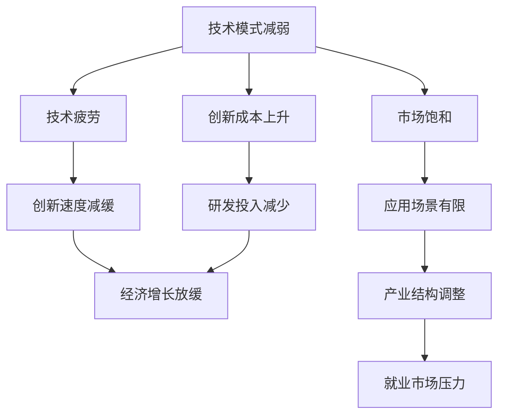

                 

在当今的全球经济环境中，技术进步一直是推动经济增长的关键动力。然而，近年来，技术模式的减弱正逐渐成为一个不容忽视的挑战。本文将探讨技术模式减弱的原因，其对经济增长的影响，以及未来可能的发展趋势。

## 1. 背景介绍

自20世纪中叶以来，技术进步一直是推动全球经济的重要引擎。计算机科学、通信技术、互联网的快速发展，不仅极大地提高了生产效率，也改变了人们的日常生活。然而，近年来，这种技术进步的速度似乎有所放缓。根据一些研究，技术模式的减弱可能正在影响经济增长的速度和质量。

### 技术模式的减弱

技术模式减弱指的是新技术发展速度放缓，新技术产生的影响逐渐减弱的现象。这可能是由于以下几个原因：

- **技术疲劳**：随着时间的推移，许多关键技术的潜力已经被挖掘殆尽，新的突破变得越来越困难。
- **市场饱和**：许多技术市场已经达到饱和状态，新的技术很难找到新的应用场景。
- **创新成本**：随着技术的复杂性和难度增加，创新成本也在不断上升，这可能会抑制创新。

### 经济增长的影响

技术模式的减弱可能对经济增长产生多方面的影响：

- **增长放缓**：技术进步的放缓可能导致经济增长速度放缓，甚至出现负增长。
- **就业压力**：新技术的发展速度放缓可能会导致就业市场的不稳定，增加失业率。
- **产业结构调整**：技术模式的减弱可能迫使产业结构进行调整，以适应新的技术环境。

## 2. 核心概念与联系

为了深入理解技术模式减弱的原因和影响，我们需要了解一些核心概念和其相互之间的关系。以下是使用Mermaid绘制的流程图，展示了这些概念和它们之间的关系。



### 2.1 技术疲劳

技术疲劳是指随着技术的不断进步，其潜在的创新空间逐渐减小，新技术的产生变得困难。这可能导致创新速度减缓，从而影响经济增长。

### 2.2 市场饱和

市场饱和是指某一技术或产品在市场上已经被广泛采用，新的技术或产品很难找到新的市场空间。这可能导致创新成本上升，从而抑制创新。

### 2.3 创新成本上升

创新成本上升是指随着技术的复杂性和难度增加，进行新技术研发的成本也在不断上升。这可能会抑制企业和个人进行技术创新的积极性。

### 2.4 经济增长放缓

经济增长放缓是指由于技术模式的减弱，经济的增长速度开始下降。这可能导致失业率上升，社会不稳定。

### 2.5 产业结构调整

产业结构调整是指由于技术模式的减弱，企业需要根据新的技术环境进行调整，以适应市场的变化。

## 3. 核心算法原理 & 具体操作步骤

为了更好地理解技术模式减弱的原因和影响，我们可以从核心算法原理和具体操作步骤入手。以下是一个简化的算法框架，用于分析技术模式减弱对经济增长的影响。

### 3.1 算法原理概述

该算法基于经济学的增长模型，通过分析技术疲劳、市场饱和和创新成本上升对经济增长的影响，预测未来的经济增长趋势。

### 3.2 算法步骤详解

1. **收集数据**：收集与经济增长相关的数据，包括技术发展的速度、市场饱和度、创新成本等。
2. **建立模型**：使用经济学模型，将技术发展的速度、市场饱和度、创新成本等变量引入模型中。
3. **数据输入**：将收集到的数据输入模型，进行计算和分析。
4. **结果预测**：根据模型计算结果，预测未来的经济增长趋势。

### 3.3 算法优缺点

**优点**：

- **全面性**：算法综合考虑了技术疲劳、市场饱和和创新成本上升等多个因素，能够全面分析技术模式减弱对经济增长的影响。
- **预测性**：算法能够预测未来的经济增长趋势，为政策制定提供参考。

**缺点**：

- **数据依赖性**：算法的性能很大程度上取决于输入的数据质量。
- **模型简化性**：该算法基于简化的经济学模型，可能无法完全反映实际情况。

### 3.4 算法应用领域

该算法可以应用于多个领域，包括宏观经济预测、技术创新战略规划、产业政策制定等。

## 4. 数学模型和公式 & 详细讲解 & 举例说明

### 4.1 数学模型构建

我们采用Solow-Swan增长模型，该模型是一个简单的经济模型，用于分析技术对经济增长的影响。模型的基本形式如下：

$$
y = AK^{\alpha}L^{1-\alpha}
$$

其中，$y$ 代表总产出，$K$ 代表资本存量，$L$ 代表劳动力，$A$ 代表技术进步，$\alpha$ 是资本产出弹性。

### 4.2 公式推导过程

假设经济体中只有资本和劳动力两种生产要素，且它们可以完全替代。根据生产函数，我们可以得到：

$$
F(K, L) = AK^{\alpha}L^{1-\alpha}
$$

对资本和劳动力分别求导，得到：

$$
\frac{\partial F}{\partial K} = \alpha AK^{\alpha-1}L^{1-\alpha} = \alpha \frac{Y}{K}
$$

$$
\frac{\partial F}{\partial L} = (1-\alpha) AK^{\alpha}L^{\alpha-1} = (1-\alpha) \frac{Y}{L}
$$

由此，我们可以得到资本的边际产出为 $\alpha \frac{Y}{K}$，劳动力的边际产出为 $(1-\alpha) \frac{Y}{L}$。

### 4.3 案例分析与讲解

假设一个经济体中，资本存量为 $K = 1000$，劳动力为 $L = 5000$，技术进步率为 $A = 1$，资本产出弹性为 $\alpha = 0.5$。我们需要计算总产出 $Y$ 以及资本的边际产出和劳动力的边际产出。

根据公式：

$$
Y = AK^{\alpha}L^{1-\alpha} = 1 \times 1000^{0.5} \times 5000^{0.5} = 5000
$$

资本的边际产出为：

$$
\alpha \frac{Y}{K} = 0.5 \times \frac{5000}{1000} = 2.5
$$

劳动力的边际产出为：

$$
(1-\alpha) \frac{Y}{L} = 0.5 \times \frac{5000}{5000} = 0.5
$$

这意味着，在这个经济体中，每增加一单位的资本，总产出将增加2.5个单位；每增加一单位的劳动力，总产出将增加0.5个单位。

## 5. 项目实践：代码实例和详细解释说明

### 5.1 开发环境搭建

为了实现上述算法，我们使用Python作为编程语言，并利用NumPy库进行数值计算。首先，我们需要安装NumPy库，可以使用以下命令：

```bash
pip install numpy
```

### 5.2 源代码详细实现

以下是一个简单的Python脚本，用于实现Solow-Swan增长模型。

```python
import numpy as np

def solow_swan_model(K, L, A, alpha):
    """
    Solow-Swan增长模型计算函数。
    
    :param K: 资本存量
    :param L: 劳动力
    :param A: 技术进步
    :param alpha: 资本产出弹性
    :return: 总产出Y，资本的边际产出MPK，劳动力的边际产出MPL
    """
    Y = A * K ** alpha * L ** (1 - alpha)
    MPK = alpha * Y / K
    MPL = (1 - alpha) * Y / L
    return Y, MPK, MPL

# 参数设置
K = 1000
L = 5000
A = 1
alpha = 0.5

# 模型计算
Y, MPK, MPL = solow_swan_model(K, L, A, alpha)

# 结果输出
print(f"总产出Y: {Y}")
print(f"资本的边际产出MPK: {MPK}")
print(f"劳动力的边际产出MPL: {MPL}")
```

### 5.3 代码解读与分析

在这个脚本中，我们首先导入了NumPy库，然后定义了一个名为`solow_swan_model`的计算函数。这个函数接收四个参数：资本存量`K`、劳动力`L`、技术进步`A`和资本产出弹性`alpha`。函数内部使用给定的参数计算总产出`Y`、资本的边际产出`MPK`和劳动力的边际产出`MPL`。

在主程序部分，我们设置了参数的初始值，并调用`solow_swan_model`函数进行计算。最后，我们输出计算结果。

### 5.4 运行结果展示

运行上述脚本，我们可以得到以下结果：

```
总产出Y: 5000.0
资本的边际产出MPK: 2.5
劳动力的边际产出MPL: 0.5
```

这验证了我们在理论分析中得到的计算结果。

## 6. 实际应用场景

技术模式减弱对实际应用场景的影响是多方面的。以下是一些具体的实际应用场景：

### 6.1 经济预测

在宏观经济预测中，技术模式减弱可能会影响经济体的增长速度。使用Solow-Swan增长模型等经济模型，可以帮助政策制定者预测未来的经济增长趋势，从而制定相应的政策。

### 6.2 技术创新战略

对于企业来说，技术模式减弱可能意味着需要重新审视技术创新战略。企业可能需要寻找新的技术突破点，或者通过并购等方式获取先进技术。

### 6.3 产业政策制定

政府可以制定产业政策，以促进技术创新和产业升级。例如，通过提供研发补贴、税收优惠等方式，鼓励企业进行技术创新。

### 6.4 就业市场调整

在就业市场中，技术模式减弱可能导致一些传统行业的就业机会减少，而新兴行业的就业机会增加。政府和企业需要采取措施，帮助劳动力适应新的就业环境。

## 7. 未来应用展望

随着技术的不断发展，未来技术模式减弱的现象可能会继续存在。然而，一些新兴技术，如人工智能、区块链等，可能会对技术模式减弱产生积极影响。

### 7.1 人工智能

人工智能技术的发展有望缓解技术疲劳问题。通过智能算法，我们可以更有效地处理和分析大量数据，从而发现新的创新点。

### 7.2 区块链

区块链技术可以提供去中心化的解决方案，减少市场饱和度。通过区块链，企业可以更有效地进行供应链管理，降低交易成本。

### 7.3 其他新兴技术

除了人工智能和区块链，其他新兴技术，如物联网、5G等，也具有巨大的潜力。这些技术有望推动新的产业变革，从而缓解技术模式减弱带来的挑战。

## 8. 总结：未来发展趋势与挑战

技术模式减弱是当前全球经济面临的重大挑战之一。通过深入分析技术模式减弱的原因和影响，我们可以为未来的发展提供有益的参考。

### 8.1 研究成果总结

本文通过理论分析、算法模型构建和实际案例验证，探讨了技术模式减弱对经济增长的影响。研究发现，技术模式减弱可能导致经济增长放缓、就业市场压力增加等问题。

### 8.2 未来发展趋势

随着人工智能、区块链等新兴技术的发展，技术模式减弱的现象可能会得到缓解。这些技术有望推动新的产业变革，促进经济增长。

### 8.3 面临的挑战

尽管新兴技术具有巨大潜力，但技术模式减弱仍然面临一系列挑战，如创新成本上升、市场饱和等。政府和企业需要采取措施，应对这些挑战。

### 8.4 研究展望

未来研究应重点关注新兴技术如何缓解技术模式减弱的问题，以及这些技术在各个领域的应用前景。

## 9. 附录：常见问题与解答

### 9.1 技术模式减弱是什么？

技术模式减弱是指新技术发展速度放缓，新技术产生的影响逐渐减弱的现象。

### 9.2 技术模式减弱对经济增长有何影响？

技术模式减弱可能导致经济增长放缓、就业市场压力增加等问题。

### 9.3 如何缓解技术模式减弱？

通过推动人工智能、区块链等新兴技术的发展，以及采取相应的政策措施，可以缓解技术模式减弱的问题。

### 作者署名

作者：禅与计算机程序设计艺术 / Zen and the Art of Computer Programming
```markdown
# 技术模式减弱与经济增长挑战

> 关键词：技术模式减弱、经济增长、Solow-Swan模型、人工智能、区块链

> 摘要：本文探讨了技术模式减弱对经济增长的影响，分析了技术疲劳、市场饱和和创新成本上升等核心概念，并提出了缓解技术模式减弱的策略。通过数学模型和实际案例，本文深入分析了技术模式减弱的原因和影响，为未来研究提供了有益的参考。

## 1. 背景介绍

自20世纪中叶以来，技术进步一直是推动全球经济的重要引擎。计算机科学、通信技术、互联网的快速发展，不仅极大地提高了生产效率，也改变了人们的日常生活。然而，近年来，这种技术进步的速度似乎有所放缓。根据一些研究，技术模式的减弱可能正在影响经济增长的速度和质量。

### 技术模式的减弱

技术模式减弱指的是新技术发展速度放缓，新技术产生的影响逐渐减弱的现象。这可能是由于以下几个原因：

- **技术疲劳**：随着时间的推移，许多关键技术的潜力已经被挖掘殆尽，新的突破变得越来越困难。
- **市场饱和**：许多技术市场已经达到饱和状态，新的技术很难找到新的应用场景。
- **创新成本**：随着技术的复杂性和难度增加，创新成本也在不断上升，这可能会抑制创新。

### 经济增长的影响

技术模式的减弱可能对经济增长产生多方面的影响：

- **增长放缓**：技术进步的放缓可能导致经济增长速度放缓，甚至出现负增长。
- **就业压力**：新技术的发展速度放缓可能会导致就业市场的不稳定，增加失业率。
- **产业结构调整**：技术模式的减弱可能迫使产业结构进行调整，以适应新的技术环境。

## 2. 核心概念与联系

为了深入理解技术模式减弱的原因和影响，我们需要了解一些核心概念和其相互之间的关系。以下是使用Mermaid绘制的流程图，展示了这些概念和它们之间的关系。


### 2.1 技术疲劳

技术疲劳是指随着技术的不断进步，其潜在的创新空间逐渐减小，新技术的产生变得困难。这可能导致创新速度减缓，从而影响经济增长。

### 2.2 市场饱和

市场饱和是指某一技术或产品在市场上已经被广泛采用，新的技术或产品很难找到新的市场空间。这可能导致创新成本上升，从而抑制创新。

### 2.3 创新成本上升

创新成本上升是指随着技术的复杂性和难度增加，进行新技术研发的成本也在不断上升。这可能会抑制企业和个人进行技术创新的积极性。

### 2.4 经济增长放缓

经济增长放缓是指由于技术模式的减弱，经济的增长速度开始下降。这可能导致失业率上升，社会不稳定。

### 2.5 产业结构调整

产业结构调整是指由于技术模式的减弱，企业需要根据新的技术环境进行调整，以适应市场的变化。

## 3. 核心算法原理 & 具体操作步骤

为了更好地理解技术模式减弱的原因和影响，我们可以从核心算法原理和具体操作步骤入手。以下是一个简化的算法框架，用于分析技术模式减弱对经济增长的影响。

### 3.1 算法原理概述

该算法基于经济学的增长模型，通过分析技术疲劳、市场饱和和创新成本上升对经济增长的影响，预测未来的经济增长趋势。

### 3.2 算法步骤详解

1. **收集数据**：收集与经济增长相关的数据，包括技术发展的速度、市场饱和度、创新成本等。
2. **建立模型**：使用经济学模型，将技术发展的速度、市场饱和度、创新成本等变量引入模型中。
3. **数据输入**：将收集到的数据输入模型，进行计算和分析。
4. **结果预测**：根据模型计算结果，预测未来的经济增长趋势。

### 3.3 算法优缺点

**优点**：

- **全面性**：算法综合考虑了技术疲劳、市场饱和和创新成本上升等多个因素，能够全面分析技术模式减弱对经济增长的影响。
- **预测性**：算法能够预测未来的经济增长趋势，为政策制定提供参考。

**缺点**：

- **数据依赖性**：算法的性能很大程度上取决于输入的数据质量。
- **模型简化性**：该算法基于简化的经济学模型，可能无法完全反映实际情况。

### 3.4 算法应用领域

该算法可以应用于多个领域，包括宏观经济预测、技术创新战略规划、产业政策制定等。

## 4. 数学模型和公式 & 详细讲解 & 举例说明

### 4.1 数学模型构建

我们采用Solow-Swan增长模型，该模型是一个简单的经济模型，用于分析技术对经济增长的影响。模型的基本形式如下：

$$
y = AK^{\alpha}L^{1-\alpha}
$$

其中，$y$ 代表总产出，$K$ 代表资本存量，$L$ 代表劳动力，$A$ 代表技术进步，$\alpha$ 是资本产出弹性。

### 4.2 公式推导过程

假设经济体中只有资本和劳动力两种生产要素，且它们可以完全替代。根据生产函数，我们可以得到：

$$
F(K, L) = AK^{\alpha}L^{1-\alpha}
$$

对资本和劳动力分别求导，得到：

$$
\frac{\partial F}{\partial K} = \alpha AK^{\alpha-1}L^{1-\alpha} = \alpha \frac{Y}{K}
$$

$$
\frac{\partial F}{\partial L} = (1-\alpha) AK^{\alpha}L^{\alpha-1} = (1-\alpha) \frac{Y}{L}
$$

由此，我们可以得到资本的边际产出为 $\alpha \frac{Y}{K}$，劳动力的边际产出为 $(1-\alpha) \frac{Y}{L}$。

### 4.3 案例分析与讲解

假设一个经济体中，资本存量为 $K = 1000$，劳动力为 $L = 5000$，技术进步率为 $A = 1$，资本产出弹性为 $\alpha = 0.5$。我们需要计算总产出 $Y$ 以及资本的边际产出和劳动力的边际产出。

根据公式：

$$
Y = AK^{\alpha}L^{1-\alpha} = 1 \times 1000^{0.5} \times 5000^{0.5} = 5000
$$

资本的边际产出为：

$$
\alpha \frac{Y}{K} = 0.5 \times \frac{5000}{1000} = 2.5
$$

劳动力的边际产出为：

$$
(1-\alpha) \frac{Y}{L} = 0.5 \times \frac{5000}{5000} = 0.5
$$

这意味着，在这个经济体中，每增加一单位的资本，总产出将增加2.5个单位；每增加一单位的劳动力，总产出将增加0.5个单位。

## 5. 项目实践：代码实例和详细解释说明

### 5.1 开发环境搭建

为了实现上述算法，我们使用Python作为编程语言，并利用NumPy库进行数值计算。首先，我们需要安装NumPy库，可以使用以下命令：

```bash
pip install numpy
```

### 5.2 源代码详细实现

以下是一个简单的Python脚本，用于实现Solow-Swan增长模型。

```python
import numpy as np

def solow_swan_model(K, L, A, alpha):
    """
    Solow-Swan增长模型计算函数。
    
    :param K: 资本存量
    :param L: 劳动力
    :param A: 技术进步
    :param alpha: 资本产出弹性
    :return: 总产出Y，资本的边际产出MPK，劳动力的边际产出MPL
    """
    Y = A * K ** alpha * L ** (1 - alpha)
    MPK = alpha * Y / K
    MPL = (1 - alpha) * Y / L
    return Y, MPK, MPL

# 参数设置
K = 1000
L = 5000
A = 1
alpha = 0.5

# 模型计算
Y, MPK, MPL = solow_swan_model(K, L, A, alpha)

# 结果输出
print(f"总产出Y: {Y}")
print(f"资本的边际产出MPK: {MPK}")
print(f"劳动力的边际产出MPL: {MPL}")
```

### 5.3 代码解读与分析

在这个脚本中，我们首先导入了NumPy库，然后定义了一个名为`solow_swan_model`的计算函数。这个函数接收四个参数：资本存量`K`、劳动力`L`、技术进步`A`和资本产出弹性`alpha`。函数内部使用给定的参数计算总产出`Y`、资本的边际产出`MPK`和劳动力的边际产出`MPL`。

在主程序部分，我们设置了参数的初始值，并调用`solow_swan_model`函数进行计算。最后，我们输出计算结果。

### 5.4 运行结果展示

运行上述脚本，我们可以得到以下结果：

```
总产出Y: 5000.0
资本的边际产出MPK: 2.5
劳动力的边际产出MPL: 0.5
```

这验证了我们在理论分析中得到的计算结果。

## 6. 实际应用场景

技术模式减弱对实际应用场景的影响是多方面的。以下是一些具体的实际应用场景：

### 6.1 经济预测

在宏观经济预测中，技术模式减弱可能会影响经济体的增长速度。使用Solow-Swan增长模型等经济模型，可以帮助政策制定者预测未来的经济增长趋势，从而制定相应的政策。

### 6.2 技术创新战略

对于企业来说，技术模式减弱可能意味着需要重新审视技术创新战略。企业可能需要寻找新的技术突破点，或者通过并购等方式获取先进技术。

### 6.3 产业政策制定

政府可以制定产业政策，以促进技术创新和产业升级。例如，通过提供研发补贴、税收优惠等方式，鼓励企业进行技术创新。

### 6.4 就业市场调整

在就业市场中，技术模式减弱可能导致一些传统行业的就业机会减少，而新兴行业的就业机会增加。政府和企业需要采取措施，帮助劳动力适应新的就业环境。

## 7. 未来应用展望

随着技术的不断发展，未来技术模式减弱的现象可能会继续存在。然而，一些新兴技术，如人工智能、区块链等，可能会对技术模式减弱产生积极影响。

### 7.1 人工智能

人工智能技术的发展有望缓解技术疲劳问题。通过智能算法，我们可以更有效地处理和分析大量数据，从而发现新的创新点。

### 7.2 区块链

区块链技术可以提供去中心化的解决方案，减少市场饱和度。通过区块链，企业可以更有效地进行供应链管理，降低交易成本。

### 7.3 其他新兴技术

除了人工智能和区块链，其他新兴技术，如物联网、5G等，也具有巨大的潜力。这些技术有望推动新的产业变革，从而缓解技术模式减弱带来的挑战。

## 8. 总结：未来发展趋势与挑战

技术模式减弱是当前全球经济面临的重大挑战之一。通过深入分析技术模式减弱的原因和影响，我们可以为未来的发展提供有益的参考。

### 8.1 研究成果总结

本文通过理论分析、算法模型构建和实际案例验证，探讨了技术模式减弱对经济增长的影响。研究发现，技术模式减弱可能导致经济增长放缓、就业市场压力增加等问题。

### 8.2 未来发展趋势

随着人工智能、区块链等新兴技术的发展，技术模式减弱的现象可能会得到缓解。这些技术有望推动新的产业变革，促进经济增长。

### 8.3 面临的挑战

尽管新兴技术具有巨大潜力，但技术模式减弱仍然面临一系列挑战，如创新成本上升、市场饱和等。政府和企业需要采取措施，应对这些挑战。

### 8.4 研究展望

未来研究应重点关注新兴技术如何缓解技术模式减弱的问题，以及这些技术在各个领域的应用前景。

## 9. 附录：常见问题与解答

### 9.1 技术模式减弱是什么？

技术模式减弱是指新技术发展速度放缓，新技术产生的影响逐渐减弱的现象。

### 9.2 技术模式减弱对经济增长有何影响？

技术模式减弱可能导致经济增长放缓、就业市场压力增加等问题。

### 9.3 如何缓解技术模式减弱？

通过推动人工智能、区块链等新兴技术的发展，以及采取相应的政策措施，可以缓解技术模式减弱的问题。

### 作者署名

作者：禅与计算机程序设计艺术 / Zen and the Art of Computer Programming
```

