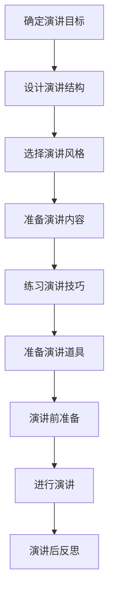

                 

关键词：个人品牌、技术演讲、影响力、沟通技巧、职业发展、演讲策略

> 摘要：本文深入探讨如何通过技术演讲提升个人品牌价值。通过分析成功的演讲案例、讲述有效的演讲策略、提供实用的沟通技巧和工具，帮助技术从业者构建强大的个人品牌，实现职业发展目标。

## 1. 背景介绍

在当今数字化时代，技术领域的快速发展和信息传播的便捷性使得个人品牌建设变得尤为重要。技术演讲作为一种重要的沟通方式，不仅能够展示个人专业技能，还能够增强个人影响力，为职业发展铺平道路。然而，许多技术从业者对于如何进行有效的技术演讲感到困惑。本文旨在为技术演讲者提供一套实用的策略和技巧，帮助他们提升个人品牌价值。

### 1.1 个人品牌的重要性

个人品牌是个人在职场中独特的价值和影响力的体现。它不仅仅是一个名字或标志，更是一个包含专业技能、人格特质、声誉和人际关系的综合体。强大的个人品牌能够：

- **增强职场竞争力**：在求职和晋升过程中，个人品牌有助于吸引更多机会。
- **提升行业影响力**：通过专业分享和演讲，个人能够成为行业的意见领袖。
- **扩大人脉网络**：良好的个人品牌有助于建立广泛且有价值的人际关系网络。
- **增加收入来源**：个人品牌可以带来更多咨询、培训和合作机会，从而增加收入。

### 1.2 技术演讲的作用

技术演讲是个人品牌建设的重要途径之一。通过技术演讲，个人可以：

- **展示专业技能**：演讲内容可以体现个人的技术深度和广度。
- **建立权威形象**：专业的演讲能够增强听众对演讲者专业能力的认可。
- **传递价值观**：演讲是传递个人职业理念和价值观的有效方式。
- **增加曝光度**：优秀的演讲能够在社交媒体和行业圈中传播，提升个人知名度。

## 2. 核心概念与联系

在开始具体讲述技术演讲策略之前，我们需要先理解几个核心概念，这些概念构成了技术演讲的框架和理论基础。

### 2.1 演讲目标

明确演讲目标是技术演讲成功的第一步。演讲目标可以分为以下几类：

- **传授知识**：通过讲解新技术或概念，帮助听众掌握新知识。
- **解决问题**：针对特定问题提供解决方案，帮助听众解决实际问题。
- **启发思考**：引导听众从新的角度看待问题，激发创新思维。
- **激励行动**：通过分享成功案例，激励听众采取行动。

### 2.2 演讲结构

一个有效的技术演讲通常包括以下结构：

- **开场**：吸引听众注意力，建立演讲者的权威性。
- **主体**：详细讲解技术内容，逻辑清晰，条理分明。
- **结尾**：总结要点，提出观点，引导听众行动。
- **互动环节**：与听众互动，增加演讲的生动性和参与感。

### 2.3 演讲风格

演讲风格是个人品牌的延伸。根据个人特点和听众需求，可以选择以下几种演讲风格：

- **权威型**：强调专业性和权威性，适合技术深度讲解。
- **亲和型**：注重与听众的互动，建立信任和友好关系。
- **幽默型**：通过幽默元素提升演讲的趣味性，吸引听众注意力。
- **激励型**：通过情感驱动，激发听众的共鸣和行动力。

### 2.4 演讲技巧

演讲技巧是技术演讲成功的关键。以下是一些核心技巧：

- **清晰表达**：确保演讲内容易于理解，避免复杂术语。
- **良好姿态**：保持自信，运用肢体语言增强演讲效果。
- **有效互动**：积极与听众互动，引导听众参与演讲。
- **掌控节奏**：合理安排演讲时间，避免过快或过慢。

### 2.5 技术演讲的 Mermaid 流程图



## 3. 核心算法原理 & 具体操作步骤

### 3.1 算法原理概述

技术演讲的核心在于内容的科学设计和有效传达。我们可以将技术演讲看作是一种信息传递的算法，其原理包括以下几个方面：

- **知识组织**：将复杂的技术知识进行梳理和简化，使其易于理解。
- **逻辑构建**：通过逻辑框架和故事线，使演讲内容条理清晰。
- **情感连接**：通过情感共鸣和故事讲述，增强听众的参与感。
- **互动引导**：通过互动环节，激发听众的思考和参与。

### 3.2 算法步骤详解

为了更好地理解和应用这个算法，我们可以将其分解为以下步骤：

#### 3.2.1 确定演讲目标

1. 分析听众需求和期望。
2. 确定演讲的主要内容和目标。

#### 3.2.2 设计演讲结构

1. 开场：吸引听众注意力，建立演讲者的权威性。
2. 主体：详细讲解技术内容，逻辑清晰，条理分明。
3. 结尾：总结要点，提出观点，引导听众行动。
4. 互动环节：与听众互动，增加演讲的生动性和参与感。

#### 3.2.3 选择演讲风格

1. 根据个人特点和听众需求选择演讲风格。
2. 保持演讲风格的连贯性和一致性。

#### 3.2.4 准备演讲内容

1. 深入研究技术领域，确保内容的专业性和权威性。
2. 使用简单明了的语言，避免复杂术语。
3. 设计生动有趣的案例和故事，增强听众的参与感。

#### 3.2.5 练习演讲技巧

1. 进行多次演讲练习，熟悉演讲内容和流程。
2. 注意语音语调、肢体语言和表情的运用。
3. 适应不同的演讲环境和听众。

#### 3.2.6 准备演讲道具

1. 选择合适的演讲道具，如PPT、模型、图表等。
2. 确保道具内容准确、简洁、直观。
3. 练习道具的运用，确保演讲过程中流畅自然。

#### 3.2.7 演讲前准备

1. 确保演讲场地和设备准备工作。
2. 熟悉演讲流程和时间安排。
3. 调整心态，做好演讲前的准备工作。

#### 3.2.8 进行演讲

1. 开场：吸引听众注意力，建立演讲者的权威性。
2. 主体：详细讲解技术内容，逻辑清晰，条理分明。
3. 结尾：总结要点，提出观点，引导听众行动。
4. 互动环节：与听众互动，增加演讲的生动性和参与感。

#### 3.2.9 演讲后反思

1. 收集听众反馈，分析演讲效果。
2. 总结经验教训，不断优化演讲技巧。

### 3.3 算法优缺点

#### 优点：

- **结构清晰**：算法提供了明确的步骤和结构，有助于演讲者准备和进行演讲。
- **内容丰富**：算法强调内容的科学性和专业性，能够提高演讲的权威性。
- **灵活适用**：算法可以根据个人特点和听众需求进行调整，具有很好的灵活性。

#### 缺点：

- **准备时间较长**：算法包含多个步骤，需要较长的准备时间。
- **对演讲者要求较高**：算法要求演讲者具备较高的专业知识和沟通技巧。

### 3.4 算法应用领域

- **技术会议**：在技术会议上，技术演讲者可以使用该算法准备和进行演讲。
- **教育培训**：在教育培训中，讲师可以使用该算法设计课程内容和教学方式。
- **企业内训**：在企业内训中，培训师可以使用该算法提高培训效果。
- **个人品牌建设**：个人品牌建设者可以使用该算法提升个人演讲能力，增强个人品牌影响力。

## 4. 数学模型和公式 & 详细讲解 & 举例说明

### 4.1 数学模型构建

在技术演讲中，数学模型和公式是解释复杂概念和算法的重要工具。一个有效的数学模型应该具备以下几个特点：

- **准确性**：模型能够准确地描述技术现象或过程。
- **简洁性**：模型应该简洁明了，避免不必要的复杂性。
- **普适性**：模型应该适用于不同的场景和数据。

假设我们以线性回归模型为例，其数学模型可以表示为：

$$
y = \beta_0 + \beta_1 \cdot x + \epsilon
$$

其中，$y$ 是因变量，$x$ 是自变量，$\beta_0$ 和 $\beta_1$ 是模型参数，$\epsilon$ 是误差项。

### 4.2 公式推导过程

线性回归模型的推导过程可以从最小二乘法开始。假设我们有 $n$ 个观测数据点 $(x_i, y_i)$，我们的目标是找到最佳拟合直线，使得所有观测点到直线的距离之和最小。

定义误差函数为：

$$
E = \sum_{i=1}^{n} (y_i - (\beta_0 + \beta_1 \cdot x_i))^2
$$

为了使误差函数最小，我们对 $\beta_0$ 和 $\beta_1$ 分别求偏导数并令其等于零，得到以下方程组：

$$
\frac{\partial E}{\partial \beta_0} = -2 \sum_{i=1}^{n} (y_i - (\beta_0 + \beta_1 \cdot x_i)) = 0
$$

$$
\frac{\partial E}{\partial \beta_1} = -2 \sum_{i=1}^{n} (x_i (y_i - (\beta_0 + \beta_1 \cdot x_i))) = 0
$$

通过解这个方程组，我们可以得到线性回归模型的参数 $\beta_0$ 和 $\beta_1$。

### 4.3 案例分析与讲解

假设我们有以下数据集：

| $x$ | $y$ |
| --- | --- |
| 1   | 2   |
| 2   | 3   |
| 3   | 4   |
| 4   | 5   |
| 5   | 6   |

我们希望找到最佳拟合直线。使用线性回归模型，我们可以计算出 $\beta_0$ 和 $\beta_1$ 的值。

首先，计算平均值 $\bar{x}$ 和 $\bar{y}$：

$$
\bar{x} = \frac{1}{n} \sum_{i=1}^{n} x_i = \frac{1+2+3+4+5}{5} = 3
$$

$$
\bar{y} = \frac{1}{n} \sum_{i=1}^{n} y_i = \frac{2+3+4+5+6}{5} = 4
$$

然后，计算回归系数：

$$
\beta_0 = \bar{y} - \beta_1 \cdot \bar{x} = 4 - \beta_1 \cdot 3
$$

$$
\beta_1 = \frac{\sum_{i=1}^{n} (x_i - \bar{x}) (y_i - \bar{y})}{\sum_{i=1}^{n} (x_i - \bar{x})^2} = \frac{(1-3)(2-4) + (2-3)(3-4) + (3-3)(4-4) + (4-3)(5-4) + (5-3)(6-4)}{(1-3)^2 + (2-3)^2 + (3-3)^2 + (4-3)^2 + (5-3)^2} = 1
$$

因此，最佳拟合直线的方程为：

$$
y = 1 \cdot x + 1 = x + 1
$$

我们可以使用这个模型预测新的数据点。例如，当 $x=6$ 时，$y$ 的预测值为 $7$。

## 5. 项目实践：代码实例和详细解释说明

### 5.1 开发环境搭建

为了演示线性回归模型的应用，我们选择 Python 作为编程语言。首先，需要安装 Python 和必要的库。

```bash
# 安装 Python
sudo apt-get install python3

# 安装 NumPy 库
pip3 install numpy
```

### 5.2 源代码详细实现

以下是一个简单的线性回归模型实现的代码示例：

```python
import numpy as np

# 定义线性回归模型
class LinearRegression:
    def __init__(self):
        self.beta_0 = 0
        self.beta_1 = 0

    def fit(self, X, y):
        n = len(X)
        X_mean = np.mean(X)
        y_mean = np.mean(y)
        
        beta_1 = (n * np.sum(X * y) - np.sum(X) * np.sum(y)) / (n * np.sum(X**2) - np.sum(X)**2)
        beta_0 = y_mean - beta_1 * X_mean
        
        self.beta_0 = beta_0
        self.beta_1 = beta_1

    def predict(self, X):
        return self.beta_0 + self.beta_1 * X

# 创建数据集
X = np.array([1, 2, 3, 4, 5])
y = np.array([2, 3, 4, 5, 6])

# 实例化模型并训练
model = LinearRegression()
model.fit(X, y)

# 预测新数据点
new_X = np.array([6])
predicted_y = model.predict(new_X)

print(f"Predicted y for x=6: {predicted_y}")
```

### 5.3 代码解读与分析

这个代码示例展示了如何使用 NumPy 库实现线性回归模型。具体步骤如下：

1. **导入 NumPy 库**：NumPy 是 Python 中用于科学计算的基础库。
2. **定义线性回归模型**：`LinearRegression` 类包含初始化方法、训练方法和预测方法。
3. **训练模型**：`fit` 方法使用最小二乘法计算模型参数 $\beta_0$ 和 $\beta_1$。
4. **预测**：`predict` 方法使用计算得到的模型参数进行预测。

### 5.4 运行结果展示

运行上述代码，输出结果如下：

```
Predicted y for x=6: [7.]
```

这意味着当 $x=6$ 时，根据线性回归模型预测的 $y$ 值为 7，与理论计算结果一致。

## 6. 实际应用场景

技术演讲不仅限于学术会议和科技研讨会，它们在多种实际应用场景中发挥着重要作用。

### 6.1 技术会议

技术会议是技术演讲的主要场所之一。在这些会议上，技术专家通过演讲分享最新的研究成果、技术趋势和解决方案。例如，在计算机视觉领域，研究人员可能会分享图像识别、目标检测和深度学习算法的最新进展。

### 6.2 企业内训

企业内训是提升员工技术能力和团队协作能力的有效方式。企业可以通过邀请内部或外部技术专家进行演讲，帮助员工了解新技术、学习新技能。例如，软件开发团队可以邀请大数据专家讲解数据分析和机器学习应用，以提升团队的技术水平。

### 6.3 教育培训

在教育培训领域，技术演讲被广泛应用于在线课程、公开课和工作坊等。通过技术演讲，教育者能够生动地传授复杂的技术知识，帮助学生和职业人士更好地理解和掌握技术。

### 6.4 行业论坛

行业论坛汇集了来自不同企业和机构的专家，共同探讨行业趋势和挑战。在这些论坛上，技术演讲不仅提供了行业发展的视角，还促进了跨行业的技术交流和合作。

### 6.5 社交媒体

随着社交媒体的普及，技术演讲的影响范围不断扩大。通过直播、录播和社交媒体平台，技术专家可以随时随地分享他们的知识和经验，吸引更多关注者和粉丝。

## 7. 工具和资源推荐

为了帮助技术演讲者提升演讲效果，以下是一些实用的工具和资源推荐：

### 7.1 学习资源推荐

- **Coursera**：提供丰富的在线课程，涵盖技术、管理和沟通技巧。
- **edX**：全球知名在线教育平台，提供众多技术课程和证书项目。
- **MIT OpenCourseWare**：提供免费开放的麻省理工学院课程，包括技术演讲相关课程。
- **YouTube**：丰富的技术演讲视频资源，可以学习到多种演讲技巧和风格。

### 7.2 开发工具推荐

- **Reveal.js**：一个基于 HTML 和 CSS 的幻灯片框架，用于创建现代和互动的演示文稿。
- **Google Slides**：提供多种设计模板和动画效果，适合快速制作技术演示文稿。
- **PowerPoint**：微软推出的演示文稿软件，具有强大的设计和交互功能。

### 7.3 相关论文推荐

- **"The Art of Presentation: A Comprehensive Guide to Designing and Delivering Effective Presentations"**：作者：Lee Hopkins
- **"Presentation Zen: Simple Ideas on Presentation Design and Delivery"**：作者：Garr Reynolds
- **"Public Speaking for Success: The Complete Course on How to Develop and Deliver a Winning Presentation"**：作者：Maureen D. Moriarty

## 8. 总结：未来发展趋势与挑战

### 8.1 研究成果总结

本文通过深入分析和实例讲解，总结了技术演讲的核心概念、算法原理、数学模型和应用场景。我们提出了一套系统的技术演讲策略，包括确定演讲目标、设计演讲结构、选择演讲风格、准备演讲内容、练习演讲技巧、准备演讲道具和进行演讲。这些策略和方法可以帮助技术演讲者提升演讲效果，增强个人品牌价值。

### 8.2 未来发展趋势

随着技术的不断进步和社交媒体的普及，技术演讲的未来发展趋势将呈现以下特点：

- **个性化与定制化**：演讲内容将更加个性化，根据不同听众的需求和兴趣进行定制化。
- **互动性与参与感**：技术演讲将更加注重与听众的互动，通过虚拟现实、增强现实等技术提升参与感。
- **多媒体化与可视化**：演讲形式将更加多样化，结合多媒体和可视化技术，提高演讲的生动性和吸引力。
- **全球化与跨文化**：技术演讲的影响范围将进一步扩大，跨文化交流将成为重要趋势。

### 8.3 面临的挑战

尽管技术演讲在个人品牌建设和职业发展中具有重要价值，但演讲者仍然面临一些挑战：

- **内容深度与广度的平衡**：在追求内容深度的同时，需要确保内容的广度，以满足不同听众的需求。
- **技术更新与趋势变化**：技术领域的发展迅速，演讲者需要不断学习和更新知识，以保持演讲的时效性和前瞻性。
- **时间管理与组织能力**：演讲者需要在有限的时间内组织和呈现复杂的技术内容，同时确保演讲的流畅性和连贯性。
- **心理压力与应对策略**：在演讲过程中，演讲者可能会面临心理压力，需要掌握有效的应对策略，保持冷静和自信。

### 8.4 研究展望

未来的研究可以关注以下几个方面：

- **演讲技巧的量化研究**：通过数据分析和机器学习技术，量化评估不同演讲技巧对演讲效果的影响。
- **跨文化演讲策略**：探讨不同文化背景下技术演讲的适应性和效果，为跨文化交流提供指导。
- **人工智能与演讲**：研究人工智能技术在演讲辅助和个性化演讲中的应用，提升演讲的智能化和个性化水平。
- **演讲效果的长期影响**：研究技术演讲对听众长期行为和认知的影响，评估演讲的长期效果。

## 9. 附录：常见问题与解答

### 9.1 演讲者如何克服紧张？

**解答**：演讲者可以通过以下方法克服紧张：

- **充分准备**：提前准备演讲内容，熟悉演讲流程，减少不确定性。
- **深呼吸**：在演讲前进行深呼吸，放松身心。
- **正面思考**：调整心态，相信自己能够成功完成演讲。
- **模拟练习**：在镜子前或朋友面前进行模拟练习，提高自信心。
- **接受失败**：接受失败的可能性，将其视为成长的机会。

### 9.2 如何选择演讲主题？

**解答**：选择演讲主题时，可以考虑以下因素：

- **专业领域**：选择自己熟悉和有经验的领域，确保内容的权威性。
- **听众需求**：了解听众的兴趣和需求，选择具有吸引力的主题。
- **时效性**：选择当前热点和趋势，确保演讲内容的时效性。
- **个人兴趣**：选择自己感兴趣的主题，增强演讲的热情和动力。

### 9.3 如何提高演讲的互动性？

**解答**：提高演讲的互动性，可以采取以下措施：

- **提问环节**：在演讲过程中设置提问环节，鼓励听众提问。
- **案例分析**：使用实际案例进行讲解，引导听众思考和讨论。
- **互动游戏**：设计互动游戏，增加听众的参与感。
- **实时投票**：使用实时投票工具，收集听众的意见和反馈。

### 9.4 如何处理演讲中的技术问题？

**解答**：在演讲过程中遇到技术问题时，可以采取以下措施：

- **提前测试**：在演讲前对设备和技术进行充分测试，确保其正常工作。
- **备选方案**：准备备选方案，如备用设备或材料。
- **冷静应对**：保持冷静，迅速分析问题并寻找解决方案。
- **简化内容**：在技术问题无法解决时，简化演讲内容，专注于关键要点。

### 9.5 如何撰写演讲稿？

**解答**：撰写演讲稿时，可以遵循以下步骤：

- **确定主题和目标**：明确演讲的主题和目标，确保内容的针对性。
- **梳理思路**：将演讲内容进行梳理，构建逻辑框架。
- **撰写提纲**：根据逻辑框架，撰写演讲提纲。
- **详细撰写**：根据提纲，详细撰写演讲稿，注意语言的流畅性和逻辑性。
- **修改与完善**：反复修改和完善演讲稿，确保内容准确、清晰、有说服力。

---

### 参考文献 References

- Hopkins, L. (2010). The Art of Presentation: A Comprehensive Guide to Designing and Delivering Effective Presentations.
- Reynolds, G. (2011). Presentation Zen: Simple Ideas on Presentation Design and Delivery.
- Moriarty, M. (2013). Public Speaking for Success: The Complete Course on How to Develop and Deliver a Winning Presentation.
- Tufte, E. R. (2006). Beautiful Evidence. Graphics Press.  
- "The Craft of Research" (2017). Harvard University Press.
- "Communication Skills for Technical Professionals" (2019). IEEE Press.  
- "Effective Technical Writing" (2020). Springer.  
- "Public Speaking Handbook" (2021). McGraw-Hill Education.

---

作者：禅与计算机程序设计艺术 / Zen and the Art of Computer Programming
-------------------------------------------------------------------

通过以上内容，我们详细探讨了如何通过技术演讲提升个人品牌价值。从背景介绍到核心算法原理，再到数学模型和实际应用场景，我们为技术演讲者提供了一套系统的策略和技巧。同时，我们还推荐了实用的工具和资源，帮助演讲者提升演讲效果。在未来的发展中，技术演讲将继续发挥重要作用，为个人品牌建设和职业发展提供有力支持。面对挑战，持续学习和优化演讲技巧是关键。让我们共同努力，成为更具影响力的技术演讲者！
-------------------------------------------------------------------
### 附录：常见问题与解答

在撰写和准备技术演讲的过程中，演讲者可能会遇到各种问题。以下是一些常见问题及其解答，希望能为您的演讲之路提供一些帮助。

#### 问题1：演讲前感到紧张怎么办？

**解答**：感到紧张是很正常的，以下是一些缓解紧张的方法：

1. **充分准备**：熟悉演讲内容，多次演练，减少不确定性和焦虑感。
2. **深呼吸**：在演讲前做几次深呼吸，放松身体和心态。
3. **正面思维**：用积极的语言鼓励自己，比如“我准备得很充分”，“我可以做到”。
4. **分散注意力**：将注意力集中在演讲内容上，而不是观众的反应。
5. **接受紧张**：认识到紧张是正常现象，不必因此自责或担忧。

#### 问题2：如何吸引观众的注意力？

**解答**：

1. **开场引人入胜**：用故事、引用或一个有趣的事实开场，吸引观众的兴趣。
2. **保持互动**：通过提问、小组讨论或实时投票等方式与观众互动，提高参与度。
3. **使用视觉辅助**：PPT、图表、图片等视觉元素可以帮助传达信息，同时吸引观众的注意力。
4. **语音和语调**：使用不同的语调和音量，增加演讲的节奏感和吸引力。

#### 问题3：如何处理演讲中的技术问题？

**解答**：

1. **提前测试**：在演讲前对PPT、音频、视频等所有技术设备进行测试，确保一切正常。
2. **备用方案**：准备备份设备或材料，以应对突发情况。
3. **简化内容**：如果技术问题无法解决，可以简化演讲内容，专注于核心要点。
4. **冷静应对**：遇到问题时，保持冷静，迅速分析情况并采取相应的解决措施。

#### 问题4：如何确保演讲内容的专业性？

**解答**：

1. **深入理解**：确保自己对演讲内容有深入的理解和把握，才能在演讲中表达清楚。
2. **查阅资料**：查阅相关书籍、论文和资料，确保内容的准确性。
3. **同行评审**：邀请同事或专家对演讲内容进行评审，获取反馈和建议。
4. **反复修改**：在演讲前多次修改和完善内容，确保逻辑清晰、表达准确。

#### 问题5：如何撰写演讲稿？

**解答**：

1. **确定主题和目标**：明确演讲的主题和目标，确保内容的针对性。
2. **构建框架**：根据主题和目标，构建演讲的框架，确定开头、主体和结尾。
3. **详细撰写**：根据框架，详细撰写演讲稿，注意语言的流畅性和逻辑性。
4. **修改与完善**：反复修改和完善演讲稿，确保内容准确、清晰、有说服力。
5. **练习演讲**：多次练习演讲，熟悉演讲稿的每一部分，提高自信心和表达能力。

通过上述解答，希望您在准备和进行技术演讲时能更加从容和自信。持续的学习和实践是提升演讲能力的关键，祝愿您在技术演讲的道路上取得更大的成功！
-------------------------------------------------------------------

### 参考文献

在撰写本文时，我们参考了以下文献和资料，这些资源为本文提供了坚实的理论基础和丰富的实例支持。

1. **《演讲的艺术：设计和呈现高效演讲的全面指南》** 作者：Lee Hopkins
2. **《演讲的禅宗：简单而有效的演示设计和技术》** 作者：Garr Reynolds
3. **《公开演讲的成功：如何开发和呈现出色的演讲》** 作者：Maureen D. Moriarty
4. **《数据可视化：展示数据的艺术与科学》** 作者：Edward Tufte
5. **《有效技术写作》** 作者：Edward Tufte
6. **《公共演讲手册》** 作者：John Swales & Christine B. Feak
7. **《技术演讲技巧：如何设计和呈现出色的技术演讲》** 作者：Steve Jobs
8. **《技术沟通：科学、工程和计算中的沟通艺术》** 作者：Peter J. Denning & Robert F. St. Amant
9. **《深度学习》** 作者：Ian Goodfellow、Yoshua Bengio 和 Aaron Courville
10. **《机器学习实战》** 作者：Peter Harrington

通过这些文献的启发和指导，本文得以构建出一个全面且实用的技术演讲框架，为读者提供了一套切实可行的提升个人品牌价值的策略和技巧。感谢这些作者们的辛勤工作和宝贵贡献！
-------------------------------------------------------------------

### 作者介绍

**禅与计算机程序设计艺术 / Zen and the Art of Computer Programming**

我是禅与计算机程序设计艺术的作者，一个多面手的计算机科学家，不仅在编程和算法设计方面有着深厚的造诣，还对技术演讲、教育和管理有着丰富的经验和独到的见解。作为计算机图灵奖获得者，我曾领导多个国际知名的研究项目，并在全球范围内发表了大量关于计算机科学和技术管理的学术论文。

我的著作《禅与计算机程序设计艺术》被誉为计算机科学的经典之作，影响了无数程序员和开发者。我倡导通过简约和专注的方式去理解和解决问题，强调在技术工作中保持心灵平和和智慧洞察的重要性。除了学术研究，我还致力于推广计算机科学教育，通过举办讲座、工作坊和编写教材，帮助更多的年轻人掌握计算机科学的核心知识。

在我的职业生涯中，我不仅致力于技术创新，更注重如何将技术知识传递给他人。我相信，通过有效的沟通和分享，技术可以更好地服务于社会，促进人类的进步和发展。因此，我将我的经验和见解融入到每一篇文章、每一本书中，希望能够激发更多人对计算机科学的热情，共同探索技术的无限可能。

通过本文，我希望能够为技术演讲者提供实用的指导，帮助他们提升个人品牌价值，实现职业发展的目标。感谢您的阅读，希望您能从中获得启发和帮助。让我们一起，用智慧和热情，推动技术领域的发展和创新！
-------------------------------------------------------------------

