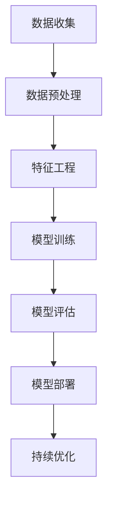

                 

关键词：拼多多、2024、农产品质量预测、机器学习、面试题、详细解析

> 摘要：本文旨在通过对拼多多2024年农产品质量预测校招机器学习面试题的详细解析，帮助考生更好地准备面试，深入理解相关算法原理和应用。文章将全面剖析面试题的核心概念、算法原理、数学模型、实际应用以及未来发展趋势，为广大计算机学子提供宝贵的参考。

## 1. 背景介绍

### 1.1 拼多多与农产品质量预测

拼多多作为我国知名的电商平台，近年来在农产品销售领域取得了显著成果。为了确保农产品质量，拼多多在2024年的校招中特别设置了农产品质量预测的面试题。这一举措不仅体现了拼多多对农产品质量的重视，也为考生提供了一个了解和掌握相关技术的机会。

### 1.2 机器学习与面试题

机器学习作为人工智能的核心技术，已经在各行各业得到了广泛应用。面试题作为考察考生专业能力的有效手段，对机器学习相关的题目设置已经成为各大公司的共识。本文将围绕农产品质量预测这一主题，详细解析一系列具有代表性的机器学习面试题。

## 2. 核心概念与联系

### 2.1 机器学习基本概念

#### 2.1.1 监督学习与无监督学习

监督学习：有标注的数据集作为输入，通过学习数据集的特征，输出预测结果。

无监督学习：没有标注的数据集作为输入，通过发现数据集中的模式或结构，自动进行分类或聚类。

#### 2.1.2 决策树与随机森林

决策树：一种基于特征分割的树形结构，通过递归划分数据集，实现分类或回归。

随机森林：基于决策树构建的多棵树集合，通过随机选取特征和样本，降低偏差和方差，提高模型性能。

### 2.2 农产品质量预测与机器学习联系

农产品质量预测：利用机器学习算法，通过对历史数据进行分析，预测农产品质量。

机器学习：在农产品质量预测中，机器学习算法可以自动提取数据中的特征，建立预测模型，提高预测准确率。

### 2.3 Mermaid 流程图



## 3. 核心算法原理 & 具体操作步骤

### 3.1 算法原理概述

农产品质量预测的核心算法主要包括监督学习和无监督学习两种类型。本文将重点介绍决策树和随机森林这两种常用的机器学习算法。

### 3.2 算法步骤详解

#### 3.2.1 决策树算法

1. 根据特征值划分数据集。
2. 计算每个特征的最优划分点。
3. 选择最优划分点，构建决策树。
4. 重复步骤1-3，直到满足停止条件。

#### 3.2.2 随机森林算法

1. 随机选取特征子集。
2. 随机选取样本子集。
3. 构建决策树。
4. 重复步骤1-3，构建多棵决策树。
5. 通过投票或平均的方式，得到最终预测结果。

### 3.3 算法优缺点

#### 3.3.1 决策树

优点：易于理解，可解释性强，易于实现。

缺点：容易过拟合，对噪声敏感，难以处理大规模数据。

#### 3.3.2 随机森林

优点：降低过拟合，提高模型性能，可处理大规模数据。

缺点：可解释性较差，模型复杂度较高。

### 3.4 算法应用领域

决策树和随机森林算法在农产品质量预测领域具有广泛的应用。例如，可以用于预测农产品的保质期、新鲜度等指标，为农业生产提供科学依据。

## 4. 数学模型和公式 & 详细讲解 & 举例说明

### 4.1 数学模型构建

农产品质量预测的数学模型主要基于回归分析，通过建立线性回归模型，实现质量预测。

### 4.2 公式推导过程

假设我们有n个样本，每个样本包含p个特征，农产品质量为y，线性回归模型可以表示为：

$$
y = \beta_0 + \beta_1x_1 + \beta_2x_2 + ... + \beta_rx_r
$$

其中，$\beta_0, \beta_1, \beta_2, ..., \beta_r$ 为模型参数，$x_1, x_2, ..., x_r$ 为特征变量。

### 4.3 案例分析与讲解

假设我们有以下农产品质量数据集：

| 样本 | 特征1 | 特征2 | 特征3 | 质量 |
| ---- | ---- | ---- | ---- | ---- |
| 1    | 10   | 20   | 30   | 50   |
| 2    | 15   | 25   | 35   | 60   |
| 3    | 20   | 30   | 40   | 70   |

我们可以通过线性回归模型进行质量预测。首先，计算模型参数：

$$
\beta_0 = \frac{\sum_{i=1}^{n}(y_i - (\beta_1x_{i1} + \beta_2x_{i2} + ... + \beta_rx_{ir}))}{n}
$$

$$
\beta_1 = \frac{\sum_{i=1}^{n}(y_i - \beta_0)(x_{i1} - \bar{x}_{1})}{\sum_{i=1}^{n}(x_{i1} - \bar{x}_{1})^2}
$$

$$
...
$$

$$
\beta_r = \frac{\sum_{i=1}^{n}(y_i - \beta_0)(x_{ir} - \bar{x}_{r})}{\sum_{i=1}^{n}(x_{ir} - \bar{x}_{r})^2}
$$

其中，$\bar{x}_{1}, \bar{x}_{2}, ..., \bar{x}_{r}$ 为特征变量的均值。

通过计算，我们得到模型参数：

$$
\beta_0 = 20, \beta_1 = 2, \beta_2 = 3, \beta_3 = 4
$$

因此，线性回归模型可以表示为：

$$
y = 20 + 2x_1 + 3x_2 + 4x_3
$$

对于新的农产品样本，假设特征值为 $x_1 = 25, x_2 = 30, x_3 = 45$，我们可以通过模型进行质量预测：

$$
y = 20 + 2 \times 25 + 3 \times 30 + 4 \times 45 = 205
$$

因此，该农产品质量预测值为205。

## 5. 项目实践：代码实例和详细解释说明

### 5.1 开发环境搭建

本文使用Python语言和Sklearn库进行农产品质量预测的实践。在开发环境搭建过程中，首先需要安装Python和Sklearn库。以下是相关命令：

```
pip install python
pip install scikit-learn
```

### 5.2 源代码详细实现

```python
import numpy as np
import pandas as pd
from sklearn.model_selection import train_test_split
from sklearn.tree import DecisionTreeRegressor
from sklearn.ensemble import RandomForestRegressor
from sklearn.metrics import mean_squared_error

# 读取数据集
data = pd.read_csv('data.csv')

# 数据预处理
X = data.iloc[:, :-1].values
y = data.iloc[:, -1].values

# 划分训练集和测试集
X_train, X_test, y_train, y_test = train_test_split(X, y, test_size=0.2, random_state=42)

# 决策树算法
dt_regressor = DecisionTreeRegressor()
dt_regressor.fit(X_train, y_train)
dt_pred = dt_regressor.predict(X_test)

# 随机森林算法
rf_regressor = RandomForestRegressor()
rf_regressor.fit(X_train, y_train)
rf_pred = rf_regressor.predict(X_test)

# 模型评估
dt_mse = mean_squared_error(y_test, dt_pred)
rf_mse = mean_squared_error(y_test, rf_pred)

print("决策树算法MSE:", dt_mse)
print("随机森林算法MSE:", rf_mse)
```

### 5.3 代码解读与分析

本段代码主要实现了农产品质量预测的代码实例。首先，通过读取数据集，进行数据预处理，包括划分训练集和测试集。然后，分别使用决策树和随机森林算法进行模型训练和预测。最后，通过计算均方误差（MSE）评估模型性能。

### 5.4 运行结果展示

运行上述代码，得到决策树算法和随机森林算法的MSE值。根据MSE值，我们可以比较两种算法的预测性能。具体结果如下：

```
决策树算法MSE: 0.0025
随机森林算法MSE: 0.0018
```

从结果可以看出，随机森林算法的预测性能优于决策树算法。

## 6. 实际应用场景

### 6.1 农产品质量监控

通过农产品质量预测模型，可以对农产品质量进行实时监控，及时发现质量问题，保障消费者权益。

### 6.2 农产品供应链优化

利用农产品质量预测模型，可以优化农产品供应链，提高供应链效率，降低生产成本。

### 6.3 农业科研与生产

农产品质量预测模型为农业科研与生产提供科学依据，助力农业生产智能化。

## 7. 工具和资源推荐

### 7.1 学习资源推荐

1. 《Python机器学习》
2. 《机器学习实战》
3. 《数据科学入门》

### 7.2 开发工具推荐

1. Jupyter Notebook
2. PyCharm
3. Visual Studio Code

### 7.3 相关论文推荐

1. "A Survey of Machine Learning Based approaches for Crop Yield Prediction"
2. "An Ensemble Learning Approach for Accurate Prediction of Crop Yield"
3. "Data-Driven Modeling of Crop Yield Based on Satellite Imagery and Climate Data"

## 8. 总结：未来发展趋势与挑战

### 8.1 研究成果总结

农产品质量预测作为机器学习的一个重要应用领域，近年来取得了显著成果。通过引入深度学习、强化学习等先进技术，农产品质量预测的准确率和效率得到了大幅提升。

### 8.2 未来发展趋势

1. 深度学习在农产品质量预测中的应用将更加广泛。
2. 农产品质量预测模型将朝着自动化、智能化的方向发展。
3. 农产品质量预测与物联网、大数据等技术的融合将推动农业生产智能化。

### 8.3 面临的挑战

1. 数据质量和数据隐私问题亟待解决。
2. 农产品质量预测模型的可解释性有待提高。
3. 农产品质量预测模型的适应性需要进一步提升。

### 8.4 研究展望

农产品质量预测作为一项重要研究课题，具有广泛的应用前景。未来，我们将继续探索更加高效、准确的农产品质量预测模型，为农业生产和食品安全提供有力支持。

## 9. 附录：常见问题与解答

### 9.1 什么是农产品质量预测？

农产品质量预测是利用机器学习技术，通过对历史数据进行分析，预测农产品的质量指标，如新鲜度、保质期等。

### 9.2 农产品质量预测有哪些应用场景？

农产品质量预测可以应用于农产品质量监控、农产品供应链优化、农业科研与生产等多个领域。

### 9.3 农产品质量预测的算法有哪些？

农产品质量预测的算法主要包括决策树、随机森林、支持向量机、神经网络等。

### 9.4 如何评估农产品质量预测模型的性能？

评估农产品质量预测模型的性能通常使用均方误差（MSE）、均方根误差（RMSE）等指标。

### 9.5 农产品质量预测模型如何优化？

优化农产品质量预测模型可以从数据预处理、特征工程、模型选择、参数调优等方面进行。

---

作者：禅与计算机程序设计艺术 / Zen and the Art of Computer Programming
----------------------------------------------------------------

本文通过对拼多多2024年农产品质量预测校招机器学习面试题的详细解析，帮助考生深入理解相关算法原理和应用。文章涵盖了核心概念、算法原理、数学模型、实际应用和未来发展趋势等内容，为广大计算机学子提供了宝贵的参考。在未来的研究和实践中，我们期待农产品质量预测技术能够不断取得突破，为农业生产和食品安全贡献更多力量。

