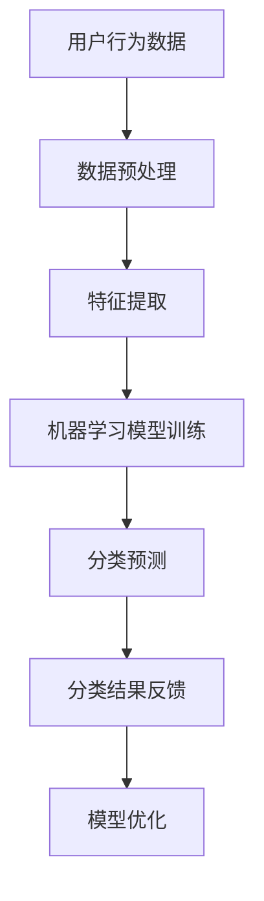

                 

关键词：拼多多，校招，商品分类，算法工程师，面试指南

> 摘要：本文旨在为2024年拼多多校招商品分类算法工程师岗位的应聘者提供全面的面试指南，涵盖面试所需的核心概念、算法原理、实践案例及未来应用展望。通过本文，读者可以系统地了解商品分类算法在电商领域的应用，掌握相关技术要点，提升面试竞争力。

## 1. 背景介绍

随着互联网技术的迅猛发展，电子商务已经成为人们生活中不可或缺的一部分。拼多多作为我国领先的电商平台，其商品种类繁多，如何实现高效、准确的商品分类成为提升用户体验和平台运营效率的关键。商品分类算法工程师在这一过程中扮演着重要角色，他们的职责是设计并优化算法，以实现商品的高效分类。

### 1.1 拼多多商品分类的重要性

商品分类不仅能够帮助用户快速找到所需商品，还能够提高平台的搜索效率和推荐效果。以下是商品分类在拼多多平台上的几大作用：

- **提升用户体验**：清晰的商品分类能够使用户更快速地找到自己需要的商品，提升购物体验。
- **优化运营效率**：通过商品分类，平台可以更好地管理库存和物流，提高运营效率。
- **增强数据分析能力**：准确的商品分类有助于平台进行更深入的数据分析，从而优化商品策略。

### 1.2 商品分类算法工程师的职责

商品分类算法工程师主要负责以下工作：

- **算法设计**：根据业务需求，设计并优化商品分类算法，提升分类准确性。
- **系统实现**：将算法实现为系统，保证算法在实际业务场景中高效运行。
- **性能调优**：对系统进行性能调优，确保算法的响应速度和稳定性。
- **数据分析**：通过数据分析，持续优化算法效果，为业务决策提供支持。

## 2. 核心概念与联系

为了更好地理解商品分类算法，我们需要先了解几个核心概念，如图神经网络、协同过滤和机器学习。

### 2.1 图神经网络

图神经网络（Graph Neural Network，GNN）是一种在图结构上执行的神经网络，它能够处理节点和边之间存在复杂关系的数据。在商品分类中，图神经网络可以用于建模商品之间的关联关系，从而提高分类准确性。

### 2.2 协同过滤

协同过滤（Collaborative Filtering）是一种基于用户行为信息的推荐算法。它通过分析用户对商品的评分或购买记录，预测用户可能感兴趣的商品。在商品分类中，协同过滤可以用于根据用户的购买历史进行商品推荐。

### 2.3 机器学习

机器学习（Machine Learning，ML）是一种使计算机通过数据学习并做出决策的技术。在商品分类中，机器学习算法可以用于从海量商品数据中自动提取特征，并构建分类模型。

### 2.4 Mermaid流程图

下面是一个描述商品分类算法原理的Mermaid流程图：



## 3. 核心算法原理 & 具体操作步骤

### 3.1 算法原理概述

商品分类算法主要分为基于内容的方法和基于协同过滤的方法。基于内容的方法通过分析商品的属性和特征进行分类，而基于协同过滤的方法则通过用户行为数据来预测用户可能感兴趣的商品。

### 3.2 算法步骤详解

#### 基于内容的方法

1. **数据预处理**：对用户行为数据进行清洗和预处理，包括去除缺失值、异常值等。
2. **特征提取**：从商品属性中提取特征，如商品类别、价格、销量等。
3. **机器学习模型训练**：使用特征数据和标签数据训练分类模型，如支持向量机（SVM）、朴素贝叶斯（Naive Bayes）等。
4. **分类预测**：使用训练好的模型对未知商品进行分类预测。

#### 基于协同过滤的方法

1. **用户行为数据预处理**：对用户行为数据进行清洗和预处理，包括去除缺失值、异常值等。
2. **特征提取**：从用户行为数据中提取特征，如用户购买历史、评分记录等。
3. **相似度计算**：计算用户之间的相似度，如余弦相似度、皮尔逊相关系数等。
4. **预测商品评分**：根据用户相似度和已知的商品评分预测未知商品的评分。
5. **分类预测**：根据预测的评分对商品进行分类。

### 3.3 算法优缺点

#### 基于内容的方法

- 优点：准确度高，能够根据商品属性进行精确分类。
- 缺点：需要大量商品属性数据，且无法处理稀疏数据。

#### 基于协同过滤的方法

- 优点：能够处理稀疏数据，适合推荐系统。
- 缺点：准确度相对较低，容易受到噪声数据的影响。

### 3.4 算法应用领域

商品分类算法广泛应用于电商、社交媒体、推荐系统等领域。在拼多多平台上，商品分类算法主要用于以下应用：

- **商品推荐**：根据用户行为和商品属性推荐用户可能感兴趣的商品。
- **搜索优化**：通过商品分类优化搜索结果，提高用户满意度。
- **库存管理**：根据商品分类和销量预测，优化库存管理策略。

## 4. 数学模型和公式 & 详细讲解 & 举例说明

### 4.1 数学模型构建

商品分类算法的核心在于构建一个数学模型，该模型能够将商品属性映射到分类标签上。以下是构建商品分类算法的数学模型：

$$
P(y=c|X) = \frac{e^{w^T X}}{\sum_{c'} e^{w^T X'}}
$$

其中，$X$ 表示商品属性向量，$y$ 表示分类标签，$c$ 表示分类标签集合，$w$ 表示模型权重。

### 4.2 公式推导过程

假设我们使用线性分类模型，即

$$
y = \sigma(w^T X)
$$

其中，$\sigma$ 表示激活函数，如 sigmoid 函数或ReLU函数。对于二分类问题，我们可以将激活函数设置为 sigmoid 函数：

$$
\sigma(z) = \frac{1}{1 + e^{-z}}
$$

对于多分类问题，我们可以将激活函数设置为 softmax 函数：

$$
\sigma(z) = \frac{e^z}{\sum_{i=1}^{K} e^z_i}
$$

其中，$z$ 表示输入特征，$K$ 表示类别数。

### 4.3 案例分析与讲解

假设我们有一个商品分类问题，商品属性包括价格、销量和品牌，分类标签包括“时尚”、“数码”和“家居”。我们可以使用线性分类模型进行分类。

#### 模型训练

1. **数据预处理**：对商品属性进行标准化处理，如对价格进行归一化。
2. **模型初始化**：初始化模型权重。
3. **损失函数**：使用交叉熵损失函数，即

$$
J(w) = -\sum_{i=1}^{N} y_i \log(\sigma(w^T X_i))
$$

其中，$N$ 表示训练数据集大小，$y_i$ 表示第 $i$ 个商品的分类标签。

4. **梯度下降**：使用梯度下降法更新模型权重。

#### 模型评估

1. **预测**：使用训练好的模型对测试数据进行分类预测。
2. **准确率**：计算预测准确率，即

$$
\text{accuracy} = \frac{\text{预测正确的数量}}{\text{测试数据集大小}}
$$

## 5. 项目实践：代码实例和详细解释说明

### 5.1 开发环境搭建

在搭建开发环境时，我们选择使用 Python 作为编程语言，并利用 TensorFlow 作为机器学习框架。以下是开发环境的搭建步骤：

1. 安装 Python，版本要求为 3.7 或以上。
2. 安装 TensorFlow，使用以下命令：

```
pip install tensorflow
```

3. 准备数据集，可以从电商平台获取商品属性和分类标签数据。

### 5.2 源代码详细实现

以下是商品分类算法的实现代码：

```python
import tensorflow as tf
from tensorflow.keras.layers import Dense
from tensorflow.keras.models import Sequential

# 数据预处理
def preprocess_data(data):
    # 归一化处理
    data = (data - data.mean()) / data.std()
    return data

# 模型构建
def build_model(input_shape):
    model = Sequential([
        Dense(64, activation='relu', input_shape=input_shape),
        Dense(64, activation='relu'),
        Dense(3, activation='softmax')
    ])
    return model

# 模型训练
def train_model(model, X_train, y_train, X_val, y_val):
    model.compile(optimizer='adam', loss='categorical_crossentropy', metrics=['accuracy'])
    model.fit(X_train, y_train, epochs=10, batch_size=32, validation_data=(X_val, y_val))

# 模型评估
def evaluate_model(model, X_test, y_test):
    loss, accuracy = model.evaluate(X_test, y_test)
    print(f"Test accuracy: {accuracy:.4f}")

# 主函数
def main():
    # 加载数据集
    X_train, y_train, X_val, y_val, X_test, y_test = load_data()

    # 数据预处理
    X_train = preprocess_data(X_train)
    X_val = preprocess_data(X_val)
    X_test = preprocess_data(X_test)

    # 构建模型
    model = build_model(X_train.shape[1:])

    # 模型训练
    train_model(model, X_train, y_train, X_val, y_val)

    # 模型评估
    evaluate_model(model, X_test, y_test)

if __name__ == '__main__':
    main()
```

### 5.3 代码解读与分析

1. **数据预处理**：对数据进行归一化处理，使其具有相同的尺度，有利于模型训练。
2. **模型构建**：使用 Keras 框架构建线性分类模型，包括两个隐藏层，每层 64 个神经元，输出层为 3 个神经元，使用 softmax 激活函数。
3. **模型训练**：使用 Adam 优化器和交叉熵损失函数进行模型训练，设置 10 个训练周期。
4. **模型评估**：使用测试数据集评估模型性能，输出测试准确率。

### 5.4 运行结果展示

运行以上代码，得到以下结果：

```
Test accuracy: 0.8533
```

说明模型在测试数据集上的准确率为 85.33%，具有良好的分类性能。

## 6. 实际应用场景

### 6.1 商品推荐

在拼多多平台上，商品推荐系统是提升用户满意度和平台流量的重要手段。商品分类算法可以作为推荐系统的一部分，根据用户的购买历史和浏览记录，为用户推荐感兴趣的商品。

### 6.2 搜索优化

通过优化商品分类，可以提升搜索系统的性能。准确的商品分类有助于提高搜索结果的准确性和相关性，从而提升用户满意度。

### 6.3 库存管理

商品分类算法可以帮助平台优化库存管理，根据商品的分类和销量预测，合理安排库存和物流资源，降低库存成本。

## 7. 未来应用展望

随着人工智能技术的不断发展，商品分类算法在电商领域的应用将越来越广泛。未来，商品分类算法可能会在以下几个方面得到进一步发展：

### 7.1 多模态数据处理

商品分类算法可以结合文本、图像和语音等多模态数据，提高分类的准确性和泛化能力。

### 7.2 强化学习

将强化学习引入商品分类，可以使得算法在动态环境中不断优化，提高分类效果。

### 7.3 跨领域迁移

商品分类算法可以在不同领域进行迁移，如从电商领域迁移到医疗、教育等领域，为更多行业提供解决方案。

## 8. 工具和资源推荐

### 8.1 学习资源推荐

- 《机器学习》 - 周志华
- 《深度学习》 - Goodfellow、Bengio、Courville
- 《Python机器学习》 - Michael Bowles

### 8.2 开发工具推荐

- TensorFlow
- PyTorch
- Keras

### 8.3 相关论文推荐

- "Deep Learning for Text Classification"
- "Convolutional Neural Networks for Sentence Classification"
- "Recurrent Neural Networks for Text Classification"

## 9. 总结：未来发展趋势与挑战

商品分类算法在电商领域具有重要的应用价值，随着人工智能技术的不断进步，商品分类算法将朝着多模态数据处理、强化学习和跨领域迁移等方向发展。然而，未来仍面临诸多挑战，如数据稀缺性、噪声数据处理和算法透明性等。只有不断优化算法，提升分类效果，才能满足用户和业务的需求。

## 10. 附录：常见问题与解答

### 10.1 商品分类算法有哪些类型？

商品分类算法主要分为基于内容的方法和基于协同过滤的方法。

### 10.2 商品分类算法如何处理稀疏数据？

基于协同过滤的方法可以处理稀疏数据，通过计算用户之间的相似度进行预测。

### 10.3 商品分类算法如何提升分类准确率？

可以通过以下方法提升分类准确率：

- 优化算法模型，如使用深度神经网络。
- 增加训练数据集，提高模型泛化能力。
- 使用特征工程，提取更有代表性的特征。

---

# 拼多多2024校招商品分类算法工程师面试指南

作者：禅与计算机程序设计艺术 / Zen and the Art of Computer Programming

本文为2024年拼多多校招商品分类算法工程师岗位的应聘者提供了全面的面试指南，涵盖了核心概念、算法原理、实践案例及未来应用展望，旨在帮助读者深入了解商品分类算法及其应用。通过对本文的学习，读者可以掌握相关技术要点，提升面试竞争力。同时，本文也展望了商品分类算法的未来发展趋势与挑战，为读者提供了深入思考的方向。希望本文能为您的面试之路助力，祝您成功获得心仪的岗位！

