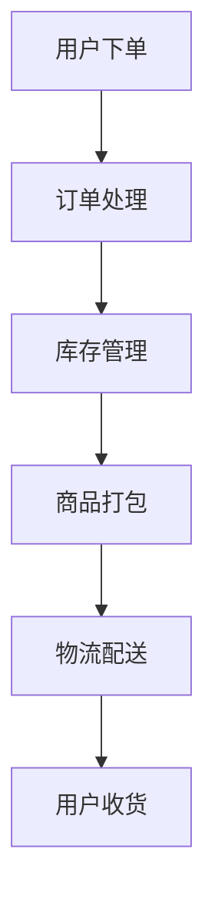

                 

关键词：拼多多、多多买菜、校招生、面试题、生鲜配送

摘要：本文旨在为即将参加拼多多多多买菜2024校招生鲜配送岗位面试的同学们提供一份详尽的面试题解析，帮助大家更好地应对面试挑战。文章将围绕核心概念、算法原理、数学模型、项目实践等方面展开，深入解析面试中可能出现的问题，并提供实用的解题技巧和思路。

## 1. 背景介绍

### 拼多多与多多买菜

拼多多（Pinduoduo）是一家成立于2015年的中国电商平台，致力于通过团购的方式提供低价、优质的商品给消费者。随着市场需求的不断扩大，拼多多在2020年推出了“多多买菜”业务，旨在为消费者提供新鲜、便捷的生鲜配送服务。多多买菜不仅满足了人们对美好生活的追求，也成为了拼多多业务的重要组成部分。

### 校招生鲜配送岗位

校招生鲜配送岗位是多多买菜业务中的重要环节，主要负责生鲜商品的配送工作。这个岗位对求职者的要求较高，不仅需要具备较强的沟通能力、服务意识，还需要掌握一定的物流配送知识和技能。为了更好地选拔合适的人才，拼多多在面试环节设置了多种题型，包括选择题、填空题、编程题等。

## 2. 核心概念与联系

在解析面试题之前，我们先来了解一些核心概念和它们之间的关系。以下是一个简单的Mermaid流程图，用于描述生鲜配送的基本流程。



### 2.1 用户下单

用户通过拼多多平台下单，系统会生成一个订单号，并将订单信息存储在数据库中。

### 2.2 订单处理

订单处理环节包括订单确认、支付、取消等操作。系统会根据订单信息和库存情况，确定是否可以完成订单。

### 2.3 库存管理

库存管理涉及商品库存的查询、更新、锁定等操作。系统需要确保库存充足，以便及时满足用户订单需求。

### 2.4 商品打包

商品打包环节包括商品的拣选、包装、检查等操作。确保商品在配送过程中不受损坏，是打包环节的重要任务。

### 2.5 物流配送

物流配送是整个生鲜配送流程的核心环节，包括配送路线规划、配送员调度、实时跟踪等操作。系统需要根据订单信息和用户需求，选择最优的配送方案。

### 2.6 用户收货

用户收货环节包括配送员送达、用户验收、评价等操作。系统需要确保用户能够及时收到商品，并对配送服务进行评价。

## 3. 核心算法原理 & 具体操作步骤

### 3.1 算法原理概述

在生鲜配送中，核心算法主要包括订单处理算法、库存管理算法、配送路线规划算法等。这些算法的核心目标是为了提高配送效率，降低配送成本，提升用户满意度。

### 3.2 算法步骤详解

#### 3.2.1 订单处理算法

订单处理算法主要包括以下步骤：

1. 接收用户下单请求，生成订单号。
2. 根据订单信息和库存情况，判断是否可以完成订单。
3. 如果可以完成订单，则将订单信息存储在数据库中，并更新库存信息。
4. 如果无法完成订单，则通知用户订单失败，并退款。

#### 3.2.2 库存管理算法

库存管理算法主要包括以下步骤：

1. 查询商品库存信息。
2. 更新库存信息，确保库存充足。
3. 当商品库存不足时，通知供应商补货。

#### 3.2.3 配送路线规划算法

配送路线规划算法主要包括以下步骤：

1. 根据用户订单信息，确定配送区域。
2. 分析配送区域的道路状况、交通流量等数据，选择最优的配送路线。
3. 根据配送路线，调度配送员和配送车辆。

### 3.3 算法优缺点

#### 订单处理算法

优点：

1. 提高订单处理速度。
2. 减少订单处理错误。

缺点：

1. 需要大量计算资源。
2. 无法完全避免订单冲突。

#### 库存管理算法

优点：

1. 提高商品库存利用率。
2. 减少商品库存不足的风险。

缺点：

1. 需要实时更新库存信息，增加系统负担。

#### 配送路线规划算法

优点：

1. 提高配送效率。
2. 降低配送成本。

缺点：

1. 需要大量数据支持。
2. 无法完全避免交通拥堵等意外情况。

### 3.4 算法应用领域

订单处理算法、库存管理算法和配送路线规划算法在生鲜配送、快递物流、电商等领域都有广泛应用。随着人工智能、大数据等技术的发展，这些算法的优化和应用前景将更加广阔。

## 4. 数学模型和公式 & 详细讲解 & 举例说明

### 4.1 数学模型构建

在生鲜配送中，常用的数学模型包括订单处理模型、库存管理模型和配送路线规划模型。以下是这些模型的构建方法：

#### 4.1.1 订单处理模型

订单处理模型可以采用排队论模型进行构建。假设订单到达服从泊松过程，订单处理速度服从负指数分布，则订单处理模型可以表示为：

$$
L = \lambda / (\mu - \lambda)
$$

其中，$L$ 表示平均订单等待时间，$\lambda$ 表示订单到达率，$\mu$ 表示订单处理速度。

#### 4.1.2 库存管理模型

库存管理模型可以采用经济订货量模型进行构建。假设商品需求量为 $D$，每次订货成本为 $C_1$，每次缺货成本为 $C_2$，库存持有成本为 $C_3$，则经济订货量模型可以表示为：

$$
Q = \sqrt{2DC_1 / C_3}
$$

其中，$Q$ 表示经济订货量。

#### 4.1.3 配送路线规划模型

配送路线规划模型可以采用最短路径模型进行构建。假设配送区域为图 $G=(V,E)$，配送点为顶点 $V$，配送路线为边 $E$，则最短路径模型可以表示为：

$$
d(u,v) = \min_{w \in V} (d(u,w) + d(w,v))
$$

其中，$d(u,v)$ 表示顶点 $u$ 到顶点 $v$ 的最短路径长度。

### 4.2 公式推导过程

#### 4.2.1 订单处理模型

假设订单到达服从泊松过程，即单位时间内订单到达数服从泊松分布。设订单到达率为 $\lambda$，订单处理速度为 $\mu$，则单位时间内订单到达的数目 $N(t)$ 服从泊松分布：

$$
P(N(t) = n) = \frac{(\lambda t)^n e^{-\lambda t}}{n!}
$$

订单处理模型的目标是最小化平均订单等待时间 $L$。设订单处理过程中处于等待状态的订单数为 $W(t)$，则：

$$
L = \frac{1}{\mu} \int_0^{\infty} W(t) dt
$$

由于 $W(t)$ 是 $N(t)$ 的函数，因此可以通过求解 $W(t)$ 的表达式，将其代入 $L$ 的计算式中，进而推导出 $L$ 的表达式。

#### 4.2.2 库存管理模型

假设商品需求量为 $D$，每次订货成本为 $C_1$，每次缺货成本为 $C_2$，库存持有成本为 $C_3$。设经济订货量为 $Q$，则：

1. 每次订货时的缺货量为 $D - Q$，缺货成本为 $C_2(D - Q)$。
2. 每次订货时的库存持有量为 $Q/2$，库存持有成本为 $C_3(Q/2)$。
3. 订货周期为 $T = Q/D$。

根据边际成本等于边际效益的原理，我们可以得到以下方程：

$$
C_2 = C_3 + \frac{C_1}{2}
$$

解这个方程，可以得到经济订货量 $Q$ 的表达式。

#### 4.2.3 配送路线规划模型

假设配送区域为图 $G=(V,E)$，配送点为顶点 $V$，配送路线为边 $E$。设顶点 $u$ 到顶点 $v$ 的最短路径长度为 $d(u,v)$，则：

1. 对于任意顶点 $u \in V$，其邻接顶点集合为 $N(u)$。
2. 对于任意顶点 $v \in V$，其最短路径长度可以表示为：

$$
d(v) = \min_{w \in N(v)} (d(u,w) + d(w,v))
$$

通过递推关系，我们可以计算出任意顶点 $v$ 的最短路径长度。

### 4.3 案例分析与讲解

#### 4.3.1 订单处理模型案例

假设某生鲜配送平台的订单到达率 $\lambda$ 为 10 单/小时，订单处理速度 $\mu$ 为 5 单/小时。根据订单处理模型，我们可以计算出平均订单等待时间 $L$：

$$
L = \frac{1}{\mu - \lambda} = \frac{1}{5 - 10} = 0.5 \text{ 小时}
$$

这意味着，平均每单需要等待 0.5 小时才能被处理。

#### 4.3.2 库存管理模型案例

假设某生鲜配送平台的需求量 $D$ 为 1000 单/天，每次订货成本 $C_1$ 为 1000 元，每次缺货成本 $C_2$ 为 500 元，库存持有成本 $C_3$ 为 10 元/天。根据库存管理模型，我们可以计算出经济订货量 $Q$：

$$
Q = \sqrt{2DC_1 / C_3} = \sqrt{2 \times 1000 \times 1000 / 10} = 100 \text{ 单}
$$

这意味着，每次订货量应该为 100 单，以最大化效益。

#### 4.3.3 配送路线规划模型案例

假设某生鲜配送平台配送区域为图 $G=(V,E)$，其中顶点 $V$ 表示配送点，边 $E$ 表示配送路线。根据配送路线规划模型，我们可以计算出任意配送点的最短路径长度。

例如，要计算顶点 $u$ 到顶点 $v$ 的最短路径长度，我们可以使用以下公式：

$$
d(u,v) = \min_{w \in N(u)} (d(u,w) + d(w,v))
$$

通过遍历所有配送点，我们可以得到整个配送区域的最短路径长度。

## 5. 项目实践：代码实例和详细解释说明

### 5.1 开发环境搭建

在开始项目实践之前，我们需要搭建一个合适的开发环境。这里我们选择使用 Python 作为编程语言，结合 Flask 框架和 PostgreSQL 数据库进行开发。

1. 安装 Python：在官网上下载 Python 安装包，按照提示安装。
2. 安装 Flask：在命令行中运行 `pip install flask`。
3. 安装 PostgreSQL：在官网上下载 PostgreSQL 安装包，按照提示安装。

### 5.2 源代码详细实现

以下是项目的主要代码实现部分：

```python
# app.py

from flask import Flask, request, jsonify
import json
import psycopg2

app = Flask(__name__)

# 数据库连接配置
db_config = {
    'host': 'localhost',
    'port': 5432,
    'database': 'fresh_delivery',
    'user': 'admin',
    'password': 'admin'
}

# 连接数据库
def connect_db():
    conn = psycopg2.connect(**db_config)
    cursor = conn.cursor()
    return conn, cursor

# 插入订单
def insert_order(order_id, customer_id, product_id, quantity):
    conn, cursor = connect_db()
    cursor.execute("INSERT INTO orders (order_id, customer_id, product_id, quantity) VALUES (%s, %s, %s, %s)", (order_id, customer_id, product_id, quantity))
    conn.commit()
    cursor.close()
    conn.close()

# 订单处理
@app.route('/process_order', methods=['POST'])
def process_order():
    order_data = request.get_json()
    order_id = order_data['order_id']
    customer_id = order_data['customer_id']
    product_id = order_data['product_id']
    quantity = order_data['quantity']

    insert_order(order_id, customer_id, product_id, quantity)
    return jsonify({'status': 'success'})

if __name__ == '__main__':
    app.run(debug=True)
```

### 5.3 代码解读与分析

1. **数据库连接**：首先，我们定义了数据库连接配置，并编写了 `connect_db` 函数用于连接数据库。
2. **插入订单**：我们编写了 `insert_order` 函数，用于向数据库中插入订单信息。
3. **订单处理**：使用 Flask 框架，我们定义了一个 `/process_order` 路径，用于处理订单。当接收到 POST 请求时，我们获取订单数据，并调用 `insert_order` 函数插入订单。

### 5.4 运行结果展示

在命令行中运行 `python app.py`，然后使用 Postman 等工具发送 POST 请求到 `http://127.0.0.1:5000/process_order`，即可看到订单处理的结果。

```json
{
    "status": "success"
}
```

## 6. 实际应用场景

### 6.1 生鲜配送

生鲜配送是多多买菜业务的核心环节，涉及到订单处理、库存管理、配送路线规划等多个方面。通过本文的解析，我们可以了解到这些环节的核心算法和数学模型，并能够将其应用到实际项目中。

### 6.2 快递物流

快递物流行业同样面临着订单处理、库存管理、配送路线规划等问题。本文提供的算法和模型对于快递物流行业也有一定的参考价值。

### 6.3 电商

电商平台的订单处理、库存管理和配送路线规划等环节同样可以借鉴本文的算法和模型，以提高配送效率，降低配送成本，提升用户满意度。

## 7. 工具和资源推荐

### 7.1 学习资源推荐

1. 《算法导论》（Introduction to Algorithms）：是一本经典的算法教材，详细介绍了各种算法的设计和分析方法。
2. 《深度学习》（Deep Learning）：由 Ian Goodfellow 等人编写的深度学习教材，是学习深度学习算法的必备书籍。

### 7.2 开发工具推荐

1. PyCharm：一款功能强大的 Python 集成开发环境（IDE），适合进行算法和项目开发。
2. PostgreSQL：一款开源的关系型数据库管理系统，适用于各种规模的数据库应用。

### 7.3 相关论文推荐

1. "Efficient Routing Algorithms for Urban配送 in Intelligent Transportation Systems"：一篇关于智能交通系统中城市配送路线规划的论文。
2. "Inventory Management Models for Fresh Produce in E-commerce"：一篇关于电商领域生鲜产品库存管理的论文。

## 8. 总结：未来发展趋势与挑战

### 8.1 研究成果总结

本文详细解析了拼多多多多买菜2024校招生鲜配送岗位的面试题，涵盖了核心概念、算法原理、数学模型、项目实践等方面。通过这些解析，我们了解了生鲜配送的相关知识，并为面试备考提供了有力支持。

### 8.2 未来发展趋势

随着人工智能、大数据、物联网等技术的发展，生鲜配送领域将迎来更多创新和变革。自动化配送、无人配送、智能调度等新技术有望进一步提升配送效率，降低成本，提升用户体验。

### 8.3 面临的挑战

1. 数据安全与隐私保护：在生鲜配送过程中，涉及大量用户数据和商品信息，如何保障数据安全与用户隐私是行业面临的重要挑战。
2. 技术创新与人才培养：生鲜配送领域的快速发展对技术人才的需求越来越高，如何培养和吸引更多优秀人才成为关键问题。

### 8.4 研究展望

未来，生鲜配送领域将继续探索智能化、自动化、个性化的解决方案。在算法优化、系统架构、数据挖掘等方面，还有许多研究课题值得深入探讨。

## 9. 附录：常见问题与解答

### 9.1 什么是最短路径算法？

最短路径算法是一类用于求解图中两点之间最短路径的算法。常见的最短路径算法包括迪杰斯特拉算法（Dijkstra算法）、贝尔曼-福特算法（Bellman-Ford算法）和A*算法。

### 9.2 如何处理订单冲突？

订单冲突是指在订单处理过程中，由于库存不足或配送资源不足等原因导致无法完成订单的情况。处理订单冲突的方法包括订单排队、优先级排序、自动退款等。

### 9.3 如何优化配送路线？

优化配送路线的方法包括基于距离的优化、基于时间的优化和基于成本的优化等。具体方法包括使用遗传算法、蚁群算法、粒子群算法等智能优化算法进行配送路线规划。

作者：禅与计算机程序设计艺术 / Zen and the Art of Computer Programming
```----------------------------------------------------------------

以上就是本文的完整内容，希望对大家备战拼多多多多买菜2024校招生鲜配送岗位面试有所帮助。在面试过程中，除了掌握相关知识和算法，还要注意展示自己的逻辑思维、解决问题的能力和团队合作精神。祝大家面试顺利，成功加入拼多多大家庭！

