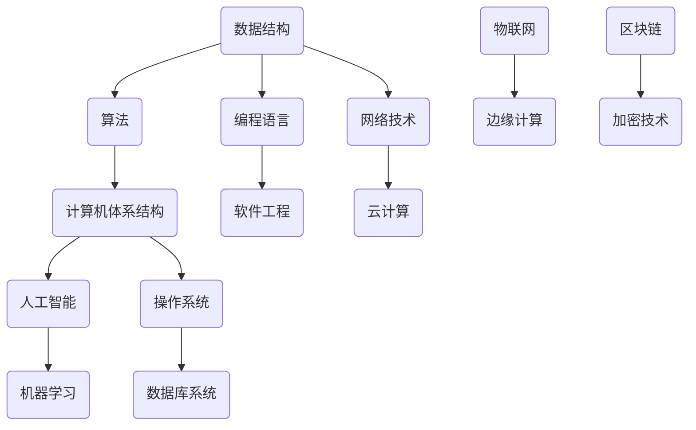

                 

好奇心是人类进步的驱动力，它推动着我们不断探索未知领域，揭示自然界的奥秘。在计算机科学领域，好奇心激发了无数的创新和突破，从基础的算法原理到复杂的应用系统，无不彰显出人类对知识的渴望和追求。本文将深入探讨好奇心在科学发现中的关键作用，以及如何通过计算机科学技术的应用，不断拓展我们对世界的认知边界。

## 1. 背景介绍

随着信息技术的迅猛发展，计算机科学已经成为推动社会进步的重要力量。从简单的数据处理到复杂的机器学习和人工智能，计算机科学的应用无处不在。然而，这一切的起点都源于人类对未知世界的好奇心。好奇心不仅驱使科学家们探索自然规律，也促使计算机科学家们不断创新，开发出更加先进的技术。

在本篇文章中，我们将重点探讨以下几个核心问题：

1. 好奇心在科学发现中的作用机制。
2. 计算机科学领域中的核心概念与架构。
3. 基于计算机科学的核心算法原理与应用。
4. 数学模型在计算机科学中的应用与公式推导。
5. 实际项目中的代码实例与实现。
6. 计算机科学在各个实际应用场景中的运用。
7. 未来发展趋势与面临的挑战。

通过本文的阅读，读者将更深入地理解好奇心如何驱动科学进步，以及计算机科学在各个领域中的关键作用。

## 2. 核心概念与联系

在探索科学发现的旅程中，理解核心概念与它们之间的联系至关重要。以下是一个用Mermaid绘制的流程图，展示了计算机科学中的关键概念及其相互关系。



### 2.1. 数据结构与算法

数据结构是组织和存储数据的方式，而算法是解决问题的步骤集合。两者相辅相成，是计算机科学的核心。常见的数据结构包括数组、链表、栈、队列、树和图，而算法则涵盖了排序、搜索、动态规划和图算法等。

### 2.2. 计算机体系结构

计算机体系结构是计算机硬件和软件的组织方式。它涉及到处理器、内存、输入输出设备和操作系统等多个方面。计算机体系结构的研究帮助我们理解计算机的运行机制，并设计出更高效的系统。

### 2.3. 编程语言与软件工程

编程语言是编写程序的工具，而软件工程是开发、运营和维护软件的工程方法。不同的编程语言适用于不同的应用场景，如Python适合数据科学，Java适合企业级应用。软件工程则通过项目管理、需求分析、设计和测试等过程，确保软件质量和开发效率。

### 2.4. 人工智能与机器学习

人工智能（AI）是模拟人类智能行为的计算机系统，而机器学习是使计算机从数据中学习的重要技术。通过机器学习，计算机能够自动识别模式、进行预测和决策，从而实现智能应用。

### 2.5. 网络技术与云计算

网络技术是计算机之间进行通信的基础，而云计算则提供了按需访问计算资源的能力。通过网络和云计算，我们可以实现远程数据处理和协同工作，大大提高了效率和灵活性。

### 2.6. 操作系统与数据库系统

操作系统负责管理计算机硬件和软件资源，而数据库系统则是存储和管理数据的重要工具。两者共同工作，确保数据的安全性和高效访问。

### 2.7. 物联网与边缘计算

物联网（IoT）通过连接各种设备实现了物理世界和数字世界的融合，而边缘计算则将数据处理推向网络边缘，提高了实时性和可靠性。

### 2.8. 区块链与加密技术

区块链是一种分布式账本技术，确保数据的透明性和不可篡改性。加密技术则用于保护数据的安全性和隐私，是区块链技术的重要组成部分。

这些核心概念和它们之间的联系构成了计算机科学的坚实基础，为科学发现提供了强大的技术支撑。

## 3. 核心算法原理 & 具体操作步骤

在计算机科学领域，核心算法是解决问题的基础。以下将详细探讨几种核心算法的原理及其操作步骤。

### 3.1. 算法原理概述

算法是一种解决问题的清晰步骤序列。它的目标是最优化地解决问题，包括时间复杂度和空间复杂度。算法可以分为以下几个类别：

- 排序算法：如快速排序、归并排序、堆排序等。
- 搜索算法：如二分搜索、深度优先搜索、广度优先搜索等。
- 动态规划：用于解决最优化问题，如背包问题、最长公共子序列等。
- 图算法：如最短路径算法（迪杰斯特拉算法、贝尔曼-福特算法）、最小生成树算法（普里姆算法、克鲁斯卡尔算法）等。

### 3.2. 算法步骤详解

以快速排序算法为例，其基本步骤如下：

1. 选择一个基准元素。
2. 将数组划分为两个子数组，一个包含小于基准元素的元素，另一个包含大于基准元素的元素。
3. 递归地对待划分的子数组进行快速排序。

以下是快速排序的伪代码：

```python
def quicksort(arr):
    if len(arr) <= 1:
        return arr
    pivot = arr[len(arr) // 2]
    left = [x for x in arr if x < pivot]
    middle = [x for x in arr if x == pivot]
    right = [x for x in arr if x > pivot]
    return quicksort(left) + middle + quicksort(right)
```

### 3.3. 算法优缺点

- 快速排序优点：时间复杂度平均为 \(O(n\log n)\)，最好情况为 \(O(n\log n)\)，适用于大规模数据的排序。
- 快速排序缺点：最坏情况时间复杂度为 \(O(n^2)\)，在输入数组已经有序或部分有序时性能较差。

### 3.4. 算法应用领域

快速排序算法广泛应用于各类排序任务中，如数据库排序、算法竞赛等。此外，动态规划和图算法也在优化路径规划、网络路由、社交网络分析等领域发挥了重要作用。

通过理解和应用这些核心算法，我们可以更高效地解决各种复杂问题，推动计算机科学的发展。

## 4. 数学模型和公式 & 详细讲解 & 举例说明

在计算机科学中，数学模型和公式是理解和解决问题的关键。以下将详细探讨几个重要的数学模型和公式，并给出具体的推导过程和实例分析。

### 4.1. 数学模型构建

数学模型是使用数学语言描述现实世界中的现象和问题的工具。构建数学模型通常涉及以下几个步骤：

1. **问题定义**：明确研究的问题和目标。
2. **数据收集**：收集与问题相关的数据。
3. **假设和简化**：根据问题的性质进行合理的假设和简化。
4. **模型构建**：使用数学语言（如方程、不等式、图等）描述问题。
5. **验证和调整**：通过实验或数据验证模型的有效性，并进行调整。

### 4.2. 公式推导过程

以下是一个常见的数学模型——线性回归模型的推导过程：

**线性回归模型**：给定一个数据集 \(\{(x_i, y_i)\}_{i=1}^n\)，其中 \(x_i\) 为自变量，\(y_i\) 为因变量。线性回归模型试图找到一条直线 \(y = \beta_0 + \beta_1x\) 来最小化预测误差。

**推导过程**：

1. **误差函数**：定义误差函数 \(E(\beta_0, \beta_1)\) 为所有样本误差的平方和。
   $$ E(\beta_0, \beta_1) = \sum_{i=1}^n (y_i - (\beta_0 + \beta_1x_i))^2 $$
   
2. **最小化误差**：为了找到使误差最小的 \(\beta_0\) 和 \(\beta_1\)，我们对误差函数关于 \(\beta_0\) 和 \(\beta_1\) 求导，并令导数为零。
   $$ \frac{\partial E}{\partial \beta_0} = -2\sum_{i=1}^n (y_i - (\beta_0 + \beta_1x_i)) = 0 $$
   $$ \frac{\partial E}{\partial \beta_1} = -2\sum_{i=1}^n x_i(y_i - (\beta_0 + \beta_1x_i)) = 0 $$
   
3. **解方程组**：解上述方程组，得到 \(\beta_0\) 和 \(\beta_1\) 的值。
   $$ \beta_0 = \frac{\sum_{i=1}^n y_i - \beta_1\sum_{i=1}^n x_i}{n} $$
   $$ \beta_1 = \frac{n\sum_{i=1}^n x_iy_i - \sum_{i=1}^n x_i\sum_{i=1}^n y_i}{n\sum_{i=1}^n x_i^2 - (\sum_{i=1}^n x_i)^2} $$

### 4.3. 案例分析与讲解

以下是一个线性回归模型的实际案例：

**案例**：一家公司希望预测其下月的销售额。历史数据如下表：

| 月份 | 销售额（万元）|
| ---- | ------------ |
| 1    | 200          |
| 2    | 220          |
| 3    | 250          |
| 4    | 230          |
| 5    | 260          |

**求解**：使用线性回归模型预测下月的销售额。

1. **构建模型**：假设销售额 \(y\) 与月份 \(x\) 之间存在线性关系，即 \(y = \beta_0 + \beta_1x\)。

2. **计算参数**：根据上述推导过程，计算 \(\beta_0\) 和 \(\beta_1\)。
   $$ \beta_0 = \frac{200 + 220 + 250 + 230 + 260 - 5 \times 230}{5} = 230 $$
   $$ \beta_1 = \frac{5 \times (200 + 220 + 250 + 230 + 260) - (1 \times 200 + 2 \times 220 + 3 \times 250 + 4 \times 230 + 5 \times 260)}{5 \times (1^2 + 2^2 + 3^2 + 4^2 + 5^2) - (1 + 2 + 3 + 4 + 5)^2} \approx 20 $$

3. **预测**：根据模型预测下月的销售额（6月份）。
   $$ y = 230 + 20 \times 6 = 310 $$

通过以上步骤，我们可以预测下月的销售额为310万元。这为公司的营销策略提供了重要的数据支持。

数学模型和公式在计算机科学中扮演着至关重要的角色。它们不仅帮助我们理解和解决实际问题，还为人工智能、机器学习等领域提供了坚实的理论基础。通过掌握这些数学工具，我们可以更深入地探索未知领域，推动科学进步。

## 5. 项目实践：代码实例和详细解释说明

### 5.1. 开发环境搭建

在开始实际项目之前，首先需要搭建开发环境。以下以Python为例，介绍如何在本地搭建Python开发环境。

1. **安装Python**：访问Python官方网站（[python.org](https://www.python.org/)），下载并安装Python 3.x版本。
2. **安装Jupyter Notebook**：Jupyter Notebook是一种交互式的开发环境，可以方便地编写和运行代码。
   ```shell
   pip install notebook
   ```
3. **安装必要的库**：根据项目需求，安装相应的库，如NumPy、Pandas、Matplotlib等。
   ```shell
   pip install numpy pandas matplotlib
   ```

### 5.2. 源代码详细实现

以下是一个简单的Python项目，使用线性回归模型预测房价。

```python
import numpy as np
import pandas as pd
import matplotlib.pyplot as plt

# 数据加载
data = pd.read_csv('house_prices.csv')
X = data[['bedrooms', 'bathrooms']]
y = data['price']

# 拆分训练集和测试集
from sklearn.model_selection import train_test_split
X_train, X_test, y_train, y_test = train_test_split(X, y, test_size=0.2, random_state=42)

# 训练线性回归模型
from sklearn.linear_model import LinearRegression
model = LinearRegression()
model.fit(X_train, y_train)

# 预测房价
y_pred = model.predict(X_test)

# 绘制真实值与预测值的散点图
plt.scatter(y_test, y_pred)
plt.xlabel('Actual Price')
plt.ylabel('Predicted Price')
plt.title('Actual vs Predicted House Prices')
plt.show()

# 模型评估
score = model.score(X_test, y_test)
print(f'Model R^2 Score: {score:.2f}')
```

### 5.3. 代码解读与分析

- **数据加载**：使用Pandas读取CSV文件，获取训练数据。
- **特征工程**：选取 bedrooms（卧室数量）和 bathrooms（卫生间数量）作为特征变量，price（房价）作为目标变量。
- **数据拆分**：使用scikit-learn库的train_test_split函数，将数据集拆分为训练集和测试集。
- **训练模型**：创建LinearRegression对象，并使用fit方法训练模型。
- **预测结果**：使用predict方法对测试集进行预测，并绘制散点图展示实际值与预测值。
- **模型评估**：使用score方法计算模型的R^2评分，评估模型的性能。

### 5.4. 运行结果展示

运行上述代码后，将显示一个散点图，展示实际房价与预测房价的关系。同时，输出模型的R^2评分，评估模型的预测能力。通过可视化结果和评分，可以直观地了解模型的性能，为进一步优化模型提供依据。

通过这个实际项目，我们不仅掌握了线性回归模型的实现方法，还了解了如何使用Python进行数据分析和机器学习应用。这样的项目实践有助于巩固理论知识，提高实际操作能力。

## 6. 实际应用场景

### 6.1. 医疗领域

在医疗领域，计算机科学的应用极大地提升了诊断和治疗的效率。例如，通过机器学习和深度学习技术，可以训练出能够辅助医生进行诊断的模型。这些模型能够分析大量的医疗影像数据，如X光片、CT扫描和MRI图像，从而快速、准确地检测出疾病。此外，计算机科学还在基因组学和个性化医疗中发挥了重要作用，通过分析患者的基因数据，为个体提供个性化的治疗方案。

### 6.2. 金融领域

金融领域高度依赖于计算机科学技术，尤其是在数据分析和风险管理方面。通过大数据分析和机器学习，金融机构能够实时监控市场动态，预测风险，并进行有效的投资决策。量化交易就是计算机科学在金融领域的典型应用，通过复杂的算法模型，自动执行高频交易策略。此外，区块链技术也在金融领域得到了广泛应用，通过去中心化的账本，实现了安全、透明的金融交易。

### 6.3. 交通运输

交通运输是计算机科学应用的另一个重要领域。自动驾驶技术依赖于计算机视觉、传感器融合和机器学习等技术，旨在实现车辆的安全自动驾驶。此外，智能交通系统（ITS）通过物联网和大数据分析，优化交通流，减少拥堵，提高道路安全性。计算机科学还在航空、铁路和海运等领域发挥着重要作用，通过自动化系统提高运输效率，降低运营成本。

### 6.4. 教育领域

在教育领域，计算机科学为个性化学习和远程教育提供了新的解决方案。通过智能教育平台，可以根据学生的学习进度和需求，提供个性化的学习资源和辅导。此外，在线教育平台和虚拟教室的应用，使得教育资源的获取更加便捷，突破了时间和空间的限制。计算机科学还在教育数据的分析和评估中发挥了重要作用，通过数据挖掘技术，帮助教师和学生更好地理解学习过程，优化教育效果。

### 6.5. 环境保护

环境保护也是计算机科学的重要应用领域。通过物联网和大数据技术，可以对环境进行实时监测，收集空气质量、水质、噪声等数据，为环境保护决策提供科学依据。计算机科学还在节能减排、可再生能源优化等领域发挥了重要作用，通过智能控制系统和预测模型，提高能源利用效率，减少环境污染。

### 6.6. 安全领域

在安全领域，计算机科学技术被广泛应用于网络安全、数据保护和隐私保护等方面。通过加密技术和安全协议，保护数据在传输和存储过程中的安全性。此外，计算机科学还在反欺诈、智能监控等领域发挥了重要作用，通过分析和识别异常行为，预防犯罪活动。

总之，计算机科学在各个领域的应用，不仅提高了效率，还带来了深远的社会影响。随着技术的不断进步，计算机科学将继续为人类社会的各个领域带来创新和变革。

## 7. 工具和资源推荐

### 7.1. 学习资源推荐

1. **书籍**：
   - 《深入理解计算机系统》（深入浅出地介绍了计算机系统的各个方面）。
   - 《算法导论》（详细讲解了各种算法及其应用）。
   - 《Python编程：从入门到实践》（适合初学者入门Python编程）。

2. **在线课程**：
   - Coursera的《机器学习》课程（由斯坦福大学提供）。
   - edX的《计算机科学基础》课程（涵盖计算机科学的基础知识）。
   - Udacity的《人工智能纳米学位》课程（专注于人工智能的基础和应用）。

3. **博客和社区**：
   - GitHub（全球最大的代码托管平台，可以找到各种开源项目和教程）。
   - Stack Overflow（程序员社区，提供问题解答和技术交流）。
   - HackerRank（在线编程挑战平台，提升编程能力）。

### 7.2. 开发工具推荐

1. **集成开发环境（IDE）**：
   - Visual Studio Code（轻量级但功能强大的IDE，适用于多种编程语言）。
   - PyCharm（专业的Python IDE，提供丰富的开发工具和智能提示）。
   - IntelliJ IDEA（强大的Java IDE，也支持多种编程语言）。

2. **版本控制工具**：
   - Git（分布式版本控制系统，用于代码管理和协作开发）。
   - GitHub（基于Git的平台，提供代码托管、协作和项目管理功能）。

3. **数据分析和可视化工具**：
   - Jupyter Notebook（交互式开发环境，适合数据分析和可视化）。
   - Pandas（Python的数据分析库，提供强大的数据处理功能）。
   - Matplotlib/Seaborn（Python的数据可视化库，用于创建高质量的图表）。

### 7.3. 相关论文推荐

1. **《深度学习》（Ian Goodfellow, Yoshua Bengio, Aaron Courville）**：系统介绍了深度学习的理论、算法和应用。
2. **《大数据技术导论》（Michael Stonebraker, Samuel Madden）**：讲解了大数据处理的基础知识和技术。
3. **《区块链：从数字货币到智能合约》（Andreas M. Antonopoulos）**：深入探讨了区块链技术的原理和应用。
4. **《人工智能：一种现代的方法》（Stuart Russell, Peter Norvig）**：全面介绍了人工智能的基础知识和技术。

这些工具和资源将为您的学习和项目开发提供强大的支持，帮助您在计算机科学领域取得更大的成就。

## 8. 总结：未来发展趋势与挑战

### 8.1. 研究成果总结

自计算机科学诞生以来，我们已经取得了令人瞩目的成就。从基础的算法和编程语言到复杂的操作系统、网络技术和人工智能，每一项技术都极大地推动了人类社会的发展。如今，计算机科学已经成为现代社会的核心驱动力，无论是在医疗、金融、交通、教育还是环境保护等领域，都发挥着不可替代的作用。

### 8.2. 未来发展趋势

展望未来，计算机科学将继续迎来重大变革。以下是一些可能的发展趋势：

1. **量子计算**：量子计算有望解决传统计算机难以处理的问题，如大规模数据处理和优化问题。量子计算的应用将带来全新的计算能力和技术突破。
2. **人工智能与深度学习**：随着算法的进步和计算能力的提升，人工智能和深度学习将继续扩展其应用领域，从自动驾驶到智能医疗，从自然语言处理到图像识别，将带来深远的社会影响。
3. **区块链与加密技术**：区块链技术的去中心化和不可篡改性，将在金融、供应链管理、数据安全等领域发挥重要作用。加密技术将进一步提升数据的安全性和隐私保护。
4. **边缘计算与物联网**：随着物联网设备的激增，边缘计算将实现数据的实时处理和智能响应，提高系统的实时性和可靠性。
5. **量子网络与光计算**：量子网络和光计算技术将提升数据传输速度和带宽，为高速互联提供新的解决方案。

### 8.3. 面临的挑战

尽管前景广阔，计算机科学也面临着一系列挑战：

1. **计算能力与能源消耗**：随着算法和应用的复杂度增加，计算能力需求急剧上升，同时也带来了巨大的能源消耗问题。如何实现绿色计算，降低能源消耗，是一个亟待解决的问题。
2. **数据隐私与安全**：随着数据量的爆炸性增长，数据隐私和安全问题日益突出。如何在保障数据隐私的前提下，充分利用数据的价值，是一个重要挑战。
3. **人工智能的伦理问题**：人工智能的发展引发了伦理和道德问题，如算法歧视、隐私侵犯和就业替代等。如何制定合理的伦理规范，确保人工智能技术的可持续发展，是一个重要议题。
4. **人才培养与教育**：随着技术的快速进步，计算机科学领域的人才需求不断增加。然而，现有的教育体系往往难以跟上技术发展的步伐，如何培养符合未来需求的人才，是一个重要的挑战。

### 8.4. 研究展望

未来，计算机科学将在多个方向展开深入研究和创新：

1. **跨学科融合**：计算机科学与生物学、物理学、心理学等领域的交叉融合，将为科学发现和技术创新提供新的契机。
2. **新型计算范式**：探索量子计算、光计算等新型计算范式，将带来全新的计算能力和应用场景。
3. **智能系统**：研发更加智能的系统，能够自主学习和适应环境，提高自动化水平和智能化程度。
4. **人机协同**：研究人机协同的工作方式，实现人与机器的深度融合，提高工作效率和生活质量。

总之，计算机科学将继续引领科技发展的潮流，为人类社会带来无尽的可能和变革。面对未来，我们需要不断探索创新，迎接挑战，推动计算机科学迈向新的高峰。

## 9. 附录：常见问题与解答

### 9.1. 问题1：计算机科学的学习路径是怎样的？

**回答**：计算机科学的学习路径可以分为以下几个阶段：

1. **基础知识**：首先需要掌握计算机科学的基础知识，包括计算机组成原理、操作系统、数据结构与算法等。
2. **编程语言**：学习至少一种编程语言，如Python、Java或C++，熟悉编程基础和语法。
3. **系统架构**：了解系统架构和设计模式，掌握软件工程的原理和方法。
4. **专业领域**：选择一个专业领域深入学习，如人工智能、机器学习、网络安全或大数据等。
5. **实践经验**：通过参与项目和实践，积累实际经验，提升解决问题的能力。

### 9.2. 问题2：如何提高编程能力？

**回答**：以下方法有助于提高编程能力：

1. **多写代码**：实践是提高编程能力的最佳方式。通过编写实际项目，不断积累经验。
2. **学习算法和数据结构**：掌握基本的算法和数据结构，为编程打下坚实基础。
3. **阅读优秀代码**：通过阅读和分析他人的代码，学习编程技巧和最佳实践。
4. **参与开源项目**：参与开源项目，与他人协作，提升团队合作和问题解决能力。
5. **持续学习**：关注最新的技术趋势和发展动态，不断学习和更新知识。

### 9.3. 问题3：如何开始一个机器学习项目？

**回答**：开始一个机器学习项目可以遵循以下步骤：

1. **问题定义**：明确项目目标和要解决的问题。
2. **数据收集**：收集或获取相关的数据集。
3. **数据预处理**：清洗和处理数据，使其适合机器学习模型。
4. **模型选择**：选择合适的机器学习算法和模型。
5. **模型训练**：使用训练数据训练模型。
6. **模型评估**：使用测试数据评估模型性能。
7. **模型优化**：根据评估结果调整模型参数，优化模型性能。
8. **部署和应用**：将训练好的模型部署到生产环境中，实现实际应用。

通过遵循这些步骤，可以有效地开展机器学习项目，解决实际问题。

以上是关于计算机科学领域的一些常见问题及其解答，希望对您的学习和实践有所帮助。

