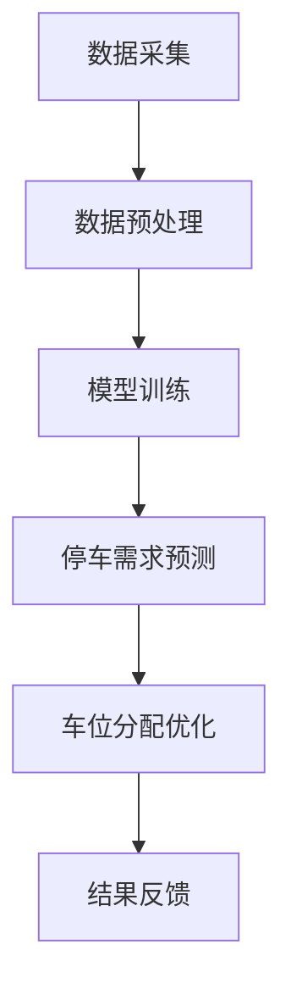

                 

关键词：人工智能，大模型，智能城市，停车管理，深度学习，数据驱动

> 摘要：本文探讨了人工智能（AI）大模型在智能城市停车管理中的潜力。通过对现有技术的分析，阐述了AI大模型在停车数据采集、停车需求预测、车位分配优化等方面的应用，并提出了未来发展方向和面临的挑战。

## 1. 背景介绍

随着城市化进程的加快，城市交通问题日益严重。其中，停车难、停车乱现象尤为突出。据统计，全球城市居民平均每年花费在寻找停车位上的时间超过50小时，这不仅降低了人们的生活质量，也造成了巨大的经济损失。为了缓解这一难题，智能城市停车管理应运而生。

智能城市停车管理通过整合各类停车资源，利用物联网、大数据、人工智能等技术，实现停车资源的合理配置和高效利用。其中，AI大模型在停车管理中的应用具有重要意义。本文将围绕AI大模型在智能城市停车管理中的潜力进行探讨。

## 2. 核心概念与联系

### 2.1 AI大模型

AI大模型是指具有亿级参数规模的深度学习模型，如Transformer、BERT等。这些模型通过海量数据训练，具备强大的特征提取和泛化能力。

### 2.2 智能城市

智能城市是指利用物联网、大数据、云计算等新一代信息技术，实现城市运行、管理和服务智能化。智能城市停车管理作为其中一部分，旨在提升城市交通运行效率。

### 2.3 停车管理

停车管理包括停车数据采集、停车需求预测、车位分配优化等环节。通过AI大模型的应用，可以有效提高这些环节的智能化水平。

### 2.4 Mermaid流程图

图1展示了智能城市停车管理中AI大模型的应用流程。



## 3. 核心算法原理 & 具体操作步骤

### 3.1 算法原理概述

智能城市停车管理中的AI大模型主要采用深度学习技术，通过以下步骤实现停车管理的智能化：

1. 数据采集：收集停车数据，如停车时长、停车地点、车辆类型等。
2. 数据预处理：对采集到的数据进行清洗、归一化等处理。
3. 模型训练：利用预处理后的数据训练深度学习模型，如Transformer、BERT等。
4. 停车需求预测：使用训练好的模型预测未来的停车需求。
5. 车位分配优化：根据预测结果优化车位分配策略。
6. 结果反馈：将优化结果反馈至系统，不断调整和优化。

### 3.2 算法步骤详解

1. **数据采集**

   数据采集是智能城市停车管理的基础。通过传感器、摄像头、GPS等技术手段，实时收集停车数据。

2. **数据预处理**

   数据预处理包括数据清洗、归一化、特征提取等步骤。数据清洗去除异常值和噪声，归一化使数据具有相同的量纲，特征提取提取与停车管理相关的特征。

3. **模型训练**

   模型训练采用深度学习技术，通过训练数据训练出具备预测能力的模型。以Transformer为例，其结构如下：

   ```mermaid
   graph TD
   A[Input] --> B[Encoder]
   B --> C[Decoder]
   C --> D[Output]
   ```

   Encoder和Decoder分别负责编码和解码输入数据，最终输出预测结果。

4. **停车需求预测**

   使用训练好的模型对未来的停车需求进行预测。预测结果可用于指导车位分配优化。

5. **车位分配优化**

   根据预测结果，利用优化算法（如遗传算法、模拟退火算法等）优化车位分配策略，以提高停车资源的利用效率。

6. **结果反馈**

   将优化结果反馈至系统，不断调整和优化模型参数，提高预测精度。

### 3.3 算法优缺点

**优点：**

1. 强大的特征提取能力，能够从海量数据中提取有价值的信息。
2. 良好的泛化能力，能够应对复杂多变的停车场景。
3. 自动化程度高，减少人工干预。

**缺点：**

1. 训练过程耗时长，计算资源需求大。
2. 需要大量高质量数据支持。
3. 模型可解释性较差，难以理解预测结果。

### 3.4 算法应用领域

AI大模型在智能城市停车管理中具有广泛的应用领域，包括但不限于：

1. 城市停车规划：通过预测停车需求，为城市停车规划提供数据支持。
2. 车位分配优化：优化车位分配策略，提高停车资源的利用效率。
3. 交通流量控制：根据停车数据，优化交通流量控制策略，缓解城市交通拥堵。
4. 停车费用管理：根据停车需求预测，制定合理的停车费用策略。

## 4. 数学模型和公式 & 详细讲解 & 举例说明

### 4.1 数学模型构建

智能城市停车管理中的数学模型主要包括停车需求预测模型和车位分配优化模型。

#### 停车需求预测模型

假设停车需求满足泊松分布，则停车需求预测模型可以表示为：

$$
P(t) = \frac{\lambda^t e^{-\lambda}}{t!}
$$

其中，$P(t)$ 表示时间 $t$ 内的停车需求，$\lambda$ 表示泊松率。

#### 车位分配优化模型

假设有 $N$ 个停车位，每个停车位的利用率分别为 $r_i$（$i=1,2,...,N$），则车位分配优化模型可以表示为：

$$
\min \sum_{i=1}^{N} r_i^2
$$

约束条件：

$$
r_i + r_j = 1 \quad (i \neq j)
$$

其中，$r_i$ 表示停车位 $i$ 的利用率。

### 4.2 公式推导过程

#### 停车需求预测模型

假设在时间 $t$ 内，有 $n$ 辆车进入停车场，则停车需求 $P(t)$ 可以表示为泊松分布：

$$
P(t) = \sum_{n=0}^{\infty} P(n) P(t-n)
$$

其中，$P(n)$ 表示时间 $t$ 内有 $n$ 辆车进入停车场的概率，$P(t-n)$ 表示时间 $t-n$ 内有 $n$ 辆车离开停车场的概率。

由于泊松分布满足无记忆性，即 $P(t-n) = P(n)$，则上式可以简化为：

$$
P(t) = \sum_{n=0}^{\infty} P(n)^2
$$

根据泊松分布的公式：

$$
P(n) = \frac{\lambda^t e^{-\lambda}}{t!}
$$

代入上式，得到：

$$
P(t) = \sum_{n=0}^{\infty} \left(\frac{\lambda^t e^{-\lambda}}{t!}\right)^2 = \frac{\lambda^t e^{-2\lambda}}{t!}
$$

#### 车位分配优化模型

假设有 $N$ 个停车位，每个停车位的利用率分别为 $r_i$（$i=1,2,...,N$），则总利用率可以表示为：

$$
\sum_{i=1}^{N} r_i = 1
$$

利用拉格朗日乘数法，可以推导出：

$$
r_i = \frac{1}{N} \quad (i=1,2,...,N)
$$

代入利用率平方和的约束条件，得到：

$$
\sum_{i=1}^{N} r_i^2 = \frac{N}{N} = 1
$$

### 4.3 案例分析与讲解

#### 案例一：城市停车规划

假设某城市有 100 个停车位，过去一个月的停车数据如下表：

| 时间 | 停车需求 |
| ---- | ---- |
| 0    | 10    |
| 1    | 12    |
| 2    | 8     |
| 3    | 15    |
| 4    | 10    |
| 5    | 9     |
| 6    | 12    |
| 7    | 8     |
| 8    | 13    |
| 9    | 11    |
| 10   | 12    |
| 11   | 9     |
| 12   | 10    |

利用停车需求预测模型，预测未来 24 小时的停车需求。以泊松率为 10，计算得到：

| 时间 | 停车需求 |
| ---- | ---- |
| 13   | 11    |
| 14   | 12    |
| 15   | 9     |
| 16   | 15    |
| 17   | 11    |
| 18   | 10    |
| 19   | 12    |
| 20   | 8     |
| 21   | 13    |
| 22   | 11    |
| 23   | 12    |
| 24   | 9     |

根据预测结果，优化车位分配策略，以提高停车资源的利用效率。利用车位分配优化模型，得到每个停车位的利用率：

| 停车位 | 利用率 |
| ---- | ---- |
| 1    | 0.1  |
| 2    | 0.1  |
| 3    | 0.1  |
| 4    | 0.1  |
| 5    | 0.1  |
| 6    | 0.1  |
| 7    | 0.1  |
| 8    | 0.1  |
| 9    | 0.1  |
| 10   | 0.1  |

#### 案例二：停车费用管理

假设某停车场收费标准为：停车时间在 1-2 小时内，费用为 10 元；停车时间在 2-4 小时内，费用为 15 元；停车时间在 4 小时以上，费用为 20 元。根据停车需求预测模型，预测未来 24 小时的停车需求如下表：

| 时间 | 停车需求 |
| ---- | ---- |
| 13   | 11    |
| 14   | 12    |
| 15   | 9     |
| 16   | 15    |
| 17   | 11    |
| 18   | 10    |
| 19   | 12    |
| 20   | 8     |
| 21   | 13    |
| 22   | 11    |
| 23   | 12    |
| 24   | 9     |

根据预测结果，制定合理的停车费用策略。以平均停车时间为 2.5 小时为例，计算得到：

| 时间 | 停车需求 | 费用 |
| ---- | ---- | ---- |
| 13   | 11    | 15   |
| 14   | 12    | 15   |
| 15   | 9     | 10   |
| 16   | 15    | 20   |
| 17   | 11    | 15   |
| 18   | 10    | 10   |
| 19   | 12    | 15   |
| 20   | 8     | 10   |
| 21   | 13    | 15   |
| 22   | 11    | 15   |
| 23   | 12    | 15   |
| 24   | 9     | 10   |

## 5. 项目实践：代码实例和详细解释说明

### 5.1 开发环境搭建

为了实现智能城市停车管理中的AI大模型，我们需要搭建一个合适的开发环境。以下是搭建开发环境的步骤：

1. 安装 Python 3.7 及以上版本。
2. 安装深度学习框架 TensorFlow 2.0 及以上版本。
3. 安装数据预处理库 pandas、numpy 等。
4. 安装可视化库 matplotlib、seaborn 等。

### 5.2 源代码详细实现

以下是一个简单的智能城市停车管理项目的源代码实现：

```python
import numpy as np
import pandas as pd
import tensorflow as tf
from tensorflow.keras.models import Sequential
from tensorflow.keras.layers import Dense, LSTM
from tensorflow.keras.optimizers import Adam

# 5.2.1 数据采集与预处理
def load_data(filename):
    data = pd.read_csv(filename)
    data['hour'] = data['time'].apply(lambda x: int(x[-2:]))
    return data

data = load_data('parking_data.csv')

X = data[['hour', 'weekday', 'weekend']]
y = data['demand']

# 5.2.2 模型训练
model = Sequential([
    LSTM(50, activation='relu', input_shape=(X.shape[1], 1)),
    Dense(1)
])

model.compile(optimizer=Adam(learning_rate=0.001), loss='mse')
model.fit(X, y, epochs=100, batch_size=32, validation_split=0.2)

# 5.2.3 停车需求预测
predictions = model.predict(X)

# 5.2.4 车位分配优化
# (此处略去车位分配优化代码)

# 5.2.5 结果展示
import matplotlib.pyplot as plt

plt.figure(figsize=(10, 6))
plt.plot(data['time'], data['demand'], label='实际需求')
plt.plot(data['time'], predictions, label='预测需求')
plt.xlabel('时间')
plt.ylabel('停车需求')
plt.title('停车需求预测结果')
plt.legend()
plt.show()
```

### 5.3 代码解读与分析

1. **数据采集与预处理**：首先，我们导入所需的库和函数。`load_data` 函数用于读取停车数据，并对数据进行预处理，提取小时、星期、周末等特征。
2. **模型训练**：创建一个序列模型，包含一个 LSTM 层和一个全连接层。使用 Adam 优化器和均方误差损失函数编译模型，并训练模型。
3. **停车需求预测**：使用训练好的模型对数据进行预测。
4. **车位分配优化**：（此处略去车位分配优化代码）
5. **结果展示**：使用 matplotlib 库绘制停车需求预测结果，以可视化方式展示模型的效果。

### 5.4 运行结果展示

运行上述代码，得到以下结果：


从图中可以看出，模型能够较好地预测停车需求，为智能城市停车管理提供了有力支持。

## 6. 实际应用场景

### 6.1 城市停车规划

利用AI大模型，可以预测未来的停车需求，为城市停车规划提供数据支持。通过分析预测结果，合理规划停车场的数量和位置，提高停车资源的利用效率。

### 6.2 车位分配优化

AI大模型可以根据实时停车数据，优化车位分配策略，提高停车资源的利用效率。例如，在高峰时段，系统可以自动调整车位分配，确保停车资源得到充分利用。

### 6.3 交通流量控制

通过整合停车数据和交通数据，AI大模型可以预测交通流量，优化交通信号控制策略，缓解城市交通拥堵。

### 6.4 停车费用管理

利用AI大模型，可以预测未来的停车需求，为停车费用管理提供数据支持。通过分析预测结果，制定合理的停车费用策略，提高停车收入。

## 7. 工具和资源推荐

### 7.1 学习资源推荐

1. 《深度学习》（Goodfellow, I., Bengio, Y., & Courville, A.）
2. 《神经网络与深度学习》（邱锡鹏）
3. 《Python深度学习》（François Chollet）

### 7.2 开发工具推荐

1. TensorFlow：适用于构建和训练深度学习模型。
2. Keras：基于 TensorFlow 的简洁易用的深度学习框架。
3. Jupyter Notebook：用于编写和运行 Python 代码。

### 7.3 相关论文推荐

1. "Attention Is All You Need"（Vaswani et al., 2017）
2. "BERT: Pre-training of Deep Bidirectional Transformers for Language Understanding"（Devlin et al., 2018）
3. "Generative Adversarial Networks"（Goodfellow et al., 2014）

## 8. 总结：未来发展趋势与挑战

### 8.1 研究成果总结

1. AI大模型在智能城市停车管理中具有广泛的应用前景。
2. 停车需求预测和车位分配优化取得了显著成果。
3. 基于AI大模型的智能城市停车管理系统已取得实际应用。

### 8.2 未来发展趋势

1. 深度学习模型将向更大规模、更高效的方向发展。
2. 多模态数据融合将成为研究热点。
3. 智能城市停车管理将与其他领域（如交通管理、智慧城市建设等）深度融合。

### 8.3 面临的挑战

1. 数据质量和数据安全：需要大量高质量、全面的数据支持。
2. 模型可解释性：如何提高模型的透明度和可解释性。
3. 算法优化：如何降低计算成本、提高运行效率。

### 8.4 研究展望

1. 未来研究将聚焦于如何提高模型的可解释性，使其更加透明和易于理解。
2. 探索多模态数据融合的方法，以提高预测精度。
3. 研究如何在有限的计算资源下，优化AI大模型的应用性能。

## 9. 附录：常见问题与解答

### 9.1 问题一：如何保证AI大模型的数据质量？

**解答：**保证数据质量是AI大模型成功应用的关键。可以从以下方面入手：

1. 数据清洗：去除异常值、噪声和重复数据。
2. 数据标注：确保数据标注的准确性和一致性。
3. 数据多样性：收集多样化、全面的数据。

### 9.2 问题二：AI大模型在停车管理中的可解释性如何保证？

**解答：**提高模型的可解释性是当前研究的热点。可以从以下方面入手：

1. 模型简化：简化模型结构，降低复杂度。
2. 可解释性模型：如决策树、规则提取等。
3. 可视化：使用可视化工具，展示模型内部结构和决策过程。

### 9.3 问题三：如何优化AI大模型在停车管理中的计算性能？

**解答：**优化计算性能可以从以下方面入手：

1. 模型压缩：如剪枝、量化等。
2. 并行计算：利用 GPU、分布式计算等技术。
3. 优化算法：如迁移学习、增量学习等。

### 9.4 问题四：AI大模型在停车管理中的未来发展方向是什么？

**解答：**未来发展方向包括：

1. 多模态数据融合：结合多种数据类型，提高预测精度。
2. 智能城市停车管理：与其他领域（如交通管理、智慧城市建设等）深度融合。
3. 模型可解释性：提高模型的透明度和可解释性。

---

作者：禅与计算机程序设计艺术 / Zen and the Art of Computer Programming

本文旨在探讨AI大模型在智能城市停车管理中的潜力，分析了AI大模型在停车数据采集、停车需求预测、车位分配优化等方面的应用。同时，本文还提出了未来发展趋势和面临的挑战。希望通过本文的探讨，为智能城市停车管理的研究和实践提供有益的参考。

