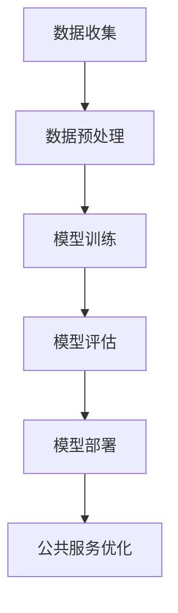

                 

关键词：AI大模型，智能城市，公共服务，应用，展望

摘要：本文旨在探讨AI大模型在智能城市公共服务中的作用。随着人工智能技术的不断进步，大模型在智能城市中的应用愈发广泛，为城市公共服务提供了前所未有的技术支撑。本文将深入分析AI大模型的核心概念、算法原理、数学模型及其在实际项目中的应用，并提出未来发展的趋势和面临的挑战。

## 1. 背景介绍

近年来，人工智能（AI）技术取得了飞速发展，其中，大模型（Large Models）作为AI领域的重要成果，正逐渐改变着各个行业的运作方式。智能城市（Smart City）作为新一代城市发展的方向，其目标是通过信息技术和智能系统的应用，提高城市的管理效率、居民的生活质量以及整体的社会福祉。

智能城市公共服务涵盖交通、医疗、教育、环境等多个领域，这些领域的数据庞杂、变化迅速，需要高效的智能化手段来处理和分析。AI大模型以其强大的数据处理和模式识别能力，正成为智能城市公共服务不可或缺的技术支撑。

本文将围绕以下几个问题展开讨论：

1. AI大模型的核心概念和原理是什么？
2. 如何运用AI大模型优化智能城市公共服务？
3. AI大模型在实际项目中的应用案例有哪些？
4. 面对未来的发展趋势和挑战，AI大模型将如何发展？

通过本文的探讨，希望能够为智能城市公共服务的发展提供一些新的思路和借鉴。

## 2. 核心概念与联系

### 2.1 AI大模型的概念

AI大模型指的是一种具有非常大规模参数和复杂结构的神经网络模型。这些模型通常具有数亿甚至数十亿个参数，能够通过深度学习算法从大量数据中自动提取特征和模式。代表性模型包括GPT、BERT、Transformer等。

### 2.2 智能城市的概念

智能城市是指利用信息通信技术（ICT）和智能系统来优化城市管理和公共服务的城市。智能城市强调数据驱动的决策、智能基础设施的建设和跨部门的协同工作。

### 2.3 AI大模型与智能城市的联系

AI大模型为智能城市提供了强大的技术支撑，主要体现在以下几个方面：

1. **数据驱动决策**：AI大模型能够处理和分析海量数据，为城市管理者提供科学的决策依据。
2. **智能基础设施**：AI大模型可以用于构建智能交通系统、智能能源管理系统等，提升城市基础设施的智能化水平。
3. **公共服务优化**：AI大模型可以优化医疗、教育、环保等公共服务，提高服务效率和居民满意度。

### 2.4 Mermaid流程图

以下是一个简化的AI大模型在智能城市公共服务中的应用流程图：



- **A 数据收集**：从城市各个部门收集数据，如交通流量、医疗数据、教育数据等。
- **B 数据预处理**：清洗、标准化和整合数据，为模型训练做准备。
- **C 模型训练**：使用大规模数据进行深度学习训练，构建AI大模型。
- **D 模型评估**：评估模型的性能，确保其能够在实际应用中达到预期效果。
- **E 模型部署**：将训练好的模型部署到智能城市系统中，进行实时服务。
- **F 公共服务优化**：利用模型提供的预测和分析结果，优化公共服务。

## 3. 核心算法原理 & 具体操作步骤

### 3.1 算法原理概述

AI大模型的算法原理主要基于深度学习（Deep Learning），特别是神经网络（Neural Networks）的结构和机制。深度学习通过多层神经元的组合，模拟人脑处理信息的方式，能够从大量数据中自动提取复杂的特征和模式。

AI大模型的核心算法包括：

1. **自动编码器（Autoencoder）**：用于数据压缩和特征提取。
2. **生成对抗网络（GAN）**：用于生成与真实数据相似的新数据。
3. **长短期记忆网络（LSTM）**：用于处理序列数据和时间序列预测。

### 3.2 算法步骤详解

1. **数据收集**：从城市的各个部门收集数据，包括交通流量、医疗数据、教育数据等。
2. **数据预处理**：对收集到的数据进行清洗、标准化和整合，确保数据的质量和一致性。
3. **模型选择**：根据应用场景选择合适的AI大模型，如自动编码器、GAN、LSTM等。
4. **模型训练**：使用预处理后的数据对模型进行训练，调整模型的参数，使其能够从数据中学习到有效的特征和模式。
5. **模型评估**：评估模型的性能，包括准确率、召回率、F1分数等指标，确保模型能够满足实际应用的需求。
6. **模型部署**：将训练好的模型部署到智能城市系统中，进行实时服务。
7. **模型优化**：根据实际应用效果，对模型进行调整和优化，提高其性能和稳定性。

### 3.3 算法优缺点

**优点**：

1. **强大的数据处理能力**：AI大模型能够处理和分析海量数据，提取复杂的特征和模式。
2. **自动特征提取**：无需手动设计特征，能够自动从数据中提取有效的特征。
3. **灵活的应用场景**：适用于各种不同领域的智能城市公共服务。

**缺点**：

1. **计算资源需求高**：训练大型模型需要大量的计算资源和时间。
2. **数据需求大**：需要大量的高质量数据进行训练，对数据的收集和处理提出了较高的要求。
3. **模型解释性差**：深度学习模型通常具有较低的透明度和解释性，难以理解其内部的工作机制。

### 3.4 算法应用领域

AI大模型在智能城市公共服务中的应用领域广泛，包括：

1. **交通管理**：通过分析交通流量数据，预测交通拥堵情况，优化交通信号灯控制，提高交通效率。
2. **医疗健康**：通过分析医疗数据，预测疾病发生，辅助医生进行诊断和治疗，提高医疗服务的质量。
3. **教育服务**：通过分析教育数据，个性化教育服务，提高学生的学习效果和兴趣。
4. **环境保护**：通过分析环境数据，预测环境污染情况，制定环保措施，保护城市环境。

## 4. 数学模型和公式 & 详细讲解 & 举例说明

### 4.1 数学模型构建

AI大模型的数学基础主要基于概率论和统计学，特别是贝叶斯理论、线性代数和微积分。以下是构建AI大模型所需的一些基本数学概念：

**1. 神经元模型**：

$$
\text{神经元输出} = \sigma(\text{加权输入}) = \frac{1}{1 + e^{-\text{加权输入}}}
$$

其中，$\sigma$ 是激活函数，常用的有Sigmoid、ReLU等。

**2. 神经网络**：

$$
\text{神经网络输出} = \text{激活函数}(\text{权重} \cdot \text{输入} + \text{偏置})
$$

**3. 损失函数**：

$$
\text{损失函数} = -\sum_{i=1}^{n} y_i \log(\hat{y}_i)
$$

其中，$y_i$ 是真实标签，$\hat{y}_i$ 是预测结果。

### 4.2 公式推导过程

以多层感知机（MLP）为例，我们来看一下模型训练的公式推导过程：

**1. 前向传播**：

$$
\text{输入层} \rightarrow \text{隐藏层} \rightarrow \text{输出层}
$$

设输入层为 $x \in \mathbb{R}^{d}$，隐藏层有 $l$ 个神经元，输出层有 $k$ 个神经元。

$$
z_l = W_l x + b_l \\
a_l = \sigma(z_l) \\
z_{l+1} = W_{l+1} a_l + b_{l+1} \\
a_{l+1} = \sigma(z_{l+1})
$$

**2. 反向传播**：

$$
\frac{\partial \text{损失函数}}{\partial W_{l+1}} = \frac{\partial \text{损失函数}}{\partial a_{l+1}} \cdot \frac{\partial a_{l+1}}{\partial z_{l+1}} \cdot \frac{\partial z_{l+1}}{\partial W_{l+1}} \\
\frac{\partial \text{损失函数}}{\partial W_l} = \frac{\partial \text{损失函数}}{\partial a_l} \cdot \frac{\partial a_l}{\partial z_l} \cdot \frac{\partial z_l}{\partial W_l}
$$

### 4.3 案例分析与讲解

**案例**：使用GPT模型进行文本生成。

**1. 数据准备**：

收集大量文本数据，并进行预处理，包括分词、去停用词、标记化等。

**2. 模型构建**：

构建一个GPT模型，设定适当的层数、隐藏层大小和激活函数。

**3. 模型训练**：

使用预处理后的数据进行模型训练，调整模型参数，使其能够生成符合预期的文本。

**4. 模型评估**：

通过生成文本的质量和多样性进行评估。

**5. 模型部署**：

将训练好的模型部署到应用系统中，进行实时文本生成。

**6. 模型优化**：

根据应用效果，对模型进行调整和优化，提高生成文本的质量。

## 5. 项目实践：代码实例和详细解释说明

### 5.1 开发环境搭建

**1. 硬件环境**：

- CPU或GPU：推荐使用NVIDIA GPU进行训练，以提高训练速度。
- 内存：至少16GB，推荐32GB以上。

**2. 软件环境**：

- 操作系统：Linux或Windows。
- 编程语言：Python。
- 深度学习框架：TensorFlow或PyTorch。

### 5.2 源代码详细实现

以下是一个简单的GPT模型训练代码实例：

```python
import torch
import torch.nn as nn
import torch.optim as optim

# 模型定义
class GPTModel(nn.Module):
    def __init__(self, vocab_size, embed_size, hidden_size, n_layers, drop_out):
        super(GPTModel, self).__init__()
        self.embedding = nn.Embedding(vocab_size, embed_size)
        selfenc = nn.LSTM(embed_size, hidden_size, num_layers=n_layers, dropout=drop_out, batch_first=True)
        self.fc = nn.Linear(hidden_size, vocab_size)
        self.dropout = nn.Dropout(drop_out)
    
    def forward(self, text, hidden):
        embedded = self.dropout(self.embedding(text))
        out, hidden = self.enc(embedded, hidden)
        out = self.fc(out)
        return out, hidden

# 模型训练
model = GPTModel(vocab_size, embed_size, hidden_size, n_layers, drop_out)
optimizer = optim.Adam(model.parameters(), lr=lr)
criterion = nn.CrossEntropyLoss()

for epoch in range(num_epochs):
    for i, (texts, labels) in enumerate(train_loader):
        # 前向传播
        outputs, hidden = model(texts)
        loss = criterion(outputs.view(-1, vocab_size), labels.view(-1))

        # 反向传播
        optimizer.zero_grad()
        loss.backward()
        optimizer.step()

        # 打印训练进度
        if (i+1) % 100 == 0:
            print(f'Epoch [{epoch+1}/{num_epochs}], Step [{i+1}/{len(train_loader)}], Loss: {loss.item():.4f}')
```

### 5.3 代码解读与分析

**1. 模型定义**：

- `GPTModel` 类定义了GPT模型的架构，包括嵌入层、编码器（LSTM）和输出层。
- `forward` 方法实现了模型的前向传播过程。

**2. 模型训练**：

- 使用`optim.Adam`优化器和`nn.CrossEntropyLoss`损失函数进行模型训练。
- 使用`for`循环进行每个epoch的迭代，内部使用`while`循环进行每个batch的训练。
- 使用`optimizer.zero_grad()`清除之前的梯度，`loss.backward()`计算梯度，`optimizer.step()`更新模型参数。

### 5.4 运行结果展示

在训练完成后，可以使用训练好的模型进行文本生成：

```python
# 文本生成
def generate_text(model, tokenizer, max_length=50):
    model.eval()
    hidden = (torch.zeros(1, 1, hidden_size), torch.zeros(1, 1, hidden_size))
    input = torch.tensor([[tokenizer["<sos>"]]])

    for _ in range(max_length):
        output, hidden = model(input, hidden)
        output = output[:, -1, :]
        predicted = output.argmax(1)
        input = predicted.unsqueeze(0)

    generated_text = tokenizer.decode(predicted[-1].item(), skip_special_tokens=True)
    return generated_text

generated_text = generate_text(model, tokenizer)
print(generated_text)
```

## 6. 实际应用场景

### 6.1 智能交通管理

AI大模型在智能交通管理中的应用非常广泛，可以通过分析交通流量数据，预测交通拥堵情况，优化交通信号灯控制策略，提高道路通行效率。例如，北京市在2019年推出了基于AI大模型的智能交通管理系统，通过实时分析交通数据，实现了对城市交通的智能化管理和调控。

### 6.2 智能医疗

AI大模型在智能医疗中的应用也非常显著，可以通过分析大量医疗数据，帮助医生进行疾病预测和诊断，提高医疗服务的质量和效率。例如，谷歌健康（Google Health）使用AI大模型对电子健康记录进行分析，实现了对糖尿病和心血管疾病的早期预测和诊断。

### 6.3 智能教育

AI大模型在智能教育中的应用主要体现在个性化学习、学习效果分析和评估等方面。通过分析学生的学习数据，AI大模型可以为学生提供个性化的学习建议，提高学习效果和兴趣。例如，中国的在线教育平台如学而思网校和猿辅导等，已经广泛应用AI大模型进行个性化教学和效果分析。

### 6.4 环境保护

AI大模型在环境保护中的应用主要体现在环境监测、污染预测和治理优化等方面。通过分析环境数据，AI大模型可以预测环境污染情况，为环保部门提供科学的治理策略。例如，德国的环境保护机构使用AI大模型对空气质量进行监测和预测，实现了对城市环境的智能化管理。

## 7. 工具和资源推荐

### 7.1 学习资源推荐

1. **书籍**：
   - 《深度学习》（Deep Learning） - Ian Goodfellow, Yoshua Bengio, Aaron Courville
   - 《人工智能：一种现代方法》（Artificial Intelligence: A Modern Approach） - Stuart J. Russell, Peter Norvig

2. **在线课程**：
   - Coursera: 《深度学习特化课程》（Deep Learning Specialization） - Andrew Ng
   - edX: 《机器学习基础》（Introduction to Machine Learning） - Microsoft AI

### 7.2 开发工具推荐

1. **深度学习框架**：
   - TensorFlow
   - PyTorch

2. **数据预处理工具**：
   - Pandas
   - NumPy

3. **可视化工具**：
   - Matplotlib
   - Seaborn

### 7.3 相关论文推荐

1. **AI大模型**：
   - “Attention Is All You Need” - Vaswani et al., 2017
   - “Generative Adversarial Networks” - Goodfellow et al., 2014

2. **智能城市**：
   - “Smart Cities: Principles and Practice” - Christian Liedtke, 2016
   - “A Vision for the Internet of Things” - Sangeet Paul Choudary, 2014

## 8. 总结：未来发展趋势与挑战

### 8.1 研究成果总结

近年来，AI大模型在智能城市公共服务中的应用取得了显著成果。通过分析大量数据，AI大模型能够为交通管理、医疗健康、教育服务、环境保护等领域提供高效的智能化解决方案。这些成果不仅提高了公共服务的效率和质量，也为城市管理者提供了科学的决策依据。

### 8.2 未来发展趋势

1. **模型规模和计算能力**：随着硬件技术的发展，AI大模型的规模将不断扩大，计算能力也将显著提高，这将进一步提升模型的应用效果。
2. **跨领域应用**：AI大模型将在更多领域得到应用，实现跨领域的智能化解决方案，如智慧农业、智慧能源等。
3. **模型可解释性**：提高模型的可解释性，使其更加透明和可信，这将有助于模型在实际应用中得到更广泛的接受和推广。
4. **隐私保护**：在保障数据隐私的前提下，开展AI大模型的研究和应用，确保公共服务的可持续性和安全性。

### 8.3 面临的挑战

1. **数据质量和隐私**：高质量的数据是AI大模型训练的基础，但数据隐私问题成为了一个重要的挑战。如何在保障数据隐私的前提下，充分利用数据的价值，是一个亟待解决的问题。
2. **计算资源**：训练大型AI大模型需要大量的计算资源，这对计算基础设施提出了较高的要求。如何优化计算资源的使用，降低训练成本，是一个关键问题。
3. **模型解释性**：深度学习模型通常具有较低的透明度和解释性，这给实际应用带来了一定的困难。提高模型的可解释性，使其更易于理解和接受，是一个重要的研究方向。
4. **伦理和法律**：随着AI大模型在公共服务中的应用日益广泛，其伦理和法律问题也逐渐凸显。如何在保障公民权益的同时，规范AI大模型的应用，是一个需要关注的问题。

### 8.4 研究展望

未来，AI大模型在智能城市公共服务中的应用将有以下几方面的发展：

1. **技术创新**：持续推动AI大模型算法的研究和优化，提高模型的应用效果和可靠性。
2. **跨学科合作**：加强跨学科合作，融合多领域知识，实现AI大模型在更多领域的应用。
3. **政策法规**：完善相关政策和法规，规范AI大模型的应用，保障公共服务的公平性和可持续性。
4. **人才培养**：加强人工智能领域的人才培养，为AI大模型在智能城市公共服务中的应用提供人才保障。

## 9. 附录：常见问题与解答

### 9.1 AI大模型如何处理隐私数据？

- **数据加密**：在数据传输和存储过程中，采用加密技术保障数据隐私。
- **数据匿名化**：对敏感数据进行匿名化处理，确保数据无法直接关联到个人。
- **隐私保护算法**：采用差分隐私、同态加密等隐私保护算法，在数据分析和模型训练过程中保障数据隐私。

### 9.2 如何提高AI大模型的可解释性？

- **可视化技术**：利用可视化工具，展示模型内部的决策过程和关键特征。
- **模型简化**：通过简化模型结构和参数，提高模型的可解释性。
- **特征重要性分析**：分析模型中各个特征的重要性，帮助理解模型决策依据。

### 9.3 AI大模型在智能城市公共服务中的具体应用场景有哪些？

- **智能交通管理**：预测交通流量，优化信号灯控制，提高道路通行效率。
- **智能医疗**：辅助医生进行疾病预测和诊断，提高医疗服务的质量和效率。
- **智能教育**：个性化学习推荐，学习效果分析和评估，提高学生的学习效果和兴趣。
- **环境保护**：预测环境污染情况，制定环保措施，保护城市环境。

---

作者：禅与计算机程序设计艺术 / Zen and the Art of Computer Programming

