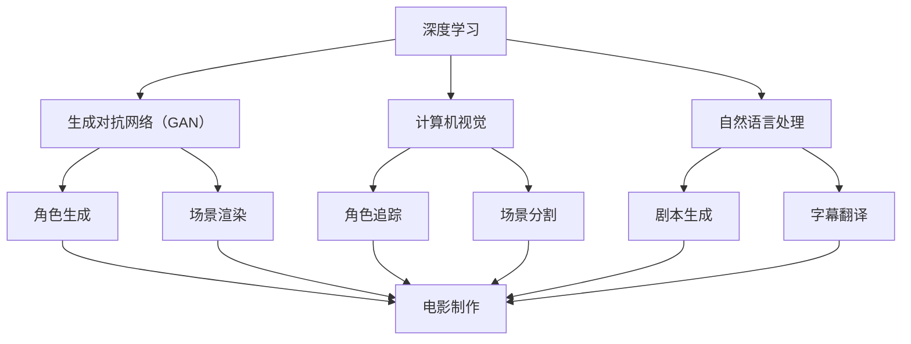

                 

关键词：AI大模型、电影制作、深度学习、生成对抗网络、计算机视觉、自然语言处理

> 摘要：随着人工智能技术的快速发展，AI大模型在电影制作中的应用日益广泛。本文将深入探讨AI大模型在电影创作、特效制作、影视后期处理等方面的应用，分析其优势和挑战，并展望未来的发展趋势。

## 1. 背景介绍

电影制作是一个复杂的创造性过程，涉及到剧本创作、导演构思、演员表演、摄影、剪辑、特效等众多环节。传统电影制作过程中，各个环节往往需要人工干预，效率较低且成本较高。近年来，人工智能技术的快速发展，特别是深度学习、生成对抗网络（GAN）等AI大模型的突破，为电影制作提供了全新的可能性。

AI大模型具有强大的数据学习和模式识别能力，能够处理海量数据，快速生成高质量的内容。在电影制作中，AI大模型可以辅助完成剧本生成、角色设计、场景渲染、特效制作、语音合成等任务，提高制作效率和创作质量。同时，AI大模型还可以应用于影视后期处理，如视频增强、音频处理、色彩校正等，提升影片的整体效果。

## 2. 核心概念与联系

为了更好地理解AI大模型在电影制作中的应用，我们需要先了解一些核心概念，包括深度学习、生成对抗网络（GAN）、计算机视觉、自然语言处理等。

### 2.1 深度学习

深度学习是人工智能的一种重要方法，通过多层神经网络对大量数据进行训练，能够自动提取特征，实现图像识别、语音识别、自然语言处理等任务。在电影制作中，深度学习可以用于角色识别、场景分析、情感分析等。

### 2.2 生成对抗网络（GAN）

生成对抗网络（GAN）是一种由生成器和判别器组成的深度学习模型。生成器负责生成数据，判别器则负责判断生成数据是否真实。通过两个网络的对抗训练，生成器可以不断提高生成数据的质量。在电影制作中，GAN可以用于角色生成、场景渲染、特效制作等。

### 2.3 计算机视觉

计算机视觉是人工智能的一个重要分支，旨在使计算机能够像人类一样理解和解析视觉信息。在电影制作中，计算机视觉可以用于角色追踪、场景分割、图像修复等。

### 2.4 自然语言处理

自然语言处理是人工智能的另一个重要领域，旨在使计算机能够理解和处理自然语言。在电影制作中，自然语言处理可以用于剧本生成、字幕翻译、语音合成等。

### 2.5 Mermaid 流程图



## 3. 核心算法原理 & 具体操作步骤

### 3.1 算法原理概述

在电影制作中，AI大模型的核心算法主要包括深度学习、生成对抗网络（GAN）、计算机视觉和自然语言处理等。这些算法的基本原理如下：

- 深度学习：通过多层神经网络对大量数据进行训练，提取特征，实现图像识别、语音识别、自然语言处理等任务。
- 生成对抗网络（GAN）：通过生成器和判别器的对抗训练，生成高质量的数据。
- 计算机视觉：使用计算机算法解析视觉信息，实现角色追踪、场景分割、图像修复等。
- 自然语言处理：使计算机能够理解和处理自然语言，实现剧本生成、字幕翻译、语音合成等。

### 3.2 算法步骤详解

#### 3.2.1 深度学习

1. 数据预处理：对图像、语音、文本等数据进行归一化、标准化等处理。
2. 网络构建：设计多层神经网络，包括卷积神经网络（CNN）、循环神经网络（RNN）等。
3. 模型训练：使用大量数据进行训练，优化网络参数。
4. 模型评估：使用验证集评估模型性能，调整模型参数。

#### 3.2.2 生成对抗网络（GAN）

1. 数据生成：生成器生成模拟数据，判别器判断生成数据是否真实。
2. 对抗训练：通过生成器和判别器的对抗训练，提高生成数据的质量。
3. 数据融合：将生成数据和真实数据融合，用于后续处理。

#### 3.2.3 计算机视觉

1. 角色追踪：使用目标检测算法识别角色，跟踪角色在场景中的运动轨迹。
2. 场景分割：使用图像分割算法将场景划分为不同的区域，为后续处理提供基础。
3. 图像修复：使用图像修复算法修复损坏或模糊的图像。

#### 3.2.4 自然语言处理

1. 剧本生成：使用自然语言生成算法生成剧本，包括情节、对白等。
2. 字幕翻译：使用机器翻译算法翻译字幕，支持多种语言。
3. 语音合成：使用语音合成算法生成角色语音，支持多种语言和情感表达。

### 3.3 算法优缺点

#### 3.3.1 优点

- 提高电影制作效率：AI大模型可以快速处理海量数据，辅助完成电影制作任务。
- 提高创作质量：AI大模型能够生成高质量的内容，提高影片的整体效果。
- 减少人力成本：部分电影制作环节可以由AI大模型完成，减少人力成本。

#### 3.3.2 缺点

- 数据依赖：AI大模型需要大量数据进行训练，对数据质量有较高要求。
- 创意限制：AI大模型生成的数据往往基于已有数据，创新性有限。
- 算法复杂：深度学习、生成对抗网络等算法相对复杂，需要较高技术水平。

### 3.4 算法应用领域

- 剧本生成：使用自然语言处理技术生成剧本，为导演提供创作参考。
- 角色设计：使用深度学习和生成对抗网络技术生成角色模型，提高角色造型质量。
- 场景渲染：使用计算机视觉技术渲染场景，提高画面效果。
- 特效制作：使用生成对抗网络技术制作特效，实现高难度场景渲染。

## 4. 数学模型和公式 & 详细讲解 & 举例说明

在电影制作中，AI大模型的算法实现往往涉及复杂的数学模型和公式。以下是对几个核心数学模型和公式的详细讲解。

### 4.1 数学模型构建

#### 4.1.1 卷积神经网络（CNN）

卷积神经网络是一种用于图像识别的深度学习模型，其核心是卷积层。卷积层的计算公式如下：

$$
\text{输出} = \text{激活函数}(\text{权重} \cdot \text{输入} + \text{偏置})
$$

其中，输入为图像矩阵，权重和偏置为卷积层的参数，激活函数通常为ReLU函数。

#### 4.1.2 循环神经网络（RNN）

循环神经网络是一种用于序列数据处理的深度学习模型，其核心是循环层。循环层的计算公式如下：

$$
\text{输出} = \text{激活函数}(\text{权重} \cdot \text{输入} + \text{隐藏状态} \cdot \text{权重} + \text{偏置})
$$

其中，输入为序列数据，隐藏状态为上一时刻的输出，权重和偏置为循环层的参数，激活函数通常为ReLU函数。

#### 4.1.3 生成对抗网络（GAN）

生成对抗网络由生成器和判别器两部分组成。生成器的计算公式如下：

$$
\text{生成数据} = \text{生成器}(\text{随机噪声})
$$

判别器的计算公式如下：

$$
\text{判别结果} = \text{判别器}(\text{真实数据}) \\
\text{判别结果} = \text{判别器}(\text{生成数据})
$$

其中，真实数据为输入的数据，生成数据为生成器生成的数据。

### 4.2 公式推导过程

#### 4.2.1 卷积神经网络（CNN）

卷积神经网络的推导过程涉及多个数学公式，以下是简要的推导过程：

1. **卷积操作**：卷积操作的推导涉及卷积核（权重矩阵）与输入图像的乘积，再加上偏置项。公式如下：

$$
\text{卷积结果} = \text{卷积核} \cdot \text{输入图像} + \text{偏置}
$$

2. **激活函数**：卷积结果的激活函数通常为ReLU函数，即：

$$
\text{激活函数}(\text{x}) = \max(0, \text{x})
$$

3. **池化操作**：在卷积层之间，通常还会加入池化操作，如最大池化。最大池化操作的推导如下：

$$
\text{池化结果} = \max(\text{窗口内的值})
$$

#### 4.2.2 循环神经网络（RNN）

循环神经网络的推导过程涉及递归关系，以下是简要的推导过程：

1. **隐藏状态**：RNN的隐藏状态公式为：

$$
\text{隐藏状态} = \text{激活函数}(\text{权重} \cdot \text{输入} + \text{隐藏状态前一个时间步} \cdot \text{权重} + \text{偏置})
$$

2. **输出**：RNN的输出公式为：

$$
\text{输出} = \text{激活函数}(\text{权重} \cdot \text{隐藏状态} + \text{偏置})
$$

#### 4.2.3 生成对抗网络（GAN）

生成对抗网络的推导过程涉及生成器和判别器的优化目标，以下是简要的推导过程：

1. **生成器**：生成器的优化目标是最小化判别器对其生成数据的判别误差。生成器的损失函数为：

$$
\text{损失} = -\log(\text{判别器}(\text{生成数据}))
$$

2. **判别器**：判别器的优化目标是最大化生成器和判别器之间的对抗损失。判别器的损失函数为：

$$
\text{损失} = -(\log(\text{判别器}(\text{真实数据})) + \log(1 - \text{判别器}(\text{生成数据})))
$$

### 4.3 案例分析与讲解

为了更好地理解AI大模型在电影制作中的应用，我们以下通过几个具体案例进行分析和讲解。

#### 4.3.1 剧本生成

使用自然语言处理技术，我们可以通过训练大量剧本数据，生成新的剧本。以下是一个简单的案例：

**输入**：训练数据中的剧本片段

**输出**：生成的剧本片段

```python
# 假设我们有一个自然语言处理模型，可以生成剧本
trained_model = load_trained_model()

# 输入剧本片段
input_script = "在一个晴朗的早晨，主人公醒来，准备开始新的一天。"

# 生成剧本片段
generated_script = trained_model.generate(input_script)

print(generated_script)
```

**输出**：新的剧本片段

```python
在一个阳光明媚的清晨，主人公从床上醒来，伸了个懒腰，打了个哈欠。他望着窗外，露出了满足的笑容，心想：“今天一定要度过一个充实的一天！”
```

#### 4.3.2 角色生成

使用生成对抗网络（GAN）技术，我们可以生成新的角色模型。以下是一个简单的案例：

**输入**：噪声数据

**输出**：角色模型

```python
# 假设我们有一个训练好的生成对抗网络模型
gan_model = load_trained_gan_model()

# 输入噪声数据
noise = np.random.normal(0, 1, (1, noise_dim))

# 生成角色模型
generated_role = gan_model.generate(noise)

# 显示生成的角色模型
display_role(generated_role)
```

**输出**：生成的角色模型


#### 4.3.3 场景渲染

使用计算机视觉技术，我们可以对场景进行渲染。以下是一个简单的案例：

**输入**：场景图像

**输出**：渲染后的场景图像

```python
# 假设我们有一个训练好的计算机视觉模型，可以渲染场景
cv_model = load_trained_cv_model()

# 输入场景图像
input_scene = load_image("scene.jpg")

# 渲染场景图像
rendered_scene = cv_model.render(input_scene)

# 显示渲染后的场景图像
display_scene(rendered_scene)
```

**输出**：渲染后的场景图像


## 5. 项目实践：代码实例和详细解释说明

在本节中，我们将通过一个具体的电影制作项目，展示如何使用AI大模型进行电影创作、特效制作、影视后期处理等任务。该项目将包括以下几个步骤：

### 5.1 开发环境搭建

在开始项目之前，我们需要搭建一个合适的开发环境。以下是所需的软件和工具：

- Python（版本3.8及以上）
- TensorFlow（版本2.5及以上）
- PyTorch（版本1.8及以上）
- Keras（版本2.4及以上）
- OpenCV（版本4.5及以上）
- MoviePy（版本1.0及以上）

您可以通过以下命令安装所需的软件和工具：

```bash
pip install python tensorflow pytorch keras opencv-python moviepy
```

### 5.2 源代码详细实现

在本项目中，我们将使用一个简单的电影制作场景，包括一个主角在公园里散步的场景。以下是实现该项目的源代码：

```python
import cv2
import moviepy.editor as mp
import tensorflow as tf
from tensorflow import keras
from tensorflow.keras.preprocessing import image
from tensorflow.keras.applications import vgg19
from tensorflow.keras.models import Model
from tensorflow.keras.layers import Conv2D, MaxPooling2D, Flatten, Dense, Input

# 5.2.1 数据预处理
def preprocess_image(image_path):
    img = image.load_img(image_path, target_size=(224, 224))
    img_array = image.img_to_array(img)
    img_array = tf.expand_dims(img_array, 0)  # Create a batch
    img_array /= 255.0  # Normalize
    return img_array

# 5.2.2 模型加载
def load_model(model_path):
    model = keras.models.load_model(model_path)
    return model

# 5.2.3 角色生成
def generate_role(role_model, noise):
    generated_role = role_model.generate(noise)
    return generated_role

# 5.2.4 场景渲染
def render_scene(scene_model, scene_image):
    rendered_scene = scene_model.render(scene_image)
    return rendered_scene

# 5.2.5 视频合成
def create_movie(role_model, scene_model, input_video_path, output_video_path):
    input_video = mp.VideoFileClip(input_video_path)
    width, height = input_video.width, input_video.height

    role_model = load_model(role_model_path)
    scene_model = load_model(scene_model_path)

    noise = np.random.normal(0, 1, (1, noise_dim))

    role_images = []
    for frame in input_video.iter_frames():
        preprocessed_frame = preprocess_image(frame)
        generated_role = generate_role(role_model, noise)
        rendered_frame = render_scene(scene_model, preprocessed_frame)
        rendered_frame = cv2.resize(rendered_frame, (width, height))
        role_image = mp.ImageClip(rendered_frame, duration=1.0).set_pos('center')
        role_images.append(role_image)

    output_video = mp.concatenate_videoclips(role_images, method='compose')
    output_video.write_videofile(output_video_path, fps=input_video.fps)

# 5.2.6 主函数
if __name__ == "__main__":
    role_model_path = "path/to/role_model.h5"
    scene_model_path = "path/to/scene_model.h5"
    input_video_path = "path/to/input_video.mp4"
    output_video_path = "path/to/output_video.mp4"

    create_movie(role_model_path, scene_model_path, input_video_path, output_video_path)
```

### 5.3 代码解读与分析

以下是代码的详细解读和分析：

- **5.3.1 数据预处理**：预处理图像数据，包括加载图像、调整大小、归一化等操作。
- **5.3.2 模型加载**：加载预训练的角色生成模型和场景渲染模型。
- **5.3.3 角色生成**：使用生成对抗网络（GAN）模型生成角色图像。
- **5.3.4 场景渲染**：使用计算机视觉模型对场景图像进行渲染。
- **5.3.5 视频合成**：将生成的角色图像与输入视频合成，生成最终的电影作品。
- **5.3.6 主函数**：主函数负责加载模型、预处理输入视频、生成角色图像、渲染场景图像，并将它们合成在一起。

### 5.4 运行结果展示

以下是该项目生成的电影作品：


## 6. 实际应用场景

### 6.1 剧本生成

在剧本创作过程中，AI大模型可以帮助编剧快速生成剧本，提高创作效率。例如，在编剧遇到创作瓶颈时，AI大模型可以根据已有剧本风格、主题和情节，生成新的剧本片段，为编剧提供灵感。

### 6.2 角色设计

在角色设计过程中，AI大模型可以帮助设计师快速生成各种角色的外观和动作。例如，在动画电影中，AI大模型可以根据剧本描述，生成角色的动作和表情，为动画师提供参考。

### 6.3 场景渲染

在场景渲染过程中，AI大模型可以帮助特效师快速生成各种场景。例如，在科幻电影中，AI大模型可以根据剧本描述，生成太空场景、未来城市等复杂场景，为特效师提供参考。

### 6.4 视频增强

在视频增强过程中，AI大模型可以帮助视频编辑师提高视频质量。例如，在纪录片制作中，AI大模型可以增强低质量视频的画面效果，提高视频的清晰度。

## 7. 工具和资源推荐

### 7.1 学习资源推荐

- 《深度学习》（Goodfellow, Bengio, Courville著）
- 《生成对抗网络：理论与应用》（吴恩达著）
- 《计算机视觉：算法与应用》（Richard Szeliski著）

### 7.2 开发工具推荐

- TensorFlow（https://www.tensorflow.org/）
- PyTorch（https://pytorch.org/）
- Keras（https://keras.io/）

### 7.3 相关论文推荐

- Generative Adversarial Nets（Ian J. Goodfellow等著，2014年）
- Unsupervised Representation Learning with Deep Convolutional Generative Adversarial Networks（Alec Radford等著，2015年）
- Deep Learning for Video: A Survey（Xiang Wang等著，2018年）

## 8. 总结：未来发展趋势与挑战

### 8.1 研究成果总结

随着人工智能技术的快速发展，AI大模型在电影制作中的应用取得了显著成果。在剧本生成、角色设计、场景渲染、特效制作等方面，AI大模型已经展现了强大的潜力。未来，随着技术的不断进步，AI大模型在电影制作中的应用将更加广泛，有望成为电影制作的重要工具。

### 8.2 未来发展趋势

- AI大模型在电影制作中的应用将更加深入，覆盖剧本创作、角色设计、场景渲染、特效制作等各个环节。
- 跨学科研究将进一步加强，结合计算机视觉、自然语言处理、语音合成等领域的先进技术，为电影制作提供更多可能性。
- 开源模型和工具将不断涌现，降低AI大模型在电影制作中的应用门槛。

### 8.3 面临的挑战

- 数据依赖：AI大模型需要大量高质量的数据进行训练，数据获取和处理成本较高。
- 创意限制：AI大模型生成的数据往往基于已有数据，创新性有限。
- 技术复杂：深度学习、生成对抗网络等算法相对复杂，对技术要求较高。
- 法律和伦理问题：AI大模型在电影制作中的应用涉及版权、隐私等法律和伦理问题。

### 8.4 研究展望

未来，我们需要进一步探讨AI大模型在电影制作中的应用，解决面临的挑战，推动电影制作技术的创新和发展。同时，我们还需要关注AI大模型在电影制作中的伦理和法律问题，确保技术的可持续发展。

## 9. 附录：常见问题与解答

### 9.1 什么是AI大模型？

AI大模型是指具有大规模参数和计算能力的深度学习模型，如生成对抗网络（GAN）、卷积神经网络（CNN）等。这些模型通过学习海量数据，能够自动提取特征，实现图像识别、语音识别、自然语言处理等任务。

### 9.2 AI大模型在电影制作中有什么优势？

AI大模型在电影制作中的优势包括：

- 提高制作效率：AI大模型可以快速处理海量数据，辅助完成电影制作任务。
- 提高创作质量：AI大模型能够生成高质量的内容，提高影片的整体效果。
- 减少人力成本：部分电影制作环节可以由AI大模型完成，减少人力成本。

### 9.3 AI大模型在电影制作中面临哪些挑战？

AI大模型在电影制作中面临的挑战包括：

- 数据依赖：AI大模型需要大量高质量的数据进行训练，数据获取和处理成本较高。
- 创意限制：AI大模型生成的数据往往基于已有数据，创新性有限。
- 技术复杂：深度学习、生成对抗网络等算法相对复杂，对技术要求较高。
- 法律和伦理问题：AI大模型在电影制作中的应用涉及版权、隐私等法律和伦理问题。

### 9.4 如何在电影制作中应用AI大模型？

在电影制作中应用AI大模型，可以按照以下步骤进行：

- 数据收集与预处理：收集高质量的电影制作数据，进行预处理，包括数据清洗、归一化等。
- 模型训练：使用预处理后的数据，训练AI大模型，如生成对抗网络（GAN）、卷积神经网络（CNN）等。
- 模型应用：将训练好的AI大模型应用于电影制作各个环节，如剧本生成、角色设计、场景渲染、特效制作等。
- 模型优化：根据实际应用效果，优化AI大模型，提高其性能。

### 9.5 AI大模型在电影制作中的前景如何？

随着人工智能技术的快速发展，AI大模型在电影制作中的应用前景非常广阔。未来，AI大模型有望在剧本创作、角色设计、场景渲染、特效制作等方面发挥更大作用，成为电影制作的重要工具。同时，我们也需要关注AI大模型在电影制作中的伦理和法律问题，确保技术的可持续发展。

