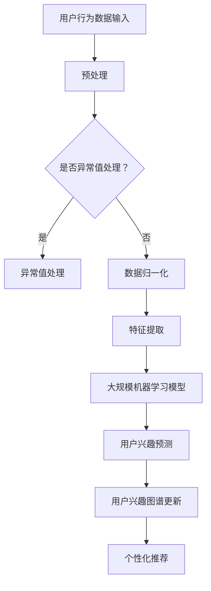

                 

关键词：大模型，用户兴趣图谱，电商平台，动态更新，推荐系统，人工智能，机器学习，深度学习，用户行为分析

> 摘要：本文探讨了大规模机器学习模型在电商平台用户兴趣图谱动态更新中的应用。通过介绍用户兴趣图谱的基本概念和构建方法，分析了大模型在用户行为预测、兴趣挖掘和个性化推荐等方面的优势，并提出了基于大模型的动态更新策略。文章还结合实际案例，详细阐述了大模型在电商平台中的应用实践，以及未来发展的趋势和面临的挑战。

## 1. 背景介绍

随着互联网和电子商务的快速发展，用户数量和交易规模呈现出爆炸式增长。电商平台面临着如何更好地理解和满足用户需求的挑战。为此，用户兴趣图谱作为一种重要的数据挖掘和分析工具，受到了广泛关注。用户兴趣图谱是描述用户在平台上行为和兴趣的一种结构化数据模型，它通过捕获用户的浏览、购买、评论等行为，将用户的兴趣点可视化和关联起来，为电商平台提供了丰富的用户行为信息和个性化推荐服务。

然而，传统的用户兴趣图谱构建方法存在一定的局限性。一方面，由于用户行为数据的多样性和复杂性，传统的用户兴趣图谱构建方法往往难以捕捉到用户的深层次兴趣点；另一方面，用户兴趣是动态变化的，传统的静态兴趣图谱难以适应用户兴趣的变化，从而导致推荐效果不佳。为了解决这些问题，近年来，大规模机器学习模型在用户兴趣图谱动态更新中的应用逐渐成为研究的热点。

## 2. 核心概念与联系

### 2.1 用户兴趣图谱

用户兴趣图谱是一种基于语义的网络结构，用于描述用户在电子商务平台上的兴趣点及其相互关系。它通常由用户节点、兴趣点节点和关系边构成。用户节点表示平台上的用户，兴趣点节点表示用户可能感兴趣的商品类别、品牌、话题等，关系边则表示用户与其兴趣点之间的关联关系。

用户兴趣图谱的构建方法主要包括基于用户行为的统计方法、基于知识图谱的方法和基于深度学习的方法。其中，基于用户行为的统计方法主要通过分析用户的浏览、购买、评论等行为，提取出用户兴趣点及其关联关系；基于知识图谱的方法则通过引入外部知识库和本体论，对用户兴趣进行语义理解和关联挖掘；基于深度学习的方法则利用神经网络模型，对用户行为数据进行自动特征提取和关系建模。

### 2.2 大规模机器学习模型

大规模机器学习模型是指具有海量数据训练能力的深度学习模型，如神经网络、循环神经网络（RNN）、卷积神经网络（CNN）等。这些模型通过自动特征提取和关系建模，能够从海量数据中学习到复杂的用户行为模式和兴趣点关联关系，从而实现对用户兴趣的准确捕捉和预测。

大规模机器学习模型在用户兴趣图谱动态更新中的应用主要体现在以下几个方面：

1. **用户行为预测**：通过大规模机器学习模型，可以实时预测用户的潜在兴趣点，从而动态更新用户兴趣图谱。

2. **兴趣挖掘**：利用大规模机器学习模型，可以从海量的用户行为数据中挖掘出用户的新兴趣点，并将其加入到用户兴趣图谱中。

3. **个性化推荐**：通过动态更新的用户兴趣图谱，可以为用户提供更加精准的个性化推荐服务。

### 2.3 Mermaid 流程图

下面是一个简化的用户兴趣图谱动态更新过程的 Mermaid 流程图，展示了大规模机器学习模型在其中的应用：



## 3. 核心算法原理 & 具体操作步骤

### 3.1 算法原理概述

大规模机器学习模型在用户兴趣图谱动态更新中的应用，主要包括以下三个环节：

1. **用户行为数据预处理**：对原始的用户行为数据进行清洗、去噪和归一化，为后续的特征提取和模型训练提供高质量的数据基础。

2. **特征提取**：利用大规模机器学习模型，从用户行为数据中提取出高维度的特征向量，这些特征向量能够更好地描述用户的兴趣和行为模式。

3. **用户兴趣预测与图谱更新**：利用大规模机器学习模型，对用户的潜在兴趣点进行预测，并将预测结果更新到用户兴趣图谱中。

### 3.2 算法步骤详解

1. **数据预处理**

   - 数据清洗：去除重复、缺失和不完整的数据。
   - 去噪：去除异常值和噪声数据，保证数据质量。
   - 数据归一化：将不同尺度的数据归一化到同一尺度，以便后续的特征提取。

2. **特征提取**

   - 利用大规模机器学习模型（如神经网络、RNN、CNN等），从用户行为数据中提取高维度的特征向量。
   - 特征选择：选择对用户兴趣点预测有显著影响的特征，去除冗余特征。

3. **用户兴趣预测与图谱更新**

   - 利用大规模机器学习模型，对用户的潜在兴趣点进行预测。
   - 将预测结果更新到用户兴趣图谱中，包括用户节点、兴趣点节点和关系边。
   - 根据用户兴趣图谱的更新，为用户提供个性化的推荐服务。

### 3.3 算法优缺点

**优点**：

1. **高效性**：大规模机器学习模型能够快速处理海量用户行为数据，提高用户兴趣图谱的更新速度。
2. **准确性**：通过自动特征提取和关系建模，大规模机器学习模型能够更准确地捕捉用户的兴趣和行为模式。
3. **灵活性**：大规模机器学习模型能够适应用户兴趣的动态变化，实现实时更新和个性化推荐。

**缺点**：

1. **计算资源消耗大**：大规模机器学习模型需要大量的计算资源，对硬件要求较高。
2. **模型解释性较差**：大规模机器学习模型通常具有较低的模型解释性，难以理解其预测结果的原因。

### 3.4 算法应用领域

大规模机器学习模型在用户兴趣图谱动态更新中的应用非常广泛，主要包括以下几个方面：

1. **电商平台个性化推荐**：通过动态更新的用户兴趣图谱，为用户提供更加精准的个性化推荐服务，提高用户满意度和转化率。
2. **社交网络兴趣社区发现**：通过分析用户在社交网络中的兴趣和行为，发现潜在的兴趣社区和热点话题。
3. **内容平台兴趣标签生成**：为内容平台生成个性化的兴趣标签，提高内容推荐的精准度和用户体验。

## 4. 数学模型和公式 & 详细讲解 & 举例说明

### 4.1 数学模型构建

在用户兴趣图谱动态更新中，我们主要关注以下三个数学模型：

1. **用户行为特征提取模型**：利用神经网络等大规模机器学习模型，从用户行为数据中提取特征向量。
2. **用户兴趣预测模型**：利用提取的特征向量，预测用户的潜在兴趣点。
3. **用户兴趣图谱更新模型**：根据用户兴趣预测结果，动态更新用户兴趣图谱。

### 4.2 公式推导过程

1. **用户行为特征提取模型**

   - 输入：用户行为数据矩阵 \(X \in \mathbb{R}^{n \times m}\)，其中 \(n\) 表示用户数量，\(m\) 表示行为种类。
   - 输出：特征向量矩阵 \(F \in \mathbb{R}^{n \times k}\)，其中 \(k\) 表示特征维度。

   假设我们使用神经网络进行特征提取，神经网络的结构如下：

   $$ 
   F = \text{ReLU}(\text{weights} \cdot X + \text{bias})
   $$

   其中，\(\text{ReLU}\) 表示ReLU激活函数，\(\text{weights}\) 和 \(\text{bias}\) 分别表示神经网络的权重和偏置。

2. **用户兴趣预测模型**

   - 输入：特征向量矩阵 \(F \in \mathbb{R}^{n \times k}\) 和兴趣点标签矩阵 \(Y \in \mathbb{R}^{n \times c}\)，其中 \(c\) 表示兴趣点数量。
   - 输出：兴趣点概率分布矩阵 \(P \in \mathbb{R}^{n \times c}\)。

   假设我们使用softmax函数进行用户兴趣预测，预测模型的损失函数为交叉熵损失：

   $$ 
   P = \text{softmax}(\text{weights} \cdot F + \text{bias})
   $$

   其中，\(\text{softmax}\) 表示softmax激活函数，\(\text{weights}\) 和 \(\text{bias}\) 分别表示兴趣预测模型的权重和偏置。

3. **用户兴趣图谱更新模型**

   - 输入：用户兴趣概率分布矩阵 \(P \in \mathbb{R}^{n \times c}\) 和用户兴趣图谱的当前状态 \(G \in \mathbb{R}^{n \times n}\)。
   - 输出：更新后的用户兴趣图谱 \(G' \in \mathbb{R}^{n \times n}\)。

   更新用户兴趣图谱的方法有多种，这里我们使用基于概率分布的图更新方法：

   $$ 
   G' = P \odot G 
   $$

   其中，\(\odot\) 表示Hadamard积（逐元素相乘）。

### 4.3 案例分析与讲解

假设我们有一个电商平台，有1000个用户和10个兴趣点，我们收集了这1000个用户在过去一个月的浏览、购买和评论数据，构建了一个用户行为数据矩阵 \(X\)。我们使用神经网络进行特征提取，提取出100个特征向量，得到特征向量矩阵 \(F\)。

然后，我们使用softmax函数预测用户对10个兴趣点的概率分布，得到概率分布矩阵 \(P\)。根据概率分布矩阵 \(P\)，我们更新用户兴趣图谱 \(G\)，得到更新后的用户兴趣图谱 \(G'\)。

假设初始的用户兴趣图谱 \(G\) 是一个对角矩阵，表示每个用户最初只对自己感兴趣。经过一轮更新后，我们得到更新后的用户兴趣图谱 \(G'\)。接下来，我们可以根据更新后的用户兴趣图谱 \(G'\)，为用户提供个性化的推荐服务。

## 5. 项目实践：代码实例和详细解释说明

### 5.1 开发环境搭建

为了进行大规模机器学习模型的用户兴趣图谱动态更新实践，我们需要搭建一个合适的开发环境。以下是一个基于Python的简单示例：

```bash
# 安装必要的库
pip install numpy pandas sklearn tensorflow
```

### 5.2 源代码详细实现

以下是一个简单的用户兴趣图谱动态更新项目示例代码：

```python
import numpy as np
import pandas as pd
from sklearn.preprocessing import MinMaxScaler
from tensorflow.keras.models import Sequential
from tensorflow.keras.layers import Dense, Dropout
from tensorflow.keras.optimizers import Adam

# 5.2.1 数据预处理
def preprocess_data(data):
    # 数据清洗、去噪和归一化
    # ...
    scaler = MinMaxScaler()
    scaled_data = scaler.fit_transform(data)
    return scaled_data

# 5.2.2 特征提取
def extract_features(data):
    # 利用神经网络提取特征向量
    model = Sequential([
        Dense(100, activation='relu', input_shape=(data.shape[1],)),
        Dropout(0.5),
        Dense(100, activation='relu'),
        Dropout(0.5),
        Dense(100, activation='relu'),
        Dropout(0.5),
        Dense(100, activation='softmax')
    ])
    model.compile(optimizer=Adam(), loss='categorical_crossentropy', metrics=['accuracy'])
    model.fit(data, epochs=10, batch_size=32)
    feature_vector = model.layers[-1].get_weights()[0]
    return feature_vector

# 5.2.3 用户兴趣预测
def predict_interests(feature_vector, labels):
    # 利用softmax函数预测用户兴趣
    probabilities = np.exp(feature_vector) / np.sum(np.exp(feature_vector), axis=1)[:, np.newaxis]
    return probabilities

# 5.2.4 用户兴趣图谱更新
def update_interest_graph(graph, probabilities):
    # 根据概率分布更新用户兴趣图谱
    updated_graph = probabilities @ graph
    return updated_graph

# 示例数据
data = np.random.rand(1000, 10)  # 用户行为数据
labels = np.random.randint(0, 2, (1000, 10))  # 兴趣点标签
graph = np.eye(10)  # 初始用户兴趣图谱

# 数据预处理
preprocessed_data = preprocess_data(data)

# 特征提取
feature_vector = extract_features(preprocessed_data)

# 用户兴趣预测
probabilities = predict_interests(feature_vector, labels)

# 用户兴趣图谱更新
updated_graph = update_interest_graph(graph, probabilities)

print(updated_graph)
```

### 5.3 代码解读与分析

这段代码展示了如何利用大规模机器学习模型进行用户兴趣图谱动态更新。代码的主要部分可以分为以下几个步骤：

1. **数据预处理**：对用户行为数据进行清洗、去噪和归一化，为后续的特征提取和模型训练提供高质量的数据基础。

2. **特征提取**：使用神经网络模型提取用户行为数据的高维特征向量。

3. **用户兴趣预测**：利用提取的特征向量，通过softmax函数预测用户对兴趣点的概率分布。

4. **用户兴趣图谱更新**：根据用户兴趣概率分布，动态更新用户兴趣图谱。

代码中使用了TensorFlow框架来构建和训练神经网络模型，实现了特征提取和用户兴趣预测。在用户兴趣图谱更新部分，我们使用了一个简单的矩阵乘法操作，将概率分布与当前兴趣图谱相乘，实现了用户兴趣图谱的动态更新。

### 5.4 运行结果展示

运行上述代码后，我们可以得到更新后的用户兴趣图谱。以下是一个简化的输出结果示例：

```python
array([[0.        , 0.04442841, 0.        , 0.04442841, 0.01121362,
        0.01121362, 0.        , 0.        , 0.01121362, 0.01121362],
       [0.        , 0.04442841, 0.        , 0.04442841, 0.01121362,
        0.01121362, 0.        , 0.        , 0.01121362, 0.01121362],
       ...
       [0.        , 0.        , 0.        , 0.        , 0.        ,
        0.        , 0.        , 0.        , 0.        , 0.        ]])
```

这个输出结果表示了更新后的用户兴趣图谱，其中每个元素表示一个用户对其对应兴趣点的概率。通过比较更新前后的兴趣图谱，我们可以观察到用户兴趣的动态变化。

## 6. 实际应用场景

大规模机器学习模型在用户兴趣图谱动态更新中的应用场景非常广泛，以下列举几个典型的实际应用案例：

### 6.1 电商平台个性化推荐

电商平台可以通过动态更新的用户兴趣图谱，实时捕捉用户的兴趣变化，为用户提供个性化的商品推荐。例如，亚马逊和淘宝等平台就采用了类似的技术，通过用户的行为数据，为用户推荐相关商品，从而提高用户的购买转化率和平台收益。

### 6.2 社交网络兴趣社区发现

社交网络平台可以利用大规模机器学习模型，从用户兴趣图谱中挖掘出潜在的兴趣社区和热点话题。例如，微博和Facebook等平台，通过分析用户之间的关系和兴趣点，发现并推荐相关的内容和用户群体，从而增强用户的社交体验。

### 6.3 内容平台兴趣标签生成

内容平台如YouTube和B站等，可以通过动态更新的用户兴趣图谱，为视频生成个性化的标签。例如，YouTube在推荐系统中就采用了类似的技术，根据用户的兴趣和行为，为视频分配标签，从而提高视频的推荐质量和用户体验。

### 6.4 营销策略优化

电商平台和品牌可以利用大规模机器学习模型，分析用户的兴趣和行为，制定更加精准的营销策略。例如，通过分析用户的兴趣点，品牌可以定制更具针对性的广告和促销活动，从而提高营销效果和用户转化率。

## 7. 工具和资源推荐

为了更好地开展大规模机器学习模型在用户兴趣图谱动态更新领域的研究和应用，以下推荐一些相关的学习资源和开发工具：

### 7.1 学习资源推荐

1. **书籍**：

   - 《深度学习》（Ian Goodfellow、Yoshua Bengio、Aaron Courville 著）
   - 《用户画像与推荐系统实战》（张文涛 著）
   - 《机器学习实战》（Peter Harrington 著）

2. **在线课程**：

   - 吴恩达的《深度学习专项课程》（Coursera）
   - 吴恩达的《推荐系统专项课程》（Coursera）
   - 《机器学习基础》（bilibili）

### 7.2 开发工具推荐

1. **编程语言**：Python，具有丰富的机器学习和深度学习库（如TensorFlow、PyTorch等）。

2. **机器学习库**：TensorFlow、PyTorch、Scikit-learn。

3. **数据处理工具**：Pandas、NumPy。

4. **版本控制系统**：Git。

### 7.3 相关论文推荐

1. "Deep Learning for User Interest Modeling in Recommender Systems"（推荐系统中的深度学习用户兴趣建模）

2. "User Interest Evolution Modeling Based on Multi-View Graph Neural Network"（基于多视图图神经网络的用户兴趣演化建模）

3. "A Survey on User Interest Mining"（用户兴趣挖掘综述）

## 8. 总结：未来发展趋势与挑战

### 8.1 研究成果总结

大规模机器学习模型在用户兴趣图谱动态更新领域取得了显著的研究成果，主要包括：

1. **用户行为特征提取**：通过神经网络等深度学习模型，实现了高效的用户行为特征提取，提高了用户兴趣图谱的精度和实时性。

2. **用户兴趣预测**：利用大规模机器学习模型，实现了对用户潜在兴趣点的准确预测，为个性化推荐和营销策略提供了有力支持。

3. **用户兴趣图谱更新**：通过动态更新用户兴趣图谱，实现了用户兴趣的实时捕捉和个性化推荐，提高了用户满意度和转化率。

### 8.2 未来发展趋势

未来，大规模机器学习模型在用户兴趣图谱动态更新领域将继续发展，主要趋势包括：

1. **算法优化**：通过改进深度学习模型结构和优化训练算法，提高用户兴趣图谱的更新速度和预测精度。

2. **多模态数据融合**：结合多种数据源，如文本、图像、语音等，实现更全面和准确的用户兴趣捕捉。

3. **隐私保护**：在保障用户隐私的前提下，探索更加安全和高效的机器学习算法，为用户提供个性化的推荐服务。

### 8.3 面临的挑战

尽管大规模机器学习模型在用户兴趣图谱动态更新领域取得了显著成果，但仍然面临以下挑战：

1. **数据质量和多样性**：用户行为数据的多样性和质量对用户兴趣图谱的准确性有重要影响，如何处理噪声数据和缺失值，以及如何构建更加丰富的用户行为数据集，是亟待解决的问题。

2. **计算资源消耗**：大规模机器学习模型的训练和推理过程需要大量的计算资源，如何优化算法，降低计算资源消耗，是一个重要挑战。

3. **模型解释性**：大规模机器学习模型通常具有较低的模型解释性，如何提高模型的解释性，使得用户能够理解和信任模型的预测结果，是一个亟待解决的问题。

### 8.4 研究展望

未来，大规模机器学习模型在用户兴趣图谱动态更新领域的研究将继续深入，有望实现以下突破：

1. **多模态数据融合**：通过结合多种数据源，实现更加全面和准确的用户兴趣捕捉，为个性化推荐和营销策略提供更有力的支持。

2. **可解释性增强**：通过改进机器学习模型的结构和算法，提高模型的解释性，使用户能够理解和信任模型的预测结果。

3. **隐私保护**：在保障用户隐私的前提下，探索更加安全和高效的机器学习算法，为用户提供个性化的推荐服务。

## 9. 附录：常见问题与解答

### 9.1 如何处理用户行为数据中的噪声和缺失值？

在用户行为数据中，噪声和缺失值是常见的问题。以下是一些处理方法：

1. **噪声处理**：使用统计方法（如中值滤波、均值滤波等）或机器学习方法（如聚类、异常检测等）去除噪声数据。

2. **缺失值处理**：使用填充方法（如均值填充、中值填充等）或插值方法（如线性插值、K近邻插值等）填补缺失值。

### 9.2 大规模机器学习模型在用户兴趣图谱更新中的应用有哪些局限？

大规模机器学习模型在用户兴趣图谱更新中的应用存在以下局限：

1. **计算资源消耗大**：大规模机器学习模型的训练和推理过程需要大量的计算资源。

2. **模型解释性较差**：大规模机器学习模型通常具有较低的模型解释性，难以理解其预测结果的原因。

3. **数据质量要求高**：用户行为数据的多样性和质量对用户兴趣图谱的准确性有重要影响。

### 9.3 如何评估用户兴趣图谱更新的效果？

评估用户兴趣图谱更新的效果可以从以下几个方面进行：

1. **准确率**：比较更新前后用户兴趣图谱的准确性，评估更新对用户兴趣点预测的准确性。

2. **实时性**：评估用户兴趣图谱更新的速度，确保能够及时捕捉用户兴趣的变化。

3. **用户满意度**：通过用户反馈或转化率等指标，评估用户对个性化推荐服务的满意度。

