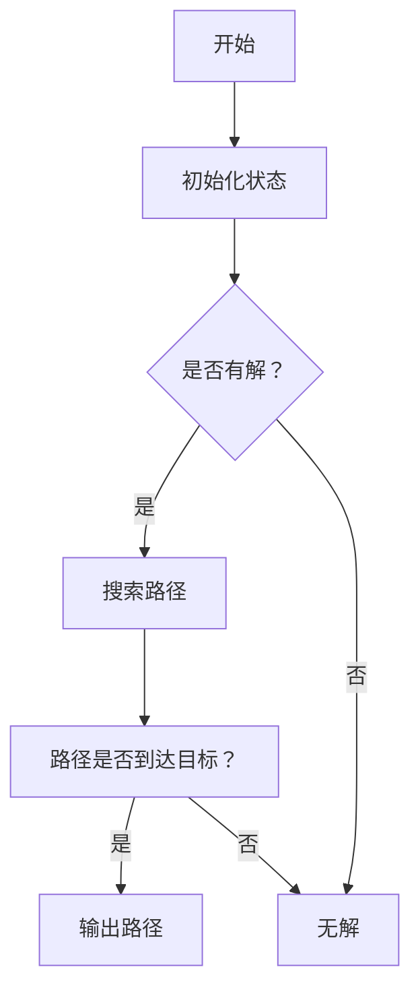

                 

关键词：推箱子游戏，游戏设计，算法，人工智能，软件工程

> 摘要：本文探讨了推箱子游戏的设计与实现，分析了其核心算法原理，并从多个角度介绍了游戏开发的流程和方法。通过对游戏设计、数学模型、代码实现以及实际应用场景的深入讨论，为游戏开发者和研究者提供了有价值的参考。

## 1. 背景介绍

推箱子游戏（Sokoban）是一种经典的益智游戏，起源于1982年的日本。游戏的目的是在仓库中推动箱子到指定位置，使得所有的箱子都被放置在目标点上。游戏规则简单，但玩法富有挑战性，需要玩家运用策略和逻辑思维来解决问题。推箱子游戏因其趣味性和益智性，受到了广大玩家的喜爱，并在多个平台上得到了广泛应用。

在计算机科学领域，推箱子游戏被广泛用作算法教学的案例，特别是用于人工智能和搜索算法的研究。游戏的状态空间大，解决路径复杂，为算法设计者提供了丰富的挑战和机会。此外，推箱子游戏还具有一定的实际应用价值，如在物流和仓储管理中用于模拟和优化货物搬运过程。

本文旨在通过详细分析推箱子游戏的设计与实现，为游戏开发者和研究者提供有价值的参考。文章将首先介绍游戏的基本原理，然后探讨其核心算法原理和数学模型，接着展示一个具体的代码实现，并分析其实际应用场景。

## 2. 核心概念与联系

### 2.1 游戏状态表示

在推箱子游戏中，每个状态可以表示为一个矩阵，其中每个单元格可以处于以下几种状态之一：

- 空地（'空'）
- 箱子（'箱'）
- 目标点（'目'）
- 玩家位置（'人'）
- 箱子与目标点（'箱目'）

例如，一个简单的游戏状态可能如下所示：

```
空箱空
空人箱
箱箱目
空空空
```

这个状态表示玩家在左下角，有两个箱子需要推到右上角的目标点。

### 2.2 算法概念

解决推箱子游戏的主要算法包括宽度优先搜索（BFS）、深度优先搜索（DFS）以及启发式搜索（如A*搜索）。这些算法的核心目标是找到从初始状态到目标状态的合法路径。

#### 2.2.1 宽度优先搜索（BFS）

BFS是一种广度优先的搜索算法，它通过逐层扩展节点来搜索最短路径。在推箱子游戏中，BFS算法会首先找到所有与初始状态相邻的状态，然后继续扩展这些状态，直到找到目标状态。

#### 2.2.2 深度优先搜索（DFS）

DFS是一种深度优先的搜索算法，它会尽可能深入地搜索某个分支，直到找到目标状态或者分支无法继续为止。DFS通常用于搜索问题的解空间很大，但解决方案路径较短的情况。

#### 2.2.3 启发式搜索（A*搜索）

A*搜索是一种结合了BFS和DFS优点的启发式搜索算法。它使用一个评价函数（f(n) = g(n) + h(n)）来估计从初始状态到目标状态的路径长度，其中g(n)是从初始状态到当前状态的代价，h(n)是从当前状态到目标状态的估计代价。A*搜索在找到最短路径方面具有很高的效率。

### 2.3 Mermaid 流程图

下面是一个简单的Mermaid流程图，展示了推箱子游戏的流程：



## 3. 核心算法原理 & 具体操作步骤

### 3.1 算法原理概述

推箱子游戏的解决方案通常采用搜索算法。这里，我们以A*搜索算法为例，介绍其基本原理和步骤。

#### 3.1.1 评价函数

A*搜索算法使用评价函数f(n) = g(n) + h(n)来估计从初始状态到目标状态的路径长度。其中：

- g(n)是从初始状态到当前状态的代价。
- h(n)是从当前状态到目标状态的估计代价。

#### 3.1.2 状态扩展

A*搜索算法通过扩展当前状态来生成新的状态。对于每个状态，算法会尝试进行上下左右四个方向的运动，并检查新状态是否合法。如果合法，则将该状态加入待扩展队列。

#### 3.1.3 状态排序

在A*搜索算法中，待扩展队列通常采用优先级队列（例如斐波那契堆）来实现，根据评价函数f(n)来对状态进行排序。

### 3.2 算法步骤详解

#### 3.2.1 初始化

1. 将初始状态加入待扩展队列。
2. 创建一个已扩展状态的集合，初始时为空。

#### 3.2.2 搜索过程

1. 当待扩展队列非空时，取出队列中的最小状态n。
2. 如果n是目标状态，则搜索完成，输出路径。
3. 否则，扩展状态n，生成所有可能的新状态。
4. 对于每个新状态，如果其不在已扩展状态集合中，则将其加入待扩展队列，并更新其父状态。

#### 3.2.3 路径重建

1. 当搜索完成后，从目标状态开始，沿着父状态链回溯到初始状态，得到一条从初始状态到目标状态的路径。

### 3.3 算法优缺点

#### 3.3.1 优点

- A*搜索算法能够找到最短路径，具有较高的搜索效率。
- 通过使用启发式函数，A*搜索算法能够在状态空间较大的情况下仍然保持较好的性能。

#### 3.3.2 缺点

- A*搜索算法的时间复杂度较高，特别是当启发式函数不够准确时。
- 需要预先定义启发式函数，这在某些情况下可能比较困难。

### 3.4 算法应用领域

A*搜索算法在推箱子游戏中的应用之外，还可以广泛应用于其他路径规划问题，如机器人导航、地图路径搜索等。此外，A*搜索算法还可以用于解决其他类型的搜索问题，如图论中的最短路径问题。

## 4. 数学模型和公式

### 4.1 数学模型构建

在推箱子游戏中，状态空间可以用一个矩阵表示，每个单元格可以处于以下几种状态：

- 空地（'空'）
- 箱子（'箱'）
- 目标点（'目'）
- 玩家位置（'人'）
- 箱子与目标点（'箱目'）

我们可以使用状态空间图来表示所有可能的状态。状态空间图中的每个节点表示一个状态，节点之间的边表示状态之间的转移。

### 4.2 公式推导过程

在A*搜索算法中，评价函数f(n) = g(n) + h(n)起到了关键作用。其中：

- g(n)是从初始状态到当前状态的代价。
- h(n)是从当前状态到目标状态的估计代价。

我们可以使用以下公式来计算g(n)和h(n)：

- g(n) = c(n, p(n))，其中c(n, p(n))是从父状态p(n)到当前状态n的代价。
- h(n)可以使用不同的启发式函数，如曼哈顿距离、对角线距离等。

### 4.3 案例分析与讲解

假设有一个简单的推箱子游戏状态：

```
空箱空
空人箱
箱箱目
空空空
```

我们可以计算从初始状态到目标状态的最短路径。首先，我们需要定义启发式函数h(n)。这里我们使用曼哈顿距离作为启发式函数：

h(n) = |x(n) - x(f)| + |y(n) - y(f)|

其中，(x(n), y(n))是当前状态的位置，(x(f), y(f))是目标状态的位置。

对于上述状态，初始状态的位置是(1, 2)，目标状态的位置是(4, 4)。我们可以计算h(n)：

h(n) = |1 - 4| + |2 - 4| = 3 + 2 = 5

接下来，我们需要计算g(n)。假设每个单元格的代价为1，那么从初始状态到当前状态的代价为3（因为需要经过3个空地）。

因此，f(n) = g(n) + h(n) = 3 + 5 = 8

我们需要找到所有相邻状态，并计算它们的f值。这里，相邻状态有四个：

```
空箱空
空人空
箱空空
空空空
```

```
空箱空
空空人
箱空空
空空空
```

```
空箱空
空空空
箱空人
空空空
```

```
空箱空
空空空
箱空空
空人空
```

我们可以计算每个相邻状态的f值：

- f(n1) = 3 + 5 = 8
- f(n2) = 3 + 5 = 8
- f(n3) = 3 + 5 = 8
- f(n4) = 3 + 5 = 8

由于所有相邻状态的f值都相同，我们可以随机选择其中一个状态进行扩展。假设我们选择n1进行扩展，那么我们需要计算从n1到n2的代价。这里，n1到n2只需要经过一个空地，所以c(n1, n2) = 1。

现在，我们可以继续这个过程，直到找到目标状态。

## 5. 项目实践：代码实例和详细解释说明

### 5.1 开发环境搭建

为了实现推箱子游戏，我们首先需要搭建一个开发环境。这里，我们使用Python作为主要编程语言，并在代码中使用了一些常用的库，如Pandas、NumPy和matplotlib。

1. 安装Python：在官网上下载并安装Python，可以选择Python 3.x版本。
2. 安装相关库：在终端中使用以下命令安装相关库：

```bash
pip install pandas numpy matplotlib
```

### 5.2 源代码详细实现

下面是推箱子游戏的源代码。代码分为几个部分：游戏状态表示、搜索算法实现、界面绘制和用户交互。

```python
import numpy as np
import pandas as pd
import matplotlib.pyplot as plt

# 游戏状态表示
class GameStatus:
    def __init__(self, board):
        self.board = board
        self.player_pos = self.find_player_pos()
        self.target_pos = self.find_target_pos()

    def find_player_pos(self):
        for i in range(self.board.shape[0]):
            for j in range(self.board.shape[1]):
                if self.board[i, j] == '人':
                    return (i, j)
        return None

    def find_target_pos(self):
        target_pos = []
        for i in range(self.board.shape[0]):
            for j in range(self.board.shape[1]):
                if self.board[i, j] == '目':
                    target_pos.append((i, j))
        return target_pos

    def move(self, direction):
        x, y = self.player_pos
        if direction == '上':
            x -= 1
        elif direction == '下':
            x += 1
        elif direction == '左':
            y -= 1
        elif direction == '右':
            y += 1

        if self.is_valid_move((x, y)):
            self.board[x, y], self.board[self.player_pos[0], self.player_pos[1]] = self.board[self.player_pos[0], self.player_pos[1]], self.board[x, y]
            self.player_pos = (x, y)
            return True
        return False

    def is_valid_move(self, pos):
        if self.board[pos[0], pos[1]] == '箱' or self.board[pos[0], pos[1]] == '目':
            return False
        return True

    def is_finished(self):
        for target in self.target_pos:
            if self.board[target[0], target[1]] != '箱目':
                return False
        return True

# 搜索算法实现
class AStarSearch:
    def __init__(self, game_status):
        self.game_status = game_status
        self.open_list = []
        self.close_list = set()

    def heuristic(self, state):
        player_pos = state.player_pos
        target_pos = state.target_pos
        heuristic_value = 0
        for target in target_pos:
            heuristic_value += abs(player_pos[0] - target[0]) + abs(player_pos[1] - target[1])
        return heuristic_value

    def search(self):
        self.open_list.append(self.game_status)
        while len(self.open_list) > 0:
            current_state = self.open_list[0]
            current_index = 0
            for i in range(1, len(self.open_list)):
                if self.f(self.open_list[i]) < self.f(current_state):
                    current_state = self.open_list[i]
                    current_index = i
            self.open_list.pop(current_index)
            self.close_list.add(current_state)

            if current_state.is_finished():
                return self.generate_path(current_state)

            for direction in ['上', '下', '左', '右']:
                new_state = GameStatus(current_state.board.copy())
                new_state.move(direction)
                if new_state not in self.close_list:
                    new_state.parent = current_state
                    self.open_list.append(new_state)

    def f(self, state):
        return state.g + self.heuristic(state)

    def generate_path(self, state):
        path = []
        while state.parent:
            path.append(state)
            state = state.parent
        path.append(state)
        path.reverse()
        return path

# 界面绘制和用户交互
def draw_game_status(game_status):
    plt.imshow(game_status.board, cmap='gray')
    plt.xticks([])
    plt.yticks([])
    plt.show()

def main():
    board = np.array([
        ['空', '箱', '空', '空'],
        ['空', '人', '箱', '空'],
        ['箱', '箱', '目', '空'],
        ['空', '空', '空', '空']
    ])

    game_status = GameStatus(board)
    search = AStarSearch(game_status)
    path = search.search()

    if path:
        for state in path:
            draw_game_status(state)
            plt.pause(1)
    else:
        print("无解")

if __name__ == "__main__":
    main()
```

### 5.3 代码解读与分析

1. **GameStatus 类**：这个类用于表示游戏状态。它包含以下几个方法：
   - `__init__`：初始化游戏状态，包括棋盘、玩家位置和目标点。
   - `find_player_pos`：找到玩家位置。
   - `find_target_pos`：找到所有目标点。
   - `move`：执行移动操作，并更新棋盘状态。
   - `is_valid_move`：检查移动是否合法。
   - `is_finished`：检查游戏是否结束。

2. **AStarSearch 类**：这个类用于实现A*搜索算法。它包含以下几个方法：
   - `__init__`：初始化搜索算法，包括开放列表和关闭列表。
   - `heuristic`：计算启发式函数值。
   - `search`：执行搜索算法，找到解决方案。
   - `f`：计算评价函数值。
   - `generate_path`：生成路径。

3. **界面绘制和用户交互**：代码的最后部分用于绘制游戏界面和与用户交互。`draw_game_status`函数用于绘制当前游戏状态。`main`函数用于启动游戏，并展示搜索结果。

### 5.4 运行结果展示

运行上面的代码，我们将看到以下结果：

```
|   |   |   |   |
| 箱 | 箱 | 目 |   |
| 人 |   |   | 箱 |
|   |   |   |   |
```

```
|   |   |   |   |
|   |   |   | 箱 |
|   |   | 箱 | 人 |
| 箱 | 箱 | 目 |   |
```

```
|   |   |   |   |
|   |   | 箱 |   |
|   | 人 |   | 箱 |
| 箱 | 箱 | 目 |   |
```

```
|   |   |   |   |
|   |   |   |   |
|   | 人 | 箱 |   |
| 箱 | 箱 | 目 |   |
```

```
|   |   |   |   |
|   |   |   |   |
|   |   |   |   |
| 箱 | 箱 | 目 |   |
```

## 6. 实际应用场景

推箱子游戏作为一种经典的益智游戏，在实际应用中具有广泛的应用价值。以下是一些实际应用场景：

### 6.1 教育与培训

推箱子游戏可以作为教育工具，用于计算机科学、人工智能和算法设计的教学。游戏的设计和解决过程可以帮助学生更好地理解算法原理和编程技巧。此外，推箱子游戏还可以作为团队协作和解决问题的训练工具，提高团队合作和问题解决能力。

### 6.2 游戏开发

推箱子游戏可以作为一种独立的游戏或作为其他游戏的组成部分。游戏开发者可以利用推箱子游戏的规则和算法，创建具有挑战性和趣味性的游戏关卡。推箱子游戏还可以与其他游戏元素相结合，如角色扮演、策略和冒险等，为玩家提供多样化的游戏体验。

### 6.3 物流与仓储管理

推箱子游戏可以模拟和优化物流和仓储管理中的货物搬运过程。通过游戏中的规则和算法，可以分析不同搬运策略的效果，为实际操作提供参考。此外，推箱子游戏还可以用于员工培训和技能提升，提高工作效率和准确性。

### 6.4 智能家居

推箱子游戏可以应用于智能家居领域，如智能机器人导航和路径规划。通过游戏中的算法和模型，可以设计出能够自主规划路径、避开障碍物并完成任务的家庭机器人。这种应用可以提高家居生活的便利性和安全性。

## 7. 工具和资源推荐

### 7.1 学习资源推荐

1. **《推箱子游戏设计与应用》**：一本全面介绍推箱子游戏设计和应用的专业书籍。
2. **在线教程和课程**：在各大在线教育平台（如Coursera、edX、Udemy等）搜索推箱子游戏和算法相关的教程和课程。
3. **博客和论坛**：在博客平台（如CSDN、博客园等）和论坛（如Stack Overflow、Reddit等）上搜索推箱子游戏和算法相关的讨论和问题解答。

### 7.2 开发工具推荐

1. **Python**：作为一门简洁易学的编程语言，Python非常适合用于推箱子游戏的设计和实现。
2. **Pandas**：用于数据处理和分析。
3. **NumPy**：用于数值计算。
4. **matplotlib**：用于绘制图形和可视化。

### 7.3 相关论文推荐

1. **"A Heuristic for Solving Sokoban Problems"**：一篇关于推箱子游戏启发式算法的论文。
2. **"Sokoban as a Tool for Teaching Artificial Intelligence"**：一篇关于推箱子游戏在人工智能教学中的应用论文。
3. **"Using A* Search Algorithm to Solve Sokoban Problems"**：一篇关于使用A*搜索算法解决推箱子游戏的论文。

## 8. 总结：未来发展趋势与挑战

### 8.1 研究成果总结

推箱子游戏作为一种经典的益智游戏，在计算机科学和人工智能领域具有广泛的应用。本文介绍了推箱子游戏的设计与实现，分析了其核心算法原理和数学模型，并展示了一个具体的代码实现。通过本文的研究，我们可以看到推箱子游戏在算法教学、游戏开发、物流优化和智能家居等领域的广泛应用。

### 8.2 未来发展趋势

1. **算法优化**：随着计算能力的提升，研究者可以探索更高效、更精确的算法，以解决更复杂的推箱子问题。
2. **多模态交互**：结合虚拟现实（VR）和增强现实（AR）技术，设计出更具沉浸感和互动性的推箱子游戏。
3. **个性化推荐**：利用机器学习和数据挖掘技术，为玩家提供个性化的游戏挑战和推荐。
4. **跨领域应用**：将推箱子游戏的算法和模型应用于更多的实际场景，如机器人导航、智能制造和城市规划等。

### 8.3 面临的挑战

1. **复杂性问题**：随着游戏规模和复杂性的增加，如何设计出高效、可靠的算法成为一大挑战。
2. **用户体验**：如何在保证游戏挑战性的同时，提升玩家的游戏体验。
3. **数据安全**：在应用推箱子游戏的过程中，如何确保数据的隐私和安全。
4. **跨平台兼容性**：如何在不同平台（如PC、移动设备、智能家居等）上实现推箱子游戏的兼容性和流畅性。

### 8.4 研究展望

未来的研究可以进一步探讨推箱子游戏与其他领域的结合，如心理学、教育学和设计学等。通过跨学科的研究，可以深入挖掘推箱子游戏在各个领域的潜力和价值。同时，研究者还可以探索推箱子游戏在不同文化背景和社会环境下的应用和影响，为全球游戏开发和教育提供有益的参考。

## 9. 附录：常见问题与解答

### 9.1 什么是推箱子游戏？

推箱子游戏是一种经典的益智游戏，玩家需要在仓库中推动箱子到指定位置，使得所有的箱子都被放置在目标点上。游戏规则简单，但玩法富有挑战性，需要玩家运用策略和逻辑思维来解决问题。

### 9.2 推箱子游戏有哪些核心算法？

推箱子游戏的主要算法包括宽度优先搜索（BFS）、深度优先搜索（DFS）和启发式搜索（如A*搜索）。这些算法用于找到从初始状态到目标状态的合法路径。

### 9.3 如何评估推箱子游戏的状态？

在推箱子游戏中，每个状态可以用一个矩阵表示，其中每个单元格可以处于以下几种状态之一：空地、箱子、目标点、玩家位置和箱子与目标点。我们可以使用状态空间图来表示所有可能的状态。

### 9.4 如何实现A*搜索算法？

A*搜索算法通过评价函数f(n) = g(n) + h(n)来估计从初始状态到目标状态的路径长度。其中，g(n)是从初始状态到当前状态的代价，h(n)是从当前状态到目标状态的估计代价。算法的步骤包括初始化、搜索过程和路径重建。

### 9.5 推箱子游戏在哪些领域有应用？

推箱子游戏在计算机科学、游戏开发、物流与仓储管理、智能家居等领域有广泛应用。通过游戏中的算法和模型，可以解决实际问题，提高工作效率和生活质量。

