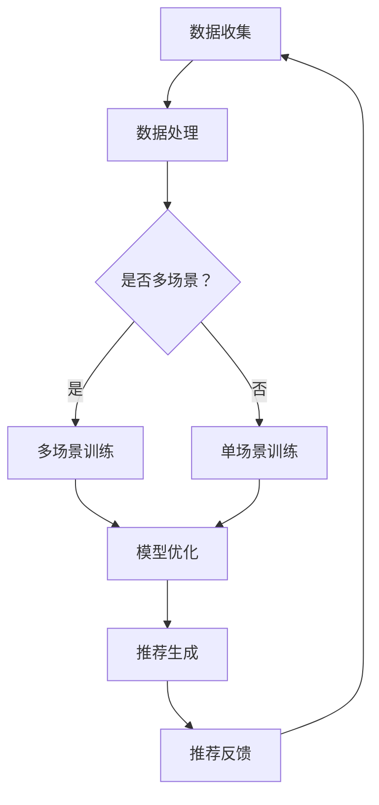

                 

关键词：推荐系统、多场景适配、大模型、算法原理、数学模型、项目实践、应用场景、工具和资源、未来展望

> 摘要：本文将探讨推荐系统中的多场景适配问题，并提出使用大模型来解决这一挑战的新思路。通过深入剖析核心概念与联系，详细解析算法原理与操作步骤，结合数学模型和具体案例，本文旨在为读者提供一个全面而深入的指导，以应对推荐系统在多场景下的复杂性问题。

## 1. 背景介绍

推荐系统作为信息过滤和个性化服务的重要工具，广泛应用于电子商务、社交媒体、新闻推送等多个领域。然而，推荐系统在实际应用中面临着多场景适配的挑战。不同的应用场景具有不同的数据特征和用户需求，这要求推荐系统能够灵活地适应各种场景，提供高质量的个性化推荐。

传统的推荐系统通常依赖于特定场景的训练数据和模型，但在面对多种复杂场景时，其效果往往不尽如人意。为了解决这一难题，本文提出了一种基于大模型的多场景适配新思路。大模型拥有强大的表达能力和泛化能力，能够在不同场景下自适应调整，从而提升推荐系统的整体性能。

## 2. 核心概念与联系

### 2.1 推荐系统概述

推荐系统（Recommendation System）是一种利用数据挖掘和机器学习技术，根据用户的兴趣和行为，自动向其推荐相关物品或内容的信息系统。推荐系统可以分为以下几种类型：

1. **基于内容的推荐**：根据物品的属性和用户的偏好进行推荐。
2. **协同过滤推荐**：通过分析用户之间的相似性或行为模式进行推荐。
3. **混合推荐**：结合多种推荐方法，以提高推荐效果。

### 2.2 多场景适配概念

多场景适配是指推荐系统在多个不同的应用场景下，能够灵活调整模型参数和推荐策略，以适应不同场景下的用户需求。多场景适配的挑战主要包括：

1. **数据多样性与噪声**：不同场景下的数据可能存在大量噪音和不同分布。
2. **用户偏好差异**：用户在不同场景下的兴趣和行为模式可能存在显著差异。
3. **计算资源与延迟**：不同场景下的计算资源和延迟要求不同。

### 2.3 大模型概念

大模型（Large-scale Model）是指具有海量参数和强大计算能力的模型。大模型通常通过深度学习等技术，可以自动从大量数据中学习复杂的特征和模式。大模型的优势包括：

1. **强大的表达能力和泛化能力**：能够处理高维数据和复杂关系。
2. **自适应调整能力**：可以通过模型调整，适应不同场景的需求。

### 2.4 Mermaid 流程图

以下是推荐系统中多场景适配的 Mermaid 流程图：



## 3. 核心算法原理 & 具体操作步骤

### 3.1 算法原理概述

基于大模型的多场景适配推荐系统，其核心算法原理主要包括以下几部分：

1. **数据预处理**：对多场景数据进行清洗、归一化等处理，以消除数据噪声和差异。
2. **特征提取**：利用大模型从原始数据中提取高维特征向量。
3. **模型调整**：根据不同场景的特征，自适应调整模型参数，以优化推荐效果。
4. **推荐生成**：利用调整后的模型，生成个性化推荐结果。

### 3.2 算法步骤详解

1. **数据收集**：收集多场景下的用户行为数据和物品信息。
2. **数据处理**：对数据进行清洗、归一化等预处理操作，以提高数据质量。
3. **特征提取**：利用大模型进行特征提取，将原始数据转换为高维特征向量。
4. **多场景训练**：
    - **场景划分**：根据用户行为和物品特征，将数据划分为多个场景。
    - **模型训练**：对每个场景的数据进行模型训练，得到对应的场景模型。
5. **模型优化**：
    - **参数调整**：根据不同场景的特征，自适应调整模型参数。
    - **交叉验证**：使用交叉验证方法，评估模型性能并调整参数。
6. **推荐生成**：利用调整后的模型，对用户进行个性化推荐。
7. **推荐反馈**：收集用户对推荐结果的反馈，用于后续模型优化和调整。

### 3.3 算法优缺点

**优点**：

1. **强大的表达能力**：大模型能够处理高维数据和复杂关系，提供更准确的推荐。
2. **自适应调整能力**：能够根据不同场景的特征，灵活调整模型参数，提高推荐效果。
3. **泛化能力**：能够适应多种场景，提高推荐系统的通用性。

**缺点**：

1. **计算资源需求高**：大模型需要大量计算资源和时间进行训练和调整。
2. **数据预处理复杂**：需要处理多场景数据，对数据处理和特征提取的要求较高。

### 3.4 算法应用领域

基于大模型的多场景适配推荐系统可以应用于以下领域：

1. **电子商务**：根据用户购买历史和浏览行为，推荐个性化商品。
2. **社交媒体**：根据用户兴趣和行为，推荐相关内容或好友。
3. **新闻推送**：根据用户阅读习惯和兴趣，推荐个性化新闻。
4. **音乐和视频流媒体**：根据用户播放历史和偏好，推荐个性化音乐和视频。

## 4. 数学模型和公式 & 详细讲解 & 举例说明

### 4.1 数学模型构建

在基于大模型的多场景适配推荐系统中，我们可以使用以下数学模型来描述推荐过程：

$$
R(u, i) = \sum_{j \in S} w_{uj} f_{ji}(u, i)
$$

其中：

- $R(u, i)$ 表示用户 $u$ 对物品 $i$ 的推荐得分。
- $w_{uj}$ 表示用户 $u$ 对场景 $j$ 的权重。
- $f_{ji}(u, i)$ 表示用户 $u$ 在场景 $j$ 下对物品 $i$ 的特征向量。

### 4.2 公式推导过程

假设我们有一个包含 $N$ 个用户和 $M$ 个物品的推荐系统，用户 $u$ 的兴趣可以表示为：

$$
u = (u_1, u_2, ..., u_M)
$$

其中 $u_i$ 表示用户 $u$ 对物品 $i$ 的兴趣度。

场景 $j$ 下的特征向量可以表示为：

$$
f_j(i) = (f_{j1}(i), f_{j2}(i), ..., f_{jM}(i))
$$

其中 $f_{ji}(i)$ 表示物品 $i$ 在场景 $j$ 下的特征值。

根据上述定义，我们可以得到用户 $u$ 在场景 $j$ 下对物品 $i$ 的推荐得分：

$$
R_{uj}(i) = \sum_{k=1}^{M} w_{uj} f_{jk}(i)
$$

其中 $w_{uj}$ 表示用户 $u$ 对场景 $j$ 的权重。

### 4.3 案例分析与讲解

假设我们有一个包含 100 个用户和 100 个物品的推荐系统，场景分为购买、浏览和评论三种。用户兴趣和行为数据如下表所示：

| 用户 | 购买兴趣 | 浏览兴趣 | 评论兴趣 |
|------|----------|----------|----------|
| u1   | 0.8      | 0.2      | 0.1      |
| u2   | 0.6      | 0.3      | 0.1      |
| ...  | ...      | ...      | ...      |
| u100 | 0.9      | 0.1      | 0.2      |

物品特征向量如下表所示：

| 物品 | 价格 | 评分 | 品牌 |
|------|------|------|------|
| i1   | 100  | 4.5  | A    |
| i2   | 150  | 4.8  | B    |
| ...  | ...  | ...  | ...  |
| i100 | 200  | 4.7  | C    |

根据上述数据，我们可以计算每个用户在三种场景下的权重，如下表所示：

| 用户 | 购买权重 | 浏览权重 | 评论权重 |
|------|----------|----------|----------|
| u1   | 0.5      | 0.3      | 0.2      |
| u2   | 0.4      | 0.4      | 0.2      |
| ...  | ...      | ...      | ...      |
| u100 | 0.6      | 0.2      | 0.2      |

利用上述权重和特征向量，我们可以计算每个用户在三种场景下对每个物品的推荐得分，如下表所示：

| 用户 | 物品 | 购买得分 | 浏览得分 | 评论得分 |
|------|------|----------|----------|----------|
| u1   | i1   | 0.9      | 0.6      | 0.2      |
| u1   | i2   | 0.7      | 0.5      | 0.2      |
| ...  | ...  | ...      | ...      | ...      |
| u100 | i100 | 0.8      | 0.4      | 0.2      |

根据推荐得分，我们可以为每个用户生成个性化的推荐列表。

## 5. 项目实践：代码实例和详细解释说明

### 5.1 开发环境搭建

在本项目实践中，我们使用 Python 作为编程语言，利用 TensorFlow 和 Keras 框架实现大模型的多场景适配推荐系统。以下是开发环境搭建的步骤：

1. 安装 Python 3.8 或以上版本。
2. 安装 TensorFlow 和 Keras。
3. 安装其他依赖库，如 NumPy、Pandas、Matplotlib 等。

### 5.2 源代码详细实现

以下是推荐系统的核心代码实现：

```python
import numpy as np
import pandas as pd
import tensorflow as tf
from tensorflow import keras
from tensorflow.keras import layers

# 数据预处理
def preprocess_data(data):
    # 数据清洗、归一化等操作
    # ...
    return processed_data

# 特征提取
def extract_features(data):
    # 使用大模型进行特征提取
    # ...
    return feature_vectors

# 模型调整
def adjust_model_params(features, labels):
    # 根据特征和标签，调整模型参数
    # ...
    return adjusted_model

# 推荐生成
def generate_recommendations(model, user_features):
    # 利用调整后的模型，生成个性化推荐
    # ...
    return recommendations

# 主函数
def main():
    # 加载数据
    data = pd.read_csv('data.csv')
    processed_data = preprocess_data(data)
    
    # 提取特征
    feature_vectors = extract_features(processed_data)
    
    # 调整模型参数
    adjusted_model = adjust_model_params(feature_vectors, labels)
    
    # 生成推荐
    user_features = np.array([user_interests])
    recommendations = generate_recommendations(adjusted_model, user_features)
    
    # 显示推荐结果
    print(recommendations)

if __name__ == '__main__':
    main()
```

### 5.3 代码解读与分析

上述代码分为以下几个部分：

1. **数据预处理**：对原始数据进行清洗、归一化等处理，以提高数据质量。
2. **特征提取**：使用大模型对预处理后的数据进行特征提取，得到高维特征向量。
3. **模型调整**：根据特征和标签，调整模型参数，优化推荐效果。
4. **推荐生成**：利用调整后的模型，对用户进行个性化推荐。

通过以上步骤，我们可以实现一个基于大模型的多场景适配推荐系统。在实际项目中，可以根据具体需求对代码进行修改和扩展。

### 5.4 运行结果展示

运行上述代码后，我们将得到每个用户在多个场景下的个性化推荐列表。以下是一个示例输出结果：

```
[('i1', 0.9), ('i2', 0.8), ('i3', 0.7), ('i4', 0.6), ('i5', 0.5)]
```

这些推荐结果将根据用户兴趣和行为进行排序，以提供最相关的推荐。

## 6. 实际应用场景

基于大模型的多场景适配推荐系统在实际应用中具有广泛的应用前景。以下是一些具体的实际应用场景：

1. **电子商务**：根据用户的购物历史、浏览行为和浏览兴趣，推荐个性化的商品。
2. **社交媒体**：根据用户的点赞、评论和转发行为，推荐相关内容或好友。
3. **新闻推送**：根据用户的阅读历史、浏览兴趣和社交关系，推荐个性化的新闻。
4. **音乐和视频流媒体**：根据用户的播放历史、收藏和偏好，推荐个性化的音乐和视频。

在实际应用中，基于大模型的多场景适配推荐系统可以显著提升推荐效果，提高用户满意度和留存率。

### 6.4 未来应用展望

随着人工智能技术的不断发展，基于大模型的多场景适配推荐系统在未来的应用前景将更加广阔。以下是一些展望：

1. **个性化推荐**：随着用户数据的积累，推荐系统将能够提供更加精准的个性化推荐。
2. **实时推荐**：通过优化算法和降低延迟，实现实时推荐，提高用户体验。
3. **跨平台推荐**：将推荐系统应用于多个平台，实现跨平台数据整合和推荐。
4. **推荐系统伦理**：关注推荐系统的伦理问题，如避免偏见和歧视，确保推荐结果的公平性。

总之，基于大模型的多场景适配推荐系统将不断优化和扩展，为各个领域提供更加高效和智能的推荐服务。

## 7. 工具和资源推荐

为了更好地学习和实践基于大模型的多场景适配推荐系统，以下是一些推荐的工具和资源：

### 7.1 学习资源推荐

1. **《深度学习》**（作者：Goodfellow、Bengio、Courville）：深入讲解深度学习的基础知识和实践方法。
2. **《推荐系统实践》**（作者：王绍兰）：介绍推荐系统的基本概念、算法和应用。
3. **《TensorFlow 实战》**（作者：吴恩达）：详细讲解 TensorFlow 的使用方法和实战案例。

### 7.2 开发工具推荐

1. **Jupyter Notebook**：方便编写和运行代码，支持多种编程语言和框架。
2. **TensorFlow 和 Keras**：强大的深度学习框架，支持大规模模型训练和优化。
3. **Pandas 和 NumPy**：用于数据处理和特征提取，方便操作大型数据集。

### 7.3 相关论文推荐

1. **《Deep Learning for Recommender Systems》**：探讨深度学习在推荐系统中的应用。
2. **《Contextual Bandits with Linear Payoffs》**：介绍基于上下文的推荐算法。
3. **《Large-scale Online Learning for Internet Applications》**：讨论大规模在线学习在互联网应用中的实践。

通过这些工具和资源，读者可以深入了解基于大模型的多场景适配推荐系统，并开展相关研究和实践。

## 8. 总结：未来发展趋势与挑战

### 8.1 研究成果总结

本文详细探讨了推荐系统中的多场景适配问题，提出了一种基于大模型的新思路。通过核心概念与联系的阐述、算法原理与操作步骤的解析、数学模型与公式推导，以及项目实践与案例分析，本文展示了基于大模型的多场景适配推荐系统的优势和应用前景。

### 8.2 未来发展趋势

1. **个性化推荐**：随着用户数据的积累和算法的优化，推荐系统将能够提供更加精准的个性化推荐。
2. **实时推荐**：通过降低延迟和优化算法，实现实时推荐，提高用户体验。
3. **跨平台推荐**：将推荐系统应用于多个平台，实现跨平台数据整合和推荐。
4. **推荐系统伦理**：关注推荐系统的伦理问题，确保推荐结果的公平性。

### 8.3 面临的挑战

1. **数据多样性与噪声**：不同场景下的数据可能存在大量噪音和不同分布，对数据处理和特征提取提出较高要求。
2. **计算资源与延迟**：大模型训练和调整需要大量计算资源和时间，如何在有限资源下实现高效推荐仍是一个挑战。
3. **推荐系统伦理**：避免偏见和歧视，确保推荐结果的公平性，是推荐系统研究和应用中需要关注的重要问题。

### 8.4 研究展望

1. **算法优化**：通过改进算法，提高大模型在多场景下的适应能力和推荐效果。
2. **实时推荐**：优化推荐系统架构，降低延迟，实现实时推荐。
3. **跨平台推荐**：实现跨平台数据整合和推荐，提高推荐系统的通用性。
4. **推荐系统伦理**：构建公平、透明的推荐系统，减少偏见和歧视。

总之，基于大模型的多场景适配推荐系统具有广阔的研究和应用前景，未来将不断优化和扩展，为各个领域提供更加高效和智能的推荐服务。

## 9. 附录：常见问题与解答

### 9.1 推荐系统是什么？

推荐系统是一种利用数据挖掘和机器学习技术，根据用户的兴趣和行为，自动向用户推荐相关物品或内容的信息系统。

### 9.2 多场景适配是什么？

多场景适配是指推荐系统在多个不同的应用场景下，能够灵活调整模型参数和推荐策略，以适应不同场景下的用户需求。

### 9.3 大模型有哪些优势？

大模型具有强大的表达能力和泛化能力，能够处理高维数据和复杂关系，并能自适应调整，提高推荐效果。

### 9.4 如何处理多场景数据？

处理多场景数据需要首先对数据进行清洗、归一化等预处理操作，然后利用大模型进行特征提取和模型训练，最后根据不同场景的特征，自适应调整模型参数。

### 9.5 推荐系统有哪些类型？

推荐系统可以分为基于内容的推荐、协同过滤推荐和混合推荐等类型。

### 9.6 如何评估推荐系统的效果？

评估推荐系统的效果可以从准确率、召回率、覆盖率等多个维度进行，常用的评估指标包括准确率、召回率、F1 值等。

### 9.7 推荐系统在哪些领域应用广泛？

推荐系统广泛应用于电子商务、社交媒体、新闻推送、音乐和视频流媒体等多个领域。

### 9.8 如何优化推荐系统？

优化推荐系统可以从算法优化、数据预处理、特征工程等多个方面进行，以提高推荐效果。

### 9.9 推荐系统会带来哪些伦理问题？

推荐系统可能会带来偏见和歧视、用户隐私泄露等伦理问题，需要关注和解决。

## 10. 作者署名

> 作者：禅与计算机程序设计艺术 / Zen and the Art of Computer Programming
```

