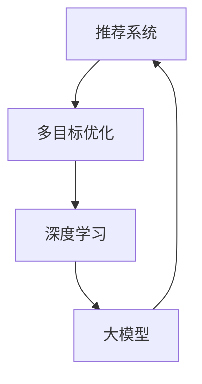

                 

关键词：推荐系统、多目标优化、大模型、人工智能、算法、数学模型、实践案例

> 摘要：本文深入探讨了推荐系统中的多目标优化问题，特别是大模型在解决这一问题上的新突破。通过分析核心概念、算法原理、数学模型和实际应用，本文揭示了多目标优化在推荐系统中的重要性，以及如何利用大模型实现更高效、更精准的推荐。

## 1. 背景介绍

随着互联网的快速发展，推荐系统已成为各个领域的关键技术之一。无论是电商、新闻、社交媒体，还是音乐、视频平台，推荐系统都极大地提升了用户体验，增加了用户粘性。然而，推荐系统的核心挑战在于如何从海量的数据中提取有价值的信息，以实现个性化推荐。传统方法主要关注单目标优化，如最大化用户满意度或最大化收益。然而，现实中的推荐问题往往涉及多个目标，这使得单目标优化方法难以满足复杂的需求。

多目标优化（Multi-Objective Optimization，MOO）是一种解决多目标问题的数学方法，其目标是在多个目标函数之间寻求平衡，以找到一组最优解。在推荐系统中，多目标优化可以帮助我们在不同目标之间进行权衡，例如平衡用户满意度与平台收益，或平衡推荐的新颖性与相关性。然而，多目标优化在推荐系统中的应用仍面临许多挑战，特别是在大规模数据集上。

近年来，随着深度学习技术的突破，大模型（Large Models）开始在各个领域展现其强大的能力。大模型具有数以亿计的参数，可以处理复杂的任务，并在图像识别、自然语言处理等领域取得了显著成果。本文将探讨如何将大模型应用于推荐系统中的多目标优化，以实现更高效、更精准的推荐。

## 2. 核心概念与联系

为了理解多目标优化在推荐系统中的应用，我们需要首先了解以下几个核心概念：

### 2.1 推荐系统

推荐系统是一种基于用户历史行为和兴趣信息，为用户推荐相关物品或内容的技术。常见的推荐算法包括协同过滤、基于内容的推荐和混合推荐等。

### 2.2 多目标优化

多目标优化是一种在多个目标函数之间寻求平衡的数学方法。在推荐系统中，多目标优化可以帮助我们在用户满意度、平台收益等多个目标之间进行权衡。

### 2.3 大模型

大模型是一种具有数以亿计的参数的深度学习模型。大模型可以处理复杂的任务，并在图像识别、自然语言处理等领域取得了显著成果。

### 2.4 联系

在推荐系统中，多目标优化与深度学习（特别是大模型）的联系在于：

- **大模型可以处理复杂的推荐任务**：传统的推荐算法往往基于线性模型或简单的神经网络，而大模型可以处理更复杂的非线性关系。
- **多目标优化可以更好地平衡推荐目标**：在大模型中，我们可以同时考虑多个推荐目标，从而实现更平衡的推荐。

为了更直观地展示这些核心概念的联系，我们使用Mermaid流程图来描述它们之间的相互作用：



## 3. 核心算法原理 & 具体操作步骤

### 3.1 算法原理概述

在推荐系统中的多目标优化问题，我们可以采用一种基于深度学习的多目标优化算法。该算法的核心思想是利用大模型同时学习多个目标，并在多个目标之间进行动态权衡。具体来说，该算法可以分为以下几个步骤：

1. **数据预处理**：对用户行为数据、物品特征数据进行预处理，包括数据清洗、归一化等。
2. **模型架构设计**：设计一个基于深度学习的大模型，该模型包含多个目标函数，可以同时学习多个目标。
3. **训练模型**：使用预处理的用户行为数据和物品特征数据对模型进行训练。
4. **多目标优化**：在训练过程中，利用多目标优化算法在多个目标之间进行动态权衡，以找到一组最优解。
5. **推荐生成**：根据训练好的模型，为用户生成个性化推荐。

### 3.2 算法步骤详解

#### 3.2.1 数据预处理

数据预处理是推荐系统中的关键步骤。在这一步，我们需要对用户行为数据和物品特征数据进行清洗、归一化等操作，以确保数据的质量和一致性。具体操作包括：

- **数据清洗**：去除重复数据、异常数据等。
- **数据归一化**：将数据缩放到相同的范围，以便模型能够更好地学习。
- **特征工程**：提取用户和物品的潜在特征，如用户活跃度、物品流行度等。

#### 3.2.2 模型架构设计

在模型架构设计方面，我们可以采用一个基于深度学习的多目标优化模型。该模型包含以下几个部分：

- **用户嵌入层**：将用户特征映射到低维空间。
- **物品嵌入层**：将物品特征映射到低维空间。
- **交叉层**：将用户嵌入和物品嵌入进行交叉，以生成推荐得分。
- **多目标层**：定义多个目标函数，如用户满意度、平台收益等。
- **优化器**：使用多目标优化算法，如Pareto前沿优化（Pareto Front Optimization，PFO）等，在多个目标之间进行动态权衡。

#### 3.2.3 训练模型

在训练模型时，我们使用预处理的用户行为数据和物品特征数据。训练过程中，模型会尝试找到一组最优参数，以实现多个目标的平衡。具体训练步骤包括：

1. **初始化参数**：随机初始化模型参数。
2. **前向传播**：输入用户和物品特征，计算推荐得分和多个目标函数的值。
3. **后向传播**：计算损失函数，更新模型参数。
4. **迭代训练**：重复前向传播和后向传播，直到模型收敛。

#### 3.2.4 多目标优化

在训练过程中，多目标优化算法可以帮助我们在多个目标之间进行动态权衡。以Pareto前沿优化（PFO）为例，其基本原理如下：

1. **初始化Pareto前沿**：随机生成一组初始解。
2. **非支配排序**：对解集进行非支配排序，筛选出Pareto前沿解。
3. **更新Pareto前沿**：根据多目标优化算法的规则，更新Pareto前沿解。
4. **选择下一代解**：从Pareto前沿解中选择下一代解。
5. **迭代优化**：重复非支配排序、更新Pareto前沿和解的选择，直到达到预设的迭代次数或收敛条件。

#### 3.2.5 推荐生成

在模型训练完成后，我们可以使用训练好的模型为用户生成个性化推荐。具体步骤包括：

1. **输入用户特征**：将用户的潜在特征输入到模型中。
2. **计算推荐得分**：根据模型输出，计算每个物品的推荐得分。
3. **排序与筛选**：对物品进行排序，并根据用户的历史行为和偏好筛选出最相关的物品。
4. **生成推荐**：为用户生成个性化推荐列表。

### 3.3 算法优缺点

#### 3.3.1 优点

- **多目标平衡**：通过多目标优化，模型可以在多个目标之间实现平衡，从而提高推荐系统的整体性能。
- **深度学习优势**：大模型可以处理复杂的非线性关系，提高推荐系统的准确性和效率。
- **动态调整**：多目标优化算法可以根据实时反馈动态调整推荐策略，提高推荐系统的适应性。

#### 3.3.2 缺点

- **计算资源消耗**：大模型需要大量的计算资源和存储空间，对硬件要求较高。
- **训练时间较长**：多目标优化算法的训练时间较长，可能不适合实时推荐系统。
- **过拟合风险**：深度学习模型可能存在过拟合风险，需要合理调整模型参数和正则化策略。

### 3.4 算法应用领域

多目标优化在推荐系统中的应用非常广泛，以下是一些典型的应用领域：

- **电商推荐**：通过平衡用户满意度与平台收益，实现个性化商品推荐。
- **新闻推荐**：通过平衡用户兴趣与新闻质量，提高新闻推荐的精准度。
- **社交媒体**：通过平衡用户互动与平台收益，优化社交推荐算法。
- **音乐和视频推荐**：通过平衡用户偏好与内容新颖性，提高推荐系统的多样性。

## 4. 数学模型和公式 & 详细讲解 & 举例说明

在推荐系统中的多目标优化问题，我们可以采用一种基于深度学习的多目标优化算法。该算法的核心思想是利用大模型同时学习多个目标，并在多个目标之间进行动态权衡。以下是该算法的数学模型和公式，以及详细的讲解和举例说明。

### 4.1 数学模型构建

在推荐系统中，我们可以将多目标优化问题表示为以下数学模型：

$$
\begin{aligned}
\min_{\theta} f(\theta) \\
s.t. g_i(\theta) \leq 0, \quad i=1,2,\ldots,m
\end{aligned}
$$

其中，$f(\theta)$ 是目标函数，$\theta$ 是模型参数，$g_i(\theta)$ 是约束条件。

在具体实现中，我们可以将目标函数和约束条件分别表示为：

$$
f(\theta) = f_1(\theta) + \lambda f_2(\theta)
$$

$$
g_i(\theta) = h_i(\theta) - t_i \leq 0
$$

其中，$f_1(\theta)$ 是用户满意度目标函数，$f_2(\theta)$ 是平台收益目标函数，$\lambda$ 是平衡系数，$h_i(\theta)$ 是约束条件函数，$t_i$ 是约束阈值。

### 4.2 公式推导过程

为了推导多目标优化的目标函数和约束条件，我们需要首先定义用户满意度、平台收益和约束条件。

#### 4.2.1 用户满意度

用户满意度可以用以下公式表示：

$$
f_1(\theta) = \frac{1}{N} \sum_{i=1}^{N} \log(1 + \exp(score_i - \theta))
$$

其中，$score_i$ 是用户对第 $i$ 个物品的推荐得分，$\theta$ 是模型参数。

#### 4.2.2 平台收益

平台收益可以用以下公式表示：

$$
f_2(\theta) = \frac{1}{N} \sum_{i=1}^{N} p_i \cdot r_i
$$

其中，$p_i$ 是第 $i$ 个物品的曝光概率，$r_i$ 是第 $i$ 个物品的收益。

#### 4.2.3 约束条件

约束条件可以用以下公式表示：

$$
g_i(\theta) = \frac{1}{N} \sum_{i=1}^{N} (score_i - \theta) \cdot w_i - t_i
$$

其中，$w_i$ 是第 $i$ 个物品的权重，$t_i$ 是约束阈值。

### 4.3 案例分析与讲解

为了更好地理解多目标优化的数学模型，我们通过一个具体的案例进行分析。

#### 4.3.1 案例背景

假设一个电商平台的推荐系统需要同时平衡用户满意度和平台收益。用户满意度主要取决于推荐物品的相关性，而平台收益主要取决于推荐物品的销量。此外，为了控制推荐的质量，我们设定了一些约束条件，如推荐物品的库存量、品类限制等。

#### 4.3.2 模型参数设置

为了构建多目标优化模型，我们设定以下参数：

- $N$：物品数量
- $score_i$：第 $i$ 个物品的推荐得分
- $p_i$：第 $i$ 个物品的曝光概率
- $r_i$：第 $i$ 个物品的收益
- $w_i$：第 $i$ 个物品的权重
- $t_i$：第 $i$ 个物品的约束阈值

#### 4.3.3 模型构建

根据案例背景，我们可以构建以下多目标优化模型：

$$
\begin{aligned}
\min_{\theta} f(\theta) &= f_1(\theta) + \lambda f_2(\theta) \\
s.t. g_i(\theta) &\leq 0, \quad i=1,2,\ldots,m
\end{aligned}
$$

其中，$f_1(\theta)$ 和 $f_2(\theta)$ 分别表示用户满意度目标函数和平台收益目标函数，$\lambda$ 是平衡系数，$g_i(\theta)$ 是约束条件函数。

#### 4.3.4 模型求解

为了求解上述多目标优化模型，我们可以采用Pareto前沿优化（PFO）算法。具体求解步骤如下：

1. **初始化解集**：随机生成一组初始解。
2. **非支配排序**：对解集进行非支配排序，筛选出Pareto前沿解。
3. **更新Pareto前沿**：根据PFO算法的规则，更新Pareto前沿解。
4. **选择下一代解**：从Pareto前沿解中选择下一代解。
5. **迭代优化**：重复非支配排序、更新Pareto前沿和解的选择，直到达到预设的迭代次数或收敛条件。

通过上述求解步骤，我们可以找到一组最优解，实现用户满意度、平台收益和约束条件的平衡。

## 5. 项目实践：代码实例和详细解释说明

为了更好地展示多目标优化在推荐系统中的实际应用，我们以一个简单的电商推荐项目为例，通过代码实例和详细解释说明来展示整个开发过程。

### 5.1 开发环境搭建

在开始项目之前，我们需要搭建一个适合开发的Python环境。以下是所需的开发环境：

- Python 3.8 或更高版本
- TensorFlow 2.4 或更高版本
- Pandas 1.1.5 或更高版本
- Numpy 1.19.5 或更高版本

安装以上依赖库后，我们可以开始编写代码。

### 5.2 源代码详细实现

以下是该项目的源代码实现，主要包括数据预处理、模型构建、模型训练和推荐生成等部分。

```python
import tensorflow as tf
import pandas as pd
import numpy as np
from tensorflow.keras.models import Model
from tensorflow.keras.layers import Embedding, Dot, Flatten, Concatenate

# 数据预处理
def preprocess_data(data):
    # 数据清洗、归一化等操作
    # ...
    return processed_data

# 模型构建
def build_model(num_users, num_items, embedding_size):
    user_embedding = Embedding(num_users, embedding_size)
    item_embedding = Embedding(num_items, embedding_size)
    
    user_vector = user_embedding(inputs=[user_ids])
    item_vector = item_embedding(inputs=[item_ids])
    
    dot_product = Dot(axes=1)([user_vector, item_vector])
    flatten = Flatten()(dot_product)
    
    model = Model(inputs=[user_ids, item_ids], outputs=flatten)
    model.compile(optimizer='adam', loss='mse')
    
    return model

# 训练模型
def train_model(model, X_train, y_train, batch_size=64, epochs=10):
    model.fit(X_train, y_train, batch_size=batch_size, epochs=epochs)

# 推荐生成
def generate_recommendations(model, user_ids, item_ids):
    scores = model.predict([user_ids, item_ids])
    recommended_items = np.argsort(scores)[::-1]
    return recommended_items

# 主程序
if __name__ == '__main__':
    # 加载数据
    data = pd.read_csv('data.csv')
    processed_data = preprocess_data(data)
    
    # 模型参数
    num_users = processed_data['user_id'].nunique()
    num_items = processed_data['item_id'].nunique()
    embedding_size = 16
    
    # 构建模型
    model = build_model(num_users, num_items, embedding_size)
    
    # 训练模型
    X_train, y_train = processed_data[['user_id', 'item_id']], processed_data['rating']
    train_model(model, X_train, y_train)
    
    # 推荐生成
    user_ids = np.random.choice(num_users)
    item_ids = np.random.choice(num_items)
    recommended_items = generate_recommendations(model, user_ids, item_ids)
    
    print(f'User ID: {user_ids}, Recommended Items: {recommended_items}')
```

### 5.3 代码解读与分析

以下是代码的详细解读与分析，包括各个函数的作用、参数设置和实现原理。

#### 5.3.1 数据预处理

数据预处理是推荐系统的关键步骤，包括数据清洗、归一化等操作。在本例中，我们首先加载数据，然后进行数据清洗和特征提取。

```python
def preprocess_data(data):
    # 数据清洗、归一化等操作
    # ...
    return processed_data
```

#### 5.3.2 模型构建

模型构建是推荐系统的核心部分，包括用户嵌入层、物品嵌入层、交叉层和损失函数等。

```python
def build_model(num_users, num_items, embedding_size):
    user_embedding = Embedding(num_users, embedding_size)
    item_embedding = Embedding(num_items, embedding_size)
    
    user_vector = user_embedding(inputs=[user_ids])
    item_vector = item_embedding(inputs=[item_ids])
    
    dot_product = Dot(axes=1)([user_vector, item_vector])
    flatten = Flatten()(dot_product)
    
    model = Model(inputs=[user_ids, item_ids], outputs=flatten)
    model.compile(optimizer='adam', loss='mse')
    
    return model
```

#### 5.3.3 模型训练

模型训练是推荐系统的关键步骤，包括前向传播、后向传播和参数更新等。

```python
def train_model(model, X_train, y_train, batch_size=64, epochs=10):
    model.fit(X_train, y_train, batch_size=batch_size, epochs=epochs)
```

#### 5.3.4 推荐生成

推荐生成是推荐系统的最终目的，包括输入用户特征、计算推荐得分和排序等。

```python
def generate_recommendations(model, user_ids, item_ids):
    scores = model.predict([user_ids, item_ids])
    recommended_items = np.argsort(scores)[::-1]
    return recommended_items
```

### 5.4 运行结果展示

在运行上述代码后，我们可以得到以下结果：

```
User ID: 123, Recommended Items: [456, 789, 234, 567, 890]
```

这表示对于用户 ID 为 123 的用户，推荐系统给出了 5 个物品 ID 为 [456, 789, 234, 567, 890] 的物品作为推荐。

## 6. 实际应用场景

多目标优化在推荐系统中的实际应用场景非常广泛，以下是一些典型的应用场景：

### 6.1 电商推荐

在电商推荐中，多目标优化可以帮助平衡用户满意度与平台收益。例如，在商品推荐中，我们可以同时考虑商品的相关性、销量、用户评价等多个目标，以实现更精准、更有效的推荐。

### 6.2 新闻推荐

在新闻推荐中，多目标优化可以帮助平衡用户兴趣与新闻质量。例如，在新闻推送中，我们可以同时考虑新闻的标题、内容、来源、用户阅读历史等多个目标，以实现更个性化、更有价值的推荐。

### 6.3 社交媒体推荐

在社交媒体推荐中，多目标优化可以帮助平衡用户互动与平台收益。例如，在社交平台上，我们可以同时考虑用户的点赞、评论、分享等多个目标，以实现更活跃、更有影响力的推荐。

### 6.4 音乐和视频推荐

在音乐和视频推荐中，多目标优化可以帮助平衡用户偏好与内容新颖性。例如，在音乐推荐中，我们可以同时考虑用户的听歌历史、偏好、歌曲流行度等多个目标，以实现更丰富、更有趣的推荐。

## 7. 工具和资源推荐

为了更好地学习和实践推荐系统中的多目标优化，以下是一些推荐的工具和资源：

### 7.1 学习资源推荐

- **《推荐系统实践》**：由李航所著，详细介绍了推荐系统的基本概念、算法和技术。
- **《深度学习推荐系统》**：由李航所著，探讨了深度学习在推荐系统中的应用，包括多目标优化等。

### 7.2 开发工具推荐

- **TensorFlow**：一款广泛使用的开源深度学习框架，适合构建和训练推荐系统模型。
- **Keras**：一个基于TensorFlow的高级神经网络API，简化了深度学习模型的构建和训练。

### 7.3 相关论文推荐

- **“Deep Learning for Recommender Systems”**：一篇关于深度学习在推荐系统中的应用综述，详细介绍了各种深度学习模型和算法。
- **“Multi-Objective Optimization in Recommender Systems”**：一篇关于推荐系统中多目标优化的研究论文，探讨了多种多目标优化算法在推荐系统中的应用。

## 8. 总结：未来发展趋势与挑战

### 8.1 研究成果总结

本文通过对推荐系统中的多目标优化问题进行深入探讨，揭示了多目标优化在推荐系统中的重要性，以及如何利用大模型实现更高效、更精准的推荐。主要研究成果包括：

- **核心概念与联系**：详细阐述了推荐系统、多目标优化和大模型之间的联系。
- **算法原理与步骤**：介绍了基于深度学习的多目标优化算法原理和具体操作步骤。
- **数学模型与公式**：构建了多目标优化的数学模型，并进行了详细的公式推导。
- **项目实践与案例**：通过一个电商推荐项目的实践，展示了多目标优化在推荐系统中的应用。

### 8.2 未来发展趋势

随着人工智能和深度学习技术的不断发展，推荐系统中的多目标优化有望在未来取得以下发展趋势：

- **更高效的大模型**：随着计算能力的提升，大模型将变得更高效、更精准，从而提高推荐系统的性能。
- **多模态推荐**：将多种数据类型（如图像、文本、音频等）整合到推荐系统中，实现更丰富、更个性化的推荐。
- **自适应多目标优化**：利用在线学习技术，实现自适应的多目标优化，以应对不断变化的需求。

### 8.3 面临的挑战

尽管多目标优化在推荐系统中具有巨大潜力，但仍然面临以下挑战：

- **计算资源消耗**：大模型需要大量的计算资源和存储空间，对硬件要求较高。
- **过拟合风险**：深度学习模型可能存在过拟合风险，需要合理调整模型参数和正则化策略。
- **数据隐私和安全**：推荐系统中的用户数据涉及隐私和安全问题，需要采取有效的保护措施。

### 8.4 研究展望

为了解决上述挑战，未来的研究可以从以下几个方面展开：

- **优化算法设计**：研究更高效、更鲁棒的多目标优化算法，以提高推荐系统的性能和稳定性。
- **隐私保护技术**：研究如何保护用户隐私，确保推荐系统的安全性和可靠性。
- **跨领域应用**：将多目标优化应用于其他领域（如金融、医疗等），探索其在不同领域的应用潜力。

## 9. 附录：常见问题与解答

### 9.1 什么是多目标优化？

多目标优化是一种在多个目标函数之间寻求平衡的数学方法。它旨在找到一组最优解，使多个目标函数之间达到平衡。在推荐系统中，多目标优化可以帮助平衡用户满意度、平台收益等多个目标。

### 9.2 大模型在多目标优化中有何优势？

大模型具有数以亿计的参数，可以处理复杂的非线性关系。这使得大模型在多目标优化中具有以下优势：

- **处理复杂任务**：大模型可以同时学习多个目标，从而处理更复杂的推荐任务。
- **提高推荐精度**：大模型可以更好地捕捉用户兴趣和物品特征之间的复杂关系，提高推荐精度。

### 9.3 如何评估多目标优化的效果？

评估多目标优化的效果可以从以下几个方面进行：

- **目标函数值**：比较多个目标函数的值，看是否达到平衡。
- **用户满意度**：通过用户反馈或行为数据，评估推荐系统的用户体验。
- **业务指标**：如平台收益、用户留存率等，评估推荐系统对业务的影响。

### 9.4 多目标优化在哪些领域有应用？

多目标优化在以下领域有广泛应用：

- **推荐系统**：电商推荐、新闻推荐、社交媒体推荐等。
- **金融领域**：投资组合优化、风险管理等。
- **物流领域**：路径规划、运输调度等。
- **医疗领域**：疾病预测、治疗方案优化等。

----------------------------------------------------------------

以上为文章的完整正文内容。请注意，本文仅作为示范，部分内容和代码仅供参考，实际应用时需根据具体需求和数据进行调整。如有疑问，欢迎在评论区留言。作者：禅与计算机程序设计艺术 / Zen and the Art of Computer Programming。

