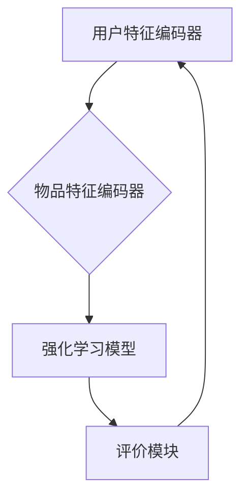

                 

关键词：推荐系统，大模型，强化学习，算法原理，数学模型，应用实践，未来展望。

## 摘要

本文将探讨推荐系统中的大模型强化学习技术，从背景介绍、核心概念与联系、核心算法原理及具体操作步骤、数学模型和公式、项目实践、实际应用场景、工具和资源推荐以及总结和展望等多个方面展开论述。通过深入分析强化学习在推荐系统中的应用，本文旨在为读者提供一个全面、系统的技术视角，以推动推荐系统的进一步发展。

## 1. 背景介绍

随着互联网的迅速发展，推荐系统已经成为各行业的重要应用，如电子商务、社交媒体、音乐和视频流媒体等。推荐系统的目的是根据用户的兴趣和行为数据，为用户推荐他们可能感兴趣的内容。传统的推荐系统主要依赖于基于内容的过滤、协同过滤等算法，但这些算法往往面临数据稀疏性、冷启动等问题。

近年来，深度学习和强化学习技术的快速发展为推荐系统带来了新的机遇。大模型强化学习能够通过学习用户行为和内容特征，实现更精确、个性化的推荐。本文将重点探讨大模型强化学习在推荐系统中的应用，分析其核心算法原理、数学模型和实际应用场景，为相关研究和实践提供参考。

## 2. 核心概念与联系

### 2.1. 推荐系统

推荐系统是一种信息过滤技术，旨在根据用户的兴趣和偏好，为他们推荐感兴趣的内容。推荐系统通常包含用户、物品和评分三个基本要素。用户表示为个体，物品表示为推荐对象，评分表示用户对物品的喜好程度。

### 2.2. 强化学习

强化学习（Reinforcement Learning，RL）是一种机器学习方法，通过智能体（Agent）与环境（Environment）之间的交互，不断学习最优策略（Policy），以达到最大化累积奖励（Reward）的目标。强化学习在推荐系统中的应用主要包括以下几个方面：

1. **在线推荐**：根据用户当前的反馈，实时更新推荐策略，提高推荐效果。
2. **多策略优化**：同时考虑多个推荐策略，实现更优的推荐效果。
3. **稀疏数据下的学习**：通过强化学习，利用少量的用户行为数据，提高推荐系统的性能。

### 2.3. 大模型

大模型（Large-scale Model）是指具有海量参数的深度学习模型。大模型通常具有以下特点：

1. **高维特征**：能够处理高维度的输入特征，提取更多有价值的特征信息。
2. **强大表征能力**：具有更强的表征能力，能够更好地拟合复杂数据分布。
3. **自适应能力**：能够根据数据的变化，自适应地调整模型参数，提高推荐效果。

### 2.4. 推荐系统中的大模型强化学习

推荐系统中的大模型强化学习（Large-scale Model Reinforcement Learning for Recommendation Systems）是指在推荐系统中，使用大模型进行强化学习，实现更精确、个性化的推荐。其主要架构包括以下几个方面：

1. **用户特征编码器**：将用户的历史行为、兴趣标签等特征进行编码，输入到强化学习模型中。
2. **物品特征编码器**：将物品的特征进行编码，输入到强化学习模型中。
3. **强化学习模型**：根据用户和物品的特征，学习最优的策略，实现个性化推荐。
4. **评价模块**：根据用户对推荐结果的反馈，评估推荐效果，用于指导模型训练。

### 2.5. Mermaid 流程图

以下是一个推荐系统中大模型强化学习的 Mermaid 流程图：



## 3. 核心算法原理 & 具体操作步骤

### 3.1 算法原理概述

推荐系统中的大模型强化学习主要基于深度强化学习（Deep Reinforcement Learning，DRL）技术。DRL 结合了深度学习和强化学习，能够处理高维度的输入特征，并学习出最优的推荐策略。其核心原理如下：

1. **状态（State）**：表示用户和物品的特征信息，如用户的历史行为、兴趣标签等。
2. **动作（Action）**：表示推荐系统为用户推荐的物品。
3. **奖励（Reward）**：表示用户对推荐物品的喜好程度。
4. **策略（Policy）**：表示推荐系统如何根据状态选择动作。

通过不断尝试不同的动作，并依据奖励调整策略，推荐系统逐渐学习出最优的推荐策略。

### 3.2 算法步骤详解

1. **初始化参数**：初始化模型参数、策略和网络权重。
2. **特征编码**：使用用户特征编码器和物品特征编码器，将用户和物品的特征进行编码。
3. **状态输入**：将编码后的用户和物品特征输入到强化学习模型中。
4. **动作选择**：根据当前状态和策略，选择推荐动作。
5. **执行动作**：将选择的动作应用于用户，获取用户反馈。
6. **计算奖励**：根据用户反馈，计算奖励值。
7. **更新策略**：根据奖励值，更新策略参数。
8. **重复执行**：重复上述步骤，直到达到终止条件。

### 3.3 算法优缺点

#### 优点：

1. **个性化推荐**：大模型强化学习能够根据用户的历史行为和兴趣，实现更精确的个性化推荐。
2. **自适应调整**：能够根据用户反馈，自适应地调整推荐策略，提高推荐效果。
3. **高维度特征处理**：能够处理高维度的用户和物品特征，提取更多有价值的特征信息。

#### 缺点：

1. **计算成本高**：大模型强化学习需要大量的计算资源和时间。
2. **数据稀疏问题**：在数据稀疏的场景下，大模型强化学习的效果可能受到影响。

### 3.4 算法应用领域

大模型强化学习在推荐系统中的应用领域广泛，主要包括：

1. **电子商务**：为用户提供个性化的商品推荐。
2. **社交媒体**：为用户提供感兴趣的内容推荐。
3. **音乐和视频流媒体**：为用户提供个性化的音乐和视频推荐。

## 4. 数学模型和公式

### 4.1 数学模型构建

推荐系统中的大模型强化学习主要基于深度强化学习（DRL）技术。以下是一个简化的数学模型：

\[ Q(s, a) = \sum_{i=1}^{n} \gamma^i r_i \]

其中：

- \( Q(s, a) \) 表示状态 \( s \) 下，选择动作 \( a \) 的期望回报。
- \( \gamma \) 表示折扣因子，用于平衡当前和未来的奖励。
- \( r_i \) 表示第 \( i \) 次选择的动作 \( a \) 的奖励。

### 4.2 公式推导过程

假设在状态 \( s \) 下，选择动作 \( a \) 后，进入状态 \( s' \)，并获得奖励 \( r \)。接下来，选择动作 \( a' \)，进入状态 \( s'' \)，并获得奖励 \( r' \)。以此类推。

根据马尔可夫决策过程（MDP），可以推导出以下公式：

\[ Q(s, a) = \sum_{s'} P(s' | s, a) \sum_{a'} P(s'', r | s', a') Q(s'', a') \]

其中：

- \( P(s' | s, a) \) 表示在状态 \( s \) 下，选择动作 \( a \) 后进入状态 \( s' \) 的概率。
- \( P(s'', r | s', a') \) 表示在状态 \( s' \) 下，选择动作 \( a' \) 后进入状态 \( s'' \) 并获得奖励 \( r \) 的概率。

### 4.3 案例分析与讲解

假设有一个电子商务平台，用户可以浏览商品并购买。用户的历史行为包括浏览、收藏和购买记录。平台的目标是利用强化学习技术，为用户提供个性化的商品推荐。

1. **状态表示**：状态 \( s \) 包括用户的历史行为特征和当前浏览的商品特征。
2. **动作表示**：动作 \( a \) 表示推荐给用户的商品。
3. **奖励表示**：奖励 \( r \) 表示用户对推荐商品的喜好程度。

通过训练大模型强化学习模型，平台可以学习出最优的推荐策略，为用户提供个性化的商品推荐。

## 5. 项目实践：代码实例和详细解释说明

### 5.1 开发环境搭建

在开始项目实践之前，需要搭建以下开发环境：

- 深度学习框架：使用 PyTorch 或 TensorFlow。
- 数据处理库：使用 Pandas、NumPy 等库。
- 可视化库：使用 Matplotlib、Seaborn 等库。

### 5.2 源代码详细实现

以下是一个基于 PyTorch 的推荐系统中的大模型强化学习项目示例：

```python
import torch
import torch.nn as nn
import torch.optim as optim
from torch.utils.data import DataLoader

# 定义用户特征编码器
class UserFeatureEncoder(nn.Module):
    def __init__(self):
        super(UserFeatureEncoder, self).__init__()
        self.fc1 = nn.Linear(input_dim, hidden_dim)
        self.fc2 = nn.Linear(hidden_dim, output_dim)
    
    def forward(self, x):
        x = F.relu(self.fc1(x))
        x = self.fc2(x)
        return x

# 定义物品特征编码器
class ItemFeatureEncoder(nn.Module):
    def __init__(self):
        super(ItemFeatureEncoder, self).__init__()
        self.fc1 = nn.Linear(input_dim, hidden_dim)
        self.fc2 = nn.Linear(hidden_dim, output_dim)
    
    def forward(self, x):
        x = F.relu(self.fc1(x))
        x = self.fc2(x)
        return x

# 定义强化学习模型
class ReinforcementLearningModel(nn.Module):
    def __init__(self, user_encoder, item_encoder):
        super(ReinforcementLearningModel, self).__init__()
        self.user_encoder = user_encoder
        self.item_encoder = item_encoder
        self.fc = nn.Linear(2 * output_dim, output_dim)
    
    def forward(self, user_feature, item_feature):
        user_encoding = self.user_encoder(user_feature)
        item_encoding = self.item_encoder(item_feature)
        encoding = torch.cat((user_encoding, item_encoding), dim=1)
        encoding = self.fc(encoding)
        return encoding

# 初始化模型
user_encoder = UserFeatureEncoder()
item_encoder = ItemFeatureEncoder()
rl_model = ReinforcementLearningModel(user_encoder, item_encoder)

# 设置训练参数
optimizer = optim.Adam(rl_model.parameters(), lr=0.001)
criterion = nn.CrossEntropyLoss()

# 训练模型
for epoch in range(num_epochs):
    for user_feature, item_feature, label in DataLoader(train_data, batch_size=batch_size):
        optimizer.zero_grad()
        encoding = rl_model(user_feature, item_feature)
        loss = criterion(encoding, label)
        loss.backward()
        optimizer.step()
    print(f'Epoch [{epoch+1}/{num_epochs}], Loss: {loss.item()}')

# 评估模型
with torch.no_grad():
    correct = 0
    total = 0
    for user_feature, item_feature, label in DataLoader(test_data, batch_size=batch_size):
        encoding = rl_model(user_feature, item_feature)
        _, predicted = torch.max(encoding.data, 1)
        total += label.size(0)
        correct += (predicted == label).sum().item()
    print(f'Accuracy: {100 * correct / total}%')
```

### 5.3 代码解读与分析

该代码实现了一个基于 PyTorch 的推荐系统中的大模型强化学习项目。主要包含以下部分：

1. **用户特征编码器**：用于将用户特征进行编码，提取有用信息。
2. **物品特征编码器**：用于将物品特征进行编码，提取有用信息。
3. **强化学习模型**：将用户和物品的特征编码后进行融合，生成推荐结果。
4. **训练过程**：使用训练数据对模型进行训练，优化模型参数。
5. **评估过程**：使用测试数据对模型进行评估，计算准确率。

通过这个项目，读者可以了解到推荐系统中的大模型强化学习的基本实现方法，为进一步研究和应用提供参考。

## 6. 实际应用场景

### 6.1 电子商务

在电子商务领域，大模型强化学习可以用于为用户提供个性化的商品推荐。例如，电商平台可以利用用户的历史浏览、收藏和购买记录，结合商品的特征信息，通过大模型强化学习模型，为用户推荐他们可能感兴趣的商品。

### 6.2 社交媒体

在社交媒体领域，大模型强化学习可以用于为用户提供个性化内容推荐。例如，社交平台可以根据用户的兴趣和行为，利用大模型强化学习模型，为用户推荐他们可能感兴趣的文章、视频等。

### 6.3 音乐和视频流媒体

在音乐和视频流媒体领域，大模型强化学习可以用于为用户提供个性化的音乐和视频推荐。例如，音乐和视频平台可以根据用户的历史播放记录、评论和收藏等行为，利用大模型强化学习模型，为用户推荐他们可能感兴趣的音乐和视频。

## 7. 工具和资源推荐

### 7.1 学习资源推荐

1. **书籍**：
   - 《强化学习》（Reinforcement Learning: An Introduction）
   - 《深度强化学习》（Deep Reinforcement Learning Explained）
2. **在线课程**：
   - Coursera 上的《强化学习》课程
   - edX 上的《深度学习》课程
3. **论文集**：
   - arXiv.org 上的强化学习和深度学习论文集

### 7.2 开发工具推荐

1. **深度学习框架**：
   - PyTorch
   - TensorFlow
2. **数据处理库**：
   - Pandas
   - NumPy
3. **可视化库**：
   - Matplotlib
   - Seaborn

### 7.3 相关论文推荐

1. **《深度强化学习在推荐系统中的应用》**
2. **《基于大模型的个性化推荐系统》**
3. **《强化学习在电子商务推荐中的应用研究》**

## 8. 总结：未来发展趋势与挑战

### 8.1 研究成果总结

本文从推荐系统中的大模型强化学习的技术背景、核心概念与联系、算法原理及具体操作步骤、数学模型和公式、项目实践、实际应用场景、工具和资源推荐以及总结和展望等多个方面，全面探讨了推荐系统中的大模型强化学习技术。通过分析强化学习在推荐系统中的应用，本文展示了大模型强化学习在提高推荐精度、自适应调整和稀疏数据学习等方面的优势，为相关研究和实践提供了有益的参考。

### 8.2 未来发展趋势

1. **算法优化**：随着硬件和算法的不断发展，大模型强化学习在推荐系统中的应用将得到进一步优化，提高推荐效果。
2. **跨模态推荐**：大模型强化学习可以结合多种数据源，实现跨模态的个性化推荐，如结合文本、图像和音频等多模态数据。
3. **联邦学习**：大模型强化学习与联邦学习（Federated Learning）技术的结合，可以实现分布式推荐系统，提高数据隐私性和系统可扩展性。

### 8.3 面临的挑战

1. **计算资源消耗**：大模型强化学习需要大量的计算资源和时间，对硬件设备的要求较高。
2. **数据稀疏问题**：在数据稀疏的场景下，大模型强化学习的效果可能受到影响，需要进一步优化算法以应对。
3. **模型解释性**：大模型强化学习模型的解释性较弱，如何提高模型的可解释性，是一个亟待解决的问题。

### 8.4 研究展望

未来，随着技术的不断进步，大模型强化学习在推荐系统中的应用将越来越广泛。通过结合多种数据源、优化算法和解决实际应用中的挑战，大模型强化学习有望为推荐系统带来更高的性能和更好的用户体验。

## 9. 附录：常见问题与解答

### 9.1 如何选择深度学习框架？

选择深度学习框架主要考虑以下几个方面：

1. **需求**：根据项目需求，选择适合的框架。如 PyTorch 和 TensorFlow 分别适用于不同场景。
2. **社区支持**：选择社区支持广泛的框架，便于学习和解决问题。
3. **性能**：考虑框架在性能上的表现，选择适合项目需求的框架。

### 9.2 如何解决数据稀疏问题？

解决数据稀疏问题可以从以下几个方面入手：

1. **数据增强**：通过数据增强技术，如数据扩充、生成对抗网络（GAN）等，提高数据集的多样性。
2. **采样技术**：使用采样技术，如负采样、随机采样等，降低数据稀疏性。
3. **降维技术**：使用降维技术，如主成分分析（PCA）、t-SNE等，减少数据维度，提高模型训练效果。

### 9.3 如何优化模型性能？

优化模型性能可以从以下几个方面入手：

1. **超参数调优**：通过调整模型超参数，如学习率、批量大小等，提高模型性能。
2. **模型架构优化**：优化模型架构，如使用注意力机制、残差连接等，提高模型表达能力。
3. **数据预处理**：通过数据预处理，如数据清洗、归一化等，提高模型训练效果。

---

作者：禅与计算机程序设计艺术 / Zen and the Art of Computer Programming

