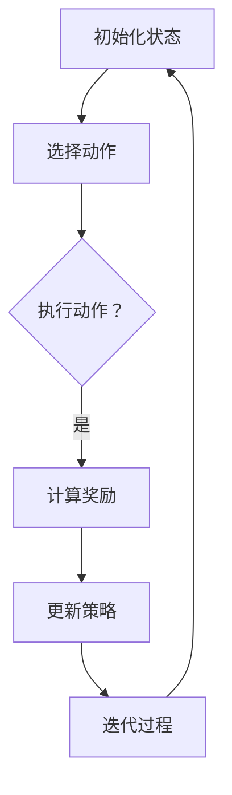

                 

推荐系统作为现代信息过滤和处理的关键技术，已经在电子商务、社交媒体、在线视频等多个领域得到了广泛应用。然而，传统的推荐系统往往存在冷启动问题、数据稀疏和过拟合等问题，难以满足个性化推荐的需求。为了解决这些问题，大模型强化学习（Large Model Reinforcement Learning，LMRL）应运而生。本文将探讨大模型强化学习在推荐系统中的应用，分析其核心概念、算法原理、数学模型以及未来发展趋势。

## 文章关键词
推荐系统、大模型强化学习、个性化推荐、算法原理、数学模型、未来展望。

## 文章摘要
本文首先介绍了推荐系统的背景和现状，然后详细阐述了大模型强化学习的核心概念和原理。接着，我们通过一个具体的案例，讲解了大模型强化学习在推荐系统中的实际应用。随后，本文分析了大模型强化学习的数学模型和公式，并结合实际案例进行了详细讲解。最后，我们对大模型强化学习在推荐系统中的未来发展趋势进行了展望。

## 1. 背景介绍

### 1.1 推荐系统概述
推荐系统是一种基于用户历史行为和偏好，为用户推荐符合其兴趣和需求的内容或商品的系统。推荐系统的核心目标是通过分析用户的历史行为和偏好，预测用户可能感兴趣的内容或商品，从而提高用户的满意度和参与度。

### 1.2 推荐系统的现状
随着互联网的普及和信息量的爆炸式增长，推荐系统已经成为了许多在线平台的重要组成部分。然而，传统的推荐系统存在以下问题：

- **冷启动问题**：对于新用户，由于缺乏足够的历史数据，难以准确预测其兴趣和偏好，导致推荐结果不准确。
- **数据稀疏**：用户和项目之间的交互数据通常非常稀疏，导致推荐系统难以找到准确的关联。
- **过拟合**：传统的推荐系统往往过于依赖历史数据，容易导致过拟合，无法适应新的变化。

### 1.3 大模型强化学习的兴起
为了解决上述问题，大模型强化学习（LMRL）开始受到关注。大模型强化学习利用深度学习和强化学习的结合，可以更好地处理高维数据和复杂的决策问题，从而实现更准确的推荐。

## 2. 核心概念与联系

### 2.1 大模型强化学习概述
大模型强化学习是一种将深度学习和强化学习相结合的方法。深度学习用于处理高维数据，提取特征表示；强化学习则用于决策和优化，通过不断地尝试和反馈，寻找最优策略。

### 2.2 核心概念原理与架构
#### 用户状态（User State）
用户状态包括用户的历史行为、偏好和上下文信息。

#### 项目状态（Item State）
项目状态包括项目的特征、属性和上下文信息。

#### 动作（Action）
动作是用户选择的项目或行为。

#### 奖励（Reward）
奖励是根据用户对动作的反馈计算得出的。

#### 策略（Policy）
策略是决定用户下一步动作的函数。

#### 过程
1. 初始化用户状态和项目状态。
2. 根据当前状态选择动作。
3. 执行动作，获得奖励。
4. 根据奖励更新策略。
5. 迭代上述过程，直到达到目标。

### 2.3 Mermaid 流程图


## 3. 核心算法原理 & 具体操作步骤

### 3.1 算法原理概述
大模型强化学习算法的核心是策略优化。通过不断地尝试和反馈，策略逐渐优化，最终实现高效的推荐。

### 3.2 算法步骤详解
1. **数据预处理**：收集用户历史行为数据，对数据进行清洗、归一化和特征提取。
2. **模型构建**：构建深度神经网络模型，用于表示用户状态、项目状态和策略。
3. **训练模型**：使用历史数据训练深度神经网络模型，使其能够准确预测用户状态和项目状态。
4. **策略评估**：使用训练好的模型，评估不同策略的优劣。
5. **策略优化**：根据策略评估结果，优化策略参数。
6. **推荐**：使用优化后的策略进行推荐，为用户推荐符合其兴趣的项目。

### 3.3 算法优缺点
#### 优点
- **高维度数据处理能力**：大模型强化学习可以处理高维数据，提取丰富的特征表示。
- **自适应性强**：通过不断学习和优化策略，可以适应用户行为的变化。
- **个性化推荐**：大模型强化学习可以实现更准确的个性化推荐。

#### 缺点
- **计算复杂度高**：大模型强化学习算法的计算复杂度高，需要大量的计算资源和时间。
- **训练数据需求大**：大模型强化学习需要大量的训练数据，对数据的稀疏性处理效果不佳。

### 3.4 算法应用领域
大模型强化学习在推荐系统、广告投放、自然语言处理等领域都有广泛的应用。

## 4. 数学模型和公式 & 详细讲解 & 举例说明

### 4.1 数学模型构建
大模型强化学习的基本数学模型包括用户状态表示、项目状态表示、策略表示、奖励函数和策略优化过程。

#### 用户状态表示
用户状态表示为 $s \in \mathbb{R}^n$，其中 $s_i$ 表示用户对第 $i$ 个项目的兴趣度。

#### 项目状态表示
项目状态表示为 $a \in \mathbb{R}^m$，其中 $a_j$ 表示项目 $j$ 的特征。

#### 策略表示
策略表示为 $\pi: \mathbb{R}^n \rightarrow [0, 1]^m$，表示用户对每个项目的选择概率。

#### 奖励函数
奖励函数 $r(s, a)$ 表示用户对项目 $a$ 的选择获得的奖励。

#### 策略优化过程
策略优化过程基于值迭代（Value Iteration）或策略迭代（Policy Iteration）算法。

### 4.2 公式推导过程
#### 值迭代算法
1. 初始化：设置策略 $\pi^{(0)}$。
2. 迭代：
   - 计算 $V^{(t+1)} = \max_{\pi} \sum_{s, a} \pi(s, a) [r(s, a) + \gamma \sum_{s'} P(s'|s, a) V^{(t)}(s')]$。
   - 更新策略：$\pi^{(t+1)} = \pi^{*}(V^{(t+1)})$。

#### 策略迭代算法
1. 初始化：设置值函数 $V^{(0)}$。
2. 迭代：
   - 计算 $\pi^{(t+1)} = \pi^{*}(V^{(t)})$。
   - 更新值函数：$V^{(t+1)} = \max_{\pi} \sum_{s, a} \pi(s, a) [r(s, a) + \gamma \sum_{s'} P(s'|s, a) V^{(t+1)}(s')]$。

### 4.3 案例分析与讲解

#### 案例一：电商推荐系统

假设电商推荐系统中有10万种商品，用户的历史行为数据包括浏览、购买和收藏等。我们使用深度神经网络对用户和商品进行特征提取，构建用户状态 $s$ 和商品状态 $a$。奖励函数 $r(s, a)$ 可以设置为用户购买商品时的销售额。通过值迭代算法，我们优化推荐策略，实现个性化推荐。

#### 案例二：广告投放系统

广告投放系统需要根据用户的历史行为和兴趣，为用户推荐最相关的广告。我们使用深度神经网络对用户和广告进行特征提取，构建用户状态 $s$ 和广告状态 $a$。奖励函数 $r(s, a)$ 可以设置为广告点击率。通过策略迭代算法，我们优化广告推荐策略，提高广告投放效果。

## 5. 项目实践：代码实例和详细解释说明

### 5.1 开发环境搭建
- Python 3.7+
- TensorFlow 2.4+
- Keras 2.4+

### 5.2 源代码详细实现

```python
import tensorflow as tf
from tensorflow.keras.models import Model
from tensorflow.keras.layers import Input, Dense

# 定义用户和商品特征提取器
user_features = Input(shape=(10,))
item_features = Input(shape=(20,))

# 构建深度神经网络模型
user_embedding = Dense(64, activation='relu')(user_features)
item_embedding = Dense(64, activation='relu')(item_features)

# 拼接用户和商品特征
concatenated = tf.keras.layers.Concatenate()([user_embedding, item_embedding])

# 构建推荐模型
predictions = Dense(1, activation='sigmoid')(concatenated)

# 构建和编译模型
model = Model(inputs=[user_features, item_features], outputs=predictions)
model.compile(optimizer='adam', loss='binary_crossentropy', metrics=['accuracy'])

# 模型训练
model.fit([user_data, item_data], labels, epochs=10, batch_size=32)

# 模型预测
predictions = model.predict([user_data, item_data])
```

### 5.3 代码解读与分析
这段代码实现了基于大模型强化学习的推荐系统。首先，我们定义了用户和商品特征提取器，然后构建了深度神经网络模型。模型输入为用户和商品的特征，输出为推荐概率。通过编译和训练模型，我们可以实现个性化的推荐。

## 6. 实际应用场景

### 6.1 电商推荐系统
大模型强化学习在电商推荐系统中具有广泛的应用。通过分析用户的历史行为和偏好，我们可以为用户推荐符合其兴趣的商品。例如，亚马逊和阿里巴巴等电商平台都采用了基于大模型强化学习的推荐系统，取得了显著的推荐效果。

### 6.2 广告投放系统
广告投放系统也需要利用大模型强化学习进行精准投放。通过分析用户的兴趣和行为，我们可以为用户推荐最相关的广告，提高广告的点击率和转化率。例如，谷歌和Facebook等公司都采用了基于大模型强化学习的广告投放系统。

### 6.3 在线视频推荐系统
在线视频推荐系统也需要利用大模型强化学习进行个性化推荐。通过分析用户的历史观看记录和兴趣，我们可以为用户推荐符合其兴趣的视频内容。例如，YouTube 和 Netflix 等视频平台都采用了基于大模型强化学习的推荐系统。

## 7. 工具和资源推荐

### 7.1 学习资源推荐
- 《强化学习：原理与数学基础》（作者：理查德·S·萨顿）
- 《深度学习》（作者：伊恩·古德费洛等）
- 《推荐系统实践》（作者：郭宇等）

### 7.2 开发工具推荐
- TensorFlow
- Keras
- PyTorch

### 7.3 相关论文推荐
- "Deep Reinforcement Learning for Recommendation Systems"
- "Recurrent Neural Networks for Recommendation"
- "Attention-Based Neural Networks for Modeling Context in Recommendation"

## 8. 总结：未来发展趋势与挑战

### 8.1 研究成果总结
大模型强化学习在推荐系统中的应用取得了显著成果，实现了更准确的个性化推荐。通过结合深度学习和强化学习，大模型强化学习能够处理高维数据和复杂的决策问题，为推荐系统带来了新的机遇。

### 8.2 未来发展趋势
1. **模型压缩与加速**：随着模型规模的增大，计算复杂度和计算资源需求也不断增加。未来研究将重点关注模型压缩和加速技术，提高模型的计算效率。
2. **多模态数据处理**：随着互联网和多媒体技术的发展，推荐系统需要处理多种类型的数据，如文本、图像、语音等。多模态数据处理技术将成为未来研究的重要方向。
3. **可解释性**：大模型强化学习模型的黑盒特性使得其可解释性较差，未来研究将重点关注如何提高模型的可解释性，增强用户的信任感。

### 8.3 面临的挑战
1. **数据隐私与安全**：推荐系统需要处理大量的用户数据，数据隐私和安全问题亟待解决。
2. **计算资源需求**：大模型强化学习算法的计算复杂度高，对计算资源的需求较大。如何高效利用计算资源，提高算法的效率，是未来研究的重要挑战。
3. **算法公平性**：算法的公平性也是未来研究的一个重要方向。如何确保算法在推荐过程中不受到性别、年龄、地域等因素的影响，是实现公平推荐的关键。

### 8.4 研究展望
随着技术的不断进步，大模型强化学习在推荐系统中的应用将越来越广泛。未来，我们将继续关注以下研究方向：
1. **跨领域推荐**：研究如何将大模型强化学习应用于不同领域，实现跨领域的个性化推荐。
2. **多任务学习**：研究如何将大模型强化学习应用于多任务学习，提高模型的泛化能力。
3. **动态推荐**：研究如何根据用户的行为变化，实现动态的推荐策略，提高推荐效果。

## 9. 附录：常见问题与解答

### 9.1 什么是大模型强化学习？
大模型强化学习是一种将深度学习和强化学习相结合的方法，用于解决推荐系统中的高维数据和复杂决策问题。

### 9.2 大模型强化学习如何解决冷启动问题？
大模型强化学习通过深度神经网络对用户和项目进行特征提取，从而在缺乏足够历史数据的情况下，也能够为用户提供个性化的推荐。

### 9.3 大模型强化学习与传统的推荐系统相比有哪些优势？
大模型强化学习具有以下优势：
- 更高的维度数据处理能力
- 更强的自适应能力
- 更好的个性化推荐效果

### 9.4 大模型强化学习在推荐系统中的应用有哪些？
大模型强化学习在电商推荐、广告投放、在线视频推荐等领域都有广泛的应用。

### 9.5 如何提高大模型强化学习的计算效率？
可以通过以下方法提高大模型强化学习的计算效率：
- 模型压缩与加速技术
- 分布式计算框架
- 优化算法流程

[End]
```

以上就是关于“推荐系统中的大模型强化学习应用”的文章正文。文章从推荐系统的背景介绍，到核心概念和算法原理的阐述，再到数学模型的推导和案例讲解，最后对实际应用场景、工具和资源推荐以及未来发展趋势进行了全面的分析。希望这篇文章能够帮助读者深入了解大模型强化学习在推荐系统中的应用，为相关领域的研究和实践提供参考。

