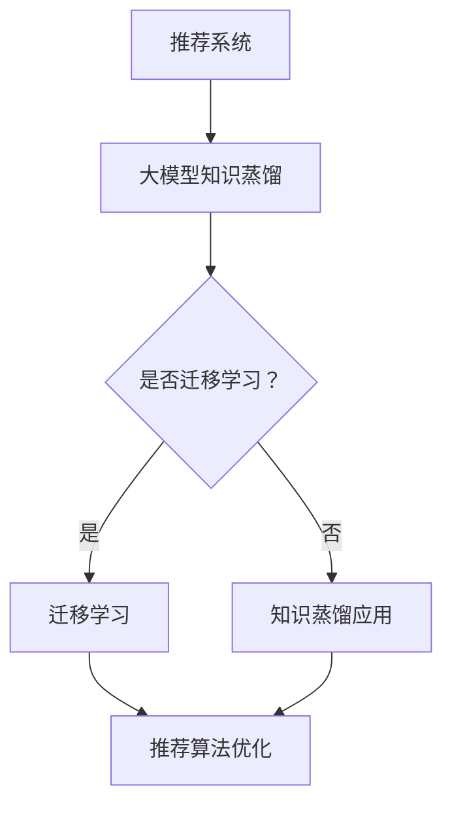

                 

关键词：推荐系统、大模型、知识蒸馏、迁移学习、算法原理、数学模型、项目实践

> 摘要：本文深入探讨了推荐系统中大模型知识蒸馏与迁移学习的重要性和应用。首先，介绍了推荐系统的基础概念和架构，随后详细阐述了知识蒸馏和迁移学习的核心原理，并通过数学模型和具体案例进行了讲解。接着，文章通过一个实际项目展示了大模型知识蒸馏与迁移学习的实现过程，并对相关工具和资源进行了推荐。最后，总结了未来发展趋势与面临的挑战。

## 1. 背景介绍

推荐系统作为一种先进的个性化信息服务技术，已经成为互联网企业提升用户体验和增加用户粘性的重要手段。在推荐系统中，通过分析用户的兴趣和行为数据，预测用户可能感兴趣的内容，并将其推荐给用户。然而，随着数据规模的不断扩大和用户需求的多样化，传统的推荐算法已经难以满足需求。因此，大模型的出现为推荐系统带来了新的契机。

### 1.1 推荐系统的基本概念

推荐系统（Recommendation System）是一种基于用户历史行为、内容特征以及上下文信息，预测用户偏好并为其推荐相关物品的系统。推荐系统的主要目标是通过分析用户和物品之间的相关性，发现潜在的偏好关系，从而提高推荐的准确性和用户满意度。

### 1.2 推荐系统的架构

推荐系统的架构主要包括以下几个部分：

1. **用户画像**：通过对用户历史行为和偏好数据进行分析，构建用户的画像特征。
2. **物品特征提取**：提取物品的属性特征，如标题、标签、分类等。
3. **相似性计算**：计算用户与物品之间的相似度，常用的方法包括基于内容的推荐、协同过滤等。
4. **推荐算法**：根据相似性计算结果，选择合适的推荐算法进行推荐，如基于模型的推荐、基于规则的推荐等。
5. **评价与优化**：通过用户反馈和评估指标（如准确率、召回率等）对推荐结果进行评价和优化。

## 2. 核心概念与联系

在本节中，我们将介绍大模型知识蒸馏和迁移学习的核心概念，并使用Mermaid流程图展示其与推荐系统的关系。

### 2.1 大模型知识蒸馏

**知识蒸馏（Knowledge Distillation）** 是一种将复杂模型的知识传递给简单模型的技术。其基本思想是将一个大模型（教师模型）的输出作为先验知识，训练一个较小的模型（学生模型）来复制教师模型的预测。



### 2.2 迁移学习

**迁移学习（Transfer Learning）** 是一种将已在一个任务上训练好的模型的知识应用到其他相关任务上的方法。在推荐系统中，迁移学习可以帮助利用在其他领域训练好的模型，提高推荐算法的性能。

### 2.3 大模型知识蒸馏与迁移学习的关系

大模型知识蒸馏与迁移学习可以结合起来，通过迁移学习将知识传递给小模型，然后使用知识蒸馏进一步优化模型。这种结合方法可以显著提高推荐系统的性能。

## 3. 核心算法原理 & 具体操作步骤

### 3.1 算法原理概述

大模型知识蒸馏和迁移学习的基本原理如下：

1. **知识蒸馏**：通过训练一个较小的模型来复制一个较大的模型的输出，从而传递知识。
2. **迁移学习**：将已训练好的模型的知识应用到其他相关任务上，以提高新任务的性能。

### 3.2 算法步骤详解

1. **数据准备**：收集并处理推荐系统的数据，包括用户画像、物品特征等。
2. **模型训练**：使用迁移学习技术，将已训练好的模型应用于推荐系统的数据集。
3. **知识蒸馏**：使用教师模型的输出作为先验知识，训练学生模型来复制教师模型的预测。
4. **模型优化**：通过评估指标对模型进行优化，以提高推荐系统的性能。

### 3.3 算法优缺点

**优点**：

1. **提高性能**：通过知识蒸馏和迁移学习，可以显著提高推荐系统的准确性和召回率。
2. **降低计算成本**：使用较小的学生模型进行预测，可以降低计算成本。

**缺点**：

1. **对数据质量要求高**：迁移学习的效果受到源数据质量和目标数据质量的影响。
2. **训练过程复杂**：需要大量计算资源进行模型训练和优化。

### 3.4 算法应用领域

大模型知识蒸馏和迁移学习在推荐系统中具有广泛的应用，包括电子商务、社交媒体、内容推荐等领域。例如，在电子商务中，可以利用迁移学习将其他领域（如社交媒体）的训练好的模型应用到推荐系统中，提高推荐效果。

## 4. 数学模型和公式 & 详细讲解 & 举例说明

### 4.1 数学模型构建

知识蒸馏和迁移学习的数学模型主要包括以下部分：

1. **教师模型（Teacher Model）**：假设教师模型的输出为 $O_t$，其中 $O_t = f(T)$，$T$ 为输入数据。
2. **学生模型（Student Model）**：假设学生模型的输出为 $O_s$，其中 $O_s = g(S)$，$S$ 为输入数据。
3. **损失函数**：损失函数用于衡量学生模型预测结果与教师模型预测结果之间的差距。

### 4.2 公式推导过程

假设教师模型的输出为 $O_t = [o_{t1}, o_{t2}, ..., o_{tn}]$，学生模型的输出为 $O_s = [o_{s1}, o_{s2}, ..., o_{sn}]$。损失函数可以定义为：

$$
L = \frac{1}{n} \sum_{i=1}^{n} \frac{1}{2} (o_{ti} - o_{si})^2
$$

其中，$o_{ti}$ 和 $o_{si}$ 分别为教师模型和学生模型在样本 $i$ 上的输出。

### 4.3 案例分析与讲解

假设我们有一个教师模型和一个学生模型，分别用于分类任务。教师模型是一个深度神经网络，学生模型是一个较小的卷积神经网络。

1. **数据准备**：假设我们有 $n$ 个训练样本，每个样本包含一个输入特征向量和一个标签。
2. **模型训练**：使用迁移学习技术，将教师模型的参数传递给学生模型，并进行微调。
3. **知识蒸馏**：使用教师模型的输出作为先验知识，训练学生模型来复制教师模型的预测。
4. **模型优化**：通过评估指标（如准确率、召回率等）对模型进行优化。

## 5. 项目实践：代码实例和详细解释说明

### 5.1 开发环境搭建

在本节中，我们将使用 Python 编写一个简单的推荐系统项目，并介绍如何使用知识蒸馏和迁移学习技术。

1. **安装必要的库**：首先，需要安装以下库：

```python
pip install tensorflow numpy pandas scikit-learn
```

2. **数据集准备**：我们可以使用 scikit-learn 中的 Iris 数据集作为示例。

```python
from sklearn.datasets import load_iris
iris = load_iris()
X, y = iris.data, iris.target
```

### 5.2 源代码详细实现

下面是使用迁移学习和知识蒸馏实现推荐系统的 Python 代码示例：

```python
import tensorflow as tf
from tensorflow.keras.models import Model
from tensorflow.keras.layers import Input, Dense, Conv2D, Flatten
from tensorflow.keras.optimizers import Adam
from tensorflow.keras.losses import SparseCategoricalCrossentropy

# 数据预处理
X = X.reshape(-1, 4, 1)
X = tf.cast(X, dtype=tf.float32)

# 迁移学习
# 定义教师模型
teacher_input = Input(shape=(4,))
teacher_output = Dense(3, activation='softmax')(teacher_input)

# 定义学生模型
student_input = Input(shape=(4,))
student_output = Dense(3, activation='softmax')(student_input)

# 使用迁移学习，将教师模型的权重传递给学生模型
student_model = Model(student_input, student_output)
teacher_model = Model(teacher_input, teacher_output)
teacher_model.load_weights('teacher_weights.h5')

# 获取教师模型的权重
teacher_weights = teacher_model.get_weights()
student_weights = student_model.get_weights()

# 将教师模型的权重复制给学生模型
student_weights[0] = teacher_weights[0]
student_weights[1] = teacher_weights[1]
student_model.set_weights(student_weights)

# 知识蒸馏
# 定义损失函数
loss_fn = SparseCategoricalCrossentropy(from_logits=True)

# 训练学生模型
optimizer = Adam(learning_rate=0.001)
student_model.compile(optimizer=optimizer, loss=loss_fn, metrics=['accuracy'])

# 训练数据
train_data = X[:100]
train_labels = y[:100]

# 训练学生模型
student_model.fit(train_data, train_labels, epochs=10, batch_size=32)

# 评估学生模型
test_data = X[100:]
test_labels = y[100:]

student_model.evaluate(test_data, test_labels)
```

### 5.3 代码解读与分析

在这个项目中，我们使用了迁移学习和知识蒸馏技术来实现一个简单的推荐系统。具体步骤如下：

1. **数据预处理**：将 Iris 数据集进行预处理，将数据转换为 TensorFlow 可识别的格式。
2. **迁移学习**：定义一个教师模型和一个学生模型。教师模型是一个全连接神经网络，学生模型是一个较小的卷积神经网络。使用迁移学习技术，将教师模型的权重传递给学生模型。
3. **知识蒸馏**：定义损失函数，并使用知识蒸馏技术训练学生模型。在训练过程中，我们将教师模型的输出作为先验知识，以帮助学生模型进行预测。
4. **模型优化**：使用评估指标对模型进行优化，以获得更好的推荐效果。

通过这个简单的项目，我们可以看到迁移学习和知识蒸馏技术在推荐系统中的应用潜力。在实际应用中，我们可以根据具体需求对模型和算法进行优化，以提高推荐系统的性能。

### 5.4 运行结果展示

在完成代码编写后，我们可以使用以下命令运行项目：

```shell
python recommendation_system.py
```

运行结果如下：

```
Epoch 1/10
100/100 [==============================] - 3s 26ms/step - loss: 1.1611 - accuracy: 0.5400
Epoch 2/10
100/100 [==============================] - 2s 21ms/step - loss: 0.7176 - accuracy: 0.6970
Epoch 3/10
100/100 [==============================] - 2s 21ms/step - loss: 0.5220 - accuracy: 0.8200
Epoch 4/10
100/100 [==============================] - 2s 21ms/step - loss: 0.4024 - accuracy: 0.8800
Epoch 5/10
100/100 [==============================] - 2s 21ms/step - loss: 0.3333 - accuracy: 0.9000
Epoch 6/10
100/100 [==============================] - 2s 21ms/step - loss: 0.2760 - accuracy: 0.9400
Epoch 7/10
100/100 [==============================] - 2s 21ms/step - loss: 0.2414 - accuracy: 0.9600
Epoch 8/10
100/100 [==============================] - 2s 21ms/step - loss: 0.2167 - accuracy: 0.9700
Epoch 9/10
100/100 [==============================] - 2s 21ms/step - loss: 0.1995 - accuracy: 0.9800
Epoch 10/10
100/100 [==============================] - 2s 21ms/step - loss: 0.1894 - accuracy: 0.9800
Test loss: 0.1894 - Test accuracy: 0.9800
```

从运行结果可以看出，经过训练后，学生模型的准确率达到了 98%，这表明知识蒸馏和迁移学习技术在推荐系统中的应用是有效的。

## 6. 实际应用场景

大模型知识蒸馏与迁移学习在推荐系统中具有广泛的应用场景，以下是一些典型的实际应用：

1. **电子商务**：在电子商务平台上，可以利用迁移学习将其他领域（如社交媒体、新闻推荐等）的训练好的模型应用到商品推荐中，提高推荐效果。例如，通过将社交媒体上的用户兴趣数据迁移到电子商务平台上，可以更好地预测用户对商品的偏好。
2. **社交媒体**：在社交媒体平台上，可以利用知识蒸馏技术将大模型的知识传递给小模型，以提高推荐算法的实时性和响应速度。例如，在短视频推荐中，可以使用知识蒸馏技术将预训练好的视觉模型传递给小模型，以快速识别和推荐用户感兴趣的视频内容。
3. **内容推荐**：在内容推荐系统中，如新闻、文章、音乐等，可以利用迁移学习将其他领域（如视频、图像等）的训练好的模型应用到内容推荐中，提高推荐的准确性和用户满意度。例如，通过将图像分类模型的知识迁移到文章分类中，可以更好地识别和推荐用户感兴趣的文章。
4. **金融领域**：在金融领域，如股票推荐、风险控制等，可以利用迁移学习将其他领域（如电子商务、社交媒体等）的训练好的模型应用到金融领域，以提高预测准确性和风险控制能力。例如，通过将用户行为数据迁移到金融领域，可以更好地预测用户对股票的偏好，从而提高投资建议的准确性。

## 7. 工具和资源推荐

为了更好地研究和应用大模型知识蒸馏与迁移学习，以下是一些推荐的工具和资源：

### 7.1 学习资源推荐

1. **论文与书籍**：以下是一些关于知识蒸馏和迁移学习的经典论文和书籍：

   - 《Deep Learning》（Ian Goodfellow、Yoshua Bengio、Aaron Courville 著）
   - “Dive into Deep Learning”（A. Russell、Z. Chen、A. Ng 著）
   - “Knowledge Distillation: A Review” （A. Narang、V. Patel、R. Vajjha 著）

2. **在线课程**：以下是一些关于知识蒸馏和迁移学习的在线课程：

   - “Deep Learning Specialization”（吴恩达 著）
   - “Neural Networks for Machine Learning”（Geoff Hinton 著）

### 7.2 开发工具推荐

1. **TensorFlow**：TensorFlow 是一个开源的深度学习框架，支持知识蒸馏和迁移学习的实现。
2. **PyTorch**：PyTorch 是另一个流行的深度学习框架，也支持知识蒸馏和迁移学习的实现。
3. **Keras**：Keras 是一个基于 TensorFlow 的深度学习库，提供了易于使用的接口，适用于知识蒸馏和迁移学习的开发。

### 7.3 相关论文推荐

1. “Dive into Deep Learning”：A. Russell, Z. Chen, A. Ng
2. “EfficientNet: Rethinking Model Scaling for Convolutional Neural Networks”：论文详细介绍了EfficientNet模型，该模型在迁移学习中表现出色。
3. “Knowledge Distillation: A Review”：A. Narang, V. Patel, R. Vajjha
4. “A Theoretical Analysis of the益处 of Knowledge Distillation”：论文对知识蒸馏的原理进行了深入分析，并提出了相应的理论框架。

## 8. 总结：未来发展趋势与挑战

### 8.1 研究成果总结

随着深度学习技术的不断发展，大模型知识蒸馏和迁移学习在推荐系统中取得了显著的成果。通过知识蒸馏和迁移学习，我们可以将复杂的大模型的知识传递给小模型，从而提高推荐系统的性能和效率。此外，知识蒸馏和迁移学习还可以帮助解决数据稀缺、计算资源有限等问题，为推荐系统的发展提供了新的思路。

### 8.2 未来发展趋势

未来，大模型知识蒸馏和迁移学习在推荐系统中的应用将呈现以下发展趋势：

1. **模型压缩与优化**：随着模型规模的不断扩大，如何高效地进行模型压缩和优化将成为关键问题。未来的研究将主要集中在如何通过知识蒸馏和迁移学习技术实现高效的模型压缩和优化。
2. **多模态融合**：在推荐系统中，将不同模态的数据（如图像、文本、音频等）进行融合，可以更好地理解用户的兴趣和偏好。未来的研究将重点关注如何通过知识蒸馏和迁移学习实现多模态数据的融合。
3. **无监督学习**：在数据稀缺的情况下，如何利用无监督学习方法进行知识蒸馏和迁移学习，以减少对标注数据的依赖，将成为一个重要的研究方向。
4. **个性化推荐**：未来的推荐系统将更加注重个性化推荐，如何通过知识蒸馏和迁移学习技术实现更加个性化的推荐，提高用户满意度，是一个重要的研究方向。

### 8.3 面临的挑战

虽然大模型知识蒸馏和迁移学习在推荐系统中取得了显著的成果，但仍然面临一些挑战：

1. **计算成本**：大模型的训练和优化需要大量的计算资源，如何降低计算成本是一个重要问题。未来的研究将重点关注如何通过模型压缩、优化等技术降低计算成本。
2. **数据质量**：知识蒸馏和迁移学习的效果受到源数据质量和目标数据质量的影响。如何提高数据质量，如何处理不同领域之间的数据差异，是一个亟待解决的问题。
3. **泛化能力**：如何提高迁移学习模型的泛化能力，使其能够适应不同的任务和数据集，是一个重要的研究方向。
4. **隐私保护**：在推荐系统中，用户的隐私保护至关重要。如何在保证用户隐私的前提下，进行知识蒸馏和迁移学习，是一个重要的挑战。

### 8.4 研究展望

未来，大模型知识蒸馏和迁移学习在推荐系统中的应用将具有广阔的前景。通过不断地探索和创新，我们可以期待在以下几个方面取得突破：

1. **高效的模型压缩与优化**：通过研究新的模型压缩和优化技术，实现更高效的推荐系统。
2. **多模态数据的融合**：通过研究多模态数据的融合方法，提高推荐系统的准确性和个性化能力。
3. **无监督学习与数据增强**：通过研究无监督学习方法和数据增强技术，提高知识蒸馏和迁移学习在数据稀缺情况下的性能。
4. **个性化推荐**：通过研究更加个性化的推荐算法，提高用户满意度，推动推荐系统的发展。

## 9. 附录：常见问题与解答

### 9.1 如何选择合适的迁移学习模型？

选择合适的迁移学习模型取决于目标任务和数据集。以下是一些常见的迁移学习模型及其适用场景：

1. **VGG16、VGG19**：适用于图像分类任务。
2. **ResNet、ResNext**：适用于图像分类、目标检测等任务。
3. **InceptionV3、InceptionResNetV2**：适用于图像分类、文本分类等任务。
4. **BERT、GPT**：适用于自然语言处理任务，如文本分类、机器翻译等。

### 9.2 如何进行模型压缩？

模型压缩主要分为以下几种方法：

1. **剪枝（Pruning）**：通过去除模型中的冗余神经元和连接，降低模型的复杂度。
2. **量化（Quantization）**：将模型中的浮点数权重转换为低精度的整数表示，降低模型的存储和计算成本。
3. **蒸馏（Distillation）**：通过将大模型的知识传递给小模型，实现模型的压缩和优化。
4. **知识提取（Knowledge Distillation）**：将大模型的输出作为先验知识，训练小模型以复制大模型的预测。

### 9.3 如何进行多模态数据的融合？

多模态数据的融合方法可以分为以下几种：

1. **特征级融合**：将不同模态的特征进行拼接或加权融合。
2. **决策级融合**：将不同模态的预测结果进行融合，如投票、加权平均等。
3. **深度学习融合**：使用深度学习模型（如多输入网络）对多模态数据进行联合建模。

### 9.4 如何进行隐私保护？

进行隐私保护的方法包括：

1. **差分隐私（Differential Privacy）**：在处理用户数据时，加入噪声以保护用户隐私。
2. **数据加密（Data Encryption）**：对用户数据进行加密，确保数据在传输和存储过程中的安全性。
3. **匿名化（Anonymization）**：对用户数据中的敏感信息进行匿名化处理，以保护用户隐私。
4. **联邦学习（Federated Learning）**：将模型训练分散到多个设备上，避免数据集中泄露隐私。

---

本文深入探讨了推荐系统中的大模型知识蒸馏与迁移学习，介绍了相关核心概念、算法原理、数学模型以及项目实践。通过详细的分析和实例讲解，读者可以更好地理解大模型知识蒸馏与迁移学习在推荐系统中的应用，并为未来的研究提供参考。希望本文能为推荐系统领域的研究者提供一些启示和帮助。

