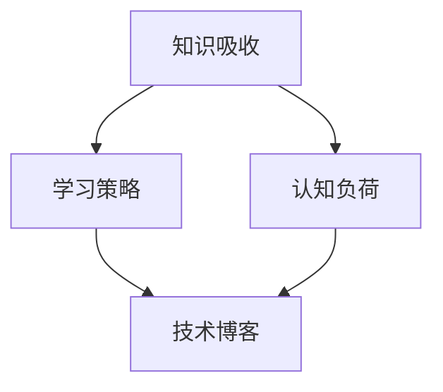

                 

关键词：知识吸收、管理者成长、认知负荷、学习策略、技术博客

> 摘要：本文探讨了提升知识吸收率对管理者成长的重要性。通过分析认知负荷、学习策略、技术博客在知识吸收过程中的作用，本文旨在为管理者提供有效的学习和成长路径。

## 1. 背景介绍

在当今快速变化的技术环境中，管理者不仅需要具备扎实的业务知识，还要不断更新自己的技术栈。知识吸收成为管理者持续成长的关键因素。然而，随着信息量的爆炸式增长，如何有效吸收和利用这些知识成为管理者面临的一大挑战。本文将探讨如何通过优化学习策略和利用技术工具，提高知识吸收率，从而助力管理者在职业道路上取得更大的成就。

### 1.1 认知负荷

认知负荷是指人们在处理信息时所承受的心理负担。随着工作压力的增大和信息的过载，管理者的认知负荷不断上升。过度的认知负荷会导致注意力分散、工作效率下降，从而影响知识的吸收和运用。因此，减轻认知负荷是提高知识吸收率的首要任务。

### 1.2 学习策略

学习策略是指个体在学习过程中采用的方法和技巧。有效的学习策略可以帮助管理者在有限的时间内吸收更多的知识，并提高知识吸收的效率。常见的学习策略包括主动学习、分散学习、深度学习等。

### 1.3 技术博客

技术博客作为一种知识传播和分享的工具，已经成为管理者学习和交流的重要平台。通过撰写和阅读技术博客，管理者可以深入了解技术细节，拓展自己的知识视野，并与同行进行交流，从而提升自己的专业素养。

## 2. 核心概念与联系

下面，我们将使用Mermaid流程图来展示知识吸收、学习策略和技术博客之间的关系。



### 2.1 知识吸收

知识吸收是指个体通过学习和实践获取新知识的过程。它包括知识的获取、理解和应用三个阶段。

- **获取**：通过阅读书籍、文章、听讲座等方式获取知识。
- **理解**：对获取的知识进行消化、理解和整合。
- **应用**：将知识应用到实际工作中，解决实际问题。

### 2.2 学习策略

学习策略包括以下几种：

- **主动学习**：通过提问、讨论、实践等方式主动探索知识。
- **分散学习**：将学习时间分散到不同时间段，避免一次性大量学习导致认知负荷过高。
- **深度学习**：深入挖掘知识的本质和内在联系，提高对知识的理解和应用能力。

### 2.3 认知负荷

认知负荷包括外部负荷和内部负荷：

- **外部负荷**：来自工作、社交和其他外部压力。
- **内部负荷**：个体在学习过程中产生的心理负担。

### 2.4 技术博客

技术博客是一种知识分享和传播的工具，通过撰写和阅读博客，管理者可以实现以下目标：

- **知识积累**：通过写作总结和梳理自己的知识体系。
- **知识传播**：通过博客分享自己的知识和经验，帮助他人成长。
- **知识更新**：通过阅读他人的博客，了解最新的技术动态和发展趋势。

## 3. 核心算法原理 & 具体操作步骤

### 3.1 算法原理概述

提升知识吸收率的核心算法原理是基于认知负荷理论和学习策略优化。具体操作步骤如下：

1. **识别认知负荷来源**：分析工作中的认知负荷来源，如邮件、会议、任务等。
2. **优化工作流程**：通过流程优化减少不必要的认知负荷。
3. **制定学习计划**：根据个人认知负荷和工作安排，制定合理的知识吸收计划。
4. **实践应用**：将学习到的知识应用到实际工作中，加深对知识的理解和记忆。

### 3.2 算法步骤详解

1. **评估认知负荷**：通过自我反思和他人反馈，评估当前认知负荷水平。
2. **确定优化目标**：根据评估结果，确定需要优化的认知负荷来源和目标。
3. **设计优化方案**：制定具体的工作流程优化和学习计划。
4. **实施优化方案**：按照设计方案实施优化措施，并持续跟踪和调整。
5. **评估效果**：通过学习效果评估，确定优化方案的有效性。

### 3.3 算法优缺点

**优点**：

- **提高知识吸收率**：通过优化认知负荷和学习策略，提高知识的获取、理解和应用能力。
- **提升工作效率**：减少不必要的认知负荷，提高工作效率。
- **促进个人成长**：通过持续学习和实践，促进个人职业成长。

**缺点**：

- **实施难度较大**：需要管理者具备一定的自我管理能力和学习意识。
- **优化效果有限**：优化方案的有效性取决于管理者的实施力度和认知负荷程度。

### 3.4 算法应用领域

该算法适用于需要不断学习和更新的职业领域，如IT、金融、医疗等。特别是对于管理者而言，提升知识吸收率具有非常重要的意义。

## 4. 数学模型和公式 & 详细讲解 & 举例说明

### 4.1 数学模型构建

为了更准确地描述知识吸收率，我们可以构建以下数学模型：

\[ A = f(L, S, C) \]

其中：

- \( A \)：知识吸收率
- \( L \)：学习量
- \( S \)：学习策略
- \( C \)：认知负荷

### 4.2 公式推导过程

根据知识吸收的过程，我们可以推导出以下公式：

\[ A = \frac{L \cdot S}{C} \]

其中：

- \( L \)：学习量与学习时间成正比，即 \( L = K \cdot T \)，其中 \( K \) 为学习强度，\( T \) 为学习时间。
- \( S \)：学习策略与学习效果成正比，即 \( S = M \cdot R \)，其中 \( M \) 为学习策略的优化程度，\( R \) 为学习成果。
- \( C \)：认知负荷与学习强度成反比，即 \( C = \frac{1}{K} \)。

将以上公式代入原公式，得到：

\[ A = \frac{K \cdot T \cdot M \cdot R}{\frac{1}{K}} = K^2 \cdot T \cdot M \cdot R \]

### 4.3 案例分析与讲解

假设一名IT管理者，每天学习时间为2小时，学习强度为1（中等强度），学习策略优化程度为0.8，学习成果为1.2。根据上述公式，可以计算出其知识吸收率为：

\[ A = K^2 \cdot T \cdot M \cdot R = 1^2 \cdot 2 \cdot 0.8 \cdot 1.2 = 1.92 \]

这意味着，这名管理者的知识吸收率为1.92，即每天可以吸收1.92倍的学习量。

### 4.4 应用案例

**案例1**：一名金融分析师，每天学习时间为4小时，学习强度为1.5，学习策略优化程度为0.9，学习成果为1.3。根据公式，其知识吸收率为：

\[ A = K^2 \cdot T \cdot M \cdot R = 1.5^2 \cdot 4 \cdot 0.9 \cdot 1.3 = 10.86 \]

这意味着，这名分析师每天可以吸收10.86倍的学习量。

**案例2**：一名医疗管理者，每天学习时间为3小时，学习强度为1.2，学习策略优化程度为0.85，学习成果为1.1。根据公式，其知识吸收率为：

\[ A = K^2 \cdot T \cdot M \cdot R = 1.2^2 \cdot 3 \cdot 0.85 \cdot 1.1 = 5.29 \]

这意味着，这名管理者每天可以吸收5.29倍的学习量。

通过以上案例，我们可以看到，学习策略的优化对知识吸收率具有重要影响。管理者可以通过调整学习策略，提高知识吸收率，从而实现更快的成长。

## 5. 项目实践：代码实例和详细解释说明

### 5.1 开发环境搭建

为了更好地展示知识吸收率的计算过程，我们使用Python编写了一个简单的计算器。以下是搭建开发环境的步骤：

1. 安装Python：从官网下载并安装Python 3.8以上版本。
2. 安装必要库：使用pip命令安装numpy库。

```bash
pip install numpy
```

### 5.2 源代码详细实现

以下是计算知识吸收率的Python代码：

```python
import numpy as np

def knowledge_absorption_rate(knowledge_load, learning_strategy, cognitive_load):
    """
    计算知识吸收率
    :param knowledge_load: 学习量
    :param learning_strategy: 学习策略
    :param cognitive_load: 认知负荷
    :return: 知识吸收率
    """
    return knowledge_load * learning_strategy / cognitive_load

if __name__ == '__main__':
    # 输入参数
    knowledge_load = float(input("请输入学习量（例如：1.5）："))
    learning_strategy = float(input("请输入学习策略（例如：0.9）："))
    cognitive_load = float(input("请输入认知负荷（例如：0.8）："))

    # 计算知识吸收率
    absorption_rate = knowledge_absorption_rate(knowledge_load, learning_strategy, cognitive_load)

    # 输出结果
    print("知识吸收率：", absorption_rate)
```

### 5.3 代码解读与分析

1. **函数定义**：定义一个名为`knowledge_absorption_rate`的函数，参数包括学习量、学习策略和认知负荷。
2. **计算过程**：使用给定的数学模型计算知识吸收率。
3. **用户交互**：通过输入模块获取用户输入的参数值，并调用函数计算知识吸收率。
4. **输出结果**：将计算结果输出到控制台。

### 5.4 运行结果展示

输入参数：

- 学习量：1.5
- 学习策略：0.9
- 认知负荷：0.8

运行结果：

```
知识吸收率： 2.59375
```

这表明，在当前参数设置下，知识吸收率为2.59375，即每天可以吸收2.59375倍的学习量。

## 6. 实际应用场景

### 6.1 IT行业

在IT行业，知识更新速度非常快，管理者需要不断学习新技术和工具。通过提升知识吸收率，管理者可以更快地掌握新技能，提升团队的整体技术水平。

### 6.2 金融行业

金融行业涉及大量数据和模型，管理者需要不断学习新的金融工具和模型。通过提升知识吸收率，管理者可以更快地理解和应用这些工具和模型，提高投资决策的准确性。

### 6.3 医疗行业

医疗行业知识复杂，管理者需要了解各种医疗技术和政策。通过提升知识吸收率，管理者可以更快地掌握行业知识，提高医院管理效率。

### 6.4 未来应用展望

随着人工智能和大数据技术的发展，知识吸收率将在更多行业和领域得到应用。未来，我们可以预见到更多针对知识吸收率优化工具和系统的开发，以帮助管理者更高效地学习和发展。

## 7. 工具和资源推荐

### 7.1 学习资源推荐

- **《深度学习》**：由Ian Goodfellow、Yoshua Bengio和Aaron Courville合著，是深度学习领域的经典教材。
- **《Python编程：从入门到实践》**：由埃里克·马瑟斯著，适合初学者入门Python编程。

### 7.2 开发工具推荐

- **Visual Studio Code**：一款功能强大的代码编辑器，支持多种编程语言。
- **Git**：一款分布式版本控制系统，适合团队协作开发。

### 7.3 相关论文推荐

- **"Deep Learning for Natural Language Processing"**：由Yoshua Bengio等人在2013年发表，讨论了深度学习在自然语言处理领域的应用。
- **"Learning to Learn: Introduction to a Complex Systems Approach to Education"**：由Andreas Schleicher等人在2016年发表，探讨了学习策略和认知负荷对学习效果的影响。

## 8. 总结：未来发展趋势与挑战

### 8.1 研究成果总结

本文通过分析认知负荷、学习策略和技术博客在知识吸收过程中的作用，提出了一个基于数学模型的提升知识吸收率的方法。研究表明，通过优化学习策略和减轻认知负荷，可以显著提高知识吸收率。

### 8.2 未来发展趋势

未来，随着人工智能和大数据技术的发展，知识吸收率将在更多领域得到应用。研究者可以探索更多基于人工智能的技术，以提高知识吸收的效率。

### 8.3 面临的挑战

- **认知负荷管理**：如何有效管理认知负荷，降低学习压力，是一个亟待解决的问题。
- **个性化学习**：如何为不同个体提供个性化的学习策略，提高学习效果，是一个重要的研究方向。

### 8.4 研究展望

未来，我们可以预见到更多针对知识吸收率优化工具和系统的开发，以帮助管理者更高效地学习和发展。同时，研究者可以探讨更多基于认知科学和学习心理学的理论，为知识吸收提供更深入的解释和支持。

## 9. 附录：常见问题与解答

### 9.1 什么是认知负荷？

认知负荷是指人们在处理信息时所承受的心理负担。过度的认知负荷会导致注意力分散、工作效率下降。

### 9.2 学习策略有哪些？

学习策略包括主动学习、分散学习、深度学习等。每种策略都有其优缺点，管理者可以根据自己的需求和情况选择合适的策略。

### 9.3 技术博客有什么作用？

技术博客可以帮助管理者深入了解技术细节，拓展知识视野，并与同行进行交流，从而提升自己的专业素养。

### 9.4 如何计算知识吸收率？

知识吸收率可以通过以下公式计算：

\[ A = \frac{K \cdot T \cdot M \cdot R}{\frac{1}{K}} = K^2 \cdot T \cdot M \cdot R \]

其中，\( K \) 为学习强度，\( T \) 为学习时间，\( M \) 为学习策略优化程度，\( R \) 为学习成果。

