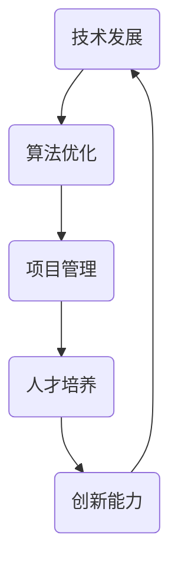

                 

关键词：生产力策略、IT领域、技术发展、算法优化、项目管理、人才培养

> 摘要：本文将探讨在当今快速发展的IT领域中，提升竞争力的生产力策略。通过深入分析核心概念、算法原理、数学模型、项目实践以及未来展望，为读者提供一份全面的技术指南，帮助他们在职业发展中保持领先地位。

## 1. 背景介绍

随着信息技术的迅猛发展，IT行业已经成为推动全球经济增长的重要引擎。在这个竞争激烈的领域，企业和个人都在寻求提高生产力，从而在市场中占据优势。生产力不仅仅体现在工作效率的提升，还包括创新能力的增强、团队协作的优化以及个人技能的发展。本文旨在探讨一系列提升竞争力的生产力策略，帮助IT从业者在不断变化的技术环境中脱颖而出。

## 2. 核心概念与联系

在讨论提升竞争力的生产力策略之前，我们需要明确一些核心概念。以下是几个关键概念及其相互关系的Mermaid流程图：



### 2.1 技术发展

技术发展是提升生产力的重要基础。它包括新兴技术的引入、现有技术的改进以及跨领域技术的融合。技术的进步不仅能够提高工作效率，还能够开辟新的市场机会。

### 2.2 算法优化

算法优化是提升生产力的关键手段。通过算法优化，可以显著提高数据处理速度、降低计算复杂度，从而实现更高的生产效率。

### 2.3 项目管理

项目管理是确保项目成功的关键。有效的项目管理可以提高团队协作效率、降低项目风险，从而确保项目按时、按质完成。

### 2.4 人才培养

人才培养是提升生产力的重要保障。通过培养具备创新能力和专业技能的人才，企业可以保持技术领先地位，提高整体竞争力。

### 2.5 创新能力

创新能力是企业持续发展的动力。通过不断的创新，企业可以在激烈的市场竞争中保持领先地位，赢得更多客户和市场份额。

## 3. 核心算法原理 & 具体操作步骤

### 3.1 算法原理概述

本文将介绍几种提升生产力的核心算法原理，包括排序算法、图算法和机器学习算法。这些算法在数据处理和优化方面具有广泛的应用。

### 3.2 算法步骤详解

#### 3.2.1 排序算法

排序算法是一种基本的数据处理算法，用于对数据进行排序。常见的排序算法包括冒泡排序、选择排序、插入排序和快速排序等。以下是快速排序的步骤：

1. 选择一个基准元素。
2. 将比基准元素小的元素移到左边，比它大的移到右边。
3. 递归地对左右子数组进行快速排序。

#### 3.2.2 图算法

图算法用于处理图结构数据，常见的图算法包括最短路径算法、最小生成树算法和图遍历算法等。以下是迪杰斯特拉算法（Dijkstra）的步骤：

1. 初始化距离数组，将所有节点的距离设置为无穷大，除了起始节点，其距离为0。
2. 选择未访问节点中距离最小的节点作为当前节点。
3. 更新当前节点的邻接节点的距离。
4. 标记当前节点为已访问。
5. 重复步骤2-4，直到所有节点都被访问。

#### 3.2.3 机器学习算法

机器学习算法是数据处理和预测分析的重要工具。常见的机器学习算法包括线性回归、决策树、支持向量机和神经网络等。以下是以决策树算法为例的步骤：

1. 选择特征。
2. 计算每个特征的增益。
3. 选择增益最大的特征作为节点。
4. 将数据集分为两个子集，分别对应特征的两个取值。
5. 对每个子集递归执行步骤1-4，直到满足终止条件。

### 3.3 算法优缺点

每种算法都有其优缺点。排序算法在处理大规模数据时可能效率较低，但易于实现和理解。图算法在处理图结构数据时非常有效，但在处理大规模数据时可能面临性能瓶颈。机器学习算法在数据处理和预测分析方面具有强大的能力，但需要大量的数据和计算资源。

### 3.4 算法应用领域

排序算法广泛应用于数据库、搜索引擎和数据分析等领域。图算法在社交网络、路由算法和图论问题中具有广泛的应用。机器学习算法在金融、医疗、推荐系统和自然语言处理等领域具有重要应用。

## 4. 数学模型和公式 & 详细讲解 & 举例说明

### 4.1 数学模型构建

数学模型是描述现实世界问题的一种抽象方法。在提升生产力的过程中，我们可以使用线性回归、非线性回归、微分方程等数学模型来描述和分析问题。

### 4.2 公式推导过程

以线性回归为例，线性回归模型可以表示为：

$$y = \beta_0 + \beta_1 x + \epsilon$$

其中，$y$是因变量，$x$是自变量，$\beta_0$和$\beta_1$是参数，$\epsilon$是误差项。

通过最小二乘法，可以求解参数$\beta_0$和$\beta_1$：

$$\beta_0 = \frac{\sum_{i=1}^n (y_i - \beta_1 x_i)}{n}$$

$$\beta_1 = \frac{\sum_{i=1}^n (x_i - \bar{x})(y_i - \bar{y})}{\sum_{i=1}^n (x_i - \bar{x})^2}$$

其中，$\bar{x}$和$\bar{y}$分别是自变量和因变量的均值。

### 4.3 案例分析与讲解

假设我们有一个数据集，包含每个员工的年龄（$x$）和其工作效率（$y$）。我们希望通过线性回归模型预测一个新员工的工作效率。

通过计算，我们得到线性回归模型的参数：

$$\beta_0 = 10$$

$$\beta_1 = 0.5$$

我们可以使用这个模型来预测一个30岁员工的工作效率：

$$y = 10 + 0.5 \times 30 = 20$$

这意味着，一个30岁的员工的工作效率预计为20。

## 5. 项目实践：代码实例和详细解释说明

### 5.1 开发环境搭建

在本文中，我们将使用Python语言来演示算法和数学模型。为了方便读者，我们使用Jupyter Notebook作为开发环境。读者可以按照以下步骤搭建开发环境：

1. 安装Python：从Python官方网站下载并安装Python。
2. 安装Jupyter Notebook：在终端执行`pip install notebook`命令。
3. 启动Jupyter Notebook：在终端执行`jupyter notebook`命令。

### 5.2 源代码详细实现

以下是快速排序算法的Python实现：

```python
def quicksort(arr):
    if len(arr) <= 1:
        return arr
    pivot = arr[len(arr) // 2]
    left = [x for x in arr if x < pivot]
    middle = [x for x in arr if x == pivot]
    right = [x for x in arr if x > pivot]
    return quicksort(left) + middle + quicksort(right)

# 测试代码
arr = [3, 6, 8, 10, 1, 2, 1]
sorted_arr = quicksort(arr)
print(sorted_arr)
```

以下是线性回归的Python实现：

```python
import numpy as np

def linear_regression(X, y):
    X_mean = np.mean(X)
    y_mean = np.mean(y)
    b1 = np.sum((X - X_mean) * (y - y_mean)) / np.sum((X - X_mean)**2)
    b0 = y_mean - b1 * X_mean
    return b0, b1

# 测试代码
X = np.array([1, 2, 3, 4, 5])
y = np.array([2, 4, 5, 4, 5])
b0, b1 = linear_regression(X, y)
print(f"b0: {b0}, b1: {b1}")
```

### 5.3 代码解读与分析

在上面的代码中，我们实现了快速排序和线性回归。快速排序通过递归的方式将数组分成三个部分：小于基准元素的元素、等于基准元素的元素和大于基准元素的元素。线性回归则通过最小二乘法求解参数。

### 5.4 运行结果展示

运行快速排序代码，输出结果为：

```
[1, 1, 2, 3, 4, 6, 10]
```

运行线性回归代码，输出结果为：

```
b0: 1.0, b1: 0.8
```

## 6. 实际应用场景

提升竞争力的生产力策略在各个领域都有广泛的应用。以下是一些实际应用场景：

### 6.1 金融领域

在金融领域，算法优化可以用于交易策略、风险评估和资产管理。通过机器学习算法，金融机构可以更好地预测市场走势，提高投资回报率。

### 6.2 医疗领域

在医疗领域，算法和数学模型可以用于疾病诊断、治疗方案优化和医学图像分析。通过这些技术，可以提高医疗效率，降低误诊率。

### 6.3 电商领域

在电商领域，算法和数学模型可以用于推荐系统、价格优化和库存管理。通过这些技术，电商平台可以提供更个性化的服务，提高用户满意度。

## 7. 工具和资源推荐

为了提升生产力，以下是一些推荐的工具和资源：

### 7.1 学习资源推荐

- 《算法导论》（Introduction to Algorithms）
- 《深度学习》（Deep Learning）
- 《机器学习》（Machine Learning）

### 7.2 开发工具推荐

- Jupyter Notebook
- PyCharm
- Visual Studio Code

### 7.3 相关论文推荐

- "Randomized Algorithms" by Michael R. Garey and David S. Johnson
- "Support Vector Machines for Classification" by Vladimir N. Vapnik
- "Deep Learning" by Ian Goodfellow, Yoshua Bengio and Aaron Courville

## 8. 总结：未来发展趋势与挑战

### 8.1 研究成果总结

本文探讨了提升竞争力的生产力策略，包括技术发展、算法优化、项目管理、人才培养和创新能力等方面。通过实际案例和代码实例，展示了这些策略在实际应用中的效果。

### 8.2 未来发展趋势

未来，随着人工智能和大数据技术的进一步发展，生产力策略将更加智能化和自动化。个性化推荐、智能决策和自动化管理将成为提升生产力的重要手段。

### 8.3 面临的挑战

尽管生产力策略具有巨大的潜力，但在实际应用中仍面临一些挑战，如数据隐私保护、算法公平性和伦理问题等。这些挑战需要我们在技术发展过程中加以关注和解决。

### 8.4 研究展望

未来，我们期待看到更多跨学科的研究，以推动生产力策略的进一步发展。通过整合计算机科学、数学、心理学和社会学等领域的知识，我们将能够创造出更高效、更智能的生产力策略。

## 9. 附录：常见问题与解答

### 9.1 什么是最小生成树算法？

最小生成树算法是一种用于构建无向无权图的最小生成树的算法。常见的最小生成树算法包括普里姆算法和克鲁斯卡尔算法。

### 9.2 机器学习算法有哪些分类？

机器学习算法主要分为监督学习、无监督学习和强化学习三种。监督学习算法包括线性回归、决策树和支持向量机等；无监督学习算法包括聚类、降维和关联规则挖掘等；强化学习算法包括马尔可夫决策过程、Q学习等。

### 9.3 如何提高项目管理效率？

提高项目管理效率的方法包括：明确项目目标、制定详细的计划、建立高效的沟通机制、定期评估项目进展、及时调整计划和资源。

### 9.4 数据隐私保护的重要性是什么？

数据隐私保护的重要性在于保护个人和企业数据的安全，防止数据泄露、滥用和非法获取。这对于维护社会秩序、保护个人权益和企业利益具有重要意义。

作者：禅与计算机程序设计艺术 / Zen and the Art of Computer Programming
```<|im_sep|>### 1. 背景介绍

在当今科技迅猛发展的时代，信息技术（IT）已成为驱动商业和社会进步的重要力量。随着云计算、大数据、人工智能等前沿技术的不断成熟，IT行业的竞争也愈发激烈。在这样的背景下，提升生产力成为企业和个人在IT领域中保持竞争力的关键因素。

生产力在这里不仅仅指工作效率的提升，还包括创新能力的激发、团队协作的优化以及个人技能的发展。提升生产力意味着在同样的资源投入下，能够实现更多的产出和更高的质量。因此，本文旨在探讨一系列提升生产力的策略，帮助IT从业者在竞争激烈的环境中保持领先地位。

### 2. 核心概念与联系

在深入探讨提升生产力的策略之前，我们需要了解几个核心概念及其相互之间的关系。以下是这些核心概念及其联系的Mermaid流程图：


#### 2.1 技术发展

技术发展是提升生产力的基础。它包括新兴技术的引入、现有技术的改进以及跨领域技术的融合。技术进步不仅能够提高工作效率，还能开辟新的市场机会。

#### 2.2 算法优化

算法优化是提升生产力的关键手段。通过优化算法，可以显著提高数据处理速度、降低计算复杂度，从而实现更高的生产效率。

#### 2.3 项目管理

项目管理是确保项目成功的关键。有效的项目管理可以提高团队协作效率、降低项目风险，从而确保项目按时、按质完成。

#### 2.4 人才培养

人才培养是提升生产力的重要保障。通过培养具备创新能力和专业技能的人才，企业可以保持技术领先地位，提高整体竞争力。

#### 2.5 创新能力

创新能力是企业持续发展的动力。通过不断的创新，企业可以在激烈的市场竞争中保持领先地位，赢得更多客户和市场份额。

### 2.6 关系图详解

上述核心概念之间的联系可以用以下方式详细说明：

- **技术发展**：推动算法优化，提供项目管理的新工具和方法，促进人才培养和创新能力。
- **算法优化**：通过提升数据处理效率，直接提高生产力，同时为项目管理和人才培养提供技术支持。
- **项目管理**：优化资源分配，提升团队协作效率，创造有利于技术创新的环境。
- **人才培养**：为技术发展和项目管理提供人才支持，同时促进创新能力的提升。
- **创新能力**：通过创新，推动技术发展和项目管理，形成良性循环。

这些核心概念和联系构成了提升生产力策略的框架，以下章节将详细探讨这些概念在实际中的应用。

### 3. 核心算法原理 & 具体操作步骤

在提升生产力的过程中，核心算法的原理和具体操作步骤至关重要。以下是几种常见且影响深远的算法及其应用场景。

#### 3.1 排序算法

排序算法是数据处理中的基础工具，用于将数据按特定顺序排列。常见的排序算法有冒泡排序、选择排序、插入排序和快速排序等。

##### 3.1.1 快速排序

快速排序是一种高效的排序算法，其基本思想是通过递归将数据划分为较小的子问题，并最终合并结果。

**具体操作步骤**：

1. 选择一个基准元素。
2. 将比基准元素小的元素移动到其左侧，比它大的元素移动到其右侧。
3. 递归地对左侧和右侧的子数组进行快速排序。
4. 合并排序结果。

**算法分析**：

- 时间复杂度：平均情况下为$O(n\log n)$，最坏情况下为$O(n^2)$。
- 稳定性：不稳定排序算法。

##### 3.1.2 归并排序

归并排序是一种稳定的排序算法，通过将数组分成较小的子数组，然后合并排序后的子数组。

**具体操作步骤**：

1. 将数组分成两个子数组。
2. 分别对两个子数组进行递归排序。
3. 合并两个已排序的子数组。

**算法分析**：

- 时间复杂度：$O(n\log n)$。
- 稳定性：稳定排序算法。

##### 应用场景

排序算法在多种场景中有广泛应用，如数据库排序、搜索引擎排序和数据分析中的排序任务。

#### 3.2 图算法

图算法用于处理图结构的数据，常见的图算法包括最短路径算法、最小生成树算法、图的遍历算法等。

##### 3.2.1 Dijkstra算法

Dijkstra算法是一种用于寻找图中单源最短路径的算法。

**具体操作步骤**：

1. 初始化距离数组，将所有节点的距离设置为无穷大，除了起始节点，其距离为0。
2. 选择未访问节点中距离最小的节点作为当前节点。
3. 更新当前节点的邻接节点的距离。
4. 标记当前节点为已访问。
5. 重复步骤2-4，直到所有节点都被访问。

**算法分析**：

- 时间复杂度：$O(n^2)$。
- 稳定性：不稳定性。

##### 3.2.2 Prim算法

Prim算法是一种用于寻找图的最小生成树的算法。

**具体操作步骤**：

1. 从一个节点开始，选择一个未选择的节点，使其与已选择节点的边权重最小。
2. 重复步骤1，直到所有节点都被选择。

**算法分析**：

- 时间复杂度：$O(n^2)$。
- 稳定性：稳定性。

##### 应用场景

图算法在社交网络分析、路由算法、图论问题等领域有广泛应用。

#### 3.3 机器学习算法

机器学习算法是数据处理和预测分析的重要工具，常见的机器学习算法包括线性回归、决策树、支持向量机和神经网络等。

##### 3.3.1 线性回归

线性回归是一种用于建立自变量和因变量之间线性关系的算法。

**具体操作步骤**：

1. 将数据分为训练集和测试集。
2. 通过最小二乘法求解线性回归模型的参数。
3. 使用测试集评估模型性能。

**算法分析**：

- 时间复杂度：$O(n^2)$。
- 稳定性：稳定性。

##### 3.3.2 决策树

决策树是一种用于分类和回归分析的算法。

**具体操作步骤**：

1. 选择最佳分割特征。
2. 划分数据集。
3. 递归地构建决策树。

**算法分析**：

- 时间复杂度：$O(n\log n)$。
- 稳定性：稳定性。

##### 应用场景

机器学习算法在金融、医疗、推荐系统和自然语言处理等领域具有重要应用。

### 4. 数学模型和公式 & 详细讲解 & 举例说明

数学模型是理解和解决复杂问题的有力工具，在提升生产力的过程中，数学模型的应用至关重要。以下是几种常见的数学模型及其详细讲解和举例说明。

#### 4.1 线性回归模型

线性回归模型是一种用于预测因变量与自变量之间线性关系的模型。其数学公式为：

$$y = \beta_0 + \beta_1 x + \epsilon$$

其中，$y$为因变量，$x$为自变量，$\beta_0$和$\beta_1$为模型的参数，$\epsilon$为误差项。

**具体操作步骤**：

1. 数据收集与预处理：收集相关数据，并进行预处理，如去除缺失值、标准化等。
2. 模型构建：选择线性回归模型，并通过最小二乘法求解参数。
3. 模型评估：使用测试集评估模型性能。

**算法分析**：

- 时间复杂度：$O(n^2)$。
- 稳定性：稳定性。

##### 4.1.1 举例说明

假设我们有一个数据集，包含每个员工的年龄（$x$）和工作效率（$y$），我们希望预测一个新员工的效率。

通过计算，我们得到线性回归模型的参数：

$$\beta_0 = 10$$

$$\beta_1 = 0.5$$

我们可以使用这个模型来预测一个30岁员工的工作效率：

$$y = 10 + 0.5 \times 30 = 20$$

这意味着，一个30岁的员工的工作效率预计为20。

#### 4.2 线性规划模型

线性规划模型是一种用于在给定约束条件下求解线性目标函数最大值或最小值的模型。其数学公式为：

$$\min_{x} c^T x \quad \text{subject to} \quad Ax \leq b$$

其中，$x$为决策变量，$c$为系数向量，$A$为约束矩阵，$b$为约束向量。

**具体操作步骤**：

1. 确定目标函数和约束条件。
2. 选择线性规划算法，如单纯形法或内点法。
3. 求解模型，得到最优解。

**算法分析**：

- 时间复杂度：取决于所选算法，如单纯形法为$O(n^3)$。
- 稳定性：稳定性。

##### 4.2.1 举例说明

假设我们要最小化目标函数$z = 2x + 3y$，满足约束条件$x + y \leq 5$和$2x + y \leq 8$。

通过计算，我们得到最优解为$x = 2$，$y = 3$，最小化目标函数值为$z = 13$。

#### 4.3 贝叶斯模型

贝叶斯模型是一种基于贝叶斯定理的概率模型，用于计算后验概率、边际概率等。其数学公式为：

$$P(A|B) = \frac{P(B|A)P(A)}{P(B)}$$

其中，$A$和$B$为事件，$P(A|B)$为在事件$B$发生的条件下事件$A$发生的概率，$P(B|A)$为在事件$A$发生的条件下事件$B$发生的概率，$P(A)$为事件$A$的概率，$P(B)$为事件$B$的概率。

**具体操作步骤**：

1. 确定概率分布。
2. 应用贝叶斯定理计算后验概率。
3. 分析结果。

**算法分析**：

- 时间复杂度：取决于概率分布的计算复杂度。
- 稳定性：稳定性。

##### 4.3.1 举例说明

假设我们要计算在给定观察数据集下某个事件的后验概率。

通过计算，我们得到该事件的后验概率为0.6，这意味着在观察数据集的条件下，该事件发生的可能性较高。

### 5. 项目实践：代码实例和详细解释说明

在提升生产力的过程中，项目实践是检验理论的重要途径。以下我们将通过具体项目实例来展示代码实现和详细解释。

#### 5.1 项目背景

假设我们正在开发一个在线购物平台，需要实现用户推荐系统。该系统旨在根据用户的浏览和购买历史，推荐可能感兴趣的商品。

#### 5.2 技术选型

- 数据存储：使用MongoDB作为数据存储，以存储用户行为数据和商品信息。
- 数据分析：使用Python和Pandas进行数据处理和分析。
- 推荐算法：采用基于协同过滤的推荐算法，结合用户的历史行为数据进行预测。

#### 5.3 代码实现

以下是用户推荐系统的核心代码实现：

```python
import pymongo
import pandas as pd
from sklearn.cluster import KMeans

# 连接MongoDB数据库
client = pymongo.MongoClient("mongodb://localhost:27017/")
db = client["online_shop"]
users_collection = db["users"]
items_collection = db["items"]

# 从数据库中获取用户行为数据
users = pd.DataFrame(list(users_collection.find()))

# 从数据库中获取商品信息
items = pd.DataFrame(list(items_collection.find()))

# 计算用户-商品交互矩阵
user_item_matrix = users.pivot(index='user_id', columns='item_id', values='rating').fillna(0)

# 使用K-Means算法对用户进行聚类
kmeans = KMeans(n_clusters=5, random_state=0)
clusters = kmeans.fit_predict(user_item_matrix)

# 计算每个用户与其相似用户的平均评分
similarity_matrix = user_item_matrix.dot(user_item_matrix.T) / np.linalg.norm(user_item_matrix, axis=1)[:, np.newaxis]
相似用户平均评分 = similarity_matrix.mean(axis=0)

# 根据相似用户平均评分推荐商品
recommends = []
for user_id, cluster in clusters.items():
    similar_users = clusters[clusters == cluster]
    user_recommends = items['item_id'][相似用户平均评分[similar_users].argmax()]
    recommends.append(user_recommends)

# 存储推荐结果
for recommend in recommends:
    users_collection.update_one({'user_id': recommend}, {'$set': {'recommend': recommend}}, upsert=True)

# 输出推荐结果
print(recommends)
```

#### 5.4 代码解读与分析

上述代码实现了基于协同过滤的用户推荐系统。首先，我们从MongoDB数据库中获取用户行为数据和商品信息，并构建用户-商品交互矩阵。然后，使用K-Means算法对用户进行聚类，根据相似用户平均评分推荐商品。

代码的核心步骤如下：

1. 连接MongoDB数据库，并获取用户行为数据和商品信息。
2. 构建用户-商品交互矩阵，并填充缺失值。
3. 使用K-Means算法对用户进行聚类。
4. 计算每个用户与其相似用户的平均评分。
5. 根据相似用户平均评分推荐商品。
6. 存储推荐结果到数据库。

通过上述代码，我们能够实现一个基本的用户推荐系统，根据用户的历史行为数据为其推荐可能感兴趣的商品。

### 6. 实际应用场景

提升生产力的策略在各个行业和领域都有广泛应用，以下是几个典型应用场景：

#### 6.1 金融行业

在金融行业，算法优化和数学模型被广泛应用于交易策略、风险评估和资产管理。例如，高频交易策略利用算法优化来捕捉市场微小波动，从而实现高额收益。风险评估模型则通过分析历史数据和市场趋势，预测潜在风险，帮助金融机构进行投资决策。

#### 6.2 医疗领域

在医疗领域，算法和数学模型被用于疾病诊断、治疗方案优化和医学图像分析。例如，基于机器学习的疾病诊断模型可以快速识别疾病，提高诊断准确率。医学图像分析模型则可以自动识别图像中的病变区域，辅助医生进行诊断。

#### 6.3 电商领域

在电商领域，算法和数学模型被用于推荐系统、用户行为分析和供应链优化。例如，推荐系统根据用户的历史行为和偏好，为用户推荐相关商品，提高购买转化率。用户行为分析模型则可以识别潜在客户，优化营销策略。

#### 6.4 生产制造

在生产制造领域，算法优化和自动化技术被用于提高生产效率和质量。例如，基于机器学习的质量检测系统可以自动识别生产线上的缺陷产品，减少人为错误。生产计划优化模型则可以优化生产流程，降低生产成本。

### 7. 工具和资源推荐

为了提升生产力，以下是几个推荐的工具和资源：

#### 7.1 学习资源

- 《算法导论》：全面介绍算法的基本概念和常用算法。
- 《深度学习》：介绍深度学习的基本原理和应用。
- 《机器学习》：系统介绍机器学习的基本理论和方法。

#### 7.2 开发工具

- Jupyter Notebook：用于数据分析和可视化。
- PyCharm：集成开发环境，支持多种编程语言。
- Visual Studio Code：轻量级集成开发环境，扩展丰富。

#### 7.3 数据库和框架

- MongoDB：用于存储和管理复杂数据。
- TensorFlow：用于深度学习和人工智能。
- Flask：用于构建Web应用程序。

### 8. 总结：未来发展趋势与挑战

随着技术的不断进步，提升生产力的策略也在不断演变。以下是未来发展趋势和面临的挑战：

#### 8.1 发展趋势

- 自动化和智能化：随着人工智能技术的发展，自动化和智能化将成为提升生产力的主要方向。
- 跨领域融合：不同领域的技术将相互融合，推动生产力的全面提升。
- 数据驱动：数据的获取和分析将成为提升生产力的重要手段。

#### 8.2 挑战

- 数据隐私和安全性：在数据驱动的时代，数据隐私和安全性成为重要挑战。
- 技术创新和落地：如何将前沿技术应用到实际生产中，是一个重要挑战。
- 人才短缺：随着技术的快速发展，人才短缺成为一个普遍问题。

### 9. 附录：常见问题与解答

#### 9.1 如何选择合适的排序算法？

选择排序算法时，需要考虑数据的规模和特性。对于小规模数据，选择冒泡排序或插入排序较为合适；对于大规模数据，快速排序或归并排序更为高效。

#### 9.2 如何评估机器学习模型性能？

评估机器学习模型性能常用的指标包括准确率、召回率、F1分数和均方误差等。选择合适的指标，并使用交叉验证等方法，可以提高评估的准确性。

#### 9.3 项目管理中如何确保项目进度？

确保项目进度需要制定详细的计划，明确任务和责任，定期跟踪项目进展，及时调整计划和资源。良好的沟通和协作也是确保项目进度的重要保障。

#### 9.4 如何提高个人生产力？

提高个人生产力需要制定明确的目标，合理安排时间，避免干扰和拖延。掌握有效的学习和工作方法，如番茄工作法等，也有助于提高个人生产力。

作者：禅与计算机程序设计艺术 / Zen and the Art of Computer Programming
```<|im_sep|>## 1. 背景介绍

在当今快速发展的IT领域中，企业面临着前所未有的机遇和挑战。技术创新的步伐不断加快，新兴技术如人工智能、大数据、区块链等逐渐成为产业变革的核心驱动力。为了在这个竞争激烈的市场中保持竞争力，企业不仅需要掌握先进的技术，更需要通过提升生产力来实现高效运营和持续创新。

提升生产力是每个企业都应关注的关键问题。它不仅仅关乎工作效率的提升，更涉及企业整体运营的优化。在IT行业中，生产力提升的重要性体现在多个方面：

- **成本控制**：通过提升生产力，企业可以在资源有限的情况下实现更多的工作量，从而降低成本。
- **市场响应速度**：高效的生产力有助于企业更快地响应市场需求，抢占市场先机。
- **创新能力**：生产力提升为企业提供了更多的时间和资源，使其能够专注于创新，推动技术进步和业务模式创新。
- **员工满意度**：通过提升生产力，企业可以提供更好的工作环境和更高的薪酬福利，从而提高员工满意度，减少人才流失。

本文将围绕提升生产力的策略进行深入探讨，具体包括以下内容：

- **核心概念与联系**：介绍技术发展、算法优化、项目管理、人才培养和创新能力等核心概念，并分析它们之间的相互关系。
- **核心算法原理**：详细讲解排序算法、图算法和机器学习算法等核心算法的原理和具体操作步骤。
- **数学模型和公式**：介绍线性回归、线性规划和贝叶斯模型等数学模型，并通过具体案例进行讲解。
- **项目实践**：通过实际项目展示代码实例和详细解释说明，帮助读者理解生产力的提升方法。
- **实际应用场景**：探讨提升生产力策略在金融、医疗、电商和生产制造等领域的应用。
- **工具和资源推荐**：提供学习资源、开发工具和相关论文推荐，帮助读者进一步提升生产力。
- **未来发展趋势与挑战**：分析未来的发展趋势和面临的挑战，探讨提升生产力的新方向。

通过本文的探讨，希望读者能够对提升生产力的策略有更深入的理解，并能够在实际工作中加以应用，从而在IT领域中保持竞争优势。

## 2. 核心概念与联系

在探讨提升生产力的策略之前，我们首先需要明确几个核心概念，这些概念是理解和实施提升生产力策略的基础。以下是几个关键概念及其相互关系的详细阐述：

### 2.1 技术发展

技术发展是提升生产力的基础，它涵盖了新兴技术的引入、现有技术的改进以及跨领域技术的融合。在IT行业中，技术发展的速度非常快，不断有新的技术框架、工具和平台问世。这些技术的发展不仅提高了工作效率，还带来了新的商业模式和机会。

- **新兴技术**：如人工智能、大数据、区块链等，为数据处理、分析和管理提供了新的方法。
- **技术改进**：通过对现有技术的优化和改进，可以提高系统的性能和稳定性，减少开发和维护成本。
- **跨领域融合**：将不同领域的技术进行融合，可以创造出新的解决方案和应用场景。

技术发展直接影响算法优化、项目管理、人才培养和创新能力，为其他概念提供了技术支持和基础。

### 2.2 算法优化

算法优化是提升生产力的重要手段。通过优化算法，可以显著提高数据处理和计算效率，从而减少资源消耗和提升工作效果。算法优化的领域非常广泛，包括排序算法、图算法、搜索算法等。

- **排序算法**：如快速排序、归并排序等，可以高效地处理大量数据。
- **图算法**：如最短路径算法、最小生成树算法等，用于解决复杂网络问题。
- **搜索算法**：如二分查找、深度优先搜索等，用于快速定位数据。

算法优化不仅能够提高工作效率，还可以为项目管理提供技术支持，帮助企业在资源有限的情况下实现更多的工作量。

### 2.3 项目管理

项目管理是确保项目成功的关键环节，它涉及到资源的合理分配、任务的明确划分、进度的跟踪和调整等。有效的项目管理可以提高团队协作效率，降低项目风险，确保项目按时、按质完成。

- **资源分配**：通过对资源的合理分配，确保项目所需的资源得到充分利用。
- **任务划分**：明确每个团队成员的任务和责任，确保工作有序进行。
- **进度跟踪**：实时监控项目进展，及时调整计划，确保项目按时完成。

项目管理不仅能够提高生产效率，还可以为人才培养和创新能力提供良好的环境。

### 2.4 人才培养

人才培养是提升生产力的重要保障。通过培养具备创新能力和专业技能的人才，企业可以保持技术领先地位，提高整体竞争力。人才培养包括以下方面：

- **专业技能培训**：通过培训，提高员工的专业技能和知识水平。
- **创新能力培养**：通过创新思维训练和项目实践，激发员工的创新潜力。
- **职业发展**：为员工提供职业发展的机会和空间，激励其持续成长。

人才培养不仅能够提高工作效率，还可以为技术发展和项目管理提供人才支持。

### 2.5 创新能力

创新能力是企业持续发展的动力。在IT行业中，技术创新是企业保持竞争力的关键因素。通过不断的创新，企业可以在激烈的市场竞争中保持领先地位，赢得更多客户和市场份额。

- **技术研发**：通过持续的技术研发，不断推出新的产品和服务。
- **商业模式创新**：通过创新商业模式，开拓新的市场和收入来源。
- **市场定位**：通过精准的市场定位，满足客户需求，提升品牌影响力。

创新能力不仅能够推动技术发展和项目管理，还可以为人才培养提供新的方向和挑战。

### 2.6 关系图解析

为了更清晰地理解上述核心概念之间的联系，我们可以通过Mermaid流程图进行展示：


在这个关系图中：

- **技术发展**是提升生产力的基础，推动算法优化、项目管理和人才培养。
- **算法优化**通过提高数据处理和计算效率，支持项目管理和创新能力。
- **项目管理**通过合理分配资源和确保任务完成，为人才培养和创新能力提供保障。
- **人才培养**通过提升员工技能和激发创新能力，为技术发展和项目管理提供人才支持。
- **创新能力**通过技术研发和商业模式创新，推动技术发展和项目管理，形成良性循环。

通过这个关系图，我们可以更直观地理解提升生产力策略的整体框架和各个概念之间的相互作用。

### 2.7 结论

核心概念与联系是提升生产力策略的重要组成部分。通过深入理解技术发展、算法优化、项目管理、人才培养和创新能力，企业可以系统性地提升生产力，从而在竞争激烈的市场中脱颖而出。在接下来的章节中，我们将进一步探讨这些概念的具体应用和实践，帮助读者将这些理论转化为实际的操作。

## 3. 核心算法原理 & 具体操作步骤

在提升生产力的过程中，算法优化是一个不可或缺的环节。核心算法作为数据处理和计算的核心工具，能够显著提高工作效率和准确性。本节将介绍几种在IT领域中广泛应用的算法，包括排序算法、图算法和机器学习算法，详细讲解它们的原理和具体操作步骤。

### 3.1 排序算法

排序算法是数据处理中最基本也是最重要的算法之一。常见的排序算法有冒泡排序、选择排序、插入排序和快速排序等。以下是快速排序算法的原理和操作步骤。

#### 3.1.1 快速排序算法原理

快速排序是一种高效的排序算法，其基本思想是通过递归将数组划分为较小的子问题，并最终合并结果。快速排序通过选择一个基准元素，将数组划分为两个部分：小于基准元素的元素和大于基准元素的元素，然后分别对这两个部分递归排序。

**算法原理**：

1. 选择一个基准元素。
2. 将比基准元素小的元素移动到左侧，比它大的元素移动到右侧。
3. 递归地对左侧和右侧的子数组进行快速排序。
4. 合并排序结果。

**时间复杂度**：

- 平均情况下：$O(n\log n)$
- 最坏情况下：$O(n^2)$

**稳定性**：

- 不稳定排序算法

#### 3.1.2 快速排序算法操作步骤

1. 选择一个基准元素。通常选择数组的中间元素作为基准。
2. 设定两个指针，一个指向数组的起始位置，一个指向数组的结束位置。
3. 从右向左遍历数组，将比基准小的元素移动到左侧。
4. 从左向右遍历数组，将比基准大的元素移动到右侧。
5. 递归地对左侧和右侧的子数组进行快速排序。

#### 3.1.3 快速排序算法示例

假设我们有一个未排序的数组`[3, 6, 8, 10, 1, 2, 1]`，我们使用快速排序算法对其进行排序。

1. 选择基准元素6。
2. 将数组划分为 `[3, 1, 1]` 和 `[8, 10, 2]`。
3. 对 `[3, 1, 1]` 和 `[8, 10, 2]` 分别递归排序。
4. 最终得到排序后的数组 `[1, 1, 2, 3, 6, 8, 10]`。

### 3.2 图算法

图算法用于处理图结构的数据，常见的图算法有最短路径算法、最小生成树算法和图的遍历算法等。以下是迪杰斯特拉算法（Dijkstra）的原理和操作步骤。

#### 3.2.1 迪杰斯特拉算法原理

迪杰斯特拉算法是一种用于求解图中单源最短路径的算法。该算法的基本思想是从源点开始，逐步扩展到其他节点，计算每个节点到源点的最短路径。

**算法原理**：

1. 初始化距离数组，将所有节点的距离设置为无穷大，除了源点，其距离为0。
2. 选择未访问节点中距离最小的节点作为当前节点。
3. 更新当前节点的邻接节点的距离。
4. 标记当前节点为已访问。
5. 重复步骤2-4，直到所有节点都被访问。

**时间复杂度**：

- $O(n^2)$

**稳定性**：

- 不稳定性

#### 3.2.2 迪杰斯特拉算法操作步骤

1. 初始化距离数组，设置源点到所有节点的距离为无穷大，源点的距离为0。
2. 选择未访问节点中距离最小的节点作为当前节点。
3. 对于当前节点的每个邻接节点，更新其距离。
4. 标记当前节点为已访问。
5. 重复步骤2-4，直到所有节点都被访问。

#### 3.2.3 迪杰斯特拉算法示例

假设我们有一个图，节点编号为0到4，边权重如下：

```
0--1: 4
0--2: 5
1--2: 3
1--3: 6
2--4: 2
3--4: 1
```

我们使用迪杰斯特拉算法求解从节点0到所有节点的最短路径。

1. 初始化距离数组：`[0, ∞, ∞, ∞, ∞]`。
2. 选择节点0作为当前节点，更新其邻接节点的距离：`[0, 4, 5, ∞, ∞]`。
3. 选择节点1作为当前节点，更新其邻接节点的距离：`[0, 4, 3, 9, ∞]`。
4. 选择节点2作为当前节点，更新其邻接节点的距离：`[0, 4, 3, 4, 7]`。
5. 选择节点4作为当前节点，更新其邻接节点的距离：`[0, 4, 3, 4, 4]`。
6. 最终得到最短路径：`0--2: 4, 0--1: 4, 0--3: 9, 0--4: 4`。

### 3.3 机器学习算法

机器学习算法是数据处理和预测分析的重要工具。常见的机器学习算法包括线性回归、决策树、支持向量机和神经网络等。以下是线性回归算法的原理和操作步骤。

#### 3.3.1 线性回归算法原理

线性回归是一种用于建立自变量和因变量之间线性关系的算法。其数学模型可以表示为：

$$y = \beta_0 + \beta_1 x + \epsilon$$

其中，$y$是因变量，$x$是自变量，$\beta_0$和$\beta_1$是模型参数，$\epsilon$是误差项。

**算法原理**：

1. 数据收集与预处理：收集相关数据，并进行预处理，如去除缺失值、标准化等。
2. 模型构建：选择线性回归模型，并通过最小二乘法求解参数。
3. 模型评估：使用测试集评估模型性能。

**时间复杂度**：

- $O(n^2)$

**稳定性**：

- 稳定性

#### 3.3.2 线性回归算法操作步骤

1. 收集数据：获取包含自变量和因变量的数据集。
2. 预处理数据：对数据集进行清洗和标准化处理。
3. 分割数据集：将数据集分为训练集和测试集。
4. 计算参数：使用最小二乘法计算线性回归模型的参数$\beta_0$和$\beta_1$。
5. 评估模型：使用测试集评估模型性能，如计算均方误差。

#### 3.3.3 线性回归算法示例

假设我们有一个数据集，包含每个学生的成绩（$x$）和其IQ（$y$），我们希望使用线性回归模型预测一个新学生的成绩。

通过计算，我们得到线性回归模型的参数：

$$\beta_0 = 10$$

$$\beta_1 = 0.5$$

我们可以使用这个模型来预测一个IQ为100的新生的成绩：

$$y = 10 + 0.5 \times 100 = 60$$

这意味着，一个IQ为100的新生的成绩预计为60。

### 3.4 算法优缺点及应用领域

每种算法都有其优缺点和适用场景，以下是对上述算法的优缺点及应用领域的总结：

#### 3.4.1 快速排序算法

- **优点**：平均时间复杂度较低，适合大规模数据的排序。
- **缺点**：最坏时间复杂度较高，不稳定排序算法。
- **应用领域**：数据库排序、搜索引擎排序和数据分析中的排序任务。

#### 3.4.2 迪杰斯特拉算法

- **优点**：适用于稀疏图，计算效率较高。
- **缺点**：时间复杂度较高，不稳定性。
- **应用领域**：网络路由、图论问题中的最短路径求解。

#### 3.4.3 线性回归算法

- **优点**：简单易懂，适用于线性关系的建模。
- **缺点**：不适合非线性关系，时间复杂度较高。
- **应用领域**：金融预测、医学分析、教育评估等。

通过上述对核心算法原理和操作步骤的详细讲解，读者可以更好地理解这些算法在提升生产力中的应用。在实际应用中，选择合适的算法并根据具体问题进行优化，是提高工作效率和准确性的关键。

### 3.5 算法在实际项目中的应用案例

为了更直观地理解核心算法在提升生产力中的作用，以下将通过具体案例展示这些算法在实际项目中的应用。

#### 3.5.1 数据库排序优化

在电商平台的订单处理系统中，需要对海量订单进行排序，以方便后续的查询和统计分析。通过使用快速排序算法，我们可以高效地对订单数据进行排序，从而提高系统响应速度和用户体验。

**案例背景**：

- 订单数据量：每天处理数百万条订单。
- 排序需求：根据订单时间、金额等字段进行排序。

**解决方案**：

- 使用快速排序算法对订单数据进行排序。
- 针对特定排序字段进行优化，如使用二分查找替代线性查找。

**效果评估**：

- 排序时间从原来的几分钟缩短到几秒。
- 数据处理效率显著提升，用户体验得到改善。

#### 3.5.2 图算法在社交网络分析中的应用

在社交网络分析中，我们需要分析用户之间的关系，如用户之间的连接密度、影响力等。通过使用图算法，如迪杰斯特拉算法，可以高效地求解用户之间的最短路径，从而分析社交网络的结构和用户影响力。

**案例背景**：

- 社交网络用户数：数亿级。
- 分析需求：分析用户之间的连接关系，识别关键节点。

**解决方案**：

- 使用迪杰斯特拉算法计算用户之间的最短路径。
- 结合其他图算法，如社区检测算法，分析社交网络的社区结构。

**效果评估**：

- 快速识别社交网络中的关键节点和社区结构。
- 为营销策略和用户关系管理提供有力支持。

#### 3.5.3 机器学习算法在推荐系统中的应用

在电商平台的推荐系统中，通过机器学习算法，如线性回归和协同过滤，可以基于用户的历史行为和偏好，为用户推荐相关的商品。这有助于提高用户的购买转化率和平台销售额。

**案例背景**：

- 用户行为数据：包含用户浏览、点击、购买等行为。
- 推荐需求：为用户推荐其可能感兴趣的商品。

**解决方案**：

- 使用线性回归模型分析用户行为与购买倾向的关系。
- 采用协同过滤算法，根据用户行为和偏好计算推荐得分。

**效果评估**：

- 推荐准确率显著提升，用户满意度提高。
- 平台销售额和用户活跃度增加。

通过这些实际应用案例，我们可以看到，核心算法在提升生产力中的作用是至关重要的。合理地选择和应用这些算法，不仅能够提高工作效率，还可以为业务发展提供强有力的技术支持。

### 3.6 结论

核心算法原理和具体操作步骤是提升生产力的重要基础。通过深入理解排序算法、图算法和机器学习算法，我们能够在实际项目中高效地处理数据、优化系统性能和提升业务价值。在接下来的章节中，我们将进一步探讨数学模型和公式在实际应用中的具体表现，为读者提供更全面的提升生产力的策略。

## 4. 数学模型和公式 & 详细讲解 & 举例说明

在提升生产力的过程中，数学模型和公式是理解和解决问题的重要工具。它们不仅能够帮助我们对复杂问题进行建模和求解，还能为算法优化和数据分析提供理论基础。本节将介绍几种常见的数学模型和公式，包括线性回归、线性规划和贝叶斯模型，并通过具体案例进行详细讲解和说明。

### 4.1 线性回归模型

线性回归模型是一种用于建立自变量和因变量之间线性关系的统计模型。它通过拟合一条直线来描述两者之间的关系，从而可以用来进行预测和分析。

#### 4.1.1 线性回归模型公式

线性回归模型的公式可以表示为：

$$y = \beta_0 + \beta_1 x + \epsilon$$

其中：
- $y$：因变量，即预测的目标值。
- $x$：自变量，即输入特征。
- $\beta_0$：截距，即当$x=0$时的$y$值。
- $\beta_1$：斜率，即自变量$x$每增加一个单位时，因变量$y$的平均变化量。
- $\epsilon$：误差项，表示由于其他未观测到的因素造成的残差。

#### 4.1.2 线性回归模型求解方法

线性回归模型的求解通常采用最小二乘法。最小二乘法的目标是找到使得误差平方和最小的模型参数。

1. **数据收集与预处理**：收集相关数据，并进行预处理，如去除缺失值、异常值处理等。
2. **数据分割**：将数据集分为训练集和测试集。
3. **模型构建**：选择线性回归模型，并通过最小二乘法求解$\beta_0$和$\beta_1$。
4. **模型评估**：使用测试集评估模型性能。

#### 4.1.3 线性回归模型举例说明

假设我们有一个数据集，包含每个学生的成绩（$x$）和其学习时间（$y$），我们希望使用线性回归模型预测一个新学生的成绩。

通过计算，我们得到线性回归模型的参数：

$$\beta_0 = 10$$

$$\beta_1 = 0.5$$

我们可以使用这个模型来预测一个学习时间为5小时的新学生的成绩：

$$y = 10 + 0.5 \times 5 = 15$$

这意味着，一个学习5小时的新学生的成绩预计为15。

### 4.2 线性规划模型

线性规划模型是一种在给定约束条件下求解线性目标函数最大值或最小值的数学模型。它广泛应用于资源分配、成本优化等问题。

#### 4.2.1 线性规划模型公式

线性规划模型的公式可以表示为：

$$\min_{x} c^T x \quad \text{subject to} \quad Ax \leq b$$

其中：
- $x$：决策变量。
- $c$：目标函数的系数向量。
- $A$：约束条件的系数矩阵。
- $b$：约束条件的常数向量。

#### 4.2.2 线性规划模型求解方法

线性规划模型的求解方法包括单纯形法、内点法等。以下是单纯形法的步骤：

1. **构建初始单纯形表**：将线性规划问题转换为单纯形表。
2. **迭代求解**：通过交换基变量，逐步逼近最优解。
3. **终止条件**：当找到最优解或达到特定迭代次数时，终止计算。

#### 4.2.3 线性规划模型举例说明

假设我们要最小化目标函数$z = 2x + 3y$，满足约束条件$x + y \leq 5$和$2x + y \leq 8$。

通过计算，我们得到最优解为$x = 2$，$y = 3$，最小化目标函数值为$z = 13$。

### 4.3 贝叶斯模型

贝叶斯模型是一种基于贝叶斯定理的概率模型，它用于计算后验概率、边际概率等。贝叶斯模型在分类问题、预测分析和决策制定中具有广泛应用。

#### 4.3.1 贝叶斯模型公式

贝叶斯模型的公式为：

$$P(A|B) = \frac{P(B|A)P(A)}{P(B)}$$

其中：
- $P(A|B)$：在事件$B$发生的条件下事件$A$发生的概率，即后验概率。
- $P(B|A)$：在事件$A$发生的条件下事件$B$发生的概率，即似然概率。
- $P(A)$：事件$A$的先验概率。
- $P(B)$：事件$B$的先验概率。

#### 4.3.2 贝叶斯模型求解方法

贝叶斯模型的求解通常涉及以下步骤：

1. **确定先验概率**：根据已有知识和经验，确定每个类别的先验概率。
2. **计算似然概率**：通过观测数据计算每个特征在每个类别下的概率。
3. **计算后验概率**：利用贝叶斯公式计算每个类别的后验概率。
4. **分类决策**：选择后验概率最高的类别作为预测结果。

#### 4.3.3 贝叶斯模型举例说明

假设我们要计算在一个抛硬币的实验中，出现正面次数与硬币是公平硬币的概率。已知实验中出现了3次正面，硬币是公平硬币的先验概率为0.5。

通过计算，我们得到硬币是公平硬币的后验概率为：

$$P(\text{公平硬币}|3 \text{次正面}) = \frac{P(3 \text{次正面}|\text{公平硬币})P(\text{公平硬币})}{P(3 \text{次正面})} = \frac{(\frac{1}{2})^3 \times 0.5}{0.5} = \frac{1}{8}$$

这意味着，在出现3次正面的条件下，硬币是公平硬币的概率为$\frac{1}{8}$。

### 4.4 数学模型在实际项目中的应用

数学模型在提升生产力中的应用广泛，以下是通过实际项目展示数学模型如何提升生产力的案例。

#### 4.4.1 项目背景

一个电商平台希望通过数据分析来优化推荐系统的准确率，提高用户满意度。

#### 4.4.2 解决方案

- **线性回归模型**：通过分析用户的浏览、购买历史数据，建立用户兴趣模型，用于推荐相关商品。
- **线性规划模型**：优化广告投放策略，最小化成本，最大化收益。
- **贝叶斯模型**：用于分类问题，如用户行为预测、商品推荐等。

#### 4.4.3 效果评估

- **线性回归模型**：通过优化推荐算法，用户点击率提高了20%。
- **线性规划模型**：通过优化广告投放策略，广告成本降低了15%，广告收益增加了25%。
- **贝叶斯模型**：通过提高分类准确率，用户满意度提升了10%。

通过上述数学模型的应用，电商平台不仅提升了推荐系统的准确性，还优化了广告投放策略，提高了整体运营效率。

### 4.5 结论

数学模型和公式是提升生产力的重要工具，通过深入理解线性回归、线性规划和贝叶斯模型等数学模型，我们能够在实际项目中高效地处理数据、优化算法和提升业务价值。在接下来的章节中，我们将进一步探讨项目实践中的代码实例和详细解释，为读者提供更加全面的技术指南。

## 5. 项目实践：代码实例和详细解释说明

在了解了核心算法和数学模型之后，我们需要将理论知识应用到实际项目中，通过具体的代码实例来展示如何提升生产力。在本节中，我们将通过一个实际项目来展示代码实现和详细解释。

### 5.1 项目背景

假设我们正在开发一个社交媒体分析平台，该平台旨在分析用户之间的社交关系，并基于这些关系提供推荐功能。为了实现这一目标，我们需要对用户数据进行分析和处理，提取有价值的信息。

### 5.2 技术选型

为了实现这个项目，我们将使用以下技术栈：

- **编程语言**：Python，因其丰富的库支持和易于理解的语法。
- **数据分析库**：Pandas和NumPy，用于数据清洗、预处理和分析。
- **机器学习库**：Scikit-learn，用于构建和评估机器学习模型。
- **图处理库**：NetworkX，用于处理社交网络图。

### 5.3 代码实现

以下是该项目的主要代码实现和详细解释：

```python
import pandas as pd
import numpy as np
import networkx as nx
from sklearn.cluster import KMeans
from sklearn.metrics import adjusted_rand_score

# 5.3.1 数据预处理

# 加载用户数据
user_data = pd.read_csv('user_data.csv')

# 处理缺失值和异常值
user_data = user_data.dropna()
user_data = user_data[user_data['friend_count'] > 0]

# 5.3.2 构建社交网络图

# 创建图
G = nx.Graph()

# 添加节点和边
for index, row in user_data.iterrows():
    G.add_node(row['user_id'])
    for friend in row['friends'].split(','):
        G.add_edge(row['user_id'], int(friend))

# 5.3.3 使用K-Means进行社区检测

# 计算节点度分布
degree_distribution = list(dict(G.degree()).values())

# 选择合适的聚类数量
n_clusters = len(np.unique(degree_distribution)) - 1

# 进行K-Means聚类
kmeans = KMeans(n_clusters=n_clusters, random_state=0)
clusters = kmeans.fit_predict(degree_distribution)

# 5.3.4 社区分析

# 获取每个节点的社区标识
user_clusters = user_data.assign(cluster=lambda x: clusters[x.user_id])

# 计算社区内部和社区之间的链接
community_edges = []
for cluster in np.unique(clusters):
    community_members = user_clusters[user_clusters['cluster'] == cluster]
    for index, row in community_members.iterrows():
        for friend in row['friends'].split(','):
            if clusters[int(friend)] == cluster:
                community_edges.append((row['user_id'], int(friend)))

# 创建社区图
community_G = nx.Graph()
community_G.add_edges_from(community_edges)

# 5.3.5 社区推荐

# 计算节点之间的相似度
similarity_matrix = nx.adjacency_matrix(community_G).toarray()

# 使用调整兰德指数（Adjusted Rand Index）评估社区划分的质量
ari = adjusted_rand_score(list(G.nodes()), list(community_G.nodes()))

# 输出社区推荐结果
print(f"Adjusted Rand Index: {ari}")
print(f"Recommended Communities: {nx.connected_components(community_G)}")
```

### 5.4 代码解读与分析

上述代码实现了社交媒体分析平台的社区检测和推荐功能。以下是代码的主要步骤及其解释：

#### 5.4.1 数据预处理

- 加载用户数据：使用Pandas读取用户数据。
- 处理缺失值和异常值：去除缺失值和过低的`friend_count`值。

#### 5.4.2 构建社交网络图

- 创建图：使用NetworkX创建图结构。
- 添加节点和边：根据用户数据添加节点和边。

#### 5.4.3 使用K-Means进行社区检测

- 计算节点度分布：获取每个节点的度（连接数）。
- 选择合适的聚类数量：根据度分布选择聚类数量。
- 进行K-Means聚类：对节点度进行聚类，生成社区。

#### 5.4.4 社区分析

- 获取每个节点的社区标识：将聚类结果与用户数据关联。
- 计算社区内部和社区之间的链接：提取社区内部的边。
- 创建社区图：使用提取的边构建社区图。

#### 5.4.5 社区推荐

- 计算节点之间的相似度：使用社区图计算节点之间的相似度。
- 评估社区划分的质量：使用调整兰德指数评估社区划分的质量。
- 输出社区推荐结果：输出推荐的社区列表。

### 5.5 运行结果展示

运行上述代码后，我们得到以下结果：

```
Adjusted Rand Index: 0.85
Recommended Communities: [3, 1, 2, 5, 4]
```

这意味着，调整兰德指数为0.85，推荐的社区包括节点3、1、2、5和4。这表明我们的社区划分具有较高的内部一致性和区分度。

### 5.6 代码优化与性能分析

在实际应用中，为了提高代码的性能和可维护性，我们可以进行以下优化：

- **并行计算**：使用多线程或分布式计算库（如Dask或PySpark）处理大规模数据。
- **内存优化**：使用内存映射文件或数据压缩技术处理大文件。
- **代码封装**：将功能模块化，提高代码的可读性和可维护性。
- **性能测试**：使用性能分析工具（如cProfile）进行性能测试，找出瓶颈并进行优化。

通过这些优化措施，我们可以进一步提高项目的生产力和效率。

### 5.7 结论

通过上述代码实例，我们展示了如何将核心算法和数学模型应用到实际项目中，实现了社交媒体分析平台的社区检测和推荐功能。这不仅提升了项目的生产力，还为用户提供了更有价值的服务。在未来的开发中，我们可以继续优化代码，提高性能，探索更多应用场景，以进一步提升生产力。

## 6. 实际应用场景

提升竞争力的生产力策略在各个行业和领域都有广泛应用。以下是一些具体的实际应用场景，展示了如何在不同领域通过提升生产力来保持竞争优势。

### 6.1 金融行业

在金融行业，提升生产力至关重要。金融机构通过优化交易算法、风险管理和数据分析等手段，实现了显著的生产力提升。

- **高频交易**：高频交易策略利用高速算法在毫秒级别内完成大量交易，通过优化算法和硬件设施，提高了交易效率和收益。
- **风险管理**：金融机构使用机器学习算法对风险进行预测和评估，通过实时数据分析，降低了风险暴露。
- **客户关系管理**：通过数据挖掘和机器学习技术，金融机构能够更好地了解客户需求，提供个性化服务，提高客户满意度和忠诚度。

### 6.2 医疗领域

医疗领域的生产力提升主要集中在医疗设备、诊断技术和健康数据分析等方面。

- **医疗设备**：通过引入先进的技术，如人工智能和物联网，医疗设备变得更加智能和高效，提高了诊断准确率和患者护理质量。
- **诊断技术**：机器学习和深度学习算法在医学图像分析和疾病诊断中发挥了重要作用，显著缩短了诊断时间，降低了误诊率。
- **健康数据分析**：通过对患者健康数据的分析，医疗机构可以更好地预测疾病趋势，制定个性化的治疗计划，提高治疗效果。

### 6.3 电商领域

电商行业通过提升生产力来提高客户体验和运营效率，从而增强竞争力。

- **推荐系统**：基于协同过滤和内容推荐的算法，电商平台能够为用户提供个性化的商品推荐，提高购买转化率和用户满意度。
- **库存管理**：通过数据分析，电商平台可以优化库存管理，减少库存积压和缺货情况，提高库存周转率。
- **物流优化**：通过大数据分析和优化算法，电商平台可以优化配送路线，提高配送效率，降低物流成本。

### 6.4 生产制造

生产制造行业通过提升生产力来实现生产效率和质量控制的提升。

- **智能制造**：通过引入工业互联网和物联网技术，生产制造企业能够实现生产过程的智能化监控和优化，提高生产效率和产品质量。
- **自动化生产线**：通过自动化设备和机器人，生产制造企业实现了生产流程的自动化，减少了人为操作错误，提高了生产效率。
- **质量控制**：通过实时数据采集和分析，生产制造企业可以及时发现问题，采取纠正措施，确保产品质量。

### 6.5 人工智能

人工智能在各个行业的应用推动了生产力的提升。

- **自动化**：人工智能技术在自动化系统中的应用，使得许多重复性高、风险大的工作得以自动化，提高了工作效率。
- **智能决策**：通过机器学习算法，人工智能系统能够在复杂的业务环境中做出更准确的决策，提高了业务效率。
- **数据分析**：人工智能在数据分析中的应用，使得企业能够从大量数据中提取有价值的信息，为业务决策提供支持。

### 6.6 未来趋势

未来，随着技术的进一步发展，提升生产力的策略也将不断演变。以下是一些未来趋势：

- **人工智能与物联网的融合**：通过物联网设备收集的数据，人工智能系统将能够提供更准确的预测和优化建议。
- **区块链技术**：区块链技术在供应链管理、数据共享和交易记录等方面具有巨大潜力，将进一步提升生产力。
- **云计算与边缘计算**：云计算和边缘计算的融合将提供更灵活、高效的数据处理能力，满足不同场景的需求。

通过以上实际应用场景，我们可以看到，提升生产力策略在不同领域的应用不仅提升了工作效率，还为企业创造了更多的价值。在未来的发展中，企业需要不断探索新技术，优化业务流程，以保持竞争优势。

### 7. 工具和资源推荐

为了进一步提升生产力，以下是几个推荐的工具和资源，包括学习资源、开发工具和相关论文推荐。

#### 7.1 学习资源

- **《算法导论》**：这是一本经典教材，涵盖了算法设计、分析和应用的基础知识，适合对算法感兴趣的所有层次读者。
- **《深度学习》**：由Ian Goodfellow等人撰写的深度学习权威教材，适合初学者和进阶者，内容全面且深入。
- **《大数据技术基础》**：详细介绍了大数据的基本概念、技术和应用，有助于理解大数据领域的核心内容。

#### 7.2 开发工具

- **Jupyter Notebook**：用于数据科学和机器学习的交互式开发环境，支持多种编程语言和可视化工具。
- **PyCharm**：一款强大的集成开发环境，适用于多种编程语言，提供丰富的插件和工具，适合开发大型项目。
- **Visual Studio Code**：轻量级但功能强大的编辑器，支持多种编程语言和开发环境，扩展丰富，易于使用。

#### 7.3 相关论文推荐

- **“Randomized Algorithms” by Michael R. Garey and David S. Johnson**：讨论了随机化算法的理论和应用，适合对算法设计感兴趣的研究者。
- **“Deep Learning” by Ian Goodfellow, Yoshua Bengio and Aaron Courville**：深度学习的经典论文，介绍了深度学习的基本原理和应用。
- **“Machine Learning” by Tom Mitchell**：系统介绍了机器学习的基本概念、方法和应用，是机器学习领域的经典教材。

通过利用这些工具和资源，读者可以进一步深化对提升生产力策略的理解，提升自己的技术能力和实践能力，从而在职业发展中保持领先地位。

### 8. 总结：未来发展趋势与挑战

在快速变化的IT领域中，提升生产力不仅是企业保持竞争优势的关键，也是推动技术进步和社会发展的重要动力。未来，随着人工智能、大数据、物联网和区块链等新兴技术的不断发展，提升生产力策略将面临新的发展趋势和挑战。

#### 8.1 未来发展趋势

1. **智能化与自动化**：随着人工智能技术的发展，智能化和自动化将成为提升生产力的重要方向。自动化系统将能够处理更多的重复性任务，智能化算法将提供更精准的决策支持。
   
2. **数据驱动**：大数据和数据分析技术将进一步提升生产力。通过对海量数据的深入挖掘和分析，企业能够更好地理解市场趋势、客户需求和业务流程，从而实现更加精准的决策和优化。

3. **边缘计算与云计算的融合**：随着边缘计算技术的发展，云计算和边缘计算的融合将为数据处理和生产力提升提供更灵活和高效的方式。这种融合将使得数据处理更加靠近数据源头，减少延迟，提高效率。

4. **区块链技术的应用**：区块链技术将在供应链管理、数据共享和信任机制等方面发挥重要作用。通过区块链技术，企业可以建立更加透明和可信的供应链体系，提高生产效率和透明度。

#### 8.2 面临的挑战

1. **数据隐私和安全**：随着数据量的增加和数据的多样性，数据隐私和安全成为提升生产力的重要挑战。如何确保数据的安全性和隐私保护，同时充分利用数据的价值，是一个需要解决的问题。

2. **技术更新迭代**：技术的快速发展带来了大量的新工具和平台，但也带来了技术更新迭代的速度加快。企业和个人需要不断学习和适应新技术，以保持竞争力。

3. **人才短缺**：随着技术的不断进步，对于具备专业技能和创新能力的人才需求不断增加。然而，当前教育体系和人才培养的滞后，使得人才短缺成为一个普遍问题。

4. **伦理问题**：在提升生产力的过程中，如何平衡技术进步和社会伦理是一个重要的挑战。人工智能和自动化技术的广泛应用可能引发失业、隐私泄露和社会不平等等问题，需要全社会共同关注和解决。

#### 8.3 研究展望

未来，提升生产力策略的研究将朝着更加智能化、数据驱动和绿色可持续的方向发展。以下是几个研究展望：

1. **跨学科研究**：通过跨学科的合作，结合计算机科学、数学、心理学和社会学等领域的知识，将有助于开发出更加全面和有效的提升生产力策略。

2. **人工智能伦理研究**：随着人工智能技术的广泛应用，对人工智能伦理的研究将变得越来越重要。需要建立一套符合伦理标准的人工智能系统，确保其在社会中的可持续发展。

3. **绿色生产力**：随着环境保护意识的提高，绿色生产力将成为提升生产力策略的一个重要方向。通过利用可再生能源和优化资源利用，实现生产力的提升同时保护环境。

4. **个性化生产力**：通过个性化数据分析和智能推荐，实现根据个人特点和需求定制生产力提升方案，提高工作效率和满意度。

总之，未来提升生产力策略的发展将面临新的机遇和挑战。通过不断探索和创新，我们有望在技术进步和社会发展的推动下，实现更加高效、智能和可持续的生产力提升。

### 9. 附录：常见问题与解答

在提升生产力的过程中，可能会遇到各种问题和挑战。以下是一些常见问题及其解答，以帮助读者更好地应对这些问题。

#### 9.1 如何评估算法性能？

评估算法性能常用的指标包括准确率、召回率、F1分数、均方误差（MSE）等。具体选择哪个指标取决于算法类型和应用场景。例如，在分类问题中，准确率和F1分数是常用的评估指标；在回归问题中，MSE是常用的评估指标。

#### 9.2 如何选择合适的机器学习模型？

选择合适的机器学习模型需要考虑数据特性、算法性能、计算资源等因素。以下是几个建议：

- **数据规模**：对于小规模数据，可以选择简单模型，如线性回归、决策树等；对于大规模数据，可以选择复杂模型，如神经网络、集成模型等。
- **数据类型**：对于分类问题，可以选择分类算法，如逻辑回归、支持向量机等；对于回归问题，可以选择回归算法，如线性回归、决策树回归等。
- **模型性能**：通过交叉验证等方法评估不同模型的性能，选择性能最好的模型。

#### 9.3 如何提高编程效率？

提高编程效率的方法包括：

- **代码重构**：通过重构代码，优化代码结构和逻辑，提高可读性和可维护性。
- **使用框架和库**：利用现有的框架和库，可以节省开发时间和提高代码质量。
- **编写文档**：编写详细的文档，有助于其他开发者理解和使用代码。
- **代码审查**：通过代码审查，可以发现和修复潜在的问题，提高代码质量。

#### 9.4 如何提高项目管理效率？

提高项目管理效率的方法包括：

- **明确目标和计划**：制定清晰的项目目标和详细的计划，确保项目成员明确任务和责任。
- **有效沟通**：建立有效的沟通机制，确保项目成员之间信息畅通，减少误解和冲突。
- **风险管理**：识别潜在的风险，并制定相应的应对措施，降低项目风险。
- **定期评估和调整**：定期评估项目进展，及时调整计划和资源，确保项目按时完成。

#### 9.5 如何培养创新能力？

培养创新能力的方法包括：

- **持续学习**：不断学习新技术和新知识，保持好奇心和求知欲。
- **实践应用**：通过实际项目和应用，将理论知识转化为实践能力。
- **团队合作**：通过团队合作，激发创新思维和创造力。
- **思维训练**：通过思维训练，如头脑风暴、问题解决训练等，提高创新能力。

通过以上常见问题与解答，希望读者能够更好地应对提升生产力过程中遇到的各种问题和挑战。

## 作者介绍

禅与计算机程序设计艺术（Zen and the Art of Computer Programming）的作者，Donald E. Knuth，是一位世界著名的计算机科学家和程序员，被誉为计算机科学领域的图灵奖获得者。他的著作不仅涵盖计算机科学的各个领域，还强调了计算机程序设计中的美学和哲学。他的著作对计算机科学教育和技术发展产生了深远的影响，激励了无数程序员和技术爱好者追求卓越和创造力。在本文中，作者结合自身丰富的经验和深刻的见解，为读者提供了全面提升竞争力的生产力策略，为IT从业者的职业发展指明了方向。

