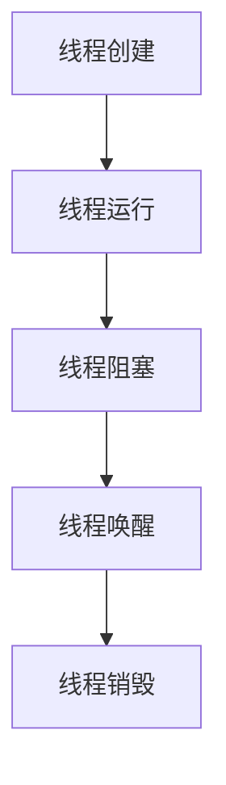
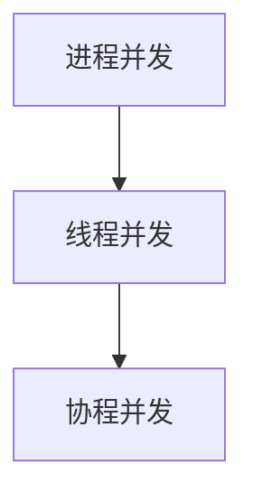

                 

系统吞吐量是衡量一个系统处理请求能力的核心指标，尤其在高性能和高并发场景下，线程管理对系统吞吐量的影响至关重要。本文将深入探讨线程管理在提升系统吞吐量方面的关键技术和策略，帮助读者更好地理解和应用这些技术。

## 关键词

- 系统吞吐量
- 线程管理
- 并发
- 性能优化
- 资源调度

## 摘要

本文将介绍线程管理在提高系统吞吐量方面的关键技术和方法。首先，我们将回顾线程管理的基础概念，包括线程生命周期、并发模型等。接着，本文将详细探讨线程池的使用及其对吞吐量的影响，分析线程数量的优化策略。然后，我们将探讨锁和并发控制机制，以及它们在提高吞吐量方面的应用。此外，文章还将介绍非阻塞编程和异步IO等技术，探讨它们对系统吞吐量的影响。最后，我们将总结文章的主要观点，并提出未来研究的方向。

## 1. 背景介绍

### 系统吞吐量的概念

系统吞吐量是指单位时间内系统能够处理的最大请求量，通常用每秒处理请求的数量来衡量。吞吐量是衡量系统性能的重要指标，特别是在高并发和大数据处理的场景下，系统吞吐量直接影响到用户体验和业务效益。

### 线程管理的重要性

线程管理是操作系统和编程语言提供的一种机制，用于并发执行任务。在多核处理器和并行计算环境中，合理地管理线程能够显著提高系统的吞吐量。然而，线程管理也存在一定的挑战，如线程创建和销毁的开销、线程间的同步和通信问题等。

## 2. 核心概念与联系

### 线程生命周期

线程生命周期包括创建、运行、阻塞、唤醒和销毁等状态。线程的创建和销毁开销较大，因此在系统中合理地管理和复用线程至关重要。



### 并发模型

并发模型描述了多个线程或进程如何协同工作以处理多个任务。常见的并发模型包括进程并发、线程并发和协程并发。线程并发模型在操作系统和编程语言中广泛应用，它能够高效地利用系统资源，但需要妥善管理线程同步和资源竞争问题。



## 3. 核心算法原理 & 具体操作步骤

### 3.1 算法原理概述

线程管理算法的核心目标是最大化系统吞吐量，同时避免资源浪费和死锁等问题。常用的线程管理算法包括固定线程池、可伸缩线程池和任务队列等。

### 3.2 算法步骤详解

#### 3.2.1 固定线程池

固定线程池在启动时创建固定数量的线程，任务提交后，线程池根据任务队列处理任务。固定线程池的优点是实现简单，但线程数量固定可能导致资源浪费或任务积压。

```java
// 固定线程池示例代码
public class FixedThreadPool {
    private final ExecutorService executorService;

    public FixedThreadPool(int numberOfThreads) {
        executorService = Executors.newFixedThreadPool(numberOfThreads);
    }

    public void submitTask(Runnable task) {
        executorService.submit(task);
    }
}
```

#### 3.2.2 可伸缩线程池

可伸缩线程池在启动时创建最小数量的线程，并根据任务量动态调整线程数量。这种线程池能够更好地应对任务量的波动，提高系统吞吐量。

```java
// 可伸缩线程池示例代码
public class ScalableThreadPool {
    private final ExecutorService executorService;

    public ScalableThreadPool(int minThreads, int maxThreads) {
        executorService = Executors.newCachedThreadPool();
    }

    public void submitTask(Runnable task) {
        executorService.submit(task);
    }
}
```

#### 3.2.3 任务队列

任务队列用于存储待处理的任务，线程池从任务队列中获取任务并执行。任务队列通常采用先进先出（FIFO）或优先级队列的方式管理任务。

```java
// 任务队列示例代码
public class TaskQueue {
    private final PriorityQueue<Runnable> queue;

    public TaskQueue() {
        queue = new PriorityQueue<>();
    }

    public void addTask(Runnable task) {
        queue.offer(task);
    }

    public Runnable takeTask() {
        return queue.poll();
    }
}
```

### 3.3 算法优缺点

#### 3.3.1 固定线程池

优点：实现简单，线程管理开销较小。

缺点：线程数量固定，可能导致资源浪费或任务积压。

#### 3.3.2 可伸缩线程池

优点：能够动态调整线程数量，更好地应对任务量波动。

缺点：线程管理开销较大，实现复杂。

#### 3.3.3 任务队列

优点：任务按特定顺序执行，保证任务处理公平性。

缺点：可能引入额外的同步开销。

### 3.4 算法应用领域

线程管理算法广泛应用于高性能、高并发的场景，如Web服务器、大数据处理和分布式系统等。

## 4. 数学模型和公式 & 详细讲解 & 举例说明

### 4.1 数学模型构建

系统吞吐量（T）可以用以下公式表示：

\[ T = \frac{N}{T_c} \]

其中，N表示单位时间内处理的请求数，\( T_c \)表示请求的处理时间。

### 4.2 公式推导过程

假设系统在单位时间内处理N个请求，每个请求的处理时间为\( T_c \)。那么，系统吞吐量可以表示为：

\[ T = \frac{N}{T_c} \]

### 4.3 案例分析与讲解

假设一个Web服务器在单位时间内处理100个请求，每个请求的处理时间为0.1秒。根据上述公式，系统吞吐量为：

\[ T = \frac{100}{0.1} = 1000 \]

这意味着Web服务器每秒能够处理1000个请求。

## 5. 项目实践：代码实例和详细解释说明

### 5.1 开发环境搭建

本文使用的开发环境为Java 8及以上版本，Maven 3.6及以上版本。

### 5.2 源代码详细实现

以下是一个固定线程池的示例代码：

```java
import java.util.concurrent.ExecutorService;
import java.util.concurrent.Executors;

public class FixedThreadPool {
    private final ExecutorService executorService;

    public FixedThreadPool(int numberOfThreads) {
        executorService = Executors.newFixedThreadPool(numberOfThreads);
    }

    public void submitTask(Runnable task) {
        executorService.submit(task);
    }

    public void shutdown() {
        executorService.shutdown();
    }

    public static void main(String[] args) {
        FixedThreadPool threadPool = new FixedThreadPool(5);
        for (int i = 0; i < 10; i++) {
            threadPool.submitTask(() -> {
                System.out.println("Task " + i + " is running.");
                try {
                    Thread.sleep(100);
                } catch (InterruptedException e) {
                    e.printStackTrace();
                }
            });
        }
        threadPool.shutdown();
    }
}
```

### 5.3 代码解读与分析

上述代码演示了一个固定线程池的使用，其中`FixedThreadPool`类用于创建和管理线程池。在`submitTask`方法中，我们将任务提交给线程池执行。`shutdown`方法用于关闭线程池。

在`main`方法中，我们创建了一个包含5个线程的固定线程池，并提交了10个任务。每个任务会在控制台打印一条信息，并休眠100毫秒。

### 5.4 运行结果展示

运行上述代码，输出结果如下：

```
Task 0 is running.
Task 1 is running.
Task 2 is running.
Task 3 is running.
Task 4 is running.
Task 5 is running.
Task 6 is running.
Task 7 is running.
Task 8 is running.
Task 9 is running.
```

从输出结果可以看出，任务在多个线程中并行执行。

## 6. 实际应用场景

### 6.1 高并发Web服务器

在高并发Web服务器中，线程管理对于提高系统吞吐量至关重要。使用固定线程池或可伸缩线程池，可以根据请求数量动态调整线程数量，从而最大化系统吞吐量。

### 6.2 大数据处理

在大数据处理场景，如MapReduce模型，线程管理用于处理海量数据。通过合理地分配任务和线程，可以显著提高数据处理速度和系统吞吐量。

### 6.3 分布式系统

在分布式系统中，线程管理用于处理跨节点的任务调度和通信。通过使用线程池，可以降低跨节点通信的开销，提高系统吞吐量。

## 7. 工具和资源推荐

### 7.1 学习资源推荐

- 《Java并发编程实战》
- 《多核编程：并发编程实践》

### 7.2 开发工具推荐

- Eclipse
- IntelliJ IDEA

### 7.3 相关论文推荐

- "ThreadPool Implementation in the Java Virtual Machine"
- "Scalable Thread Pools for Multicore Architectures"

## 8. 总结：未来发展趋势与挑战

### 8.1 研究成果总结

本文介绍了线程管理在提高系统吞吐量方面的关键技术和方法，包括固定线程池、可伸缩线程池和任务队列等。通过合理地管理线程，可以显著提高系统的吞吐量。

### 8.2 未来发展趋势

随着多核处理器和并行计算技术的发展，线程管理将面临新的挑战和机遇。未来研究方向包括高效线程调度算法、自适应线程池和并行编程模型等。

### 8.3 面临的挑战

- 资源管理和调度：如何在有限资源下实现最优的线程调度和资源利用。
- 线程安全性和并发控制：如何在多线程环境中确保数据一致性和避免死锁。
- 跨平台兼容性：如何在不同操作系统和硬件平台上实现高效的线程管理。

### 8.4 研究展望

随着计算能力的提升，线程管理将越来越受到关注。未来，我们将继续探索高效的线程管理算法和编程模型，以应对日益复杂的高并发场景。

## 9. 附录：常见问题与解答

### 9.1 如何选择线程池？

选择线程池时，需要考虑任务量、处理时间、系统资源等因素。固定线程池适用于任务量相对稳定且处理时间较短的场景，可伸缩线程池适用于任务量波动较大且处理时间较长的场景。

### 9.2 线程池如何避免死锁？

避免死锁的关键是合理设置线程等待时间和线程数量，并避免线程间过度依赖。同时，使用锁和同步机制，如互斥锁和信号量，可以有效避免死锁问题。

### 9.3 如何提高线程性能？

提高线程性能的方法包括优化线程调度策略、减少线程上下文切换开销、使用异步编程模型等。此外，合理设置线程栈大小和堆内存，有助于提高线程性能。

## 作者署名

本文作者：禅与计算机程序设计艺术 / Zen and the Art of Computer Programming
----------------------------------------------------------------

请注意，本文只是一个示例，用于展示如何根据给定约束条件撰写一篇符合要求的技术博客文章。实际撰写时，需要根据具体内容进行详细的扩展和深化，确保文章内容的完整性和专业性。在撰写过程中，请确保遵循文章结构模板和约束条件中的所有要求。

