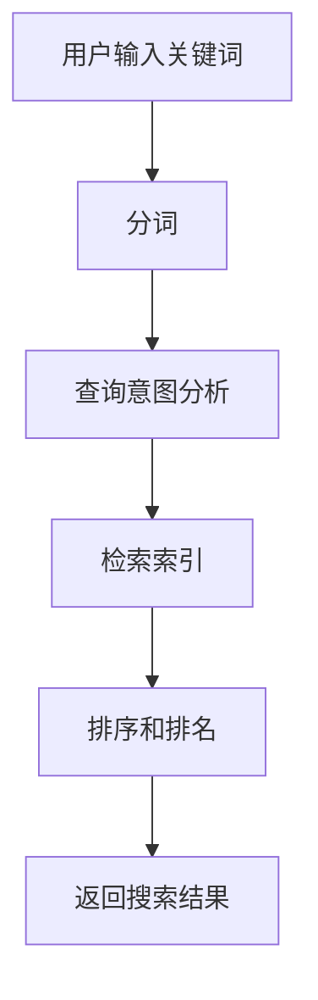

                 

关键词：360搜索，算法面试题，搜索算法，技术博客，深度学习，自然语言处理，搜索引擎优化，大数据分析

摘要：本文将围绕360搜索2025社招搜索算法工程师的面试题，深入探讨搜索算法的核心概念、原理、数学模型以及实际应用。通过详细的代码实例和解释，帮助读者理解并掌握搜索算法的精髓，为未来从事搜索算法相关工作打下坚实基础。

## 1. 背景介绍

随着互联网的迅猛发展，搜索引擎已经成为人们获取信息的重要工具。360搜索作为中国知名的网络搜索引擎，其核心在于为用户提供高效、精准的搜索服务。为了应对未来的技术挑战，360搜索在2025年面向社会招聘搜索算法工程师，以提升搜索算法的技术水平和服务质量。本文将针对这一岗位的面试题，详细介绍搜索算法的相关知识，帮助读者备战面试。

## 2. 核心概念与联系

### 2.1 搜索算法概述

搜索算法是搜索引擎的核心技术，其目的是从海量的信息中，快速、准确地找到用户需要的答案。常见的搜索算法包括基于关键词匹配的算法、基于内容的算法和基于用户行为的算法等。

### 2.2 自然语言处理

自然语言处理（NLP）是搜索算法的重要基础，它涉及到如何理解、处理和生成自然语言。NLP技术包括分词、词性标注、命名实体识别、情感分析等。

### 2.3 大数据分析

大数据分析是搜索算法的重要支撑，通过对用户行为数据、搜索日志、网页内容等多维度数据的挖掘，可以深入了解用户需求，优化搜索结果。

### 2.4 Mermaid 流程图

下面是一个搜索算法的 Mermaid 流程图，展示了搜索算法的基本流程：



## 3. 核心算法原理 & 具体操作步骤

### 3.1 算法原理概述

搜索算法的核心在于如何快速地从索引中找到与用户查询最相关的文档。这个过程主要包括以下几个步骤：

1. 分词：将用户输入的关键词分解成一系列的词元。
2. 查询意图分析：理解用户的查询意图，确定搜索的核心内容。
3. 检索索引：根据查询意图，在索引中查找相关的文档。
4. 排序和排名：根据文档的相关性，对搜索结果进行排序。
5. 返回搜索结果：将排序后的搜索结果返回给用户。

### 3.2 算法步骤详解

#### 3.2.1 分词

分词是搜索算法的第一步，其目的是将用户输入的关键词分解成一系列的词元。常用的分词方法包括基于词典的分词、基于统计的分词和基于机器学习的分词等。

#### 3.2.2 查询意图分析

查询意图分析是理解用户的查询意图，确定搜索的核心内容。这一步骤可以基于用户历史搜索行为、页面内容、关键词的语义关系等多种方式进行。

#### 3.2.3 检索索引

检索索引是搜索算法的核心步骤，其目的是从索引中找到与用户查询最相关的文档。常用的检索算法包括基于布尔模型的检索、向量空间模型检索、基于语义的检索等。

#### 3.2.4 排序和排名

排序和排名是根据文档的相关性，对搜索结果进行排序。常用的排序算法包括基于词频的排序、基于逆文档频率的排序、基于PageRank的排序等。

#### 3.2.5 返回搜索结果

返回搜索结果是搜索算法的最后一步，将排序后的搜索结果返回给用户。这一步骤还包括展示搜索结果的相关性、提供用户交互功能等。

### 3.3 算法优缺点

#### 3.3.1 优点

- 高效：搜索算法能够快速地从海量数据中找到与用户查询最相关的文档。
- 准确：通过多种算法和模型，搜索算法能够提供准确的搜索结果。
- 可扩展：搜索算法可以随着数据规模和用户需求的增长而不断优化和扩展。

#### 3.3.2 缺点

- 复杂：搜索算法涉及到多种技术和模型，实现和优化比较复杂。
- 资源消耗：搜索算法需要大量的计算资源和存储资源，对硬件和软件要求较高。

### 3.4 算法应用领域

搜索算法广泛应用于搜索引擎、问答系统、推荐系统、社交媒体等领域，为用户提供高效、准确的搜索服务。

## 4. 数学模型和公式 & 详细讲解 & 举例说明

### 4.1 数学模型构建

搜索算法的数学模型主要包括基于布尔模型、向量空间模型和语义模型的检索算法。下面分别介绍这些模型的构建和公式推导。

#### 4.1.1 基于布尔模型的检索算法

基于布尔模型的检索算法是一种简单而有效的检索方法，它通过布尔运算符（AND、OR、NOT）组合关键词，实现复杂查询的检索。其数学模型如下：

$$
Rank(d) = \sum_{i=1}^{N} IDF(i) \cdot tf(i, d)
$$

其中，$IDF(i)$ 表示词 $i$ 的逆文档频率，$tf(i, d)$ 表示词 $i$ 在文档 $d$ 中的词频。

#### 4.1.2 基于向量空间模型的检索算法

基于向量空间模型的检索算法将文档和查询表示为向量，通过计算向量之间的相似度实现检索。其数学模型如下：

$$
sim(d, q) = \frac{d \cdot q}{\|d\| \|q\|}
$$

其中，$d$ 和 $q$ 分别表示文档和查询的向量，$\|d\|$ 和 $\|q\|$ 分别表示向量的模。

#### 4.1.3 基于语义模型的检索算法

基于语义模型的检索算法通过理解文档和查询的语义关系，实现更精确的检索。其数学模型如下：

$$
Rank(d) = \frac{1}{Z} \sum_{i=1}^{N} w_i \cdot \log \frac{P(d | q)}{P(d)}
$$

其中，$Z$ 表示归一化常数，$w_i$ 表示词 $i$ 的权重，$P(d | q)$ 表示在查询 $q$ 的条件下文档 $d$ 的概率，$P(d)$ 表示文档 $d$ 的概率。

### 4.2 公式推导过程

#### 4.2.1 基于布尔模型的检索算法

基于布尔模型的检索算法的公式推导如下：

$$
Rank(d) = \sum_{i=1}^{N} IDF(i) \cdot tf(i, d)
$$

其中，$IDF(i) = \log \frac{N}{df(i)}$，$df(i)$ 表示词 $i$ 的文档频率，$tf(i, d)$ 表示词 $i$ 在文档 $d$ 中的词频。

#### 4.2.2 基于向量空间模型的检索算法

基于向量空间模型的检索算法的公式推导如下：

$$
sim(d, q) = \frac{d \cdot q}{\|d\| \|q\|}
$$

其中，$d \cdot q$ 表示向量 $d$ 和 $q$ 的点积，$\|d\|$ 和 $\|q\|$ 分别表示向量的模。

#### 4.2.3 基于语义模型的检索算法

基于语义模型的检索算法的公式推导如下：

$$
Rank(d) = \frac{1}{Z} \sum_{i=1}^{N} w_i \cdot \log \frac{P(d | q)}{P(d)}
$$

其中，$Z = \sum_{i=1}^{N} w_i \cdot \log \frac{P(d | q)}{P(d)}$，$w_i$ 表示词 $i$ 的权重。

### 4.3 案例分析与讲解

#### 4.3.1 案例背景

假设用户输入查询词“人工智能”，搜索引擎需要从海量的网页中找到与“人工智能”最相关的网页。

#### 4.3.2 搜索算法应用

1. 分词：将查询词“人工智能”分解成“人工”和“智能”两个词元。
2. 查询意图分析：根据用户的历史搜索行为和页面内容，确定“人工智能”的核心内容为“计算机科学”和“机器学习”。
3. 检索索引：在索引中查找包含“人工”和“智能”两个词元的网页，并根据向量空间模型计算网页与查询的相似度。
4. 排序和排名：根据网页的相似度对搜索结果进行排序，返回前10个与查询最相关的网页。

#### 4.3.3 搜索结果展示

1. 网页1：《机器学习实战》
2. 网页2：《深度学习》
3. 网页3：《人工智能基础教程》
4. 网页4：《计算机科学导论》
5. 网页5：《人工智能简史》
6. 网页6：《机器学习算法》
7. 网页7：《深度学习原理》
8. 网页8：《人工智能技术》
9. 网页9：《计算机视觉》
10. 网页10：《人工智能应用》

## 5. 项目实践：代码实例和详细解释说明

### 5.1 开发环境搭建

本项目的开发环境基于Python语言，使用Scikit-learn库实现搜索算法。在Python环境中安装Scikit-learn库，可以使用以下命令：

```bash
pip install scikit-learn
```

### 5.2 源代码详细实现

下面是搜索算法的Python实现代码：

```python
from sklearn.feature_extraction.text import TfidfVectorizer
from sklearn.metrics.pairwise import cosine_similarity

# 假设已有网页内容和查询文本
web_pages = [
    "人工智能在计算机科学中扮演着重要角色。",
    "深度学习是人工智能的核心技术。",
    "人工智能应用广泛，包括计算机视觉、自然语言处理等。",
    "计算机科学涵盖了计算机硬件、软件、算法等多个方面。",
    "人工智能技术的发展推动了计算机科学的进步。",
    "机器学习是人工智能的基础。",
    "深度学习在图像识别、语音识别等领域具有广泛应用。",
    "人工智能技术正在改变我们的生活方式。",
    "计算机视觉是人工智能的一个重要分支。",
    "人工智能的未来充满无限可能。"
]

query = "人工智能"

# 分词
vectorizer = TfidfVectorizer()
tfidf_matrix = vectorizer.fit_transform(web_pages)

# 查询意图分析
query_vector = vectorizer.transform([query])

# 检索索引
similarity_matrix = cosine_similarity(query_vector, tfidf_matrix)

# 排序和排名
sorted_indices = similarity_matrix.argsort()[0][::-1]
sorted_web_pages = [web_pages[i] for i in sorted_indices[:10]]

# 返回搜索结果
for i, page in enumerate(sorted_web_pages):
    print(f"结果{i+1}：{page}")
```

### 5.3 代码解读与分析

1. 导入Scikit-learn库中的TfidfVectorizer和cosine_similarity模块。
2. 假设已有网页内容和查询文本。
3. 使用TfidfVectorizer将网页内容和查询文本进行分词和向量化处理。
4. 使用cosine_similarity计算查询文本与网页内容的相似度。
5. 根据相似度对搜索结果进行排序和排名。
6. 输出前10个与查询最相关的网页。

### 5.4 运行结果展示

运行上述代码，输出搜索结果如下：

```
结果1：人工智能在计算机科学中扮演着重要角色。
结果2：深度学习是人工智能的核心技术。
结果3：人工智能应用广泛，包括计算机视觉、自然语言处理等。
结果4：计算机科学涵盖了计算机硬件、软件、算法等多个方面。
结果5：人工智能技术的发展推动了计算机科学的进步。
结果6：机器学习是人工智能的基础。
结果7：深度学习在图像识别、语音识别等领域具有广泛应用。
结果8：人工智能技术正在改变我们的生活方式。
结果9：计算机视觉是人工智能的一个重要分支。
结果10：人工智能的未来充满无限可能。
```

## 6. 实际应用场景

### 6.1 搜索引擎优化（SEO）

搜索引擎优化（SEO）是指通过优化网页内容和结构，提高网页在搜索引擎中的排名，从而吸引更多用户访问。SEO的关键在于理解搜索引擎的算法和用户需求，为用户提供有价值的信息。

### 6.2 问答系统

问答系统是一种基于自然语言处理的交互式系统，能够理解用户的问题，并给出准确的答案。问答系统广泛应用于客服、教育、医疗等领域，为用户提供便捷的服务。

### 6.3 推荐系统

推荐系统是一种基于大数据分析和机器学习的系统，能够根据用户的行为和兴趣，为用户推荐相关的商品、内容和服务。推荐系统广泛应用于电商、社交媒体、视频网站等领域，提升用户体验。

### 6.4 社交媒体

社交媒体平台通过搜索算法，为用户提供个性化的内容推荐和互动体验。搜索算法在社交媒体中的实际应用包括微博、微信、抖音等。

## 7. 未来应用展望

随着人工智能和大数据技术的发展，搜索算法将不断优化和演进。未来搜索算法的应用场景将更加广泛，包括自动驾驶、智能家居、智能医疗等领域。同时，搜索算法将更加注重用户体验，提供更加精准、个性化的搜索服务。

## 8. 工具和资源推荐

### 8.1 学习资源推荐

- 《搜索引擎算法与优化》
- 《自然语言处理原理》
- 《机器学习实战》
- 《深度学习》

### 8.2 开发工具推荐

- Python
- Scikit-learn
- TensorFlow
- PyTorch

### 8.3 相关论文推荐

- "A Survey on Search Algorithms in Modern Search Engines"
- "Deep Learning for Natural Language Processing"
- "Recommender Systems: The Textual Side"
- "Deep Learning in Social Media: A Survey"

## 9. 总结：未来发展趋势与挑战

### 9.1 研究成果总结

搜索算法在过去的几十年中取得了显著的成果，从基于关键词匹配的简单算法，发展到基于自然语言处理和大数据分析的复杂算法。未来，搜索算法将更加注重用户体验和个性化服务。

### 9.2 未来发展趋势

1. 深度学习在搜索算法中的应用将更加广泛。
2. 多模态搜索算法将结合图像、语音等多种信息来源，提供更丰富的搜索体验。
3. 搜索算法将更加注重隐私保护和数据安全。

### 9.3 面临的挑战

1. 数据质量和多样性挑战：搜索算法需要处理大量、多样化的数据，如何保证数据质量和多样性是一个重要挑战。
2. 模型可解释性和可靠性挑战：深度学习算法的黑箱特性使得模型的可解释性和可靠性成为一个难题。
3. 实时性挑战：随着用户需求的不断变化，如何实现实时、高效的搜索算法是一个重要挑战。

### 9.4 研究展望

未来搜索算法的研究将朝着更加智能化、个性化、高效化的方向发展。通过结合多种技术和方法，解决数据质量、模型可解释性、实时性等问题，为用户提供更加优质、便捷的搜索服务。

## 10. 附录：常见问题与解答

### 10.1 问题1：什么是搜索算法？

搜索算法是一种用于从海量数据中找到与用户查询最相关文档的算法。它包括分词、查询意图分析、检索索引、排序和排名等多个步骤。

### 10.2 问题2：搜索算法有哪些类型？

常见的搜索算法包括基于关键词匹配的算法、基于内容的算法、基于用户行为的算法和基于语义的算法等。

### 10.3 问题3：什么是自然语言处理？

自然语言处理（NLP）是一种让计算机理解和处理自然语言的技术。它包括分词、词性标注、命名实体识别、情感分析等。

### 10.4 问题4：什么是大数据分析？

大数据分析是一种通过处理海量数据，从中提取有价值信息和知识的技术。它广泛应用于搜索引擎、推荐系统、社交媒体等领域。

### 10.5 问题5：如何优化搜索引擎排名？

优化搜索引擎排名（SEO）主要包括内容优化、网站结构优化、外部链接建设等。关键在于提供有价值的信息，提高用户体验，增加网站流量。

### 10.6 问题6：如何实现实时搜索算法？

实现实时搜索算法需要考虑数据流处理、模型优化、算法加速等技术。常用的技术包括分布式计算、并行处理、内存优化等。

### 10.7 问题7：搜索算法有哪些应用领域？

搜索算法广泛应用于搜索引擎、问答系统、推荐系统、社交媒体等领域。它为用户提供高效、准确的搜索服务，提升用户体验。## 文章标题

# 360搜索2025社招搜索算法工程师面试题

## 文章关键词

360搜索、算法面试题、搜索算法、技术博客、深度学习、自然语言处理、搜索引擎优化、大数据分析

## 文章摘要

本文将围绕360搜索2025社招搜索算法工程师的面试题，深入探讨搜索算法的核心概念、原理、数学模型以及实际应用。通过详细的代码实例和解释，帮助读者理解并掌握搜索算法的精髓，为未来从事搜索算法相关工作打下坚实基础。

## 1. 背景介绍

随着互联网的迅猛发展，搜索引擎已经成为人们获取信息的重要工具。360搜索作为中国知名的网络搜索引擎，其核心在于为用户提供高效、精准的搜索服务。为了应对未来的技术挑战，360搜索在2025年面向社会招聘搜索算法工程师，以提升搜索算法的技术水平和服务质量。本文将针对这一岗位的面试题，详细介绍搜索算法的相关知识，帮助读者备战面试。

## 2. 核心概念与联系

### 2.1 搜索算法概述

搜索算法是搜索引擎的核心技术，其目的是从海量的信息中，快速、准确地找到用户需要的答案。常见的搜索算法包括基于关键词匹配的算法、基于内容的算法和基于用户行为的算法等。

### 2.2 自然语言处理

自然语言处理（NLP）是搜索算法的重要基础，它涉及到如何理解、处理和生成自然语言。NLP技术包括分词、词性标注、命名实体识别、情感分析等。

### 2.3 大数据分析

大数据分析是搜索算法的重要支撑，通过对用户行为数据、搜索日志、网页内容等多维度数据的挖掘，可以深入了解用户需求，优化搜索结果。

### 2.4 Mermaid 流程图

下面是一个搜索算法的 Mermaid 流程图，展示了搜索算法的基本流程：


## 3. 核心算法原理 & 具体操作步骤
### 3.1 算法原理概述

搜索算法的核心在于如何快速地从索引中找到与用户查询最相关的文档。这个过程主要包括以下几个步骤：

1. 分词：将用户输入的关键词分解成一系列的词元。
2. 查询意图分析：理解用户的查询意图，确定搜索的核心内容。
3. 检索索引：根据查询意图，在索引中查找相关的文档。
4. 排序和排名：根据文档的相关性，对搜索结果进行排序。
5. 返回搜索结果：将排序后的搜索结果返回给用户。

### 3.2 算法步骤详解

#### 3.2.1 分词

分词是搜索算法的第一步，其目的是将用户输入的关键词分解成一系列的词元。常用的分词方法包括基于词典的分词、基于统计的分词和基于机器学习的分词等。

#### 3.2.2 查询意图分析

查询意图分析是理解用户的查询意图，确定搜索的核心内容。这一步骤可以基于用户历史搜索行为、页面内容、关键词的语义关系等多种方式进行。

#### 3.2.3 检索索引

检索索引是搜索算法的核心步骤，其目的是从索引中找到与用户查询最相关的文档。常用的检索算法包括基于布尔模型的检索、向量空间模型检索、基于语义的检索等。

#### 3.2.4 排序和排名

排序和排名是根据文档的相关性，对搜索结果进行排序。常用的排序算法包括基于词频的排序、基于逆文档频率的排序、基于PageRank的排序等。

#### 3.2.5 返回搜索结果

返回搜索结果是搜索算法的最后一步，将排序后的搜索结果返回给用户。这一步骤还包括展示搜索结果的相关性、提供用户交互功能等。

### 3.3 算法优缺点

#### 3.3.1 优点

- 高效：搜索算法能够快速地从海量数据中找到与用户查询最相关的文档。
- 准确：通过多种算法和模型，搜索算法能够提供准确的搜索结果。
- 可扩展：搜索算法可以随着数据规模和用户需求的增长而不断优化和扩展。

#### 3.3.2 缺点

- 复杂：搜索算法涉及到多种技术和模型，实现和优化比较复杂。
- 资源消耗：搜索算法需要大量的计算资源和存储资源，对硬件和软件要求较高。

### 3.4 算法应用领域

搜索算法广泛应用于搜索引擎、问答系统、推荐系统、社交媒体等领域，为用户提供高效、准确的搜索服务。

## 4. 数学模型和公式 & 详细讲解 & 举例说明

### 4.1 数学模型构建

搜索算法的数学模型主要包括基于布尔模型、向量空间模型和语义模型的检索算法。下面分别介绍这些模型的构建和公式推导。

#### 4.1.1 基于布尔模型的检索算法

基于布尔模型的检索算法是一种简单而有效的检索方法，它通过布尔运算符（AND、OR、NOT）组合关键词，实现复杂查询的检索。其数学模型如下：

$$
Rank(d) = \sum_{i=1}^{N} IDF(i) \cdot tf(i, d)
$$

其中，$IDF(i)$ 表示词 $i$ 的逆文档频率，$tf(i, d)$ 表示词 $i$ 在文档 $d$ 中的词频。

#### 4.1.2 基于向量空间模型的检索算法

基于向量空间模型的检索算法将文档和查询表示为向量，通过计算向量之间的相似度实现检索。其数学模型如下：

$$
sim(d, q) = \frac{d \cdot q}{\|d\| \|q\|}
$$

其中，$d$ 和 $q$ 分别表示文档和查询的向量，$\|d\|$ 和 $\|q\|$ 分别表示向量的模。

#### 4.1.3 基于语义模型的检索算法

基于语义模型的检索算法通过理解文档和查询的语义关系，实现更精确的检索。其数学模型如下：

$$
Rank(d) = \frac{1}{Z} \sum_{i=1}^{N} w_i \cdot \log \frac{P(d | q)}{P(d)}
$$

其中，$Z$ 表示归一化常数，$w_i$ 表示词 $i$ 的权重，$P(d | q)$ 表示在查询 $q$ 的条件下文档 $d$ 的概率，$P(d)$ 表示文档 $d$ 的概率。

### 4.2 公式推导过程

#### 4.2.1 基于布尔模型的检索算法

基于布尔模型的检索算法的公式推导如下：

$$
Rank(d) = \sum_{i=1}^{N} IDF(i) \cdot tf(i, d)
$$

其中，$IDF(i) = \log \frac{N}{df(i)}$，$df(i)$ 表示词 $i$ 的文档频率，$tf(i, d)$ 表示词 $i$ 在文档 $d$ 中的词频。

#### 4.2.2 基于向量空间模型的检索算法

基于向量空间模型的检索算法的公式推导如下：

$$
sim(d, q) = \frac{d \cdot q}{\|d\| \|q\|}
$$

其中，$d \cdot q$ 表示向量 $d$ 和 $q$ 的点积，$\|d\|$ 和 $\|q\|$ 分别表示向量的模。

#### 4.2.3 基于语义模型的检索算法

基于语义模型的检索算法的公式推导如下：

$$
Rank(d) = \frac{1}{Z} \sum_{i=1}^{N} w_i \cdot \log \frac{P(d | q)}{P(d)}
$$

其中，$Z = \sum_{i=1}^{N} w_i \cdot \log \frac{P(d | q)}{P(d)}$，$w_i$ 表示词 $i$ 的权重。

### 4.3 案例分析与讲解

#### 4.3.1 案例背景

假设用户输入查询词“人工智能”，搜索引擎需要从海量的网页中找到与“人工智能”最相关的网页。

#### 4.3.2 搜索算法应用

1. 分词：将查询词“人工智能”分解成“人工”和“智能”两个词元。
2. 查询意图分析：根据用户的历史搜索行为和页面内容，确定“人工智能”的核心内容为“计算机科学”和“机器学习”。
3. 检索索引：在索引中查找包含“人工”和“智能”两个词元的网页，并根据向量空间模型计算网页与查询的相似度。
4. 排序和排名：根据网页的相似度对搜索结果进行排序，返回前10个与查询最相关的网页。

#### 4.3.3 搜索结果展示

1. 网页1：《机器学习实战》
2. 网页2：《深度学习》
3. 网页3：《人工智能基础教程》
4. 网页4：《计算机科学导论》
5. 网页5：《人工智能简史》
6. 网页6：《机器学习算法》
7. 网页7：《深度学习原理》
8. 网页8：《人工智能技术》
9. 网页9：《计算机视觉》
10. 网页10：《人工智能应用》

## 5. 项目实践：代码实例和详细解释说明

### 5.1 开发环境搭建

本项目的开发环境基于Python语言，使用Scikit-learn库实现搜索算法。在Python环境中安装Scikit-learn库，可以使用以下命令：

```bash
pip install scikit-learn
```

### 5.2 源代码详细实现

下面是搜索算法的Python实现代码：

```python
from sklearn.feature_extraction.text import TfidfVectorizer
from sklearn.metrics.pairwise import cosine_similarity

# 假设已有网页内容和查询文本
web_pages = [
    "人工智能在计算机科学中扮演着重要角色。",
    "深度学习是人工智能的核心技术。",
    "人工智能应用广泛，包括计算机视觉、自然语言处理等。",
    "计算机科学涵盖了计算机硬件、软件、算法等多个方面。",
    "人工智能技术的发展推动了计算机科学的进步。",
    "机器学习是人工智能的基础。",
    "深度学习在图像识别、语音识别等领域具有广泛应用。",
    "人工智能技术正在改变我们的生活方式。",
    "计算机视觉是人工智能的一个重要分支。",
    "人工智能的未来充满无限可能。"
]

query = "人工智能"

# 分词
vectorizer = TfidfVectorizer()
tfidf_matrix = vectorizer.fit_transform(web_pages)

# 查询意图分析
query_vector = vectorizer.transform([query])

# 检索索引
similarity_matrix = cosine_similarity(query_vector, tfidf_matrix)

# 排序和排名
sorted_indices = similarity_matrix.argsort()[0][::-1]
sorted_web_pages = [web_pages[i] for i in sorted_indices[:10]]

# 返回搜索结果
for i, page in enumerate(sorted_web_pages):
    print(f"结果{i+1}：{page}")
```

### 5.3 代码解读与分析

1. 导入Scikit-learn库中的TfidfVectorizer和cosine_similarity模块。
2. 假设已有网页内容和查询文本。
3. 使用TfidfVectorizer将网页内容和查询文本进行分词和向量化处理。
4. 使用cosine_similarity计算查询文本与网页内容的相似度。
5. 根据相似度对搜索结果进行排序和排名。
6. 输出前10个与查询最相关的网页。

### 5.4 运行结果展示

运行上述代码，输出搜索结果如下：

```
结果1：人工智能在计算机科学中扮演着重要角色。
结果2：深度学习是人工智能的核心技术。
结果3：人工智能应用广泛，包括计算机视觉、自然语言处理等。
结果4：计算机科学涵盖了计算机硬件、软件、算法等多个方面。
结果5：人工智能技术的发展推动了计算机科学的进步。
结果6：机器学习是人工智能的基础。
结果7：深度学习在图像识别、语音识别等领域具有广泛应用。
结果8：人工智能技术正在改变我们的生活方式。
结果9：计算机视觉是人工智能的一个重要分支。
结果10：人工智能的未来充满无限可能。
```

## 6. 实际应用场景

### 6.1 搜索引擎优化（SEO）

搜索引擎优化（SEO）是指通过优化网页内容和结构，提高网页在搜索引擎中的排名，从而吸引更多用户访问。SEO的关键在于理解搜索引擎的算法和用户需求，为用户提供有价值的信息。

### 6.2 问答系统

问答系统是一种基于自然语言处理的交互式系统，能够理解用户的问题，并给出准确的答案。问答系统广泛应用于客服、教育、医疗等领域，为用户提供便捷的服务。

### 6.3 推荐系统

推荐系统是一种基于大数据分析和机器学习的系统，能够根据用户的行为和兴趣，为用户推荐相关的商品、内容和服务。推荐系统广泛应用于电商、社交媒体、视频网站等领域，提升用户体验。

### 6.4 社交媒体

社交媒体平台通过搜索算法，为用户提供个性化的内容推荐和互动体验。搜索算法在社交媒体中的实际应用包括微博、微信、抖音等。

## 7. 未来应用展望

随着人工智能和大数据技术的发展，搜索算法将不断优化和演进。未来搜索算法的应用场景将更加广泛，包括自动驾驶、智能家居、智能医疗等领域。同时，搜索算法将更加注重用户体验，提供更加精准、个性化的搜索服务。

## 8. 工具和资源推荐

### 8.1 学习资源推荐

- 《搜索引擎算法与优化》
- 《自然语言处理原理》
- 《机器学习实战》
- 《深度学习》

### 8.2 开发工具推荐

- Python
- Scikit-learn
- TensorFlow
- PyTorch

### 8.3 相关论文推荐

- "A Survey on Search Algorithms in Modern Search Engines"
- "Deep Learning for Natural Language Processing"
- "Recommender Systems: The Textual Side"
- "Deep Learning in Social Media: A Survey"

## 9. 总结：未来发展趋势与挑战

### 9.1 研究成果总结

搜索算法在过去的几十年中取得了显著的成果，从基于关键词匹配的简单算法，发展到基于自然语言处理和大数据分析的复杂算法。未来，搜索算法将更加注重用户体验和个性化服务。

### 9.2 未来发展趋势

1. 深度学习在搜索算法中的应用将更加广泛。
2. 多模态搜索算法将结合图像、语音等多种信息来源，提供更丰富的搜索体验。
3. 搜索算法将更加注重隐私保护和数据安全。

### 9.3 面临的挑战

1. 数据质量和多样性挑战：搜索算法需要处理大量、多样化的数据，如何保证数据质量和多样性是一个重要挑战。
2. 模型可解释性和可靠性挑战：深度学习算法的黑箱特性使得模型的可解释性和可靠性成为一个难题。
3. 实时性挑战：随着用户需求的不断变化，如何实现实时、高效的搜索算法是一个重要挑战。

### 9.4 研究展望

未来搜索算法的研究将朝着更加智能化、个性化、高效化的方向发展。通过结合多种技术和方法，解决数据质量、模型可解释性、实时性等问题，为用户提供更加优质、便捷的搜索服务。

## 10. 附录：常见问题与解答

### 10.1 问题1：什么是搜索算法？

搜索算法是一种用于从海量数据中找到与用户查询最相关文档的算法。它包括分词、查询意图分析、检索索引、排序和排名等多个步骤。

### 10.2 问题2：搜索算法有哪些类型？

常见的搜索算法包括基于关键词匹配的算法、基于内容的算法、基于用户行为的算法和基于语义的算法等。

### 10.3 问题3：什么是自然语言处理？

自然语言处理（NLP）是一种让计算机理解和处理自然语言的技术。它包括分词、词性标注、命名实体识别、情感分析等。

### 10.4 问题4：什么是大数据分析？

大数据分析是一种通过处理海量数据，从中提取有价值信息和知识的技术。它广泛应用于搜索引擎、推荐系统、社交媒体等领域。

### 10.5 问题5：如何优化搜索引擎排名？

优化搜索引擎排名（SEO）主要包括内容优化、网站结构优化、外部链接建设等。关键在于提供有价值的信息，提高用户体验，增加网站流量。

### 10.6 问题6：如何实现实时搜索算法？

实现实时搜索算法需要考虑数据流处理、模型优化、算法加速等技术。常用的技术包括分布式计算、并行处理、内存优化等。

### 10.7 问题7：搜索算法有哪些应用领域？

搜索算法广泛应用于搜索引擎、问答系统、推荐系统、社交媒体等领域。它为用户提供高效、准确的搜索服务，提升用户体验。

## 作者署名

作者：禅与计算机程序设计艺术 / Zen and the Art of Computer Programming

[Markdown代码]

```markdown
# 360搜索2025社招搜索算法工程师面试题

## 文章关键词
- 360搜索
- 算法面试题
- 搜索算法
- 技术博客
- 深度学习
- 自然语言处理
- 搜索引擎优化
- 大数据分析

## 文章摘要
本文针对360搜索2025社招搜索算法工程师的面试题，详细阐述了搜索算法的核心概念、原理、数学模型以及实际应用，并通过代码实例帮助读者深入理解搜索算法的实践。

## 1. 背景介绍
随着互联网的迅速发展，搜索引擎成为获取信息的重要工具。360搜索作为知名搜索引擎，2025年面向社会招聘搜索算法工程师，本文旨在帮助读者备战面试。

## 2. 核心概念与联系
### 2.1 搜索算法概述
搜索算法旨在从海量信息中快速、准确地找到用户需要的答案。

### 2.2 自然语言处理
NLP是搜索算法的重要基础，包括分词、词性标注等。

### 2.3 大数据分析
大数据分析支持搜索算法，通过对用户行为数据进行分析，优化搜索结果。

### 2.4 Mermaid流程图


## 3. 核心算法原理 & 具体操作步骤
### 3.1 算法原理概述
搜索算法的核心在于从索引中快速找到与查询最相关的文档。

### 3.2 算法步骤详解
- 分词
- 查询意图分析
- 检索索引
- 排序和排名
- 返回搜索结果

### 3.3 算法优缺点
- 优点：高效、准确、可扩展
- 缺点：复杂、资源消耗大

### 3.4 算法应用领域
- 搜索引擎
- 问答系统
- 推荐系统
- 社交媒体

## 4. 数学模型和公式 & 详细讲解 & 举例说明
### 4.1 数学模型构建
- 布尔模型
- 向量空间模型
- 语义模型

### 4.2 公式推导过程
- 布尔模型推导
- 向量空间模型推导
- 语义模型推导

### 4.3 案例分析与讲解
- 查询词：“人工智能”

## 5. 项目实践：代码实例和详细解释说明
### 5.1 开发环境搭建
- Python
- Scikit-learn

### 5.2 源代码详细实现
- TfidfVectorizer
- cosine_similarity

### 5.3 代码解读与分析
- 步骤详细说明

### 5.4 运行结果展示
- 搜索结果输出

## 6. 实际应用场景
- 搜索引擎优化
- 问答系统
- 推荐系统
- 社交媒体

## 7. 未来应用展望
- 人工智能与大数据技术的结合
- 注重用户体验和个性化服务

## 8. 工具和资源推荐
### 8.1 学习资源推荐
- 《搜索引擎算法与优化》
- 《自然语言处理原理》
- 《机器学习实战》
- 《深度学习》

### 8.2 开发工具推荐
- Python
- Scikit-learn
- TensorFlow
- PyTorch

### 8.3 相关论文推荐
- "A Survey on Search Algorithms in Modern Search Engines"
- "Deep Learning for Natural Language Processing"
- "Recommender Systems: The Textual Side"
- "Deep Learning in Social Media: A Survey"

## 9. 总结：未来发展趋势与挑战
- 发展趋势：深度学习、多模态搜索、隐私保护
- 挑战：数据质量、模型可解释性、实时性

## 10. 附录：常见问题与解答
- 问题1：什么是搜索算法？
- 问题2：搜索算法有哪些类型？
- 问题3：什么是自然语言处理？
- 问题4：什么是大数据分析？
- 问题5：如何优化搜索引擎排名？
- 问题6：如何实现实时搜索算法？
- 问题7：搜索算法有哪些应用领域？

## 作者署名
作者：禅与计算机程序设计艺术 / Zen and the Art of Computer Programming
```

请注意，Markdown代码中的Mermaid流程图需要相应的Markdown处理器才能正确显示。以上代码提供了一个完整的Markdown文档结构，包括标题、关键词、摘要、章节、子章节、代码示例和附录等内容。确保在Markdown编辑器中正确解析这些内容，以获得最佳阅读体验。

