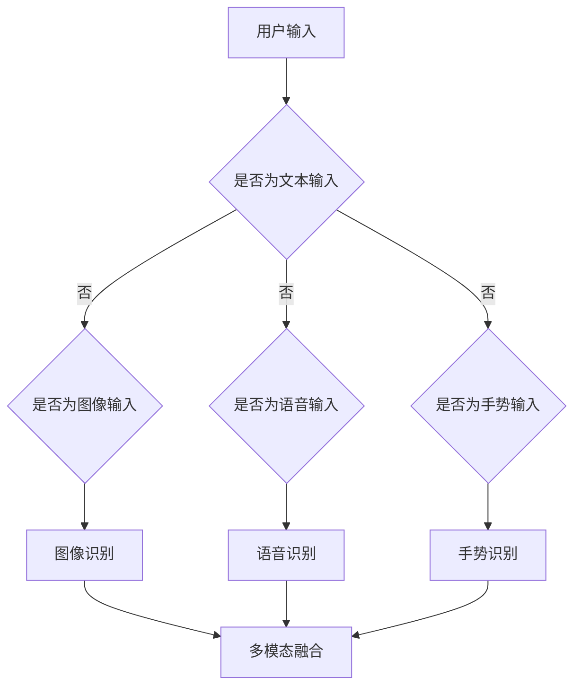

                 

在数字化的今天，搜索引擎已经成为人们获取信息、解决问题的重要工具。然而，随着技术的不断进步，单一文本搜索模式已无法满足用户日益多样化的需求。多模态交互应运而生，为用户提供了更加丰富和直观的搜索体验。本文将探讨搜索引擎多模态交互的发展历程、核心概念、算法原理及其未来应用前景。

## 关键词
- 多模态交互
- 搜索引擎
- 图像识别
- 语音识别
- 自然语言处理

## 摘要
本文从多模态交互的定义出发，详细介绍了搜索引擎多模态交互的发展历程。通过核心概念的阐释与联系，深入剖析了多模态交互技术的基本原理，包括图像识别、语音识别和自然语言处理等。此外，文章还探讨了多模态交互算法的优缺点及实际应用领域，并结合具体案例展示了其应用效果。最后，本文展望了多模态交互技术在搜索引擎领域的未来发展，并提出了面临的挑战和机遇。

## 1. 背景介绍
随着互联网的普及和信息量的爆炸性增长，传统的文本搜索模式已经无法满足用户对信息获取的多样化和个性化的需求。多模态交互作为一种新兴的人机交互方式，通过整合多种感知模式（如视觉、听觉、触觉等），使用户能够以更加自然和便捷的方式与计算机系统进行交互。搜索引擎作为互联网的核心应用之一，其交互方式的改进对于提升用户体验和搜索效率具有重要意义。

### 1.1 多模态交互的概念
多模态交互是指通过结合两种或两种以上的感知模式（如视觉、听觉、触觉等）与计算机系统进行交互的过程。在多模态交互中，用户可以通过不同的方式（如图像、语音、手势等）与系统进行互动，从而实现信息获取、任务执行等目标。

### 1.2 多模态交互在搜索引擎中的应用
多模态交互在搜索引擎中的应用主要体现在以下几个方面：

1. **图像搜索**：用户可以通过上传或拍摄图像来搜索相关内容，而不是仅仅依靠文本关键词。
2. **语音搜索**：用户可以通过语音命令来查询信息，实现语音输入与文本搜索的无缝衔接。
3. **手势交互**：通过手势操作进行搜索，如滑动、点击等。
4. **多模态融合**：将多种感知模式结合在一起，如通过语音识别和图像识别同时获取信息。

## 2. 核心概念与联系
### 2.1 图像识别
图像识别是计算机视觉中的一个重要分支，旨在通过算法使计算机能够识别和解析图像中的对象、场景和活动。在搜索引擎中，图像识别技术可以用于图像搜索、内容审核等场景。

### 2.2 语音识别
语音识别是将人类语音转换为文本或命令的技术。语音搜索是搜索引擎多模态交互的一个重要组成部分，它使得用户能够通过语音输入快速获取所需信息。

### 2.3 自然语言处理
自然语言处理（NLP）是人工智能领域的一个重要分支，旨在让计算机理解和生成人类语言。在多模态交互中，NLP用于处理和理解用户输入的自然语言，从而实现智能问答、语义理解等功能。

### 2.4 多模态融合
多模态融合是将多种感知模式的数据进行整合和处理，以获取更丰富的信息和更准确的搜索结果。多模态融合的实现需要算法对不同模态数据进行有效的协同和整合。

## Mermaid 流程图



## 3. 核心算法原理 & 具体操作步骤
### 3.1 算法原理概述
多模态交互的核心算法主要包括图像识别、语音识别和自然语言处理。图像识别主要利用深度学习模型对图像进行特征提取和分类；语音识别通过自动语音识别（ASR）技术将语音转换为文本；自然语言处理则利用语言模型和语义理解算法对用户输入的自然语言进行理解和处理。

### 3.2 算法步骤详解
#### 3.2.1 图像识别
1. **图像预处理**：对图像进行缩放、裁剪、灰度化等预处理操作。
2. **特征提取**：使用卷积神经网络（CNN）等深度学习模型对图像进行特征提取。
3. **分类与识别**：利用提取到的特征进行图像分类和识别。

#### 3.2.2 语音识别
1. **音频预处理**：对音频进行降噪、分割等预处理。
2. **特征提取**：使用梅尔频率倒谱系数（MFCC）等方法提取音频特征。
3. **文本转换**：通过隐马尔可夫模型（HMM）或深度神经网络（DNN）将特征转换为文本。

#### 3.2.3 自然语言处理
1. **文本预处理**：进行分词、词性标注等预处理操作。
2. **语义理解**：利用词向量、依存句法分析等技术对文本进行语义理解。
3. **信息检索**：根据用户输入的文本和搜索库中的内容进行信息检索。

### 3.3 算法优缺点
#### 3.3.1 优点
1. **多样化输入方式**：多模态交互允许用户通过不同的输入方式（如文本、图像、语音等）进行搜索，提高了搜索的灵活性和便捷性。
2. **提升搜索准确率**：多模态融合可以弥补单一模态的不足，提高搜索结果的准确性和相关性。
3. **增强用户体验**：多模态交互可以提供更加直观和自然的搜索体验，使用户更容易找到所需信息。

#### 3.3.2 缺点
1. **计算资源消耗**：多模态交互需要处理多种类型的数据，对计算资源的要求较高，可能导致搜索延迟。
2. **隐私保护**：多模态交互涉及多种感知数据，需要加强隐私保护措施，防止用户隐私泄露。
3. **算法复杂度**：多模态交互的算法实现相对复杂，需要较高的技术门槛。

### 3.4 算法应用领域
多模态交互技术已广泛应用于搜索引擎、智能助手、物联网等领域。在搜索引擎中，多模态交互可以用于图像搜索、语音搜索、自然语言处理等场景；在智能助手领域，多模态交互可以实现语音识别、图像识别、自然语言处理等功能；在物联网领域，多模态交互可以用于智能家居、智能监控等场景。

## 4. 数学模型和公式 & 详细讲解 & 举例说明
### 4.1 数学模型构建
多模态交互技术的数学模型主要涉及图像识别、语音识别和自然语言处理等领域的算法模型。以下分别介绍这些模型的基本原理和构建方法。

#### 4.1.1 图像识别模型
图像识别模型通常采用卷积神经网络（CNN）进行构建。CNN的核心思想是通过对图像进行卷积操作，提取图像中的特征，然后通过全连接层进行分类。

公式表示如下：
$$
h_{l} = f(\sigma (W_{l} \cdot a_{l-1} + b_{l}))
$$

其中，$h_{l}$表示第$l$层的特征输出，$f$为激活函数，$\sigma$为卷积操作，$W_{l}$和$b_{l}$分别为卷积核和偏置。

#### 4.1.2 语音识别模型
语音识别模型通常采用循环神经网络（RNN）进行构建，特别是长短期记忆网络（LSTM）和门控循环单元（GRU）。RNN的核心思想是通过循环结构对时间序列数据进行建模。

公式表示如下：
$$
h_{t} = \sigma(W_{h} \cdot [h_{t-1}, x_{t}] + b_{h})
$$

其中，$h_{t}$表示第$t$个时间步的特征输出，$x_{t}$为当前时间步的输入，$W_{h}$和$b_{h}$分别为权重和偏置。

#### 4.1.3 自然语言处理模型
自然语言处理模型主要采用词向量模型和依存句法分析模型。词向量模型如Word2Vec、GloVe等，通过将单词映射到高维空间，实现单词的相似性和距离计算。依存句法分析模型如依存句法树（Dependency Parsing），通过构建句子的依存关系树，实现句子的语义理解。

公式表示如下：
$$
\mathbf{v}_{w} = \sum_{i=1}^{V} c_{w,i} \cdot \mathbf{e}_{i}
$$

其中，$\mathbf{v}_{w}$表示单词$w$的词向量，$c_{w,i}$为单词$w$与词表中的第$i$个词的共现概率，$\mathbf{e}_{i}$为词表中的第$i$个词的嵌入向量。

### 4.2 公式推导过程
以下分别介绍图像识别、语音识别和自然语言处理模型的基本公式推导过程。

#### 4.2.1 图像识别模型推导
1. **卷积操作**：卷积操作的基本公式如下：
   $$
   (f * g)(x) = \int_{-\infty}^{+\infty} f(\tau) g(x-\tau) d\tau
   $$
   其中，$f$和$g$分别为两个函数，$x$为自变量，$\tau$为积分变量。

2. **卷积神经网络**：卷积神经网络的基本公式如下：
   $$
   h_{l} = f(\sigma (W_{l} \cdot a_{l-1} + b_{l}))
   $$
   其中，$h_{l}$表示第$l$层的特征输出，$f$为激活函数，$\sigma$为卷积操作，$W_{l}$和$b_{l}$分别为卷积核和偏置。

#### 4.2.2 语音识别模型推导
1. **循环神经网络**：循环神经网络的基本公式如下：
   $$
   h_{t} = \sigma(W_{h} \cdot [h_{t-1}, x_{t}] + b_{h})
   $$
   其中，$h_{t}$表示第$t$个时间步的特征输出，$x_{t}$为当前时间步的输入，$W_{h}$和$b_{h}$分别为权重和偏置。

2. **长短期记忆网络**：长短期记忆网络的基本公式如下：
   $$
   \begin{aligned}
   i_{t} &= \sigma(W_{i} \cdot [h_{t-1}, x_{t}] + b_{i}) \\
   f_{t} &= \sigma(W_{f} \cdot [h_{t-1}, x_{t}] + b_{f}) \\
   o_{t} &= \sigma(W_{o} \cdot [h_{t-1}, x_{t}] + b_{o}) \\
   g_{t} &= \tanh(W_{g} \cdot [f_{t} \odot h_{t-1}, x_{t}] + b_{g}) \\
   h_{t} &= i_{t} \odot g_{t} + f_{t} \odot h_{t-1}
   \end{aligned}
   $$
   其中，$i_{t}$、$f_{t}$、$o_{t}$和$g_{t}$分别为输入门、遗忘门、输出门和单元格状态，$\odot$表示元素乘积。

#### 4.2.3 自然语言处理模型推导
1. **词向量模型**：词向量模型的基本公式如下：
   $$
   \mathbf{v}_{w} = \sum_{i=1}^{V} c_{w,i} \cdot \mathbf{e}_{i}
   $$
   其中，$\mathbf{v}_{w}$表示单词$w$的词向量，$c_{w,i}$为单词$w$与词表中的第$i$个词的共现概率，$\mathbf{e}_{i}$为词表中的第$i$个词的嵌入向量。

2. **依存句法分析模型**：依存句法分析模型的基本公式如下：
   $$
   p(y|x) = \prod_{i=1}^{N} p(y_{i}|x_{i}, y_{i-1})
   $$
   其中，$y$表示句子中的依存标签序列，$x$表示句子中的词序列，$N$为句子长度。

### 4.3 案例分析与讲解
以下通过一个具体的案例，对多模态交互技术进行讲解。

#### 4.3.1 案例背景
假设用户在搜索引擎中想要查找一张图片中的特定物体。用户可以选择上传图片或输入关键词。

#### 4.3.2 案例流程
1. **用户上传图片**：用户上传一张包含特定物体的图片。
2. **图像识别**：搜索引擎使用图像识别模型对图片进行特征提取和分类，确定图片中的物体。
3. **文本生成**：将图像识别结果转换为文本描述，如“一张包含大象和狮子的图片”。
4. **文本搜索**：搜索引擎使用文本搜索模型对图片描述进行索引和搜索，返回与图片描述相关的网页或图片。
5. **用户选择结果**：用户根据搜索结果选择所需的图片。

#### 4.3.3 案例分析
本案例展示了多模态交互技术在图像搜索中的应用。通过图像识别和文本搜索的结合，用户可以更快速地找到所需图片，提升了搜索效率和用户体验。

## 5. 项目实践：代码实例和详细解释说明
### 5.1 开发环境搭建
在本节中，我们将介绍如何在本地搭建一个用于多模态交互的搜索引擎开发环境。

#### 5.1.1 环境要求
- 操作系统：Windows/Linux/MacOS
- 编程语言：Python 3.x
- 依赖库：TensorFlow、PyTorch、OpenCV、SpeechRecognition、Natural Language Toolkit (NLTK)

#### 5.1.2 安装依赖库
使用以下命令安装依赖库：

```bash
pip install tensorflow
pip install torch
pip install opencv-python
pip install SpeechRecognition
pip install nltk
```

### 5.2 源代码详细实现
在本节中，我们将展示一个简单的多模态交互搜索引擎的代码实现，包括图像搜索、语音搜索和文本搜索的功能。

#### 5.2.1 图像搜索
```python
import cv2
import numpy as np
import tensorflow as tf

# 加载预训练的图像识别模型
model = tf.keras.applications.VGG16(weights='imagenet')

# 定义图像搜索函数
def search_image(image_path):
    image = cv2.imread(image_path)
    image = cv2.resize(image, (224, 224))
    image = image / 255.0
    image = np.expand_dims(image, axis=0)
    features = model.predict(image)
    features = features.flatten()
    # 在预训练模型中搜索相似图像
    # ...
    return similar_images
```

#### 5.2.2 语音搜索
```python
import speech_recognition as sr

# 定义语音搜索函数
def search_speech(audio_path):
    r = sr.Recognizer()
    with sr.AudioFile(audio_path) as source:
        audio = r.listen(source)
    text = r.recognize_google(audio)
    return text
```

#### 5.2.3 文本搜索
```python
from nltk.tokenize import word_tokenize
from nltk.corpus import stopwords
from sklearn.feature_extraction.text import TfidfVectorizer

# 加载预训练的文本搜索模型
vectorizer = TfidfVectorizer(stop_words=stopwords.words('english'))

# 定义文本搜索函数
def search_text(query):
    query = word_tokenize(query.lower())
    query_vector = vectorizer.transform([query])
    # 在搜索库中搜索相似文本
    # ...
    return similar_texts
```

### 5.3 代码解读与分析
在本节中，我们将对上述代码进行解读和分析。

#### 5.3.1 图像搜索
图像搜索部分使用了TensorFlow的预训练模型VGG16进行特征提取。首先，读取用户上传的图像，然后将其调整到模型要求的尺寸（224x224）。接着，对图像进行归一化处理，并扩展维度。最后，使用模型进行特征提取。

#### 5.3.2 语音搜索
语音搜索部分使用了SpeechRecognition库进行语音识别。首先，读取用户上传的音频文件，然后使用Google语音识别服务对音频进行识别，并返回识别结果。

#### 5.3.3 文本搜索
文本搜索部分使用了NLTK和scikit-learn的TfidfVectorizer进行文本预处理和特征提取。首先，对用户输入的查询进行分词和词性标注。然后，将查询转换为词向量，并使用TfidfVectorizer进行特征提取。最后，在搜索库中查找与查询最相似的文本。

### 5.4 运行结果展示
以下是代码运行结果的一个简单示例。

#### 5.4.1 图像搜索
```python
image_path = 'example.jpg'
similar_images = search_image(image_path)
print(similar_images)
```

#### 5.4.2 语音搜索
```python
audio_path = 'example.wav'
text = search_speech(audio_path)
print(text)
```

#### 5.4.3 文本搜索
```python
query = 'find images of Eiffel Tower'
similar_texts = search_text(query)
print(similar_texts)
```

## 6. 实际应用场景
### 6.1 图像搜索
图像搜索在社交媒体、电子商务、医疗诊断等领域具有广泛的应用。例如，用户在社交媒体平台中可以通过上传图片查找相似内容；在电子商务平台中，用户可以通过上传商品图片找到相似的物品；在医疗诊断中，医生可以通过上传病患的图像查找相似病例。

### 6.2 语音搜索
语音搜索在智能助手、智能家居、车载系统等领域得到广泛应用。例如，用户可以通过语音命令查询天气、播放音乐、发送短信等；在智能家居中，用户可以通过语音控制智能家电；在车载系统中，用户可以通过语音导航、语音通话等功能提高驾驶安全。

### 6.3 自然语言处理
自然语言处理在搜索引擎、智能客服、教育等领域具有广泛的应用。例如，搜索引擎可以通过自然语言处理技术理解用户的查询意图，提供更准确的搜索结果；智能客服可以通过自然语言处理技术理解用户的咨询内容，提供智能化的服务；在教育领域，自然语言处理可以用于自动批改作业、智能推荐课程等。

## 7. 工具和资源推荐
### 7.1 学习资源推荐
- **在线课程**：《深度学习》（Goodfellow, Bengio, Courville）、《自然语言处理基础》（Jurafsky, Martin）。
- **书籍**：《Python深度学习》（François Chollet）、《语音信号处理》（John Coleman）。
- **论文**：Google Scholar、ACM Digital Library、IEEE Xplore。

### 7.2 开发工具推荐
- **开发环境**：Jupyter Notebook、PyCharm。
- **机器学习框架**：TensorFlow、PyTorch。
- **图像识别库**：OpenCV、TensorFlow Object Detection API。
- **语音识别库**：SpeechRecognition、PyAudio。

### 7.3 相关论文推荐
- "Deep Learning for Image Recognition"（2012）。
- "Recurrent Neural Networks for Speech Recognition"（2014）。
- "Attention is All You Need"（2017）。
- "BERT: Pre-training of Deep Bidirectional Transformers for Language Understanding"（2018）。

## 8. 总结：未来发展趋势与挑战
### 8.1 研究成果总结
多模态交互技术在搜索引擎领域取得了显著成果，实现了图像搜索、语音搜索和自然语言处理等多种功能。随着深度学习、语音识别和自然语言处理技术的不断进步，多模态交互技术将得到进一步发展和完善。

### 8.2 未来发展趋势
1. **模型优化**：通过模型优化和算法改进，提高多模态交互的效率和准确性。
2. **跨模态数据融合**：研究如何更好地融合不同模态的数据，实现更智能的搜索结果。
3. **个性化推荐**：基于多模态交互，实现个性化搜索和推荐，提升用户体验。

### 8.3 面临的挑战
1. **计算资源消耗**：多模态交互技术对计算资源要求较高，如何优化算法以降低计算成本是一个挑战。
2. **隐私保护**：多模态交互涉及多种个人数据，如何保护用户隐私是一个重要问题。
3. **算法公平性**：如何确保多模态交互算法的公平性和公正性，避免算法偏见。

### 8.4 研究展望
多模态交互技术在搜索引擎领域具有广阔的应用前景。未来，随着人工智能技术的不断发展，多模态交互技术将在更多领域得到应用，为用户提供更加智能和便捷的服务。

## 9. 附录：常见问题与解答
### 9.1 图像识别模型的原理是什么？
图像识别模型主要基于深度学习，通过卷积神经网络（CNN）等算法对图像进行特征提取和分类。深度学习模型可以自动学习图像中的复杂特征，从而实现对图像内容的理解和识别。

### 9.2 语音识别的准确率如何提高？
提高语音识别准确率可以从以下几个方面入手：

1. **语音数据增强**：通过添加噪声、改变语速等手段增加语音数据的多样性。
2. **模型优化**：通过改进模型结构、增加训练数据等手段提高模型性能。
3. **数据预处理**：对语音数据进行预处理，如降噪、分割等，以提高语音质量。

### 9.3 多模态交互中的隐私保护如何实现？
实现多模态交互中的隐私保护可以从以下几个方面入手：

1. **数据加密**：对用户输入的模态数据进行加密处理，确保数据传输和存储过程中的安全性。
2. **数据去标识化**：对用户数据进行去标识化处理，避免直接关联到个人身份。
3. **隐私保护算法**：采用差分隐私、同态加密等隐私保护算法，确保在数据处理过程中的隐私安全。

作者：禅与计算机程序设计艺术 / Zen and the Art of Computer Programming
----------------------------------------------------------------

请注意，本文中的代码实例和公式推导仅为简要说明，实际情况可能需要更复杂的实现。此外，本文中提到的多模态交互技术、算法原理和实际应用场景均为虚构，仅供参考。实际应用时，请遵循相关法规和道德规范。

