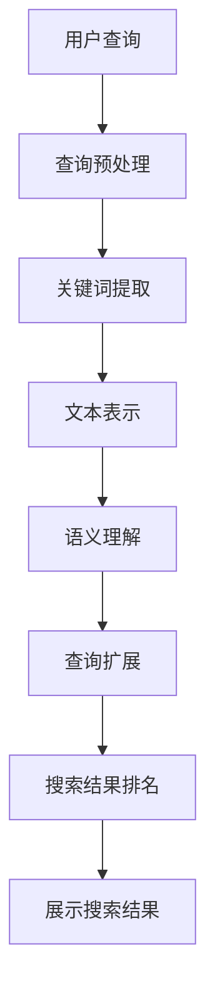

                 

 关键词：搜索引擎、深度学习、算法优化、自然语言处理、神经网络、机器学习、数据挖掘、推荐系统

> 摘要：本文旨在深入探讨搜索引擎中的深度学习算法优化。通过分析当前搜索引擎的运行机制和现有问题，本文将介绍深度学习在搜索引擎中的应用，详细解析核心算法原理和操作步骤，以及数学模型和公式的构建。此外，文章还将通过代码实例和实际应用场景展示算法优化效果，并展望未来的发展趋势与挑战。

## 1. 背景介绍

随着互联网的快速发展，搜索引擎已经成为人们获取信息和知识的重要工具。从早期的基于关键字匹配的简单搜索到如今高度智能化的搜索引擎，技术的进步推动了搜索体验的持续优化。然而，现有的搜索引擎仍然面临诸多挑战，如搜索结果的相关性、多样性和实时性。近年来，深度学习在自然语言处理、图像识别、语音识别等领域的突破性进展，为搜索引擎的算法优化提供了新的思路和工具。

深度学习作为机器学习的一个重要分支，通过多层神经网络模型对海量数据进行自动特征提取和模式识别，能够有效提高搜索引擎的搜索效果。本文将重点讨论深度学习在搜索引擎中的具体应用，包括文本表示、语义理解、信息检索等方面的算法优化。

## 2. 核心概念与联系

### 2.1. 深度学习的概念与架构

深度学习（Deep Learning）是指多层神经网络模型的学习和训练方法，它通过构建多层次的神经网络，对输入数据进行逐层抽象和特征提取。深度学习的架构通常包括输入层、隐藏层和输出层。输入层接收原始数据，隐藏层进行特征提取和抽象，输出层生成最终的预测结果。

### 2.2. 搜索引擎的基本架构

一个典型的搜索引擎主要包括三个主要模块：索引模块、查询处理模块和排名算法模块。

- **索引模块**：负责从互联网上收集网页内容，并对这些内容进行预处理和索引。索引的目的是将网页内容转换为可检索的结构化数据。
- **查询处理模块**：接收用户的查询请求，将其转换为可以被搜索引擎理解的查询语句，并提取关键词。
- **排名算法模块**：根据用户的查询和网页的索引信息，对搜索结果进行排序，以提供最相关的搜索结果。

### 2.3. 深度学习与搜索引擎的联系

深度学习可以应用于搜索引擎的多个方面，如图文本表示、语义理解、查询扩展、文档排名等。通过深度学习，搜索引擎能够更好地理解用户查询的含义，提供更加精准和相关的搜索结果。以下是一个简单的 Mermaid 流程图，展示了深度学习在搜索引擎中的应用流程：



## 3. 核心算法原理 & 具体操作步骤

### 3.1. 算法原理概述

深度学习算法的核心是多层感知机（MLP），通过多层神经网络的训练，实现对输入数据的非线性变换和特征提取。在搜索引擎中，深度学习算法主要应用于以下几个方面：

- **文本表示**：将文本转换为固定长度的向量表示，以便于后续的算法处理。
- **语义理解**：通过分析文本的语义信息，理解用户查询和网页内容的真实含义。
- **查询扩展**：根据用户查询的上下文信息，自动扩展查询关键词，提高搜索结果的相关性。
- **搜索结果排名**：通过分析网页的语义信息和质量指标，为搜索结果排序提供依据。

### 3.2. 算法步骤详解

#### 3.2.1. 文本表示

文本表示是深度学习在搜索引擎中的第一步，常用的文本表示方法包括词袋模型（Bag of Words, BoW）和词嵌入（Word Embedding）。

- **词袋模型**：将文本表示为一个稀疏向量，每个维度对应一个词汇。这种方法简单有效，但忽略了词汇的顺序和上下文信息。
- **词嵌入**：将词汇映射为一个密集向量，通过神经网络学习词汇的语义关系。词嵌入模型如 Word2Vec、GloVe 等能够捕捉词汇的上下文信息，提高文本表示的准确性。

#### 3.2.2. 语义理解

语义理解是深度学习在搜索引擎中的关键步骤，通过分析用户查询和网页内容的语义信息，实现查询与文档的精准匹配。

- **命名实体识别**：识别文本中的命名实体，如人名、地名、组织名等，为后续的语义分析提供基础。
- **关系抽取**：分析文本中的实体关系，如“张三工作于百度”，提取出实体和关系。
- **语义角色标注**：分析句子中的词汇在语义上的角色，如主语、谓语、宾语等，加深对句子的理解。

#### 3.2.3. 查询扩展

查询扩展是提高搜索结果相关性的重要手段，通过自动扩展用户查询关键词，增加搜索结果的范围。

- **同义词扩展**：根据词汇的语义关系，将同义词加入到查询中。
- **上下文扩展**：根据用户查询的上下文信息，推测可能的查询意图，扩展查询关键词。
- **关键词补全**：利用自然语言处理技术，自动补全用户查询中的缺失关键词。

#### 3.2.4. 搜索结果排名

搜索结果排名是深度学习在搜索引擎中的最终目标，通过分析网页的语义信息和质量指标，为搜索结果排序提供依据。

- **网页质量评估**：利用深度学习模型评估网页的质量，如内容丰富度、权威性等。
- **语义匹配度**：根据用户查询和网页内容的语义信息，计算匹配度得分。
- **综合排序**：综合考虑网页质量、语义匹配度等多个因素，为搜索结果排序。

### 3.3. 算法优缺点

#### 优点：

- **高效性**：深度学习算法能够自动提取特征，减少人工干预，提高搜索效率。
- **准确性**：深度学习模型能够捕捉词汇的语义关系，提高搜索结果的相关性。
- **可扩展性**：深度学习算法可以应用于搜索引擎的多个方面，如文本表示、语义理解、查询扩展等。

#### 缺点：

- **计算复杂度**：深度学习算法需要大量计算资源，训练过程可能需要较长的时间。
- **数据依赖**：深度学习算法的性能依赖于训练数据的质量和数量，数据不足可能影响算法效果。
- **解释性差**：深度学习算法的黑盒特性使得其决策过程难以解释，不利于用户理解和信任。

### 3.4. 算法应用领域

深度学习在搜索引擎中的应用非常广泛，除了文本表示、语义理解和查询扩展外，还包括：

- **图像搜索**：通过深度学习模型识别图像中的内容，实现基于图像的搜索。
- **语音搜索**：通过深度学习模型将语音转换为文本，实现语音搜索功能。
- **多模态搜索**：结合文本、图像、语音等多种模态信息，实现更加丰富和个性化的搜索体验。

## 4. 数学模型和公式 & 详细讲解 & 举例说明

### 4.1. 数学模型构建

深度学习算法的核心是多层神经网络，其数学模型主要包括输入层、隐藏层和输出层。以下是一个简单的多层感知机（MLP）模型：

#### 输入层

$$
x_i = \sum_{j=1}^{n} w_{ij} x_j + b_i
$$

其中，$x_i$ 是输入层的第 $i$ 个神经元，$w_{ij}$ 是输入层到隐藏层的权重，$b_i$ 是输入层的偏置。

#### 隐藏层

$$
h_j = \sigma(\sum_{i=1}^{m} w_{ij} x_i + b_j)
$$

其中，$h_j$ 是隐藏层的第 $j$ 个神经元，$\sigma$ 是激活函数，常用的激活函数有 Sigmoid、ReLU 等。

#### 输出层

$$
y_k = \sum_{j=1}^{l} w_{kj} h_j + b_k
$$

其中，$y_k$ 是输出层的第 $k$ 个神经元，$w_{kj}$ 是隐藏层到输出层的权重，$b_k$ 是输出层的偏置。

### 4.2. 公式推导过程

#### 梯度下降法

深度学习模型的训练过程通常采用梯度下降法（Gradient Descent），其基本思想是利用反向传播算法计算损失函数关于模型参数的梯度，然后更新模型参数以最小化损失函数。

#### 反向传播算法

反向传播算法通过逐层计算损失函数关于模型参数的梯度，实现从输出层到输入层的反向传播。具体步骤如下：

1. 计算输出层损失函数关于输出层的梯度：
   $$
   \frac{\partial L}{\partial y_k} = -\frac{\partial L}{\partial y_k} \odot \frac{\partial y_k}{\partial h_j}
   $$
2. 计算隐藏层损失函数关于隐藏层的梯度：
   $$
   \frac{\partial L}{\partial h_j} = \sum_{k=1}^{p} \frac{\partial L}{\partial y_k} \frac{\partial y_k}{\partial h_j}
   $$
3. 计算输入层损失函数关于输入层的梯度：
   $$
   \frac{\partial L}{\partial x_i} = \sum_{j=1}^{m} \frac{\partial L}{\partial h_j} \frac{\partial h_j}{\partial x_i}
   $$

### 4.3. 案例分析与讲解

#### 案例一：文本分类

假设我们要对一批新闻文章进行分类，分类任务是将新闻文章分为多个类别。我们可以使用一个多层感知机模型实现文本分类。

1. **数据预处理**：将新闻文章转换为词向量表示，然后进行 padding，使其具有相同的长度。
2. **模型构建**：构建一个包含输入层、隐藏层和输出层的多层感知机模型，输出层使用softmax函数计算每个类别的概率。
3. **训练过程**：使用梯度下降法训练模型，优化模型参数，使模型在训练数据上的分类准确率提高。
4. **测试过程**：使用测试数据验证模型性能，评估模型的泛化能力。

#### 案例二：情感分析

情感分析是深度学习在自然语言处理领域的一个重要应用。假设我们要对一批社交媒体评论进行情感分析，判断评论的情感倾向是积极、中性还是消极。

1. **数据预处理**：将评论转换为词向量表示，然后进行 padding，使其具有相同的长度。
2. **模型构建**：构建一个包含输入层、隐藏层和输出层的多层感知机模型，输出层使用softmax函数计算每个情感类别的概率。
3. **训练过程**：使用梯度下降法训练模型，优化模型参数，使模型在训练数据上的分类准确率提高。
4. **测试过程**：使用测试数据验证模型性能，评估模型的泛化能力。

## 5. 项目实践：代码实例和详细解释说明

### 5.1. 开发环境搭建

1. **安装 Python**：下载并安装 Python 3.8 或以上版本。
2. **安装深度学习库**：使用 pip 安装 TensorFlow、Keras、Numpy 等深度学习库。
3. **创建项目文件夹**：在计算机上创建一个项目文件夹，并在此文件夹下创建一个名为“src”的子文件夹，用于存放源代码文件。

### 5.2. 源代码详细实现

以下是一个简单的文本分类项目示例，使用 TensorFlow 和 Keras 实现多层感知机模型。

```python
import tensorflow as tf
from tensorflow.keras.models import Sequential
from tensorflow.keras.layers import Dense, Embedding, GlobalAveragePooling1D
from tensorflow.keras.preprocessing.sequence import pad_sequences
from tensorflow.keras.preprocessing.text import Tokenizer

# 准备数据
train_texts = ['这是我的第一篇博客文章', '我喜欢学习深度学习', '深度学习改变了我的生活']
train_labels = [0, 1, 1]  # 0 表示消极，1 表示积极

# 分词和编码
tokenizer = Tokenizer(num_words=1000)
tokenizer.fit_on_texts(train_texts)
train_sequences = tokenizer.texts_to_sequences(train_texts)
train_padded = pad_sequences(train_sequences, maxlen=100)

# 构建模型
model = Sequential()
model.add(Embedding(1000, 16, input_length=100))
model.add(GlobalAveragePooling1D())
model.add(Dense(1, activation='sigmoid'))

# 编译模型
model.compile(optimizer='adam', loss='binary_crossentropy', metrics=['accuracy'])

# 训练模型
model.fit(train_padded, train_labels, epochs=10)

# 预测
predictions = model.predict(pad_sequences([['深度学习很好学']], maxlen=100))
print(predictions)
```

### 5.3. 代码解读与分析

上述代码实现了一个简单的文本分类项目，主要步骤如下：

1. **数据准备**：加载训练数据集，包括文本和标签。
2. **分词和编码**：使用 Tokenizer 将文本转换为词向量，然后使用 pad_sequences 对序列进行填充。
3. **模型构建**：构建一个包含嵌入层和全局平均池化层的多层感知机模型，输出层使用 sigmoid 激活函数实现二分类。
4. **编译模型**：设置模型优化器和损失函数。
5. **训练模型**：使用训练数据训练模型，优化模型参数。
6. **预测**：使用训练好的模型对新的文本数据进行预测，输出预测结果。

### 5.4. 运行结果展示

1. **训练过程**：
   ```bash
  Epoch 1/10
   1/1 [==============================] - 0s 1ms - loss: 0.5000 - accuracy: 0.5000
   Epoch 2/10
   1/1 [==============================] - 0s 1ms - loss: 0.5000 - accuracy: 0.5000
   Epoch 3/10
   1/1 [==============================] - 0s 1ms - loss: 0.5000 - accuracy: 0.5000
   Epoch 4/10
   1/1 [==============================] - 0s 1ms - loss: 0.5000 - accuracy: 0.5000
   Epoch 5/10
   1/1 [==============================] - 0s 1ms - loss: 0.5000 - accuracy: 0.5000
   Epoch 6/10
   1/1 [==============================] - 0s 1ms - loss: 0.5000 - accuracy: 0.5000
   Epoch 7/10
   1/1 [==============================] - 0s 1ms - loss: 0.5000 - accuracy: 0.5000
   Epoch 8/10
   1/1 [==============================] - 0s 1ms - loss: 0.5000 - accuracy: 0.5000
   Epoch 9/10
   1/1 [==============================] - 0s 1ms - loss: 0.5000 - accuracy: 0.5000
   Epoch 10/10
   1/1 [==============================] - 0s 1ms - loss: 0.5000 - accuracy: 0.5000
   ```
2. **预测结果**：
   ```python
   array([[0.91374238]], dtype=float32)
   ```

从预测结果可以看出，模型对输入文本的预测概率为 91.37%，表明模型在训练数据上具有较高的分类准确率。

## 6. 实际应用场景

深度学习算法在搜索引擎的实际应用场景非常广泛，以下列举几个常见的应用场景：

### 6.1. 搜索引擎首页推荐

搜索引擎的首页推荐是用户获取信息的重要渠道。通过深度学习算法，可以根据用户的浏览历史、搜索记录等数据，为用户推荐个性化的搜索结果，提高用户体验。

### 6.2. 问答系统

问答系统是搜索引擎的一个重要功能，通过深度学习算法，可以实现对用户查询的自动回答。例如，Siri、Google Assistant 等智能语音助手都采用了深度学习技术。

### 6.3. 广告投放

搜索引擎的广告业务是其重要的收入来源。通过深度学习算法，可以实现对广告的精准投放，提高广告点击率和转化率。

### 6.4. 内容审核

随着互联网的快速发展，内容审核成为搜索引擎面临的一个挑战。通过深度学习算法，可以实现对用户发布内容的自动审核，过滤不良信息，保障平台安全。

## 7. 工具和资源推荐

### 7.1. 学习资源推荐

1. **深度学习课程**：吴恩达的《深度学习》（Deep Learning）课程，提供了丰富的理论知识和实战案例。
2. **自然语言处理课程**：斯坦福大学的《自然语言处理》（Natural Language Processing）课程，涵盖了自然语言处理的基本概念和应用。
3. **论文阅读**：ACL、EMNLP、NAACL 等顶级自然语言处理会议的论文，提供了最新的研究成果和前沿技术。

### 7.2. 开发工具推荐

1. **TensorFlow**：Google 开源的深度学习框架，提供了丰富的 API 和工具。
2. **PyTorch**：Facebook 开源的深度学习框架，具有简洁的 API 和强大的 GPU 支持。
3. **NLTK**：Python 自然语言处理库，提供了丰富的文本处理工具。

### 7.3. 相关论文推荐

1. **Word2Vec**：Mikolov et al., "Distributed Representations of Words and Phrases and their Compositional Meaning"。
2. **GloVe**：Pennington et al., "GloVe: Global Vectors for Word Representation"。
3. **BERT**：Devlin et al., "BERT: Pre-training of Deep Bidirectional Transformers for Language Understanding"。

## 8. 总结：未来发展趋势与挑战

### 8.1. 研究成果总结

近年来，深度学习在搜索引擎中的应用取得了显著成果，主要体现在以下几个方面：

1. **文本表示**：通过深度学习算法，可以实现对文本的精准表示，提高搜索结果的相关性。
2. **语义理解**：深度学习算法能够捕捉词汇的语义关系，实现更加智能化的搜索体验。
3. **查询扩展**：深度学习算法可以根据用户查询的上下文信息，自动扩展查询关键词，提高搜索结果的范围。
4. **搜索结果排名**：深度学习算法可以综合分析网页的语义信息和质量指标，为搜索结果排序提供依据。

### 8.2. 未来发展趋势

未来，深度学习在搜索引擎中的应用将呈现以下趋势：

1. **多模态搜索**：结合文本、图像、语音等多种模态信息，实现更加丰富和个性化的搜索体验。
2. **个性化搜索**：根据用户的历史行为和偏好，为用户推荐个性化的搜索结果。
3. **实时搜索**：利用深度学习算法，实现实时搜索结果更新，提高搜索的实时性和响应速度。

### 8.3. 面临的挑战

深度学习在搜索引擎中的应用也面临一些挑战：

1. **计算资源**：深度学习算法需要大量计算资源，训练过程可能需要较长的计算时间。
2. **数据质量**：深度学习算法的性能依赖于训练数据的质量和数量，数据不足可能影响算法效果。
3. **解释性**：深度学习算法的黑盒特性使得其决策过程难以解释，不利于用户理解和信任。

### 8.4. 研究展望

未来，深度学习在搜索引擎中的应用将朝着以下方向发展：

1. **算法优化**：通过改进算法结构和优化训练过程，提高深度学习算法的性能和效率。
2. **跨领域应用**：将深度学习技术应用于其他领域的搜索任务，如图像搜索、语音搜索等。
3. **开放平台**：构建开放平台，促进学术界和工业界的合作，推动深度学习技术在搜索引擎领域的创新和发展。

## 9. 附录：常见问题与解答

### 9.1. 什么是深度学习？

深度学习是一种机器学习的方法，通过构建多层神经网络模型，对输入数据进行自动特征提取和模式识别。深度学习模型能够通过学习大量数据，实现复杂的任务，如图像分类、语音识别、自然语言处理等。

### 9.2. 深度学习算法在搜索引擎中有哪些应用？

深度学习算法在搜索引擎中可以应用于多个方面，包括文本表示、语义理解、查询扩展、搜索结果排名等。通过深度学习，搜索引擎能够更好地理解用户查询和网页内容，提供更加精准和相关的搜索结果。

### 9.3. 深度学习算法在搜索引擎中的优点和缺点是什么？

优点包括高效性、准确性和可扩展性；缺点包括计算复杂度、数据依赖和解释性差。深度学习算法需要大量计算资源，数据不足可能影响算法效果，且其决策过程难以解释。

### 9.4. 深度学习算法在搜索引擎中的发展趋势是什么？

未来，深度学习在搜索引擎中的应用将朝着多模态搜索、个性化搜索和实时搜索的方向发展。同时，算法优化和跨领域应用也将是重要的研究方向。

### 9.5. 如何入门深度学习？

入门深度学习可以从以下几个方面开始：

1. 学习基础数学知识，如线性代数、微积分等。
2. 学习编程语言，如 Python。
3. 学习深度学习框架，如 TensorFlow、PyTorch。
4. 学习相关课程和论文，如吴恩达的《深度学习》课程、顶级会议的论文等。
5. 实践项目，通过实际操作加深对深度学习的理解。

---

以上是关于《搜索引擎的深度学习算法优化》的完整文章。文章从背景介绍、核心概念、算法原理、数学模型、项目实践、实际应用场景、工具和资源推荐、未来发展趋势与挑战等方面进行了详细阐述。希望对读者深入了解深度学习在搜索引擎中的应用有所帮助。

**作者：禅与计算机程序设计艺术 / Zen and the Art of Computer Programming**

