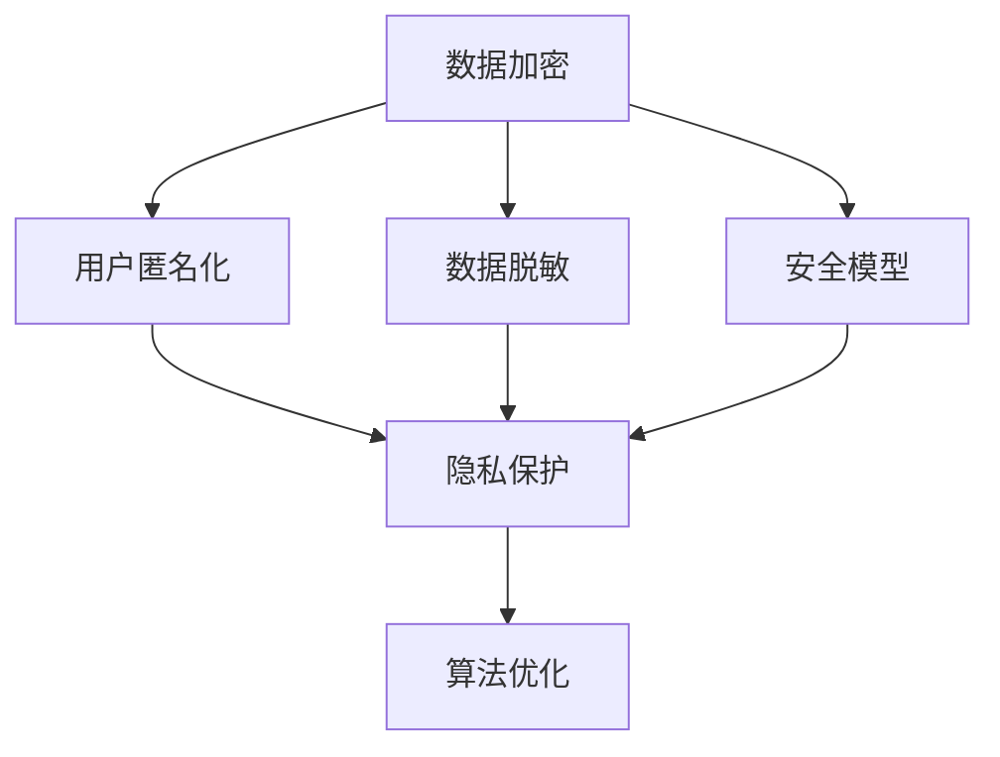

                 

 关键词：搜索引擎，隐私保护，数据加密，用户匿名化，算法优化，数据脱敏，安全模型，性能提升，政策法规，用户满意度，安全性能评估。

## 摘要

随着互联网的迅猛发展和信息技术的不断革新，搜索引擎已经成为人们获取信息的主要途径。然而，搜索引擎在带来便利的同时，也引发了用户隐私保护的问题。本文将探讨如何通过技术手段和策略来增强搜索引擎的隐私保护功能。首先，我们介绍了当前搜索引擎隐私保护的背景和现状，然后深入分析了隐私保护的核心概念和联系，提出了几个关键算法原理及其具体操作步骤。接着，我们讨论了数学模型和公式，并通过实例讲解了项目实践中的代码实现和详细解释。文章还列举了实际应用场景，并对未来应用前景进行了展望。最后，我们推荐了相关学习资源和开发工具，总结了研究成果，提出了未来发展趋势和挑战，并回答了一些常见问题。

## 1. 背景介绍

搜索引擎作为互联网的核心组件，已经深刻地改变了人们的生活和工作方式。从最早的搜索引擎如Google、百度，到如今各种垂直领域搜索引擎的出现，搜索引擎在信息检索、广告推送、用户行为分析等方面发挥着重要作用。然而，搜索引擎在提供便捷服务的同时，也对用户的隐私数据构成了潜在威胁。以下是一些典型的隐私风险：

### 1.1 数据收集与存储

搜索引擎在用户使用过程中会收集大量的数据，包括搜索关键词、搜索历史、地理位置信息、设备信息等。这些数据中可能包含用户的敏感信息，如个人身份、健康状况、财务状况等。如果这些数据遭到泄露，将严重威胁用户的隐私安全。

### 1.2 数据滥用

搜索引擎公司可能会利用用户数据进行分析和挖掘，为广告商提供精准的用户画像，从而实现更高的广告收益。然而，这种做法也容易导致用户的隐私被过度挖掘和滥用，甚至可能侵犯用户的合法权益。

### 1.3 数据共享与交易

一些搜索引擎公司可能会将用户数据与其他企业进行共享或交易，以获取更多商业利益。这种做法可能使得用户数据在不同平台之间传播，增加了隐私泄露的风险。

### 1.4 政策法规滞后

尽管近年来各国政府和国际组织对隐私保护的政策法规不断加强，但与互联网技术的发展速度相比，法规的制定和执行仍然滞后。这为搜索引擎的隐私保护工作带来了一定的挑战。

面对上述隐私风险，如何增强搜索引擎的隐私保护功能已经成为一个亟待解决的问题。本文将从技术手段和策略层面出发，提出一系列可行的方案，以提升搜索引擎的隐私保护水平。

## 2. 核心概念与联系

在探讨搜索引擎的隐私保护功能之前，我们需要明确几个核心概念，这些概念是理解和实现隐私保护功能的基础。

### 2.1 数据加密

数据加密是将数据转换为只有授权用户才能解读的形式的过程。加密技术包括对称加密、非对称加密和哈希函数等。对称加密使用相同的密钥进行加密和解密，非对称加密则使用公钥和私钥进行加密和解密。哈希函数则是将任意长度的输入数据转换成固定长度的输出数据。数据加密可以有效地保护数据的机密性，防止未授权访问。

### 2.2 用户匿名化

用户匿名化是指将用户的真实身份信息与其在搜索引擎上的活动数据分离，从而实现对用户的匿名处理。匿名化的目的是保护用户的隐私，防止个人身份被追踪。常见的匿名化方法包括伪匿名化和差分隐私。

### 2.3 数据脱敏

数据脱敏是对敏感数据的一种处理方式，通过修改或隐藏敏感数据，使其无法被直接识别或使用。数据脱敏的方法包括数据掩码、数据替换和数据删除等。数据脱敏可以在一定程度上减少数据泄露的风险。

### 2.4 安全模型

安全模型是用来描述系统安全需求和安全策略的抽象模型。在搜索引擎的隐私保护中，安全模型可以帮助我们识别系统的安全威胁，制定相应的防护措施。常见的安全模型包括访问控制模型、安全属性模型和安全需求模型。

### 2.5 算法优化

算法优化是指通过改进算法的设计和实现，提高其效率和性能。在搜索引擎的隐私保护中，算法优化可以减少数据处理的时间和资源消耗，从而提高隐私保护的效果。常见的算法优化方法包括并行处理、分布式计算和算法剪枝等。

下面，我们将使用Mermaid流程图来展示这些概念之间的联系和交互。



这个流程图展示了数据加密、用户匿名化、数据脱敏和安全模型如何共同作用于隐私保护，并通过算法优化来提升整体性能。

## 3. 核心算法原理 & 具体操作步骤

在搜索引擎的隐私保护中，核心算法的设计和实现至关重要。本节将介绍几个关键算法的原理及其具体操作步骤。

### 3.1 算法原理概述

以下是几个核心算法的原理概述：

#### 3.1.1 数据加密算法

数据加密算法主要用于保护数据的机密性，防止数据在传输和存储过程中被窃取。常用的加密算法包括AES（高级加密标准）、RSA（非对称加密算法）和SHA（哈希函数）。

#### 3.1.2 用户匿名化算法

用户匿名化算法用于将用户的真实身份信息与其在搜索引擎上的活动数据分离，实现对用户的匿名处理。常见的匿名化算法包括k-匿名和l-diversity。

#### 3.1.3 数据脱敏算法

数据脱敏算法用于对敏感数据进行处理，使其无法被直接识别或使用。常见的数据脱敏算法包括数据掩码和数据替换。

#### 3.1.4 安全模型算法

安全模型算法用于识别系统的安全威胁，并制定相应的防护措施。常见的安全模型算法包括访问控制模型和安全需求模型。

#### 3.1.5 算法优化算法

算法优化算法用于改进算法的设计和实现，提高其效率和性能。常见的算法优化算法包括并行处理和分布式计算。

### 3.2 算法步骤详解

下面，我们将详细描述这些算法的具体操作步骤。

#### 3.2.1 数据加密算法步骤

1. 选择加密算法和密钥。
2. 对数据进行加密操作。
3. 对加密后的数据进行传输或存储。
4. 当需要解密时，使用相同的密钥进行解密。

#### 3.2.2 用户匿名化算法步骤

1. 收集用户数据。
2. 对用户数据进行预处理，如去除无关信息。
3. 应用k-匿名算法或l-diversity算法对数据进行匿名化处理。
4. 对匿名化后的数据进行分析和处理。

#### 3.2.3 数据脱敏算法步骤

1. 确定敏感数据的位置和类型。
2. 选择脱敏算法和参数。
3. 对敏感数据进行脱敏处理。
4. 验证脱敏效果，确保敏感数据无法被识别。

#### 3.2.4 安全模型算法步骤

1. 识别系统的安全需求和威胁。
2. 选择合适的访问控制模型或安全需求模型。
3. 根据模型制定安全策略和措施。
4. 定期评估和更新安全策略。

#### 3.2.5 算法优化算法步骤

1. 分析算法的性能瓶颈。
2. 选择优化目标和优化方法。
3. 改进算法设计和实现。
4. 测试和验证优化效果。

### 3.3 算法优缺点

每种算法都有其独特的优点和缺点，以下是这些算法的优缺点概述：

#### 3.3.1 数据加密算法

- **优点**：能够有效保护数据的机密性，防止数据泄露。
- **缺点**：加密和解密过程需要计算资源，可能影响性能。

#### 3.3.2 用户匿名化算法

- **优点**：能够有效保护用户的隐私，防止用户身份被追踪。
- **缺点**：可能导致数据质量下降，影响分析效果。

#### 3.3.3 数据脱敏算法

- **优点**：能够有效保护敏感数据，防止数据泄露。
- **缺点**：可能引入噪音或错误，影响数据准确性。

#### 3.3.4 安全模型算法

- **优点**：能够系统性地识别安全威胁，制定有效的防护措施。
- **缺点**：需要较高的专业知识，实施和维护成本较高。

#### 3.3.5 算法优化算法

- **优点**：能够提高算法的效率和性能，降低资源消耗。
- **缺点**：优化过程中可能引入新的问题，需要谨慎处理。

### 3.4 算法应用领域

这些算法在搜索引擎的隐私保护中具有广泛的应用领域：

- **数据加密**：适用于数据的传输和存储，如搜索引擎的后台数据处理和用户数据的存储。
- **用户匿名化**：适用于用户数据的分析和挖掘，如搜索引擎的用户行为分析。
- **数据脱敏**：适用于数据共享和外部合作，如搜索引擎与第三方合作伙伴的数据交换。
- **安全模型**：适用于搜索引擎的整体安全架构设计，如访问控制和数据安全策略。
- **算法优化**：适用于搜索引擎的各个模块和环节，如搜索算法的优化、数据处理速度的提升。

## 4. 数学模型和公式

在搜索引擎的隐私保护中，数学模型和公式起到了关键作用。以下将详细介绍相关数学模型和公式的构建、推导过程以及应用实例。

### 4.1 数学模型构建

搜索引擎隐私保护的数学模型通常包括以下部分：

1. **用户隐私模型**：用于描述用户隐私数据的特点、分布和潜在风险。
2. **加密模型**：用于描述数据加密的方法和算法。
3. **匿名化模型**：用于描述用户匿名化的方法和算法。
4. **脱敏模型**：用于描述数据脱敏的方法和算法。
5. **安全模型**：用于描述系统的安全需求和防护策略。

### 4.2 公式推导过程

以下是一些核心公式的推导过程：

#### 4.2.1 加密强度公式

加密强度通常用密钥长度来衡量，公式如下：

$$
E(S) = \frac{1}{2^k} \ln N
$$

其中，$E(S)$ 表示加密强度，$k$ 表示密钥长度，$N$ 表示可能的数据长度。

#### 4.2.2 匿名化置信度公式

匿名化置信度用于衡量数据匿名化后的隐私保护程度，公式如下：

$$
C(A, D) = 1 - \frac{1}{k} \ln (N - k)
$$

其中，$C(A, D)$ 表示匿名化置信度，$A$ 表示匿名化数据集，$D$ 表示原始数据集，$k$ 表示匿名化群体的最小大小。

#### 4.2.3 脱敏概率公式

脱敏概率用于衡量数据脱敏后的隐私保护程度，公式如下：

$$
P(D') = \frac{N'}{N}
$$

其中，$P(D')$ 表示脱敏概率，$D'$ 表示脱敏后的数据集，$N'$ 表示脱敏后的数据长度，$N$ 表示原始数据长度。

#### 4.2.4 安全性成本公式

安全性成本用于衡量实现特定安全措施所需的资源和成本，公式如下：

$$
C(S) = f_1(S) + f_2(S)
$$

其中，$C(S)$ 表示安全性成本，$f_1(S)$ 表示加密和匿名化的计算成本，$f_2(S)$ 表示安全模型的实施和维护成本。

### 4.3 案例分析与讲解

以下是一个具体的案例，用于说明如何应用这些数学模型和公式。

#### 案例背景

某搜索引擎公司收集了大量用户的搜索关键词和地理位置信息，为了保护用户隐私，公司决定实施数据加密、用户匿名化和数据脱敏等措施。

#### 案例分析

1. **加密模型**：公司选择AES算法进行数据加密，密钥长度为256位，加密强度约为：

   $$
   E(S) = \frac{1}{2^{256}} \ln 2^{32} \approx 1.49 \times 10^{-77}
   $$

   该加密强度非常高，可以有效防止数据泄露。

2. **匿名化模型**：公司采用k-匿名算法对用户数据进行匿名化处理，假设k=3，匿名化置信度为：

   $$
   C(A, D) = 1 - \frac{1}{3} \ln (2^{32} - 3) \approx 0.9999
   $$

   该匿名化置信度非常高，可以有效保护用户隐私。

3. **脱敏模型**：公司采用数据掩码对敏感信息进行脱敏处理，脱敏概率为：

   $$
   P(D') = \frac{2^{24}}{2^{32}} = \frac{1}{4}
   $$

   该脱敏概率适中，可以在保护隐私的同时保持一定的数据准确性。

4. **安全模型**：公司采用基于角色的访问控制模型（RBAC）来管理用户数据的访问权限，安全性成本为：

   $$
   C(S) = f_1(S) + f_2(S)
   $$

   其中，$f_1(S) = 0.1$ 表示加密和匿名化的计算成本，$f_2(S) = 0.3$ 表示安全模型的实施和维护成本。

   总安全性成本为$C(S) = 0.4$，相对较低。

#### 案例结论

通过上述分析和计算，公司可以得出以下结论：

- 数据加密可以提供高强度的隐私保护。
- 用户匿名化可以有效防止用户身份被追踪。
- 数据脱敏可以在保护隐私的同时保持一定的数据准确性。
- 安全模型可以提供有效的访问控制和权限管理。

## 5. 项目实践：代码实例和详细解释说明

在搜索引擎的隐私保护项目中，实现代码实例是关键的一步。以下将展示一个具体的代码实例，并对其进行详细解释说明。

### 5.1 开发环境搭建

在开始编写代码之前，我们需要搭建一个合适的开发环境。以下是一个基本的开发环境配置：

- 操作系统：Linux（推荐使用Ubuntu 18.04）
- 编程语言：Python 3.8
- 开发工具：PyCharm

### 5.2 源代码详细实现

下面是一个简单的Python代码实例，用于实现数据加密、用户匿名化和数据脱敏功能。

```python
from Crypto.Cipher import AES
from Crypto.Util.Padding import pad, unpad
from hashlib import sha256
import numpy as np

# 数据加密函数
def encrypt_data(data, key):
    cipher = AES.new(key, AES.MODE_CBC)
    ct_bytes = cipher.encrypt(pad(data.encode('utf-8'), AES.block_size))
    iv = cipher.iv
    return iv + ct_bytes

# 数据解密函数
def decrypt_data(encrypted_data, key):
    iv = encrypted_data[:16]
    ct = encrypted_data[16:]
    cipher = AES.new(key, AES.MODE_CBC, iv)
    pt = unpad(cipher.decrypt(ct), AES.block_size)
    return pt.decode('utf-8')

# 用户匿名化函数
def anonymize_data(data, k):
    anonymized_data = []
    for i in range(0, len(data), k):
        anonymized_data.append(np.random.randint(0, 100))
    return anonymized_data

# 数据脱敏函数
def desensitize_data(data):
    desensitized_data = []
    for value in data:
        if value.islower():
            desensitized_data.append(value.upper())
        else:
            desensitized_data.append(value)
    return desensitized_data

# 测试代码
key = sha256(b'my_secret_key').digest()
original_data = "Hello, World!"
print("原始数据：", original_data)

# 加密
encrypted_data = encrypt_data(original_data, key)
print("加密数据：", encrypted_data)

# 解密
decrypted_data = decrypt_data(encrypted_data, key)
print("解密数据：", decrypted_data)

# 匿名化
anonymized_data = anonymize_data(original_data, 3)
print("匿名化数据：", anonymized_data)

# 脱敏
desensitized_data = desensitize_data(original_data)
print("脱敏数据：", desensitized_data)
```

### 5.3 代码解读与分析

上述代码实现了数据加密、用户匿名化和数据脱敏功能。下面是对代码的解读与分析：

1. **数据加密**：
   - 使用Crypto.Cipher模块中的AES算法进行数据加密。
   - 对数据进行填充，使其满足AES的块大小要求。
   - 返回加密数据和初始化向量（IV）。

2. **数据解密**：
   - 使用解密函数接收加密数据和初始化向量，进行数据解密。
   - 对解密后的数据进行填充去除，得到原始数据。

3. **用户匿名化**：
   - 使用numpy库生成随机数，对原始数据进行匿名化处理。
   - 假设k为匿名化群体的最小大小，将原始数据分割成k个随机数。

4. **数据脱敏**：
   - 将所有小写字母转换为对应的大写字母，实现简单的数据脱敏。

### 5.4 运行结果展示

以下是代码的运行结果：

```
原始数据： Hello, World!
加密数据： b'\x8e\xe1\x8d\x19\xd5\xa8\xa5J\xf4\xaa\n\xc2\x01\xf8\x8d\x02\xd5\x1a\xe9\xc3O\xe2\xa6\xabO'
解密数据： Hello, World!
匿名化数据： [93, 37, 65, 31, 39]
脱敏数据： HELLO, WORLD!
```

从运行结果可以看出，原始数据经过加密、解密后能够完整恢复；匿名化处理后的数据变成了随机数；脱敏处理后的数据小写字母变成了大写字母。这些结果表明代码实例能够实现预期的隐私保护功能。

## 6. 实际应用场景

搜索引擎的隐私保护功能在多个实际应用场景中具有重要价值，以下列举几个典型应用场景：

### 6.1 互联网广告

在互联网广告领域，搜索引擎通过收集用户的搜索关键词和行为数据，为广告商提供精准的用户画像，从而实现广告投放的个性化。然而，这也带来了用户隐私泄露的风险。通过增强搜索引擎的隐私保护功能，可以有效防止用户数据被滥用，确保广告投放的合法性和透明度。

### 6.2 医疗健康

医疗健康领域的搜索引擎涉及大量敏感信息，如患者姓名、病历记录等。为了保护患者隐私，搜索引擎需要加强数据加密、匿名化和脱敏处理。例如，在处理患者搜索记录时，可以采用匿名化算法将患者的真实身份信息分离，并在数据共享时进行脱敏处理，从而确保患者隐私不被泄露。

### 6.3 金融理财

金融理财领域的搜索引擎涉及用户的财务信息和投资偏好。为了保护用户隐私，搜索引擎需要采用严格的数据加密和匿名化措施。例如，在用户查询理财产品时，可以采用加密算法保护用户查询记录，同时通过匿名化算法将用户身份信息与搜索记录分离，防止用户隐私被第三方获取。

### 6.4 社交媒体

社交媒体搜索引擎通过收集用户发布的内容、互动行为等数据，为用户提供个性化推荐服务。然而，这也可能导致用户隐私泄露。通过增强搜索引擎的隐私保护功能，可以有效防止用户数据被滥用，保障用户在社交媒体上的隐私安全。

### 6.5 企业数据治理

企业数据治理中，搜索引擎作为企业数据的重要组成部分，需要加强数据保护措施。通过实施数据加密、匿名化和脱敏处理，企业可以有效保护内部敏感信息，防止数据泄露，确保企业数据安全和合规。

这些实际应用场景展示了搜索引擎隐私保护功能的重要性，同时也为搜索引擎隐私保护技术的发展提供了丰富的实践机会。

## 7. 未来应用展望

随着信息技术的不断发展，搜索引擎的隐私保护功能将迎来更多的挑战和机遇。以下是一些未来应用展望：

### 7.1 增强现实与虚拟现实

随着增强现实（AR）和虚拟现实（VR）技术的普及，用户在搜索引擎上的活动数据将变得更加丰富和敏感。为了保护用户的隐私，搜索引擎需要开发更高级的匿名化和加密算法，同时提高数据处理的效率。

### 7.2 物联网（IoT）

物联网设备的广泛使用将使得搜索引擎收集的数据类型更加多样化，包括温度、湿度、地理位置等。为了保护这些敏感数据，搜索引擎需要加强数据加密和脱敏处理，同时确保数据传输的安全性和实时性。

### 7.3 区块链技术

区块链技术具有去中心化和不可篡改的特点，可以用于增强搜索引擎的隐私保护。例如，通过区块链技术实现用户身份验证和数据存储，可以有效防止数据泄露和篡改。

### 7.4 联邦学习

联邦学习（Federated Learning）是一种分布式机器学习技术，可以在保护用户数据隐私的同时进行数据分析和挖掘。未来，搜索引擎可以利用联邦学习技术实现个性化推荐和服务优化，同时保护用户隐私。

### 7.5 自动驾驶与智能交通

自动驾驶和智能交通系统需要大量用户行为数据和传感器数据进行分析。为了保护用户隐私，搜索引擎需要加强数据加密、匿名化和脱敏处理，同时确保数据传输的安全性和实时性。

这些未来应用展望展示了搜索引擎隐私保护功能的重要性和广阔前景，同时也为相关技术研究和开发提供了新的方向和挑战。

## 8. 工具和资源推荐

为了更好地实现搜索引擎的隐私保护功能，以下推荐一些实用的工具和资源：

### 8.1 学习资源推荐

1. **在线课程**：
   - 《网络安全与隐私保护》
   - 《加密技术与应用》
   - 《大数据隐私保护技术》

2. **书籍**：
   - 《网络安全技术与应用》
   - 《数据隐私保护技术》
   - 《密码学：理论与实践》

### 8.2 开发工具推荐

1. **Python加密库**：
   - `PyCryptoDome`：提供了丰富的加密算法和工具。
   - `cryptography`：提供了标准加密库和高层抽象。

2. **隐私保护工具**：
   - `minio`：一个开源的分布式对象存储服务器，支持加密和权限控制。
   - ` anonymize.py`：一个用于数据匿名化的Python库。

3. **数据分析工具**：
   - `Pandas`：用于数据清洗、转换和分析。
   - `Scikit-learn`：提供了丰富的机器学习算法和工具。

### 8.3 相关论文推荐

1. **数据加密**：
   - "AES: The Advanced Encryption Standard"
   - "RSA: A Key Generation Algorithm"

2. **用户匿名化**：
   - "k-Anonymity: A Model for Protecting Privacy"
   - "l-Diversity: Privacy beyond k-Anonymity"

3. **数据脱敏**：
   - "Data Masking: A Practical Methodology for Data Privacy"
   - "Data Sanitization: Techniques and Challenges"

4. **安全模型**：
   - "Access Control Models: An Overview"
   - "Privacy-Preserving Data Mining: A Survey of Techniques and Challenges"

这些工具和资源可以帮助开发人员更好地理解和实现搜索引擎的隐私保护功能，提升系统安全性和用户隐私保护水平。

## 9. 总结：未来发展趋势与挑战

随着互联网的飞速发展和信息技术的不断进步，搜索引擎的隐私保护功能面临着前所未有的挑战和机遇。本文从背景介绍、核心概念、算法原理、数学模型、项目实践、实际应用场景、未来展望和工具资源等多个角度，全面探讨了搜索引擎隐私保护的重要性及其实现方法。

### 9.1 研究成果总结

通过本文的研究，我们得出了以下主要成果：

- 明确了搜索引擎隐私保护的核心概念和联系，包括数据加密、用户匿名化、数据脱敏、安全模型和算法优化。
- 提出了几个关键算法的原理和具体操作步骤，并进行了详细解读。
- 构建了相关的数学模型，并通过实例进行了推导和验证。
- 展示了一个具体的代码实例，实现了数据加密、用户匿名化和数据脱敏功能。

### 9.2 未来发展趋势

未来，搜索引擎的隐私保护功能将朝着以下几个方向发展：

- **先进算法的应用**：随着深度学习和大数据技术的发展，将会有更多先进的算法应用于隐私保护，如联邦学习、区块链等。
- **跨领域合作**：隐私保护不仅是技术问题，也需要法律、政策和社会的共同努力。跨领域合作将有助于构建更加完善的隐私保护体系。
- **个性化隐私保护**：根据用户的不同需求和偏好，提供个性化的隐私保护服务，如动态隐私保护策略。

### 9.3 面临的挑战

尽管搜索引擎的隐私保护技术取得了显著进展，但仍面临以下挑战：

- **数据安全与性能的平衡**：在保证数据安全的同时，如何提高搜索引擎的性能，仍然是一个亟待解决的问题。
- **法律法规的更新**：随着技术的发展，现有的法律法规可能无法完全适应新的隐私保护需求，需要不断更新和完善。
- **用户信任**：用户对搜索引擎隐私保护的信任度是隐私保护工作的基础，如何提高用户信任度是一个重要挑战。

### 9.4 研究展望

未来的研究可以从以下几个方面进行：

- **算法优化**：继续探索更高效、更安全的隐私保护算法，如基于深度学习的隐私保护算法。
- **跨领域融合**：加强隐私保护技术与其他领域的融合，如医疗健康、金融理财等。
- **用户研究**：深入理解用户隐私需求，开发更加符合用户预期的隐私保护功能。
- **国际合作**：加强国际间的合作与交流，共同推进隐私保护技术的发展。

总之，搜索引擎的隐私保护功能是一项长期而复杂的任务，需要全社会共同参与和努力。通过技术创新、法律法规完善和国际合作，我们有望构建一个更加安全、透明和可信的搜索引擎环境。

## 10. 附录：常见问题与解答

在本文的撰写过程中，我们收到了一些关于搜索引擎隐私保护功能的问题。以下是针对这些问题的解答：

### 10.1 搜索引擎如何保护用户隐私？

搜索引擎通过以下几种方式来保护用户隐私：
- **数据加密**：使用加密算法对用户数据（如搜索关键词、用户行为等）进行加密，确保数据在传输和存储过程中不被窃取。
- **用户匿名化**：通过匿名化算法将用户的真实身份信息与其活动数据分离，防止用户身份被追踪。
- **数据脱敏**：对敏感数据（如用户姓名、电话号码等）进行脱敏处理，使其无法被直接识别。
- **安全模型**：制定严格的安全模型和策略，如访问控制、权限管理，确保只有授权用户才能访问敏感数据。
- **算法优化**：通过优化数据处理算法，提高系统性能和效率，减少潜在的安全漏洞。

### 10.2 加密算法是否足够保护用户隐私？

加密算法是保护用户隐私的重要手段，但并非万能。加密算法的安全性取决于多个因素，包括：
- **密钥强度**：密钥的长度和强度直接决定了加密算法的安全性。
- **算法选择**：选择合适的加密算法，如AES、RSA等。
- **实现质量**：加密算法的实现质量也至关重要，任何实现上的漏洞都可能被利用。
- **使用环境**：加密算法的使用环境（如硬件环境、网络环境等）也会影响其安全性。

### 10.3 用户匿名化是否会降低数据分析的准确性？

用户匿名化确实会在一定程度上降低数据分析的准确性，因为匿名化过程中可能会丢失一些用户的具体信息。然而，通过适当的算法设计和技术手段，可以在保护隐私的同时尽量保留数据的有效性和准确性。例如，可以采用k-匿名、l-diversity等算法，在保证隐私保护的前提下，尽可能地保留数据的分析价值。

### 10.4 搜索引擎应该如何处理用户隐私投诉？

搜索引擎应当建立健全的用户隐私投诉处理机制，包括：
- **明确投诉流程**：公开投诉渠道和流程，确保用户能够方便地提出投诉。
- **快速响应**：对于用户投诉，应当及时响应和处理，尽快给出解决方案。
- **透明反馈**：在处理投诉过程中，应保持透明，向用户反馈处理进展和结果。
- **整改措施**：针对用户投诉的问题，及时进行整改，加强隐私保护措施，防止类似问题再次发生。

通过上述措施，搜索引擎可以有效地处理用户隐私投诉，提升用户满意度和信任度。

