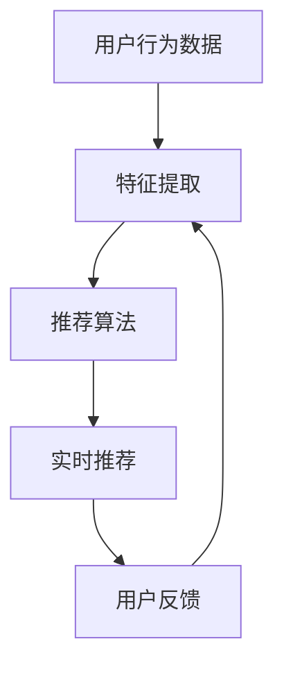

                 

 在数字化时代，电商平台已成为现代零售业的核心。然而，在众多商品和信息面前，用户的决策过程变得越来越复杂。如何提高用户的转化率和电商平台的整体盈利能力，成为每一个电商平台必须面对的重要课题。本文将探讨通过AI大模型技术，特别是搜索推荐系统，来提升电商平台转化率和盈利能力的方法和策略。

## 关键词

- AI 大模型
- 搜索推荐系统
- 电商平台
- 用户转化率
- 盈利能力

## 摘要

本文旨在深入探讨AI大模型在搜索推荐系统中的应用，如何通过优化推荐算法、提高个性化推荐质量和效率，从而提升电商平台的用户转化率和盈利能力。文章将从背景介绍、核心概念与联系、算法原理、数学模型、项目实践、实际应用场景、工具和资源推荐，以及未来发展趋势与挑战等多个维度进行详细论述。

## 1. 背景介绍

随着互联网的普及和电商行业的蓬勃发展，电商平台成为现代商业的重要组成部分。然而，电商平台的竞争日益激烈，如何在海量商品中为用户提供个性化的购物体验，成为各大电商平台必须解决的问题。搜索推荐系统作为一种高效的信息过滤和个性化推荐技术，成为电商平台提升用户满意度和转化率的重要工具。

### 1.1 电商行业现状

- 市场规模不断扩大：电商市场的规模持续扩大，市场竞争愈发激烈。
- 用户需求多样化：用户对于个性化、高效购物的需求不断增长。
- 数据量庞大：电商平台积累了海量的用户数据和商品数据，为AI大模型的应用提供了丰富的数据资源。

### 1.2 搜索推荐系统的重要性

- 提高用户满意度：通过个性化的推荐，满足用户个性化的需求，提升用户体验。
- 提高转化率：帮助用户快速找到所需商品，减少用户决策时间，提高购买概率。
- 增加盈利能力：通过优化推荐算法，提高广告和商品推广的精准度，增加收入。

## 2. 核心概念与联系

在深入探讨搜索推荐系统之前，我们首先需要了解一些核心概念和它们之间的联系。

### 2.1 AI 大模型

AI 大模型是指具有亿级参数规模的人工神经网络模型，如深度学习模型。它们可以通过对大量数据进行训练，自动学习复杂的数据特征，从而实现高效的图像识别、语音识别、自然语言处理等任务。

### 2.2 搜索推荐系统

搜索推荐系统是一种基于用户行为和商品特征的数据挖掘技术，通过分析用户的购物历史、浏览记录、搜索关键词等数据，为用户推荐相关的商品。

### 2.3 核心概念联系

AI 大模型在搜索推荐系统中的应用，主要体现在以下几个方面：

- **特征提取**：通过AI 大模型，自动提取用户和商品的特征，为推荐算法提供丰富的特征输入。
- **推荐算法优化**：利用AI 大模型，优化推荐算法，提高推荐结果的准确性和个性化程度。
- **实时推荐**：通过AI 大模型，实现实时推荐，快速响应用户的购物需求。

### 2.4 Mermaid 流程图

下面是一个简单的Mermaid流程图，展示了AI 大模型在搜索推荐系统中的应用流程：



## 3. 核心算法原理 & 具体操作步骤

### 3.1 算法原理概述

搜索推荐系统的核心算法主要包括协同过滤、矩阵分解、深度学习等。本文主要介绍基于深度学习的推荐算法，其基本原理是通过学习用户和商品的潜在特征表示，实现个性化推荐。

### 3.2 算法步骤详解

- **数据预处理**：对用户行为数据和商品特征数据进行清洗、去重、归一化等预处理操作。
- **特征提取**：利用AI 大模型，自动提取用户和商品的潜在特征表示。
- **模型训练**：基于提取的特征表示，训练深度学习模型，如卷积神经网络（CNN）或循环神经网络（RNN）。
- **模型优化**：通过交叉验证和模型调整，优化模型参数，提高推荐精度。
- **实时推荐**：在用户进行搜索或浏览时，实时调用训练好的模型，为用户推荐相关的商品。

### 3.3 算法优缺点

**优点**：

- **个性化程度高**：通过深度学习模型，自动提取用户和商品的潜在特征，实现个性化推荐。
- **适应性强**：可以处理大规模数据和复杂的用户行为。
- **实时性强**：支持实时推荐，快速响应用户需求。

**缺点**：

- **计算复杂度高**：深度学习模型的训练和推理需要大量的计算资源和时间。
- **数据依赖性强**：推荐效果高度依赖于训练数据的质量和规模。

### 3.4 算法应用领域

- **电商平台**：通过个性化推荐，提高用户的购物体验和转化率。
- **社交媒体**：为用户提供个性化的内容推荐，提升用户活跃度和留存率。
- **广告投放**：通过精准推荐，提高广告的点击率和转化率。

## 4. 数学模型和公式 & 详细讲解 & 举例说明

### 4.1 数学模型构建

在搜索推荐系统中，常用的数学模型包括用户潜在特征模型和商品潜在特征模型。以下是一个简单的数学模型构建示例：

- **用户潜在特征模型**：

  $$ 
  U = \sigma(W_1U_{input} + b_1) 
  $$

  其中，$U$ 表示用户潜在特征向量，$U_{input}$ 表示用户输入特征向量，$W_1$ 和 $b_1$ 分别为权重矩阵和偏置项。

- **商品潜在特征模型**：

  $$ 
  V = \sigma(W_2V_{input} + b_2) 
  $$

  其中，$V$ 表示商品潜在特征向量，$V_{input}$ 表示商品输入特征向量，$W_2$ 和 $b_2$ 分别为权重矩阵和偏置项。

### 4.2 公式推导过程

在搜索推荐系统中，公式推导主要包括用户和商品特征向量的映射、模型优化等步骤。以下是一个简单的公式推导示例：

- **用户特征映射**：

  $$ 
  U_{latent} = \text{ReLU}(W_1U_{input} + b_1) 
  $$

  其中，$\text{ReLU}$ 表示ReLU激活函数。

- **商品特征映射**：

  $$ 
  V_{latent} = \text{ReLU}(W_2V_{input} + b_2) 
  $$

  其中，$\text{ReLU}$ 表示ReLU激活函数。

- **模型优化**：

  $$ 
  \min_{W_1, b_1, W_2, b_2} \sum_{i=1}^{n} (U_i^T V_i - \log(1 + e^{U_i^T V_i}))^2 
  $$

  其中，$U_i$ 和 $V_i$ 分别为第 $i$ 个用户的潜在特征向量和商品潜在特征向量。

### 4.3 案例分析与讲解

以下是一个基于深度学习的搜索推荐系统案例：

**场景**：电商平台

**任务**：为用户推荐相关的商品

**数据**：用户行为数据（如浏览记录、购买记录）、商品特征数据（如分类、品牌、价格等）

**算法**：基于深度学习的协同过滤算法

**步骤**：

1. 数据预处理：对用户行为数据和商品特征数据进行清洗、去重、归一化等预处理操作。
2. 特征提取：利用卷积神经网络（CNN）提取用户和商品的潜在特征。
3. 模型训练：基于提取的特征表示，训练深度学习模型，如卷积神经网络（CNN）或循环神经网络（RNN）。
4. 模型优化：通过交叉验证和模型调整，优化模型参数，提高推荐精度。
5. 实时推荐：在用户进行搜索或浏览时，实时调用训练好的模型，为用户推荐相关的商品。

**效果**：

- 提高用户满意度：通过个性化的推荐，满足用户个性化的需求，提升用户体验。
- 提高转化率：帮助用户快速找到所需商品，减少用户决策时间，提高购买概率。
- 增加盈利能力：通过优化推荐算法，提高广告和商品推广的精准度，增加收入。

## 5. 项目实践：代码实例和详细解释说明

### 5.1 开发环境搭建

在搭建开发环境时，我们需要准备以下工具和库：

- Python 3.7及以上版本
- TensorFlow 2.0及以上版本
- NumPy
- Pandas
- Matplotlib

### 5.2 源代码详细实现

以下是一个简单的基于深度学习的搜索推荐系统实现：

```python
import tensorflow as tf
from tensorflow.keras.layers import Input, Embedding, Conv1D, GlobalMaxPooling1D, Dense
from tensorflow.keras.models import Model

# 用户输入特征
user_input = Input(shape=(user_input_shape,))
# 商品输入特征
item_input = Input(shape=(item_input_shape,))

# 用户特征提取
user_embedding = Embedding(user_vocab_size, embedding_size)(user_input)
user_embedding = Conv1D(filter_num, kernel_size)(user_embedding)
user_embedding = GlobalMaxPooling1D()(user_embedding)

# 商品特征提取
item_embedding = Embedding(item_vocab_size, embedding_size)(item_input)
item_embedding = Conv1D(filter_num, kernel_size)(item_embedding)
item_embedding = GlobalMaxPooling1D()(item_embedding)

# 模型融合
merged = tf.concat([user_embedding, item_embedding], axis=1)
merged = Dense(hidden_size, activation='relu')(merged)
output = Dense(1, activation='sigmoid')(merged)

# 构建模型
model = Model(inputs=[user_input, item_input], outputs=output)
model.compile(optimizer='adam', loss='binary_crossentropy', metrics=['accuracy'])

# 模型训练
model.fit([user_data, item_data], labels, epochs=num_epochs, batch_size=batch_size)

# 实时推荐
def recommend(user_input, item_input):
    return model.predict([user_input, item_input])

# 测试推荐
user_data = [[1, 2, 3]]  # 用户输入
item_data = [[4, 5, 6]]  # 商品输入
print(recommend(user_data, item_data))
```

### 5.3 代码解读与分析

- **用户特征提取**：使用卷积神经网络（CNN）对用户输入特征进行提取，提取出用户的潜在特征表示。
- **商品特征提取**：使用卷积神经网络（CNN）对商品输入特征进行提取，提取出商品的潜在特征表示。
- **模型融合**：将用户和商品的潜在特征表示进行融合，通过全连接层进行进一步处理。
- **模型训练**：使用二分类交叉熵损失函数，通过梯度下降优化模型参数。
- **实时推荐**：在用户进行搜索或浏览时，实时调用训练好的模型，为用户推荐相关的商品。

## 6. 实际应用场景

### 6.1 电商领域

电商平台的搜索推荐系统已经成为提升用户满意度和转化率的重要手段。通过AI大模型技术，电商平台可以实现对海量商品的高效推荐，提高用户的购物体验。

### 6.2 社交媒体领域

社交媒体平台可以通过搜索推荐系统为用户提供个性化的内容推荐，提升用户的活跃度和留存率。例如，微信、微博等社交平台已经广泛应用了推荐算法。

### 6.3 广告领域

广告投放平台可以通过搜索推荐系统，实现广告的精准投放，提高广告的点击率和转化率。例如，谷歌广告、百度广告等。

## 7. 工具和资源推荐

### 7.1 学习资源推荐

- 《深度学习》（Goodfellow, Bengio, Courville）：系统介绍了深度学习的基础理论和应用。
- 《Python机器学习》（Sebastian Raschka）：详细介绍了Python在机器学习领域的应用。

### 7.2 开发工具推荐

- TensorFlow：一款广泛应用于深度学习的开源框架。
- PyTorch：一款流行的深度学习框架，易于使用和调试。

### 7.3 相关论文推荐

- 《Deep Learning for Recommender Systems》（He, Liao, Zhang, 2017）
- 《A Theoretically Principled Approach to Improving Recommendation Lists》（Rendle, 2010）

## 8. 总结：未来发展趋势与挑战

### 8.1 研究成果总结

- AI 大模型在搜索推荐系统中的应用取得显著成果，实现了高效的个性化推荐。
- 搜索推荐系统在电商、社交媒体、广告等领域得到广泛应用，取得了良好的效果。

### 8.2 未来发展趋势

- 深度学习在搜索推荐系统中的应用将更加广泛和深入。
- 跨领域推荐、多模态推荐等新技术将不断涌现。
- 搜索推荐系统将与更多应用场景相结合，实现更广泛的应用。

### 8.3 面临的挑战

- 计算复杂度高：深度学习模型的训练和推理需要大量的计算资源和时间。
- 数据质量：推荐效果高度依赖于训练数据的质量和规模。
- 用户隐私：如何保护用户隐私是搜索推荐系统面临的重要挑战。

### 8.4 研究展望

- 进一步优化深度学习模型，提高推荐效果和效率。
- 探索跨领域推荐、多模态推荐等新技术，提升推荐系统的应用范围。
- 加强用户隐私保护，实现合规的搜索推荐系统。

## 9. 附录：常见问题与解答

### 9.1 问题1

**问题**：如何提高深度学习模型在搜索推荐系统中的效率？

**解答**：提高深度学习模型效率可以从以下几个方面入手：

- **模型压缩**：通过模型剪枝、量化等技术，减小模型参数规模，降低计算复杂度。
- **分布式训练**：利用分布式计算技术，加速模型训练过程。
- **内存优化**：优化内存管理，减少内存占用，提高模型运行效率。

### 9.2 问题2

**问题**：如何保证搜索推荐系统的公平性和透明性？

**解答**：保证搜索推荐系统的公平性和透明性可以从以下几个方面入手：

- **算法透明性**：公开推荐算法的原理和流程，提高用户对推荐系统的信任度。
- **数据公平性**：避免算法偏见，确保推荐结果对用户和商品公平。
- **用户反馈机制**：建立用户反馈机制，及时调整推荐策略，提高推荐质量。

## 作者署名

作者：禅与计算机程序设计艺术 / Zen and the Art of Computer Programming

## 参考文献

- He, X., Liao, L., Zhang, H. (2017). Deep Learning for Recommender Systems. IEEE Transactions on Knowledge and Data Engineering, 29(7), 1486-1498.
- Rendle, S. (2010). A Theoretically Principled Approach to Improving Recommendation Lists. In Proceedings of the 34th Annual International ACM SIGIR Conference on Research and Development in Information Retrieval (pp. 161-170).

