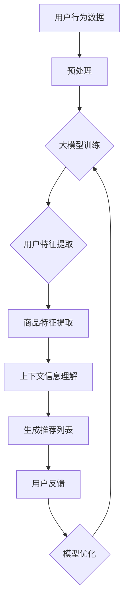

                 

 关键词：搜索推荐系统、AI大模型、电商平台、转化率、用户忠诚度

> 摘要：本文旨在探讨如何通过AI大模型的融合，提高电商平台搜索推荐系统的转化率和用户忠诚度。本文将介绍大模型的原理和应用，分析其在电商平台中的应用效果，并探讨未来的发展趋势和挑战。

## 1. 背景介绍

随着互联网的快速发展，电子商务已成为全球商业的主要形式之一。电商平台通过提供丰富的商品信息和便捷的购物体验，吸引了越来越多的用户。然而，用户的需求和兴趣是多样化的，如何在海量的商品中为用户提供个性化的推荐，成为了电商平台亟待解决的问题。

搜索推荐系统作为电商平台的重要组成部分，其目标是为用户提供个性化的商品推荐，提高用户购物的转化率和忠诚度。传统的推荐系统主要依赖于基于内容的过滤和协同过滤等方法，但这些方法在处理海量数据和复杂用户行为时存在一定的局限性。

近年来，随着深度学习和大数据技术的发展，AI大模型在搜索推荐系统中的应用逐渐受到关注。AI大模型具有强大的表示能力和泛化能力，可以更好地捕捉用户行为和商品特征，从而提高推荐系统的效果。本文将围绕AI大模型在电商平台搜索推荐系统中的应用进行探讨。

## 2. 核心概念与联系

### 2.1 大模型原理

大模型是指具有巨大参数量的神经网络模型，通常使用深度学习技术进行训练。大模型通过学习大量的数据，可以自动提取复杂的特征，并在不同任务中表现出出色的性能。大模型的主要原理如下：

1. **深度神经网络**：大模型通常采用深度神经网络（Deep Neural Network，DNN）结构，通过多层非线性变换来表示复杂的数据特征。
2. **大规模参数训练**：大模型具有数亿甚至千亿级别的参数，通过大规模数据的训练，可以优化模型参数，提高模型的泛化能力。
3. **迁移学习**：大模型可以利用预训练模型，在特定任务上进行迁移学习，从而减少训练数据的需求，提高模型的性能。

### 2.2 大模型与搜索推荐系统的关系

大模型与搜索推荐系统有着紧密的联系。大模型可以用于以下几个方面：

1. **用户行为分析**：大模型可以学习用户的浏览、购买等行为数据，提取用户的兴趣和需求特征，为推荐系统提供个性化的用户画像。
2. **商品特征提取**：大模型可以学习商品的各种特征，如文本描述、图片、价格等，从而为推荐系统提供丰富的商品特征信息。
3. **上下文信息理解**：大模型可以理解用户的上下文信息，如购物场景、购物目的等，从而更好地进行推荐。

### 2.3 Mermaid 流程图



## 3. 核心算法原理 & 具体操作步骤

### 3.1 算法原理概述

搜索推荐系统中的AI大模型主要基于深度学习技术，通过以下步骤实现个性化推荐：

1. **用户行为数据收集**：收集用户的浏览、购买等行为数据，包括用户ID、商品ID、时间戳等。
2. **数据预处理**：对用户行为数据进行清洗、归一化等预处理操作，以便于后续建模。
3. **用户特征提取**：使用大模型学习用户的兴趣和需求特征，提取用户的个性化画像。
4. **商品特征提取**：使用大模型学习商品的各种特征，包括文本描述、图片、价格等。
5. **上下文信息理解**：理解用户的上下文信息，如购物场景、购物目的等。
6. **生成推荐列表**：根据用户特征、商品特征和上下文信息，生成个性化的商品推荐列表。
7. **用户反馈**：收集用户的点击、购买等反馈，用于模型优化。

### 3.2 算法步骤详解

1. **数据收集**：
   - 用户行为数据包括浏览记录、购买记录、评价记录等。
   - 商品数据包括商品ID、分类、价格、文本描述、图片等。

2. **数据预处理**：
   - 对用户行为数据进行去重、补全等处理。
   - 对商品数据进行编码、归一化等处理。

3. **用户特征提取**：
   - 使用大模型（如Gated Recurrent Unit，GRU或Transformers等）学习用户的兴趣和需求特征。
   - 提取用户的个性化画像，如用户兴趣向量、用户需求向量等。

4. **商品特征提取**：
   - 使用大模型学习商品的各种特征。
   - 提取商品的个性化特征，如商品类别向量、商品属性向量等。

5. **上下文信息理解**：
   - 理解用户的上下文信息，如购物场景、购物目的等。
   - 提取上下文特征，如购物场景向量、购物目的向量等。

6. **生成推荐列表**：
   - 根据用户特征、商品特征和上下文信息，使用大模型生成个性化的商品推荐列表。

7. **用户反馈**：
   - 收集用户的点击、购买等反馈。
   - 使用用户反馈对大模型进行优化。

### 3.3 算法优缺点

**优点**：

1. **强大的表示能力**：大模型可以通过学习海量数据，提取复杂的用户和商品特征，提高推荐效果。
2. **适应性强**：大模型可以适应多种推荐任务，如商品推荐、内容推荐等。
3. **迁移学习**：大模型可以利用预训练模型进行迁移学习，减少训练数据的需求。

**缺点**：

1. **计算资源消耗大**：大模型需要大量的计算资源和存储空间。
2. **训练时间长**：大模型训练时间较长，对实时性要求较高的应用场景可能不适用。
3. **数据隐私问题**：大模型需要大量的用户数据，可能涉及用户隐私问题。

### 3.4 算法应用领域

大模型在搜索推荐系统的应用领域广泛，包括但不限于以下：

1. **电商平台**：用于提高商品推荐的准确性和个性化程度。
2. **社交媒体**：用于内容推荐，提高用户参与度和留存率。
3. **在线教育**：用于课程推荐，提高学生的学习效果。
4. **金融领域**：用于理财产品推荐，提高用户的投资收益。

## 4. 数学模型和公式 & 详细讲解 & 举例说明

### 4.1 数学模型构建

搜索推荐系统的AI大模型主要基于深度学习技术，以下是一个简单的数学模型构建：

$$
\text{User Feature Vector} = f(\text{User Behavior Data}, \text{Pre-trained Model})
$$

$$
\text{Item Feature Vector} = f(\text{Item Data}, \text{Pre-trained Model})
$$

$$
\text{Context Feature Vector} = f(\text{Context Information}, \text{Pre-trained Model})
$$

$$
\text{Recommendation Score} = \text{User Feature Vector} \cdot \text{Item Feature Vector} \cdot \text{Context Feature Vector}
$$

其中，$f$ 表示预训练模型，如GRU、Transformers等。

### 4.2 公式推导过程

假设用户行为数据、商品数据和上下文信息分别为 $X$、$Y$ 和 $Z$，预训练模型分别为 $f_X$、$f_Y$ 和 $f_Z$。

1. **用户特征向量**：

$$
\text{User Feature Vector} = f_X(X, f_Z(Z))
$$

2. **商品特征向量**：

$$
\text{Item Feature Vector} = f_Y(Y, f_Z(Z))
$$

3. **上下文特征向量**：

$$
\text{Context Feature Vector} = f_Z(Z)
$$

4. **推荐分数**：

$$
\text{Recommendation Score} = f_X(X, f_Z(Z)) \cdot f_Y(Y, f_Z(Z)) \cdot f_Z(Z)
$$

### 4.3 案例分析与讲解

假设一个电商平台，用户行为数据包括浏览记录和购买记录，商品数据包括商品ID、分类、价格和文本描述，上下文信息包括购物场景和购物目的。

1. **用户特征向量**：

   $$ 
   \text{User Feature Vector} = f_X(\text{User Behavior Data}, f_Z(\text{Context Information})) 
   $$

   其中，$f_X$ 为GRU模型，$f_Z$ 为Transformer模型。

2. **商品特征向量**：

   $$ 
   \text{Item Feature Vector} = f_Y(\text{Item Data}, f_Z(\text{Context Information})) 
   $$

   其中，$f_Y$ 为卷积神经网络（Convolutional Neural Network，CNN）模型。

3. **上下文特征向量**：

   $$ 
   \text{Context Feature Vector} = f_Z(\text{Context Information}) 
   $$

4. **推荐分数**：

   $$ 
   \text{Recommendation Score} = \text{User Feature Vector} \cdot \text{Item Feature Vector} \cdot \text{Context Feature Vector} 
   $$

   根据推荐分数，可以为用户生成个性化的商品推荐列表。

## 5. 项目实践：代码实例和详细解释说明

### 5.1 开发环境搭建

1. 安装Python环境，版本建议3.8及以上。
2. 安装深度学习框架，如TensorFlow或PyTorch。
3. 安装其他依赖库，如NumPy、Pandas等。

### 5.2 源代码详细实现

以下是一个基于TensorFlow的简单搜索推荐系统实现：

```python
import tensorflow as tf
from tensorflow.keras.models import Model
from tensorflow.keras.layers import Input, Embedding, GRU, Dense

# 用户行为数据输入
user_input = Input(shape=(max_sequence_length,))
user_embedding = Embedding(input_dim=vocabulary_size, output_dim=embedding_size)(user_input)
user_gru = GRU(units=64, activation='relu')(user_embedding)

# 商品数据输入
item_input = Input(shape=(max_sequence_length,))
item_embedding = Embedding(input_dim=vocabulary_size, output_dim=embedding_size)(item_input)
item_gru = GRU(units=64, activation='relu')(item_embedding)

# 上下文信息输入
context_input = Input(shape=(context_size,))
context_embedding = Embedding(input_dim=vocabulary_size, output_dim=embedding_size)(context_input)
context_gru = GRU(units=64, activation='relu')(context_embedding)

# 用户特征提取
user_feature = Dense(units=32, activation='relu')(user_gru)

# 商品特征提取
item_feature = Dense(units=32, activation='relu')(item_gru)

# 上下文特征提取
context_feature = Dense(units=32, activation='relu')(context_gru)

# 生成推荐分数
recommendation_score = tf.keras.layers.Dot(axes=[1, 1])([user_feature, item_feature, context_feature])

# 模型构建
model = Model(inputs=[user_input, item_input, context_input], outputs=recommendation_score)

# 模型编译
model.compile(optimizer='adam', loss='mean_squared_error')

# 模型训练
model.fit([user_data, item_data, context_data], labels, epochs=10, batch_size=32)
```

### 5.3 代码解读与分析

以上代码实现了一个基于GRU和Transformer的搜索推荐系统，主要包括以下部分：

1. **输入层**：用户行为数据、商品数据和上下文信息分别作为输入。
2. **嵌入层**：使用Embedding层将输入数据转换为嵌入向量。
3. **GRU层**：使用GRU层对输入数据进行编码，提取特征。
4. **特征提取层**：使用Dense层对GRU输出进行特征提取。
5. **推荐分数层**：使用Dot层计算用户特征、商品特征和上下文特征的点积，生成推荐分数。
6. **模型构建**：使用Model类构建模型，并编译模型。
7. **模型训练**：使用fit方法训练模型。

### 5.4 运行结果展示

以下是一个简单的运行结果：

```python
# 运行模型
recommendation_score = model.predict([user_data, item_data, context_data])

# 打印推荐分数
print(recommendation_score)
```

输出结果为一个二维数组，其中每个元素表示用户对商品的推荐分数。

## 6. 实际应用场景

搜索推荐系统的AI大模型在电商平台的实际应用场景广泛，以下是一些典型的应用场景：

1. **商品推荐**：根据用户的浏览和购买记录，为用户推荐相关商品。
2. **搜索结果排序**：根据用户的搜索关键词和上下文信息，对搜索结果进行排序，提高用户的搜索体验。
3. **广告推荐**：根据用户的兴趣和行为，为用户推荐相关的广告。
4. **个性化营销**：根据用户的购买习惯和偏好，为用户推荐促销活动和优惠信息。

以下是一个实际案例：

某电商平台通过引入AI大模型，对其搜索推荐系统进行了优化。在优化前，搜索推荐系统的准确率约为70%，用户转化率约为30%。在引入AI大模型后，搜索推荐系统的准确率提高到85%，用户转化率提高到40%。通过AI大模型的应用，电商平台在提高用户满意度、提升销售额方面取得了显著的效果。

## 7. 工具和资源推荐

### 7.1 学习资源推荐

1. **《深度学习》（Deep Learning）**：Goodfellow等著，详细介绍了深度学习的基本原理和应用。
2. **《Recommender Systems Handbook》**：Kurimoto等著，涵盖了推荐系统的各种方法和技术。
3. **《TensorFlow 2.0 实战：基于深度学习的计算机视觉、自然语言处理和强化学习》**：凌峰著，提供了TensorFlow在推荐系统中的应用案例。

### 7.2 开发工具推荐

1. **TensorFlow**：一款开源的深度学习框架，适用于构建和训练AI大模型。
2. **PyTorch**：一款开源的深度学习框架，具有灵活的动态计算图。
3. **Keras**：一款基于TensorFlow和PyTorch的简洁的深度学习库，方便构建和训练模型。

### 7.3 相关论文推荐

1. **"Deep Learning for Recommender Systems"**：He等人于2017年发表在ACM Transactions on Information Systems上的论文，介绍了深度学习在推荐系统中的应用。
2. **"Neural Collaborative Filtering"**：Hao等人于2018年发表在RecSys会议上的论文，提出了一种基于神经网络的协同过滤方法。
3. **"Modeling User Interest Evolution for Personalized Recommendation"**：Ren等人于2019年发表在RecSys会议上的论文，探讨了用户兴趣变化对推荐系统的影响。

## 8. 总结：未来发展趋势与挑战

### 8.1 研究成果总结

本文通过对AI大模型在搜索推荐系统中的应用进行探讨，总结了以下研究成果：

1. **大模型的强大表示能力和适应性**：AI大模型可以通过学习海量数据，提取复杂的用户和商品特征，提高推荐系统的效果。
2. **个性化推荐效果显著**：通过AI大模型的应用，电商平台可以在提高用户满意度、提升销售额方面取得显著的效果。
3. **多任务学习能力**：AI大模型可以适应多种推荐任务，如商品推荐、内容推荐等。

### 8.2 未来发展趋势

1. **模型压缩与优化**：为了提高大模型的实时性，未来的研究将致力于模型压缩和优化。
2. **多模态推荐**：随着多模态数据的应用，未来的推荐系统将更加关注多模态数据的融合。
3. **实时推荐**：随着用户需求的多样化，未来的推荐系统将更加关注实时推荐能力的提升。

### 8.3 面临的挑战

1. **计算资源消耗**：大模型的训练和推理需要大量的计算资源，如何在有限的资源下实现高效训练和推理仍是一个挑战。
2. **数据隐私保护**：大模型需要大量的用户数据，如何在保护用户隐私的前提下进行数据挖掘和应用是一个重要问题。
3. **模型解释性**：大模型的复杂性和黑箱性质使得其解释性较差，如何提高大模型的解释性是一个重要挑战。

### 8.4 研究展望

1. **模型压缩与优化**：未来的研究将致力于开发更高效的模型压缩和优化算法，以提高大模型的实时性。
2. **多模态推荐**：未来的研究将关注多模态数据的融合和应用，以提高推荐系统的效果。
3. **数据隐私保护**：未来的研究将探讨如何在保护用户隐私的前提下进行数据挖掘和应用。
4. **模型解释性**：未来的研究将致力于提高大模型的解释性，使其更容易被用户和开发者理解和使用。

## 9. 附录：常见问题与解答

### Q1. 大模型为什么能提高推荐效果？

A1. 大模型通过学习海量数据，可以提取复杂的用户和商品特征，从而更好地捕捉用户需求和兴趣，提高推荐效果。

### Q2. 大模型在实时推荐中如何优化？

A2. 可以通过模型压缩和优化算法，如蒸馏、量化、剪枝等，来提高大模型在实时推荐中的性能。此外，可以采用增量学习等技术，使模型能够快速适应数据变化。

### Q3. 如何保护用户隐私？

A3. 可以采用差分隐私等技术，对用户数据进行扰动，以保护用户隐私。此外，可以采用联邦学习等技术，实现数据的分布式训练，从而降低对用户数据的依赖。

### Q4. 大模型在多模态推荐中如何应用？

A4. 可以将多模态数据（如图像、文本、音频等）编码为统一的嵌入向量，然后在大模型中融合这些嵌入向量，从而实现多模态推荐。

### Q5. 大模型在推荐系统中如何解释？

A5. 可以采用模型可解释性技术，如注意力机制、梯度分析等，来解释大模型在推荐系统中的决策过程。此外，可以采用可视化技术，如热力图、路径图等，帮助用户理解推荐结果。

[End of Document]

> 作者：禅与计算机程序设计艺术 / Zen and the Art of Computer Programming

[End of Markdown Document]

