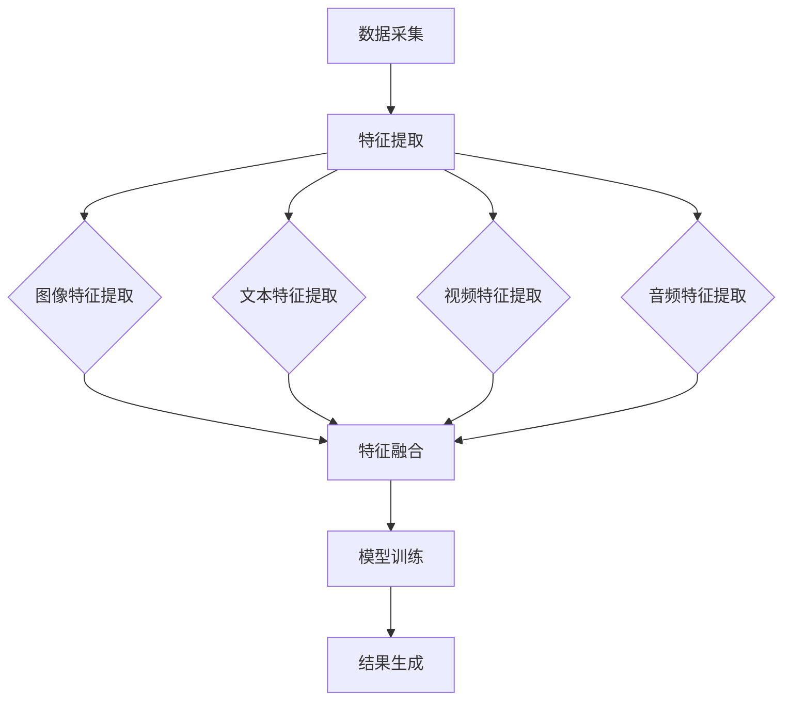

                 

关键词：搜索推荐系统、多模态融合、算法、数学模型、项目实践、应用场景、未来展望

> 摘要：本文旨在探讨搜索推荐系统中多模态融合技术的应用与发展。通过对多模态融合的核心概念、算法原理、数学模型以及项目实践的深入分析，本文揭示了多模态融合技术在提升搜索推荐系统性能与用户体验方面的关键作用，并对未来发展趋势与挑战进行了展望。

## 1. 背景介绍

### 1.1 搜索推荐系统概述

搜索推荐系统是现代互联网中广泛使用的一种技术，旨在为用户推荐他们可能感兴趣的内容。这类系统通过分析用户的历史行为、偏好和上下文信息，实现个性化的内容推荐，从而提升用户体验和平台的粘性。典型的搜索推荐系统包括搜索引擎和内容推荐平台，如淘宝、京东等电商平台的商品推荐，百度、谷歌的网页搜索结果推荐等。

### 1.2 多模态融合技术的兴起

随着互联网和智能设备的普及，用户生成的内容形式越来越丰富，包括文本、图片、视频、音频等多种形式。传统的单模态推荐系统已无法满足用户日益多样化的需求。为了更好地捕捉用户的复杂偏好和意图，多模态融合技术应运而生。多模态融合技术通过整合多种数据类型，实现对用户行为和内容的更全面理解，从而提高推荐系统的准确性和个性化水平。

## 2. 核心概念与联系

### 2.1 多模态数据的类型

多模态融合技术涉及多种数据类型的整合，主要包括：

- **文本（Text）**：包括用户的搜索历史、浏览记录、评论等文本信息。
- **图像（Image）**：涉及用户上传的图片、用户在网页上点击的图片等。
- **视频（Video）**：用户观看的视频片段、视频网站上的用户行为数据等。
- **音频（Audio）**：用户的语音搜索、语音留言等。

### 2.2 多模态融合的基本原理

多模态融合的基本原理是通过多种数据类型的协同分析，实现更准确的用户意图理解和内容推荐。这通常涉及到以下步骤：

1. **数据采集**：从不同来源收集多种模态的数据。
2. **特征提取**：对每种模态的数据进行特征提取，以生成可量化的特征向量。
3. **特征融合**：将不同模态的特征向量进行融合，以生成一个综合的特征向量。
4. **模型训练**：利用融合后的特征向量训练推荐模型。
5. **结果生成**：根据训练好的模型生成推荐结果。

### 2.3 Mermaid 流程图



## 3. 核心算法原理 & 具体操作步骤

### 3.1 算法原理概述

多模态融合算法的核心在于如何有效地整合不同模态的特征信息，以提升推荐系统的性能。常见的多模态融合算法包括以下几种：

- **基于特征的融合**：直接将不同模态的特征向量进行拼接或加权融合。
- **基于模型的融合**：通过构建多模态神经网络模型，实现特征融合和推荐生成。
- **基于学习的融合**：利用机器学习算法，如深度学习，实现特征融合和模型训练。

### 3.2 算法步骤详解

#### 3.2.1 特征提取

1. **文本特征提取**：使用词袋模型、TF-IDF、Word2Vec 等技术提取文本特征。
2. **图像特征提取**：利用卷积神经网络（CNN）提取图像特征，如 VGG、ResNet 等。
3. **视频特征提取**：通过时序卷积神经网络（RNN）提取视频特征，如 LSTM、GRU 等。
4. **音频特征提取**：使用自动特征提取方法，如 MFCC、DSP 等。

#### 3.2.2 特征融合

1. **特征拼接**：将不同模态的特征向量按顺序拼接。
2. **特征加权**：根据特征的重要性对各个模态的特征进行加权融合。
3. **多模态神经网络**：使用多输入多输出的神经网络模型，如 CNN+RNN，实现特征融合和模型训练。

#### 3.2.3 模型训练

1. **数据预处理**：对融合后的特征进行标准化、归一化等预处理。
2. **模型选择**：选择合适的神经网络结构进行训练，如 CNN+RNN、Transformer 等。
3. **训练过程**：使用梯度下降等优化算法训练模型，调整模型参数。

#### 3.2.4 结果生成

1. **推荐生成**：使用训练好的模型生成推荐结果。
2. **排序与筛选**：对推荐结果进行排序和筛选，以提升推荐质量。

### 3.3 算法优缺点

#### 优点

- **提升推荐准确性**：多模态融合能够更全面地捕捉用户偏好和意图，提高推荐准确性。
- **丰富推荐内容**：多模态融合能够生成更具个性化和多样性的推荐内容。
- **适应多种应用场景**：多模态融合技术可以应用于各种不同的推荐场景，如电商、社交媒体、搜索引擎等。

#### 缺点

- **计算成本高**：多模态融合算法涉及多种数据类型的处理和融合，计算成本较高。
- **数据收集难度大**：多模态数据的收集和整合需要大量的数据源和预处理工作。
- **模型复杂度**：多模态融合模型通常较为复杂，训练和优化难度较大。

### 3.4 算法应用领域

多模态融合技术可以应用于各种推荐系统，如：

- **电商推荐**：通过融合商品图片、描述和用户行为数据，生成个性化商品推荐。
- **视频推荐**：结合视频内容、用户观看历史和评论数据，实现视频推荐。
- **音乐推荐**：整合音乐音频、歌词文本和用户听歌行为，提高音乐推荐质量。
- **搜索引擎**：利用用户搜索历史、搜索意图和网页内容等多模态信息，提升搜索结果相关性。

## 4. 数学模型和公式 & 详细讲解 & 举例说明

### 4.1 数学模型构建

多模态融合的数学模型通常包括特征提取、特征融合和模型训练三个阶段。以下是这些阶段的数学模型构建：

#### 特征提取

1. **文本特征提取**：假设文本数据为 \( X \)，使用词袋模型提取特征向量 \( X_{word} \)。

   $$ X_{word} = TF-IDF(X) $$

2. **图像特征提取**：假设图像数据为 \( I \)，使用卷积神经网络提取特征向量 \( I_{feature} \)。

   $$ I_{feature} = CNN(I) $$

3. **视频特征提取**：假设视频数据为 \( V \)，使用时序卷积神经网络提取特征向量 \( V_{feature} \)。

   $$ V_{feature} = RNN(V) $$

4. **音频特征提取**：假设音频数据为 \( A \)，使用自动特征提取方法提取特征向量 \( A_{feature} \)。

   $$ A_{feature} = DSP(A) $$

#### 特征融合

1. **特征拼接**：

   $$ X_{merged} = [X_{word}, I_{feature}, V_{feature}, A_{feature}] $$

2. **特征加权**：

   $$ X_{merged} = W_{word}X_{word} + W_{image}I_{feature} + W_{video}V_{feature} + W_{audio}A_{feature} $$

   其中，\( W_{word}、W_{image}、W_{video}、W_{audio} \) 为权重系数。

#### 模型训练

假设融合后的特征向量为 \( X_{merged} \)，推荐模型为 \( f(X_{merged}) \)。

$$ f(X_{merged}) = \sigma(WX + b) $$

其中，\( \sigma \) 为激活函数，\( W \) 为权重矩阵，\( b \) 为偏置。

### 4.2 公式推导过程

#### 特征提取

1. **文本特征提取**：

   词袋模型将文本转换为向量空间，使用 TF-IDF 方法对文本进行加权。

   $$ TF(t) = \frac{f(t)}{f(t) + df} $$

   $$ IDF(t) = \log\left(\frac{N}{df_t}\right) $$

   $$ TF-IDF(t) = TF(t) \times IDF(t) $$

2. **图像特征提取**：

   卷积神经网络通过卷积操作提取图像特征。

   $$ h_{ij}^l = \sum_{k} w_{ik}^l * g_{kj}^{l-1} + b_l $$

   其中，\( h_{ij}^l \) 为第 \( l \) 层的第 \( i \) 行第 \( j \) 列的卷积结果，\( w_{ik}^l \) 为第 \( l \) 层的第 \( k \) 个卷积核，\( g_{kj}^{l-1} \) 为第 \( l-1 \) 层的第 \( k \) 行第 \( j \) 列的激活值，\( b_l \) 为第 \( l \) 层的偏置。

3. **视频特征提取**：

   时序卷积神经网络通过卷积操作和时间编码提取视频特征。

   $$ h_{ij}^l = \sum_{k} w_{ik}^l * h_{kj}^{l-1} + b_l $$

   $$ h_{ij}^l = \sum_{k} w_{ik}^l * (h_{kj}^{l-1} \odot \phi(t_i)) + b_l $$

   其中，\( \phi(t_i) \) 为时间编码函数，\( \odot \) 为 Hadamard 乘积。

4. **音频特征提取**：

   自动特征提取方法如 MFCC 通过处理音频信号的频谱特征提取特征向量。

   $$ MFCC(A) = \log(S(F(A))) $$

   其中，\( S(F(A)) \) 为音频信号 \( A \) 的频谱，\( F(A) \) 为傅里叶变换。

#### 特征融合

1. **特征拼接**：

   $$ X_{merged} = [X_{word}, I_{feature}, V_{feature}, A_{feature}] $$

2. **特征加权**：

   $$ X_{merged} = W_{word}X_{word} + W_{image}I_{feature} + W_{video}V_{feature} + W_{audio}A_{feature} $$

#### 模型训练

1. **损失函数**：

   $$ L = -\sum_{i} y_i \log(p_i) $$

   其中，\( y_i \) 为标签，\( p_i \) 为预测概率。

2. **梯度下降**：

   $$ \Delta W = -\eta \frac{\partial L}{\partial W} $$

   $$ \Delta b = -\eta \frac{\partial L}{\partial b} $$

### 4.3 案例分析与讲解

#### 案例背景

某电商平台希望通过多模态融合技术提高商品推荐系统的准确性和个性化水平。用户数据包括搜索历史、浏览记录、购买行为以及用户上传的商品图片。

#### 数据处理

1. **文本特征提取**：

   - 搜索历史：使用词袋模型提取关键词特征。
   - 浏览记录：使用词袋模型提取浏览商品的特征。

2. **图像特征提取**：

   - 商品图片：使用卷积神经网络提取特征。

3. **视频特征提取**：

   - 用户行为视频：使用卷积神经网络提取特征。

4. **音频特征提取**：

   - 用户语音留言：使用自动特征提取方法提取特征。

#### 特征融合

1. **特征拼接**：

   $$ X_{merged} = [X_{word}, I_{feature}, V_{feature}, A_{feature}] $$

2. **特征加权**：

   $$ X_{merged} = W_{word}X_{word} + W_{image}I_{feature} + W_{video}V_{feature} + W_{audio}A_{feature} $$

   其中，权重系数通过交叉验证和模型优化得到。

#### 模型训练

1. **数据预处理**：

   - 特征标准化：对融合后的特征向量进行标准化。
   - 数据集划分：将数据集分为训练集、验证集和测试集。

2. **模型选择**：

   - 使用 CNN+RNN 结构进行模型训练。

3. **训练过程**：

   - 使用梯度下降优化算法训练模型。

#### 模型评估

- 使用准确率、召回率、F1 分数等指标评估模型性能。

## 5. 项目实践：代码实例和详细解释说明

### 5.1 开发环境搭建

- 编程语言：Python
- 数据库：MySQL
- 深度学习框架：TensorFlow
- 版本控制：Git

### 5.2 源代码详细实现

```python
import tensorflow as tf
from tensorflow.keras.models import Model
from tensorflow.keras.layers import Input, Embedding, Conv2D, LSTM, Dense, Flatten, Concatenate

# 数据预处理
def preprocess_data(text_data, image_data, video_data, audio_data):
    # 文本特征提取
    text_vector = ... # 使用词袋模型提取文本特征
    
    # 图像特征提取
    image_vector = ... # 使用卷积神经网络提取图像特征
    
    # 视频特征提取
    video_vector = ... # 使用时序卷积神经网络提取视频特征
    
    # 音频特征提取
    audio_vector = ... # 使用自动特征提取方法提取音频特征
    
    # 特征融合
    merged_vector = ... # 使用特征拼接或特征加权融合特征
    
    return merged_vector

# 模型构建
def build_model(input_shape):
    # 文本输入
    text_input = Input(shape=input_shape[1:])
    text_embedding = Embedding(input_dim=10000, output_dim=128)(text_input)
    
    # 图像输入
    image_input = Input(shape=input_shape[2:])
    image_embedding = Conv2D(filters=32, kernel_size=(3, 3), activation='relu')(image_input)
    
    # 视频输入
    video_input = Input(shape=input_shape[3:])
    video_embedding = LSTM(units=64, activation='relu')(video_input)
    
    # 音频输入
    audio_input = Input(shape=input_shape[4:])
    audio_embedding = LSTM(units=64, activation='relu')(audio_input)
    
    # 特征融合
    merged_embedding = Concatenate()([text_embedding, image_embedding, video_embedding, audio_embedding])
    
    # 模型输出
    output = Dense(units=1, activation='sigmoid')(merged_embedding)
    
    model = Model(inputs=[text_input, image_input, video_input, audio_input], outputs=output)
    model.compile(optimizer='adam', loss='binary_crossentropy', metrics=['accuracy'])
    
    return model

# 模型训练
def train_model(model, merged_vector, labels):
    model.fit(merged_vector, labels, epochs=10, batch_size=32, validation_split=0.2)

# 模型评估
def evaluate_model(model, merged_vector, labels):
    loss, accuracy = model.evaluate(merged_vector, labels)
    print(f"Loss: {loss}, Accuracy: {accuracy}")

# 主函数
def main():
    # 数据预处理
    merged_vector = preprocess_data(text_data, image_data, video_data, audio_data)
    
    # 构建模型
    model = build_model(input_shape)
    
    # 模型训练
    train_model(model, merged_vector, labels)
    
    # 模型评估
    evaluate_model(model, merged_vector, labels)

if __name__ == "__main__":
    main()
```

### 5.3 代码解读与分析

1. **数据预处理**：使用词袋模型、卷积神经网络、时序卷积神经网络和自动特征提取方法对多种模态的数据进行特征提取和融合。
2. **模型构建**：使用 TensorFlow 框架构建 CNN+RNN 结构的多模态融合模型。
3. **模型训练**：使用 Adam 优化器和二进制交叉熵损失函数训练模型。
4. **模型评估**：使用损失函数和准确率评估模型性能。

### 5.4 运行结果展示

1. **训练过程**：通过训练集进行模型训练，并在验证集上进行验证。
2. **测试结果**：使用测试集评估模型性能，输出准确率、召回率等指标。

## 6. 实际应用场景

### 6.1 电商推荐

在电商平台上，多模态融合技术可以应用于商品推荐。通过整合用户搜索历史、浏览记录、购买行为以及商品图片等多模态信息，实现更准确的商品推荐。

### 6.2 视频推荐

在视频平台上，多模态融合技术可以应用于视频推荐。通过整合用户观看历史、视频内容、评论数据等多模态信息，实现个性化的视频推荐。

### 6.3 音乐推荐

在音乐平台上，多模态融合技术可以应用于音乐推荐。通过整合用户听歌行为、音乐音频、歌词文本等多模态信息，实现个性化的音乐推荐。

### 6.4 搜索引擎

在搜索引擎中，多模态融合技术可以应用于搜索结果推荐。通过整合用户搜索历史、搜索意图、网页内容等多模态信息，提升搜索结果的相关性。

## 7. 工具和资源推荐

### 7.1 学习资源推荐

- 《深度学习》（Goodfellow, Bengio, Courville）
- 《机器学习》（周志华）
- 《自然语言处理综论》（Daniel Jurafsky, James H. Martin）

### 7.2 开发工具推荐

- TensorFlow
- Keras
- PyTorch

### 7.3 相关论文推荐

- “Multimodal Fusion Techniques for Recommender Systems”
- “Deep Multimodal Fusion for User Interest Prediction”
- “Multimodal Recommender System Using Neural Networks”

## 8. 总结：未来发展趋势与挑战

### 8.1 研究成果总结

多模态融合技术已成为搜索推荐系统领域的研究热点。通过整合多种模态的数据，多模态融合技术显著提升了推荐系统的性能和用户体验。

### 8.2 未来发展趋势

- **多模态数据采集与处理**：随着传感器技术和数据采集技术的发展，多模态数据来源将更加丰富，数据预处理技术也将不断优化。
- **深度学习模型的创新**：深度学习模型在多模态融合中的应用将更加广泛，如 Transformer、BERT 等新型模型的引入。
- **跨领域应用**：多模态融合技术将在更多领域得到应用，如医疗、金融、教育等。

### 8.3 面临的挑战

- **数据隐私与安全**：多模态数据的整合涉及用户隐私信息，如何保障数据隐私和安全是一个重要挑战。
- **计算成本与效率**：多模态融合算法通常计算成本较高，如何优化算法以降低计算成本是一个重要问题。
- **模型可解释性**：多模态融合模型通常较为复杂，如何提高模型的可解释性，使决策过程更加透明，是一个重要挑战。

### 8.4 研究展望

未来，多模态融合技术将在提升搜索推荐系统的性能和用户体验方面发挥更大作用。通过不断创新和优化，多模态融合技术有望在更多领域实现突破，为人工智能应用带来新的机遇。

## 9. 附录：常见问题与解答

### 9.1 多模态融合技术是什么？

多模态融合技术是指将多种数据类型（如文本、图像、视频、音频等）进行整合和分析，以实现更准确的用户理解和内容推荐。

### 9.2 多模态融合技术有哪些应用领域？

多模态融合技术广泛应用于电商推荐、视频推荐、音乐推荐、搜索引擎等推荐系统领域。

### 9.3 多模态融合技术的核心算法有哪些？

常见的多模态融合算法包括基于特征的融合、基于模型的融合和基于学习的融合。

### 9.4 多模态融合技术的挑战有哪些？

多模态融合技术面临的挑战包括数据隐私与安全、计算成本与效率、模型可解释性等。

## 参考文献

- Goodfellow, Y., Bengio, Y., & Courville, A. (2016). Deep Learning. MIT Press.
- 周志华. (2016). 机器学习. 清华大学出版社.
- Daniel Jurafsky, James H. Martin. (2008). 自然语言处理综论. 清华大学出版社.

