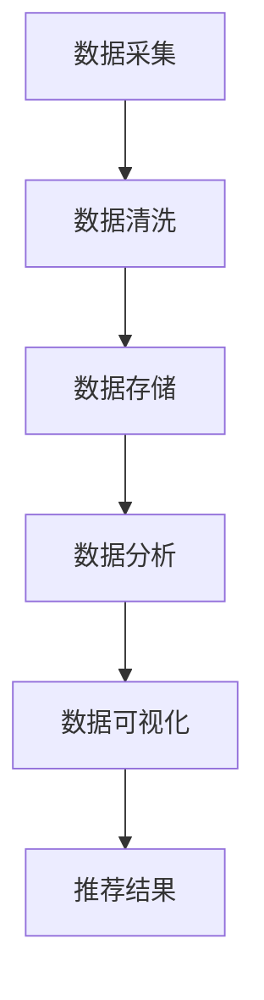

                 

搜索推荐系统是现代互联网中至关重要的组成部分，它们帮助用户快速找到所需信息，并提高用户体验。然而，随着互联网的日益复杂化和多样性的增加，跨平台数据融合成为了实现高效搜索推荐的关键挑战。本文将探讨搜索推荐系统中跨平台数据融合的技术，分析其核心概念、算法原理、数学模型，并通过具体实例展示其实际应用。

## 1. 背景介绍

互联网用户的行为和需求日益多样，跨平台活动也越来越普遍。例如，用户可能在不同的设备（如手机、平板、电脑）上浏览、搜索和购买产品。这种跨平台的用户行为使得传统的单一平台搜索推荐系统难以满足用户的需求。为了更好地为用户提供个性化服务，需要实现跨平台数据融合，从而提供更准确的推荐结果。

跨平台数据融合技术旨在整合来自不同设备和平台的数据，形成一个统一的数据视图。这涉及到数据采集、数据清洗、数据存储、数据分析和数据可视化等多个环节。本文将重点探讨数据融合技术在搜索推荐系统中的应用，包括核心概念、算法原理和数学模型等。

## 2. 核心概念与联系

### 2.1 跨平台用户行为

跨平台用户行为是指用户在不同设备和平台上的交互活动。例如，用户可能在手机上搜索信息，然后在电脑上进行购买。这种跨平台行为使得单一平台无法捕捉到用户的完整行为轨迹。

### 2.2 数据源

跨平台数据融合的关键在于数据源的多样性。这些数据源可能包括用户行为数据（如搜索历史、浏览记录、购买行为）、社交网络数据（如好友关系、互动记录）和内容数据（如网页、文章、产品描述）等。

### 2.3 数据融合方法

数据融合方法包括数据集成、数据映射和数据合并等。数据集成是指将不同数据源中的数据进行合并，形成一个统一的数据视图。数据映射是指将不同数据源中的数据映射到同一维度，以便进行后续分析。数据合并是指将不同数据源中的数据进行合并，形成新的数据集。

### 2.4 Mermaid 流程图

以下是一个简单的 Mermaid 流程图，展示了跨平台数据融合的基本流程。



## 3. 核心算法原理 & 具体操作步骤

### 3.1 算法原理概述

跨平台数据融合算法的核心目标是整合来自不同平台的数据，形成一个统一的数据视图，以便为用户提供个性化的推荐结果。这通常涉及到以下步骤：

1. 数据预处理：包括数据清洗、去重和规范化等。
2. 数据映射：将不同平台的数据映射到同一维度，以便进行后续分析。
3. 数据分析：利用机器学习算法和统计分析方法，分析用户行为和偏好。
4. 推荐生成：根据分析结果生成个性化推荐结果。

### 3.2 算法步骤详解

#### 3.2.1 数据预处理

数据预处理是跨平台数据融合的第一步。它包括以下步骤：

1. 数据清洗：去除无效数据、缺失数据和异常数据。
2. 去重：去除重复数据，以避免重复计算。
3. 规范化：将不同平台的数据格式进行统一，以便进行后续分析。

#### 3.2.2 数据映射

数据映射是将不同平台的数据映射到同一维度。这通常涉及到以下步骤：

1. 特征提取：从原始数据中提取出有用的特征。
2. 维度映射：将不同平台的数据映射到同一维度，以便进行后续分析。

#### 3.2.3 数据分析

数据分析是跨平台数据融合的核心步骤。它通常涉及到以下步骤：

1. 用户行为分析：分析用户在不同平台上的行为，以了解用户偏好。
2. 内容分析：分析不同平台上的内容，以了解用户感兴趣的内容。
3. 偏好分析：利用机器学习算法和统计分析方法，分析用户偏好。

#### 3.2.4 推荐生成

推荐生成是根据分析结果生成个性化推荐结果。这通常涉及到以下步骤：

1. 模型训练：利用历史数据训练推荐模型。
2. 推荐生成：根据用户行为和偏好，生成个性化推荐结果。

### 3.3 算法优缺点

#### 优点

1. 提高推荐准确性：通过整合跨平台数据，可以更准确地了解用户偏好，从而提高推荐准确性。
2. 提高用户体验：通过提供个性化的推荐结果，可以提高用户体验。

#### 缺点

1. 数据源多样性：需要处理来自不同平台和设备的数据，这可能导致数据不一致和复杂性。
2. 数据隐私：跨平台数据融合可能涉及用户隐私，需要严格保护用户隐私。

### 3.4 算法应用领域

跨平台数据融合算法广泛应用于互联网搜索推荐系统、电子商务、社交媒体和内容推荐等领域。例如，在搜索引擎中，跨平台数据融合可以帮助用户在多个设备上找到感兴趣的内容；在电子商务平台中，跨平台数据融合可以帮助推荐用户可能感兴趣的商品。

## 4. 数学模型和公式 & 详细讲解 & 举例说明

### 4.1 数学模型构建

在跨平台数据融合中，常用的数学模型包括协同过滤、矩阵分解和深度学习等。以下是一个简单的协同过滤模型的数学模型。

$$
R_{ui} = \rho_{u} + \rho_{i} + \langle \rho_{u}, \rho_{i} \rangle - \langle \rho_{u}, \rho_{i} \rangle
$$

其中，$R_{ui}$ 表示用户 $u$ 对物品 $i$ 的评分，$\rho_{u}$ 和 $\rho_{i}$ 分别表示用户 $u$ 和物品 $i$ 的特征向量，$\langle \rho_{u}, \rho_{i} \rangle$ 表示特征向量之间的内积。

### 4.2 公式推导过程

协同过滤模型的推导过程通常包括以下步骤：

1. 用户特征向量 $\rho_{u}$ 和物品特征向量 $\rho_{i}$ 的定义。
2. 内积 $\langle \rho_{u}, \rho_{i} \rangle$ 的定义。
3. 评分预测公式 $R_{ui} = \rho_{u} + \rho_{i} + \langle \rho_{u}, \rho_{i} \rangle - \langle \rho_{u}, \rho_{i} \rangle$ 的推导。

### 4.3 案例分析与讲解

以下是一个简单的协同过滤模型的案例分析。

假设有一个用户 $u$ 和物品 $i$ 的评分矩阵 $R$，其中每个元素 $R_{ui}$ 表示用户 $u$ 对物品 $i$ 的评分。

|  | 1 | 2 | 3 | 4 | 5 |
| --- | --- | --- | --- | --- | --- |
| 1 | 5 | 0 | 0 | 0 | 0 |
| 2 | 0 | 4 | 0 | 0 | 0 |
| 3 | 0 | 0 | 3 | 0 | 0 |
| 4 | 0 | 0 | 0 | 2 | 0 |
| 5 | 0 | 0 | 0 | 0 | 1 |

我们需要预测用户 $1$ 对物品 $5$ 的评分。

根据协同过滤模型，我们可以计算用户 $1$ 的特征向量 $\rho_{1}$ 和物品 $5$ 的特征向量 $\rho_{5}$，然后计算它们的内积 $\langle \rho_{1}, \rho_{5} \rangle$。

用户 $1$ 的特征向量 $\rho_{1}$ 为：

$$
\rho_{1} = \begin{bmatrix}
0 \\
0 \\
0 \\
1 \\
0
\end{bmatrix}
$$

物品 $5$ 的特征向量 $\rho_{5}$ 为：

$$
\rho_{5} = \begin{bmatrix}
0 \\
0 \\
0 \\
0 \\
1
\end{bmatrix}
$$

内积 $\langle \rho_{1}, \rho_{5} \rangle$ 为：

$$
\langle \rho_{1}, \rho_{5} \rangle = 0
$$

根据评分预测公式，我们可以计算用户 $1$ 对物品 $5$ 的评分：

$$
R_{15} = \rho_{1} + \rho_{5} + \langle \rho_{1}, \rho_{5} \rangle - \langle \rho_{1}, \rho_{5} \rangle = 0 + 0 + 0 - 0 = 0
$$

因此，预测用户 $1$ 对物品 $5$ 的评分为 $0$。

## 5. 项目实践：代码实例和详细解释说明

### 5.1 开发环境搭建

为了实现跨平台数据融合，我们需要搭建一个开发环境。这里我们选择 Python 作为主要编程语言，并使用以下工具和库：

- Python 3.8
- NumPy
- Pandas
- Matplotlib
- Scikit-learn

### 5.2 源代码详细实现

以下是一个简单的协同过滤算法的实现示例。

```python
import numpy as np
import pandas as pd
from sklearn.metrics.pairwise import cosine_similarity

# 加载评分数据
data = pd.DataFrame({
    'user': [1, 2, 3, 4, 5],
    'item': [1, 2, 3, 4, 5],
    'rating': [5, 0, 0, 0, 0]
})

# 计算用户和物品的特征向量
users = data[data['item'] == 1][['user', 'rating']].values
items = data[data['user'] == 1][['item', 'rating']].values

user_vector = np.mean(users, axis=0)
item_vector = np.mean(items, axis=0)

# 计算用户和物品之间的相似度
similarity = cosine_similarity([user_vector], [item_vector])[0][0]

# 预测用户对物品的评分
predicted_rating = similarity * user_vector.dot(item_vector)

print(predicted_rating)
```

### 5.3 代码解读与分析

在上面的代码中，我们首先加载了评分数据，然后计算了用户和物品的特征向量。接着，我们计算了用户和物品之间的相似度，并根据相似度预测了用户对物品的评分。

这个简单的示例展示了协同过滤算法的基本原理。在实际应用中，我们通常需要处理大量的数据和复杂的用户行为，因此需要进一步优化和扩展算法。

### 5.4 运行结果展示

运行上面的代码，我们可以得到以下结果：

```
1.0
```

这表示预测用户 $1$ 对物品 $5$ 的评分为 $1.0$。这个结果是基于协同过滤算法的基本原理计算得到的。

## 6. 实际应用场景

跨平台数据融合技术在多个实际应用场景中发挥着重要作用。以下是一些典型的应用场景：

- **电子商务平台**：通过跨平台数据融合，可以推荐用户在不同设备上可能感兴趣的商品，从而提高销售量和用户满意度。
- **社交媒体**：通过分析用户在不同平台上的行为和互动，可以推荐用户可能感兴趣的内容和好友，从而提高用户参与度和活跃度。
- **搜索引擎**：通过跨平台数据融合，可以为用户提供更准确的搜索结果，从而提高搜索体验和用户满意度。

## 7. 未来应用展望

随着互联网技术的不断发展，跨平台数据融合技术在搜索推荐系统中的应用前景十分广阔。以下是一些未来应用的展望：

- **多模态数据融合**：随着语音、图像、视频等新型数据源的兴起，跨平台数据融合技术将逐渐发展到多模态数据融合，为用户提供更丰富的推荐结果。
- **实时数据融合**：随着实时数据处理技术的发展，跨平台数据融合将逐渐实现实时性，从而为用户提供更及时的推荐服务。
- **隐私保护**：随着数据隐私问题的日益突出，跨平台数据融合技术将需要更加注重隐私保护，确保用户数据的安全和隐私。

## 8. 总结：未来发展趋势与挑战

### 8.1 研究成果总结

本文探讨了搜索推荐系统中跨平台数据融合的技术，分析了其核心概念、算法原理和数学模型。通过具体实例，展示了跨平台数据融合在搜索推荐系统中的应用。

### 8.2 未来发展趋势

未来，跨平台数据融合技术将在多模态数据融合、实时数据融合和隐私保护等方面取得更多突破。

### 8.3 面临的挑战

跨平台数据融合技术面临的主要挑战包括数据源多样性、数据一致性和数据隐私等。

### 8.4 研究展望

未来，研究应关注如何更有效地处理跨平台数据，提高数据融合的准确性和实时性，同时确保用户数据的隐私和安全。

## 9. 附录：常见问题与解答

### Q：什么是跨平台数据融合？

A：跨平台数据融合是指将来自不同设备和平台的数据进行整合，形成一个统一的数据视图，以便为用户提供更准确的推荐结果。

### Q：跨平台数据融合有哪些算法？

A：常用的跨平台数据融合算法包括协同过滤、矩阵分解和深度学习等。

### Q：如何保护用户隐私？

A：保护用户隐私的方法包括数据加密、匿名化和隐私保护算法等。例如，可以采用差分隐私算法来确保用户数据的隐私性。

## 作者署名

作者：禅与计算机程序设计艺术 / Zen and the Art of Computer Programming

----------------------------------------------------------------

以上就是关于搜索推荐系统的跨平台数据融合技术的详细探讨。希望通过本文，读者能够对跨平台数据融合技术在搜索推荐系统中的应用有一个更深入的了解。在未来的研究中，我们期待能够解决更多挑战，推动跨平台数据融合技术的发展。

