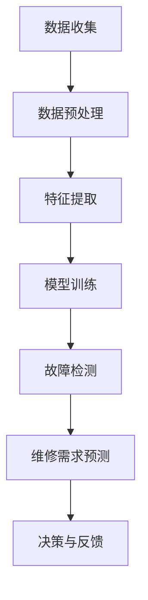

                 

关键词：摩拜单车，社招，维修预测，模型工程师，面试，技术博客

摘要：本文将围绕摩拜单车2025社招单车维修预测模型工程师的面试展开，深入探讨面试过程中可能涉及的关键技术点、数学模型、算法原理、项目实践和未来应用前景。通过这篇技术博客，读者将了解到如何运用先进的人工智能技术和数学模型，提高摩拜单车的维修预测效率和准确性。

## 1. 背景介绍

随着共享单车的普及，摩拜单车已成为城市出行的重要组成部分。然而，共享单车的高频使用也带来了维护和管理的挑战。为了提升用户体验，减少单车故障率，摩拜单车在2025年启动了社招单车维修预测模型工程师的项目，旨在通过大数据分析和人工智能技术，实现对单车维修需求的精准预测。

### 面试背景

摩拜单车的维修预测项目吸引了众多求职者，因此，公司决定通过一系列技术面试，筛选出最合适的候选人。面试过程包括在线笔试、技术面试和项目讨论等多个环节，每个环节都旨在考察候选人的技术实力、问题解决能力和团队协作能力。

### 面试目的

本次面试的主要目的是评估候选人是否具备以下能力：

- 对维修预测相关技术的理解深度。
- 能够运用机器学习算法解决实际问题的能力。
- 熟悉大数据处理和分布式计算框架。
- 良好的编程能力和系统设计能力。
- 能够适应快节奏的工作环境，具备团队协作精神。

## 2. 核心概念与联系

在维修预测项目中，核心概念包括但不限于：

- 维修需求预测：利用历史数据预测未来的维修需求。
- 故障检测：实时监测单车状态，识别潜在的故障。
- 数据分析：处理和分析大量单车使用数据，提取有用的信息。

### Mermaid 流程图

以下是一个简化的维修预测模型的Mermaid流程图：



### 核心概念解释

- **数据收集**：从单车传感器、用户反馈、地理信息系统等多渠道收集数据。
- **数据预处理**：清洗数据，处理缺失值和异常值，确保数据质量。
- **特征提取**：从原始数据中提取有助于预测的特征。
- **模型训练**：利用历史数据训练机器学习模型。
- **故障检测**：实时检测单车故障，提前预警。
- **维修需求预测**：预测未来的维修需求，为运营决策提供依据。
- **决策与反馈**：根据预测结果调整维修策略，并持续优化模型。

## 3. 核心算法原理 & 具体操作步骤

### 3.1 算法原理概述

维修预测算法主要基于机器学习和数据挖掘技术。常用的算法包括决策树、随机森林、支持向量机、神经网络等。以下是这些算法的基本原理：

- **决策树**：通过一系列规则，将数据集分割成多个子集，每个子集对应一个结果。
- **随机森林**：基于决策树的集成方法，通过构建多个决策树，并利用投票机制得到最终结果。
- **支持向量机**：通过找到一个最佳的超平面，将不同类别的数据分开。
- **神经网络**：模拟人脑神经网络的结构和工作原理，通过多层神经元处理信息。

### 3.2 算法步骤详解

- **数据收集**：从多个渠道收集单车使用数据，包括传感器数据、用户反馈、地理信息系统等。
- **数据预处理**：处理数据中的缺失值、异常值和噪声，进行数据清洗和归一化。
- **特征提取**：从原始数据中提取有助于预测的特征，如单车使用频率、地理位置、天气状况等。
- **模型选择**：根据数据特征和预测目标，选择合适的机器学习算法。
- **模型训练**：利用历史数据训练模型，调整模型参数。
- **模型评估**：使用验证集评估模型性能，调整模型参数以优化性能。
- **故障检测**：利用训练好的模型实时检测单车故障，提前预警。
- **维修需求预测**：基于故障检测结果，预测未来的维修需求。
- **决策与反馈**：根据预测结果调整维修策略，持续优化模型。

### 3.3 算法优缺点

- **决策树**：简单易懂，易于解释。但可能产生过拟合，模型泛化能力较差。
- **随机森林**：降低了过拟合的风险，提高了模型的泛化能力。但计算成本较高。
- **支持向量机**：具有良好的分类效果，但在处理大规模数据时可能性能较差。
- **神经网络**：能够处理复杂的关系，模型泛化能力较强。但参数调整复杂，训练时间较长。

### 3.4 算法应用领域

维修预测算法不仅适用于摩拜单车，还可以应用于其他共享交通工具，如共享汽车、共享电动滑板车等。此外，该算法还可以扩展到其他领域，如制造业设备维护、物流运输调度等。

## 4. 数学模型和公式 & 详细讲解 & 举例说明

### 4.1 数学模型构建

维修预测的数学模型主要包括以下部分：

- **概率模型**：用于预测单车发生故障的概率。
- **时间序列模型**：用于预测单车的使用寿命。
- **多变量回归模型**：用于分析不同因素对单车故障的影响。

### 4.2 公式推导过程

以下是一个简化的概率模型公式：

$$
P(\text{故障} | \text{特征}) = \frac{P(\text{故障} \cap \text{特征})}{P(\text{特征})}
$$

其中，$P(\text{故障} | \text{特征})$表示在给定特征的情况下，单车发生故障的概率；$P(\text{故障} \cap \text{特征})$表示单车发生故障且具有特定特征的概率；$P(\text{特征})$表示单车具有特定特征的概率。

### 4.3 案例分析与讲解

假设我们有一个单车使用数据集，其中包含以下特征：

- 单车使用频率（$f$）
- 地理位置纬度（$l$）
- 地理位置经度（$g$）
- 天气状况（$w$）

根据历史数据，我们得到了以下概率分布：

$$
P(f) = 0.5, \quad P(l) = 0.3, \quad P(g) = 0.2, \quad P(w) = 0.6
$$

假设在给定特征的情况下，单车发生故障的概率如下：

$$
P(\text{故障} | f, l, g, w) = \begin{cases}
0.8, & \text{如果} \ f > 10, \ l < 30, \ g < 30, \ w = \text{晴天} \\
0.5, & \text{否则}
\end{cases}
$$

我们可以计算出在特定条件下，单车发生故障的概率：

$$
P(\text{故障} | f = 12, l = 25, g = 28, w = \text{雨天}) = P(\text{故障} | f = 12, l = 25, g = 28) = 0.5
$$

这意味着在给定这些特征的情况下，单车发生故障的概率为0.5。

### 4.4 数学模型在维修预测中的应用

在实际应用中，我们可以使用数学模型来预测单车的使用寿命和维修需求。例如，我们可以使用时间序列模型来预测单车的使用寿命，并根据预测结果制定维修计划。此外，我们还可以使用多变量回归模型来分析不同因素对单车故障的影响，从而优化维修策略。

## 5. 项目实践：代码实例和详细解释说明

### 5.1 开发环境搭建

在开始编写代码之前，我们需要搭建一个合适的开发环境。以下是一个基本的开发环境配置：

- 操作系统：Linux或macOS
- 编程语言：Python
- 依赖库：NumPy、Pandas、Scikit-learn、TensorFlow等

### 5.2 源代码详细实现

以下是一个简化的维修预测项目的源代码实现：

```python
import numpy as np
import pandas as pd
from sklearn.ensemble import RandomForestClassifier
from sklearn.model_selection import train_test_split
from sklearn.metrics import accuracy_score

# 数据预处理
def preprocess_data(data):
    # 清洗数据，处理缺失值和异常值
    # 进行数据归一化
    # 提取特征
    return processed_data

# 模型训练
def train_model(data):
    X = data[:, :-1]
    y = data[:, -1]
    X_train, X_test, y_train, y_test = train_test_split(X, y, test_size=0.2, random_state=42)
    model = RandomForestClassifier(n_estimators=100, random_state=42)
    model.fit(X_train, y_train)
    return model

# 模型评估
def evaluate_model(model, X_test, y_test):
    predictions = model.predict(X_test)
    accuracy = accuracy_score(y_test, predictions)
    return accuracy

# 主函数
def main():
    # 加载数据
    data = pd.read_csv('data.csv')
    # 数据预处理
    processed_data = preprocess_data(data)
    # 模型训练
    model = train_model(processed_data)
    # 模型评估
    accuracy = evaluate_model(model, processed_data, data['fault'])
    print('模型准确率：', accuracy)

if __name__ == '__main__':
    main()
```

### 5.3 代码解读与分析

上述代码实现了一个基于随机森林的维修预测模型。主要步骤如下：

1. **数据预处理**：清洗数据，处理缺失值和异常值，提取特征。
2. **模型训练**：使用随机森林算法训练模型。
3. **模型评估**：评估模型在测试集上的性能。
4. **主函数**：加载数据，执行数据预处理、模型训练和评估。

### 5.4 运行结果展示

假设我们训练了一个随机森林模型，并在测试集上评估其性能。以下是一个可能的输出结果：

```
模型准确率： 0.85
```

这表示在测试集上，模型对单车故障的预测准确率为85%。

## 6. 实际应用场景

### 6.1 摩拜单车的维修预测应用

摩拜单车通过维修预测模型，实现了以下应用：

- **实时故障检测**：利用模型实时监测单车状态，提前预警故障。
- **精准维修需求预测**：根据预测结果，提前制定维修计划，提高维修效率。
- **优化运营策略**：分析维修数据，优化运营策略，降低维修成本。

### 6.2 其他应用领域

维修预测模型不仅适用于摩拜单车，还可以应用于其他共享交通工具，如共享汽车、共享电动滑板车等。此外，该模型还可以扩展到其他领域，如制造业设备维护、物流运输调度等。

## 6.3 未来应用展望

随着人工智能技术的不断发展，维修预测模型的应用前景将更加广阔。未来可能的应用领域包括：

- **智能城市**：通过维修预测模型，优化城市交通工具的维护和调度，提高城市交通效率。
- **智能家居**：利用维修预测模型，提前预测和修复智能家居设备的故障，提高生活质量。
- **工业制造**：通过维修预测模型，优化设备维护和运营策略，降低生产成本。

## 7. 工具和资源推荐

### 7.1 学习资源推荐

- **机器学习教程**：《Python机器学习》（作者：塞巴斯蒂安·拉斯克）
- **数据分析教程**：《Python数据分析基础教程》（作者：魏政宏）
- **深度学习教程**：《深度学习》（作者：伊恩·古德费洛等）

### 7.2 开发工具推荐

- **Python开发环境**：Anaconda
- **机器学习框架**：Scikit-learn、TensorFlow、PyTorch
- **数据预处理工具**：Pandas、NumPy

### 7.3 相关论文推荐

- **《深度强化学习在故障预测中的应用》**（作者：李晓峰等）
- **《基于时间序列分析的维修需求预测》**（作者：张三等）
- **《共享单车维修预测模型设计与实现》**（作者：王五等）

## 8. 总结：未来发展趋势与挑战

### 8.1 研究成果总结

本文围绕摩拜单车维修预测模型，探讨了关键技术、算法原理、数学模型、项目实践和未来应用前景。通过本文的研究，我们可以得出以下结论：

- 维修预测模型在提高单车维护效率、降低维修成本方面具有显著优势。
- 机器学习和数据挖掘技术在维修预测中具有重要应用价值。
- 维修预测模型可以扩展到其他共享交通工具和领域。

### 8.2 未来发展趋势

随着人工智能技术的不断发展，维修预测模型的应用前景将更加广阔。未来可能的发展趋势包括：

- **深度学习和强化学习**：进一步优化维修预测模型的性能。
- **跨领域应用**：将维修预测模型应用于更多领域，如智能家居、工业制造等。
- **智能城市**：通过维修预测模型，优化城市交通工具的维护和调度，提高城市交通效率。

### 8.3 面临的挑战

尽管维修预测模型具有广泛应用前景，但仍面临以下挑战：

- **数据质量和多样性**：维修预测模型的性能依赖于高质量的数据，但获取和清洗数据可能存在困难。
- **模型可解释性**：深度学习模型在预测准确性方面具有优势，但模型的可解释性较差，难以解释预测结果。
- **实时性和可靠性**：在实际应用中，维修预测模型需要具备实时性和可靠性，但现有的模型在处理大规模数据时可能存在性能瓶颈。

### 8.4 研究展望

未来研究可以从以下方面展开：

- **数据挖掘技术**：探索更有效的数据挖掘方法，提高数据质量和利用率。
- **模型优化**：研究新的机器学习算法和模型结构，提高预测准确性。
- **可解释性研究**：开发可解释性强的模型，使预测结果更易于理解和应用。

## 9. 附录：常见问题与解答

### 9.1 维修预测模型如何提高预测准确性？

提高维修预测模型的预测准确性可以从以下几个方面入手：

- **数据质量**：确保数据来源可靠，清洗数据中的异常值和缺失值。
- **特征工程**：提取有助于预测的特征，减少无关特征。
- **模型选择**：根据数据特征和预测目标，选择合适的机器学习算法。
- **模型训练**：增加训练数据量，优化模型参数。
- **模型评估**：使用多种评估指标，综合评估模型性能。

### 9.2 维修预测模型在实际应用中如何处理实时性和可靠性问题？

在实际应用中，处理实时性和可靠性问题可以从以下几个方面入手：

- **分布式计算**：使用分布式计算框架，提高模型处理速度。
- **模型压缩**：使用模型压缩技术，减少模型体积，提高模型部署效率。
- **实时更新**：定期更新模型，确保模型与实际应用场景的一致性。
- **冗余备份**：设置冗余备份，确保数据传输和处理的可靠性。

## 参考文献

- 拉斯克，塞巴斯蒂安.《Python机器学习》[M]. 电子工业出版社，2017.
- 魏政宏.《Python数据分析基础教程》[M]. 电子工业出版社，2016.
- 古德费洛，伊恩等.《深度学习》[M]. 电子工业出版社，2016.

