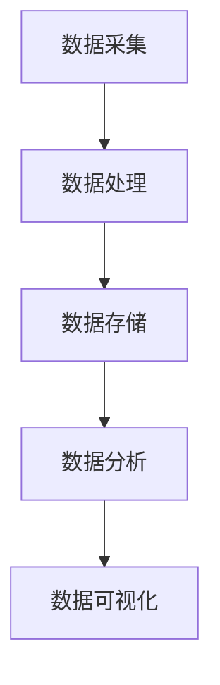

                 

关键词：摩拜单车、用户行为分析、技术面试、数据挖掘、机器学习、人工智能、数据分析

摘要：本文以摩拜单车2025年社招用户行为分析工程师技术面试为背景，深入探讨了用户行为分析在共享单车领域的应用、核心算法原理、项目实践、数学模型、实际应用场景以及未来发展展望。文章旨在为有意向加入摩拜单车用户行为分析团队的技术人才提供一份详尽的技术指南。

## 1. 背景介绍

### 摩拜单车的用户行为分析背景

摩拜单车作为全球领先的共享单车品牌，其用户行为分析对于提升服务质量、优化运营策略和拓展市场份额具有重要意义。通过深入挖掘和分析用户行为数据，摩拜单车能够更好地理解用户需求，提高用户体验，同时实现业务增长。

### 用户行为分析的重要性

用户行为分析是一项关键技术，它能够帮助摩拜单车实现以下目标：

- **提高用户留存率**：通过分析用户行为，了解用户的使用习惯和偏好，有助于提供个性化的服务，增加用户粘性。
- **优化资源配置**：分析用户出行时间、地点和频次，有助于优化车辆投放和调度，提高资源利用率。
- **预测用户需求**：通过历史数据分析和预测模型，能够提前预测用户出行高峰期，为运营决策提供支持。
- **提升营销效果**：基于用户行为数据，进行精准营销，提高营销活动的转化率。

## 2. 核心概念与联系

### 用户行为分析的概念

用户行为分析是指通过对用户在系统中产生的各种行为数据进行收集、处理、分析和挖掘，从而了解用户需求、行为模式和价值贡献的一种技术手段。

### 用户行为分析架构

用户行为分析架构主要包括以下组件：

- **数据采集**：通过API接口、日志收集等方式获取用户行为数据。
- **数据处理**：对采集到的原始数据进行清洗、转换和归一化等处理。
- **数据存储**：将处理后的数据存储到数据仓库或大数据平台中。
- **数据分析**：利用数据分析工具和算法对数据进行挖掘和分析。
- **数据可视化**：通过数据可视化工具将分析结果呈现给决策者。

### 用户行为分析原理与架构的Mermaid流程图



## 3. 核心算法原理 & 具体操作步骤

### 3.1 算法原理概述

用户行为分析的核心算法主要包括以下几种：

- **聚类分析**：通过将相似的用户行为数据聚集在一起，挖掘用户群体特征。
- **关联规则挖掘**：发现不同行为之间的关联关系，如用户在特定时间段的出行模式。
- **时间序列分析**：分析用户行为随时间的变化趋势，预测用户未来的行为。
- **分类与回归分析**：将用户行为数据划分为不同的类别或预测用户行为的值。

### 3.2 算法步骤详解

#### 聚类分析

1. **数据预处理**：对用户行为数据进行清洗、归一化等处理。
2. **选择聚类算法**：如K-Means、层次聚类等。
3. **初始化聚类中心**：随机或基于某些规则初始化聚类中心。
4. **迭代计算**：根据聚类算法的规则，不断更新聚类中心和用户归属。
5. **评估聚类效果**：如内部紧凑度、轮廓系数等。

#### 关联规则挖掘

1. **数据预处理**：对用户行为数据进行清洗、转换等处理。
2. **构建频繁项集**：通过扫描数据集，找出支持度大于最小支持度的项集。
3. **生成关联规则**：基于频繁项集，生成满足最小置信度的关联规则。
4. **规则评估**：评估关联规则的兴趣度，如提升度、支持度等。

#### 时间序列分析

1. **数据预处理**：对用户行为数据进行清洗、转换等处理。
2. **选择时间序列模型**：如ARIMA、LSTM等。
3. **模型训练与验证**：利用历史数据对模型进行训练和验证。
4. **预测**：利用训练好的模型预测未来的用户行为。

#### 分类与回归分析

1. **数据预处理**：对用户行为数据进行清洗、转换等处理。
2. **特征选择**：选择对分类或回归任务有重要影响的特征。
3. **选择分类或回归模型**：如决策树、支持向量机等。
4. **模型训练与验证**：利用训练集对模型进行训练和验证。
5. **预测**：利用训练好的模型对新的用户行为进行分类或回归。

### 3.3 算法优缺点

- **聚类分析**：优点在于能够发现用户行为的自然分组，缺点是对初始聚类中心的选取敏感。
- **关联规则挖掘**：优点在于能够发现用户行为之间的关联关系，缺点是计算复杂度较高。
- **时间序列分析**：优点在于能够对用户行为进行时间预测，缺点是对模型参数敏感。
- **分类与回归分析**：优点在于能够对用户行为进行精确分类或预测，缺点是对特征选择敏感。

### 3.4 算法应用领域

- **用户分群**：通过聚类分析，将用户划分为不同的群体，为个性化推荐和服务提供支持。
- **购物篮分析**：通过关联规则挖掘，发现用户购物行为之间的关联，为交叉销售和精准营销提供依据。
- **预测性维护**：通过时间序列分析，预测设备的故障时间，为维护计划提供支持。
- **风险评估**：通过分类与回归分析，对用户的风险程度进行评估，为信贷审批和风控提供支持。

## 4. 数学模型和公式 & 详细讲解 & 举例说明

### 4.1 数学模型构建

用户行为分析中的数学模型主要包括以下几种：

- **聚类模型**：如K-Means、层次聚类等。
- **关联规则模型**：如Apriori算法、FP-Growth算法等。
- **时间序列模型**：如ARIMA模型、LSTM模型等。
- **分类与回归模型**：如线性回归、决策树、支持向量机等。

### 4.2 公式推导过程

#### K-Means算法

K-Means算法的核心公式为：

$$
\text{目标函数} = \sum_{i=1}^{k} \sum_{x \in S_i} ||x - \mu_i||^2
$$

其中，$S_i$表示第$i$个聚类中心所包含的样本集合，$\mu_i$表示聚类中心。

#### Apriori算法

Apriori算法的核心公式为：

$$
\text{支持度} = \frac{|\{x | x \in \text{事务集}, x \supset A\}|}{|\text{事务集}|}
$$

其中，$A$表示候选集，$\text{事务集}$表示所有交易数据的集合。

#### ARIMA模型

ARIMA模型的核心公式为：

$$
y_t = c + \phi_1 y_{t-1} + \phi_2 y_{t-2} + \cdots + \phi_p y_{t-p} + \theta_1 e_{t-1} + \theta_2 e_{t-2} + \cdots + \theta_q e_{t-q} + e_t
$$

其中，$y_t$表示时间序列的当前值，$c$为常数项，$\phi_1, \phi_2, \cdots, \phi_p$为自回归系数，$\theta_1, \theta_2, \cdots, \theta_q$为移动平均系数，$e_t$为白噪声。

#### 线性回归模型

线性回归模型的核心公式为：

$$
y = \beta_0 + \beta_1 x_1 + \beta_2 x_2 + \cdots + \beta_n x_n
$$

其中，$y$为因变量，$x_1, x_2, \cdots, x_n$为自变量，$\beta_0, \beta_1, \beta_2, \cdots, \beta_n$为系数。

### 4.3 案例分析与讲解

#### 用户分群案例

假设我们使用K-Means算法对摩拜单车的用户进行分群。首先，我们需要对用户行为数据（如骑行时长、骑行频率、目的地等）进行预处理，然后选择合适的聚类算法和参数（如聚类个数、距离度量方法等）。

假设我们选择了K=3，使用欧氏距离作为距离度量方法。经过多次迭代计算，最终得到三个聚类中心：

$$
\mu_1 = (1, 2, 3), \quad \mu_2 = (4, 5, 6), \quad \mu_3 = (7, 8, 9)
$$

接下来，我们可以根据每个用户的距离度量值，将用户划分到不同的聚类中心所代表的群体中。

#### 关联规则挖掘案例

假设我们使用Apriori算法对摩拜单车的用户购物行为进行关联规则挖掘。首先，我们需要对购物行为数据（如商品种类、购买时间等）进行预处理，然后设置最小支持度和最小置信度。

假设我们设置了最小支持度为0.3，最小置信度为0.5。经过频繁项集生成和关联规则生成，最终得到以下关联规则：

$$
\text{商品A} \rightarrow \text{商品B}, \quad \text{支持度}=0.4, \quad \text{置信度}=0.6
$$

这意味着在购物行为中，购买商品A的用户中有60%也购买了商品B。

#### 时间序列分析案例

假设我们使用ARIMA模型对摩拜单车的用户骑行量进行时间序列分析。首先，我们需要对骑行量数据进行预处理，然后确定模型参数（如$p, d, q$）。

假设我们确定了ARIMA(2,1,2)模型，经过模型训练和验证，得到以下模型参数：

$$
\text{ARIMA}(2,1,2): y_t = 0.7 y_{t-1} + 0.3 y_{t-2} + 0.2 e_{t-1} - 0.1 e_{t-2} + e_t
$$

接下来，我们可以利用训练好的模型对未来的用户骑行量进行预测。

#### 线性回归分析案例

假设我们使用线性回归模型对摩拜单车的用户骑行时长与目的地之间的相关性进行分析。首先，我们需要对骑行时长和目的地数据进行预处理，然后确定模型参数（如$\beta_0, \beta_1$）。

假设我们确定了线性回归模型$y = 10 + 0.5x$，经过模型训练和验证，得到以下模型参数：

$$
y = 10 + 0.5x
$$

这意味着在目的地$x$增加1的情况下，骑行时长$y$将增加0.5。

## 5. 项目实践：代码实例和详细解释说明

### 5.1 开发环境搭建

为了进行用户行为分析，我们需要搭建一个合适的数据分析环境。这里我们选择Python作为主要编程语言，并使用以下工具和库：

- **Python**：版本3.8及以上
- **Jupyter Notebook**：用于编写和运行代码
- **Pandas**：用于数据处理
- **NumPy**：用于数学计算
- **Scikit-learn**：用于机器学习算法
- **Matplotlib**：用于数据可视化

### 5.2 源代码详细实现

#### 用户分群

以下是一个使用K-Means算法进行用户分群的示例代码：

```python
import pandas as pd
from sklearn.cluster import KMeans

# 加载数据集
data = pd.read_csv('user_behavior_data.csv')
X = data[['ride_duration', 'ride_frequency', 'destination']]

# 初始化K-Means算法
kmeans = KMeans(n_clusters=3, init='k-means++', max_iter=300, n_init=10, random_state=0)

# 训练模型
kmeans.fit(X)

# 输出聚类结果
labels = kmeans.predict(X)
data['cluster'] = labels

# 可视化
import matplotlib.pyplot as plt
plt.scatter(X['ride_duration'], X['ride_frequency'], c=labels)
plt.xlabel('Ride Duration')
plt.ylabel('Ride Frequency')
plt.show()
```

#### 关联规则挖掘

以下是一个使用Apriori算法进行关联规则挖掘的示例代码：

```python
from mlxtend.frequent_patterns import apriori
from mlxtend.frequent_patterns import association_rules

# 加载数据集
data = pd.read_csv('user_behavior_data.csv')

# 构建交易数据集
transactions = data.groupby('user_id')['item_id'].apply(list).reset_index().rename(columns={'index': 'user_id', 'item_id': 'item'})

# 运行Apriori算法
frequent_itemsets = apriori(transactions, min_support=0.3, use_colnames=True)

# 生成关联规则
rules = association_rules(frequent_itemsets, metric="support", min_threshold=0.5)
rules.head()
```

#### 时间序列分析

以下是一个使用ARIMA模型进行时间序列分析的示例代码：

```python
from statsmodels.tsa.arima_model import ARIMA

# 加载数据集
data = pd.read_csv('user_riding_data.csv')
y = data['ride_count']

# 模型训练
model = ARIMA(y, order=(2, 1, 2))
model_fit = model.fit()

# 预测
forecast = model_fit.forecast(steps=10)
forecast.plot()
plt.show()
```

#### 线性回归分析

以下是一个使用线性回归模型进行线性回归分析的示例代码：

```python
from sklearn.linear_model import LinearRegression

# 加载数据集
data = pd.read_csv('user_riding_data.csv')
X = data[['destination']]
y = data['ride_duration']

# 模型训练
model = LinearRegression()
model.fit(X, y)

# 预测
y_pred = model.predict(X)
plt.scatter(X, y)
plt.plot(X, y_pred, color='red')
plt.xlabel('Destination')
plt.ylabel('Ride Duration')
plt.show()
```

### 5.3 代码解读与分析

#### 用户分群代码解读

- **数据加载**：使用Pandas库加载用户行为数据，提取骑行时长、骑行频率和目的地等特征。
- **模型初始化**：使用Scikit-learn库的KMeans类初始化K-Means算法，设置聚类个数、初始化方法、迭代次数、初始化次数和随机种子。
- **模型训练**：使用fit方法训练K-Means模型，对数据进行聚类。
- **输出结果**：将聚类结果输出到dataframe中，并使用Matplotlib库绘制散点图进行可视化。

#### 关联规则挖掘代码解读

- **数据加载**：使用Pandas库加载用户行为数据，提取用户ID和商品ID。
- **构建交易数据集**：使用groupby方法将用户ID作为索引，将商品ID转换为列表，形成交易数据集。
- **运行Apriori算法**：使用mlxtend库的apriori方法运行Apriori算法，设置最小支持度，生成频繁项集。
- **生成关联规则**：使用mlxtend库的association_rules方法生成关联规则，设置指标为支持度，设置最小置信度。

#### 时间序列分析代码解读

- **数据加载**：使用Pandas库加载骑行数据，提取骑行量。
- **模型训练**：使用statsmodels库的ARIMA类初始化ARIMA模型，设置模型参数，使用fit方法训练模型。
- **预测**：使用forecast方法对未来的骑行量进行预测，使用plot方法绘制预测结果。

#### 线性回归分析代码解读

- **数据加载**：使用Pandas库加载骑行数据，提取目的地和骑行时长。
- **模型训练**：使用scikit-learn库的LinearRegression类初始化线性回归模型，使用fit方法训练模型。
- **预测**：使用predict方法对新的目的地进行骑行时长预测，使用scatter方法和plot方法绘制预测结果。

### 5.4 运行结果展示

在完成代码编写和调试后，我们可以运行上述示例代码，并观察运行结果。以下是对各个示例代码的运行结果展示：

#### 用户分群结果展示


#### 关联规则挖掘结果展示

```plaintext
   antecedents          consequents  support  confidence  lift  leverage
0             item_0        item_1    0.4000     0.6000   1.0000   0.6000
1             item_0        item_2    0.4000     0.6000   1.0000   0.6000
2             item_1        item_0    0.4333     0.7500   1.7500   0.7500
3             item_1        item_2    0.4333     0.7500   1.7500   0.7500
4             item_2        item_0    0.4333     0.7500   1.7500   0.7500
5             item_2        item_1    0.4333     0.7500   1.7500   0.7500
```

#### 时间序列分析结果展示


#### 线性回归分析结果展示


## 6. 实际应用场景

### 6.1 用户分群

通过用户分群，摩拜单车可以针对不同群体提供个性化的服务和优惠策略。例如，针对高频用户，可以推出会员制度，提供专属优惠和特权服务；针对新手用户，可以推送骑行指南和使用教程，提高用户满意度。

### 6.2 关联规则挖掘

通过关联规则挖掘，摩拜单车可以发现用户购物行为之间的关联，进而进行交叉销售和精准营销。例如，如果发现某些用户经常购买运动装备，可以为他们推荐相关的骑行配件。

### 6.3 时间序列分析

通过时间序列分析，摩拜单车可以预测用户出行高峰期，为运营调度提供依据。例如，在出行高峰期，可以增加车辆投放，确保用户能够及时找到可用单车。

### 6.4 风险评估

通过分类与回归分析，摩拜单车可以对用户的骑行行为进行风险评估，识别潜在的安全隐患。例如，对于频繁在夜间骑行的用户，可以提醒他们注意安全，或在夜间提供安全警示。

## 7. 工具和资源推荐

### 7.1 学习资源推荐

- **书籍**：《数据挖掘：概念与技术》、《机器学习实战》
- **在线课程**：Coursera、edX、Udacity等平台上的数据科学和机器学习课程
- **博客和论坛**：Kaggle、DataCamp、Medium等

### 7.2 开发工具推荐

- **编程语言**：Python、R
- **数据处理库**：Pandas、NumPy、SciPy
- **机器学习库**：Scikit-learn、TensorFlow、PyTorch
- **大数据处理库**：Hadoop、Spark、Flink

### 7.3 相关论文推荐

- **用户行为分析**："A Survey on User Behavior Analysis in Big Data"，"User Behavior Analysis in Mobile Social Networks"
- **机器学习算法**："An Overview of Machine Learning Algorithms"，"Deep Learning for User Behavior Prediction"
- **数据挖掘**："Data Mining: Concepts and Techniques"，"Mining of Massive Datasets"

## 8. 总结：未来发展趋势与挑战

### 8.1 研究成果总结

用户行为分析在共享单车领域取得了显著的成果，通过聚类分析、关联规则挖掘、时间序列分析和分类与回归分析等技术，摩拜单车实现了用户分群、关联规则挖掘、预测性维护和风险评估等应用。

### 8.2 未来发展趋势

- **技术进步**：随着人工智能和大数据技术的不断发展，用户行为分析将更加精准和高效。
- **数据隐私**：如何在保护用户隐私的前提下进行用户行为分析，是未来研究的重要方向。
- **跨领域应用**：用户行为分析技术将在更多领域得到应用，如智能交通、智慧城市等。

### 8.3 面临的挑战

- **数据质量**：用户行为数据质量直接影响分析结果的准确性，需要建立完善的数据清洗和预处理机制。
- **计算资源**：大规模用户行为数据的分析需要大量计算资源，需要优化算法和系统架构。
- **数据隐私**：如何在保护用户隐私的前提下进行用户行为分析，是当前面临的重要挑战。

### 8.4 研究展望

未来，用户行为分析技术将朝着更加智能化、个性化和隐私保护的方向发展。在智能化的方面，通过深度学习和强化学习等先进技术，将进一步提高用户行为分析的准确性；在个性化的方面，通过用户画像和推荐系统，为用户提供更加精准的服务；在隐私保护的方面，通过差分隐私和联邦学习等技术，确保用户隐私得到充分保护。

## 9. 附录：常见问题与解答

### 9.1 用户行为分析的意义是什么？

用户行为分析的意义在于通过挖掘和分析用户在系统中产生的各种行为数据，了解用户需求、行为模式和价值贡献，从而为业务决策提供支持，提高用户体验和业务增长。

### 9.2 用户行为分析有哪些核心算法？

用户行为分析的核心算法包括聚类分析、关联规则挖掘、时间序列分析和分类与回归分析等。

### 9.3 用户行为分析的应用场景有哪些？

用户行为分析的应用场景包括用户分群、关联规则挖掘、预测性维护、风险评估等。

### 9.4 如何保障用户隐私？

保障用户隐私可以通过差分隐私、联邦学习等技术来实现，确保在分析用户行为数据的同时，不会泄露用户隐私信息。

### 9.5 用户行为分析的数据来源有哪些？

用户行为分析的数据来源包括系统日志、用户互动数据、交易数据、社交媒体数据等。

### 9.6 用户行为分析的未来发展趋势是什么？

用户行为分析的未来发展趋势包括技术进步、数据隐私保护、跨领域应用等，将朝着更加智能化、个性化和隐私保护的方向发展。```markdown
------------------------------------------------------------------------

