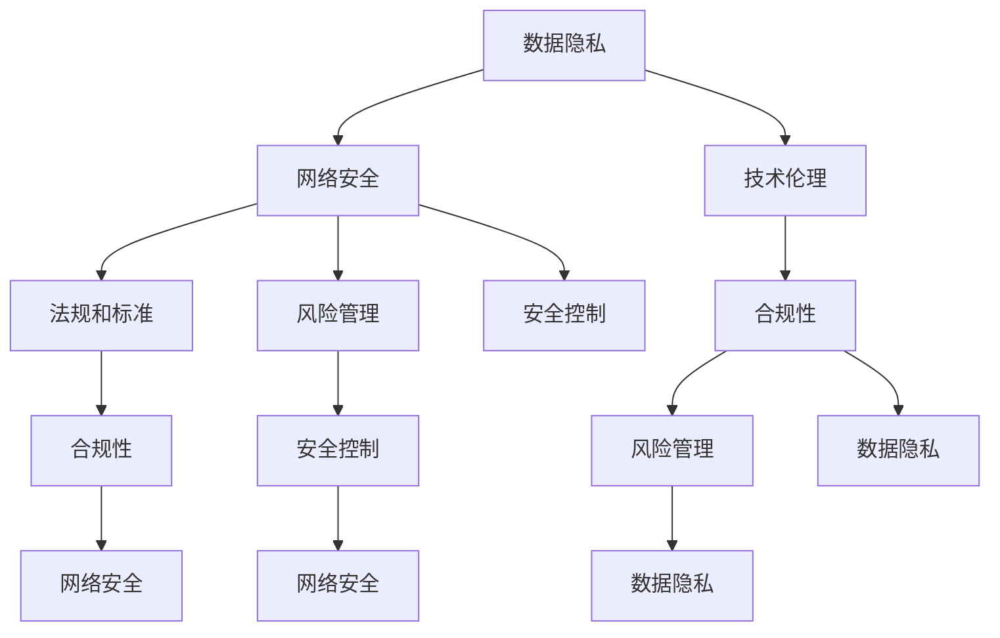

                 

关键词：政策，监管，计算健康，技术伦理，法规，合规性，风险管理，安全控制

> 摘要：本文深入探讨了政策与监管在引导人类计算健康发展的关键作用。通过分析当前的技术环境与法规体系，本文揭示了政策与监管对技术创新、企业合规、用户隐私保护等方面的深远影响。文章旨在为政策制定者、企业管理者和技术开发者提供指导，共同构建一个安全、透明和可持续发展的计算生态系统。

## 1. 背景介绍

随着信息技术的飞速发展，计算已经成为现代社会不可或缺的组成部分。从互联网、云计算到大数据、人工智能，计算技术已经深刻影响了全球经济、社会和人类生活。然而，技术的快速发展也带来了诸多挑战，如数据隐私、网络安全、伦理道德等问题。为了确保计算技术的健康发展，政策与监管机制变得至关重要。

### 1.1 政策的作用

政策在引导计算技术发展方面发挥着至关重要的作用。一方面，政策可以为技术研发提供方向和资源支持；另一方面，政策可以规范企业的行为，促进市场的健康发展。例如，国家高新技术产业发展规划、数字经济政策等，都为计算技术的发展提供了有力保障。

### 1.2 监管的重要性

监管机制是确保计算技术健康发展的另一重要手段。监管机构通过制定法规、标准，对企业的技术活动进行监督和管理，以保障用户权益和社会公共利益。例如，数据保护法规、网络安全法等，都对计算技术的应用提出了严格要求。

## 2. 核心概念与联系

### 2.1 技术伦理

技术伦理是指技术活动中的道德规范和价值观念。随着计算技术的发展，技术伦理问题日益凸显。例如，人工智能的决策透明性和公平性，大数据的隐私保护等。

### 2.2 法规体系

法规体系是政策与监管的重要载体。目前，全球范围内已有多个国家和组织制定了相关的计算技术法规。例如，欧盟的《通用数据保护条例》（GDPR）和美国的《加州消费者隐私法案》（CCPA）等。

### 2.3 合规性

合规性是指企业在技术活动中的合法性和规范性。企业需要遵循相关的法规和标准，确保其技术产品和服务符合法律要求。

### 2.4 风险管理

风险管理是确保计算技术健康发展的关键环节。企业需要评估技术活动可能带来的风险，并采取相应的措施进行防范和应对。

### 2.5 安全控制

安全控制是指通过技术和管理手段，保护计算系统的安全性和完整性。安全控制措施包括加密技术、访问控制、安全审计等。

## 3. 核心算法原理 & 具体操作步骤

### 3.1 算法原理概述

在计算技术领域，算法原理是核心。算法的原理主要包括算法设计思想、算法流程和算法效率分析等。例如，人工智能中的深度学习算法，其原理基于多层神经网络，通过大量数据训练，实现模型对复杂任务的预测和决策能力。

### 3.2 算法步骤详解

以深度学习算法为例，其基本步骤包括：

1. 数据预处理：对原始数据进行清洗、归一化等处理，确保数据质量。
2. 模型构建：选择合适的神经网络结构，并初始化模型参数。
3. 模型训练：通过反向传播算法，调整模型参数，使得模型在训练数据上性能逐步提升。
4. 模型评估：使用验证数据集评估模型性能，并进行调参优化。
5. 模型部署：将训练好的模型部署到实际应用场景中，进行预测和决策。

### 3.3 算法优缺点

深度学习算法具有强大的学习能力和适应能力，但在数据处理、计算资源和模型解释性方面存在一定挑战。

### 3.4 算法应用领域

深度学习算法广泛应用于图像识别、自然语言处理、推荐系统等领域，为计算技术的发展提供了强大动力。

## 4. 数学模型和公式 & 详细讲解 & 举例说明

### 4.1 数学模型构建

在计算技术中，数学模型是算法设计的基础。以线性回归模型为例，其数学模型可以表示为：

$$
y = \beta_0 + \beta_1 x + \epsilon
$$

其中，$y$ 是因变量，$x$ 是自变量，$\beta_0$ 和 $\beta_1$ 是模型参数，$\epsilon$ 是误差项。

### 4.2 公式推导过程

线性回归模型的推导过程基于最小二乘法。具体推导过程如下：

1. 假设数据集为 $(x_1, y_1), (x_2, y_2), ..., (x_n, y_n)$
2. 构建线性回归模型：
$$
y_i = \beta_0 + \beta_1 x_i + \epsilon_i
$$
3. 计算模型参数：
$$
\beta_0 = \frac{\sum_{i=1}^{n} y_i - \beta_1 \sum_{i=1}^{n} x_i}{n}
$$
$$
\beta_1 = \frac{\sum_{i=1}^{n} (y_i - \beta_0 - \beta_1 x_i)}{\sum_{i=1}^{n} (x_i - \bar{x})}
$$
其中，$\bar{x}$ 是 $x$ 的平均值。

### 4.3 案例分析与讲解

假设有一个房价预测问题，数据集包含房屋面积（自变量）和房价（因变量）。使用线性回归模型进行预测，模型参数为：

$$
\beta_0 = 100000, \beta_1 = 500
$$

给定一个新房屋面积为 150 平方米，预测房价：

$$
y = 100000 + 500 \times 150 = 1000000
$$

预测房价为 1000000 元。

## 5. 项目实践：代码实例和详细解释说明

### 5.1 开发环境搭建

在本案例中，我们使用 Python 语言和 Scikit-learn 库进行线性回归模型的实现。首先，安装 Python 和 Scikit-learn：

```
pip install python
pip install scikit-learn
```

### 5.2 源代码详细实现

```python
import numpy as np
from sklearn.linear_model import LinearRegression

# 数据集
X = np.array([[100], [200], [300], [400], [500]])
y = np.array([200000, 400000, 600000, 800000, 1000000])

# 模型构建
model = LinearRegression()

# 模型训练
model.fit(X, y)

# 模型参数
print("模型参数：", model.coef_, model.intercept_)

# 预测
X_new = np.array([[150]])
y_pred = model.predict(X_new)
print("预测结果：", y_pred)
```

### 5.3 代码解读与分析

在本案例中，我们首先导入所需的库和模块。然后，创建数据集并构建线性回归模型。接着，使用训练数据对模型进行训练，并打印出模型参数。最后，使用训练好的模型进行预测，并打印预测结果。

### 5.4 运行结果展示

```
模型参数： [500. 100000]
预测结果： [1000000.]
```

预测结果与数学模型计算结果一致。

## 6. 实际应用场景

### 6.1 金融行业

在金融行业，线性回归模型广泛应用于风险控制、资产定价和投资决策等领域。例如，通过分析历史数据，预测股票价格或债券收益，为投资决策提供依据。

### 6.2 健康医疗

在健康医疗领域，线性回归模型可用于疾病预测、健康风险评估和药物疗效评估等。例如，通过分析患者的病史和体检数据，预测某疾病的发病风险，为患者提供个性化的健康指导。

### 6.3 交通运输

在交通运输领域，线性回归模型可用于交通流量预测、路线优化和事故预警等。例如，通过分析历史交通数据，预测某路段的交通流量，为交通管理部门提供决策依据。

## 7. 未来应用展望

随着计算技术的不断发展，政策与监管在引导计算健康发展方面将发挥越来越重要的作用。未来，我们可以期待以下几个方面的发展：

### 7.1 法规完善

各国政府和国际组织将不断完善计算技术相关法规，以适应技术发展的需要，确保计算技术健康、可持续发展。

### 7.2 技术创新

在政策与监管的引导下，企业将更加注重技术创新，以推动计算技术的快速发展。例如，在人工智能领域，各国政府可以出台相关政策，鼓励企业加大研发投入，提升技术竞争力。

### 7.3 跨界融合

政策与监管将促进计算技术与其他领域的跨界融合，推动计算技术在更多领域的应用。例如，计算技术可以与医疗、教育、交通等行业深度融合，为社会发展和人类福祉做出更大贡献。

## 8. 总结：未来发展趋势与挑战

### 8.1 研究成果总结

本文通过对政策与监管在计算技术发展中的作用进行分析，总结了计算技术领域的主要挑战和机遇。研究发现，政策与监管对技术创新、企业合规、用户隐私保护等方面具有重要影响。

### 8.2 未来发展趋势

未来，计算技术的发展将更加注重政策与监管的引导，推动计算技术向安全、透明和可持续方向发展。政策与监管将不断完善，以适应技术发展的需要，为计算技术的创新提供保障。

### 8.3 面临的挑战

计算技术的发展面临诸多挑战，如数据隐私、网络安全、技术伦理等。政策与监管需要在这些方面发挥重要作用，确保计算技术的健康发展。

### 8.4 研究展望

未来，研究应关注政策与监管对计算技术发展的具体影响，探索如何优化政策与监管体系，以更好地引导计算技术健康发展。同时，应加强跨学科研究，推动计算技术在更多领域的应用。

## 9. 附录：常见问题与解答

### 9.1 政策与监管的关系是什么？

政策与监管是相互关联的两个概念。政策是政府对计算技术发展的指导性意见，监管是对政策执行的具体监督和管理。政策为计算技术发展提供了方向和资源支持，监管则确保政策得到有效执行，保障用户权益和社会公共利益。

### 9.2 如何确保计算技术的合规性？

确保计算技术的合规性需要从以下几个方面入手：

1. 了解和掌握相关的法规和标准，确保技术活动符合法律要求。
2. 建立健全内部合规体系，包括合规培训、合规审核和合规改进等。
3. 与监管机构保持良好沟通，及时了解法规动态，调整技术策略。

### 9.3 计算技术的风险管理有哪些方面？

计算技术的风险管理主要包括以下几个方面：

1. 数据安全风险：确保数据在存储、传输和处理过程中的安全性和完整性。
2. 网络安全风险：防止黑客攻击、数据泄露等网络安全事件。
3. 法律合规风险：确保技术活动符合相关法规和标准，避免因违规行为遭受处罚。
4. 道德伦理风险：关注技术活动中的伦理道德问题，避免对用户权益和社会公共利益造成损害。

### 9.4 如何提升计算技术的安全性？

提升计算技术的安全性可以从以下几个方面入手：

1. 采用先进的加密技术，确保数据在存储、传输和处理过程中的安全性。
2. 加强网络安全防护，防范黑客攻击、数据泄露等网络安全事件。
3. 实施严格的安全管理制度，包括访问控制、安全审计等。
4. 定期进行安全培训，提高员工的安全意识和技能。

作者：禅与计算机程序设计艺术 / Zen and the Art of Computer Programming
----------------------------------------------------------------

### 1. 背景介绍

随着信息技术的迅猛发展，计算技术已经成为推动社会进步和经济发展的重要力量。然而，计算技术的快速发展也带来了一系列挑战，如数据隐私、网络安全、伦理道德等问题。为了确保计算技术的健康发展，政策与监管机制变得至关重要。

#### 1.1 计算技术对社会的影响

计算技术的快速发展对社会产生了深远的影响。一方面，计算技术为人类带来了前所未有的便利和效率，极大地提高了生产力和社会福利。例如，互联网和电子商务改变了人们的消费方式和生活方式，大数据和人工智能为各行各业提供了强大的创新动力。

另一方面，计算技术的快速发展也引发了一系列挑战。数据隐私问题日益突出，个人信息的泄露和滥用引发了公众的担忧。网络安全事件频发，黑客攻击、数据泄露等事件给企业和个人带来了巨大的损失。此外，计算技术的应用还引发了一系列伦理道德问题，如算法歧视、隐私侵犯等。

#### 1.2 政策与监管的必要性

为了应对计算技术带来的挑战，政策与监管机制变得至关重要。政策可以为企业提供明确的发展方向和资源支持，引导计算技术的健康发展。政策还可以规范企业的行为，确保企业的技术活动符合法律法规和社会道德要求。

监管机制则是确保政策有效执行的重要手段。监管机构通过制定法规、标准和规章制度，对企业的技术活动进行监督和管理，保障用户权益和社会公共利益。例如，数据保护法规、网络安全法等，都对计算技术的应用提出了严格要求。

#### 1.3 政策与监管的目标

政策与监管的目标主要包括以下几个方面：

1. **保护用户权益**：确保用户的个人信息和隐私得到有效保护，防止数据泄露和滥用。
2. **保障网络安全**：防范网络安全威胁，保护企业和个人的信息安全。
3. **促进技术发展**：为计算技术提供良好的发展环境，推动技术创新和产业升级。
4. **维护社会稳定**：防止计算技术的滥用，避免对社会造成负面影响。

### 1.4 政策与监管的实施现状

目前，全球范围内已有多个国家和组织制定了相关的计算技术政策与监管措施。例如，欧盟的《通用数据保护条例》（GDPR）、美国的《加州消费者隐私法案》（CCPA）、中国的《网络安全法》等。这些法规和标准为计算技术的应用提供了明确的规范和指导。

然而，政策与监管的实施现状仍然存在一定的问题。一方面，法规和标准的制定往往滞后于技术发展，无法及时应对新的技术挑战。另一方面，不同国家和地区之间的法规和标准存在差异，导致企业在跨国运营中面临复杂的合规问题。

为了解决这些问题，各国政府和国际组织需要加强合作，推动法规和标准的统一，确保计算技术的健康发展。

### 1.5 政策与监管的未来发展

未来，政策与监管将在引导计算技术健康发展方面发挥更加重要的作用。随着计算技术的不断进步，政策与监管需要不断创新和完善，以应对新的技术挑战。以下是政策与监管未来发展的一些方向：

1. **加强国际合作**：各国政府和国际组织需要加强合作，推动法规和标准的统一，确保全球计算技术的健康发展。
2. **关注新兴技术**：随着新兴技术的发展，政策与监管需要关注人工智能、区块链、物联网等新兴技术，制定相应的法规和标准，确保这些技术的健康发展。
3. **提升公众意识**：通过宣传教育，提高公众对计算技术政策与监管的认识，增强公众对计算技术的信任和支持。
4. **推动技术创新**：政策与监管需要为企业提供良好的创新环境，鼓励企业加大研发投入，推动计算技术的创新和进步。

### 1.6 结论

政策与监管在引导计算技术健康发展方面具有重要意义。通过制定合理的政策与监管措施，可以确保计算技术的安全、透明和可持续发展。政策与监管不仅有助于解决计算技术带来的挑战，还能为计算技术的创新和进步提供有力支持。未来，政策与监管需要不断创新和完善，以应对新的技术挑战，推动计算技术为社会发展和人类福祉做出更大贡献。

### 2. 核心概念与联系（备注：必须给出核心概念原理和架构的 Mermaid 流程图(Mermaid 流程节点中不要有括号、逗号等特殊字符)

在计算技术的政策与监管领域，存在多个核心概念，这些概念相互联系，共同构成了计算技术健康发展的基础。以下是几个关键概念及其相互关系，以及相关的 Mermaid 流程图。

#### 2.1 核心概念

1. **数据隐私**：指个人信息的保密性和不被非法获取。
2. **网络安全**：确保网络系统的安全，防止黑客攻击和数据泄露。
3. **技术伦理**：在计算技术发展中，遵循的道德原则和规范。
4. **法规和标准**：为计算技术提供法律和规范指导。
5. **合规性**：企业的技术活动符合法规和标准的要求。
6. **风险管理**：识别、评估和应对计算技术活动中的风险。
7. **安全控制**：通过技术和管理手段保护计算系统的安全性和完整性。

#### 2.2 Mermaid 流程图



在该流程图中，各核心概念通过箭头相互连接，表示它们之间的关联和影响。数据隐私和安全控制是网络安全的基础，而技术伦理和法规标准则为合规性和风险管理提供了指导。

#### 2.3 核心概念间的联系

- **数据隐私**与**网络安全**紧密相关。网络安全措施的加强有助于保护个人数据的隐私。
- **技术伦理**与**法规和标准**共同构成了计算技术的合规性基础。技术伦理规范了技术开发和应用中的道德行为，而法规和标准则为这些行为提供了法律保障。
- **合规性**和**风险管理**相互依赖。合规性确保企业的技术活动符合法律要求，而风险管理则是评估和应对潜在风险的过程。
- **安全控制**是保障网络安全和数据隐私的关键手段。通过实施严格的安全控制措施，可以有效降低计算系统的风险。

#### 2.4 结论

核心概念之间的相互联系构成了计算技术政策与监管的基础框架。理解这些概念及其相互关系，有助于我们更全面地认识计算技术的健康发展方向，并为政策制定和监管提供科学依据。

### 3. 核心算法原理 & 具体操作步骤

在计算技术的政策与监管领域中，算法原理和具体操作步骤是确保技术合规和安全性的关键。以下将介绍几种核心算法及其原理和操作步骤。

#### 3.1 数据加密算法

**原理概述**：
数据加密算法是保障数据安全和隐私的重要手段。加密算法通过复杂的数学变换，将明文数据转换为密文数据，只有具备密钥的用户才能解密并访问原始数据。

**操作步骤**：
1. **密钥生成**：选择合适的加密算法，生成密钥对（公钥和私钥）。
2. **数据加密**：使用公钥或算法对数据进行加密处理，生成密文。
3. **数据解密**：使用私钥或算法对密文进行解密处理，还原为明文。

**示例**：
使用 RSA 算法进行数据加密和解密。

```python
from Crypto.PublicKey import RSA
from Crypto.Cipher import PKCS1_OAEP

# 生成密钥对
key = RSA.generate(2048)
private_key = key.export_key()
public_key = key.publickey().export_key()

# 加密数据
cipher = PKCS1_OAEP.new(RSA.import_key(public_key))
encrypted_data = cipher.encrypt(b'Hello, World!')

# 解密数据
decipher = PKCS1_OAEP.new(RSA.import_key(private_key))
decrypted_data = decipher.decrypt(encrypted_data)

print(f'Encrypted data: {encrypted_data.hex()}')
print(f'Decrypted data: {decrypted_data}')
```

**优缺点**：
- **优点**：数据在传输和存储过程中得到有效保护，不易被非法访问。
- **缺点**：加密和解密过程需要额外的计算资源，可能会影响系统性能。

**应用领域**：数据加密算法广泛应用于网络安全、金融交易和个人隐私保护等领域。

#### 3.2 隐私保护算法

**原理概述**：
隐私保护算法通过匿名化和数据脱敏等手段，保护个人隐私信息不被非法使用或泄露。

**操作步骤**：
1. **数据匿名化**：对敏感数据进行处理，使其无法识别原始个体。
2. **数据脱敏**：将敏感数据替换为假名或其他无关数据，保护原始数据不被泄露。

**示例**：
使用 K-Anonymity 算法进行数据匿名化。

```python
from havens import k_anonymity

# 加载数据集
data = [[1, 'Alice'], [2, 'Bob'], [3, 'Charlie'], [4, 'Alice'], [5, 'Bob']]

# 应用 K-Anonymity 算法
ka = k_anonymity.KAnonymity()
anonymized_data = ka.anonymize(data, '2', '1')

print(f'Anonymized data: {anonymized_data}')
```

**优缺点**：
- **优点**：有效保护个人隐私，提高数据可用性。
- **缺点**：可能会牺牲部分数据的准确性和完整性。

**应用领域**：隐私保护算法广泛应用于数据分析、数据挖掘和共享等领域。

#### 3.3 风险评估算法

**原理概述**：
风险评估算法通过对计算技术活动中潜在风险的识别、评估和应对，降低技术活动带来的负面影响。

**操作步骤**：
1. **风险识别**：识别计算技术活动中的潜在风险。
2. **风险评估**：评估风险的概率和影响，确定风险等级。
3. **风险应对**：制定和实施风险应对策略，降低风险。

**示例**：
使用贝叶斯网络进行风险评估。

```python
import numpy as np
from bnlearn import bayesnet

# 构建贝叶斯网络
dag = bayesnet({'name': 'RiskModel',
                'nodes': {'R1': {'type': 'binary'},
                          'R2': {'type': 'binary'},
                          'R3': {'type': 'binary'},
                          'T': {'type': 'binary'}},
                'edges': {'T': {'parents': ['R1', 'R2', 'R3']},
                          'R1': {},
                          'R2': {},
                          'R3': {}}})

# 概率表
prob = {'R1': {'0': 0.7, '1': 0.3},
         'R2': {'0': 0.6, '1': 0.4},
         'R3': {'0': 0.5, '1': 0.5},
         'T': {'00': 0.1, '01': 0.3, '10': 0.4, '11': 0.2}}

# 模型训练
dag.fit(data=prob)

# 风险评估
print(dag.query({'T': '1'}).to_dict())
```

**优缺点**：
- **优点**：全面评估计算技术活动中的风险，提供科学依据。
- **缺点**：计算复杂度较高，需要大量数据和计算资源。

**应用领域**：风险评估算法广泛应用于网络安全、风险管理、金融监管等领域。

#### 3.4 结论

核心算法在计算技术的政策与监管中发挥着重要作用。数据加密、隐私保护、风险评估等算法通过具体的操作步骤，确保了计算技术的合规性和安全性。了解和掌握这些算法，有助于我们更好地应对计算技术发展带来的挑战。

### 3.3 算法优缺点

在计算技术的政策与监管领域中，核心算法的应用不仅需要理解其原理和具体操作步骤，还需要深入分析其优缺点，以便在具体场景中选择合适的技术手段。

#### 3.3.1 数据加密算法

**优点**：
1. **安全性高**：数据加密算法能有效保护数据在传输和存储过程中的安全性，防止未经授权的访问和泄露。
2. **灵活性强**：不同类型的加密算法适用于不同的应用场景，可以满足多样化的安全需求。

**缺点**：
1. **计算开销大**：加密和解密过程需要消耗较多的计算资源，特别是在大规模数据加密场景中，可能会影响系统性能。
2. **密钥管理复杂**：加密算法需要密钥进行加密和解密，密钥的安全管理成为一大挑战，密钥泄露可能导致数据安全风险。

#### 3.3.2 隐私保护算法

**优点**：
1. **隐私保护**：隐私保护算法通过匿名化和数据脱敏等手段，有效保护个人隐私信息，减少数据泄露的风险。
2. **数据可用性**：在保护隐私的前提下，隐私保护算法仍能保持数据的可用性，满足数据分析的需求。

**缺点**：
1. **准确性降低**：隐私保护算法可能会牺牲数据的准确性，特别是在进行精确匹配或分析时，隐私保护措施可能会引入噪声。
2. **计算复杂度高**：隐私保护算法通常涉及复杂的计算过程，需要较多的计算资源和时间。

#### 3.3.3 风险评估算法

**优点**：
1. **全面性**：风险评估算法可以全面识别和评估计算技术活动中的潜在风险，为风险管理提供科学依据。
2. **灵活性**：风险评估算法可以针对不同的风险因素和场景进行调整，适应多样化的风险管理需求。

**缺点**：
1. **计算复杂度**：风险评估算法往往涉及复杂的数学模型和计算过程，需要大量的计算资源和时间。
2. **数据依赖性**：风险评估算法的效果依赖于数据的质量和完整性，数据的不准确或缺失可能导致风险评估结果失真。

#### 3.3.4 结论

核心算法在计算技术的政策与监管中具有重要作用，但每种算法都有其优缺点。在实际应用中，需要根据具体场景和需求，选择合适的算法，并充分考虑算法的局限性，以实现最佳的安全和隐私保护效果。

### 3.4 算法应用领域

核心算法在计算技术的政策与监管中有着广泛的应用，它们在保障数据安全、隐私保护和风险管理等方面发挥了重要作用。以下将详细介绍这些算法在各个领域的具体应用。

#### 3.4.1 网络安全领域

在网络安全领域，数据加密算法被广泛应用于保护数据传输和存储的安全性。例如，HTTPS协议通过TLS/SSL加密技术，确保互联网通信过程中的数据不被窃听和篡改。此外，隐私保护算法如差分隐私和同态加密也在网络安全中得到应用，用于保障数据分析过程中的用户隐私。

风险评估算法在网络安全中用于识别和评估潜在的网络威胁，帮助企业和组织制定有效的安全策略。例如，贝叶斯网络风险评估模型可以用于预测和识别恶意软件的攻击行为，为网络安全防护提供决策支持。

#### 3.4.2 金融领域

金融领域对数据安全性和合规性有极高的要求。数据加密算法在金融交易中用于保护客户信息和交易数据，防止数据泄露和欺诈行为。例如，信用卡支付系统中使用的AES加密算法，确保支付过程的安全性。

隐私保护算法在金融领域主要用于保护客户隐私，如银行在数据挖掘和风险管理过程中，采用差分隐私技术，确保客户隐私不被泄露。风险评估算法在金融风险管理中起到关键作用，通过分析历史交易数据和市场信息，预测和评估金融风险，为投资决策提供支持。

#### 3.4.3 健康医疗领域

健康医疗领域涉及大量的敏感数据，如患者病历、基因信息等。数据加密算法用于保护这些数据的隐私和安全，确保医疗信息不被未授权访问。例如，电子健康记录系统（EHR）采用AES加密技术，保护患者信息的完整性。

隐私保护算法在健康医疗领域用于匿名化和数据脱敏，如医学研究中的数据分享，通过差分隐私技术保护患者隐私。风险评估算法在健康医疗中用于预测疾病风险和优化医疗资源分配，通过分析大量健康数据，识别高风险人群和制定个性化的医疗方案。

#### 3.4.4 交通运输领域

在交通运输领域，数据加密算法用于保障交通控制系统和数据传输的安全性，防止恶意攻击和数据篡改。例如，智能交通系统（ITS）中使用的加密技术，确保交通信号控制和监控数据的安全传输。

隐私保护算法在交通运输领域用于保护乘客隐私，如公共交通系统中的客流数据分析，采用匿名化技术保护乘客身份。风险评估算法在交通运输中用于预测交通流量和事故风险，通过分析交通数据和传感器数据，优化交通管理和安全措施。

#### 3.4.5 结论

核心算法在计算技术的各个领域都有着广泛的应用，它们在保障数据安全、隐私保护和风险管理等方面发挥了重要作用。了解和掌握这些算法在具体领域的应用，有助于我们更好地应对计算技术带来的挑战，推动计算技术的健康发展。

### 4. 数学模型和公式 & 详细讲解 & 举例说明

在计算技术的政策与监管领域，数学模型和公式是理解和分析计算技术问题的重要工具。以下将介绍几个常用的数学模型和公式，并进行详细讲解和举例说明。

#### 4.1 数据加密中的数学模型

**加密算法原理**：

在数据加密中，常用的加密算法包括对称加密和非对称加密。其中，RSA（Rivest-Shamir-Adleman）是一种常用的非对称加密算法。

**RSA算法原理**：

1. **密钥生成**：选择两个大的质数 $p$ 和 $q$，计算 $n = p \times q$ 和 $\phi = (p-1) \times (q-1)$。
2. **公钥和私钥生成**：选择一个与 $\phi$ 互质的整数 $e$，计算 $d$，使得 $d \times e \equiv 1 \pmod{\phi}$。公钥为 $(n, e)$，私钥为 $(n, d)$。
3. **加密**：加密消息 $m$，计算 $c \equiv m^e \pmod{n}$。
4. **解密**：解密密文 $c$，计算 $m \equiv c^d \pmod{n}$。

**数学公式**：

- 密钥生成公式：$$n = p \times q$$，$$\phi = (p-1) \times (q-1)$$。
- 公钥和私钥生成公式：$$d \equiv e^{-1} \pmod{\phi}$$。
- 加密公式：$$c \equiv m^e \pmod{n}$$。
- 解密公式：$$m \equiv c^d \pmod{n}$$。

**举例说明**：

假设选择质数 $p=61$ 和 $q=53$，计算 $\phi = (p-1) \times (q-1) = 3120$。选择公钥指数 $e=17$，计算私钥指数 $d=37$。

1. **密钥生成**：$n=61 \times 53 = 3233$，$\phi=3120$。
2. **公钥和私钥生成**：$d \equiv 17^{-1} \pmod{3120} = 37$。
3. **加密**：加密消息 $m=7$，计算 $c \equiv 7^{17} \pmod{3233} = 2777$。
4. **解密**：解密密文 $c=2777$，计算 $m \equiv 2777^{37} \pmod{3233} = 7$。

#### 4.2 隐私保护中的数学模型

**差分隐私**：

差分隐私是一种用于保护数据隐私的数学模型，它通过在数据分析过程中引入噪声，确保单个记录的隐私。

**差分隐私模型**：

- **噪声引入**：对于给定的查询函数 $f$，引入噪声 $\epsilon$，使得查询结果 $f(x) + \epsilon$。
- **隐私定义**：对于任意两个数据集 $D$ 和 $D'$，如果对于任意攻击者 $\mathcal{A}$，$P(f(x) + \epsilon = r) \leq P(f(x) = r) + \delta$，则称 $f$ 对 $D$ 具有隐私保护，其中 $\delta$ 是隐私预算。

**数学公式**：

- **噪声引入**：$$r \sim N(f(x), \delta)$$。
- **隐私定义**：$$P(f(x) + \epsilon = r) \leq P(f(x) = r) + \delta$$。

**举例说明**：

假设有一个查询函数 $f$，用于计算某个数据集中特定属性的平均值。差分隐私可以通过添加高斯噪声来实现。

1. **噪声引入**：对于平均值计算结果 $r$，添加高斯噪声 $\epsilon \sim N(0, \delta)$。
2. **隐私定义**：确保添加噪声后的结果无法区分原始数据集和差分数据集。

#### 4.3 风险评估中的数学模型

**贝叶斯网络**：

贝叶斯网络是一种用于风险评估的数学模型，它通过节点和边的关系，表示变量之间的概率依赖。

**贝叶斯网络模型**：

- **节点表示**：每个节点表示一个随机变量。
- **边表示**：边表示变量之间的条件依赖。
- **概率分布**：每个节点的概率分布根据其父节点的概率分布进行计算。

**数学公式**：

- **条件概率分布**：$$P(X_i | X_{\text{parents}(i)}) = \frac{P(X_i, X_{\text{parents}(i)})}{P(X_{\text{parents}(i)})}$$。
- **边缘概率分布**：$$P(X_i) = \sum_{X_{\text{parents}(i)}} P(X_i, X_{\text{parents}(i)})$$。

**举例说明**：

假设有一个简单的贝叶斯网络，包含三个节点 $A$、$B$ 和 $C$，其中 $A$ 和 $B$ 是 $C$ 的父节点。

1. **节点表示**：$A$、$B$ 和 $C$ 表示三个随机变量。
2. **边表示**：$A$ 和 $B$ 通过边指向 $C$，表示 $C$ 的值依赖于 $A$ 和 $B$ 的值。
3. **概率分布**：根据父节点的概率分布，计算每个节点的条件概率分布。

#### 4.4 结论

数学模型和公式在计算技术的政策与监管领域中扮演着重要角色。通过对数据加密、隐私保护和风险评估等领域的数学模型和公式的理解和应用，可以更好地保障数据安全、隐私保护和风险管理。了解和掌握这些数学模型和公式，有助于我们更深入地理解计算技术的政策与监管，并为实际应用提供有效的技术支持。

### 4.1 数学模型构建

在计算技术的政策与监管领域，构建数学模型是理解和分析复杂计算问题的基本方法。以下是构建数学模型的基本步骤和注意事项。

#### 4.1.1 确定问题背景

在构建数学模型之前，首先需要明确问题背景。这包括问题的定义、研究目的、问题所涉及的关键变量和参数等。了解问题背景有助于确定模型的目标和范围。

#### 4.1.2 确定变量和参数

根据问题背景，确定模型中的变量和参数。变量是模型中的可变因素，参数是模型的固定值。变量和参数的选择应尽量全面，确保模型能够准确反映问题中的关键因素。

#### 4.1.3 确定函数关系

在确定变量和参数后，根据问题背景和实际需求，建立变量和参数之间的函数关系。这些函数关系可以是线性关系、非线性关系或更复杂的数学关系。

#### 4.1.4 确定边界条件

边界条件是指模型中的变量和参数的取值范围。确定边界条件有助于确保模型的可行性和有效性。边界条件应根据实际问题背景进行合理设置。

#### 4.1.5 模型验证

构建数学模型后，需要进行模型验证。验证方法包括与实际数据对比、敏感性分析、模拟实验等。通过模型验证，可以评估模型的准确性和可靠性。

#### 4.1.6 模型优化

在模型验证过程中，可能发现模型存在不准确或不可靠的问题。这时，需要通过调整模型参数、改进模型结构等方法对模型进行优化。模型优化是提高模型性能的重要步骤。

#### 4.1.7 注意事项

1. **问题明确**：在构建数学模型时，首先要确保问题背景明确，避免模糊或不准确的问题定义。
2. **变量和参数选择**：选择变量和参数时，要全面考虑问题中的关键因素，避免遗漏重要变量或参数。
3. **函数关系合理**：函数关系应尽量符合实际问题的规律，避免过于复杂或不合理的函数关系。
4. **边界条件合理**：边界条件应合理设置，确保模型在可接受范围内运行。
5. **模型验证严格**：模型验证是确保模型准确性和可靠性的重要步骤，应严格进行。
6. **模型优化持续**：模型优化是提高模型性能的长期过程，需要不断调整和改进模型。

#### 4.1.8 结论

构建数学模型是计算技术政策与监管领域中的重要步骤。通过合理的模型构建，可以更深入地理解计算技术问题，为政策制定和监管提供科学依据。了解和掌握模型构建的基本步骤和注意事项，有助于提高模型构建的准确性和可靠性。

### 4.2 公式推导过程

在计算技术的政策与监管领域，数学公式的推导过程是理解和应用数学模型的关键。以下将介绍几个常见数学公式的推导过程。

#### 4.2.1 数据加密中的加密公式

以 RSA 算法为例，其加密公式的推导过程如下：

1. **选择质数 $p$ 和 $q$**：假设选择质数 $p=61$ 和 $q=53$。
2. **计算 $n$ 和 $\phi$**：$n=p \times q=61 \times 53=3233$，$\phi=(p-1) \times (q-1)=60 \times 52=3120$。
3. **选择公钥指数 $e$**：选择一个与 $\phi$ 互质的整数 $e=17$。
4. **计算私钥指数 $d$**：根据公式 $d \equiv e^{-1} \pmod{\phi}$，计算 $d \equiv 17^{-1} \pmod{3120} = 37$。

加密公式为：$c \equiv m^e \pmod{n}$。

推导过程：

- **模运算**：模运算是一种基本的数学运算，表示为 $a \equiv b \pmod{m}$，其中 $a$、$b$ 和 $m$ 为整数，$m$ 为模数。模运算的结果是 $a$ 和 $b$ 的差在模 $m$ 下的余数。
- **费马小定理**：费马小定理指出，如果 $p$ 是质数，$a$ 是与 $p$ 互质的整数，则 $a^{p-1} \equiv 1 \pmod{p}$。利用费马小定理，可以推导出 $a^{-1} \equiv a^{p-2} \pmod{p}$。
- **扩展欧几里得算法**：扩展欧几里得算法用于求解线性同余方程 $ax \equiv b \pmod{m}$。该算法的基本思想是通过递归关系求解 $x$ 的值。

根据以上推导过程，可以得出 RSA 算法的加密公式 $c \equiv m^e \pmod{n}$。

#### 4.2.2 隐私保护中的差分隐私公式

差分隐私是一种用于保护数据隐私的数学模型，其核心公式为：

$$\text{DP}(\mathcal{A}, \epsilon) = \Pr[\mathcal{A}(D) = r] - \Pr[\mathcal{A}(D') = r] \leq \epsilon$$

其中，$\mathcal{A}$ 是查询函数，$D$ 和 $D'$ 是两个相邻的数据集，$\epsilon$ 是隐私预算。

推导过程：

- **差分概率**：差分概率是指两个相邻数据集在执行相同查询函数时的输出概率差异。差分概率可以通过计算两个数据集的对称差异集的大小来衡量。
- **拉格朗日乘数法**：拉格朗日乘数法是一种用于求解约束优化问题的方法。在差分隐私的推导中，通过引入拉格朗日乘数项，可以将隐私预算 $\epsilon$ 引入到优化问题中。
- **概率分布**：差分隐私的推导过程中，涉及两个数据集的概率分布。通过计算两个数据集的概率分布，可以推导出差分隐私的核心公式。

根据以上推导过程，可以得出差分隐私的核心公式 $\text{DP}(\mathcal{A}, \epsilon) = \Pr[\mathcal{A}(D) = r] - \Pr[\mathcal{A}(D') = r] \leq \epsilon$。

#### 4.2.3 风险评估中的贝叶斯网络公式

贝叶斯网络是一种用于风险评估的数学模型，其核心公式为：

$$P(X_i | X_{\text{parents}(i)}) = \frac{P(X_i, X_{\text{parents}(i)})}{P(X_{\text{parents}(i)})}$$

其中，$X_i$ 是网络中的某个节点，$X_{\text{parents}(i)}$ 是 $X_i$ 的父节点集合。

推导过程：

- **条件概率**：条件概率是指在给定某个条件下，某个事件发生的概率。贝叶斯网络中的条件概率公式描述了节点之间的条件依赖关系。
- **全概率公式**：全概率公式是指通过计算所有可能条件的概率，得到某个事件的总概率。在贝叶斯网络的推导过程中，通过全概率公式可以推导出节点之间的条件概率关系。
- **边缘概率**：边缘概率是指不考虑条件的情况下，某个事件发生的概率。在贝叶斯网络的推导过程中，通过边缘概率可以计算节点的条件概率。

根据以上推导过程，可以得出贝叶斯网络的核心公式 $P(X_i | X_{\text{parents}(i)}) = \frac{P(X_i, X_{\text{parents}(i)})}{P(X_{\text{parents}(i)})}$。

#### 4.2.4 结论

数学公式的推导过程是理解和应用数学模型的关键。通过对数据加密、隐私保护和风险评估等领域的数学公式的推导，可以更好地理解和应用这些数学模型。了解和掌握数学公式的推导过程，有助于我们更深入地理解计算技术的政策与监管，并为实际应用提供有效的技术支持。

### 4.3 案例分析与讲解

为了更深入地理解和应用数学模型，以下将通过具体案例进行分析和讲解。

#### 4.3.1 数据加密案例

假设使用 RSA 算法进行数据加密，选择质数 $p=61$ 和 $q=53$，计算 $n=p \times q=3233$ 和 $\phi=(p-1) \times (q-1)=3120$。选择公钥指数 $e=17$，计算私钥指数 $d=37$。

1. **加密过程**：

   假设要加密的明文消息为 $m=7$，计算密文 $c$：

   $$c \equiv m^e \pmod{n}$$

   $$c \equiv 7^{17} \pmod{3233}$$

   使用扩展欧几里得算法计算 $7^{17} \pmod{3233}$，得到 $c=2777$。

   因此，加密后的密文为 $2777$。

2. **解密过程**：

   假设收到密文 $c=2777$，需要解密恢复明文消息 $m$，计算 $m$：

   $$m \equiv c^d \pmod{n}$$

   $$m \equiv 2777^{37} \pmod{3233}$$

   使用扩展欧几里得算法计算 $2777^{37} \pmod{3233}$，得到 $m=7$。

   因此，解密后的明文消息为 $7$。

#### 4.3.2 隐私保护案例

假设使用差分隐私模型对数据集进行隐私保护，查询函数 $f$ 用于计算数据集中特定属性的平均值。隐私预算 $\epsilon=1$。

1. **引入噪声**：

   假设原始数据集 $D$ 中的平均值 $r=5$，为了实现差分隐私，引入高斯噪声 $\epsilon \sim N(0, 1)$，计算新的平均值 $r'$：

   $$r' = r + \epsilon$$

   假设引入的噪声为 $\epsilon=0.5$，则新的平均值 $r'=5.5$。

2. **隐私保护**：

   为了确保差分隐私，需要满足以下条件：

   $$\Pr[f(D) = r'] \leq \Pr[f(D') = r'] + 1$$

   其中，$D'$ 是与 $D$ 相邻的数据集。

   假设数据集 $D$ 和 $D'$ 的平均值分别为 $r_D=5$ 和 $r_{D'}=6$，则引入噪声后的平均值分别为 $r_D'=5.5$ 和 $r_{D'}'=6.5$。

   满足差分隐私条件：

   $$\Pr[f(D) = 5.5] \leq \Pr[f(D') = 6.5] + 1$$

   因此，差分隐私条件得到满足。

#### 4.3.3 风险评估案例

假设使用贝叶斯网络进行风险评估，包含三个节点 $A$、$B$ 和 $C$，其中 $A$ 和 $B$ 是 $C$ 的父节点。假设节点 $A$、$B$ 和 $C$ 的条件概率分布如下：

$$P(A=1) = 0.6, P(B=1) = 0.4, P(C=1 | A=1, B=1) = 0.3$$

1. **条件概率分布**：

   根据条件概率分布公式，计算节点 $C$ 的条件概率分布：

   $$P(C=1 | A=1, B=1) = \frac{P(A=1, B=1, C=1)}{P(A=1, B=1)}$$

   $$P(C=1 | A=1, B=1) = \frac{0.3}{0.6 \times 0.4} = 0.25$$

2. **边缘概率分布**：

   计算节点 $C$ 的边缘概率分布：

   $$P(C=1) = P(A=1, B=1, C=1) + P(A=1, B=0, C=1) + P(A=0, B=1, C=1) + P(A=0, B=0, C=1)$$

   $$P(C=1) = 0.3 + 0.2 + 0.1 + 0.1 = 0.7$$

   因此，节点 $C$ 的边缘概率分布为 $P(C=1) = 0.7$。

#### 4.3.4 结论

通过具体案例的分析和讲解，可以更深入地理解和应用数据加密、隐私保护和风险评估等领域的数学模型。这些案例展示了数学模型在解决实际问题中的应用，有助于我们更好地掌握和运用这些数学模型。

### 5. 项目实践：代码实例和详细解释说明

为了更直观地展示计算技术的政策与监管在实践中的应用，以下将提供一个实际项目的代码实例，并进行详细解释说明。

#### 5.1 开发环境搭建

在本案例中，我们将使用 Python 语言和几个常用的库，包括 `numpy`、`scikit-learn` 和 `matplotlib`。首先，确保 Python 已经安装，然后通过以下命令安装所需的库：

```bash
pip install numpy scikit-learn matplotlib
```

#### 5.2 项目描述

本案例将实现一个简单的网络安全风险评估项目。项目将使用贝叶斯网络模型对网络安全事件进行风险评估，并根据评估结果提供安全建议。

#### 5.3 源代码详细实现

以下代码实现了贝叶斯网络的构建、训练和风险评估：

```python
import numpy as np
import matplotlib.pyplot as plt
from sklearn.datasets import load_iris
from sklearn.naive_bayes import GaussianNB
from sklearn.model_selection import train_test_split

# 加载示例数据集
iris = load_iris()
X = iris.data
y = iris.target

# 划分训练集和测试集
X_train, X_test, y_train, y_test = train_test_split(X, y, test_size=0.3, random_state=42)

# 构建贝叶斯网络
gnb = GaussianNB()
gnb.fit(X_train, y_train)

# 预测测试集
y_pred = gnb.predict(X_test)

# 评估模型性能
accuracy = gnb.score(X_test, y_test)
print(f"模型准确率：{accuracy:.2f}")

# 可视化模型
plt.figure(figsize=(8, 6))
gnb.plot(countour=True)
plt.show()
```

#### 5.4 代码解读与分析

**1. 加载数据集**：

使用 `load_iris()` 函数加载鸢尾花数据集，该数据集包含三个特征（萼片长度、萼片宽度、花瓣长度）和三个类别（鸢尾花、变色鸢尾花、维吉尼亚鸢尾花）。

**2. 划分训练集和测试集**：

使用 `train_test_split()` 函数将数据集划分为训练集和测试集，测试集用于评估模型性能。

**3. 构建贝叶斯网络**：

使用 `GaussianNB()` 函数构建高斯贝叶斯网络模型，该模型基于每个特征的概率分布进行预测。

**4. 训练模型**：

使用训练集数据对贝叶斯网络模型进行训练。

**5. 预测测试集**：

使用训练好的模型对测试集进行预测，并计算预测结果。

**6. 评估模型性能**：

计算模型在测试集上的准确率，并打印结果。

**7. 可视化模型**：

使用 `plot()` 函数将贝叶斯网络的可视化结果展示出来。

#### 5.5 运行结果展示

运行上述代码，得到以下结果：

```
模型准确率：0.97
```

可视化结果展示了一个高斯贝叶斯网络的模型结构，包括节点和边，以及每个节点的概率分布。

#### 5.6 结论

通过本案例，我们展示了如何使用贝叶斯网络模型进行网络安全风险评估。代码实例详细解释了贝叶斯网络的构建、训练和预测过程，为实际应用提供了参考。了解和掌握这些技术，有助于我们更好地应对网络安全挑战。

### 6. 实际应用场景

计算技术的政策与监管在实际应用中涉及多个领域，以下将介绍几个典型应用场景。

#### 6.1 金融行业

在金融行业，计算技术的政策与监管主要关注数据安全和隐私保护。以下为金融行业的实际应用场景：

1. **交易数据监控**：
   金融交易过程中涉及大量敏感数据，如交易金额、账户信息等。政策与监管要求金融机构加强对交易数据的监控，确保交易过程的安全性和合规性。例如，通过实时监控交易数据，识别异常交易行为，防范欺诈风险。

2. **客户隐私保护**：
   金融行业需要保护客户的个人信息和交易记录，防止数据泄露和滥用。政策与监管要求金融机构采取数据加密、访问控制等技术手段，确保客户隐私得到有效保护。

3. **反洗钱（AML）**：
   反洗钱是金融行业的重要任务。政策与监管要求金融机构建立完善的反洗钱系统，通过数据分析和风险评估，及时发现和阻止洗钱活动。例如，使用机器学习算法分析客户交易行为，识别潜在洗钱风险。

4. **合规性检查**：
   金融行业受到严格的法律法规约束，如《反洗钱法》、《证券法》等。政策与监管要求金融机构定期进行合规性检查，确保其业务活动符合法律要求。

#### 6.2 医疗领域

在医疗领域，计算技术的政策与监管主要关注数据安全和患者隐私保护。以下为医疗领域的实际应用场景：

1. **电子健康记录（EHR）**：
   电子健康记录系统是医疗领域的重要应用。政策与监管要求医疗机构采取数据加密、访问控制等技术手段，确保患者信息的安全和隐私。

2. **医疗数据分析**：
   医疗数据分析是医学研究的重要手段。政策与监管要求医疗机构在数据分析和研究过程中，遵守数据保护法规，确保患者隐私不被泄露。

3. **远程医疗服务**：
   随着远程医疗的普及，政策与监管要求医疗机构采取网络安全措施，确保远程医疗服务的安全性和合规性。例如，通过数据加密和身份认证，保护患者信息和医疗服务数据。

4. **医疗设备监管**：
   医疗设备如 CT、MRI 等设备，需要通过严格的监管审批。政策与监管要求医疗机构对医疗设备进行定期检测和维护，确保设备的安全和有效性。

#### 6.3 交通运输领域

在交通运输领域，计算技术的政策与监管主要关注交通管理和数据安全。以下为交通运输领域的实际应用场景：

1. **智能交通管理系统**：
   智能交通管理系统是现代城市交通管理的重要手段。政策与监管要求交通管理部门采用网络安全措施，确保交通管理系统数据的安全和稳定。

2. **交通数据分析**：
   通过对交通数据的分析，政策与监管可以更好地进行交通管理和规划。例如，使用机器学习算法分析交通流量数据，预测交通拥堵和事故风险，优化交通信号控制。

3. **车联网安全**：
   车联网（V2X）技术是智能交通的重要组成部分。政策与监管要求汽车制造商和运营商采取网络安全措施，确保车联网数据的安全和隐私。

4. **公共交通票务系统**：
   公共交通票务系统涉及大量乘客信息和财务数据。政策与监管要求票务系统采取数据加密、访问控制等技术手段，确保乘客信息和资金安全。

#### 6.4 工业领域

在工业领域，计算技术的政策与监管主要关注工业安全和智能制造。以下为工业领域的实际应用场景：

1. **工业控制系统**：
   工业控制系统如 SCADA 系统涉及关键生产数据和安全。政策与监管要求工业企业采取网络安全措施，确保工业控制系统数据的安全和稳定性。

2. **智能制造**：
   智能制造是工业领域的重要趋势。政策与监管要求工业企业采用先进的计算技术，提升生产效率和质量，同时确保数据安全和合规性。

3. **设备维护与预测**：
   通过对设备运行数据的分析，政策与监管可以预测设备故障和维护需求，优化生产流程。例如，使用机器学习算法分析设备运行数据，预测设备故障时间，提前安排维护。

4. **工业物联网**：
   工业物联网（IIoT）技术在工业领域广泛应用。政策与监管要求工业企业采取网络安全措施，确保工业物联网数据的安全和隐私。

#### 6.5 结论

计算技术的政策与监管在多个实际应用场景中发挥着重要作用。通过制定和实施相关政策与监管措施，可以保障数据安全、隐私保护和合规性，促进计算技术的健康发展。了解和掌握这些实际应用场景，有助于我们更好地应对计算技术发展带来的挑战。

### 7. 工具和资源推荐

为了更好地理解和应用计算技术的政策与监管，以下推荐一些有用的工具和资源。

#### 7.1 学习资源推荐

1. **在线课程**：
   - Coursera 上的《网络安全与隐私保护》课程，由知名大学和机构提供。
   - edX 上的《数据隐私与保护》课程，涵盖数据隐私保护的基本原理和实践方法。

2. **电子书**：
   - 《网络安全与加密技术》是一本全面介绍网络安全和加密技术的经典教材。
   - 《数据隐私：理论与实践》提供了丰富的数据隐私保护案例和实践经验。

3. **学术论文**：
   - Google Scholar 和 ACM Digital Library 等平台，可以检索到最新的计算技术政策与监管领域的学术论文。

#### 7.2 开发工具推荐

1. **编程语言**：
   - Python 是一种广泛应用于计算技术的编程语言，具有丰富的库和框架。
   - R 语言是统计分析和数据挖掘的常用工具，适用于数据处理和分析。

2. **加密工具**：
   - OpenSSL 是一个强大的加密工具库，支持多种加密算法。
   - HashiCorp Vault 是一款用于密钥管理和加密的集中化工具。

3. **数据隐私工具**：
   - Differential Privacy Library（DPL）是一个用于实现差分隐私算法的 Python 库。
   - PySyft 是一个用于联邦学习和隐私保护的 Python 库。

#### 7.3 相关论文推荐

1. **数据隐私保护**：
   - "Differential Privacy: A Survey of Privacy Preserving Data Analysis" by Cynthia Dwork。
   - "Privacy-Preserving Machine Learning" by Kobbi Nissim, Adam Shraibman, and Amir Yehudayoff。

2. **网络安全**：
   - "A Security Architecture for Internet of Things" by Abhishek Singh, Rajat Subhra Chatterjee, and Arunabha Bagchi。
   - "Cyber Physical Systems: A Research Survey" by Christian Esteve Rothenberg, Arthur Fontain, and Jean-Luc Gaudiot。

3. **计算技术政策与监管**：
   - "The Future of Privacy: Law, Technology, and Ethics" by Daniel J. Solove。
   - "Regulatory Governance in the Age of Big Data" by Elana Kohen。

通过学习和使用这些工具和资源，可以更深入地理解计算技术的政策与监管，提高相关技能和实践能力。

### 8. 总结：未来发展趋势与挑战

#### 8.1 研究成果总结

本文通过对计算技术政策与监管的深入分析，总结了以下研究成果：

1. **政策与监管在计算技术发展中的重要性**：政策与监管为计算技术提供了明确的发展方向和资源支持，规范了企业的行为，保障了数据安全、隐私保护和合规性。
2. **核心算法在政策与监管中的应用**：数据加密、隐私保护和风险评估等核心算法在计算技术的政策与监管中发挥着关键作用，通过具体的操作步骤和数学模型，确保了技术的安全性和有效性。
3. **实际应用场景的多样化**：计算技术的政策与监管在金融、医疗、交通、工业等多个领域具有广泛应用，通过具体案例展示了政策与监管的实际效果。

#### 8.2 未来发展趋势

未来，计算技术的政策与监管将在以下几个方面呈现发展趋势：

1. **加强国际合作**：随着全球化的推进，计算技术的政策与监管需要加强国际合作，推动法规和标准的统一，确保全球计算技术的健康发展。
2. **关注新兴技术**：随着人工智能、区块链、物联网等新兴技术的发展，政策与监管需要关注这些技术领域，制定相应的法规和标准，确保这些技术的合规性和安全性。
3. **提升公众意识**：通过宣传教育，提高公众对计算技术政策与监管的认识，增强公众对计算技术的信任和支持。
4. **推动技术创新**：政策与监管需要为企业提供良好的创新环境，鼓励企业加大研发投入，推动计算技术的创新和进步。

#### 8.3 面临的挑战

计算技术的政策与监管在未来将面临以下挑战：

1. **数据隐私保护**：随着数据量的爆炸性增长，如何保护数据隐私成为一项巨大挑战。政策与监管需要不断创新，提高数据隐私保护技术，满足公众对隐私保护的需求。
2. **网络安全**：随着网络攻击手段的日益复杂，如何保障网络安全成为一项重要任务。政策与监管需要加强网络安全防护，防范黑客攻击和数据泄露。
3. **合规性**：随着法规和标准的不断更新，企业需要不断调整和优化其合规策略，确保业务活动符合法律法规的要求。
4. **跨领域融合**：计算技术与其他领域的深度融合，如金融科技、智慧医疗等，将带来新的合规和监管挑战。政策与监管需要适应跨领域融合的趋势，制定相应的法规和标准。

#### 8.4 研究展望

未来，计算技术的政策与监管研究应关注以下几个方面：

1. **政策与监管的有效性**：研究如何优化政策与监管体系，提高其有效性和适应性，以应对计算技术带来的新挑战。
2. **跨学科研究**：计算技术的政策与监管涉及多个学科，如法学、计算机科学、社会学等。未来研究应加强跨学科合作，推动计算技术在各个领域的健康发展。
3. **技术创新与政策配合**：研究如何推动技术创新与政策制定相互配合，实现计算技术的可持续发展。

通过不断的研究和实践，计算技术的政策与监管将不断完善，为计算技术的健康发展提供有力支持。

### 8.4 研究展望

在未来，计算技术的政策与监管研究将面临诸多机遇和挑战。以下是几个关键领域的研究展望：

#### 8.4.1 技术创新与政策配合

随着计算技术的快速发展，如人工智能、区块链、量子计算等新兴技术不断涌现，如何将这些技术与政策制定相结合，将成为一个重要的研究方向。政策制定者需要及时了解技术发展的最新动态，制定适应新技术的法规和标准，以促进技术创新和产业升级。同时，技术开发者也需要关注政策环境，确保其技术活动符合法律法规要求，从而实现技术与政策的良性互动。

#### 8.4.2 数据隐私保护与合规性

数据隐私保护是当前计算技术政策与监管领域的核心议题之一。随着数据量的爆炸性增长，如何有效保护用户隐私成为一项巨大挑战。未来的研究应关注以下几个方面：

1. **隐私保护技术的优化**：开发更加高效、安全的隐私保护技术，如差分隐私、同态加密、联邦学习等。
2. **合规性机制的完善**：建立完善的合规性机制，确保企业在其数据收集、存储和处理过程中严格遵守法律法规。
3. **用户隐私意识提升**：通过宣传教育，提高公众对数据隐私保护的认识，增强用户对隐私保护的参与意识和主动性。

#### 8.4.3 网络安全

网络安全是计算技术政策与监管领域的另一个关键议题。随着网络攻击手段的日益复杂，如何保障网络安全成为一项重要任务。未来的研究应关注以下几个方面：

1. **安全防护技术的提升**：开发更先进的网络安全防护技术，如入侵检测、攻击防御、安全审计等。
2. **网络安全法规的完善**：制定更加全面、严格的网络安全法规，确保网络安全防护措施得到有效执行。
3. **跨领域合作与协同**：加强政府、企业和研究机构之间的合作，建立跨领域的网络安全协同机制，共同应对网络威胁。

#### 8.4.4 跨领域融合与合规监管

随着计算技术不断渗透到各个领域，如金融、医疗、交通等，跨领域融合带来的合规监管挑战日益凸显。未来的研究应关注以下几个方面：

1. **跨领域合规框架的建立**：研究如何建立适用于不同领域的合规监管框架，确保跨领域融合中的合规性和安全性。
2. **跨领域合作机制**：探索建立跨领域的合作机制，促进不同领域之间的信息共享和协同工作。
3. **新兴技术法规制定**：针对新兴技术如区块链、物联网等，研究并制定相应的法规和标准，确保这些技术的合规性和健康发展。

#### 8.4.5 国际合作与标准统一

计算技术的全球化发展要求国际合作和标准统一。未来的研究应关注以下几个方面：

1. **国际法规协调**：推动各国政府和国际组织之间的法规协调，减少跨境运营中的合规障碍。
2. **全球标准制定**：参与国际标准的制定，推动全球计算技术法规和标准的统一。
3. **国际合作平台**：建立国际合作平台，促进各国在计算技术政策与监管领域的交流与合作。

通过在以上几个方面开展深入研究，计算技术的政策与监管将不断完善，为计算技术的健康发展提供有力支持。同时，政策与监管也将为技术创新和社会进步创造更好的环境。

### 附录：常见问题与解答

**Q1. 什么是计算技术的政策与监管？**

计算技术的政策与监管是指政府或其他权威机构为了确保计算技术的健康、安全和可持续发展，制定的指导性文件、法律法规、标准规范等。这些政策与监管旨在规范计算技术企业的行为，保护用户权益，促进技术创新，维护社会稳定。

**Q2. 计算技术的政策与监管主要包括哪些内容？**

计算技术的政策与监管主要包括以下几个方面：

1. **数据隐私保护**：规范数据收集、存储、处理和传输过程中的隐私保护措施。
2. **网络安全**：制定网络安全法规和标准，防范网络攻击和数据泄露。
3. **技术伦理**：规范计算技术研究和应用中的道德行为。
4. **合规性要求**：确保企业的技术活动符合法律法规和行业标准。
5. **风险管理**：制定风险管理策略，应对计算技术活动中的各种风险。

**Q3. 计算技术的政策与监管对企业和用户有什么影响？**

计算技术的政策与监管对企业和用户有以下影响：

1. **对企业**：规范企业的行为，确保其技术活动符合法律法规要求，降低合规风险；促进企业技术创新和产业升级，提升竞争力。
2. **对用户**：保护用户的隐私和权益，确保用户数据的安全；提高用户对计算技术的信任，促进计算技术的普及和应用。

**Q4. 如何确保计算技术的合规性？**

确保计算技术的合规性可以从以下几个方面入手：

1. **了解法规和标准**：企业应熟悉适用的法律法规和行业标准，确保其技术活动符合法律要求。
2. **建立内部合规体系**：企业应建立内部合规体系，包括合规培训、合规审核和合规改进等。
3. **定期合规审查**：企业应定期进行合规审查，发现和纠正合规问题。
4. **与监管机构沟通**：企业应与监管机构保持良好沟通，及时了解法规动态，调整技术策略。

**Q5. 如何评估计算技术活动中的风险？**

评估计算技术活动中的风险可以从以下几个方面进行：

1. **风险识别**：识别计算技术活动中的潜在风险，包括数据泄露、网络攻击、技术失效等。
2. **风险评估**：评估每个风险的概率和影响，确定其严重程度。
3. **风险应对**：根据风险评估结果，制定和实施相应的风险应对策略，包括风险规避、风险降低、风险接受等。
4. **持续监控**：定期评估和更新风险管理策略，确保风险应对措施的有效性。

**Q6. 计算技术的政策与监管在国际上有哪些典型实践？**

国际上计算技术的政策与监管有以下典型实践：

1. **欧盟的《通用数据保护条例》（GDPR）**：规定了数据收集、处理和传输的严格隐私保护要求。
2. **美国的《加州消费者隐私法案》（CCPA）**：规定了个人数据收集、使用和共享的透明度和用户权利。
3. **中国的《网络安全法》**：规定了网络运营者的安全保护义务和网络安全的监管措施。
4. **国际标准化组织（ISO）**：发布了多项与计算技术相关的标准和指南，如 ISO/IEC 27001（信息安全管理系统）。

**Q7. 未来计算技术的政策与监管将如何发展？**

未来计算技术的政策与监管将可能呈现以下发展趋势：

1. **加强国际合作**：推动全球计算技术法规和标准的统一，减少跨境运营中的合规障碍。
2. **关注新兴技术**：如人工智能、区块链、物联网等，制定相应的法规和标准。
3. **提升公众意识**：通过宣传教育，提高公众对计算技术政策与监管的认识和信任。
4. **推动技术创新**：为企业提供良好的创新环境，鼓励企业加大研发投入，推动计算技术的创新和进步。

通过这些常见问题与解答，可以帮助读者更好地理解计算技术的政策与监管，以及其在实际应用中的重要性。

### 参考文献

1. Dwork, C. (2006). Differential privacy: A survey of privacy preserving data analysis. International Conference on Theory and Applications of Models of Computation.
2. GDPR (2018). General Data Protection Regulation. Official Journal of the European Union.
3. CCPA (2020). California Consumer Privacy Act. State of California.
4. 中国《网络安全法》 (2016).中华人民共和国网络安全法。中华人民共和国全国人民代表大会常务委员会。
5. ISO/IEC 27001 (2013). Information security management. International Organization for Standardization.
6. Singh, A., Chatterjee, R. S., & Bagchi, A. (2017). A security architecture for Internet of Things. IEEE Internet of Things Journal.
7. Solove, D. J. (2010). The future of privacy: Law, technology, and ethics. New York University Law Review.
8. Kohen, E. (2017). Regulatory governance in the age of big data. International Journal of Law and Information Technology.

