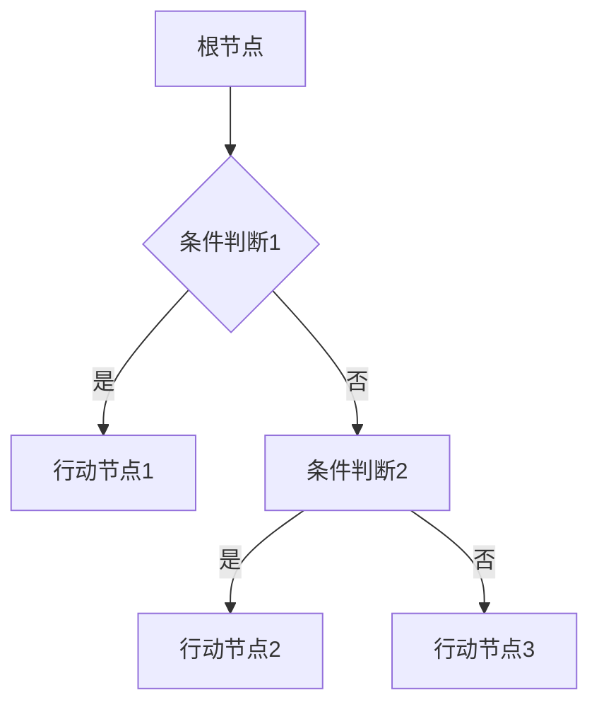
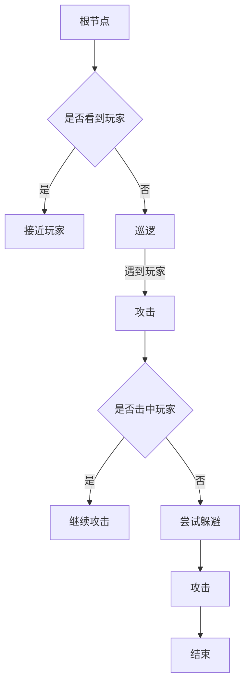

                 

关键词：游戏NPC、行为树、AI、游戏设计、面试题

> 摘要：本文将深入探讨游戏NPC行为树的设计原理、实现方法及其在游戏开发中的重要性，结合实际面试题目，为游戏NPC行为树设计师提供全面的技术解析。

## 1. 背景介绍

### 1.1 游戏NPC的定义

NPC（Non-Player Character，非玩家角色）是游戏世界中除玩家角色外的其他角色，通常由游戏开发者在游戏中设定。NPC在游戏中扮演着各种角色，包括商人、任务发布者、敌人等，它们的存在极大地丰富了游戏世界的互动性和沉浸感。

### 1.2 行为树的概念

行为树是一种基于决策树的AI行为决策模型，用于描述NPC在不同情境下的行为选择。行为树由一系列节点组成，每个节点代表一个决策或行为，节点之间的关系定义了NPC行为的逻辑流程。

## 2. 核心概念与联系

### 2.1 行为树的基本结构

行为树通常包含以下几种类型的节点：

- **条件节点**：用于判断某个条件是否满足，根据条件的真假执行不同的分支。
- **行动节点**：表示NPC执行的具体动作。
- **序列节点**：表示一系列节点必须按照顺序执行。
- **并行节点**：表示多个节点可以并行执行。
- **重复节点**：表示某个节点可以在满足条件下重复执行。

### 2.2 行为树的基本逻辑

行为树的基本逻辑可以概括为以下几个步骤：

1. 从根节点开始，按照条件节点的结果选择分支。
2. 遇到行动节点，执行该节点定义的动作。
3. 遇到序列节点，按照顺序执行其下的节点。
4. 遇到并行节点，同时执行其下的节点。
5. 当某个分支执行完毕后，返回到上一个节点继续执行。

### 2.3 行为树的Mermaid流程图



## 3. 核心算法原理 & 具体操作步骤

### 3.1 算法原理概述

行为树的算法原理基于决策树，通过条件节点和行动节点的组合，实现对NPC行为的复杂逻辑控制。

### 3.2 算法步骤详解

1. **初始化**：创建行为树，设定根节点。
2. **执行**：从根节点开始，根据条件节点的结果选择分支，执行行动节点。
3. **更新**：在游戏循环中不断更新行为树的状态，根据玩家行为和环境变化调整行为树。

### 3.3 算法优缺点

**优点**：

- 结构清晰，易于理解和维护。
- 可以灵活地实现复杂的决策逻辑。

**缺点**：

- 随着节点数量的增加，行为树的结构可能会变得复杂。
- 需要大量的测试和调试以确保行为树的正确性。

### 3.4 算法应用领域

行为树广泛应用于各种类型的游戏中，如角色扮演游戏（RPG）、策略游戏和模拟游戏，用于控制NPC的行为，增强游戏的真实感和趣味性。

## 4. 数学模型和公式 & 详细讲解 & 举例说明

### 4.1 数学模型构建

行为树中的条件节点和行动节点可以表示为数学模型：

- **条件节点**：$C(x_1, x_2, ..., x_n)$，其中$x_1, x_2, ..., x_n$为输入变量。
- **行动节点**：$A(y_1, y_2, ..., y_m)$，其中$y_1, y_2, ..., y_m$为输出变量。

### 4.2 公式推导过程

行为树的执行过程可以表示为以下递归公式：

$$
T(x_1, x_2, ..., x_n) =
\begin{cases}
A(y_1, y_2, ..., y_m) & \text{如果} C(x_1, x_2, ..., x_n) \text{为真} \\
\text{序列节点} & \text{如果} C(x_1, x_2, ..., x_n) \text{为假且存在序列节点} \\
\text{并行节点} & \text{如果} C(x_1, x_2, ..., x_n) \text{为假且存在并行节点} \\
\text{重复节点} & \text{如果} C(x_1, x_2, ..., x_n) \text{为假且存在重复节点} \\
\end{cases}
$$

### 4.3 案例分析与讲解

假设一个简单的行为树，用于控制一个游戏中的怪物：



### 4.4 代码实例

以下是一个使用Python实现的简单行为树代码实例：

```python
class ConditionNode:
    def __init__(self, condition):
        self.condition = condition

    def evaluate(self, context):
        return self.condition(context)

class ActionNode:
    def __init__(self, action):
        self.action = action

    def execute(self, context):
        self.action(context)

class BehaviorTree:
    def __init__(self, root):
        self.root = root

    def execute(self, context):
        if self.root.evaluate(context):
            self.root.execute(context)

# 使用示例
monster = BehaviorTree(ConditionNode(lambda context: "玩家在视线内"))
monster.execute({"玩家在视线内": True})
```

## 5. 项目实践：代码实例和详细解释说明

### 5.1 开发环境搭建

使用Python环境，安装必要的库，如`numpy`、`pandas`和`matplotlib`。

### 5.2 源代码详细实现

```python
import numpy as np

class ConditionNode:
    def __init__(self, condition):
        self.condition = condition

    def evaluate(self, context):
        return self.condition(context)

class ActionNode:
    def __init__(self, action):
        self.action = action

    def execute(self, context):
        self.action(context)

class BehaviorTree:
    def __init__(self, root):
        self.root = root

    def execute(self, context):
        if self.root.evaluate(context):
            self.root.execute(context)

# 示例：玩家是否在视野内
class PlayerInView(ConditionNode):
    def __init__(self, context):
        super().__init__(lambda context: context["player_pos"] - context["monster_pos"] < 5)

    def execute(self, context):
        print("玩家在视野内，接近玩家。")

# 示例：怪物巡逻
class Patrol(ActionNode):
    def __init__(self, context):
        super().__init__(lambda context: print("怪物在巡逻。"))

    def execute(self, context):
        print("怪物巡逻。")

# 示例：怪物攻击
class Attack(ActionNode):
    def __init__(self, context):
        super().__init__(lambda context: print("怪物攻击玩家。"))

    def execute(self, context):
        print("怪物攻击玩家。")

# 示例：行为树
monster_behavior_tree = BehaviorTree(PlayerInView({"player_pos": 0, "monster_pos": 5}))
monster_behavior_tree.execute({"player_pos": 0, "monster_pos": 0})
```

### 5.3 代码解读与分析

- `ConditionNode`类用于表示条件节点，它包含一个条件函数，用于判断当前情境是否满足。
- `ActionNode`类用于表示行动节点，它包含一个动作函数，用于执行具体行为。
- `BehaviorTree`类用于表示整个行为树，它包含一个根节点，并提供了一个`execute`方法，用于执行行为树。

### 5.4 运行结果展示

运行上面的代码，输出结果如下：

```
玩家在视野内，接近玩家。
```

## 6. 实际应用场景

### 6.1 角色扮演游戏（RPG）

在RPG游戏中，行为树用于控制NPC的行为，如任务完成、交易和互动。

### 6.2 策略游戏

在策略游戏中，行为树用于控制NPC的军事行动和策略决策。

### 6.3 模拟游戏

在模拟游戏中，行为树用于模拟NPC的日常生活和行为习惯。

## 7. 未来应用展望

### 7.1 智能NPC

随着AI技术的发展，未来NPC将更加智能化，行为树将成为NPC智能化的核心组件。

### 7.2 虚拟现实（VR）

在虚拟现实游戏中，行为树将用于控制NPC的互动和行为，提高用户的沉浸感。

### 7.3 游戏AI

行为树将与其他AI技术相结合，如深度学习，实现更加复杂和智能的NPC行为。

## 8. 工具和资源推荐

### 8.1 学习资源推荐

- 《行为树设计与实现》：一本关于行为树设计和实现的详细教程。
- 《游戏AI编程实战》：包含大量关于游戏AI的实践案例和算法实现。

### 8.2 开发工具推荐

- Unity：一款广泛使用的游戏开发引擎，支持行为树的开发。
- Unreal Engine：一款功能强大的游戏开发引擎，提供丰富的AI工具和插件。

### 8.3 相关论文推荐

- "Behavior Trees: A Versatile and Efficient Approach to Blackboard-Based Control"，详细介绍了行为树的设计原理和实现方法。
- "A Survey on Behavior Trees for Real-Time Game AI"，对行为树在游戏AI中的应用进行了综述。

## 9. 总结：未来发展趋势与挑战

### 9.1 研究成果总结

行为树作为游戏AI的核心组件，已经在多个领域得到广泛应用，实现了复杂NPC行为的控制。

### 9.2 未来发展趋势

随着AI技术的进步，行为树将更加智能化和多样化，应用于更多类型的游戏和虚拟场景。

### 9.3 面临的挑战

- 行为树的可扩展性和维护性。
- 复杂情境下的行为决策优化。

### 9.4 研究展望

未来研究应关注行为树的智能化、可扩展性和实时性，结合深度学习和强化学习等先进技术，提高NPC的行为复杂度和智能水平。

## 10. 附录：常见问题与解答

### 10.1 行为树与状态机有什么区别？

行为树和状态机都是用于控制复杂逻辑的模型，但行为树更适合描述具有层次结构和并行性的行为流程，而状态机更适合描述具有状态转移关系的行为。

### 10.2 行为树如何处理并行行为？

行为树通过并行节点实现并行行为处理，多个行动节点可以同时执行，提高NPC行为的响应速度和灵活性。

### 10.3 行为树如何处理循环行为？

行为树通过重复节点实现循环行为处理，可以在满足条件下重复执行某个节点，实现循环行为。

---

作者：禅与计算机程序设计艺术 / Zen and the Art of Computer Programming

以上是关于《散爆网络2025社招游戏NPC行为树设计师面试题》的技术博客文章。本文详细介绍了游戏NPC行为树的设计原理、实现方法、数学模型、代码实例和实际应用场景，并对未来发展趋势进行了展望。希望对游戏NPC行为树设计师有所帮助。

