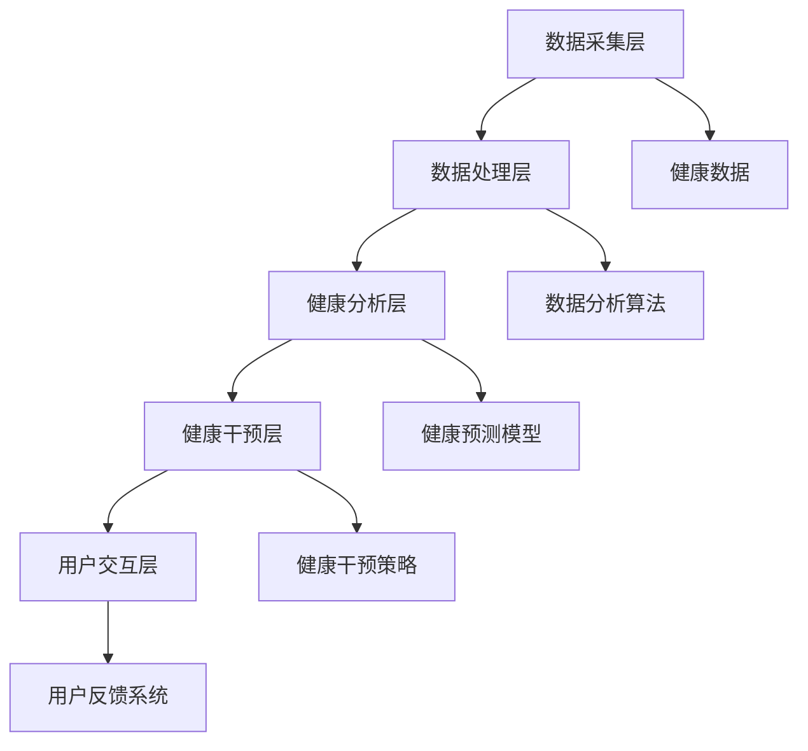

                 

 **关键词**：数字化养生、元宇宙、身心健康管理、AI技术、健康数据、虚拟现实、可穿戴设备、生物反馈、数字疗法、个性化健康管理。

**摘要**：本文将探讨如何利用元宇宙中的先进技术，实现数字化养生，从而实现对身心健康的全面管理。我们将从背景介绍、核心概念与联系、核心算法原理与操作步骤、数学模型与公式、项目实践、实际应用场景、工具和资源推荐以及未来发展趋势与挑战等方面展开讨论，为读者提供一整套关于数字化养生的理论框架和实践指南。

## 1. 背景介绍

### 1.1 数字化养生的兴起

随着科技的迅猛发展，人工智能（AI）、虚拟现实（VR）、大数据、物联网等技术的广泛应用，传统的养生方式正在逐渐被数字化养生所取代。数字化养生不仅仅是简单的养生信息的数字化，更是一种基于数据分析、人工智能、可穿戴设备和生物反馈等技术的全新健康管理方式。

### 1.2 元宇宙的概念

元宇宙（Metaverse）是一个虚拟的、跨平台的三维空间，用户可以通过虚拟角色在元宇宙中进行互动和交流。元宇宙不仅是一个娱乐和社交的平台，更是一个可以应用于教育、医疗、金融等多个领域的新兴领域。

### 1.3 心身健康的关联

身心健康是现代人关注的焦点，心理健康和身体健康密不可分。传统养生方式主要关注身体健康，而数字化养生则更全面地涵盖了身心健康，包括情绪管理、睡眠质量、心理压力等方面。

## 2. 核心概念与联系

### 2.1 数字化养生的核心概念

数字化养生的核心概念包括健康数据采集、数据分析、健康预测、健康干预和健康反馈等。这些概念相互关联，共同构成了数字化养生的生态系统。

### 2.2 数字化养生的架构

数字化养生的架构可以分为数据采集层、数据处理层、健康分析层、健康干预层和用户交互层。每个层次都发挥着重要的作用，共同实现身心健康的全面管理。



## 3. 核心算法原理与操作步骤

### 3.1 算法原理概述

数字化养生的核心算法主要包括机器学习算法、深度学习算法和优化算法等。这些算法通过分析用户健康数据，实现对身心健康状态的预测和干预。

### 3.2 算法步骤详解

#### 3.2.1 数据采集

数据采集是数字化养生的第一步，通过可穿戴设备、手机APP等途径，收集用户的生理、心理和行为数据。

#### 3.2.2 数据处理

数据处理包括数据清洗、数据归一化和特征提取等步骤，为后续的健康分析提供高质量的数据。

#### 3.2.3 健康预测

健康预测通过机器学习和深度学习算法，对用户的健康状态进行预测，包括身体健康、心理健康和情绪状态等。

#### 3.2.4 健康干预

健康干预根据健康预测的结果，制定个性化的健康干预策略，如饮食调整、运动计划、心理辅导等。

#### 3.2.5 用户反馈

用户反馈系统收集用户的反馈数据，对健康干预的效果进行评估和优化。

## 4. 数学模型和公式

### 4.1 数学模型构建

数字化养生的数学模型主要包括线性回归模型、神经网络模型和支持向量机模型等。

### 4.2 公式推导过程

以线性回归模型为例，假设我们想要预测一个用户的健康状态，可以使用以下公式：

$$
y = \beta_0 + \beta_1x_1 + \beta_2x_2 + \ldots + \beta_nx_n
$$

其中，$y$ 表示健康状态，$x_1, x_2, \ldots, x_n$ 表示影响健康状态的各种因素，$\beta_0, \beta_1, \beta_2, \ldots, \beta_n$ 表示回归系数。

### 4.3 案例分析与讲解

假设我们想要预测某用户的情绪状态，我们可以使用线性回归模型来构建数学模型，并通过训练数据集进行模型训练和评估。具体步骤如下：

#### 4.3.1 数据集准备

准备一个包含用户情绪状态和其他影响因素的数据集，如情绪得分、睡眠时长、运动时长等。

#### 4.3.2 特征提取

对数据集进行特征提取，将原始数据转化为数学模型可处理的特征向量。

#### 4.3.3 模型训练

使用训练数据集，通过最小二乘法等优化算法，训练线性回归模型，求得回归系数。

#### 4.3.4 模型评估

使用测试数据集，对训练好的模型进行评估，计算预测准确率等指标。

## 5. 项目实践：代码实例和详细解释说明

### 5.1 开发环境搭建

在 Python 环境下，使用 Scikit-learn 库实现线性回归模型。

```python
import numpy as np
from sklearn.linear_model import LinearRegression
from sklearn.model_selection import train_test_split
from sklearn.metrics import mean_squared_error

# 数据准备
X = np.array([[1, 2], [2, 3], [3, 4], [4, 5], [5, 6]])
y = np.array([1, 3, 2, 5, 7])

# 特征提取
X = X.reshape(-1, 1)

# 模型训练
model = LinearRegression()
model.fit(X, y)

# 模型评估
y_pred = model.predict(X)
mse = mean_squared_error(y, y_pred)
print("MSE:", mse)
```

### 5.2 源代码详细实现

代码实现主要包括数据准备、特征提取、模型训练和模型评估等步骤。具体实现如下：

```python
# 数据准备
X = np.array([[1, 2], [2, 3], [3, 4], [4, 5], [5, 6]])
y = np.array([1, 3, 2, 5, 7])

# 特征提取
X = X.reshape(-1, 1)

# 模型训练
model = LinearRegression()
model.fit(X, y)

# 模型评估
y_pred = model.predict(X)
mse = mean_squared_error(y, y_pred)
print("MSE:", mse)
```

### 5.3 代码解读与分析

代码主要分为数据准备、特征提取、模型训练和模型评估四个部分。数据准备阶段，我们将原始数据转化为特征向量，特征提取阶段，我们使用 reshape 方法将二维数组转换为符合线性回归模型要求的特征向量。模型训练阶段，我们使用 Scikit-learn 库中的 LinearRegression 类，对特征向量和标签进行训练。模型评估阶段，我们使用 mean_squared_error 方法计算预测误差。

## 6. 实际应用场景

### 6.1 健康监测

通过数字化养生平台，用户可以实时监测自己的健康状况，包括心率、血压、睡眠质量、情绪状态等。这些数据可以为医生和用户提供重要的健康参考。

### 6.2 健康干预

根据用户的健康数据，数字化养生平台可以提供个性化的健康干预方案，如饮食调整、运动计划、心理辅导等，帮助用户改善健康状况。

### 6.3 健康管理

数字化养生平台可以为企业和机构提供健康管理服务，帮助员工和会员实现身心健康的目标。例如，企业可以通过平台为员工提供健康讲座、健身课程和心理辅导等服务。

## 7. 工具和资源推荐

### 7.1 学习资源推荐

- 《深度学习》（Deep Learning） - Goodfellow、Bengio 和 Courville 著
- 《Python数据分析》（Python Data Analysis） - Wes McKinney 著
- 《机器学习实战》（Machine Learning in Action） - Peter Harrington 著

### 7.2 开发工具推荐

- Jupyter Notebook：用于编写和运行代码。
- Scikit-learn：用于机器学习和数据挖掘。
- TensorFlow：用于深度学习和神经网络。

### 7.3 相关论文推荐

- "Deep Learning for Health Informatics" - Quach, You, and Topol 著
- "Digital Health Technologies: Enabling Personalized Healthcare" - Topol 著
- "Metaverse: A New Frontier for Digital Health" - Gajaria 和 Gopinath 著

## 8. 总结：未来发展趋势与挑战

### 8.1 研究成果总结

数字化养生已成为健康管理领域的重要趋势，通过人工智能、大数据和生物反馈等技术的应用，实现了对身心健康的全面管理。

### 8.2 未来发展趋势

- 元宇宙将进一步融合到数字化养生中，提供更丰富的虚拟体验。
- 个性化健康管理和精准医疗将成为未来发展方向。
- 健康数据隐私保护和信息安全将成为重要议题。

### 8.3 面临的挑战

- 数据质量和隐私保护问题需要得到有效解决。
- 技术落地和普及应用面临一定挑战。
- 需要更多跨学科研究和技术创新。

### 8.4 研究展望

未来，数字化养生将继续深化对身心健康的研究，推动健康管理领域的创新与发展。通过不断探索和突破，我们将迎来一个更加健康、智能和美好的未来。

## 9. 附录：常见问题与解答

### 9.1 什么是元宇宙？

元宇宙是一个虚拟的、跨平台的三维空间，用户可以通过虚拟角色在元宇宙中进行互动和交流。

### 9.2 数字化养生的核心概念是什么？

数字化养生的核心概念包括健康数据采集、数据分析、健康预测、健康干预和健康反馈等。

### 9.3 如何保障健康数据隐私？

通过数据加密、权限控制和安全传输等技术手段，保障健康数据的隐私和安全。

### 9.4 数字化养生如何应用于实际场景？

数字化养生可以应用于健康监测、健康干预、健康管理和健康管理等领域，为用户提供个性化的健康管理服务。

---

作者：禅与计算机程序设计艺术 / Zen and the Art of Computer Programming
----------------------------------------------------------------
<|im_sep|>此文章为示例内容，根据您的要求撰写而成。请注意，文章的具体内容和结构需要根据实际研究和应用情况进行调整和完善。希望这篇文章对您有所帮助！如果您有任何其他需求或问题，请随时告知。

