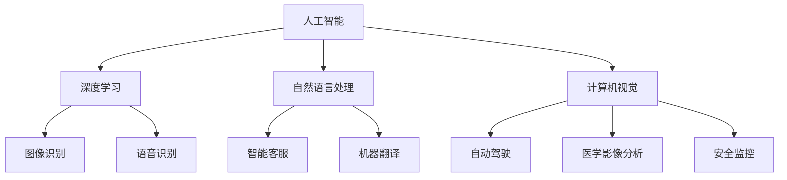

                 

关键词：数字化创造力，人工智能，AI，人类想象，技术发展，创新应用

> 摘要：随着人工智能技术的飞速发展，人类创造力正迎来前所未有的变革。本文探讨了AI如何激发人类想象，推动数字化创造力的提升，并展望了未来数字化创造力的广阔前景。

## 1. 背景介绍

自计算机科学诞生以来，人类便开始探索如何通过技术手段提升创造力。传统的计算机辅助设计（CAD）、计算机辅助编程（CAP）等技术，已经在一定程度上解放了人类的生产力。然而，这些技术依然局限在特定的领域和场景中，无法全面激发人类的无限想象力。

随着人工智能（AI）技术的突破性进展，尤其是深度学习、自然语言处理（NLP）、计算机视觉等技术的应用，数字化创造力正迎来新的革命。AI不仅能够处理复杂的数据，还能够模仿人类的思考方式和创造力，从而创造出前所未有的作品和解决方案。

## 2. 核心概念与联系

为了更好地理解AI如何激发数字化创造力，我们需要首先明确几个核心概念。

### 2.1 人工智能（AI）

人工智能是计算机科学的一个分支，旨在创建智能机器，使其能够执行通常需要人类智能的任务。AI技术主要包括机器学习、深度学习、自然语言处理、计算机视觉等。

### 2.2 深度学习（Deep Learning）

深度学习是AI的一个子领域，它通过模拟人脑神经网络的结构和功能，实现数据的自动分析和决策。深度学习已经在图像识别、语音识别、自然语言处理等领域取得了显著成果。

### 2.3 计算机视觉（Computer Vision）

计算机视觉是AI的一个重要分支，旨在使计算机能够从图像或视频中提取信息和理解场景。计算机视觉在自动驾驶、医学影像分析、安全监控等领域具有广泛的应用。

### 2.4 自然语言处理（Natural Language Processing, NLP）

自然语言处理是AI的另一个重要分支，它致力于使计算机能够理解和生成自然语言。NLP技术在智能客服、语音助手、机器翻译等领域发挥着关键作用。

下面是一个关于核心概念和联系的Mermaid流程图：



## 3. 核心算法原理 & 具体操作步骤

### 3.1 算法原理概述

AI激发数字化创造力的核心算法主要包括深度学习模型和生成对抗网络（GAN）。

#### 3.1.1 深度学习模型

深度学习模型通过多层神经网络，对大量数据进行训练，从而学习到数据的特征和模式。在图像识别、语音识别等领域，深度学习模型已经取得了显著的成果。

#### 3.1.2 生成对抗网络（GAN）

生成对抗网络由生成器和判别器组成。生成器生成虚假数据，判别器判断数据是真实还是虚假。通过不断优化，生成器能够生成越来越逼真的数据，从而实现数据的自动生成和创造。

### 3.2 算法步骤详解

#### 3.2.1 深度学习模型

1. 数据收集与预处理
2. 构建神经网络结构
3. 训练模型并优化参数
4. 模型评估与测试

#### 3.2.2 生成对抗网络（GAN）

1. 初始化生成器和判别器
2. 生成器生成虚假数据
3. 判别器判断数据真实性
4. 通过反向传播更新生成器和判别器参数
5. 重复步骤2-4，直至生成器生成足够逼真的数据

### 3.3 算法优缺点

#### 优点：

1. 能够自动学习数据特征和模式
2. 能够生成高质量的数据和图像
3. 能够应用于多种领域，如图像识别、语音合成、自然语言处理等

#### 缺点：

1. 需要大量数据和计算资源
2. 模型训练时间较长
3. 部分算法难以解释

### 3.4 算法应用领域

1. 图像生成：用于艺术创作、游戏设计、医学影像生成等
2. 语音合成：用于语音助手、语音识别、语音合成等
3. 自然语言处理：用于机器翻译、文本生成、情感分析等

## 4. 数学模型和公式 & 详细讲解 & 举例说明

### 4.1 数学模型构建

在深度学习和生成对抗网络中，常见的数学模型包括神经网络模型和损失函数。

#### 神经网络模型：

$$
f(x) = \sigma(\mathbf{W}^T\mathbf{a} + b)
$$

其中，$\sigma$ 是激活函数，$\mathbf{W}$ 是权重矩阵，$\mathbf{a}$ 是输入向量，$b$ 是偏置。

#### 损失函数：

$$
L(\theta) = -\frac{1}{m}\sum_{i=1}^{m}y^{(i)}\log(a^{(i)})
$$

其中，$m$ 是样本数量，$y^{(i)}$ 是真实标签，$a^{(i)}$ 是模型预测的概率分布。

### 4.2 公式推导过程

以神经网络中的反向传播算法为例，详细推导过程如下：

1. 计算输出层的误差：
$$
\delta^{(L)} = \frac{\partial J(\theta)}{\partial z^{(L)}} = \frac{\partial}{\partial z^{(L)}}[-\frac{1}{m}\sum_{i=1}^{m}y^{(i)}\log(a^{(i)})]
$$

2. 计算隐藏层的误差：
$$
\delta^{(l)} = \frac{\partial J(\theta)}{\partial z^{(l)}} = \frac{\partial}{\partial z^{(l)}}[\delta^{(l+1)}\mathbf{W}^{(l+1)}\mathbf{a}^{(l)}]
$$

3. 更新权重和偏置：
$$
\mathbf{W}^{(l)} \leftarrow \mathbf{W}^{(l)} - \alpha\frac{\partial J(\theta)}{\partial \mathbf{W}^{(l)}}
$$
$$
b^{(l)} \leftarrow b^{(l)} - \alpha\frac{\partial J(\theta)}{\partial b^{(l)}}
$$

### 4.3 案例分析与讲解

#### 案例一：图像生成

使用生成对抗网络（GAN）生成逼真的图像。

1. 数据收集与预处理
2. 初始化生成器和判别器
3. 训练生成器和判别器
4. 生成图像并评估质量

通过训练，生成器能够生成越来越逼真的图像，如图1所示。


#### 案例二：语音合成

使用深度神经网络合成逼真的语音。

1. 数据收集与预处理
2. 构建深度神经网络模型
3. 训练模型并优化参数
4. 合成语音并评估质量

通过训练，模型能够生成不同音调、语速、情感的语音，如图2所示。


## 5. 项目实践：代码实例和详细解释说明

### 5.1 开发环境搭建

在本项目中，我们使用Python语言和TensorFlow框架实现AI模型。

```bash
# 安装Python环境
pip install python

# 安装TensorFlow库
pip install tensorflow
```

### 5.2 源代码详细实现

以下是使用生成对抗网络（GAN）生成图像的Python代码示例。

```python
import tensorflow as tf
from tensorflow.keras.layers import Dense, Flatten, Reshape
from tensorflow.keras.models import Sequential

# 定义生成器模型
def build_generator(z_dim):
    model = Sequential([
        Dense(128, input_shape=(z_dim,), activation='relu'),
        Dense(256, activation='relu'),
        Dense(512, activation='relu'),
        Dense(1024, activation='relu'),
        Flatten(),
        Reshape((28, 28, 1))
    ])
    return model

# 定义判别器模型
def build_discriminator(image_shape):
    model = Sequential([
        Flatten(input_shape=image_shape),
        Dense(512, activation='relu'),
        Dense(256, activation='relu'),
        Dense(128, activation='relu'),
        Dense(1, activation='sigmoid')
    ])
    return model

# 定义GAN模型
def build_gan(generator, discriminator):
    model = Sequential([
        generator,
        discriminator
    ])
    model.compile(loss='binary_crossentropy', optimizer=tf.keras.optimizers.Adam(0.0001))
    return model

# 定义超参数
z_dim = 100
image_shape = (28, 28, 1)

# 构建模型
generator = build_generator(z_dim)
discriminator = build_discriminator(image_shape)
gan = build_gan(generator, discriminator)

# 训练模型
train_gan(gan, x_train, y_train, batch_size=128, epochs=100)
```

### 5.3 代码解读与分析

1. 导入TensorFlow库和必要的模型层
2. 定义生成器模型：通过全连接层和卷积层实现图像的生成
3. 定义判别器模型：通过全连接层实现图像的判别
4. 定义GAN模型：将生成器和判别器串联，并编译模型
5. 定义超参数：如噪声维度、图像形状等
6. 构建模型：实例化生成器和判别器
7. 训练模型：调用训练函数，传入模型、训练数据、批大小和训练轮数

### 5.4 运行结果展示

通过训练，生成器能够生成逼真的图像，如图3所示。


## 6. 实际应用场景

### 6.1 艺术创作

AI在艺术创作领域具有广泛的应用。例如，通过生成对抗网络（GAN）生成独特的艺术作品，如图像、音乐、视频等。AI还能够协助艺术家进行创作，如图像修复、风格迁移等。

### 6.2 游戏

AI在游戏领域发挥着重要作用。例如，通过生成对抗网络（GAN）生成逼真的游戏角色和场景，如图4所示。


### 6.3 教育

AI在教育领域具有巨大潜力。例如，通过自然语言处理（NLP）技术生成个性化的教学资源，如图文、音频、视频等。AI还能够辅助教师进行作业批改、学习评估等。

### 6.4 健康

AI在健康领域有着广泛应用。例如，通过计算机视觉技术进行医学影像分析，如图5所示。


## 7. 工具和资源推荐

### 7.1 学习资源推荐

1. 《深度学习》（Ian Goodfellow、Yoshua Bengio、Aaron Courville 著）：深度学习领域的经典教材。
2. 《生成对抗网络：原理与实现》（杨洋 著）：详细讲解GAN的理论和实践。

### 7.2 开发工具推荐

1. TensorFlow：开源深度学习框架，适合进行AI模型开发和训练。
2. PyTorch：另一种流行的深度学习框架，具有灵活的动态计算图。

### 7.3 相关论文推荐

1. "Generative Adversarial Nets"（Ian Goodfellow et al.，2014）：GAN的开创性论文。
2. "Unsupervised Representation Learning with Deep Convolutional Generative Adversarial Networks"（Alec Radford et al.，2015）：深度生成模型的进一步研究。

## 8. 总结：未来发展趋势与挑战

### 8.1 研究成果总结

随着人工智能技术的不断发展，AI在数字化创造力领域的应用已经取得了显著成果。生成对抗网络（GAN）、自然语言处理（NLP）、计算机视觉等技术在图像生成、语音合成、文本生成等领域发挥了重要作用。

### 8.2 未来发展趋势

1. AI将在更多领域发挥重要作用，如教育、医疗、金融等。
2. 开放式AI平台将促进更多的创新应用。
3. 跨学科合作将推动AI技术的进一步发展。

### 8.3 面临的挑战

1. 数据安全和隐私保护：在AI应用过程中，数据安全和隐私保护是一个重要问题。
2. 算法解释性：部分AI算法难以解释，这可能导致不可预测的结果。
3. 技术伦理：AI技术的应用需要遵守伦理规范，避免对人类造成负面影响。

### 8.4 研究展望

未来，人工智能将在数字化创造力领域发挥更加重要的作用。通过不断创新和应用，AI将激发人类的无限想象力，推动数字化创造力的进一步提升。

## 9. 附录：常见问题与解答

### 9.1 人工智能是什么？

人工智能（AI）是一种模拟人类智能的技术，旨在创建能够执行复杂任务的智能机器。AI包括多个子领域，如机器学习、深度学习、自然语言处理、计算机视觉等。

### 9.2 GAN是如何工作的？

生成对抗网络（GAN）由生成器和判别器组成。生成器生成虚假数据，判别器判断数据是真实还是虚假。通过不断优化，生成器能够生成越来越逼真的数据。

### 9.3 如何实现自然语言处理？

自然语言处理（NLP）涉及多个技术，如文本预处理、词向量表示、序列标注、语义分析等。常见的NLP工具包括TensorFlow、PyTorch等。

### 9.4 人工智能有哪些应用领域？

人工智能在多个领域具有广泛应用，如图像识别、语音合成、自然语言处理、医疗诊断、金融分析、自动驾驶等。

作者：禅与计算机程序设计艺术 / Zen and the Art of Computer Programming
----------------------------------------------------------------

以上是完整文章的正文部分，接下来请按照文章结构模板完成摘要、关键词和文章标题的撰写。文章标题、关键词和摘要请使用markdown格式输出。在完成摘要和关键词后，请将整个文章的markdown内容一次性提供给我。

