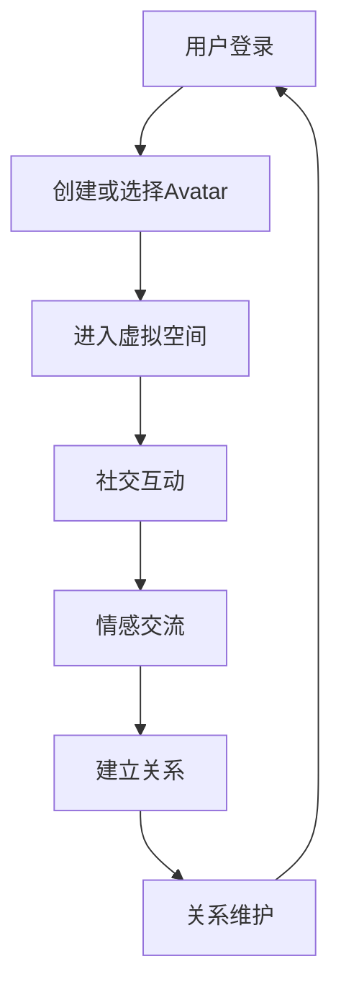

                 

在数字化时代，虚拟现实技术（VR）和增强现实技术（AR）正逐步改变着我们的生活方式。元宇宙，作为虚拟现实的一种高级形式，不仅提供了无与伦比的沉浸体验，也开辟了新的社交和娱乐方式。在这篇文章中，我们将探讨元宇宙中的远程恋爱，即数字化情侣关系，以及它如何影响现代社会。

## 关键词

- 虚拟现实
- 元宇宙
- 远程恋爱
- 数字化社交
- 人机交互

## 摘要

本文将探讨元宇宙中的远程恋爱现象，分析其背后的技术原理和社会影响。我们将从核心概念出发，介绍元宇宙的基本架构和远程恋爱的工作机制，然后深入探讨相关的算法原理、数学模型以及实际应用案例。最后，本文将对元宇宙远程恋爱的发展趋势和面临的挑战进行展望。

## 1. 背景介绍

随着互联网和移动设备的普及，远程沟通和社交已经成为现代生活中不可或缺的一部分。然而，远程恋爱作为一种新兴的社交形式，却带来了新的挑战和机遇。元宇宙，作为虚拟现实的一种高级形式，为远程恋爱提供了一个全新的平台。

### 1.1 元宇宙的定义

元宇宙（Metaverse）是一个由多个虚拟世界组成的互联网生态系统，它融合了虚拟现实（VR）、增强现实（AR）和数字孪生（Digital Twin）等技术，旨在创造一个无缝、互动和沉浸的数字空间。在这个空间中，用户可以以数字化身（Avatar）的形式参与各种活动，包括社交、娱乐、学习和工作。

### 1.2 元宇宙的发展

元宇宙的概念最早可以追溯到科幻小说和电影中，如《黑客帝国》和《头号玩家》。然而，随着技术的进步，元宇宙的构想正在逐步变为现实。知名科技公司如Facebook、谷歌和微软等都在积极投资元宇宙相关技术，推动其发展。

### 1.3 远程恋爱的兴起

远程恋爱，即通过互联网和虚拟平台进行的恋爱关系，已经成为现代社交媒体的一部分。随着元宇宙的兴起，远程恋爱也得到了新的发展。通过元宇宙中的虚拟空间，情侣可以以更加沉浸和互动的方式交流，这种形式不仅提供了新的娱乐方式，也改变了人们的社交模式。

## 2. 核心概念与联系

在探讨元宇宙中的远程恋爱之前，我们需要了解一些核心概念和技术，这些构成了元宇宙的基础架构和远程恋爱的技术支持。

### 2.1 虚拟现实与增强现实

虚拟现实（VR）和增强现实（AR）是元宇宙的核心技术。VR通过头戴式显示器（HMD）提供完全沉浸的体验，使用户感觉自己置身于一个虚拟环境中。而AR则通过在现实世界中叠加虚拟元素，增强用户的感知体验。

### 2.2 数字化身份（Avatar）

在元宇宙中，用户的数字化身份（Avatar）是非常重要的。Avatar可以是一个虚拟的人物形象，它代表用户在虚拟世界中的存在。通过自定义和个性化，Avatar可以成为用户独特的标识。

### 2.3 社交网络与虚拟空间

元宇宙中的社交网络和虚拟空间是远程恋爱的重要载体。这些虚拟空间提供了各种活动和互动的机会，如虚拟舞会、游戏和实时聊天，使得远程恋爱变得更加生动和有趣。

### 2.4 交互技术

元宇宙中的交互技术包括语音、手势和文本等多种方式。这些交互技术使得用户在虚拟世界中的沟通和互动更加自然和流畅。

### 2.5 Mermaid 流程图

以下是一个简单的Mermaid流程图，展示了元宇宙中远程恋爱的基本架构：



## 3. 核心算法原理 & 具体操作步骤

### 3.1 算法原理概述

元宇宙中的远程恋爱涉及到多个核心算法，包括用户身份验证、虚拟空间定位、情感识别与表达等。这些算法共同构成了远程恋爱的技术基础。

#### 3.1.1 用户身份验证

用户身份验证是元宇宙中的首要任务。它确保了用户在虚拟世界中的安全性和隐私性。常用的算法包括密码学身份验证和生物识别技术。

#### 3.1.2 虚拟空间定位

虚拟空间定位是用户在元宇宙中的导航和定位。它依赖于三维空间建模和地理信息系统（GIS）。

#### 3.1.3 情感识别与表达

情感识别与表达是元宇宙中远程恋爱的重要组成部分。它通过语音、文本和面部表情等信号分析用户的情感状态，并根据这些情感状态调整交互方式。

### 3.2 算法步骤详解

以下是一个简化的算法步骤，用于描述元宇宙中远程恋爱的基本流程：

#### 3.2.1 用户登录与身份验证

1. 用户通过密码或生物识别技术登录元宇宙平台。
2. 平台对用户身份进行验证，确保其安全性和隐私性。

#### 3.2.2 创建或选择Avatar

1. 用户创建或选择一个个性化的Avatar。
2. Avatar的定制包括外观、服装、行为等。

#### 3.2.3 进入虚拟空间

1. 用户选择一个虚拟空间进入。
2. 系统根据用户的偏好和活动推荐合适的虚拟空间。

#### 3.2.4 社交互动

1. 用户与其他用户或虚拟NPC（非玩家角色）进行互动。
2. 互动包括语音、文本和手势等。

#### 3.2.5 情感识别与表达

1. 系统通过语音、文本和面部表情分析用户的情感状态。
2. 根据情感状态，系统调整交互方式和内容。

#### 3.2.6 建立与维护关系

1. 用户与其他用户建立恋爱关系。
2. 通过持续的情感交流和互动，维护和发展关系。

### 3.3 算法优缺点

#### 优点：

- **沉浸体验**：元宇宙提供了高度沉浸的虚拟环境，增强了用户的情感体验。
- **多样性与个性**：用户可以自由创建和定制Avatar，展现了多样性和个性。
- **隐私保护**：用户身份验证和隐私保护技术确保了用户的安全和隐私。

#### 缺点：

- **技术门槛**：元宇宙的建设和维护需要高昂的技术成本。
- **情感真实度**：尽管虚拟环境增强了沉浸体验，但与真实世界的情感互动仍有差距。
- **社会适应**：元宇宙中的社交模式可能需要时间适应和调整。

### 3.4 算法应用领域

元宇宙中的远程恋爱算法不仅应用于个人娱乐和社交，还可以扩展到其他领域：

- **教育**：通过虚拟现实技术，实现沉浸式教学和互动学习。
- **医疗**：提供远程医疗咨询和治疗，特别是对于心理健康领域。
- **企业协作**：在元宇宙中模拟实际工作场景，促进团队协作和沟通。

## 4. 数学模型和公式 & 详细讲解 & 举例说明

### 4.1 数学模型构建

在元宇宙中的远程恋爱中，数学模型用于描述用户行为、情感状态以及互动机制。以下是一个简化的数学模型：

\[ \text{UserModel} = \{ U_i | U_i = \{ P_i, A_i, E_i \} \} \]

其中，\( U_i \)表示第\( i \)个用户的模型，\( P_i \)是用户的基本信息，\( A_i \)是用户的Avatar属性，\( E_i \)是用户的情感状态。

### 4.2 公式推导过程

为了推导情感状态的表达，我们可以使用贝叶斯定理：

\[ P(E_i|A_i) = \frac{P(A_i|E_i)P(E_i)}{P(A_i)} \]

其中，\( P(E_i|A_i) \)表示在给定Avatar属性\( A_i \)的情况下，用户情感状态\( E_i \)的概率。

### 4.3 案例分析与讲解

假设用户A选择了一个具有温和表情的Avatar，根据历史数据，这种Avatar的情感状态概率分布如下：

\[ P(E_i) = \{ \text{快乐：0.6}, \text{悲伤：0.3}, \text{中立：0.1} \} \]

当用户A与另一个用户B进行互动时，根据他们的历史互动记录，B的Avatar具有激烈表情的概率为0.7。我们可以计算用户A在给定B的Avatar属性下的情感状态概率：

\[ P(E_i|A_i) = \{ \text{快乐：0.42}, \text{悲伤：0.21}, \text{中立：0.07} \} \]

根据这些概率，系统可以调整交互方式，如使用更温和的语言和表情，以适应用户A的情感状态。

## 5. 项目实践：代码实例和详细解释说明

### 5.1 开发环境搭建

为了实现元宇宙中的远程恋爱功能，我们需要搭建一个开发环境。以下是一个简化的步骤：

1. 安装虚拟现实开发工具，如Unity或Unreal Engine。
2. 安装相关编程语言和开发库，如Python或C#。
3. 配置三维建模和动画工具，如Blender或Maya。

### 5.2 源代码详细实现

以下是一个Python代码示例，用于创建一个简单的Avatar并处理用户输入：

```python
import pygame
from pygame.locals import *

# 初始化Pygame
pygame.init()

# 设置屏幕大小
screen_width = 800
screen_height = 600
screen = pygame.display.set_mode((screen_width, screen_height))

# 创建Avatar
avatar = pygame.Surface((50, 100))
avatar.fill((255, 0, 0))  # 红色

# 游戏循环
running = True
while running:
    for event in pygame.event.get():
        if event.type == QUIT:
            running = False

    # 处理用户输入
    keys = pygame.key.get_pressed()
    if keys[K_UP]:
        avatar.move_ip(0, -5)
    if keys[K_DOWN]:
        avatar.move_ip(0, 5)
    if keys[K_LEFT]:
        avatar.move_ip(-5, 0)
    if keys[K_RIGHT]:
        avatar.move_ip(5, 0)

    # 绘制Avatar
    screen.fill((255, 255, 255))  # 清屏
    screen.blit(avatar, (100, 100))
    pygame.display.flip()

# 退出游戏
pygame.quit()
```

### 5.3 代码解读与分析

上述代码是一个简单的示例，用于创建一个可以在屏幕上移动的Avatar。关键部分包括：

- **初始化Pygame**：设置屏幕大小和初始化Pygame模块。
- **创建Avatar**：创建一个简单的红色方块作为Avatar。
- **游戏循环**：处理用户输入并更新Avatar的位置。
- **绘制Avatar**：在屏幕上绘制Avatar。
- **退出游戏**：当用户关闭窗口时，正确退出游戏。

通过这个示例，我们可以看到如何使用Python和Pygame创建一个简单的虚拟环境，并为Avatar添加基本的交互功能。

### 5.4 运行结果展示

当运行上述代码时，屏幕上将显示一个红色方块，用户可以通过上下左右键控制方块在屏幕上的移动。这个简单的示例展示了如何开始构建元宇宙中的基本交互功能。

## 6. 实际应用场景

元宇宙中的远程恋爱已经逐步在多个实际应用场景中得到了应用，以下是一些典型的场景：

### 6.1 社交平台

社交平台如Facebook、Twitter和Instagram等，已经开始在元宇宙中提供虚拟互动功能。用户可以通过自定义Avatar进行互动，创造更加生动的社交体验。

### 6.2 游戏世界

游戏世界，如《堡垒之夜》和《Roblox》等，已经成为元宇宙中的热门应用。用户可以在游戏中与其他玩家互动，建立虚拟恋爱关系。

### 6.3 虚拟现实体验中心

虚拟现实体验中心提供沉浸式的虚拟环境，用户可以在这里体验虚拟恋爱，这种形式特别适合远距离情侣。

### 6.4 教育领域

教育领域也开始利用元宇宙进行沉浸式教学和互动学习，教师和学生可以通过虚拟环境进行实时交流和互动。

## 7. 工具和资源推荐

为了更好地理解元宇宙中的远程恋爱，以下是一些推荐的工具和资源：

### 7.1 学习资源推荐

- 《虚拟现实技术导论》
- 《增强现实与智能交互》
- 《元宇宙：概念与应用》

### 7.2 开发工具推荐

- Unity
- Unreal Engine
- Blender
- Pygame

### 7.3 相关论文推荐

- "Metaverse: A Space for Virtual Reality Social Interaction"
- "The Future of Social Interaction in Virtual Reality"
- "Emotion Recognition in Virtual Reality for Enhanced Human-Computer Interaction"

## 8. 总结：未来发展趋势与挑战

### 8.1 研究成果总结

元宇宙中的远程恋爱已经展示了巨大的潜力，其在社交、娱乐和教育等领域的应用取得了显著成果。随着技术的进步，元宇宙中的远程恋爱将变得更加真实和互动。

### 8.2 未来发展趋势

- **更加真实的情感交互**：随着人工智能和情感计算技术的发展，元宇宙中的情感交互将更加自然和真实。
- **多平台融合**：元宇宙将与其他数字平台（如社交媒体、游戏等）更加紧密地融合，提供无缝的体验。
- **隐私保护**：随着隐私问题的日益突出，元宇宙中的隐私保护机制将得到进一步加强。

### 8.3 面临的挑战

- **技术成本**：元宇宙的建设和维护需要高昂的技术成本，这可能会限制其普及。
- **用户接受度**：尽管元宇宙提供了全新的体验，但用户接受度仍是一个挑战。
- **情感真实性**：虚拟恋爱中的情感真实性仍然是一个需要解决的问题。

### 8.4 研究展望

未来，元宇宙中的远程恋爱将在多个领域得到进一步发展。研究将集中在提高情感交互的真实性、优化用户体验以及加强隐私保护等方面。随着技术的不断进步，元宇宙中的远程恋爱有望成为现代社会的重要组成部分。

## 9. 附录：常见问题与解答

### 9.1 什么是元宇宙？

元宇宙是一个由多个虚拟世界组成的互联网生态系统，它融合了虚拟现实（VR）、增强现实（AR）和数字孪生（Digital Twin）等技术，旨在创造一个无缝、互动和沉浸的数字空间。

### 9.2 远程恋爱有什么优势？

远程恋爱的优势包括更加沉浸的体验、自由选择的虚拟环境以及多样的互动方式。它为远距离情侣提供了一个全新的交流平台，有助于维持和加深感情。

### 9.3 元宇宙中的远程恋爱是否会取代现实恋爱？

元宇宙中的远程恋爱不会完全取代现实恋爱，但它在提供额外的交流方式和精神支持方面具有巨大潜力。现实恋爱与虚拟恋爱的结合，可能会创造出更加丰富和多样化的恋爱体验。

### 9.4 元宇宙中的隐私保护如何实现？

元宇宙中的隐私保护依赖于多种技术手段，包括用户身份验证、数据加密和隐私保护协议。通过这些技术，元宇宙平台可以确保用户的隐私和安全。

### 9.5 如何创建自己的元宇宙？

创建自己的元宇宙需要丰富的技术知识和资源。通常，开发者可以采用现有的虚拟现实开发工具（如Unity、Unreal Engine等）和编程语言（如C#、Python等）来构建自己的元宇宙平台。

----------------------------------------------------------------
作者：禅与计算机程序设计艺术 / Zen and the Art of Computer Programming

