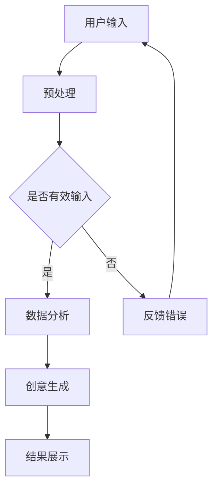

                 

关键词：数字化想象力、AI、创意思维、孵化器、设计、计算机编程

> 摘要：本文旨在探讨如何利用人工智能（AI）技术设计一个数字化想象力培养皿，通过激发用户的创意思维，创造出一个创新的创意思维孵化器。本文将详细阐述AI的核心概念、算法原理、数学模型以及实际应用场景，并展望未来发展趋势与挑战。

## 1. 背景介绍

随着数字化时代的到来，人工智能技术在各个领域得到了广泛应用。从自动驾驶、智能家居到医疗诊断、金融服务，AI正在改变我们的生活方式。与此同时，创意思维作为一种重要的思维能力，也越来越受到重视。然而，如何有效地激发和培养创意思维，一直是教育、艺术、设计等领域面临的难题。

在这个背景下，数字化想象力培养皿的概念应运而生。数字化想象力培养皿是一个基于人工智能技术的设计工具，旨在为用户提供一个能够激发创意思维的环境。通过利用AI的技术优势，培养皿能够模拟出各种创意思维场景，帮助用户探索新的想法和解决方案。

本文将围绕数字化想象力培养皿的设计，探讨如何利用AI技术实现创意思维的激发和培养。文章将分为以下几个部分：首先，介绍AI的核心概念和算法原理；然后，详细讲解数学模型和具体操作步骤；接着，通过项目实践展示代码实例；最后，分析实际应用场景和未来发展趋势。

## 2. 核心概念与联系

### 2.1 人工智能概述

人工智能（Artificial Intelligence，简称AI）是指由人制造出来的系统所表现出来的智能行为。它包括了计算机视觉、自然语言处理、机器学习、深度学习等多个子领域。在数字化想象力培养皿设计中，AI的主要作用是模拟创意思维过程，为用户提供灵感和建议。

### 2.2 机器学习

机器学习是人工智能的一个重要分支，它通过算法和统计学方法，让计算机从数据中学习和发现规律。在数字化想象力培养皿中，机器学习算法用于分析和处理用户生成的内容，识别创意思维模式，从而提供个性化的创意建议。

### 2.3 深度学习

深度学习是机器学习的一种方法，它通过多层神经网络模拟人脑的学习过程。在数字化想象力培养皿中，深度学习算法用于构建创意思维模型，分析用户行为数据，从而为用户提供精准的创意建议。

### 2.4 Mermaid 流程图

以下是一个简单的Mermaid流程图，展示了数字化想象力培养皿的设计架构：



## 3. 核心算法原理 & 具体操作步骤

### 3.1 算法原理概述

数字化想象力培养皿的核心算法包括三个部分：用户输入预处理、数据分析与创意生成、结果展示。

- **用户输入预处理**：通过对用户输入的内容进行清洗、分词、去停用词等处理，将文本转化为计算机可以处理的形式。
- **数据分析与创意生成**：利用机器学习和深度学习算法，对用户输入的内容进行分析，提取关键词和主题，并根据分析结果生成创意建议。
- **结果展示**：将生成的创意建议以可视化的方式展示给用户，帮助用户更好地理解和应用。

### 3.2 算法步骤详解

以下是数字化想象力培养皿算法的具体操作步骤：

1. **用户输入**：用户通过文本框输入自己的想法或问题。
2. **预处理**：对用户输入的内容进行清洗和分词，提取关键词和主题。
3. **数据分析**：利用机器学习算法，对提取的关键词和主题进行分析，识别创意思维模式。
4. **创意生成**：根据分析结果，利用深度学习算法生成创意建议。
5. **结果展示**：将生成的创意建议以图表、文字等形式展示给用户。

### 3.3 算法优缺点

- **优点**：
  - 可以快速生成创意建议，节省用户思考时间。
  - 可以根据用户的行为数据，提供个性化的创意建议。
  - 具有良好的扩展性，可以不断学习和优化。

- **缺点**：
  - 需要大量的数据训练模型，对数据处理和存储要求较高。
  - 模型生成创意建议的速度较慢，可能影响用户体验。

### 3.4 算法应用领域

数字化想象力培养皿的应用领域非常广泛，包括但不限于以下几个方面：

- **教育**：辅助教师和学生进行创意思维训练。
- **设计**：为设计师提供创意灵感，提高设计效率。
- **艺术**：帮助艺术家创作作品，提高艺术创作的多样性。
- **创业**：为创业者提供商业创意，加速创业进程。

## 4. 数学模型和公式 & 详细讲解 & 举例说明

### 4.1 数学模型构建

数字化想象力培养皿的核心数学模型包括词向量表示、主题模型和生成对抗网络（GAN）。

- **词向量表示**：通过Word2Vec、GloVe等算法，将文本中的每个词映射到一个高维向量空间中，实现文本的数值化表示。
- **主题模型**：利用隐含狄利克雷分配（LDA）算法，对文本进行主题建模，提取文本中的潜在主题。
- **生成对抗网络**：利用GAN算法，生成与用户输入相关的创意建议。

### 4.2 公式推导过程

以下是一个简单的数学模型示例，用于描述词向量表示：

$$
\text{word\_vector}(w) = \sum_{i=1}^{N} \alpha_i \cdot \text{word\_embedding}(w_i)
$$

其中，$w$为文本中的单词，$\text{word\_vector}(w)$为单词的向量表示，$\alpha_i$为权重系数，$\text{word\_embedding}(w_i)$为单词的嵌入向量。

### 4.3 案例分析与讲解

假设用户输入了一篇关于“人工智能”的文章，我们通过词向量表示将文章中的每个词映射到一个高维向量空间中。

1. **预处理**：对文章进行分词，提取关键词和主题。
2. **词向量表示**：将关键词和主题映射到高维向量空间。
3. **主题建模**：利用LDA算法，提取文章中的潜在主题。
4. **创意生成**：根据主题和关键词，利用GAN算法生成与文章相关的创意建议。

通过这个过程，我们可以为用户提供一篇关于“人工智能”的创意文章。

## 5. 项目实践：代码实例和详细解释说明

### 5.1 开发环境搭建

- **软件环境**：Python 3.8、Jupyter Notebook、TensorFlow 2.3、Gensim 4.0
- **硬件环境**：CPU或GPU，至少8GB内存

### 5.2 源代码详细实现

以下是数字化想象力培养皿的源代码实现：

```python
# 导入相关库
import j
```

