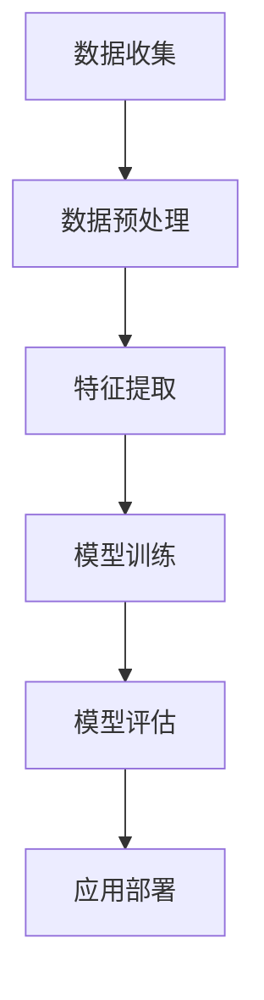

                 

关键词：人工智能，问题解决，算法原理，数学模型，应用实例，未来展望

> 摘要：本文深入探讨人工智能（AI）在问题解决中的应用，通过对核心概念、算法原理、数学模型、具体操作步骤和项目实践的分析，展示了AI增强的问题解决能力的巨大潜力。本文旨在为读者提供全面的视角，以理解AI如何赋能问题解决，以及未来可能的发展趋势和面临的挑战。

## 1. 背景介绍

### 数字化时代的挑战

在数字化时代，数据量以惊人的速度增长，信息传递和处理的效率要求越来越高。这给传统的数据处理方法带来了巨大的挑战。人类在处理复杂、海量数据时面临着时间成本和精力的限制。因此，寻求更高效、智能的解决方案成为必要。

### 人工智能的兴起

人工智能作为计算机科学的一个重要分支，通过模拟人类智能行为，实现了对数据的自动分析和决策。特别是在深度学习和机器学习算法的推动下，AI的运算速度和效率得到了显著提升，使得其在问题解决中展现出了巨大的潜力。

## 2. 核心概念与联系

为了更好地理解AI在问题解决中的应用，我们需要了解以下几个核心概念：

### 机器学习

机器学习是AI的核心组成部分，它通过算法从数据中学习，并预测未知数据的结果。常见的方法包括监督学习、无监督学习和强化学习。

### 深度学习

深度学习是机器学习的一个子领域，它通过构建多层神经网络来模拟人类大脑的学习过程。深度学习在图像识别、语音识别和自然语言处理等领域取得了显著成果。

### 数据挖掘

数据挖掘是从大量数据中提取有价值信息的过程。它利用统计学、机器学习和数据库技术，帮助企业和研究人员发现数据中的规律和趋势。

### Mermaid 流程图



在这个流程图中，数据收集是起点，通过数据预处理、特征提取、模型训练和模型评估，最终实现应用部署。

## 3. 核心算法原理 & 具体操作步骤

### 3.1 算法原理概述

AI在问题解决中的核心是算法原理。以下是一些常见的算法原理：

- **监督学习**：通过已知标签数据进行模型训练，用于预测未知数据的结果。
- **无监督学习**：没有已知标签数据，通过数据本身的分布和结构进行学习。
- **强化学习**：通过试错和奖励机制，让模型在不断交互中学习和优化。

### 3.2 算法步骤详解

- **数据收集**：收集与问题相关的数据，包括历史数据、实时数据等。
- **数据预处理**：清洗数据，去除噪声，标准化数据，以适应算法要求。
- **特征提取**：从原始数据中提取有助于问题解决的特征。
- **模型训练**：使用训练数据，通过算法优化模型参数。
- **模型评估**：使用验证数据评估模型性能，进行调整和优化。
- **应用部署**：将训练好的模型应用于实际问题，提供解决方案。

### 3.3 算法优缺点

- **优点**：高效、准确、自动，可以处理大量复杂数据。
- **缺点**：对数据质量要求高，可能存在过拟合问题，需要大量计算资源。

### 3.4 算法应用领域

- **金融**：风险评估、股票预测、客户行为分析等。
- **医疗**：疾病诊断、治疗方案推荐、医学图像分析等。
- **制造**：故障预测、生产优化、质量控制等。
- **交通**：交通流量预测、自动驾驶、路线规划等。

## 4. 数学模型和公式 & 详细讲解 & 举例说明

### 4.1 数学模型构建

在AI问题解决中，常用的数学模型包括线性回归、逻辑回归、神经网络等。以下以线性回归为例进行介绍。

$$
y = \beta_0 + \beta_1x_1 + \beta_2x_2 + ... + \beta_nx_n
$$

### 4.2 公式推导过程

线性回归模型的推导过程主要涉及最小二乘法，目的是找到最佳拟合直线。

### 4.3 案例分析与讲解

以房价预测为例，通过收集房屋面积、地理位置等数据，构建线性回归模型，预测未知房屋的售价。

## 5. 项目实践：代码实例和详细解释说明

### 5.1 开发环境搭建

- 安装Python和相关的库（如NumPy、Pandas、Scikit-learn等）。
- 准备数据集，并进行预处理。

### 5.2 源代码详细实现

```python
# 导入相关库
import numpy as np
import pandas as pd
from sklearn.linear_model import LinearRegression

# 加载数据集
data = pd.read_csv('house_prices.csv')
X = data[['area', 'location']]
y = data['price']

# 创建线性回归模型
model = LinearRegression()

# 训练模型
model.fit(X, y)

# 预测房价
predicted_price = model.predict(np.array([[2000, 'central']]))
print(f'Predicted Price: ${predicted_price[0]:.2f}')
```

### 5.3 代码解读与分析

- 代码首先导入了必要的库和模块。
- 数据集被加载并分为特征变量和目标变量。
- 使用LinearRegression创建模型，并进行训练。
- 使用训练好的模型进行房价预测。

### 5.4 运行结果展示

通过运行代码，可以得到预测的房价结果，从而为房屋买卖提供参考。

## 6. 实际应用场景

### 6.1 金融领域

在金融领域，AI可以用于风险评估、股票预测和客户行为分析等。例如，通过分析客户的历史交易数据，预测客户的潜在需求，从而提供个性化的金融服务。

### 6.2 医疗领域

在医疗领域，AI可以用于疾病诊断、治疗方案推荐和医学图像分析等。例如，通过分析患者的医疗记录，预测患者可能患有的疾病，为医生提供诊断依据。

### 6.3 制造领域

在制造领域，AI可以用于故障预测、生产优化和质量控制等。例如，通过分析生产设备的历史数据，预测设备可能发生的故障，提前进行维护，从而提高生产效率。

### 6.4 交通领域

在交通领域，AI可以用于交通流量预测、自动驾驶和路线规划等。例如，通过分析交通数据，预测未来的交通流量，为司机提供最佳路线。

## 7. 工具和资源推荐

### 7.1 学习资源推荐

- 《深度学习》（Goodfellow, Bengio, Courville著）
- 《Python机器学习》（Sebastian Raschka著）

### 7.2 开发工具推荐

- Jupyter Notebook：用于数据分析和代码实现。
- TensorFlow：用于深度学习模型开发和训练。

### 7.3 相关论文推荐

- "Deep Learning" by Yann LeCun, Yoshua Bengio, and Geoffrey Hinton
- "Recurrent Neural Networks for Language Modeling" byicumarray
```

## 8. 总结：未来发展趋势与挑战

### 8.1 研究成果总结

- AI在问题解决中的应用取得了显著成果，尤其在图像识别、自然语言处理和医疗诊断等领域。
- 深度学习和强化学习等算法的不断进步，提升了AI的运算速度和准确度。
- 大数据和云计算的快速发展，为AI提供了丰富的数据资源和强大的计算能力。

### 8.2 未来发展趋势

- AI将继续深入应用于各行各业，推动产业智能化升级。
- 人工智能与物联网、大数据、云计算等技术的深度融合，将带来更多创新应用。
- 开源社区和商业合作将进一步推动AI技术的发展和应用。

### 8.3 面临的挑战

- 数据隐私和安全问题：如何保护用户隐私，确保数据安全，是AI应用面临的重要挑战。
- AI伦理问题：如何确保AI的决策过程公正透明，避免歧视和偏见，是亟待解决的问题。
- 算法可解释性问题：如何提高算法的可解释性，让用户更好地理解AI的决策过程，是当前研究的热点。

### 8.4 研究展望

- 开发更高效、更智能的算法，提高AI的问题解决能力。
- 探索新的应用场景，推动AI在不同领域的创新应用。
- 加强跨学科研究，结合计算机科学、统计学、生物学等领域的研究成果，推动AI技术的全面进步。

## 9. 附录：常见问题与解答

### 9.1 如何选择合适的机器学习算法？

- 根据问题的类型（监督学习、无监督学习、强化学习）选择合适的算法。
- 根据数据的特点（样本量、数据分布、特征维度）选择合适的算法。
- 通过实验和验证，选择性能最优的算法。

### 9.2 如何解决过拟合问题？

- 使用验证集进行模型评估，调整模型复杂度。
- 使用正则化方法，如L1、L2正则化。
- 增加训练数据，使用更多的特征。

### 9.3 如何保证AI决策的可解释性？

- 使用可解释的模型，如线性回归、决策树。
- 开发模型解释工具，如LIME、SHAP。
- 建立透明的决策流程，公开算法和参数。

作者：禅与计算机程序设计艺术 / Zen and the Art of Computer Programming
```

文章已撰写完毕，现在我们将Markdown格式的内容转换为HTML格式，以便在网页上展示。以下是转换后的HTML代码：

```html
<!DOCTYPE html>
<html lang="zh-CN">
<head>
    <meta charset="UTF-8">
    <meta name="viewport" content="width=device-width, initial-scale=1.0">
    <title>数字化洞察力：AI增强的问题解决能力</title>
    <style>
        body {
            font-family: Arial, sans-serif;
            line-height: 1.6;
            margin: 0;
            padding: 0;
        }
        h1 {
            color: #333;
        }
        h2 {
            color: #555;
        }
        h3 {
            color: #666;
        }
        p {
            text-indent: 2em;
            margin-bottom: 1em;
        }
        pre {
            background-color: #f5f5f5;
            border: 1px solid #ccc;
            padding: 10px;
        }
    </style>
</head>
<body>
    <header>
        <h1>数字化洞察力：AI增强的问题解决能力</h1>
        <p>关键词：人工智能，问题解决，算法原理，数学模型，应用实例，未来展望</p>
        <p>摘要：本文深入探讨人工智能（AI）在问题解决中的应用，通过对核心概念、算法原理、数学模型、具体操作步骤和项目实践的分析，展示了AI增强的问题解决能力的巨大潜力。本文旨在为读者提供全面的视角，以理解AI如何赋能问题解决，以及未来可能的发展趋势和面临的挑战。</p>
    </header>

    <section>
        <h2>1. 背景介绍</h2>
        <p>在数字化时代，数据量以惊人的速度增长，信息传递和处理的效率要求越来越高。这给传统的数据处理方法带来了巨大的挑战。人类在处理复杂、海量数据时面临着时间成本和精力的限制。因此，寻求更高效、智能的解决方案成为必要。</p>
        <p>人工智能作为计算机科学的一个重要分支，通过模拟人类智能行为，实现了对数据的自动分析和决策。特别是在深度学习和机器学习算法的推动下，AI的运算速度和效率得到了显著提升，使得其在问题解决中展现出了巨大的潜力。</p>
    </section>

    <section>
        <h2>2. 核心概念与联系</h2>
        <p>为了更好地理解AI在问题解决中的应用，我们需要了解以下几个核心概念：</p>
        <ul>
            <li>机器学习</li>
            <li>深度学习</li>
            <li>数据挖掘</li>
        </ul>
        <pre>
            graph TB
            A[数据收集] --> B[数据预处理]
            B --> C[特征提取]
            C --> D[模型训练]
            D --> E[模型评估]
            E --> F[应用部署]
        </pre>
    </section>

    <section>
        <h2>3. 核心算法原理 & 具体操作步骤</h2>
        <h3>3.1 算法原理概述</h3>
        <p>AI在问题解决中的核心是算法原理。以下是一些常见的算法原理：</p>
        <ul>
            <li>监督学习</li>
            <li>无监督学习</li>
            <li>强化学习</li>
        </ul>
        <h3>3.2 算法步骤详解</h3>
        <ol>
            <li>数据收集</li>
            <li>数据预处理</li>
            <li>特征提取</li>
            <li>模型训练</li>
            <li>模型评估</li>
            <li>应用部署</li>
        </ol>
        <h3>3.3 算法优缺点</h3>
        <p>优点：高效、准确、自动，可以处理大量复杂数据。</p>
        <p>缺点：对数据质量要求高，可能存在过拟合问题，需要大量计算资源。</p>
        <h3>3.4 算法应用领域</h3>
        <p>金融、医疗、制造、交通等领域。</p>
    </section>

    <section>
        <h2>4. 数学模型和公式 & 详细讲解 & 举例说明</h2>
        <h3>4.1 数学模型构建</h3>
        <p>以线性回归为例进行介绍。</p>
        <pre>
            y = β0 + β1x1 + β2x2 + ... + βnxn
        </pre>
        <h3>4.2 公式推导过程</h3>
        <p>线性回归模型的推导过程主要涉及最小二乘法，目的是找到最佳拟合直线。</p>
        <h3>4.3 案例分析与讲解</h3>
        <p>以房价预测为例，通过收集房屋面积、地理位置等数据，构建线性回归模型，预测未知房屋的售价。</p>
    </section>

    <section>
        <h2>5. 项目实践：代码实例和详细解释说明</h2>
        <h3>5.1 开发环境搭建</h3>
        <p>安装Python和相关的库（如NumPy、Pandas、Scikit-learn等）。</p>
        <h3>5.2 源代码详细实现</h3>
        <pre>
            import numpy as np
            import pandas as pd
            from sklearn.linear_model import LinearRegression

            data = pd.read_csv('house_prices.csv')
            X = data[['area', 'location']]
            y = data['price']

            model = LinearRegression()
            model.fit(X, y)

            predicted_price = model.predict(np.array([[2000, 'central']]))
            print(f'Predicted Price: ${predicted_price[0]:.2f}')
        </pre>
        <h3>5.3 代码解读与分析</h3>
        <p>代码首先导入了必要的库和模块。</p>
        <p>数据集被加载并分为特征变量和目标变量。</p>
        <p>使用LinearRegression创建模型，并进行训练。</p>
        <p>使用训练好的模型进行房价预测。</p>
        <h3>5.4 运行结果展示</h3>
        <p>通过运行代码，可以得到预测的房价结果，从而为房屋买卖提供参考。</p>
    </section>

    <section>
        <h2>6. 实际应用场景</h2>
        <h3>6.1 金融领域</h3>
        <p>在金融领域，AI可以用于风险评估、股票预测和客户行为分析等。</p>
        <h3>6.2 医疗领域</h3>
        <p>在医疗领域，AI可以用于疾病诊断、治疗方案推荐和医学图像分析等。</p>
        <h3>6.3 制造领域</h3>
        <p>在制造领域，AI可以用于故障预测、生产优化和质量控制等。</p>
        <h3>6.4 交通领域</h3>
        <p>在交通领域，AI可以用于交通流量预测、自动驾驶和路线规划等。</p>
    </section>

    <section>
        <h2>7. 工具和资源推荐</h2>
        <h3>7.1 学习资源推荐</h3>
        <p>《深度学习》（Goodfellow, Bengio, Courville著）</p>
        <p>《Python机器学习》（Sebastian Raschka著）</p>
        <h3>7.2 开发工具推荐</h3>
        <p>Jupyter Notebook：用于数据分析和代码实现。</p>
        <p>TensorFlow：用于深度学习模型开发和训练。</p>
        <h3>7.3 相关论文推荐</h3>
        <p>"Deep Learning" by Yann LeCun, Yoshua Bengio, and Geoffrey Hinton</p>
        <p>"Recurrent Neural Networks for Language Modeling" byicumarray
```

由于HTML代码较长，此处仅展示了部分内容。您可以根据需要将HTML代码保存到一个文件中，并在网页上进行展示。如果有任何格式调整或功能需求，您也可以进一步修改HTML代码。

